cola Report for GDS833
==================

**Date**: 2019-12-25 22:22:04 CET, **cola version**: 1.3.2

----------------------------------------------------------------

<style type='text/css'>

body, td, th {
   font-family: Arial,Helvetica,sans-serif;
   background-color: white;
   font-size: 13px;
  max-width: 800px;
  margin: auto;
  margin-left:210px;
  padding: 0px 10px 0px 10px;
  border-left: 1px solid #EEEEEE;
  line-height: 150%;
}

tt, code, pre {
   font-family: 'DejaVu Sans Mono', 'Droid Sans Mono', 'Lucida Console', Consolas, Monaco, 

monospace;
}

h1 {
   font-size:2.2em;
}

h2 {
   font-size:1.8em;
}

h3 {
   font-size:1.4em;
}

h4 {
   font-size:1.0em;
}

h5 {
   font-size:0.9em;
}

h6 {
   font-size:0.8em;
}

a {
  text-decoration: none;
  color: #0366d6;
}

a:hover {
  text-decoration: underline;
}

a:visited {
   color: #0366d6;
}

pre, img {
  max-width: 100%;
}
pre {
  overflow-x: auto;
}
pre code {
   display: block; padding: 0.5em;
}

code {
  font-size: 92%;
  border: 1px solid #ccc;
}

code[class] {
  background-color: #F8F8F8;
}

table, td, th {
  border: 1px solid #ccc;
}

blockquote {
   color:#666666;
   margin:0;
   padding-left: 1em;
   border-left: 0.5em #EEE solid;
}

hr {
   height: 0px;
   border-bottom: none;
   border-top-width: thin;
   border-top-style: dotted;
   border-top-color: #999999;
}

@media print {
   * {
      background: transparent !important;
      color: black !important;
      filter:none !important;
      -ms-filter: none !important;
   }

   body {
      font-size:12pt;
      max-width:100%;
   }

   a, a:visited {
      text-decoration: underline;
   }

   hr {
      visibility: hidden;
      page-break-before: always;
   }

   pre, blockquote {
      padding-right: 1em;
      page-break-inside: avoid;
   }

   tr, img {
      page-break-inside: avoid;
   }

   img {
      max-width: 100% !important;
   }

   @page :left {
      margin: 15mm 20mm 15mm 10mm;
   }

   @page :right {
      margin: 15mm 10mm 15mm 20mm;
   }

   p, h2, h3 {
      orphans: 3; widows: 3;
   }

   h2, h3 {
      page-break-after: avoid;
   }
}
</style>


## Summary


All available functions which can be applied to this `res_list` object:


```r
res_list
```

```
#> A 'ConsensusPartitionList' object with 24 methods.
#>   On a matrix with 12150 rows and 54 columns.
#>   Top rows are extracted by 'SD, CV, MAD, ATC' methods.
#>   Subgroups are detected by 'hclust, kmeans, skmeans, pam, mclust, NMF' method.
#>   Number of partitions are tried for k = 2, 3, 4, 5, 6.
#>   Performed in total 30000 partitions by row resampling.
#> 
#> Following methods can be applied to this 'ConsensusPartitionList' object:
#>  [1] "cola_report"           "collect_classes"       "collect_plots"         "collect_stats"        
#>  [5] "colnames"              "functional_enrichment" "get_anno_col"          "get_anno"             
#>  [9] "get_classes"           "get_matrix"            "get_membership"        "get_stats"            
#> [13] "is_best_k"             "is_stable_k"           "ncol"                  "nrow"                 
#> [17] "rownames"              "show"                  "suggest_best_k"        "test_to_known_factors"
#> [21] "top_rows_heatmap"      "top_rows_overlap"     
#> 
#> You can get result for a single method by, e.g. object["SD", "hclust"] or object["SD:hclust"]
#> or a subset of methods by object[c("SD", "CV")], c("hclust", "kmeans")]
```

The call of `run_all_consensus_partition_methods()` was:


```
#> run_all_consensus_partition_methods(data = mat, mc.cores = 4, anno = anno)
```

Dimension of the input matrix:


```r
mat = get_matrix(res_list)
dim(mat)
```

```
#> [1] 12150    54
```

### Density distribution

The density distribution for each sample is visualized as in one column in the
following heatmap. The clustering is based on the distance which is the
Kolmogorov-Smirnov statistic between two distributions.


```r
library(ComplexHeatmap)
densityHeatmap(mat, top_annotation = HeatmapAnnotation(df = get_anno(res_list), 
    col = get_anno_col(res_list)), ylab = "value", cluster_columns = TRUE, show_column_names = FALSE,
    mc.cores = 4)
```


### Suggest the best k


Folowing table shows the best `k` (number of partitions) for each combination
of top-value methods and partition methods. Clicking on the method name in
the table goes to the section for a single combination of methods.

[The cola vignette](http://bioconductor.org/packages/devel/bioc/vignettes/cola/inst/doc/cola.html#toc_13)
explains the definition of the metrics used for determining the best
number of partitions.


```r
suggest_best_k(res_list)
```


|                            | The best k| 1-PAC| Mean silhouette| Concordance|   |Optional k |
|:---------------------------|----------:|-----:|---------------:|-----------:|:--|:----------|
|[SD:hclust](#SD-hclust)     |          3| 1.000|           0.934|       0.968|** |           |
|[SD:skmeans](#SD-skmeans)   |          3| 1.000|           0.993|       0.997|** |           |
|[SD:mclust](#SD-mclust)     |          3| 1.000|           0.993|       0.997|** |           |
|[SD:NMF](#SD-NMF)           |          3| 1.000|           0.996|       0.998|** |2          |
|[MAD:kmeans](#MAD-kmeans)   |          3| 1.000|           0.971|       0.965|** |           |
|[MAD:mclust](#MAD-mclust)   |          3| 1.000|           0.974|       0.990|** |           |
|[MAD:NMF](#MAD-NMF)         |          3| 1.000|           0.998|       0.999|** |2          |
|[ATC:hclust](#ATC-hclust)   |          3| 1.000|           0.978|       0.989|** |           |
|[ATC:kmeans](#ATC-kmeans)   |          3| 1.000|           0.953|       0.965|** |           |
|[ATC:pam](#ATC-pam)         |          3| 1.000|           1.000|       1.000|** |2          |
|[ATC:NMF](#ATC-NMF)         |          3| 1.000|           0.973|       0.990|** |2          |
|[SD:kmeans](#SD-kmeans)     |          3| 0.980|           0.978|       0.956|** |           |
|[MAD:skmeans](#MAD-skmeans) |          3| 0.970|           0.960|       0.984|** |2          |
|[SD:pam](#SD-pam)           |          4| 0.969|           0.920|       0.968|** |2,3        |
|[CV:NMF](#CV-NMF)           |          3| 0.964|           0.965|       0.979|** |2          |
|[CV:pam](#CV-pam)           |          3| 0.942|           0.950|       0.976|*  |2          |
|[MAD:hclust](#MAD-hclust)   |          3| 0.940|           0.941|       0.974|*  |2          |
|[MAD:pam](#MAD-pam)         |          5| 0.936|           0.947|       0.965|*  |2,3        |
|[ATC:skmeans](#ATC-skmeans) |          3| 0.916|           0.920|       0.969|*  |           |
|[ATC:mclust](#ATC-mclust)   |          3| 0.912|           0.910|       0.964|*  |           |
|[CV:mclust](#CV-mclust)     |          3| 0.866|           0.948|       0.970|   |           |
|[CV:hclust](#CV-hclust)     |          5| 0.805|           0.827|       0.896|   |           |
|[CV:skmeans](#CV-skmeans)   |          3| 0.776|           0.903|       0.950|   |           |
|[CV:kmeans](#CV-kmeans)     |          3| 0.680|           0.955|       0.933|   |           |

\*\*: 1-PAC > 0.95, \*: 1-PAC > 0.9


### CDF of consensus matrices

Cumulative distribution function curves of consensus matrix for all methods.


```r
collect_plots(res_list, fun = plot_ecdf)
```


### Consensus heatmap

Consensus heatmaps for all methods. ([What is a consensus heatmap?](http://bioconductor.org/packages/devel/bioc/vignettes/cola/inst/doc/cola.html#toc_9))


<style type='text/css'>


.ui-helper-hidden {
	display: none;
}
.ui-helper-hidden-accessible {
	border: 0;
	clip: rect(0 0 0 0);
	height: 1px;
	margin: -1px;
	overflow: hidden;
	padding: 0;
	position: absolute;
	width: 1px;
}
.ui-helper-reset {
	margin: 0;
	padding: 0;
	border: 0;
	outline: 0;
	line-height: 1.3;
	text-decoration: none;
	font-size: 100%;
	list-style: none;
}
.ui-helper-clearfix:before,
.ui-helper-clearfix:after {
	content: "";
	display: table;
	border-collapse: collapse;
}
.ui-helper-clearfix:after {
	clear: both;
}
.ui-helper-zfix {
	width: 100%;
	height: 100%;
	top: 0;
	left: 0;
	position: absolute;
	opacity: 0;
	filter:Alpha(Opacity=0); 
}

.ui-front {
	z-index: 100;
}


.ui-state-disabled {
	cursor: default !important;
	pointer-events: none;
}


.ui-icon {
	display: inline-block;
	vertical-align: middle;
	margin-top: -.25em;
	position: relative;
	text-indent: -99999px;
	overflow: hidden;
	background-repeat: no-repeat;
}

.ui-widget-icon-block {
	left: 50%;
	margin-left: -8px;
	display: block;
}


.ui-widget-overlay {
	position: fixed;
	top: 0;
	left: 0;
	width: 100%;
	height: 100%;
}
.ui-accordion .ui-accordion-header {
	display: block;
	cursor: pointer;
	position: relative;
	margin: 2px 0 0 0;
	padding: .5em .5em .5em .7em;
	font-size: 100%;
}
.ui-accordion .ui-accordion-content {
	padding: 1em 2.2em;
	border-top: 0;
	overflow: auto;
}
.ui-autocomplete {
	position: absolute;
	top: 0;
	left: 0;
	cursor: default;
}
.ui-menu {
	list-style: none;
	padding: 0;
	margin: 0;
	display: block;
	outline: 0;
}
.ui-menu .ui-menu {
	position: absolute;
}
.ui-menu .ui-menu-item {
	margin: 0;
	cursor: pointer;
	
	list-style-image: url("data:image/gif;base64,R0lGODlhAQABAIAAAAAAAP///yH5BAEAAAAALAAAAAABAAEAAAIBRAA7");
}
.ui-menu .ui-menu-item-wrapper {
	position: relative;
	padding: 3px 1em 3px .4em;
}
.ui-menu .ui-menu-divider {
	margin: 5px 0;
	height: 0;
	font-size: 0;
	line-height: 0;
	border-width: 1px 0 0 0;
}
.ui-menu .ui-state-focus,
.ui-menu .ui-state-active {
	margin: -1px;
}


.ui-menu-icons {
	position: relative;
}
.ui-menu-icons .ui-menu-item-wrapper {
	padding-left: 2em;
}


.ui-menu .ui-icon {
	position: absolute;
	top: 0;
	bottom: 0;
	left: .2em;
	margin: auto 0;
}


.ui-menu .ui-menu-icon {
	left: auto;
	right: 0;
}
.ui-button {
	padding: .4em 1em;
	display: inline-block;
	position: relative;
	line-height: normal;
	margin-right: .1em;
	cursor: pointer;
	vertical-align: middle;
	text-align: center;
	-webkit-user-select: none;
	-moz-user-select: none;
	-ms-user-select: none;
	user-select: none;

	
	overflow: visible;
}

.ui-button,
.ui-button:link,
.ui-button:visited,
.ui-button:hover,
.ui-button:active {
	text-decoration: none;
}


.ui-button-icon-only {
	width: 2em;
	box-sizing: border-box;
	text-indent: -9999px;
	white-space: nowrap;
}


input.ui-button.ui-button-icon-only {
	text-indent: 0;
}


.ui-button-icon-only .ui-icon {
	position: absolute;
	top: 50%;
	left: 50%;
	margin-top: -8px;
	margin-left: -8px;
}

.ui-button.ui-icon-notext .ui-icon {
	padding: 0;
	width: 2.1em;
	height: 2.1em;
	text-indent: -9999px;
	white-space: nowrap;

}

input.ui-button.ui-icon-notext .ui-icon {
	width: auto;
	height: auto;
	text-indent: 0;
	white-space: normal;
	padding: .4em 1em;
}


input.ui-button::-moz-focus-inner,
button.ui-button::-moz-focus-inner {
	border: 0;
	padding: 0;
}
.ui-controlgroup {
	vertical-align: middle;
	display: inline-block;
}
.ui-controlgroup > .ui-controlgroup-item {
	float: left;
	margin-left: 0;
	margin-right: 0;
}
.ui-controlgroup > .ui-controlgroup-item:focus,
.ui-controlgroup > .ui-controlgroup-item.ui-visual-focus {
	z-index: 9999;
}
.ui-controlgroup-vertical > .ui-controlgroup-item {
	display: block;
	float: none;
	width: 100%;
	margin-top: 0;
	margin-bottom: 0;
	text-align: left;
}
.ui-controlgroup-vertical .ui-controlgroup-item {
	box-sizing: border-box;
}
.ui-controlgroup .ui-controlgroup-label {
	padding: .4em 1em;
}
.ui-controlgroup .ui-controlgroup-label span {
	font-size: 80%;
}
.ui-controlgroup-horizontal .ui-controlgroup-label + .ui-controlgroup-item {
	border-left: none;
}
.ui-controlgroup-vertical .ui-controlgroup-label + .ui-controlgroup-item {
	border-top: none;
}
.ui-controlgroup-horizontal .ui-controlgroup-label.ui-widget-content {
	border-right: none;
}
.ui-controlgroup-vertical .ui-controlgroup-label.ui-widget-content {
	border-bottom: none;
}


.ui-controlgroup-vertical .ui-spinner-input {

	
	width: 75%;
	width: calc( 100% - 2.4em );
}
.ui-controlgroup-vertical .ui-spinner .ui-spinner-up {
	border-top-style: solid;
}

.ui-checkboxradio-label .ui-icon-background {
	box-shadow: inset 1px 1px 1px #ccc;
	border-radius: .12em;
	border: none;
}
.ui-checkboxradio-radio-label .ui-icon-background {
	width: 16px;
	height: 16px;
	border-radius: 1em;
	overflow: visible;
	border: none;
}
.ui-checkboxradio-radio-label.ui-checkboxradio-checked .ui-icon,
.ui-checkboxradio-radio-label.ui-checkboxradio-checked:hover .ui-icon {
	background-image: none;
	width: 8px;
	height: 8px;
	border-width: 4px;
	border-style: solid;
}
.ui-checkboxradio-disabled {
	pointer-events: none;
}
.ui-datepicker {
	width: 17em;
	padding: .2em .2em 0;
	display: none;
}
.ui-datepicker .ui-datepicker-header {
	position: relative;
	padding: .2em 0;
}
.ui-datepicker .ui-datepicker-prev,
.ui-datepicker .ui-datepicker-next {
	position: absolute;
	top: 2px;
	width: 1.8em;
	height: 1.8em;
}
.ui-datepicker .ui-datepicker-prev-hover,
.ui-datepicker .ui-datepicker-next-hover {
	top: 1px;
}
.ui-datepicker .ui-datepicker-prev {
	left: 2px;
}
.ui-datepicker .ui-datepicker-next {
	right: 2px;
}
.ui-datepicker .ui-datepicker-prev-hover {
	left: 1px;
}
.ui-datepicker .ui-datepicker-next-hover {
	right: 1px;
}
.ui-datepicker .ui-datepicker-prev span,
.ui-datepicker .ui-datepicker-next span {
	display: block;
	position: absolute;
	left: 50%;
	margin-left: -8px;
	top: 50%;
	margin-top: -8px;
}
.ui-datepicker .ui-datepicker-title {
	margin: 0 2.3em;
	line-height: 1.8em;
	text-align: center;
}
.ui-datepicker .ui-datepicker-title select {
	font-size: 1em;
	margin: 1px 0;
}
.ui-datepicker select.ui-datepicker-month,
.ui-datepicker select.ui-datepicker-year {
	width: 45%;
}
.ui-datepicker table {
	width: 100%;
	font-size: .9em;
	border-collapse: collapse;
	margin: 0 0 .4em;
}
.ui-datepicker th {
	padding: .7em .3em;
	text-align: center;
	font-weight: bold;
	border: 0;
}
.ui-datepicker td {
	border: 0;
	padding: 1px;
}
.ui-datepicker td span,
.ui-datepicker td a {
	display: block;
	padding: .2em;
	text-align: right;
	text-decoration: none;
}
.ui-datepicker .ui-datepicker-buttonpane {
	background-image: none;
	margin: .7em 0 0 0;
	padding: 0 .2em;
	border-left: 0;
	border-right: 0;
	border-bottom: 0;
}
.ui-datepicker .ui-datepicker-buttonpane button {
	float: right;
	margin: .5em .2em .4em;
	cursor: pointer;
	padding: .2em .6em .3em .6em;
	width: auto;
	overflow: visible;
}
.ui-datepicker .ui-datepicker-buttonpane button.ui-datepicker-current {
	float: left;
}


.ui-datepicker.ui-datepicker-multi {
	width: auto;
}
.ui-datepicker-multi .ui-datepicker-group {
	float: left;
}
.ui-datepicker-multi .ui-datepicker-group table {
	width: 95%;
	margin: 0 auto .4em;
}
.ui-datepicker-multi-2 .ui-datepicker-group {
	width: 50%;
}
.ui-datepicker-multi-3 .ui-datepicker-group {
	width: 33.3%;
}
.ui-datepicker-multi-4 .ui-datepicker-group {
	width: 25%;
}
.ui-datepicker-multi .ui-datepicker-group-last .ui-datepicker-header,
.ui-datepicker-multi .ui-datepicker-group-middle .ui-datepicker-header {
	border-left-width: 0;
}
.ui-datepicker-multi .ui-datepicker-buttonpane {
	clear: left;
}
.ui-datepicker-row-break {
	clear: both;
	width: 100%;
	font-size: 0;
}


.ui-datepicker-rtl {
	direction: rtl;
}
.ui-datepicker-rtl .ui-datepicker-prev {
	right: 2px;
	left: auto;
}
.ui-datepicker-rtl .ui-datepicker-next {
	left: 2px;
	right: auto;
}
.ui-datepicker-rtl .ui-datepicker-prev:hover {
	right: 1px;
	left: auto;
}
.ui-datepicker-rtl .ui-datepicker-next:hover {
	left: 1px;
	right: auto;
}
.ui-datepicker-rtl .ui-datepicker-buttonpane {
	clear: right;
}
.ui-datepicker-rtl .ui-datepicker-buttonpane button {
	float: left;
}
.ui-datepicker-rtl .ui-datepicker-buttonpane button.ui-datepicker-current,
.ui-datepicker-rtl .ui-datepicker-group {
	float: right;
}
.ui-datepicker-rtl .ui-datepicker-group-last .ui-datepicker-header,
.ui-datepicker-rtl .ui-datepicker-group-middle .ui-datepicker-header {
	border-right-width: 0;
	border-left-width: 1px;
}


.ui-datepicker .ui-icon {
	display: block;
	text-indent: -99999px;
	overflow: hidden;
	background-repeat: no-repeat;
	left: .5em;
	top: .3em;
}
.ui-dialog {
	position: absolute;
	top: 0;
	left: 0;
	padding: .2em;
	outline: 0;
}
.ui-dialog .ui-dialog-titlebar {
	padding: .4em 1em;
	position: relative;
}
.ui-dialog .ui-dialog-title {
	float: left;
	margin: .1em 0;
	white-space: nowrap;
	width: 90%;
	overflow: hidden;
	text-overflow: ellipsis;
}
.ui-dialog .ui-dialog-titlebar-close {
	position: absolute;
	right: .3em;
	top: 50%;
	width: 20px;
	margin: -10px 0 0 0;
	padding: 1px;
	height: 20px;
}
.ui-dialog .ui-dialog-content {
	position: relative;
	border: 0;
	padding: .5em 1em;
	background: none;
	overflow: auto;
}
.ui-dialog .ui-dialog-buttonpane {
	text-align: left;
	border-width: 1px 0 0 0;
	background-image: none;
	margin-top: .5em;
	padding: .3em 1em .5em .4em;
}
.ui-dialog .ui-dialog-buttonpane .ui-dialog-buttonset {
	float: right;
}
.ui-dialog .ui-dialog-buttonpane button {
	margin: .5em .4em .5em 0;
	cursor: pointer;
}
.ui-dialog .ui-resizable-n {
	height: 2px;
	top: 0;
}
.ui-dialog .ui-resizable-e {
	width: 2px;
	right: 0;
}
.ui-dialog .ui-resizable-s {
	height: 2px;
	bottom: 0;
}
.ui-dialog .ui-resizable-w {
	width: 2px;
	left: 0;
}
.ui-dialog .ui-resizable-se,
.ui-dialog .ui-resizable-sw,
.ui-dialog .ui-resizable-ne,
.ui-dialog .ui-resizable-nw {
	width: 7px;
	height: 7px;
}
.ui-dialog .ui-resizable-se {
	right: 0;
	bottom: 0;
}
.ui-dialog .ui-resizable-sw {
	left: 0;
	bottom: 0;
}
.ui-dialog .ui-resizable-ne {
	right: 0;
	top: 0;
}
.ui-dialog .ui-resizable-nw {
	left: 0;
	top: 0;
}
.ui-draggable .ui-dialog-titlebar {
	cursor: move;
}
.ui-draggable-handle {
	-ms-touch-action: none;
	touch-action: none;
}
.ui-resizable {
	position: relative;
}
.ui-resizable-handle {
	position: absolute;
	font-size: 0.1px;
	display: block;
	-ms-touch-action: none;
	touch-action: none;
}
.ui-resizable-disabled .ui-resizable-handle,
.ui-resizable-autohide .ui-resizable-handle {
	display: none;
}
.ui-resizable-n {
	cursor: n-resize;
	height: 7px;
	width: 100%;
	top: -5px;
	left: 0;
}
.ui-resizable-s {
	cursor: s-resize;
	height: 7px;
	width: 100%;
	bottom: -5px;
	left: 0;
}
.ui-resizable-e {
	cursor: e-resize;
	width: 7px;
	right: -5px;
	top: 0;
	height: 100%;
}
.ui-resizable-w {
	cursor: w-resize;
	width: 7px;
	left: -5px;
	top: 0;
	height: 100%;
}
.ui-resizable-se {
	cursor: se-resize;
	width: 12px;
	height: 12px;
	right: 1px;
	bottom: 1px;
}
.ui-resizable-sw {
	cursor: sw-resize;
	width: 9px;
	height: 9px;
	left: -5px;
	bottom: -5px;
}
.ui-resizable-nw {
	cursor: nw-resize;
	width: 9px;
	height: 9px;
	left: -5px;
	top: -5px;
}
.ui-resizable-ne {
	cursor: ne-resize;
	width: 9px;
	height: 9px;
	right: -5px;
	top: -5px;
}
.ui-progressbar {
	height: 2em;
	text-align: left;
	overflow: hidden;
}
.ui-progressbar .ui-progressbar-value {
	margin: -1px;
	height: 100%;
}
.ui-progressbar .ui-progressbar-overlay {
	background: url("data:image/gif;base64,R0lGODlhKAAoAIABAAAAAP///yH/C05FVFNDQVBFMi4wAwEAAAAh+QQJAQABACwAAAAAKAAoAAACkYwNqXrdC52DS06a7MFZI+4FHBCKoDeWKXqymPqGqxvJrXZbMx7Ttc+w9XgU2FB3lOyQRWET2IFGiU9m1frDVpxZZc6bfHwv4c1YXP6k1Vdy292Fb6UkuvFtXpvWSzA+HycXJHUXiGYIiMg2R6W459gnWGfHNdjIqDWVqemH2ekpObkpOlppWUqZiqr6edqqWQAAIfkECQEAAQAsAAAAACgAKAAAApSMgZnGfaqcg1E2uuzDmmHUBR8Qil95hiPKqWn3aqtLsS18y7G1SzNeowWBENtQd+T1JktP05nzPTdJZlR6vUxNWWjV+vUWhWNkWFwxl9VpZRedYcflIOLafaa28XdsH/ynlcc1uPVDZxQIR0K25+cICCmoqCe5mGhZOfeYSUh5yJcJyrkZWWpaR8doJ2o4NYq62lAAACH5BAkBAAEALAAAAAAoACgAAAKVDI4Yy22ZnINRNqosw0Bv7i1gyHUkFj7oSaWlu3ovC8GxNso5fluz3qLVhBVeT/Lz7ZTHyxL5dDalQWPVOsQWtRnuwXaFTj9jVVh8pma9JjZ4zYSj5ZOyma7uuolffh+IR5aW97cHuBUXKGKXlKjn+DiHWMcYJah4N0lYCMlJOXipGRr5qdgoSTrqWSq6WFl2ypoaUAAAIfkECQEAAQAsAAAAACgAKAAAApaEb6HLgd/iO7FNWtcFWe+ufODGjRfoiJ2akShbueb0wtI50zm02pbvwfWEMWBQ1zKGlLIhskiEPm9R6vRXxV4ZzWT2yHOGpWMyorblKlNp8HmHEb/lCXjcW7bmtXP8Xt229OVWR1fod2eWqNfHuMjXCPkIGNileOiImVmCOEmoSfn3yXlJWmoHGhqp6ilYuWYpmTqKUgAAIfkECQEAAQAsAAAAACgAKAAAApiEH6kb58biQ3FNWtMFWW3eNVcojuFGfqnZqSebuS06w5V80/X02pKe8zFwP6EFWOT1lDFk8rGERh1TTNOocQ61Hm4Xm2VexUHpzjymViHrFbiELsefVrn6XKfnt2Q9G/+Xdie499XHd2g4h7ioOGhXGJboGAnXSBnoBwKYyfioubZJ2Hn0RuRZaflZOil56Zp6iioKSXpUAAAh+QQJAQABACwAAAAAKAAoAAACkoQRqRvnxuI7kU1a1UU5bd5tnSeOZXhmn5lWK3qNTWvRdQxP8qvaC+/yaYQzXO7BMvaUEmJRd3TsiMAgswmNYrSgZdYrTX6tSHGZO73ezuAw2uxuQ+BbeZfMxsexY35+/Qe4J1inV0g4x3WHuMhIl2jXOKT2Q+VU5fgoSUI52VfZyfkJGkha6jmY+aaYdirq+lQAACH5BAkBAAEALAAAAAAoACgAAAKWBIKpYe0L3YNKToqswUlvznigd4wiR4KhZrKt9Upqip61i9E3vMvxRdHlbEFiEXfk9YARYxOZZD6VQ2pUunBmtRXo1Lf8hMVVcNl8JafV38aM2/Fu5V16Bn63r6xt97j09+MXSFi4BniGFae3hzbH9+hYBzkpuUh5aZmHuanZOZgIuvbGiNeomCnaxxap2upaCZsq+1kAACH5BAkBAAEALAAAAAAoACgAAAKXjI8By5zf4kOxTVrXNVlv1X0d8IGZGKLnNpYtm8Lr9cqVeuOSvfOW79D9aDHizNhDJidFZhNydEahOaDH6nomtJjp1tutKoNWkvA6JqfRVLHU/QUfau9l2x7G54d1fl995xcIGAdXqMfBNadoYrhH+Mg2KBlpVpbluCiXmMnZ2Sh4GBqJ+ckIOqqJ6LmKSllZmsoq6wpQAAAh+QQJAQABACwAAAAAKAAoAAAClYx/oLvoxuJDkU1a1YUZbJ59nSd2ZXhWqbRa2/gF8Gu2DY3iqs7yrq+xBYEkYvFSM8aSSObE+ZgRl1BHFZNr7pRCavZ5BW2142hY3AN/zWtsmf12p9XxxFl2lpLn1rseztfXZjdIWIf2s5dItwjYKBgo9yg5pHgzJXTEeGlZuenpyPmpGQoKOWkYmSpaSnqKileI2FAAACH5BAkBAAEALAAAAAAoACgAAAKVjB+gu+jG4kORTVrVhRlsnn2dJ3ZleFaptFrb+CXmO9OozeL5VfP99HvAWhpiUdcwkpBH3825AwYdU8xTqlLGhtCosArKMpvfa1mMRae9VvWZfeB2XfPkeLmm18lUcBj+p5dnN8jXZ3YIGEhYuOUn45aoCDkp16hl5IjYJvjWKcnoGQpqyPlpOhr3aElaqrq56Bq7VAAAOw==");
	height: 100%;
	filter: alpha(opacity=25); 
	opacity: 0.25;
}
.ui-progressbar-indeterminate .ui-progressbar-value {
	background-image: none;
}
.ui-selectable {
	-ms-touch-action: none;
	touch-action: none;
}
.ui-selectable-helper {
	position: absolute;
	z-index: 100;
	border: 1px dotted black;
}
.ui-selectmenu-menu {
	padding: 0;
	margin: 0;
	position: absolute;
	top: 0;
	left: 0;
	display: none;
}
.ui-selectmenu-menu .ui-menu {
	overflow: auto;
	overflow-x: hidden;
	padding-bottom: 1px;
}
.ui-selectmenu-menu .ui-menu .ui-selectmenu-optgroup {
	font-size: 1em;
	font-weight: bold;
	line-height: 1.5;
	padding: 2px 0.4em;
	margin: 0.5em 0 0 0;
	height: auto;
	border: 0;
}
.ui-selectmenu-open {
	display: block;
}
.ui-selectmenu-text {
	display: block;
	margin-right: 20px;
	overflow: hidden;
	text-overflow: ellipsis;
}
.ui-selectmenu-button.ui-button {
	text-align: left;
	white-space: nowrap;
	width: 14em;
}
.ui-selectmenu-icon.ui-icon {
	float: right;
	margin-top: 0;
}
.ui-slider {
	position: relative;
	text-align: left;
}
.ui-slider .ui-slider-handle {
	position: absolute;
	z-index: 2;
	width: 1.2em;
	height: 1.2em;
	cursor: default;
	-ms-touch-action: none;
	touch-action: none;
}
.ui-slider .ui-slider-range {
	position: absolute;
	z-index: 1;
	font-size: .7em;
	display: block;
	border: 0;
	background-position: 0 0;
}


.ui-slider.ui-state-disabled .ui-slider-handle,
.ui-slider.ui-state-disabled .ui-slider-range {
	filter: inherit;
}

.ui-slider-horizontal {
	height: .8em;
}
.ui-slider-horizontal .ui-slider-handle {
	top: -.3em;
	margin-left: -.6em;
}
.ui-slider-horizontal .ui-slider-range {
	top: 0;
	height: 100%;
}
.ui-slider-horizontal .ui-slider-range-min {
	left: 0;
}
.ui-slider-horizontal .ui-slider-range-max {
	right: 0;
}

.ui-slider-vertical {
	width: .8em;
	height: 100px;
}
.ui-slider-vertical .ui-slider-handle {
	left: -.3em;
	margin-left: 0;
	margin-bottom: -.6em;
}
.ui-slider-vertical .ui-slider-range {
	left: 0;
	width: 100%;
}
.ui-slider-vertical .ui-slider-range-min {
	bottom: 0;
}
.ui-slider-vertical .ui-slider-range-max {
	top: 0;
}
.ui-sortable-handle {
	-ms-touch-action: none;
	touch-action: none;
}
.ui-spinner {
	position: relative;
	display: inline-block;
	overflow: hidden;
	padding: 0;
	vertical-align: middle;
}
.ui-spinner-input {
	border: none;
	background: none;
	color: inherit;
	padding: .222em 0;
	margin: .2em 0;
	vertical-align: middle;
	margin-left: .4em;
	margin-right: 2em;
}
.ui-spinner-button {
	width: 1.6em;
	height: 50%;
	font-size: .5em;
	padding: 0;
	margin: 0;
	text-align: center;
	position: absolute;
	cursor: default;
	display: block;
	overflow: hidden;
	right: 0;
}

.ui-spinner a.ui-spinner-button {
	border-top-style: none;
	border-bottom-style: none;
	border-right-style: none;
}
.ui-spinner-up {
	top: 0;
}
.ui-spinner-down {
	bottom: 0;
}
.ui-tabs {
	position: relative;
	padding: .2em;
}
.ui-tabs .ui-tabs-nav {
	margin: 0;
	padding: .2em .2em 0;
}
.ui-tabs .ui-tabs-nav li {
	list-style: none;
	float: left;
	position: relative;
	top: 0;
	margin: 1px .2em 0 0;
	border-bottom-width: 0;
	padding: 0;
	white-space: nowrap;
}
.ui-tabs .ui-tabs-nav .ui-tabs-anchor {
	float: left;
	padding: .5em 1em;
	text-decoration: none;
}
.ui-tabs .ui-tabs-nav li.ui-tabs-active {
	margin-bottom: -1px;
	padding-bottom: 1px;
}
.ui-tabs .ui-tabs-nav li.ui-tabs-active .ui-tabs-anchor,
.ui-tabs .ui-tabs-nav li.ui-state-disabled .ui-tabs-anchor,
.ui-tabs .ui-tabs-nav li.ui-tabs-loading .ui-tabs-anchor {
	cursor: text;
}
.ui-tabs-collapsible .ui-tabs-nav li.ui-tabs-active .ui-tabs-anchor {
	cursor: pointer;
}
.ui-tabs .ui-tabs-panel {
	display: block;
	border-width: 0;
	padding: 1em 1.4em;
	background: none;
}
.ui-tooltip {
	padding: 8px;
	position: absolute;
	z-index: 9999;
	max-width: 300px;
}
body .ui-tooltip {
	border-width: 2px;
}

.ui-widget {
	font-family: Arial,Helvetica,sans-serif;
	font-size: 1em;
}
.ui-widget .ui-widget {
	font-size: 1em;
}
.ui-widget input,
.ui-widget select,
.ui-widget textarea,
.ui-widget button {
	font-family: Arial,Helvetica,sans-serif;
	font-size: 1em;
}
.ui-widget.ui-widget-content {
	border: 1px solid #c5c5c5;
}
.ui-widget-content {
	border: 1px solid #dddddd;
	background: #ffffff;
	color: #333333;
}
.ui-widget-content a {
	color: #333333;
}
.ui-widget-header {
	border: 1px solid #dddddd;
	background: #e9e9e9;
	color: #333333;
	font-weight: bold;
}
.ui-widget-header a {
	color: #333333;
}


.ui-state-default,
.ui-widget-content .ui-state-default,
.ui-widget-header .ui-state-default,
.ui-button,


html .ui-button.ui-state-disabled:hover,
html .ui-button.ui-state-disabled:active {
	border: 1px solid #c5c5c5;
	background: #f6f6f6;
	font-weight: normal;
	color: #454545;
}
.ui-state-default a,
.ui-state-default a:link,
.ui-state-default a:visited,
a.ui-button,
a:link.ui-button,
a:visited.ui-button,
.ui-button {
	color: #454545;
	text-decoration: none;
}
.ui-state-hover,
.ui-widget-content .ui-state-hover,
.ui-widget-header .ui-state-hover,
.ui-state-focus,
.ui-widget-content .ui-state-focus,
.ui-widget-header .ui-state-focus,
.ui-button:hover,
.ui-button:focus {
	border: 1px solid #cccccc;
	background: #ededed;
	font-weight: normal;
	color: #2b2b2b;
}
.ui-state-hover a,
.ui-state-hover a:hover,
.ui-state-hover a:link,
.ui-state-hover a:visited,
.ui-state-focus a,
.ui-state-focus a:hover,
.ui-state-focus a:link,
.ui-state-focus a:visited,
a.ui-button:hover,
a.ui-button:focus {
	color: #2b2b2b;
	text-decoration: none;
}

.ui-visual-focus {
	box-shadow: 0 0 3px 1px rgb(94, 158, 214);
}
.ui-state-active,
.ui-widget-content .ui-state-active,
.ui-widget-header .ui-state-active,
a.ui-button:active,
.ui-button:active,
.ui-button.ui-state-active:hover {
	border: 1px solid #003eff;
	background: #007fff;
	font-weight: normal;
	color: #ffffff;
}
.ui-icon-background,
.ui-state-active .ui-icon-background {
	border: #003eff;
	background-color: #ffffff;
}
.ui-state-active a,
.ui-state-active a:link,
.ui-state-active a:visited {
	color: #ffffff;
	text-decoration: none;
}


.ui-state-highlight,
.ui-widget-content .ui-state-highlight,
.ui-widget-header .ui-state-highlight {
	border: 1px solid #dad55e;
	background: #fffa90;
	color: #777620;
}
.ui-state-checked {
	border: 1px solid #dad55e;
	background: #fffa90;
}
.ui-state-highlight a,
.ui-widget-content .ui-state-highlight a,
.ui-widget-header .ui-state-highlight a {
	color: #777620;
}
.ui-state-error,
.ui-widget-content .ui-state-error,
.ui-widget-header .ui-state-error {
	border: 1px solid #f1a899;
	background: #fddfdf;
	color: #5f3f3f;
}
.ui-state-error a,
.ui-widget-content .ui-state-error a,
.ui-widget-header .ui-state-error a {
	color: #5f3f3f;
}
.ui-state-error-text,
.ui-widget-content .ui-state-error-text,
.ui-widget-header .ui-state-error-text {
	color: #5f3f3f;
}
.ui-priority-primary,
.ui-widget-content .ui-priority-primary,
.ui-widget-header .ui-priority-primary {
	font-weight: bold;
}
.ui-priority-secondary,
.ui-widget-content .ui-priority-secondary,
.ui-widget-header .ui-priority-secondary {
	opacity: .7;
	filter:Alpha(Opacity=70); 
	font-weight: normal;
}
.ui-state-disabled,
.ui-widget-content .ui-state-disabled,
.ui-widget-header .ui-state-disabled {
	opacity: .35;
	filter:Alpha(Opacity=35); 
	background-image: none;
}
.ui-state-disabled .ui-icon {
	filter:Alpha(Opacity=35); 
}


.ui-icon {
	width: 16px;
	height: 16px;
}
.ui-icon,
.ui-widget-content .ui-icon {
	background-image: url("images/ui-icons_444444_256x240.png");
}
.ui-widget-header .ui-icon {
	background-image: url("images/ui-icons_444444_256x240.png");
}
.ui-state-hover .ui-icon,
.ui-state-focus .ui-icon,
.ui-button:hover .ui-icon,
.ui-button:focus .ui-icon {
	background-image: url("images/ui-icons_555555_256x240.png");
}
.ui-state-active .ui-icon,
.ui-button:active .ui-icon {
	background-image: url("images/ui-icons_ffffff_256x240.png");
}
.ui-state-highlight .ui-icon,
.ui-button .ui-state-highlight.ui-icon {
	background-image: url("images/ui-icons_777620_256x240.png");
}
.ui-state-error .ui-icon,
.ui-state-error-text .ui-icon {
	background-image: url("images/ui-icons_cc0000_256x240.png");
}
.ui-button .ui-icon {
	background-image: url("images/ui-icons_777777_256x240.png");
}


.ui-icon-blank { background-position: 16px 16px; }
.ui-icon-caret-1-n { background-position: 0 0; }
.ui-icon-caret-1-ne { background-position: -16px 0; }
.ui-icon-caret-1-e { background-position: -32px 0; }
.ui-icon-caret-1-se { background-position: -48px 0; }
.ui-icon-caret-1-s { background-position: -65px 0; }
.ui-icon-caret-1-sw { background-position: -80px 0; }
.ui-icon-caret-1-w { background-position: -96px 0; }
.ui-icon-caret-1-nw { background-position: -112px 0; }
.ui-icon-caret-2-n-s { background-position: -128px 0; }
.ui-icon-caret-2-e-w { background-position: -144px 0; }
.ui-icon-triangle-1-n { background-position: 0 -16px; }
.ui-icon-triangle-1-ne { background-position: -16px -16px; }
.ui-icon-triangle-1-e { background-position: -32px -16px; }
.ui-icon-triangle-1-se { background-position: -48px -16px; }
.ui-icon-triangle-1-s { background-position: -65px -16px; }
.ui-icon-triangle-1-sw { background-position: -80px -16px; }
.ui-icon-triangle-1-w { background-position: -96px -16px; }
.ui-icon-triangle-1-nw { background-position: -112px -16px; }
.ui-icon-triangle-2-n-s { background-position: -128px -16px; }
.ui-icon-triangle-2-e-w { background-position: -144px -16px; }
.ui-icon-arrow-1-n { background-position: 0 -32px; }
.ui-icon-arrow-1-ne { background-position: -16px -32px; }
.ui-icon-arrow-1-e { background-position: -32px -32px; }
.ui-icon-arrow-1-se { background-position: -48px -32px; }
.ui-icon-arrow-1-s { background-position: -65px -32px; }
.ui-icon-arrow-1-sw { background-position: -80px -32px; }
.ui-icon-arrow-1-w { background-position: -96px -32px; }
.ui-icon-arrow-1-nw { background-position: -112px -32px; }
.ui-icon-arrow-2-n-s { background-position: -128px -32px; }
.ui-icon-arrow-2-ne-sw { background-position: -144px -32px; }
.ui-icon-arrow-2-e-w { background-position: -160px -32px; }
.ui-icon-arrow-2-se-nw { background-position: -176px -32px; }
.ui-icon-arrowstop-1-n { background-position: -192px -32px; }
.ui-icon-arrowstop-1-e { background-position: -208px -32px; }
.ui-icon-arrowstop-1-s { background-position: -224px -32px; }
.ui-icon-arrowstop-1-w { background-position: -240px -32px; }
.ui-icon-arrowthick-1-n { background-position: 1px -48px; }
.ui-icon-arrowthick-1-ne { background-position: -16px -48px; }
.ui-icon-arrowthick-1-e { background-position: -32px -48px; }
.ui-icon-arrowthick-1-se { background-position: -48px -48px; }
.ui-icon-arrowthick-1-s { background-position: -64px -48px; }
.ui-icon-arrowthick-1-sw { background-position: -80px -48px; }
.ui-icon-arrowthick-1-w { background-position: -96px -48px; }
.ui-icon-arrowthick-1-nw { background-position: -112px -48px; }
.ui-icon-arrowthick-2-n-s { background-position: -128px -48px; }
.ui-icon-arrowthick-2-ne-sw { background-position: -144px -48px; }
.ui-icon-arrowthick-2-e-w { background-position: -160px -48px; }
.ui-icon-arrowthick-2-se-nw { background-position: -176px -48px; }
.ui-icon-arrowthickstop-1-n { background-position: -192px -48px; }
.ui-icon-arrowthickstop-1-e { background-position: -208px -48px; }
.ui-icon-arrowthickstop-1-s { background-position: -224px -48px; }
.ui-icon-arrowthickstop-1-w { background-position: -240px -48px; }
.ui-icon-arrowreturnthick-1-w { background-position: 0 -64px; }
.ui-icon-arrowreturnthick-1-n { background-position: -16px -64px; }
.ui-icon-arrowreturnthick-1-e { background-position: -32px -64px; }
.ui-icon-arrowreturnthick-1-s { background-position: -48px -64px; }
.ui-icon-arrowreturn-1-w { background-position: -64px -64px; }
.ui-icon-arrowreturn-1-n { background-position: -80px -64px; }
.ui-icon-arrowreturn-1-e { background-position: -96px -64px; }
.ui-icon-arrowreturn-1-s { background-position: -112px -64px; }
.ui-icon-arrowrefresh-1-w { background-position: -128px -64px; }
.ui-icon-arrowrefresh-1-n { background-position: -144px -64px; }
.ui-icon-arrowrefresh-1-e { background-position: -160px -64px; }
.ui-icon-arrowrefresh-1-s { background-position: -176px -64px; }
.ui-icon-arrow-4 { background-position: 0 -80px; }
.ui-icon-arrow-4-diag { background-position: -16px -80px; }
.ui-icon-extlink { background-position: -32px -80px; }
.ui-icon-newwin { background-position: -48px -80px; }
.ui-icon-refresh { background-position: -64px -80px; }
.ui-icon-shuffle { background-position: -80px -80px; }
.ui-icon-transfer-e-w { background-position: -96px -80px; }
.ui-icon-transferthick-e-w { background-position: -112px -80px; }
.ui-icon-folder-collapsed { background-position: 0 -96px; }
.ui-icon-folder-open { background-position: -16px -96px; }
.ui-icon-document { background-position: -32px -96px; }
.ui-icon-document-b { background-position: -48px -96px; }
.ui-icon-note { background-position: -64px -96px; }
.ui-icon-mail-closed { background-position: -80px -96px; }
.ui-icon-mail-open { background-position: -96px -96px; }
.ui-icon-suitcase { background-position: -112px -96px; }
.ui-icon-comment { background-position: -128px -96px; }
.ui-icon-person { background-position: -144px -96px; }
.ui-icon-print { background-position: -160px -96px; }
.ui-icon-trash { background-position: -176px -96px; }
.ui-icon-locked { background-position: -192px -96px; }
.ui-icon-unlocked { background-position: -208px -96px; }
.ui-icon-bookmark { background-position: -224px -96px; }
.ui-icon-tag { background-position: -240px -96px; }
.ui-icon-home { background-position: 0 -112px; }
.ui-icon-flag { background-position: -16px -112px; }
.ui-icon-calendar { background-position: -32px -112px; }
.ui-icon-cart { background-position: -48px -112px; }
.ui-icon-pencil { background-position: -64px -112px; }
.ui-icon-clock { background-position: -80px -112px; }
.ui-icon-disk { background-position: -96px -112px; }
.ui-icon-calculator { background-position: -112px -112px; }
.ui-icon-zoomin { background-position: -128px -112px; }
.ui-icon-zoomout { background-position: -144px -112px; }
.ui-icon-search { background-position: -160px -112px; }
.ui-icon-wrench { background-position: -176px -112px; }
.ui-icon-gear { background-position: -192px -112px; }
.ui-icon-heart { background-position: -208px -112px; }
.ui-icon-star { background-position: -224px -112px; }
.ui-icon-link { background-position: -240px -112px; }
.ui-icon-cancel { background-position: 0 -128px; }
.ui-icon-plus { background-position: -16px -128px; }
.ui-icon-plusthick { background-position: -32px -128px; }
.ui-icon-minus { background-position: -48px -128px; }
.ui-icon-minusthick { background-position: -64px -128px; }
.ui-icon-close { background-position: -80px -128px; }
.ui-icon-closethick { background-position: -96px -128px; }
.ui-icon-key { background-position: -112px -128px; }
.ui-icon-lightbulb { background-position: -128px -128px; }
.ui-icon-scissors { background-position: -144px -128px; }
.ui-icon-clipboard { background-position: -160px -128px; }
.ui-icon-copy { background-position: -176px -128px; }
.ui-icon-contact { background-position: -192px -128px; }
.ui-icon-image { background-position: -208px -128px; }
.ui-icon-video { background-position: -224px -128px; }
.ui-icon-script { background-position: -240px -128px; }
.ui-icon-alert { background-position: 0 -144px; }
.ui-icon-info { background-position: -16px -144px; }
.ui-icon-notice { background-position: -32px -144px; }
.ui-icon-help { background-position: -48px -144px; }
.ui-icon-check { background-position: -64px -144px; }
.ui-icon-bullet { background-position: -80px -144px; }
.ui-icon-radio-on { background-position: -96px -144px; }
.ui-icon-radio-off { background-position: -112px -144px; }
.ui-icon-pin-w { background-position: -128px -144px; }
.ui-icon-pin-s { background-position: -144px -144px; }
.ui-icon-play { background-position: 0 -160px; }
.ui-icon-pause { background-position: -16px -160px; }
.ui-icon-seek-next { background-position: -32px -160px; }
.ui-icon-seek-prev { background-position: -48px -160px; }
.ui-icon-seek-end { background-position: -64px -160px; }
.ui-icon-seek-start { background-position: -80px -160px; }

.ui-icon-seek-first { background-position: -80px -160px; }
.ui-icon-stop { background-position: -96px -160px; }
.ui-icon-eject { background-position: -112px -160px; }
.ui-icon-volume-off { background-position: -128px -160px; }
.ui-icon-volume-on { background-position: -144px -160px; }
.ui-icon-power { background-position: 0 -176px; }
.ui-icon-signal-diag { background-position: -16px -176px; }
.ui-icon-signal { background-position: -32px -176px; }
.ui-icon-battery-0 { background-position: -48px -176px; }
.ui-icon-battery-1 { background-position: -64px -176px; }
.ui-icon-battery-2 { background-position: -80px -176px; }
.ui-icon-battery-3 { background-position: -96px -176px; }
.ui-icon-circle-plus { background-position: 0 -192px; }
.ui-icon-circle-minus { background-position: -16px -192px; }
.ui-icon-circle-close { background-position: -32px -192px; }
.ui-icon-circle-triangle-e { background-position: -48px -192px; }
.ui-icon-circle-triangle-s { background-position: -64px -192px; }
.ui-icon-circle-triangle-w { background-position: -80px -192px; }
.ui-icon-circle-triangle-n { background-position: -96px -192px; }
.ui-icon-circle-arrow-e { background-position: -112px -192px; }
.ui-icon-circle-arrow-s { background-position: -128px -192px; }
.ui-icon-circle-arrow-w { background-position: -144px -192px; }
.ui-icon-circle-arrow-n { background-position: -160px -192px; }
.ui-icon-circle-zoomin { background-position: -176px -192px; }
.ui-icon-circle-zoomout { background-position: -192px -192px; }
.ui-icon-circle-check { background-position: -208px -192px; }
.ui-icon-circlesmall-plus { background-position: 0 -208px; }
.ui-icon-circlesmall-minus { background-position: -16px -208px; }
.ui-icon-circlesmall-close { background-position: -32px -208px; }
.ui-icon-squaresmall-plus { background-position: -48px -208px; }
.ui-icon-squaresmall-minus { background-position: -64px -208px; }
.ui-icon-squaresmall-close { background-position: -80px -208px; }
.ui-icon-grip-dotted-vertical { background-position: 0 -224px; }
.ui-icon-grip-dotted-horizontal { background-position: -16px -224px; }
.ui-icon-grip-solid-vertical { background-position: -32px -224px; }
.ui-icon-grip-solid-horizontal { background-position: -48px -224px; }
.ui-icon-gripsmall-diagonal-se { background-position: -64px -224px; }
.ui-icon-grip-diagonal-se { background-position: -80px -224px; }


.ui-corner-all,
.ui-corner-top,
.ui-corner-left,
.ui-corner-tl {
	border-top-left-radius: 3px;
}
.ui-corner-all,
.ui-corner-top,
.ui-corner-right,
.ui-corner-tr {
	border-top-right-radius: 3px;
}
.ui-corner-all,
.ui-corner-bottom,
.ui-corner-left,
.ui-corner-bl {
	border-bottom-left-radius: 3px;
}
.ui-corner-all,
.ui-corner-bottom,
.ui-corner-right,
.ui-corner-br {
	border-bottom-right-radius: 3px;
}


.ui-widget-overlay {
	background: #aaaaaa;
	opacity: .3;
	filter: Alpha(Opacity=30); 
}
.ui-widget-shadow {
	-webkit-box-shadow: 0px 0px 5px #666666;
	box-shadow: 0px 0px 5px #666666;
} 
</style>
<script src='js/jquery-1.12.4.js'></script>
<script src='js/jquery-ui.js'></script>

<script>
$( function() {
	$( '#tabs-collect-consensus-heatmap' ).tabs();
} );
</script>
<div id='tabs-collect-consensus-heatmap'>
<ul>
<li><a href='#tab-collect-consensus-heatmap-1'>k = 2</a></li>
<li><a href='#tab-collect-consensus-heatmap-2'>k = 3</a></li>
<li><a href='#tab-collect-consensus-heatmap-3'>k = 4</a></li>
<li><a href='#tab-collect-consensus-heatmap-4'>k = 5</a></li>
<li><a href='#tab-collect-consensus-heatmap-5'>k = 6</a></li>
</ul>
<div id='tab-collect-consensus-heatmap-1'>
<pre><code class="r">collect_plots(res_list, k = 2, fun = consensus_heatmap, mc.cores = 4)
</code></pre>

<p></p>

</div>
<div id='tab-collect-consensus-heatmap-2'>
<pre><code class="r">collect_plots(res_list, k = 3, fun = consensus_heatmap, mc.cores = 4)
</code></pre>

<p></p>

</div>
<div id='tab-collect-consensus-heatmap-3'>
<pre><code class="r">collect_plots(res_list, k = 4, fun = consensus_heatmap, mc.cores = 4)
</code></pre>

<p>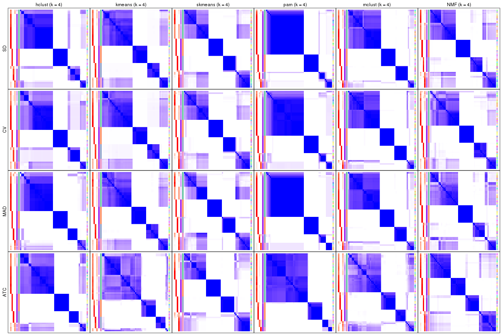</p>

</div>
<div id='tab-collect-consensus-heatmap-4'>
<pre><code class="r">collect_plots(res_list, k = 5, fun = consensus_heatmap, mc.cores = 4)
</code></pre>

<p></p>

</div>
<div id='tab-collect-consensus-heatmap-5'>
<pre><code class="r">collect_plots(res_list, k = 6, fun = consensus_heatmap, mc.cores = 4)
</code></pre>

<p></p>

</div>
</div>


### Membership heatmap

Membership heatmaps for all methods. ([What is a membership heatmap?](http://bioconductor.org/packages/devel/bioc/vignettes/cola/inst/doc/cola.html#toc_12))


<script>
$( function() {
	$( '#tabs-collect-membership-heatmap' ).tabs();
} );
</script>
<div id='tabs-collect-membership-heatmap'>
<ul>
<li><a href='#tab-collect-membership-heatmap-1'>k = 2</a></li>
<li><a href='#tab-collect-membership-heatmap-2'>k = 3</a></li>
<li><a href='#tab-collect-membership-heatmap-3'>k = 4</a></li>
<li><a href='#tab-collect-membership-heatmap-4'>k = 5</a></li>
<li><a href='#tab-collect-membership-heatmap-5'>k = 6</a></li>
</ul>
<div id='tab-collect-membership-heatmap-1'>
<pre><code class="r">collect_plots(res_list, k = 2, fun = membership_heatmap, mc.cores = 4)
</code></pre>

<p></p>

</div>
<div id='tab-collect-membership-heatmap-2'>
<pre><code class="r">collect_plots(res_list, k = 3, fun = membership_heatmap, mc.cores = 4)
</code></pre>

<p></p>

</div>
<div id='tab-collect-membership-heatmap-3'>
<pre><code class="r">collect_plots(res_list, k = 4, fun = membership_heatmap, mc.cores = 4)
</code></pre>

<p></p>

</div>
<div id='tab-collect-membership-heatmap-4'>
<pre><code class="r">collect_plots(res_list, k = 5, fun = membership_heatmap, mc.cores = 4)
</code></pre>

<p></p>

</div>
<div id='tab-collect-membership-heatmap-5'>
<pre><code class="r">collect_plots(res_list, k = 6, fun = membership_heatmap, mc.cores = 4)
</code></pre>

<p></p>

</div>
</div>


### Signature heatmap

Signature heatmaps for all methods. ([What is a signature heatmap?](http://bioconductor.org/packages/devel/bioc/vignettes/cola/inst/doc/cola.html#toc_22))


Note in following heatmaps, rows are scaled.


<script>
$( function() {
	$( '#tabs-collect-get-signatures' ).tabs();
} );
</script>
<div id='tabs-collect-get-signatures'>
<ul>
<li><a href='#tab-collect-get-signatures-1'>k = 2</a></li>
<li><a href='#tab-collect-get-signatures-2'>k = 3</a></li>
<li><a href='#tab-collect-get-signatures-3'>k = 4</a></li>
<li><a href='#tab-collect-get-signatures-4'>k = 5</a></li>
<li><a href='#tab-collect-get-signatures-5'>k = 6</a></li>
</ul>
<div id='tab-collect-get-signatures-1'>
<pre><code class="r">collect_plots(res_list, k = 2, fun = get_signatures, mc.cores = 4)
</code></pre>

<p></p>

</div>
<div id='tab-collect-get-signatures-2'>
<pre><code class="r">collect_plots(res_list, k = 3, fun = get_signatures, mc.cores = 4)
</code></pre>

<p></p>

</div>
<div id='tab-collect-get-signatures-3'>
<pre><code class="r">collect_plots(res_list, k = 4, fun = get_signatures, mc.cores = 4)
</code></pre>

<p></p>

</div>
<div id='tab-collect-get-signatures-4'>
<pre><code class="r">collect_plots(res_list, k = 5, fun = get_signatures, mc.cores = 4)
</code></pre>

<p></p>

</div>
<div id='tab-collect-get-signatures-5'>
<pre><code class="r">collect_plots(res_list, k = 6, fun = get_signatures, mc.cores = 4)
</code></pre>

<p></p>

</div>
</div>


### Statistics table

The statistics used for measuring the stability of consensus partitioning.
([How are they
defined?](http://bioconductor.org/packages/devel/bioc/vignettes/cola/inst/doc/cola.html#toc_13))


<script>
$( function() {
	$( '#tabs-get-stats-from-consensus-partition-list' ).tabs();
} );
</script>
<div id='tabs-get-stats-from-consensus-partition-list'>
<ul>
<li><a href='#tab-get-stats-from-consensus-partition-list-1'>k = 2</a></li>
<li><a href='#tab-get-stats-from-consensus-partition-list-2'>k = 3</a></li>
<li><a href='#tab-get-stats-from-consensus-partition-list-3'>k = 4</a></li>
<li><a href='#tab-get-stats-from-consensus-partition-list-4'>k = 5</a></li>
<li><a href='#tab-get-stats-from-consensus-partition-list-5'>k = 6</a></li>
</ul>
<div id='tab-get-stats-from-consensus-partition-list-1'>
<pre><code class="r">get_stats(res_list, k = 2)
</code></pre>

<pre><code>#&gt;             k 1-PAC mean_silhouette concordance area_increased  Rand Jaccard
#&gt; SD:NMF      2 1.000           0.989       0.995          0.358 0.648   0.648
#&gt; CV:NMF      2 1.000           0.980       0.992          0.362 0.648   0.648
#&gt; MAD:NMF     2 1.000           0.982       0.992          0.361 0.648   0.648
#&gt; ATC:NMF     2 1.000           0.970       0.988          0.382 0.628   0.628
#&gt; SD:skmeans  2 0.708           0.928       0.956          0.465 0.516   0.516
#&gt; CV:skmeans  2 0.708           0.883       0.935          0.456 0.516   0.516
#&gt; MAD:skmeans 2 1.000           0.984       0.990          0.481 0.516   0.516
#&gt; ATC:skmeans 2 0.704           0.824       0.914          0.450 0.516   0.516
#&gt; SD:mclust   2 0.688           0.921       0.952          0.467 0.508   0.508
#&gt; CV:mclust   2 0.688           0.925       0.950          0.466 0.508   0.508
#&gt; MAD:mclust  2 0.688           0.883       0.931          0.447 0.508   0.508
#&gt; ATC:mclust  2 0.816           0.924       0.967          0.406 0.591   0.591
#&gt; SD:kmeans   2 0.508           0.846       0.856          0.337 0.648   0.648
#&gt; CV:kmeans   2 0.508           0.887       0.883          0.344 0.648   0.648
#&gt; MAD:kmeans  2 0.508           0.847       0.858          0.340 0.648   0.648
#&gt; ATC:kmeans  2 0.405           0.808       0.844          0.347 0.648   0.648
#&gt; SD:pam      2 1.000           1.000       1.000          0.353 0.648   0.648
#&gt; CV:pam      2 1.000           0.999       0.999          0.353 0.648   0.648
#&gt; MAD:pam     2 1.000           1.000       1.000          0.353 0.648   0.648
#&gt; ATC:pam     2 1.000           1.000       1.000          0.353 0.648   0.648
#&gt; SD:hclust   2 0.514           0.881       0.911          0.306 0.693   0.693
#&gt; CV:hclust   2 0.517           0.817       0.884          0.308 0.743   0.743
#&gt; MAD:hclust  2 1.000           0.926       0.953          0.291 0.743   0.743
#&gt; ATC:hclust  2 0.481           0.843       0.885          0.293 0.743   0.743
</code></pre>

</div>
<div id='tab-get-stats-from-consensus-partition-list-2'>
<pre><code class="r">get_stats(res_list, k = 3)
</code></pre>

<pre><code>#&gt;             k 1-PAC mean_silhouette concordance area_increased  Rand Jaccard
#&gt; SD:NMF      3 1.000           0.996       0.998          0.651 0.762   0.632
#&gt; CV:NMF      3 0.964           0.965       0.979          0.664 0.762   0.632
#&gt; MAD:NMF     3 1.000           0.998       0.999          0.637 0.762   0.632
#&gt; ATC:NMF     3 1.000           0.973       0.990          0.571 0.728   0.580
#&gt; SD:skmeans  3 1.000           0.993       0.997          0.323 0.818   0.664
#&gt; CV:skmeans  3 0.776           0.903       0.950          0.376 0.818   0.664
#&gt; MAD:skmeans 3 0.970           0.960       0.984          0.277 0.818   0.664
#&gt; ATC:skmeans 3 0.916           0.920       0.969          0.369 0.814   0.658
#&gt; SD:mclust   3 1.000           0.993       0.997          0.239 0.916   0.835
#&gt; CV:mclust   3 0.866           0.948       0.970          0.272 0.916   0.835
#&gt; MAD:mclust  3 1.000           0.974       0.990          0.304 0.916   0.835
#&gt; ATC:mclust  3 0.912           0.910       0.964          0.415 0.781   0.645
#&gt; SD:kmeans   3 0.980           0.978       0.956          0.667 0.776   0.655
#&gt; CV:kmeans   3 0.680           0.955       0.933          0.652 0.776   0.655
#&gt; MAD:kmeans  3 1.000           0.971       0.965          0.685 0.776   0.655
#&gt; ATC:kmeans  3 1.000           0.953       0.965          0.574 0.810   0.707
#&gt; SD:pam      3 1.000           0.958       0.985          0.439 0.849   0.767
#&gt; CV:pam      3 0.942           0.950       0.976          0.490 0.849   0.767
#&gt; MAD:pam     3 1.000           0.985       0.992          0.449 0.849   0.767
#&gt; ATC:pam     3 1.000           1.000       1.000          0.538 0.810   0.707
#&gt; SD:hclust   3 1.000           0.934       0.968          0.835 0.732   0.613
#&gt; CV:hclust   3 0.435           0.797       0.826          0.693 0.715   0.616
#&gt; MAD:hclust  3 0.940           0.941       0.974          0.933 0.715   0.616
#&gt; ATC:hclust  3 1.000           0.978       0.989          0.883 0.715   0.616
</code></pre>

</div>
<div id='tab-get-stats-from-consensus-partition-list-3'>
<pre><code class="r">get_stats(res_list, k = 4)
</code></pre>

<pre><code>#&gt;             k 1-PAC mean_silhouette concordance area_increased  Rand Jaccard
#&gt; SD:NMF      4 0.769           0.793       0.872         0.2337 0.839   0.614
#&gt; CV:NMF      4 0.778           0.809       0.873         0.2136 0.871   0.688
#&gt; MAD:NMF     4 0.752           0.653       0.820         0.2255 0.859   0.660
#&gt; ATC:NMF     4 0.824           0.893       0.935         0.2377 0.829   0.578
#&gt; SD:skmeans  4 0.804           0.760       0.878         0.2001 0.806   0.536
#&gt; CV:skmeans  4 0.785           0.817       0.892         0.1852 0.806   0.536
#&gt; MAD:skmeans 4 0.796           0.640       0.830         0.2073 0.818   0.555
#&gt; ATC:skmeans 4 0.816           0.795       0.906         0.2207 0.829   0.574
#&gt; SD:mclust   4 0.820           0.892       0.936         0.2022 0.906   0.778
#&gt; CV:mclust   4 0.835           0.875       0.931         0.1725 0.891   0.743
#&gt; MAD:mclust  4 0.840           0.877       0.932         0.1924 0.891   0.743
#&gt; ATC:mclust  4 0.675           0.643       0.841         0.2128 0.884   0.733
#&gt; SD:kmeans   4 0.763           0.861       0.886         0.2272 0.878   0.712
#&gt; CV:kmeans   4 0.760           0.872       0.882         0.2033 0.878   0.712
#&gt; MAD:kmeans  4 0.756           0.850       0.881         0.2189 0.866   0.684
#&gt; ATC:kmeans  4 0.667           0.583       0.809         0.2305 0.955   0.902
#&gt; SD:pam      4 0.969           0.920       0.968         0.2122 0.885   0.770
#&gt; CV:pam      4 0.804           0.898       0.945         0.1917 0.892   0.782
#&gt; MAD:pam     4 0.864           0.936       0.963         0.2079 0.892   0.782
#&gt; ATC:pam     4 0.786           0.937       0.925         0.0862 0.990   0.977
#&gt; SD:hclust   4 0.838           0.842       0.925         0.1928 0.906   0.778
#&gt; CV:hclust   4 0.686           0.771       0.857         0.2889 0.850   0.680
#&gt; MAD:hclust  4 0.823           0.855       0.938         0.2122 0.868   0.711
#&gt; ATC:hclust  4 0.750           0.765       0.897         0.2042 0.883   0.744
</code></pre>

</div>
<div id='tab-get-stats-from-consensus-partition-list-4'>
<pre><code class="r">get_stats(res_list, k = 5)
</code></pre>

<pre><code>#&gt;             k 1-PAC mean_silhouette concordance area_increased  Rand Jaccard
#&gt; SD:NMF      5 0.822           0.816       0.897         0.0811 0.883   0.598
#&gt; CV:NMF      5 0.848           0.850       0.915         0.0843 0.894   0.650
#&gt; MAD:NMF     5 0.828           0.800       0.902         0.0897 0.909   0.688
#&gt; ATC:NMF     5 0.724           0.709       0.835         0.0471 0.983   0.931
#&gt; SD:skmeans  5 0.889           0.855       0.927         0.0948 0.901   0.638
#&gt; CV:skmeans  5 0.885           0.842       0.920         0.0891 0.915   0.680
#&gt; MAD:skmeans 5 0.869           0.818       0.911         0.0910 0.884   0.582
#&gt; ATC:skmeans 5 0.784           0.760       0.868         0.0638 0.904   0.637
#&gt; SD:mclust   5 0.800           0.817       0.897         0.1005 0.899   0.701
#&gt; CV:mclust   5 0.826           0.799       0.909         0.0982 0.908   0.713
#&gt; MAD:mclust  5 0.805           0.825       0.906         0.1020 0.908   0.713
#&gt; ATC:mclust  5 0.646           0.578       0.736         0.0873 0.897   0.692
#&gt; SD:kmeans   5 0.735           0.847       0.873         0.0818 0.941   0.806
#&gt; CV:kmeans   5 0.751           0.864       0.895         0.0929 0.922   0.755
#&gt; MAD:kmeans  5 0.718           0.772       0.851         0.0886 0.944   0.807
#&gt; ATC:kmeans  5 0.612           0.593       0.755         0.1106 0.823   0.580
#&gt; SD:pam      5 0.829           0.901       0.941         0.1042 0.950   0.872
#&gt; CV:pam      5 0.825           0.887       0.918         0.0967 0.951   0.875
#&gt; MAD:pam     5 0.936           0.947       0.965         0.0838 0.951   0.875
#&gt; ATC:pam     5 0.695           0.844       0.875         0.1972 0.816   0.588
#&gt; SD:hclust   5 0.775           0.756       0.866         0.0901 0.936   0.805
#&gt; CV:hclust   5 0.805           0.827       0.896         0.0968 0.902   0.703
#&gt; MAD:hclust  5 0.786           0.714       0.820         0.0723 0.870   0.607
#&gt; ATC:hclust  5 0.780           0.634       0.849         0.0284 0.869   0.697
</code></pre>

</div>
<div id='tab-get-stats-from-consensus-partition-list-5'>
<pre><code class="r">get_stats(res_list, k = 6)
</code></pre>

<pre><code>#&gt;             k 1-PAC mean_silhouette concordance area_increased  Rand Jaccard
#&gt; SD:NMF      6 0.853           0.762       0.878         0.0454 0.921   0.648
#&gt; CV:NMF      6 0.837           0.682       0.847         0.0418 0.988   0.943
#&gt; MAD:NMF     6 0.836           0.707       0.851         0.0461 0.939   0.731
#&gt; ATC:NMF     6 0.722           0.679       0.813         0.0417 0.880   0.552
#&gt; SD:skmeans  6 0.858           0.723       0.862         0.0341 0.955   0.773
#&gt; CV:skmeans  6 0.861           0.732       0.860         0.0342 0.945   0.728
#&gt; MAD:skmeans 6 0.843           0.703       0.834         0.0329 0.965   0.819
#&gt; ATC:skmeans 6 0.802           0.655       0.799         0.0310 0.987   0.930
#&gt; SD:mclust   6 0.827           0.853       0.892         0.0442 0.951   0.803
#&gt; CV:mclust   6 0.838           0.856       0.893         0.0506 0.951   0.795
#&gt; MAD:mclust  6 0.855           0.886       0.919         0.0399 0.951   0.795
#&gt; ATC:mclust  6 0.658           0.514       0.741         0.0520 0.850   0.495
#&gt; SD:kmeans   6 0.765           0.789       0.841         0.0606 1.000   1.000
#&gt; CV:kmeans   6 0.776           0.807       0.861         0.0544 1.000   1.000
#&gt; MAD:kmeans  6 0.741           0.728       0.815         0.0469 1.000   1.000
#&gt; ATC:kmeans  6 0.627           0.560       0.746         0.0487 0.955   0.822
#&gt; SD:pam      6 0.846           0.797       0.923         0.0655 0.945   0.842
#&gt; CV:pam      6 0.753           0.852       0.893         0.0603 0.962   0.891
#&gt; MAD:pam     6 0.853           0.826       0.916         0.0702 0.962   0.891
#&gt; ATC:pam     6 0.780           0.813       0.889         0.0918 0.977   0.912
#&gt; SD:hclust   6 0.802           0.718       0.830         0.0572 0.989   0.958
#&gt; CV:hclust   6 0.817           0.782       0.902         0.0355 0.980   0.916
#&gt; MAD:hclust  6 0.839           0.840       0.908         0.0559 0.958   0.817
#&gt; ATC:hclust  6 0.750           0.684       0.875         0.0660 0.890   0.732
</code></pre>

</div>
</div>

Following heatmap plots the partition for each combination of methods and the
lightness correspond to the silhouette scores for samples in each method. On
top the consensus subgroup is inferred from all methods by taking the mean
silhouette scores as weight.


<script>
$( function() {
	$( '#tabs-collect-stats-from-consensus-partition-list' ).tabs();
} );
</script>
<div id='tabs-collect-stats-from-consensus-partition-list'>
<ul>
<li><a href='#tab-collect-stats-from-consensus-partition-list-1'>k = 2</a></li>
<li><a href='#tab-collect-stats-from-consensus-partition-list-2'>k = 3</a></li>
<li><a href='#tab-collect-stats-from-consensus-partition-list-3'>k = 4</a></li>
<li><a href='#tab-collect-stats-from-consensus-partition-list-4'>k = 5</a></li>
<li><a href='#tab-collect-stats-from-consensus-partition-list-5'>k = 6</a></li>
</ul>
<div id='tab-collect-stats-from-consensus-partition-list-1'>
<pre><code class="r">collect_stats(res_list, k = 2)
</code></pre>

<p></p>

</div>
<div id='tab-collect-stats-from-consensus-partition-list-2'>
<pre><code class="r">collect_stats(res_list, k = 3)
</code></pre>

<p></p>

</div>
<div id='tab-collect-stats-from-consensus-partition-list-3'>
<pre><code class="r">collect_stats(res_list, k = 4)
</code></pre>

<p></p>

</div>
<div id='tab-collect-stats-from-consensus-partition-list-4'>
<pre><code class="r">collect_stats(res_list, k = 5)
</code></pre>

<p></p>

</div>
<div id='tab-collect-stats-from-consensus-partition-list-5'>
<pre><code class="r">collect_stats(res_list, k = 6)
</code></pre>

<p></p>

</div>
</div>

### Partition from all methods


Collect partitions from all methods:


<script>
$( function() {
	$( '#tabs-collect-classes-from-consensus-partition-list' ).tabs();
} );
</script>
<div id='tabs-collect-classes-from-consensus-partition-list'>
<ul>
<li><a href='#tab-collect-classes-from-consensus-partition-list-1'>k = 2</a></li>
<li><a href='#tab-collect-classes-from-consensus-partition-list-2'>k = 3</a></li>
<li><a href='#tab-collect-classes-from-consensus-partition-list-3'>k = 4</a></li>
<li><a href='#tab-collect-classes-from-consensus-partition-list-4'>k = 5</a></li>
<li><a href='#tab-collect-classes-from-consensus-partition-list-5'>k = 6</a></li>
</ul>
<div id='tab-collect-classes-from-consensus-partition-list-1'>
<pre><code class="r">collect_classes(res_list, k = 2)
</code></pre>

<p></p>

</div>
<div id='tab-collect-classes-from-consensus-partition-list-2'>
<pre><code class="r">collect_classes(res_list, k = 3)
</code></pre>

<p></p>

</div>
<div id='tab-collect-classes-from-consensus-partition-list-3'>
<pre><code class="r">collect_classes(res_list, k = 4)
</code></pre>

<p></p>

</div>
<div id='tab-collect-classes-from-consensus-partition-list-4'>
<pre><code class="r">collect_classes(res_list, k = 5)
</code></pre>

<p></p>

</div>
<div id='tab-collect-classes-from-consensus-partition-list-5'>
<pre><code class="r">collect_classes(res_list, k = 6)
</code></pre>

<p></p>

</div>
</div>


### Top rows overlap


Overlap of top rows from different top-row methods:


<script>
$( function() {
	$( '#tabs-top-rows-overlap-by-euler' ).tabs();
} );
</script>
<div id='tabs-top-rows-overlap-by-euler'>
<ul>
<li><a href='#tab-top-rows-overlap-by-euler-1'>top_n = 1000</a></li>
<li><a href='#tab-top-rows-overlap-by-euler-2'>top_n = 2000</a></li>
<li><a href='#tab-top-rows-overlap-by-euler-3'>top_n = 3000</a></li>
<li><a href='#tab-top-rows-overlap-by-euler-4'>top_n = 4000</a></li>
<li><a href='#tab-top-rows-overlap-by-euler-5'>top_n = 5000</a></li>
</ul>
<div id='tab-top-rows-overlap-by-euler-1'>
<pre><code class="r">top_rows_overlap(res_list, top_n = 1000, method = &quot;euler&quot;)
</code></pre>

<p></p>

</div>
<div id='tab-top-rows-overlap-by-euler-2'>
<pre><code class="r">top_rows_overlap(res_list, top_n = 2000, method = &quot;euler&quot;)
</code></pre>

<p>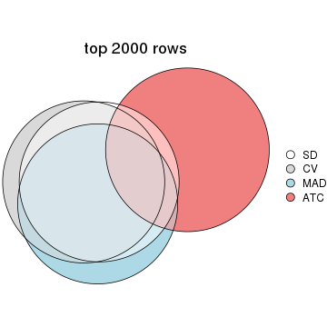</p>

</div>
<div id='tab-top-rows-overlap-by-euler-3'>
<pre><code class="r">top_rows_overlap(res_list, top_n = 3000, method = &quot;euler&quot;)
</code></pre>

<p></p>

</div>
<div id='tab-top-rows-overlap-by-euler-4'>
<pre><code class="r">top_rows_overlap(res_list, top_n = 4000, method = &quot;euler&quot;)
</code></pre>

<p></p>

</div>
<div id='tab-top-rows-overlap-by-euler-5'>
<pre><code class="r">top_rows_overlap(res_list, top_n = 5000, method = &quot;euler&quot;)
</code></pre>

<p></p>

</div>
</div>

Also visualize the correspondance of rankings between different top-row methods:


<script>
$( function() {
	$( '#tabs-top-rows-overlap-by-correspondance' ).tabs();
} );
</script>
<div id='tabs-top-rows-overlap-by-correspondance'>
<ul>
<li><a href='#tab-top-rows-overlap-by-correspondance-1'>top_n = 1000</a></li>
<li><a href='#tab-top-rows-overlap-by-correspondance-2'>top_n = 2000</a></li>
<li><a href='#tab-top-rows-overlap-by-correspondance-3'>top_n = 3000</a></li>
<li><a href='#tab-top-rows-overlap-by-correspondance-4'>top_n = 4000</a></li>
<li><a href='#tab-top-rows-overlap-by-correspondance-5'>top_n = 5000</a></li>
</ul>
<div id='tab-top-rows-overlap-by-correspondance-1'>
<pre><code class="r">top_rows_overlap(res_list, top_n = 1000, method = &quot;correspondance&quot;)
</code></pre>

<p></p>

</div>
<div id='tab-top-rows-overlap-by-correspondance-2'>
<pre><code class="r">top_rows_overlap(res_list, top_n = 2000, method = &quot;correspondance&quot;)
</code></pre>

<p></p>

</div>
<div id='tab-top-rows-overlap-by-correspondance-3'>
<pre><code class="r">top_rows_overlap(res_list, top_n = 3000, method = &quot;correspondance&quot;)
</code></pre>

<p></p>

</div>
<div id='tab-top-rows-overlap-by-correspondance-4'>
<pre><code class="r">top_rows_overlap(res_list, top_n = 4000, method = &quot;correspondance&quot;)
</code></pre>

<p></p>

</div>
<div id='tab-top-rows-overlap-by-correspondance-5'>
<pre><code class="r">top_rows_overlap(res_list, top_n = 5000, method = &quot;correspondance&quot;)
</code></pre>

<p></p>

</div>
</div>


Heatmaps of the top rows:


<script>
$( function() {
	$( '#tabs-top-rows-heatmap' ).tabs();
} );
</script>
<div id='tabs-top-rows-heatmap'>
<ul>
<li><a href='#tab-top-rows-heatmap-1'>top_n = 1000</a></li>
<li><a href='#tab-top-rows-heatmap-2'>top_n = 2000</a></li>
<li><a href='#tab-top-rows-heatmap-3'>top_n = 3000</a></li>
<li><a href='#tab-top-rows-heatmap-4'>top_n = 4000</a></li>
<li><a href='#tab-top-rows-heatmap-5'>top_n = 5000</a></li>
</ul>
<div id='tab-top-rows-heatmap-1'>
<pre><code class="r">top_rows_heatmap(res_list, top_n = 1000)
</code></pre>

<p></p>

</div>
<div id='tab-top-rows-heatmap-2'>
<pre><code class="r">top_rows_heatmap(res_list, top_n = 2000)
</code></pre>

<p></p>

</div>
<div id='tab-top-rows-heatmap-3'>
<pre><code class="r">top_rows_heatmap(res_list, top_n = 3000)
</code></pre>

<p></p>

</div>
<div id='tab-top-rows-heatmap-4'>
<pre><code class="r">top_rows_heatmap(res_list, top_n = 4000)
</code></pre>

<p></p>

</div>
<div id='tab-top-rows-heatmap-5'>
<pre><code class="r">top_rows_heatmap(res_list, top_n = 5000)
</code></pre>

<p>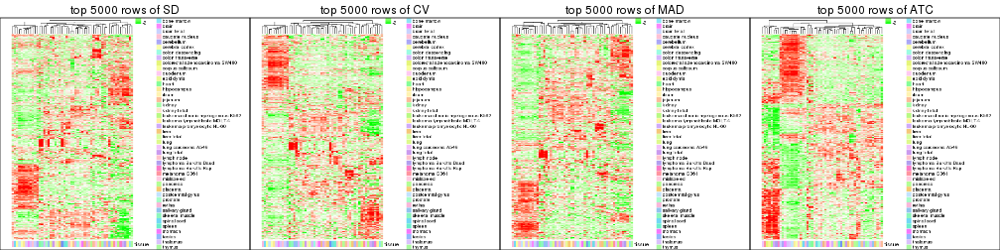</p>

</div>
</div>


### Test to known annotations


Test correlation between subgroups and known annotations. If the known
annotation is numeric, one-way ANOVA test is applied, and if the known
annotation is discrete, chi-squared contingency table test is applied.


<script>
$( function() {
	$( '#tabs-test-to-known-factors-from-consensus-partition-list' ).tabs();
} );
</script>
<div id='tabs-test-to-known-factors-from-consensus-partition-list'>
<ul>
<li><a href='#tab-test-to-known-factors-from-consensus-partition-list-1'>k = 2</a></li>
<li><a href='#tab-test-to-known-factors-from-consensus-partition-list-2'>k = 3</a></li>
<li><a href='#tab-test-to-known-factors-from-consensus-partition-list-3'>k = 4</a></li>
<li><a href='#tab-test-to-known-factors-from-consensus-partition-list-4'>k = 5</a></li>
<li><a href='#tab-test-to-known-factors-from-consensus-partition-list-5'>k = 6</a></li>
</ul>
<div id='tab-test-to-known-factors-from-consensus-partition-list-1'>
<pre><code class="r">test_to_known_factors(res_list, k = 2)
</code></pre>

<pre><code>#&gt;              n tissue(p) k
#&gt; SD:NMF      54     0.398 2
#&gt; CV:NMF      53     0.397 2
#&gt; MAD:NMF     54     0.398 2
#&gt; ATC:NMF     53     0.397 2
#&gt; SD:skmeans  54     0.398 2
#&gt; CV:skmeans  52     0.396 2
#&gt; MAD:skmeans 54     0.398 2
#&gt; ATC:skmeans 51     0.395 2
#&gt; SD:mclust   53     0.397 2
#&gt; CV:mclust   54     0.398 2
#&gt; MAD:mclust  53     0.397 2
#&gt; ATC:mclust  53     0.397 2
#&gt; SD:kmeans   54     0.398 2
#&gt; CV:kmeans   54     0.398 2
#&gt; MAD:kmeans  54     0.398 2
#&gt; ATC:kmeans  46     0.389 2
#&gt; SD:pam      54     0.398 2
#&gt; CV:pam      54     0.398 2
#&gt; MAD:pam     54     0.398 2
#&gt; ATC:pam     54     0.398 2
#&gt; SD:hclust   54     0.398 2
#&gt; CV:hclust   52     0.396 2
#&gt; MAD:hclust  52     0.396 2
#&gt; ATC:hclust  54     0.398 2
</code></pre>

</div>
<div id='tab-test-to-known-factors-from-consensus-partition-list-2'>
<pre><code class="r">test_to_known_factors(res_list, k = 3)
</code></pre>

<pre><code>#&gt;              n tissue(p) k
#&gt; SD:NMF      54     0.374 3
#&gt; CV:NMF      54     0.374 3
#&gt; MAD:NMF     54     0.374 3
#&gt; ATC:NMF     53     0.373 3
#&gt; SD:skmeans  54     0.374 3
#&gt; CV:skmeans  53     0.373 3
#&gt; MAD:skmeans 53     0.373 3
#&gt; ATC:skmeans 52     0.372 3
#&gt; SD:mclust   54     0.374 3
#&gt; CV:mclust   54     0.374 3
#&gt; MAD:mclust  53     0.373 3
#&gt; ATC:mclust  52     0.372 3
#&gt; SD:kmeans   54     0.374 3
#&gt; CV:kmeans   54     0.374 3
#&gt; MAD:kmeans  54     0.374 3
#&gt; ATC:kmeans  52     0.372 3
#&gt; SD:pam      53     0.373 3
#&gt; CV:pam      54     0.374 3
#&gt; MAD:pam     54     0.374 3
#&gt; ATC:pam     54     0.374 3
#&gt; SD:hclust   52     0.372 3
#&gt; CV:hclust   47     0.366 3
#&gt; MAD:hclust  52     0.372 3
#&gt; ATC:hclust  54     0.374 3
</code></pre>

</div>
<div id='tab-test-to-known-factors-from-consensus-partition-list-3'>
<pre><code class="r">test_to_known_factors(res_list, k = 4)
</code></pre>

<pre><code>#&gt;              n tissue(p) k
#&gt; SD:NMF      49     0.348 4
#&gt; CV:NMF      49     0.348 4
#&gt; MAD:NMF     43     0.409 4
#&gt; ATC:NMF     53     0.431 4
#&gt; SD:skmeans  50     0.349 4
#&gt; CV:skmeans  50     0.349 4
#&gt; MAD:skmeans 37     0.402 4
#&gt; ATC:skmeans 47     0.436 4
#&gt; SD:mclust   53     0.353 4
#&gt; CV:mclust   52     0.352 4
#&gt; MAD:mclust  52     0.352 4
#&gt; ATC:mclust  36     0.411 4
#&gt; SD:kmeans   53     0.353 4
#&gt; CV:kmeans   53     0.353 4
#&gt; MAD:kmeans  54     0.355 4
#&gt; ATC:kmeans  25     0.394 4
#&gt; SD:pam      51     0.483 4
#&gt; CV:pam      52     0.487 4
#&gt; MAD:pam     53     0.489 4
#&gt; ATC:pam     54     0.355 4
#&gt; SD:hclust   49     0.348 4
#&gt; CV:hclust   43     0.409 4
#&gt; MAD:hclust  51     0.350 4
#&gt; ATC:hclust  43     0.409 4
</code></pre>

</div>
<div id='tab-test-to-known-factors-from-consensus-partition-list-4'>
<pre><code class="r">test_to_known_factors(res_list, k = 5)
</code></pre>

<pre><code>#&gt;              n tissue(p) k
#&gt; SD:NMF      50     0.443 5
#&gt; CV:NMF      51     0.443 5
#&gt; MAD:NMF     48     0.427 5
#&gt; ATC:NMF     47     0.422 5
#&gt; SD:skmeans  49     0.429 5
#&gt; CV:skmeans  49     0.429 5
#&gt; MAD:skmeans 48     0.441 5
#&gt; ATC:skmeans 46     0.463 5
#&gt; SD:mclust   50     0.407 5
#&gt; CV:mclust   48     0.405 5
#&gt; MAD:mclust  51     0.482 5
#&gt; ATC:mclust  35     0.400 5
#&gt; SD:kmeans   52     0.484 5
#&gt; CV:kmeans   51     0.481 5
#&gt; MAD:kmeans  50     0.481 5
#&gt; ATC:kmeans  40     0.426 5
#&gt; SD:pam      53     0.452 5
#&gt; CV:pam      54     0.455 5
#&gt; MAD:pam     54     0.455 5
#&gt; ATC:pam     53     0.402 5
#&gt; SD:hclust   44     0.463 5
#&gt; CV:hclust   48     0.421 5
#&gt; MAD:hclust  45     0.402 5
#&gt; ATC:hclust  27     0.386 5
</code></pre>

</div>
<div id='tab-test-to-known-factors-from-consensus-partition-list-5'>
<pre><code class="r">test_to_known_factors(res_list, k = 6)
</code></pre>

<pre><code>#&gt;              n tissue(p) k
#&gt; SD:NMF      48     0.404 6
#&gt; CV:NMF      43     0.444 6
#&gt; MAD:NMF     45     0.413 6
#&gt; ATC:NMF     45     0.451 6
#&gt; SD:skmeans  42     0.482 6
#&gt; CV:skmeans  43     0.463 6
#&gt; MAD:skmeans 40     0.511 6
#&gt; ATC:skmeans 38     0.520 6
#&gt; SD:mclust   51     0.448 6
#&gt; CV:mclust   53     0.407 6
#&gt; MAD:mclust  53     0.417 6
#&gt; ATC:mclust  21     0.384 6
#&gt; SD:kmeans   53     0.485 6
#&gt; CV:kmeans   51     0.481 6
#&gt; MAD:kmeans  48     0.476 6
#&gt; ATC:kmeans  35     0.397 6
#&gt; SD:pam      48     0.398 6
#&gt; CV:pam      53     0.638 6
#&gt; MAD:pam     50     0.400 6
#&gt; ATC:pam     52     0.588 6
#&gt; SD:hclust   42     0.421 6
#&gt; CV:hclust   43     0.456 6
#&gt; MAD:hclust  50     0.399 6
#&gt; ATC:hclust  44     0.410 6
</code></pre>

</div>
</div>


 
## Results for each method


---------------------------------------------------


### SD:hclust**


The object with results only for a single top-value method and a single partition method 
can be extracted as:

```r
res = res_list["SD", "hclust"]
# you can also extract it by
# res = res_list["SD:hclust"]
```

A summary of `res` and all the functions that can be applied to it:

```r
res
```

```
#> A 'ConsensusPartition' object with k = 2, 3, 4, 5, 6.
#>   On a matrix with 12150 rows and 54 columns.
#>   Top rows (1000, 2000, 3000, 4000, 5000) are extracted by 'SD' method.
#>   Subgroups are detected by 'hclust' method.
#>   Performed in total 1250 partitions by row resampling.
#>   Best k for subgroups seems to be 3.
#> 
#> Following methods can be applied to this 'ConsensusPartition' object:
#>  [1] "cola_report"             "collect_classes"         "collect_plots"          
#>  [4] "collect_stats"           "colnames"                "compare_signatures"     
#>  [7] "consensus_heatmap"       "dimension_reduction"     "functional_enrichment"  
#> [10] "get_anno_col"            "get_anno"                "get_classes"            
#> [13] "get_consensus"           "get_matrix"              "get_membership"         
#> [16] "get_param"               "get_signatures"          "get_stats"              
#> [19] "is_best_k"               "is_stable_k"             "membership_heatmap"     
#> [22] "ncol"                    "nrow"                    "plot_ecdf"              
#> [25] "rownames"                "select_partition_number" "show"                   
#> [28] "suggest_best_k"          "test_to_known_factors"
```

`collect_plots()` function collects all the plots made from `res` for all `k` (number of partitions)
into one single page to provide an easy and fast comparison between different `k`.

```r
collect_plots(res)
```


The plots are:

- The first row: a plot of the ECDF (empirical cumulative distribution
  function) curves of the consensus matrix for each `k` and the heatmap of
  predicted classes for each `k`.
- The second row: heatmaps of the consensus matrix for each `k`.
- The third row: heatmaps of the membership matrix for each `k`.
- The fouth row: heatmaps of the signatures for each `k`.

All the plots in panels can be made by individual functions and they are
plotted later in this section.

`select_partition_number()` produces several plots showing different
statistics for choosing "optimized" `k`. There are following statistics:

- ECDF curves of the consensus matrix for each `k`;
- 1-PAC. [The PAC
  score](https://en.wikipedia.org/wiki/Consensus_clustering#Over-interpretation_potential_of_consensus_clustering)
  measures the proportion of the ambiguous subgrouping.
- Mean silhouette score.
- Concordance. The mean probability of fiting the consensus class ids in all
  partitions.
- Area increased. Denote $A_k$ as the area under the ECDF curve for current
  `k`, the area increased is defined as $A_k - A_{k-1}$.
- Rand index. The percent of pairs of samples that are both in a same cluster
  or both are not in a same cluster in the partition of k and k-1.
- Jaccard index. The ratio of pairs of samples are both in a same cluster in
  the partition of k and k-1 and the pairs of samples are both in a same
  cluster in the partition k or k-1.

The detailed explanations of these statistics can be found in [the _cola_
vignette](http://bioconductor.org/packages/devel/bioc/vignettes/cola/inst/doc/cola.html#toc_13).

Generally speaking, lower PAC score, higher mean silhouette score or higher
concordance corresponds to better partition. Rand index and Jaccard index
measure how similar the current partition is compared to partition with `k-1`.
If they are too similar, we won't accept `k` is better than `k-1`.

```r
select_partition_number(res)
```


The numeric values for all these statistics can be obtained by `get_stats()`.

```r
get_stats(res)
```

```
#>   k 1-PAC mean_silhouette concordance area_increased  Rand Jaccard
#> 2 2 0.514           0.881       0.911         0.3056 0.693   0.693
#> 3 3 1.000           0.934       0.968         0.8352 0.732   0.613
#> 4 4 0.838           0.842       0.925         0.1928 0.906   0.778
#> 5 5 0.775           0.756       0.866         0.0901 0.936   0.805
#> 6 6 0.802           0.718       0.830         0.0572 0.989   0.958
```

`suggest_best_k()` suggests the best $k$ based on these statistics. The rules are as follows:

- All $k$ with Jaccard index larger than 0.95 are removed because increasing
  $k$ does not provide enough extra information. If all $k$ are removed, it is
  marked as no subgroup is detected.
- For all $k$ with 1-PAC score larger than 0.9, the maximal $k$ is taken as
  the best $k$, and other $k$ are marked as optional $k$.
- If it does not fit the second rule. The $k$ with the maximal vote of the
  highest 1-PAC score, highest mean silhouette, and highest concordance is
  taken as the best $k$.

```r
suggest_best_k(res)
```

```
#> [1] 3
```


Following shows the table of the partitions (You need to click the **show/hide
code output** link to see it). The membership matrix (columns with name `p*`)
is inferred by
[`clue::cl_consensus()`](https://www.rdocumentation.org/link/cl_consensus?package=clue)
function with the `SE` method. Basically the value in the membership matrix
represents the probability to belong to a certain group. The finall class
label for an item is determined with the group with highest probability it
belongs to.

In `get_classes()` function, the entropy is calculated from the membership
matrix and the silhouette score is calculated from the consensus matrix.


<script>
$( function() {
	$( '#tabs-SD-hclust-get-classes' ).tabs();
} );
</script>
<div id='tabs-SD-hclust-get-classes'>
<ul>
<li><a href='#tab-SD-hclust-get-classes-1'>k = 2</a></li>
<li><a href='#tab-SD-hclust-get-classes-2'>k = 3</a></li>
<li><a href='#tab-SD-hclust-get-classes-3'>k = 4</a></li>
<li><a href='#tab-SD-hclust-get-classes-4'>k = 5</a></li>
<li><a href='#tab-SD-hclust-get-classes-5'>k = 6</a></li>
</ul>

<div id='tab-SD-hclust-get-classes-1'>
<p><a id='tab-SD-hclust-get-classes-1-a' style='color:#0366d6' href='#'>show/hide code output</a></p>
<pre><code class="r">cbind(get_classes(res, k = 2), get_membership(res, k = 2))
</code></pre>

<pre><code>#&gt;          class entropy silhouette    p1    p2
#&gt; GSM28815     1  0.0000      0.926 1.000 0.000
#&gt; GSM28816     1  0.0000      0.926 1.000 0.000
#&gt; GSM28817     1  0.0000      0.926 1.000 0.000
#&gt; GSM11327     2  0.9977      0.508 0.472 0.528
#&gt; GSM28825     1  0.6887      0.813 0.816 0.184
#&gt; GSM11322     1  0.6887      0.813 0.816 0.184
#&gt; GSM28828     1  0.6887      0.813 0.816 0.184
#&gt; GSM11346     1  0.6887      0.813 0.816 0.184
#&gt; GSM28808     1  0.6887      0.813 0.816 0.184
#&gt; GSM11332     1  0.6887      0.813 0.816 0.184
#&gt; GSM28811     1  0.6887      0.813 0.816 0.184
#&gt; GSM11334     1  0.6887      0.813 0.816 0.184
#&gt; GSM11340     1  0.6887      0.813 0.816 0.184
#&gt; GSM28812     1  0.6887      0.813 0.816 0.184
#&gt; GSM11345     1  0.0000      0.926 1.000 0.000
#&gt; GSM28819     1  0.0000      0.926 1.000 0.000
#&gt; GSM11321     2  0.6887      0.919 0.184 0.816
#&gt; GSM28820     1  0.0000      0.926 1.000 0.000
#&gt; GSM11339     1  0.0000      0.926 1.000 0.000
#&gt; GSM28804     1  0.0376      0.924 0.996 0.004
#&gt; GSM28823     1  0.0000      0.926 1.000 0.000
#&gt; GSM11336     1  0.0000      0.926 1.000 0.000
#&gt; GSM11342     1  0.0000      0.926 1.000 0.000
#&gt; GSM11333     1  0.0000      0.926 1.000 0.000
#&gt; GSM28802     1  0.0000      0.926 1.000 0.000
#&gt; GSM28803     2  0.6887      0.919 0.184 0.816
#&gt; GSM11343     2  0.6887      0.919 0.184 0.816
#&gt; GSM11347     2  0.6887      0.919 0.184 0.816
#&gt; GSM28824     1  0.0000      0.926 1.000 0.000
#&gt; GSM28813     1  0.0000      0.926 1.000 0.000
#&gt; GSM28827     1  0.0000      0.926 1.000 0.000
#&gt; GSM11337     1  0.0000      0.926 1.000 0.000
#&gt; GSM28814     2  0.6887      0.919 0.184 0.816
#&gt; GSM11331     1  0.0938      0.915 0.988 0.012
#&gt; GSM11344     2  0.6887      0.919 0.184 0.816
#&gt; GSM11330     2  0.6887      0.919 0.184 0.816
#&gt; GSM11325     2  0.6887      0.919 0.184 0.816
#&gt; GSM11338     1  0.0000      0.926 1.000 0.000
#&gt; GSM28806     1  0.0000      0.926 1.000 0.000
#&gt; GSM28826     1  0.0000      0.926 1.000 0.000
#&gt; GSM28818     1  0.0000      0.926 1.000 0.000
#&gt; GSM28821     1  0.6887      0.813 0.816 0.184
#&gt; GSM28807     1  0.0376      0.924 0.996 0.004
#&gt; GSM28822     1  0.0376      0.924 0.996 0.004
#&gt; GSM11328     1  0.6887      0.813 0.816 0.184
#&gt; GSM11323     1  0.0938      0.915 0.988 0.012
#&gt; GSM11324     1  0.0000      0.926 1.000 0.000
#&gt; GSM11341     1  0.5629      0.759 0.868 0.132
#&gt; GSM11326     2  0.9977      0.508 0.472 0.528
#&gt; GSM28810     1  0.0000      0.926 1.000 0.000
#&gt; GSM11335     1  0.0376      0.924 0.996 0.004
#&gt; GSM28809     1  0.0000      0.926 1.000 0.000
#&gt; GSM11329     1  0.0000      0.926 1.000 0.000
#&gt; GSM28805     1  0.0000      0.926 1.000 0.000
</code></pre>

<script>
$('#tab-SD-hclust-get-classes-1-a').parent().next().next().hide();
$('#tab-SD-hclust-get-classes-1-a').click(function(){
  $('#tab-SD-hclust-get-classes-1-a').parent().next().next().toggle();
  return(false);
});
</script>
</div>

<div id='tab-SD-hclust-get-classes-2'>
<p><a id='tab-SD-hclust-get-classes-2-a' style='color:#0366d6' href='#'>show/hide code output</a></p>
<pre><code class="r">cbind(get_classes(res, k = 3), get_membership(res, k = 3))
</code></pre>

<pre><code>#&gt;          class entropy silhouette    p1    p2    p3
#&gt; GSM28815     1  0.0000      0.986 1.000 0.000 0.000
#&gt; GSM28816     1  0.0000      0.986 1.000 0.000 0.000
#&gt; GSM28817     1  0.0000      0.986 1.000 0.000 0.000
#&gt; GSM11327     3  0.6295      0.201 0.472 0.000 0.528
#&gt; GSM28825     2  0.1163      1.000 0.028 0.972 0.000
#&gt; GSM11322     2  0.1163      1.000 0.028 0.972 0.000
#&gt; GSM28828     2  0.1163      1.000 0.028 0.972 0.000
#&gt; GSM11346     2  0.1163      1.000 0.028 0.972 0.000
#&gt; GSM28808     2  0.1163      1.000 0.028 0.972 0.000
#&gt; GSM11332     2  0.1163      1.000 0.028 0.972 0.000
#&gt; GSM28811     2  0.1163      1.000 0.028 0.972 0.000
#&gt; GSM11334     2  0.1163      1.000 0.028 0.972 0.000
#&gt; GSM11340     2  0.1163      1.000 0.028 0.972 0.000
#&gt; GSM28812     2  0.1163      1.000 0.028 0.972 0.000
#&gt; GSM11345     1  0.0000      0.986 1.000 0.000 0.000
#&gt; GSM28819     1  0.0000      0.986 1.000 0.000 0.000
#&gt; GSM11321     3  0.0237      0.853 0.004 0.000 0.996
#&gt; GSM28820     1  0.0000      0.986 1.000 0.000 0.000
#&gt; GSM11339     1  0.0000      0.986 1.000 0.000 0.000
#&gt; GSM28804     1  0.1525      0.964 0.964 0.032 0.004
#&gt; GSM28823     1  0.0000      0.986 1.000 0.000 0.000
#&gt; GSM11336     1  0.0000      0.986 1.000 0.000 0.000
#&gt; GSM11342     1  0.0000      0.986 1.000 0.000 0.000
#&gt; GSM11333     1  0.0000      0.986 1.000 0.000 0.000
#&gt; GSM28802     1  0.0000      0.986 1.000 0.000 0.000
#&gt; GSM28803     3  0.0237      0.853 0.004 0.000 0.996
#&gt; GSM11343     3  0.0237      0.853 0.004 0.000 0.996
#&gt; GSM11347     3  0.0237      0.853 0.004 0.000 0.996
#&gt; GSM28824     1  0.0000      0.986 1.000 0.000 0.000
#&gt; GSM28813     1  0.0000      0.986 1.000 0.000 0.000
#&gt; GSM28827     1  0.0000      0.986 1.000 0.000 0.000
#&gt; GSM11337     1  0.0000      0.986 1.000 0.000 0.000
#&gt; GSM28814     3  0.0237      0.853 0.004 0.000 0.996
#&gt; GSM11331     1  0.0592      0.977 0.988 0.000 0.012
#&gt; GSM11344     3  0.0237      0.853 0.004 0.000 0.996
#&gt; GSM11330     3  0.0237      0.853 0.004 0.000 0.996
#&gt; GSM11325     3  0.0237      0.853 0.004 0.000 0.996
#&gt; GSM11338     1  0.0000      0.986 1.000 0.000 0.000
#&gt; GSM28806     1  0.0237      0.984 0.996 0.004 0.000
#&gt; GSM28826     1  0.0000      0.986 1.000 0.000 0.000
#&gt; GSM28818     1  0.1163      0.968 0.972 0.028 0.000
#&gt; GSM28821     2  0.1163      1.000 0.028 0.972 0.000
#&gt; GSM28807     1  0.1399      0.966 0.968 0.028 0.004
#&gt; GSM28822     1  0.1525      0.964 0.964 0.032 0.004
#&gt; GSM11328     2  0.1163      1.000 0.028 0.972 0.000
#&gt; GSM11323     1  0.0592      0.977 0.988 0.000 0.012
#&gt; GSM11324     1  0.0000      0.986 1.000 0.000 0.000
#&gt; GSM11341     1  0.4799      0.808 0.836 0.032 0.132
#&gt; GSM11326     3  0.6295      0.201 0.472 0.000 0.528
#&gt; GSM28810     1  0.1163      0.968 0.972 0.028 0.000
#&gt; GSM11335     1  0.1399      0.966 0.968 0.028 0.004
#&gt; GSM28809     1  0.1163      0.968 0.972 0.028 0.000
#&gt; GSM11329     1  0.0000      0.986 1.000 0.000 0.000
#&gt; GSM28805     1  0.0000      0.986 1.000 0.000 0.000
</code></pre>

<script>
$('#tab-SD-hclust-get-classes-2-a').parent().next().next().hide();
$('#tab-SD-hclust-get-classes-2-a').click(function(){
  $('#tab-SD-hclust-get-classes-2-a').parent().next().next().toggle();
  return(false);
});
</script>
</div>

<div id='tab-SD-hclust-get-classes-3'>
<p><a id='tab-SD-hclust-get-classes-3-a' style='color:#0366d6' href='#'>show/hide code output</a></p>
<pre><code class="r">cbind(get_classes(res, k = 4), get_membership(res, k = 4))
</code></pre>

<pre><code>#&gt;          class entropy silhouette    p1 p2    p3    p4
#&gt; GSM28815     1  0.1389      0.900 0.952  0 0.000 0.048
#&gt; GSM28816     1  0.1389      0.900 0.952  0 0.000 0.048
#&gt; GSM28817     1  0.0000      0.920 1.000  0 0.000 0.000
#&gt; GSM11327     3  0.5833      0.189 0.440  0 0.528 0.032
#&gt; GSM28825     2  0.0000      1.000 0.000  1 0.000 0.000
#&gt; GSM11322     2  0.0000      1.000 0.000  1 0.000 0.000
#&gt; GSM28828     2  0.0000      1.000 0.000  1 0.000 0.000
#&gt; GSM11346     2  0.0000      1.000 0.000  1 0.000 0.000
#&gt; GSM28808     2  0.0000      1.000 0.000  1 0.000 0.000
#&gt; GSM11332     2  0.0000      1.000 0.000  1 0.000 0.000
#&gt; GSM28811     2  0.0000      1.000 0.000  1 0.000 0.000
#&gt; GSM11334     2  0.0000      1.000 0.000  1 0.000 0.000
#&gt; GSM11340     2  0.0000      1.000 0.000  1 0.000 0.000
#&gt; GSM28812     2  0.0000      1.000 0.000  1 0.000 0.000
#&gt; GSM11345     1  0.0000      0.920 1.000  0 0.000 0.000
#&gt; GSM28819     1  0.0000      0.920 1.000  0 0.000 0.000
#&gt; GSM11321     3  0.2760      0.778 0.000  0 0.872 0.128
#&gt; GSM28820     1  0.0000      0.920 1.000  0 0.000 0.000
#&gt; GSM11339     1  0.0000      0.920 1.000  0 0.000 0.000
#&gt; GSM28804     4  0.3649      0.927 0.204  0 0.000 0.796
#&gt; GSM28823     1  0.0000      0.920 1.000  0 0.000 0.000
#&gt; GSM11336     1  0.1940      0.882 0.924  0 0.000 0.076
#&gt; GSM11342     1  0.0000      0.920 1.000  0 0.000 0.000
#&gt; GSM11333     1  0.1389      0.900 0.952  0 0.000 0.048
#&gt; GSM28802     1  0.0000      0.920 1.000  0 0.000 0.000
#&gt; GSM28803     3  0.2760      0.778 0.000  0 0.872 0.128
#&gt; GSM11343     3  0.0188      0.786 0.000  0 0.996 0.004
#&gt; GSM11347     3  0.0000      0.786 0.000  0 1.000 0.000
#&gt; GSM28824     1  0.1940      0.882 0.924  0 0.000 0.076
#&gt; GSM28813     1  0.1940      0.882 0.924  0 0.000 0.076
#&gt; GSM28827     1  0.0000      0.920 1.000  0 0.000 0.000
#&gt; GSM11337     1  0.0000      0.920 1.000  0 0.000 0.000
#&gt; GSM28814     3  0.2760      0.778 0.000  0 0.872 0.128
#&gt; GSM11331     1  0.1488      0.900 0.956  0 0.012 0.032
#&gt; GSM11344     3  0.0000      0.786 0.000  0 1.000 0.000
#&gt; GSM11330     3  0.0000      0.786 0.000  0 1.000 0.000
#&gt; GSM11325     3  0.2760      0.778 0.000  0 0.872 0.128
#&gt; GSM11338     1  0.1940      0.882 0.924  0 0.000 0.076
#&gt; GSM28806     1  0.0188      0.918 0.996  0 0.000 0.004
#&gt; GSM28826     1  0.0000      0.920 1.000  0 0.000 0.000
#&gt; GSM28818     1  0.4855      0.107 0.600  0 0.000 0.400
#&gt; GSM28821     2  0.0000      1.000 0.000  1 0.000 0.000
#&gt; GSM28807     4  0.3688      0.926 0.208  0 0.000 0.792
#&gt; GSM28822     4  0.3649      0.927 0.204  0 0.000 0.796
#&gt; GSM11328     2  0.0000      1.000 0.000  1 0.000 0.000
#&gt; GSM11323     1  0.1488      0.900 0.956  0 0.012 0.032
#&gt; GSM11324     1  0.0000      0.920 1.000  0 0.000 0.000
#&gt; GSM11341     4  0.1940      0.753 0.076  0 0.000 0.924
#&gt; GSM11326     3  0.5833      0.189 0.440  0 0.528 0.032
#&gt; GSM28810     1  0.4522      0.354 0.680  0 0.000 0.320
#&gt; GSM11335     4  0.4072      0.880 0.252  0 0.000 0.748
#&gt; GSM28809     1  0.4855      0.107 0.600  0 0.000 0.400
#&gt; GSM11329     1  0.0000      0.920 1.000  0 0.000 0.000
#&gt; GSM28805     1  0.0000      0.920 1.000  0 0.000 0.000
</code></pre>

<script>
$('#tab-SD-hclust-get-classes-3-a').parent().next().next().hide();
$('#tab-SD-hclust-get-classes-3-a').click(function(){
  $('#tab-SD-hclust-get-classes-3-a').parent().next().next().toggle();
  return(false);
});
</script>
</div>

<div id='tab-SD-hclust-get-classes-4'>
<p><a id='tab-SD-hclust-get-classes-4-a' style='color:#0366d6' href='#'>show/hide code output</a></p>
<pre><code class="r">cbind(get_classes(res, k = 5), get_membership(res, k = 5))
</code></pre>

<pre><code>#&gt;          class entropy silhouette    p1 p2    p3    p4    p5
#&gt; GSM28815     1  0.3242      0.360 0.784  0 0.000 0.000 0.216
#&gt; GSM28816     1  0.3242      0.360 0.784  0 0.000 0.000 0.216
#&gt; GSM28817     1  0.0000      0.791 1.000  0 0.000 0.000 0.000
#&gt; GSM11327     3  0.6747      0.306 0.216  0 0.416 0.004 0.364
#&gt; GSM28825     2  0.0000      1.000 0.000  1 0.000 0.000 0.000
#&gt; GSM11322     2  0.0000      1.000 0.000  1 0.000 0.000 0.000
#&gt; GSM28828     2  0.0000      1.000 0.000  1 0.000 0.000 0.000
#&gt; GSM11346     2  0.0000      1.000 0.000  1 0.000 0.000 0.000
#&gt; GSM28808     2  0.0000      1.000 0.000  1 0.000 0.000 0.000
#&gt; GSM11332     2  0.0000      1.000 0.000  1 0.000 0.000 0.000
#&gt; GSM28811     2  0.0000      1.000 0.000  1 0.000 0.000 0.000
#&gt; GSM11334     2  0.0000      1.000 0.000  1 0.000 0.000 0.000
#&gt; GSM11340     2  0.0000      1.000 0.000  1 0.000 0.000 0.000
#&gt; GSM28812     2  0.0000      1.000 0.000  1 0.000 0.000 0.000
#&gt; GSM11345     1  0.0000      0.791 1.000  0 0.000 0.000 0.000
#&gt; GSM28819     1  0.0000      0.791 1.000  0 0.000 0.000 0.000
#&gt; GSM11321     3  0.1671      0.775 0.000  0 0.924 0.076 0.000
#&gt; GSM28820     1  0.0000      0.791 1.000  0 0.000 0.000 0.000
#&gt; GSM11339     1  0.0000      0.791 1.000  0 0.000 0.000 0.000
#&gt; GSM28804     4  0.1732      0.797 0.080  0 0.000 0.920 0.000
#&gt; GSM28823     1  0.0000      0.791 1.000  0 0.000 0.000 0.000
#&gt; GSM11336     5  0.4278      1.000 0.452  0 0.000 0.000 0.548
#&gt; GSM11342     1  0.0000      0.791 1.000  0 0.000 0.000 0.000
#&gt; GSM11333     1  0.3242      0.360 0.784  0 0.000 0.000 0.216
#&gt; GSM28802     1  0.0000      0.791 1.000  0 0.000 0.000 0.000
#&gt; GSM28803     3  0.1671      0.775 0.000  0 0.924 0.076 0.000
#&gt; GSM11343     3  0.2127      0.791 0.000  0 0.892 0.000 0.108
#&gt; GSM11347     3  0.2286      0.790 0.000  0 0.888 0.004 0.108
#&gt; GSM28824     5  0.4278      1.000 0.452  0 0.000 0.000 0.548
#&gt; GSM28813     5  0.4278      1.000 0.452  0 0.000 0.000 0.548
#&gt; GSM28827     1  0.0000      0.791 1.000  0 0.000 0.000 0.000
#&gt; GSM11337     1  0.0000      0.791 1.000  0 0.000 0.000 0.000
#&gt; GSM28814     3  0.1671      0.775 0.000  0 0.924 0.076 0.000
#&gt; GSM11331     1  0.3612      0.257 0.732  0 0.000 0.000 0.268
#&gt; GSM11344     3  0.2286      0.790 0.000  0 0.888 0.004 0.108
#&gt; GSM11330     3  0.2286      0.790 0.000  0 0.888 0.004 0.108
#&gt; GSM11325     3  0.1671      0.775 0.000  0 0.924 0.076 0.000
#&gt; GSM11338     5  0.4278      1.000 0.452  0 0.000 0.000 0.548
#&gt; GSM28806     1  0.0162      0.787 0.996  0 0.000 0.004 0.000
#&gt; GSM28826     1  0.0000      0.791 1.000  0 0.000 0.000 0.000
#&gt; GSM28818     1  0.5872      0.242 0.600  0 0.000 0.168 0.232
#&gt; GSM28821     2  0.0000      1.000 0.000  1 0.000 0.000 0.000
#&gt; GSM28807     4  0.5840      0.774 0.164  0 0.000 0.604 0.232
#&gt; GSM28822     4  0.1732      0.797 0.080  0 0.000 0.920 0.000
#&gt; GSM11328     2  0.0000      1.000 0.000  1 0.000 0.000 0.000
#&gt; GSM11323     1  0.3612      0.257 0.732  0 0.000 0.000 0.268
#&gt; GSM11324     1  0.0000      0.791 1.000  0 0.000 0.000 0.000
#&gt; GSM11341     4  0.4324      0.720 0.004  0 0.052 0.760 0.184
#&gt; GSM11326     3  0.6747      0.306 0.216  0 0.416 0.004 0.364
#&gt; GSM28810     1  0.4356      0.199 0.648  0 0.000 0.340 0.012
#&gt; GSM11335     4  0.6133      0.720 0.220  0 0.000 0.564 0.216
#&gt; GSM28809     1  0.5872      0.242 0.600  0 0.000 0.168 0.232
#&gt; GSM11329     1  0.0000      0.791 1.000  0 0.000 0.000 0.000
#&gt; GSM28805     1  0.0000      0.791 1.000  0 0.000 0.000 0.000
</code></pre>

<script>
$('#tab-SD-hclust-get-classes-4-a').parent().next().next().hide();
$('#tab-SD-hclust-get-classes-4-a').click(function(){
  $('#tab-SD-hclust-get-classes-4-a').parent().next().next().toggle();
  return(false);
});
</script>
</div>

<div id='tab-SD-hclust-get-classes-5'>
<p><a id='tab-SD-hclust-get-classes-5-a' style='color:#0366d6' href='#'>show/hide code output</a></p>
<pre><code class="r">cbind(get_classes(res, k = 6), get_membership(res, k = 6))
</code></pre>

<pre><code>#&gt;          class entropy silhouette    p1 p2    p3    p4    p5    p6
#&gt; GSM28815     1  0.4056     0.0245 0.576  0 0.000 0.004 0.416 0.004
#&gt; GSM28816     1  0.4056     0.0245 0.576  0 0.000 0.004 0.416 0.004
#&gt; GSM28817     1  0.0000     0.7926 1.000  0 0.000 0.000 0.000 0.000
#&gt; GSM11327     6  0.6302     1.0000 0.044  0 0.248 0.000 0.180 0.528
#&gt; GSM28825     2  0.0000     1.0000 0.000  1 0.000 0.000 0.000 0.000
#&gt; GSM11322     2  0.0000     1.0000 0.000  1 0.000 0.000 0.000 0.000
#&gt; GSM28828     2  0.0000     1.0000 0.000  1 0.000 0.000 0.000 0.000
#&gt; GSM11346     2  0.0000     1.0000 0.000  1 0.000 0.000 0.000 0.000
#&gt; GSM28808     2  0.0000     1.0000 0.000  1 0.000 0.000 0.000 0.000
#&gt; GSM11332     2  0.0000     1.0000 0.000  1 0.000 0.000 0.000 0.000
#&gt; GSM28811     2  0.0000     1.0000 0.000  1 0.000 0.000 0.000 0.000
#&gt; GSM11334     2  0.0000     1.0000 0.000  1 0.000 0.000 0.000 0.000
#&gt; GSM11340     2  0.0000     1.0000 0.000  1 0.000 0.000 0.000 0.000
#&gt; GSM28812     2  0.0000     1.0000 0.000  1 0.000 0.000 0.000 0.000
#&gt; GSM11345     1  0.0000     0.7926 1.000  0 0.000 0.000 0.000 0.000
#&gt; GSM28819     1  0.0000     0.7926 1.000  0 0.000 0.000 0.000 0.000
#&gt; GSM11321     3  0.0000     0.6140 0.000  0 1.000 0.000 0.000 0.000
#&gt; GSM28820     1  0.0000     0.7926 1.000  0 0.000 0.000 0.000 0.000
#&gt; GSM11339     1  0.0146     0.7907 0.996  0 0.000 0.000 0.000 0.004
#&gt; GSM28804     4  0.5314     0.6273 0.000  0 0.000 0.584 0.152 0.264
#&gt; GSM28823     1  0.0000     0.7926 1.000  0 0.000 0.000 0.000 0.000
#&gt; GSM11336     5  0.2823     1.0000 0.204  0 0.000 0.000 0.796 0.000
#&gt; GSM11342     1  0.0000     0.7926 1.000  0 0.000 0.000 0.000 0.000
#&gt; GSM11333     1  0.4056     0.0245 0.576  0 0.000 0.004 0.416 0.004
#&gt; GSM28802     1  0.0000     0.7926 1.000  0 0.000 0.000 0.000 0.000
#&gt; GSM28803     3  0.0000     0.6140 0.000  0 1.000 0.000 0.000 0.000
#&gt; GSM11343     3  0.3847     0.4962 0.000  0 0.544 0.000 0.000 0.456
#&gt; GSM11347     3  0.3851     0.4939 0.000  0 0.540 0.000 0.000 0.460
#&gt; GSM28824     5  0.2823     1.0000 0.204  0 0.000 0.000 0.796 0.000
#&gt; GSM28813     5  0.2823     1.0000 0.204  0 0.000 0.000 0.796 0.000
#&gt; GSM28827     1  0.0260     0.7893 0.992  0 0.000 0.000 0.000 0.008
#&gt; GSM11337     1  0.0260     0.7893 0.992  0 0.000 0.000 0.000 0.008
#&gt; GSM28814     3  0.0000     0.6140 0.000  0 1.000 0.000 0.000 0.000
#&gt; GSM11331     1  0.5490     0.2084 0.560  0 0.000 0.000 0.180 0.260
#&gt; GSM11344     3  0.3851     0.4939 0.000  0 0.540 0.000 0.000 0.460
#&gt; GSM11330     3  0.3851     0.4939 0.000  0 0.540 0.000 0.000 0.460
#&gt; GSM11325     3  0.0000     0.6140 0.000  0 1.000 0.000 0.000 0.000
#&gt; GSM11338     5  0.2823     1.0000 0.204  0 0.000 0.000 0.796 0.000
#&gt; GSM28806     1  0.0291     0.7895 0.992  0 0.000 0.004 0.000 0.004
#&gt; GSM28826     1  0.0260     0.7893 0.992  0 0.000 0.000 0.000 0.008
#&gt; GSM28818     1  0.3971     0.2419 0.548  0 0.000 0.448 0.000 0.004
#&gt; GSM28821     2  0.0000     1.0000 0.000  1 0.000 0.000 0.000 0.000
#&gt; GSM28807     4  0.2003     0.6326 0.116  0 0.000 0.884 0.000 0.000
#&gt; GSM28822     4  0.5314     0.6273 0.000  0 0.000 0.584 0.152 0.264
#&gt; GSM11328     2  0.0000     1.0000 0.000  1 0.000 0.000 0.000 0.000
#&gt; GSM11323     1  0.5490     0.2084 0.560  0 0.000 0.000 0.180 0.260
#&gt; GSM11324     1  0.0000     0.7926 1.000  0 0.000 0.000 0.000 0.000
#&gt; GSM11341     4  0.4854     0.6342 0.000  0 0.128 0.724 0.044 0.104
#&gt; GSM11326     6  0.6302     1.0000 0.044  0 0.248 0.000 0.180 0.528
#&gt; GSM28810     1  0.3620     0.3857 0.648  0 0.000 0.352 0.000 0.000
#&gt; GSM11335     4  0.2823     0.5816 0.204  0 0.000 0.796 0.000 0.000
#&gt; GSM28809     1  0.4072     0.2379 0.544  0 0.000 0.448 0.000 0.008
#&gt; GSM11329     1  0.0000     0.7926 1.000  0 0.000 0.000 0.000 0.000
#&gt; GSM28805     1  0.0000     0.7926 1.000  0 0.000 0.000 0.000 0.000
</code></pre>

<script>
$('#tab-SD-hclust-get-classes-5-a').parent().next().next().hide();
$('#tab-SD-hclust-get-classes-5-a').click(function(){
  $('#tab-SD-hclust-get-classes-5-a').parent().next().next().toggle();
  return(false);
});
</script>
</div>
</div>

Heatmaps for the consensus matrix. It visualizes the probability of two
samples to be in a same group.


<script>
$( function() {
	$( '#tabs-SD-hclust-consensus-heatmap' ).tabs();
} );
</script>
<div id='tabs-SD-hclust-consensus-heatmap'>
<ul>
<li><a href='#tab-SD-hclust-consensus-heatmap-1'>k = 2</a></li>
<li><a href='#tab-SD-hclust-consensus-heatmap-2'>k = 3</a></li>
<li><a href='#tab-SD-hclust-consensus-heatmap-3'>k = 4</a></li>
<li><a href='#tab-SD-hclust-consensus-heatmap-4'>k = 5</a></li>
<li><a href='#tab-SD-hclust-consensus-heatmap-5'>k = 6</a></li>
</ul>
<div id='tab-SD-hclust-consensus-heatmap-1'>
<pre><code class="r">consensus_heatmap(res, k = 2)
</code></pre>

<p></p>

</div>
<div id='tab-SD-hclust-consensus-heatmap-2'>
<pre><code class="r">consensus_heatmap(res, k = 3)
</code></pre>

<p></p>

</div>
<div id='tab-SD-hclust-consensus-heatmap-3'>
<pre><code class="r">consensus_heatmap(res, k = 4)
</code></pre>

<p></p>

</div>
<div id='tab-SD-hclust-consensus-heatmap-4'>
<pre><code class="r">consensus_heatmap(res, k = 5)
</code></pre>

<p></p>

</div>
<div id='tab-SD-hclust-consensus-heatmap-5'>
<pre><code class="r">consensus_heatmap(res, k = 6)
</code></pre>

<p></p>

</div>
</div>

Heatmaps for the membership of samples in all partitions to see how consistent they are:


<script>
$( function() {
	$( '#tabs-SD-hclust-membership-heatmap' ).tabs();
} );
</script>
<div id='tabs-SD-hclust-membership-heatmap'>
<ul>
<li><a href='#tab-SD-hclust-membership-heatmap-1'>k = 2</a></li>
<li><a href='#tab-SD-hclust-membership-heatmap-2'>k = 3</a></li>
<li><a href='#tab-SD-hclust-membership-heatmap-3'>k = 4</a></li>
<li><a href='#tab-SD-hclust-membership-heatmap-4'>k = 5</a></li>
<li><a href='#tab-SD-hclust-membership-heatmap-5'>k = 6</a></li>
</ul>
<div id='tab-SD-hclust-membership-heatmap-1'>
<pre><code class="r">membership_heatmap(res, k = 2)
</code></pre>

<p></p>

</div>
<div id='tab-SD-hclust-membership-heatmap-2'>
<pre><code class="r">membership_heatmap(res, k = 3)
</code></pre>

<p></p>

</div>
<div id='tab-SD-hclust-membership-heatmap-3'>
<pre><code class="r">membership_heatmap(res, k = 4)
</code></pre>

<p></p>

</div>
<div id='tab-SD-hclust-membership-heatmap-4'>
<pre><code class="r">membership_heatmap(res, k = 5)
</code></pre>

<p></p>

</div>
<div id='tab-SD-hclust-membership-heatmap-5'>
<pre><code class="r">membership_heatmap(res, k = 6)
</code></pre>

<p></p>

</div>
</div>

As soon as we have had the classes for columns, we can look for signatures
which are significantly different between classes which can be candidate marks
for certain classes. Following are the heatmaps for signatures.


Signature heatmaps where rows are scaled:


<script>
$( function() {
	$( '#tabs-SD-hclust-get-signatures' ).tabs();
} );
</script>
<div id='tabs-SD-hclust-get-signatures'>
<ul>
<li><a href='#tab-SD-hclust-get-signatures-1'>k = 2</a></li>
<li><a href='#tab-SD-hclust-get-signatures-2'>k = 3</a></li>
<li><a href='#tab-SD-hclust-get-signatures-3'>k = 4</a></li>
<li><a href='#tab-SD-hclust-get-signatures-4'>k = 5</a></li>
<li><a href='#tab-SD-hclust-get-signatures-5'>k = 6</a></li>
</ul>
<div id='tab-SD-hclust-get-signatures-1'>
<pre><code class="r">get_signatures(res, k = 2)
</code></pre>

<p></p>

</div>
<div id='tab-SD-hclust-get-signatures-2'>
<pre><code class="r">get_signatures(res, k = 3)
</code></pre>

<p></p>

</div>
<div id='tab-SD-hclust-get-signatures-3'>
<pre><code class="r">get_signatures(res, k = 4)
</code></pre>

<p></p>

</div>
<div id='tab-SD-hclust-get-signatures-4'>
<pre><code class="r">get_signatures(res, k = 5)
</code></pre>

<p></p>

</div>
<div id='tab-SD-hclust-get-signatures-5'>
<pre><code class="r">get_signatures(res, k = 6)
</code></pre>

<p></p>

</div>
</div>


Signature heatmaps where rows are not scaled:


<script>
$( function() {
	$( '#tabs-SD-hclust-get-signatures-no-scale' ).tabs();
} );
</script>
<div id='tabs-SD-hclust-get-signatures-no-scale'>
<ul>
<li><a href='#tab-SD-hclust-get-signatures-no-scale-1'>k = 2</a></li>
<li><a href='#tab-SD-hclust-get-signatures-no-scale-2'>k = 3</a></li>
<li><a href='#tab-SD-hclust-get-signatures-no-scale-3'>k = 4</a></li>
<li><a href='#tab-SD-hclust-get-signatures-no-scale-4'>k = 5</a></li>
<li><a href='#tab-SD-hclust-get-signatures-no-scale-5'>k = 6</a></li>
</ul>
<div id='tab-SD-hclust-get-signatures-no-scale-1'>
<pre><code class="r">get_signatures(res, k = 2, scale_rows = FALSE)
</code></pre>

<p></p>

</div>
<div id='tab-SD-hclust-get-signatures-no-scale-2'>
<pre><code class="r">get_signatures(res, k = 3, scale_rows = FALSE)
</code></pre>

<p></p>

</div>
<div id='tab-SD-hclust-get-signatures-no-scale-3'>
<pre><code class="r">get_signatures(res, k = 4, scale_rows = FALSE)
</code></pre>

<p></p>

</div>
<div id='tab-SD-hclust-get-signatures-no-scale-4'>
<pre><code class="r">get_signatures(res, k = 5, scale_rows = FALSE)
</code></pre>

<p></p>

</div>
<div id='tab-SD-hclust-get-signatures-no-scale-5'>
<pre><code class="r">get_signatures(res, k = 6, scale_rows = FALSE)
</code></pre>

<p></p>

</div>
</div>


Compare the overlap of signatures from different k:

```r
compare_signatures(res)
```


`get_signature()` returns a data frame invisibly. TO get the list of signatures, the function
call should be assigned to a variable explicitly. In following code, if `plot` argument is set
to `FALSE`, no heatmap is plotted while only the differential analysis is performed.

```r
# code only for demonstration
tb = get_signature(res, k = ..., plot = FALSE)
```

An example of the output of `tb` is:

```
#>   which_row         fdr    mean_1    mean_2 scaled_mean_1 scaled_mean_2 km
#> 1        38 0.042760348  8.373488  9.131774    -0.5533452     0.5164555  1
#> 2        40 0.018707592  7.106213  8.469186    -0.6173731     0.5762149  1
#> 3        55 0.019134737 10.221463 11.207825    -0.6159697     0.5749050  1
#> 4        59 0.006059896  5.921854  7.869574    -0.6899429     0.6439467  1
#> 5        60 0.018055526  8.928898 10.211722    -0.6204761     0.5791110  1
#> 6        98 0.009384629 15.714769 14.887706     0.6635654    -0.6193277  2
...
```

The columns in `tb` are:

1. `which_row`: row indices corresponding to the input matrix.
2. `fdr`: FDR for the differential test. 
3. `mean_x`: The mean value in group x.
4. `scaled_mean_x`: The mean value in group x after rows are scaled.
5. `km`: Row groups if k-means clustering is applied to rows.


UMAP plot which shows how samples are separated.


<script>
$( function() {
	$( '#tabs-SD-hclust-dimension-reduction' ).tabs();
} );
</script>
<div id='tabs-SD-hclust-dimension-reduction'>
<ul>
<li><a href='#tab-SD-hclust-dimension-reduction-1'>k = 2</a></li>
<li><a href='#tab-SD-hclust-dimension-reduction-2'>k = 3</a></li>
<li><a href='#tab-SD-hclust-dimension-reduction-3'>k = 4</a></li>
<li><a href='#tab-SD-hclust-dimension-reduction-4'>k = 5</a></li>
<li><a href='#tab-SD-hclust-dimension-reduction-5'>k = 6</a></li>
</ul>
<div id='tab-SD-hclust-dimension-reduction-1'>
<pre><code class="r">dimension_reduction(res, k = 2, method = &quot;UMAP&quot;)
</code></pre>

<p></p>

</div>
<div id='tab-SD-hclust-dimension-reduction-2'>
<pre><code class="r">dimension_reduction(res, k = 3, method = &quot;UMAP&quot;)
</code></pre>

<p></p>

</div>
<div id='tab-SD-hclust-dimension-reduction-3'>
<pre><code class="r">dimension_reduction(res, k = 4, method = &quot;UMAP&quot;)
</code></pre>

<p></p>

</div>
<div id='tab-SD-hclust-dimension-reduction-4'>
<pre><code class="r">dimension_reduction(res, k = 5, method = &quot;UMAP&quot;)
</code></pre>

<p></p>

</div>
<div id='tab-SD-hclust-dimension-reduction-5'>
<pre><code class="r">dimension_reduction(res, k = 6, method = &quot;UMAP&quot;)
</code></pre>

<p></p>

</div>
</div>


Following heatmap shows how subgroups are split when increasing `k`:

```r
collect_classes(res)
```


Test correlation between subgroups and known annotations. If the known
annotation is numeric, one-way ANOVA test is applied, and if the known
annotation is discrete, chi-squared contingency table test is applied.

```r
test_to_known_factors(res)
```

```
#>            n tissue(p) k
#> SD:hclust 54     0.398 2
#> SD:hclust 52     0.372 3
#> SD:hclust 49     0.348 4
#> SD:hclust 44     0.463 5
#> SD:hclust 42     0.421 6
```


If matrix rows can be associated to genes, consider to use `functional_enrichment(res,
...)` to perform function enrichment for the signature genes. See [this vignette](http://bioconductor.org/packages/devel/bioc/vignettes/cola/inst/doc/functional_enrichment.html) for more detailed explanations.


 

---------------------------------------------------


### SD:kmeans**


The object with results only for a single top-value method and a single partition method 
can be extracted as:

```r
res = res_list["SD", "kmeans"]
# you can also extract it by
# res = res_list["SD:kmeans"]
```

A summary of `res` and all the functions that can be applied to it:

```r
res
```

```
#> A 'ConsensusPartition' object with k = 2, 3, 4, 5, 6.
#>   On a matrix with 12150 rows and 54 columns.
#>   Top rows (1000, 2000, 3000, 4000, 5000) are extracted by 'SD' method.
#>   Subgroups are detected by 'kmeans' method.
#>   Performed in total 1250 partitions by row resampling.
#>   Best k for subgroups seems to be 3.
#> 
#> Following methods can be applied to this 'ConsensusPartition' object:
#>  [1] "cola_report"             "collect_classes"         "collect_plots"          
#>  [4] "collect_stats"           "colnames"                "compare_signatures"     
#>  [7] "consensus_heatmap"       "dimension_reduction"     "functional_enrichment"  
#> [10] "get_anno_col"            "get_anno"                "get_classes"            
#> [13] "get_consensus"           "get_matrix"              "get_membership"         
#> [16] "get_param"               "get_signatures"          "get_stats"              
#> [19] "is_best_k"               "is_stable_k"             "membership_heatmap"     
#> [22] "ncol"                    "nrow"                    "plot_ecdf"              
#> [25] "rownames"                "select_partition_number" "show"                   
#> [28] "suggest_best_k"          "test_to_known_factors"
```

`collect_plots()` function collects all the plots made from `res` for all `k` (number of partitions)
into one single page to provide an easy and fast comparison between different `k`.

```r
collect_plots(res)
```


The plots are:

- The first row: a plot of the ECDF (empirical cumulative distribution
  function) curves of the consensus matrix for each `k` and the heatmap of
  predicted classes for each `k`.
- The second row: heatmaps of the consensus matrix for each `k`.
- The third row: heatmaps of the membership matrix for each `k`.
- The fouth row: heatmaps of the signatures for each `k`.

All the plots in panels can be made by individual functions and they are
plotted later in this section.

`select_partition_number()` produces several plots showing different
statistics for choosing "optimized" `k`. There are following statistics:

- ECDF curves of the consensus matrix for each `k`;
- 1-PAC. [The PAC
  score](https://en.wikipedia.org/wiki/Consensus_clustering#Over-interpretation_potential_of_consensus_clustering)
  measures the proportion of the ambiguous subgrouping.
- Mean silhouette score.
- Concordance. The mean probability of fiting the consensus class ids in all
  partitions.
- Area increased. Denote $A_k$ as the area under the ECDF curve for current
  `k`, the area increased is defined as $A_k - A_{k-1}$.
- Rand index. The percent of pairs of samples that are both in a same cluster
  or both are not in a same cluster in the partition of k and k-1.
- Jaccard index. The ratio of pairs of samples are both in a same cluster in
  the partition of k and k-1 and the pairs of samples are both in a same
  cluster in the partition k or k-1.

The detailed explanations of these statistics can be found in [the _cola_
vignette](http://bioconductor.org/packages/devel/bioc/vignettes/cola/inst/doc/cola.html#toc_13).

Generally speaking, lower PAC score, higher mean silhouette score or higher
concordance corresponds to better partition. Rand index and Jaccard index
measure how similar the current partition is compared to partition with `k-1`.
If they are too similar, we won't accept `k` is better than `k-1`.

```r
select_partition_number(res)
```


The numeric values for all these statistics can be obtained by `get_stats()`.

```r
get_stats(res)
```

```
#>   k 1-PAC mean_silhouette concordance area_increased  Rand Jaccard
#> 2 2 0.508           0.846       0.856         0.3371 0.648   0.648
#> 3 3 0.980           0.978       0.956         0.6674 0.776   0.655
#> 4 4 0.763           0.861       0.886         0.2272 0.878   0.712
#> 5 5 0.735           0.847       0.873         0.0818 0.941   0.806
#> 6 6 0.765           0.789       0.841         0.0606 1.000   1.000
```

`suggest_best_k()` suggests the best $k$ based on these statistics. The rules are as follows:

- All $k$ with Jaccard index larger than 0.95 are removed because increasing
  $k$ does not provide enough extra information. If all $k$ are removed, it is
  marked as no subgroup is detected.
- For all $k$ with 1-PAC score larger than 0.9, the maximal $k$ is taken as
  the best $k$, and other $k$ are marked as optional $k$.
- If it does not fit the second rule. The $k$ with the maximal vote of the
  highest 1-PAC score, highest mean silhouette, and highest concordance is
  taken as the best $k$.

```r
suggest_best_k(res)
```

```
#> [1] 3
```


Following shows the table of the partitions (You need to click the **show/hide
code output** link to see it). The membership matrix (columns with name `p*`)
is inferred by
[`clue::cl_consensus()`](https://www.rdocumentation.org/link/cl_consensus?package=clue)
function with the `SE` method. Basically the value in the membership matrix
represents the probability to belong to a certain group. The finall class
label for an item is determined with the group with highest probability it
belongs to.

In `get_classes()` function, the entropy is calculated from the membership
matrix and the silhouette score is calculated from the consensus matrix.


<script>
$( function() {
	$( '#tabs-SD-kmeans-get-classes' ).tabs();
} );
</script>
<div id='tabs-SD-kmeans-get-classes'>
<ul>
<li><a href='#tab-SD-kmeans-get-classes-1'>k = 2</a></li>
<li><a href='#tab-SD-kmeans-get-classes-2'>k = 3</a></li>
<li><a href='#tab-SD-kmeans-get-classes-3'>k = 4</a></li>
<li><a href='#tab-SD-kmeans-get-classes-4'>k = 5</a></li>
<li><a href='#tab-SD-kmeans-get-classes-5'>k = 6</a></li>
</ul>

<div id='tab-SD-kmeans-get-classes-1'>
<p><a id='tab-SD-kmeans-get-classes-1-a' style='color:#0366d6' href='#'>show/hide code output</a></p>
<pre><code class="r">cbind(get_classes(res, k = 2), get_membership(res, k = 2))
</code></pre>

<pre><code>#&gt;          class entropy silhouette    p1    p2
#&gt; GSM28815     1  0.0000      0.867 1.000 0.000
#&gt; GSM28816     1  0.0000      0.867 1.000 0.000
#&gt; GSM28817     1  0.0000      0.867 1.000 0.000
#&gt; GSM11327     1  0.9286      0.599 0.656 0.344
#&gt; GSM28825     2  0.9358      1.000 0.352 0.648
#&gt; GSM11322     2  0.9358      1.000 0.352 0.648
#&gt; GSM28828     2  0.9358      1.000 0.352 0.648
#&gt; GSM11346     2  0.9358      1.000 0.352 0.648
#&gt; GSM28808     2  0.9358      1.000 0.352 0.648
#&gt; GSM11332     2  0.9358      1.000 0.352 0.648
#&gt; GSM28811     2  0.9358      1.000 0.352 0.648
#&gt; GSM11334     2  0.9358      1.000 0.352 0.648
#&gt; GSM11340     2  0.9358      1.000 0.352 0.648
#&gt; GSM28812     2  0.9358      1.000 0.352 0.648
#&gt; GSM11345     1  0.0000      0.867 1.000 0.000
#&gt; GSM28819     1  0.0000      0.867 1.000 0.000
#&gt; GSM11321     1  0.9358      0.594 0.648 0.352
#&gt; GSM28820     1  0.0000      0.867 1.000 0.000
#&gt; GSM11339     1  0.0000      0.867 1.000 0.000
#&gt; GSM28804     1  0.0000      0.867 1.000 0.000
#&gt; GSM28823     1  0.0000      0.867 1.000 0.000
#&gt; GSM11336     1  0.0672      0.861 0.992 0.008
#&gt; GSM11342     1  0.0000      0.867 1.000 0.000
#&gt; GSM11333     1  0.0000      0.867 1.000 0.000
#&gt; GSM28802     1  0.0000      0.867 1.000 0.000
#&gt; GSM28803     1  0.9358      0.594 0.648 0.352
#&gt; GSM11343     1  0.9358      0.594 0.648 0.352
#&gt; GSM11347     1  0.9358      0.594 0.648 0.352
#&gt; GSM28824     1  0.0672      0.861 0.992 0.008
#&gt; GSM28813     1  0.0672      0.861 0.992 0.008
#&gt; GSM28827     1  0.0000      0.867 1.000 0.000
#&gt; GSM11337     1  0.0672      0.861 0.992 0.008
#&gt; GSM28814     1  0.9358      0.594 0.648 0.352
#&gt; GSM11331     1  0.0000      0.867 1.000 0.000
#&gt; GSM11344     1  0.9358      0.594 0.648 0.352
#&gt; GSM11330     1  0.9358      0.594 0.648 0.352
#&gt; GSM11325     1  0.9358      0.594 0.648 0.352
#&gt; GSM11338     1  0.0672      0.861 0.992 0.008
#&gt; GSM28806     1  0.0000      0.867 1.000 0.000
#&gt; GSM28826     1  0.0000      0.867 1.000 0.000
#&gt; GSM28818     1  0.0000      0.867 1.000 0.000
#&gt; GSM28821     2  0.9358      1.000 0.352 0.648
#&gt; GSM28807     1  0.0000      0.867 1.000 0.000
#&gt; GSM28822     1  0.0000      0.867 1.000 0.000
#&gt; GSM11328     2  0.9358      1.000 0.352 0.648
#&gt; GSM11323     1  0.0000      0.867 1.000 0.000
#&gt; GSM11324     1  0.0000      0.867 1.000 0.000
#&gt; GSM11341     1  0.0672      0.859 0.992 0.008
#&gt; GSM11326     1  0.9286      0.599 0.656 0.344
#&gt; GSM28810     1  0.0000      0.867 1.000 0.000
#&gt; GSM11335     1  0.0000      0.867 1.000 0.000
#&gt; GSM28809     1  0.0000      0.867 1.000 0.000
#&gt; GSM11329     1  0.0000      0.867 1.000 0.000
#&gt; GSM28805     1  0.0000      0.867 1.000 0.000
</code></pre>

<script>
$('#tab-SD-kmeans-get-classes-1-a').parent().next().next().hide();
$('#tab-SD-kmeans-get-classes-1-a').click(function(){
  $('#tab-SD-kmeans-get-classes-1-a').parent().next().next().toggle();
  return(false);
});
</script>
</div>

<div id='tab-SD-kmeans-get-classes-2'>
<p><a id='tab-SD-kmeans-get-classes-2-a' style='color:#0366d6' href='#'>show/hide code output</a></p>
<pre><code class="r">cbind(get_classes(res, k = 3), get_membership(res, k = 3))
</code></pre>

<pre><code>#&gt;          class entropy silhouette    p1    p2    p3
#&gt; GSM28815     1  0.0000      0.975 1.000 0.000 0.000
#&gt; GSM28816     1  0.0000      0.975 1.000 0.000 0.000
#&gt; GSM28817     1  0.0000      0.975 1.000 0.000 0.000
#&gt; GSM11327     3  0.2537      0.989 0.080 0.000 0.920
#&gt; GSM28825     2  0.1964      1.000 0.056 0.944 0.000
#&gt; GSM11322     2  0.1964      1.000 0.056 0.944 0.000
#&gt; GSM28828     2  0.1964      1.000 0.056 0.944 0.000
#&gt; GSM11346     2  0.1964      1.000 0.056 0.944 0.000
#&gt; GSM28808     2  0.1964      1.000 0.056 0.944 0.000
#&gt; GSM11332     2  0.1964      1.000 0.056 0.944 0.000
#&gt; GSM28811     2  0.1964      1.000 0.056 0.944 0.000
#&gt; GSM11334     2  0.1964      1.000 0.056 0.944 0.000
#&gt; GSM11340     2  0.1964      1.000 0.056 0.944 0.000
#&gt; GSM28812     2  0.1964      1.000 0.056 0.944 0.000
#&gt; GSM11345     1  0.0747      0.973 0.984 0.000 0.016
#&gt; GSM28819     1  0.0000      0.975 1.000 0.000 0.000
#&gt; GSM11321     3  0.3802      0.985 0.080 0.032 0.888
#&gt; GSM28820     1  0.0000      0.975 1.000 0.000 0.000
#&gt; GSM11339     1  0.1411      0.966 0.964 0.000 0.036
#&gt; GSM28804     1  0.1964      0.956 0.944 0.000 0.056
#&gt; GSM28823     1  0.0000      0.975 1.000 0.000 0.000
#&gt; GSM11336     1  0.1919      0.954 0.956 0.020 0.024
#&gt; GSM11342     1  0.0000      0.975 1.000 0.000 0.000
#&gt; GSM11333     1  0.1163      0.969 0.972 0.000 0.028
#&gt; GSM28802     1  0.0000      0.975 1.000 0.000 0.000
#&gt; GSM28803     3  0.3802      0.985 0.080 0.032 0.888
#&gt; GSM11343     3  0.2772      0.989 0.080 0.004 0.916
#&gt; GSM11347     3  0.2772      0.989 0.080 0.004 0.916
#&gt; GSM28824     1  0.1919      0.954 0.956 0.020 0.024
#&gt; GSM28813     1  0.2050      0.951 0.952 0.020 0.028
#&gt; GSM28827     1  0.0000      0.975 1.000 0.000 0.000
#&gt; GSM11337     1  0.1919      0.954 0.956 0.020 0.024
#&gt; GSM28814     3  0.3802      0.985 0.080 0.032 0.888
#&gt; GSM11331     1  0.0000      0.975 1.000 0.000 0.000
#&gt; GSM11344     3  0.2772      0.989 0.080 0.004 0.916
#&gt; GSM11330     3  0.2772      0.989 0.080 0.004 0.916
#&gt; GSM11325     3  0.3802      0.985 0.080 0.032 0.888
#&gt; GSM11338     1  0.1919      0.954 0.956 0.020 0.024
#&gt; GSM28806     1  0.1411      0.966 0.964 0.000 0.036
#&gt; GSM28826     1  0.0237      0.973 0.996 0.004 0.000
#&gt; GSM28818     1  0.1964      0.956 0.944 0.000 0.056
#&gt; GSM28821     2  0.1964      1.000 0.056 0.944 0.000
#&gt; GSM28807     1  0.1964      0.956 0.944 0.000 0.056
#&gt; GSM28822     1  0.1964      0.956 0.944 0.000 0.056
#&gt; GSM11328     2  0.1964      1.000 0.056 0.944 0.000
#&gt; GSM11323     1  0.0000      0.975 1.000 0.000 0.000
#&gt; GSM11324     1  0.0000      0.975 1.000 0.000 0.000
#&gt; GSM11341     1  0.1964      0.956 0.944 0.000 0.056
#&gt; GSM11326     3  0.2537      0.989 0.080 0.000 0.920
#&gt; GSM28810     1  0.1964      0.956 0.944 0.000 0.056
#&gt; GSM11335     1  0.1964      0.956 0.944 0.000 0.056
#&gt; GSM28809     1  0.0892      0.972 0.980 0.000 0.020
#&gt; GSM11329     1  0.0000      0.975 1.000 0.000 0.000
#&gt; GSM28805     1  0.0000      0.975 1.000 0.000 0.000
</code></pre>

<script>
$('#tab-SD-kmeans-get-classes-2-a').parent().next().next().hide();
$('#tab-SD-kmeans-get-classes-2-a').click(function(){
  $('#tab-SD-kmeans-get-classes-2-a').parent().next().next().toggle();
  return(false);
});
</script>
</div>

<div id='tab-SD-kmeans-get-classes-3'>
<p><a id='tab-SD-kmeans-get-classes-3-a' style='color:#0366d6' href='#'>show/hide code output</a></p>
<pre><code class="r">cbind(get_classes(res, k = 4), get_membership(res, k = 4))
</code></pre>

<pre><code>#&gt;          class entropy silhouette    p1    p2    p3    p4
#&gt; GSM28815     1  0.2530      0.804 0.888 0.000 0.000 0.112
#&gt; GSM28816     1  0.3123      0.783 0.844 0.000 0.000 0.156
#&gt; GSM28817     1  0.0188      0.825 0.996 0.000 0.000 0.004
#&gt; GSM11327     3  0.1059      0.967 0.016 0.000 0.972 0.012
#&gt; GSM28825     2  0.0000      0.994 0.000 1.000 0.000 0.000
#&gt; GSM11322     2  0.0000      0.994 0.000 1.000 0.000 0.000
#&gt; GSM28828     2  0.0188      0.993 0.000 0.996 0.004 0.000
#&gt; GSM11346     2  0.0000      0.994 0.000 1.000 0.000 0.000
#&gt; GSM28808     2  0.0000      0.994 0.000 1.000 0.000 0.000
#&gt; GSM11332     2  0.0000      0.994 0.000 1.000 0.000 0.000
#&gt; GSM28811     2  0.1042      0.983 0.000 0.972 0.008 0.020
#&gt; GSM11334     2  0.0000      0.994 0.000 1.000 0.000 0.000
#&gt; GSM11340     2  0.0000      0.994 0.000 1.000 0.000 0.000
#&gt; GSM28812     2  0.0000      0.994 0.000 1.000 0.000 0.000
#&gt; GSM11345     1  0.0336      0.824 0.992 0.000 0.000 0.008
#&gt; GSM28819     1  0.0336      0.825 0.992 0.000 0.000 0.008
#&gt; GSM11321     3  0.2450      0.960 0.016 0.000 0.912 0.072
#&gt; GSM28820     1  0.0336      0.825 0.992 0.000 0.000 0.008
#&gt; GSM11339     1  0.1211      0.807 0.960 0.000 0.000 0.040
#&gt; GSM28804     4  0.4855      0.962 0.400 0.000 0.000 0.600
#&gt; GSM28823     1  0.1022      0.815 0.968 0.000 0.000 0.032
#&gt; GSM11336     1  0.4792      0.615 0.680 0.000 0.008 0.312
#&gt; GSM11342     1  0.1022      0.815 0.968 0.000 0.000 0.032
#&gt; GSM11333     1  0.3172      0.781 0.840 0.000 0.000 0.160
#&gt; GSM28802     1  0.2149      0.804 0.912 0.000 0.000 0.088
#&gt; GSM28803     3  0.2450      0.960 0.016 0.000 0.912 0.072
#&gt; GSM11343     3  0.1182      0.969 0.016 0.000 0.968 0.016
#&gt; GSM11347     3  0.1182      0.969 0.016 0.000 0.968 0.016
#&gt; GSM28824     1  0.4792      0.615 0.680 0.000 0.008 0.312
#&gt; GSM28813     1  0.4792      0.615 0.680 0.000 0.008 0.312
#&gt; GSM28827     1  0.0469      0.821 0.988 0.000 0.000 0.012
#&gt; GSM11337     1  0.4049      0.702 0.780 0.000 0.008 0.212
#&gt; GSM28814     3  0.2450      0.960 0.016 0.000 0.912 0.072
#&gt; GSM11331     1  0.1716      0.790 0.936 0.000 0.000 0.064
#&gt; GSM11344     3  0.1182      0.969 0.016 0.000 0.968 0.016
#&gt; GSM11330     3  0.1182      0.969 0.016 0.000 0.968 0.016
#&gt; GSM11325     3  0.2450      0.960 0.016 0.000 0.912 0.072
#&gt; GSM11338     1  0.4697      0.618 0.696 0.000 0.008 0.296
#&gt; GSM28806     1  0.4585     -0.164 0.668 0.000 0.000 0.332
#&gt; GSM28826     1  0.2469      0.792 0.892 0.000 0.000 0.108
#&gt; GSM28818     4  0.4866      0.959 0.404 0.000 0.000 0.596
#&gt; GSM28821     2  0.1042      0.983 0.000 0.972 0.008 0.020
#&gt; GSM28807     4  0.4843      0.961 0.396 0.000 0.000 0.604
#&gt; GSM28822     4  0.4855      0.962 0.400 0.000 0.000 0.600
#&gt; GSM11328     2  0.1042      0.983 0.000 0.972 0.008 0.020
#&gt; GSM11323     1  0.1716      0.790 0.936 0.000 0.000 0.064
#&gt; GSM11324     1  0.0188      0.824 0.996 0.000 0.000 0.004
#&gt; GSM11341     4  0.5167      0.882 0.340 0.000 0.016 0.644
#&gt; GSM11326     3  0.1182      0.966 0.016 0.000 0.968 0.016
#&gt; GSM28810     4  0.4967      0.887 0.452 0.000 0.000 0.548
#&gt; GSM11335     4  0.4855      0.959 0.400 0.000 0.000 0.600
#&gt; GSM28809     1  0.1118      0.807 0.964 0.000 0.000 0.036
#&gt; GSM11329     1  0.0469      0.821 0.988 0.000 0.000 0.012
#&gt; GSM28805     1  0.0469      0.821 0.988 0.000 0.000 0.012
</code></pre>

<script>
$('#tab-SD-kmeans-get-classes-3-a').parent().next().next().hide();
$('#tab-SD-kmeans-get-classes-3-a').click(function(){
  $('#tab-SD-kmeans-get-classes-3-a').parent().next().next().toggle();
  return(false);
});
</script>
</div>

<div id='tab-SD-kmeans-get-classes-4'>
<p><a id='tab-SD-kmeans-get-classes-4-a' style='color:#0366d6' href='#'>show/hide code output</a></p>
<pre><code class="r">cbind(get_classes(res, k = 5), get_membership(res, k = 5))
</code></pre>

<pre><code>#&gt;          class entropy silhouette    p1    p2    p3    p4    p5
#&gt; GSM28815     1  0.3317      0.736 0.840 0.000 0.000 0.044 0.116
#&gt; GSM28816     1  0.4233      0.549 0.748 0.000 0.000 0.044 0.208
#&gt; GSM28817     1  0.0609      0.835 0.980 0.000 0.000 0.000 0.020
#&gt; GSM11327     3  0.1644      0.884 0.004 0.000 0.940 0.008 0.048
#&gt; GSM28825     2  0.0000      0.964 0.000 1.000 0.000 0.000 0.000
#&gt; GSM11322     2  0.0000      0.964 0.000 1.000 0.000 0.000 0.000
#&gt; GSM28828     2  0.0162      0.963 0.000 0.996 0.000 0.000 0.004
#&gt; GSM11346     2  0.0000      0.964 0.000 1.000 0.000 0.000 0.000
#&gt; GSM28808     2  0.0000      0.964 0.000 1.000 0.000 0.000 0.000
#&gt; GSM11332     2  0.0000      0.964 0.000 1.000 0.000 0.000 0.000
#&gt; GSM28811     2  0.3446      0.887 0.000 0.840 0.004 0.048 0.108
#&gt; GSM11334     2  0.0000      0.964 0.000 1.000 0.000 0.000 0.000
#&gt; GSM11340     2  0.0000      0.964 0.000 1.000 0.000 0.000 0.000
#&gt; GSM28812     2  0.0000      0.964 0.000 1.000 0.000 0.000 0.000
#&gt; GSM11345     1  0.0794      0.832 0.972 0.000 0.000 0.000 0.028
#&gt; GSM28819     1  0.0880      0.830 0.968 0.000 0.000 0.000 0.032
#&gt; GSM11321     3  0.4109      0.871 0.004 0.000 0.788 0.060 0.148
#&gt; GSM28820     1  0.0880      0.830 0.968 0.000 0.000 0.000 0.032
#&gt; GSM11339     1  0.1597      0.818 0.940 0.000 0.000 0.048 0.012
#&gt; GSM28804     4  0.3639      0.895 0.144 0.000 0.000 0.812 0.044
#&gt; GSM28823     1  0.1818      0.812 0.932 0.000 0.000 0.024 0.044
#&gt; GSM11336     5  0.4327      0.991 0.360 0.000 0.000 0.008 0.632
#&gt; GSM11342     1  0.1818      0.812 0.932 0.000 0.000 0.024 0.044
#&gt; GSM11333     1  0.4519      0.482 0.720 0.000 0.000 0.052 0.228
#&gt; GSM28802     1  0.1851      0.784 0.912 0.000 0.000 0.000 0.088
#&gt; GSM28803     3  0.4109      0.871 0.004 0.000 0.788 0.060 0.148
#&gt; GSM11343     3  0.0833      0.897 0.004 0.000 0.976 0.004 0.016
#&gt; GSM11347     3  0.1442      0.895 0.004 0.000 0.952 0.012 0.032
#&gt; GSM28824     5  0.4327      0.991 0.360 0.000 0.000 0.008 0.632
#&gt; GSM28813     5  0.4327      0.991 0.360 0.000 0.000 0.008 0.632
#&gt; GSM28827     1  0.0451      0.836 0.988 0.000 0.000 0.004 0.008
#&gt; GSM11337     1  0.3305      0.536 0.776 0.000 0.000 0.000 0.224
#&gt; GSM28814     3  0.4109      0.871 0.004 0.000 0.788 0.060 0.148
#&gt; GSM11331     1  0.2927      0.773 0.872 0.000 0.000 0.068 0.060
#&gt; GSM11344     3  0.1442      0.895 0.004 0.000 0.952 0.012 0.032
#&gt; GSM11330     3  0.1442      0.895 0.004 0.000 0.952 0.012 0.032
#&gt; GSM11325     3  0.4109      0.871 0.004 0.000 0.788 0.060 0.148
#&gt; GSM11338     5  0.4114      0.973 0.376 0.000 0.000 0.000 0.624
#&gt; GSM28806     1  0.3707      0.472 0.716 0.000 0.000 0.284 0.000
#&gt; GSM28826     1  0.2471      0.728 0.864 0.000 0.000 0.000 0.136
#&gt; GSM28818     4  0.2891      0.881 0.176 0.000 0.000 0.824 0.000
#&gt; GSM28821     2  0.3446      0.887 0.000 0.840 0.004 0.048 0.108
#&gt; GSM28807     4  0.3106      0.892 0.132 0.000 0.000 0.844 0.024
#&gt; GSM28822     4  0.3639      0.895 0.144 0.000 0.000 0.812 0.044
#&gt; GSM11328     2  0.3446      0.887 0.000 0.840 0.004 0.048 0.108
#&gt; GSM11323     1  0.2927      0.773 0.872 0.000 0.000 0.068 0.060
#&gt; GSM11324     1  0.0000      0.837 1.000 0.000 0.000 0.000 0.000
#&gt; GSM11341     4  0.3584      0.872 0.112 0.000 0.012 0.836 0.040
#&gt; GSM11326     3  0.2381      0.866 0.004 0.000 0.908 0.036 0.052
#&gt; GSM28810     4  0.4436      0.545 0.396 0.000 0.000 0.596 0.008
#&gt; GSM11335     4  0.3197      0.891 0.140 0.000 0.000 0.836 0.024
#&gt; GSM28809     1  0.2270      0.796 0.904 0.000 0.000 0.076 0.020
#&gt; GSM11329     1  0.0000      0.837 1.000 0.000 0.000 0.000 0.000
#&gt; GSM28805     1  0.0000      0.837 1.000 0.000 0.000 0.000 0.000
</code></pre>

<script>
$('#tab-SD-kmeans-get-classes-4-a').parent().next().next().hide();
$('#tab-SD-kmeans-get-classes-4-a').click(function(){
  $('#tab-SD-kmeans-get-classes-4-a').parent().next().next().toggle();
  return(false);
});
</script>
</div>

<div id='tab-SD-kmeans-get-classes-5'>
<p><a id='tab-SD-kmeans-get-classes-5-a' style='color:#0366d6' href='#'>show/hide code output</a></p>
<pre><code class="r">cbind(get_classes(res, k = 6), get_membership(res, k = 6))
</code></pre>

<pre><code>#&gt;          class entropy silhouette    p1    p2    p3    p4    p5 p6
#&gt; GSM28815     1  0.3951      0.716 0.804 0.000 0.000 0.052 0.072 NA
#&gt; GSM28816     1  0.5052      0.600 0.700 0.000 0.000 0.052 0.168 NA
#&gt; GSM28817     1  0.3435      0.725 0.804 0.000 0.000 0.000 0.060 NA
#&gt; GSM11327     3  0.2745      0.795 0.000 0.000 0.876 0.012 0.056 NA
#&gt; GSM28825     2  0.0000      0.933 0.000 1.000 0.000 0.000 0.000 NA
#&gt; GSM11322     2  0.0000      0.933 0.000 1.000 0.000 0.000 0.000 NA
#&gt; GSM28828     2  0.0603      0.927 0.000 0.980 0.000 0.000 0.004 NA
#&gt; GSM11346     2  0.0000      0.933 0.000 1.000 0.000 0.000 0.000 NA
#&gt; GSM28808     2  0.0363      0.931 0.000 0.988 0.000 0.000 0.012 NA
#&gt; GSM11332     2  0.0260      0.932 0.000 0.992 0.000 0.000 0.008 NA
#&gt; GSM28811     2  0.3986      0.791 0.000 0.732 0.000 0.008 0.032 NA
#&gt; GSM11334     2  0.0000      0.933 0.000 1.000 0.000 0.000 0.000 NA
#&gt; GSM11340     2  0.0260      0.932 0.000 0.992 0.000 0.000 0.008 NA
#&gt; GSM28812     2  0.0000      0.933 0.000 1.000 0.000 0.000 0.000 NA
#&gt; GSM11345     1  0.3548      0.718 0.796 0.000 0.000 0.000 0.068 NA
#&gt; GSM28819     1  0.3602      0.717 0.792 0.000 0.000 0.000 0.072 NA
#&gt; GSM11321     3  0.4180      0.771 0.000 0.000 0.632 0.012 0.008 NA
#&gt; GSM28820     1  0.3602      0.717 0.792 0.000 0.000 0.000 0.072 NA
#&gt; GSM11339     1  0.2563      0.754 0.880 0.000 0.000 0.076 0.004 NA
#&gt; GSM28804     4  0.3907      0.802 0.032 0.000 0.000 0.800 0.064 NA
#&gt; GSM28823     1  0.4702      0.668 0.716 0.000 0.000 0.024 0.084 NA
#&gt; GSM11336     5  0.2695      0.992 0.144 0.000 0.000 0.004 0.844 NA
#&gt; GSM11342     1  0.4702      0.668 0.716 0.000 0.000 0.024 0.084 NA
#&gt; GSM11333     1  0.5418      0.572 0.672 0.000 0.000 0.076 0.168 NA
#&gt; GSM28802     1  0.2081      0.761 0.916 0.000 0.000 0.012 0.036 NA
#&gt; GSM28803     3  0.4180      0.771 0.000 0.000 0.632 0.012 0.008 NA
#&gt; GSM11343     3  0.0146      0.817 0.000 0.000 0.996 0.000 0.004 NA
#&gt; GSM11347     3  0.0777      0.814 0.000 0.000 0.972 0.000 0.004 NA
#&gt; GSM28824     5  0.2695      0.992 0.144 0.000 0.000 0.004 0.844 NA
#&gt; GSM28813     5  0.2442      0.991 0.144 0.000 0.000 0.004 0.852 NA
#&gt; GSM28827     1  0.0458      0.772 0.984 0.000 0.000 0.000 0.000 NA
#&gt; GSM11337     1  0.3252      0.711 0.828 0.000 0.000 0.012 0.128 NA
#&gt; GSM28814     3  0.4180      0.771 0.000 0.000 0.632 0.012 0.008 NA
#&gt; GSM11331     1  0.4334      0.676 0.752 0.000 0.000 0.156 0.024 NA
#&gt; GSM11344     3  0.0777      0.814 0.000 0.000 0.972 0.000 0.004 NA
#&gt; GSM11330     3  0.0777      0.814 0.000 0.000 0.972 0.000 0.004 NA
#&gt; GSM11325     3  0.4180      0.771 0.000 0.000 0.632 0.012 0.008 NA
#&gt; GSM11338     5  0.2593      0.983 0.148 0.000 0.000 0.000 0.844 NA
#&gt; GSM28806     1  0.4111      0.554 0.676 0.000 0.000 0.296 0.004 NA
#&gt; GSM28826     1  0.2593      0.747 0.884 0.000 0.000 0.012 0.068 NA
#&gt; GSM28818     4  0.2748      0.783 0.120 0.000 0.000 0.856 0.008 NA
#&gt; GSM28821     2  0.4012      0.788 0.000 0.728 0.000 0.008 0.032 NA
#&gt; GSM28807     4  0.1477      0.821 0.048 0.000 0.000 0.940 0.004 NA
#&gt; GSM28822     4  0.3988      0.808 0.040 0.000 0.000 0.796 0.060 NA
#&gt; GSM11328     2  0.3986      0.791 0.000 0.732 0.000 0.008 0.032 NA
#&gt; GSM11323     1  0.4334      0.676 0.752 0.000 0.000 0.156 0.024 NA
#&gt; GSM11324     1  0.2346      0.755 0.868 0.000 0.000 0.000 0.008 NA
#&gt; GSM11341     4  0.3320      0.798 0.012 0.000 0.004 0.840 0.052 NA
#&gt; GSM11326     3  0.3913      0.749 0.000 0.000 0.804 0.092 0.044 NA
#&gt; GSM28810     4  0.3898      0.440 0.336 0.000 0.000 0.652 0.000 NA
#&gt; GSM11335     4  0.1542      0.821 0.052 0.000 0.000 0.936 0.004 NA
#&gt; GSM28809     1  0.3492      0.699 0.788 0.000 0.000 0.176 0.004 NA
#&gt; GSM11329     1  0.1444      0.769 0.928 0.000 0.000 0.000 0.000 NA
#&gt; GSM28805     1  0.1116      0.770 0.960 0.000 0.000 0.008 0.004 NA
</code></pre>

<script>
$('#tab-SD-kmeans-get-classes-5-a').parent().next().next().hide();
$('#tab-SD-kmeans-get-classes-5-a').click(function(){
  $('#tab-SD-kmeans-get-classes-5-a').parent().next().next().toggle();
  return(false);
});
</script>
</div>
</div>

Heatmaps for the consensus matrix. It visualizes the probability of two
samples to be in a same group.


<script>
$( function() {
	$( '#tabs-SD-kmeans-consensus-heatmap' ).tabs();
} );
</script>
<div id='tabs-SD-kmeans-consensus-heatmap'>
<ul>
<li><a href='#tab-SD-kmeans-consensus-heatmap-1'>k = 2</a></li>
<li><a href='#tab-SD-kmeans-consensus-heatmap-2'>k = 3</a></li>
<li><a href='#tab-SD-kmeans-consensus-heatmap-3'>k = 4</a></li>
<li><a href='#tab-SD-kmeans-consensus-heatmap-4'>k = 5</a></li>
<li><a href='#tab-SD-kmeans-consensus-heatmap-5'>k = 6</a></li>
</ul>
<div id='tab-SD-kmeans-consensus-heatmap-1'>
<pre><code class="r">consensus_heatmap(res, k = 2)
</code></pre>

<p></p>

</div>
<div id='tab-SD-kmeans-consensus-heatmap-2'>
<pre><code class="r">consensus_heatmap(res, k = 3)
</code></pre>

<p></p>

</div>
<div id='tab-SD-kmeans-consensus-heatmap-3'>
<pre><code class="r">consensus_heatmap(res, k = 4)
</code></pre>

<p></p>

</div>
<div id='tab-SD-kmeans-consensus-heatmap-4'>
<pre><code class="r">consensus_heatmap(res, k = 5)
</code></pre>

<p></p>

</div>
<div id='tab-SD-kmeans-consensus-heatmap-5'>
<pre><code class="r">consensus_heatmap(res, k = 6)
</code></pre>

<p></p>

</div>
</div>

Heatmaps for the membership of samples in all partitions to see how consistent they are:


<script>
$( function() {
	$( '#tabs-SD-kmeans-membership-heatmap' ).tabs();
} );
</script>
<div id='tabs-SD-kmeans-membership-heatmap'>
<ul>
<li><a href='#tab-SD-kmeans-membership-heatmap-1'>k = 2</a></li>
<li><a href='#tab-SD-kmeans-membership-heatmap-2'>k = 3</a></li>
<li><a href='#tab-SD-kmeans-membership-heatmap-3'>k = 4</a></li>
<li><a href='#tab-SD-kmeans-membership-heatmap-4'>k = 5</a></li>
<li><a href='#tab-SD-kmeans-membership-heatmap-5'>k = 6</a></li>
</ul>
<div id='tab-SD-kmeans-membership-heatmap-1'>
<pre><code class="r">membership_heatmap(res, k = 2)
</code></pre>

<p></p>

</div>
<div id='tab-SD-kmeans-membership-heatmap-2'>
<pre><code class="r">membership_heatmap(res, k = 3)
</code></pre>

<p></p>

</div>
<div id='tab-SD-kmeans-membership-heatmap-3'>
<pre><code class="r">membership_heatmap(res, k = 4)
</code></pre>

<p></p>

</div>
<div id='tab-SD-kmeans-membership-heatmap-4'>
<pre><code class="r">membership_heatmap(res, k = 5)
</code></pre>

<p></p>

</div>
<div id='tab-SD-kmeans-membership-heatmap-5'>
<pre><code class="r">membership_heatmap(res, k = 6)
</code></pre>

<p></p>

</div>
</div>

As soon as we have had the classes for columns, we can look for signatures
which are significantly different between classes which can be candidate marks
for certain classes. Following are the heatmaps for signatures.


Signature heatmaps where rows are scaled:


<script>
$( function() {
	$( '#tabs-SD-kmeans-get-signatures' ).tabs();
} );
</script>
<div id='tabs-SD-kmeans-get-signatures'>
<ul>
<li><a href='#tab-SD-kmeans-get-signatures-1'>k = 2</a></li>
<li><a href='#tab-SD-kmeans-get-signatures-2'>k = 3</a></li>
<li><a href='#tab-SD-kmeans-get-signatures-3'>k = 4</a></li>
<li><a href='#tab-SD-kmeans-get-signatures-4'>k = 5</a></li>
<li><a href='#tab-SD-kmeans-get-signatures-5'>k = 6</a></li>
</ul>
<div id='tab-SD-kmeans-get-signatures-1'>
<pre><code class="r">get_signatures(res, k = 2)
</code></pre>

<p></p>

</div>
<div id='tab-SD-kmeans-get-signatures-2'>
<pre><code class="r">get_signatures(res, k = 3)
</code></pre>

<p></p>

</div>
<div id='tab-SD-kmeans-get-signatures-3'>
<pre><code class="r">get_signatures(res, k = 4)
</code></pre>

<p></p>

</div>
<div id='tab-SD-kmeans-get-signatures-4'>
<pre><code class="r">get_signatures(res, k = 5)
</code></pre>

<p></p>

</div>
<div id='tab-SD-kmeans-get-signatures-5'>
<pre><code class="r">get_signatures(res, k = 6)
</code></pre>

<p></p>

</div>
</div>


Signature heatmaps where rows are not scaled:


<script>
$( function() {
	$( '#tabs-SD-kmeans-get-signatures-no-scale' ).tabs();
} );
</script>
<div id='tabs-SD-kmeans-get-signatures-no-scale'>
<ul>
<li><a href='#tab-SD-kmeans-get-signatures-no-scale-1'>k = 2</a></li>
<li><a href='#tab-SD-kmeans-get-signatures-no-scale-2'>k = 3</a></li>
<li><a href='#tab-SD-kmeans-get-signatures-no-scale-3'>k = 4</a></li>
<li><a href='#tab-SD-kmeans-get-signatures-no-scale-4'>k = 5</a></li>
<li><a href='#tab-SD-kmeans-get-signatures-no-scale-5'>k = 6</a></li>
</ul>
<div id='tab-SD-kmeans-get-signatures-no-scale-1'>
<pre><code class="r">get_signatures(res, k = 2, scale_rows = FALSE)
</code></pre>

<p></p>

</div>
<div id='tab-SD-kmeans-get-signatures-no-scale-2'>
<pre><code class="r">get_signatures(res, k = 3, scale_rows = FALSE)
</code></pre>

<p></p>

</div>
<div id='tab-SD-kmeans-get-signatures-no-scale-3'>
<pre><code class="r">get_signatures(res, k = 4, scale_rows = FALSE)
</code></pre>

<p></p>

</div>
<div id='tab-SD-kmeans-get-signatures-no-scale-4'>
<pre><code class="r">get_signatures(res, k = 5, scale_rows = FALSE)
</code></pre>

<p></p>

</div>
<div id='tab-SD-kmeans-get-signatures-no-scale-5'>
<pre><code class="r">get_signatures(res, k = 6, scale_rows = FALSE)
</code></pre>

<p></p>

</div>
</div>


Compare the overlap of signatures from different k:

```r
compare_signatures(res)
```


`get_signature()` returns a data frame invisibly. TO get the list of signatures, the function
call should be assigned to a variable explicitly. In following code, if `plot` argument is set
to `FALSE`, no heatmap is plotted while only the differential analysis is performed.

```r
# code only for demonstration
tb = get_signature(res, k = ..., plot = FALSE)
```

An example of the output of `tb` is:

```
#>   which_row         fdr    mean_1    mean_2 scaled_mean_1 scaled_mean_2 km
#> 1        38 0.042760348  8.373488  9.131774    -0.5533452     0.5164555  1
#> 2        40 0.018707592  7.106213  8.469186    -0.6173731     0.5762149  1
#> 3        55 0.019134737 10.221463 11.207825    -0.6159697     0.5749050  1
#> 4        59 0.006059896  5.921854  7.869574    -0.6899429     0.6439467  1
#> 5        60 0.018055526  8.928898 10.211722    -0.6204761     0.5791110  1
#> 6        98 0.009384629 15.714769 14.887706     0.6635654    -0.6193277  2
...
```

The columns in `tb` are:

1. `which_row`: row indices corresponding to the input matrix.
2. `fdr`: FDR for the differential test. 
3. `mean_x`: The mean value in group x.
4. `scaled_mean_x`: The mean value in group x after rows are scaled.
5. `km`: Row groups if k-means clustering is applied to rows.


UMAP plot which shows how samples are separated.


<script>
$( function() {
	$( '#tabs-SD-kmeans-dimension-reduction' ).tabs();
} );
</script>
<div id='tabs-SD-kmeans-dimension-reduction'>
<ul>
<li><a href='#tab-SD-kmeans-dimension-reduction-1'>k = 2</a></li>
<li><a href='#tab-SD-kmeans-dimension-reduction-2'>k = 3</a></li>
<li><a href='#tab-SD-kmeans-dimension-reduction-3'>k = 4</a></li>
<li><a href='#tab-SD-kmeans-dimension-reduction-4'>k = 5</a></li>
<li><a href='#tab-SD-kmeans-dimension-reduction-5'>k = 6</a></li>
</ul>
<div id='tab-SD-kmeans-dimension-reduction-1'>
<pre><code class="r">dimension_reduction(res, k = 2, method = &quot;UMAP&quot;)
</code></pre>

<p></p>

</div>
<div id='tab-SD-kmeans-dimension-reduction-2'>
<pre><code class="r">dimension_reduction(res, k = 3, method = &quot;UMAP&quot;)
</code></pre>

<p></p>

</div>
<div id='tab-SD-kmeans-dimension-reduction-3'>
<pre><code class="r">dimension_reduction(res, k = 4, method = &quot;UMAP&quot;)
</code></pre>

<p></p>

</div>
<div id='tab-SD-kmeans-dimension-reduction-4'>
<pre><code class="r">dimension_reduction(res, k = 5, method = &quot;UMAP&quot;)
</code></pre>

<p></p>

</div>
<div id='tab-SD-kmeans-dimension-reduction-5'>
<pre><code class="r">dimension_reduction(res, k = 6, method = &quot;UMAP&quot;)
</code></pre>

<p></p>

</div>
</div>


Following heatmap shows how subgroups are split when increasing `k`:

```r
collect_classes(res)
```


Test correlation between subgroups and known annotations. If the known
annotation is numeric, one-way ANOVA test is applied, and if the known
annotation is discrete, chi-squared contingency table test is applied.

```r
test_to_known_factors(res)
```

```
#>            n tissue(p) k
#> SD:kmeans 54     0.398 2
#> SD:kmeans 54     0.374 3
#> SD:kmeans 53     0.353 4
#> SD:kmeans 52     0.484 5
#> SD:kmeans 53     0.485 6
```


If matrix rows can be associated to genes, consider to use `functional_enrichment(res,
...)` to perform function enrichment for the signature genes. See [this vignette](http://bioconductor.org/packages/devel/bioc/vignettes/cola/inst/doc/functional_enrichment.html) for more detailed explanations.


 

---------------------------------------------------


### SD:skmeans**


The object with results only for a single top-value method and a single partition method 
can be extracted as:

```r
res = res_list["SD", "skmeans"]
# you can also extract it by
# res = res_list["SD:skmeans"]
```

A summary of `res` and all the functions that can be applied to it:

```r
res
```

```
#> A 'ConsensusPartition' object with k = 2, 3, 4, 5, 6.
#>   On a matrix with 12150 rows and 54 columns.
#>   Top rows (1000, 2000, 3000, 4000, 5000) are extracted by 'SD' method.
#>   Subgroups are detected by 'skmeans' method.
#>   Performed in total 1250 partitions by row resampling.
#>   Best k for subgroups seems to be 3.
#> 
#> Following methods can be applied to this 'ConsensusPartition' object:
#>  [1] "cola_report"             "collect_classes"         "collect_plots"          
#>  [4] "collect_stats"           "colnames"                "compare_signatures"     
#>  [7] "consensus_heatmap"       "dimension_reduction"     "functional_enrichment"  
#> [10] "get_anno_col"            "get_anno"                "get_classes"            
#> [13] "get_consensus"           "get_matrix"              "get_membership"         
#> [16] "get_param"               "get_signatures"          "get_stats"              
#> [19] "is_best_k"               "is_stable_k"             "membership_heatmap"     
#> [22] "ncol"                    "nrow"                    "plot_ecdf"              
#> [25] "rownames"                "select_partition_number" "show"                   
#> [28] "suggest_best_k"          "test_to_known_factors"
```

`collect_plots()` function collects all the plots made from `res` for all `k` (number of partitions)
into one single page to provide an easy and fast comparison between different `k`.

```r
collect_plots(res)
```


The plots are:

- The first row: a plot of the ECDF (empirical cumulative distribution
  function) curves of the consensus matrix for each `k` and the heatmap of
  predicted classes for each `k`.
- The second row: heatmaps of the consensus matrix for each `k`.
- The third row: heatmaps of the membership matrix for each `k`.
- The fouth row: heatmaps of the signatures for each `k`.

All the plots in panels can be made by individual functions and they are
plotted later in this section.

`select_partition_number()` produces several plots showing different
statistics for choosing "optimized" `k`. There are following statistics:

- ECDF curves of the consensus matrix for each `k`;
- 1-PAC. [The PAC
  score](https://en.wikipedia.org/wiki/Consensus_clustering#Over-interpretation_potential_of_consensus_clustering)
  measures the proportion of the ambiguous subgrouping.
- Mean silhouette score.
- Concordance. The mean probability of fiting the consensus class ids in all
  partitions.
- Area increased. Denote $A_k$ as the area under the ECDF curve for current
  `k`, the area increased is defined as $A_k - A_{k-1}$.
- Rand index. The percent of pairs of samples that are both in a same cluster
  or both are not in a same cluster in the partition of k and k-1.
- Jaccard index. The ratio of pairs of samples are both in a same cluster in
  the partition of k and k-1 and the pairs of samples are both in a same
  cluster in the partition k or k-1.

The detailed explanations of these statistics can be found in [the _cola_
vignette](http://bioconductor.org/packages/devel/bioc/vignettes/cola/inst/doc/cola.html#toc_13).

Generally speaking, lower PAC score, higher mean silhouette score or higher
concordance corresponds to better partition. Rand index and Jaccard index
measure how similar the current partition is compared to partition with `k-1`.
If they are too similar, we won't accept `k` is better than `k-1`.

```r
select_partition_number(res)
```


The numeric values for all these statistics can be obtained by `get_stats()`.

```r
get_stats(res)
```

```
#>   k 1-PAC mean_silhouette concordance area_increased  Rand Jaccard
#> 2 2 0.708           0.928       0.956         0.4654 0.516   0.516
#> 3 3 1.000           0.993       0.997         0.3231 0.818   0.664
#> 4 4 0.804           0.760       0.878         0.2001 0.806   0.536
#> 5 5 0.889           0.855       0.927         0.0948 0.901   0.638
#> 6 6 0.858           0.723       0.862         0.0341 0.955   0.773
```

`suggest_best_k()` suggests the best $k$ based on these statistics. The rules are as follows:

- All $k$ with Jaccard index larger than 0.95 are removed because increasing
  $k$ does not provide enough extra information. If all $k$ are removed, it is
  marked as no subgroup is detected.
- For all $k$ with 1-PAC score larger than 0.9, the maximal $k$ is taken as
  the best $k$, and other $k$ are marked as optional $k$.
- If it does not fit the second rule. The $k$ with the maximal vote of the
  highest 1-PAC score, highest mean silhouette, and highest concordance is
  taken as the best $k$.

```r
suggest_best_k(res)
```

```
#> [1] 3
```


Following shows the table of the partitions (You need to click the **show/hide
code output** link to see it). The membership matrix (columns with name `p*`)
is inferred by
[`clue::cl_consensus()`](https://www.rdocumentation.org/link/cl_consensus?package=clue)
function with the `SE` method. Basically the value in the membership matrix
represents the probability to belong to a certain group. The finall class
label for an item is determined with the group with highest probability it
belongs to.

In `get_classes()` function, the entropy is calculated from the membership
matrix and the silhouette score is calculated from the consensus matrix.


<script>
$( function() {
	$( '#tabs-SD-skmeans-get-classes' ).tabs();
} );
</script>
<div id='tabs-SD-skmeans-get-classes'>
<ul>
<li><a href='#tab-SD-skmeans-get-classes-1'>k = 2</a></li>
<li><a href='#tab-SD-skmeans-get-classes-2'>k = 3</a></li>
<li><a href='#tab-SD-skmeans-get-classes-3'>k = 4</a></li>
<li><a href='#tab-SD-skmeans-get-classes-4'>k = 5</a></li>
<li><a href='#tab-SD-skmeans-get-classes-5'>k = 6</a></li>
</ul>

<div id='tab-SD-skmeans-get-classes-1'>
<p><a id='tab-SD-skmeans-get-classes-1-a' style='color:#0366d6' href='#'>show/hide code output</a></p>
<pre><code class="r">cbind(get_classes(res, k = 2), get_membership(res, k = 2))
</code></pre>

<pre><code>#&gt;          class entropy silhouette    p1    p2
#&gt; GSM28815     1   0.204      0.951 0.968 0.032
#&gt; GSM28816     1   0.745      0.726 0.788 0.212
#&gt; GSM28817     1   0.000      0.984 1.000 0.000
#&gt; GSM11327     1   0.000      0.984 1.000 0.000
#&gt; GSM28825     2   0.000      0.895 0.000 1.000
#&gt; GSM11322     2   0.000      0.895 0.000 1.000
#&gt; GSM28828     2   0.000      0.895 0.000 1.000
#&gt; GSM11346     2   0.000      0.895 0.000 1.000
#&gt; GSM28808     2   0.000      0.895 0.000 1.000
#&gt; GSM11332     2   0.000      0.895 0.000 1.000
#&gt; GSM28811     2   0.000      0.895 0.000 1.000
#&gt; GSM11334     2   0.000      0.895 0.000 1.000
#&gt; GSM11340     2   0.000      0.895 0.000 1.000
#&gt; GSM28812     2   0.000      0.895 0.000 1.000
#&gt; GSM11345     1   0.000      0.984 1.000 0.000
#&gt; GSM28819     1   0.000      0.984 1.000 0.000
#&gt; GSM11321     2   0.760      0.829 0.220 0.780
#&gt; GSM28820     1   0.000      0.984 1.000 0.000
#&gt; GSM11339     1   0.000      0.984 1.000 0.000
#&gt; GSM28804     1   0.753      0.720 0.784 0.216
#&gt; GSM28823     1   0.000      0.984 1.000 0.000
#&gt; GSM11336     1   0.000      0.984 1.000 0.000
#&gt; GSM11342     1   0.000      0.984 1.000 0.000
#&gt; GSM11333     1   0.000      0.984 1.000 0.000
#&gt; GSM28802     1   0.000      0.984 1.000 0.000
#&gt; GSM28803     2   0.760      0.829 0.220 0.780
#&gt; GSM11343     2   0.753      0.832 0.216 0.784
#&gt; GSM11347     2   0.753      0.832 0.216 0.784
#&gt; GSM28824     1   0.000      0.984 1.000 0.000
#&gt; GSM28813     1   0.000      0.984 1.000 0.000
#&gt; GSM28827     1   0.000      0.984 1.000 0.000
#&gt; GSM11337     1   0.000      0.984 1.000 0.000
#&gt; GSM28814     2   0.760      0.829 0.220 0.780
#&gt; GSM11331     1   0.000      0.984 1.000 0.000
#&gt; GSM11344     2   0.753      0.832 0.216 0.784
#&gt; GSM11330     2   0.753      0.832 0.216 0.784
#&gt; GSM11325     2   0.760      0.829 0.220 0.780
#&gt; GSM11338     1   0.000      0.984 1.000 0.000
#&gt; GSM28806     1   0.000      0.984 1.000 0.000
#&gt; GSM28826     1   0.000      0.984 1.000 0.000
#&gt; GSM28818     1   0.000      0.984 1.000 0.000
#&gt; GSM28821     2   0.000      0.895 0.000 1.000
#&gt; GSM28807     1   0.000      0.984 1.000 0.000
#&gt; GSM28822     1   0.000      0.984 1.000 0.000
#&gt; GSM11328     2   0.000      0.895 0.000 1.000
#&gt; GSM11323     1   0.000      0.984 1.000 0.000
#&gt; GSM11324     1   0.000      0.984 1.000 0.000
#&gt; GSM11341     2   0.714      0.841 0.196 0.804
#&gt; GSM11326     1   0.000      0.984 1.000 0.000
#&gt; GSM28810     1   0.000      0.984 1.000 0.000
#&gt; GSM11335     1   0.000      0.984 1.000 0.000
#&gt; GSM28809     1   0.000      0.984 1.000 0.000
#&gt; GSM11329     1   0.000      0.984 1.000 0.000
#&gt; GSM28805     1   0.000      0.984 1.000 0.000
</code></pre>

<script>
$('#tab-SD-skmeans-get-classes-1-a').parent().next().next().hide();
$('#tab-SD-skmeans-get-classes-1-a').click(function(){
  $('#tab-SD-skmeans-get-classes-1-a').parent().next().next().toggle();
  return(false);
});
</script>
</div>

<div id='tab-SD-skmeans-get-classes-2'>
<p><a id='tab-SD-skmeans-get-classes-2-a' style='color:#0366d6' href='#'>show/hide code output</a></p>
<pre><code class="r">cbind(get_classes(res, k = 3), get_membership(res, k = 3))
</code></pre>

<pre><code>#&gt;          class entropy silhouette    p1    p2    p3
#&gt; GSM28815     1  0.0000      0.997 1.000 0.000 0.000
#&gt; GSM28816     1  0.1031      0.976 0.976 0.024 0.000
#&gt; GSM28817     1  0.0000      0.997 1.000 0.000 0.000
#&gt; GSM11327     3  0.0000      0.991 0.000 0.000 1.000
#&gt; GSM28825     2  0.0000      1.000 0.000 1.000 0.000
#&gt; GSM11322     2  0.0000      1.000 0.000 1.000 0.000
#&gt; GSM28828     2  0.0000      1.000 0.000 1.000 0.000
#&gt; GSM11346     2  0.0000      1.000 0.000 1.000 0.000
#&gt; GSM28808     2  0.0000      1.000 0.000 1.000 0.000
#&gt; GSM11332     2  0.0000      1.000 0.000 1.000 0.000
#&gt; GSM28811     2  0.0000      1.000 0.000 1.000 0.000
#&gt; GSM11334     2  0.0000      1.000 0.000 1.000 0.000
#&gt; GSM11340     2  0.0000      1.000 0.000 1.000 0.000
#&gt; GSM28812     2  0.0000      1.000 0.000 1.000 0.000
#&gt; GSM11345     1  0.0000      0.997 1.000 0.000 0.000
#&gt; GSM28819     1  0.0000      0.997 1.000 0.000 0.000
#&gt; GSM11321     3  0.0000      0.991 0.000 0.000 1.000
#&gt; GSM28820     1  0.0000      0.997 1.000 0.000 0.000
#&gt; GSM11339     1  0.0000      0.997 1.000 0.000 0.000
#&gt; GSM28804     1  0.0237      0.995 0.996 0.004 0.000
#&gt; GSM28823     1  0.0000      0.997 1.000 0.000 0.000
#&gt; GSM11336     1  0.0892      0.980 0.980 0.000 0.020
#&gt; GSM11342     1  0.0000      0.997 1.000 0.000 0.000
#&gt; GSM11333     1  0.0000      0.997 1.000 0.000 0.000
#&gt; GSM28802     1  0.0000      0.997 1.000 0.000 0.000
#&gt; GSM28803     3  0.0000      0.991 0.000 0.000 1.000
#&gt; GSM11343     3  0.0000      0.991 0.000 0.000 1.000
#&gt; GSM11347     3  0.0000      0.991 0.000 0.000 1.000
#&gt; GSM28824     3  0.2448      0.902 0.076 0.000 0.924
#&gt; GSM28813     3  0.0592      0.980 0.012 0.000 0.988
#&gt; GSM28827     1  0.0000      0.997 1.000 0.000 0.000
#&gt; GSM11337     1  0.0000      0.997 1.000 0.000 0.000
#&gt; GSM28814     3  0.0000      0.991 0.000 0.000 1.000
#&gt; GSM11331     1  0.0237      0.995 0.996 0.000 0.004
#&gt; GSM11344     3  0.0000      0.991 0.000 0.000 1.000
#&gt; GSM11330     3  0.0000      0.991 0.000 0.000 1.000
#&gt; GSM11325     3  0.0000      0.991 0.000 0.000 1.000
#&gt; GSM11338     1  0.0747      0.984 0.984 0.000 0.016
#&gt; GSM28806     1  0.0000      0.997 1.000 0.000 0.000
#&gt; GSM28826     1  0.0000      0.997 1.000 0.000 0.000
#&gt; GSM28818     1  0.0000      0.997 1.000 0.000 0.000
#&gt; GSM28821     2  0.0000      1.000 0.000 1.000 0.000
#&gt; GSM28807     1  0.0237      0.995 0.996 0.000 0.004
#&gt; GSM28822     1  0.0237      0.995 0.996 0.000 0.004
#&gt; GSM11328     2  0.0000      1.000 0.000 1.000 0.000
#&gt; GSM11323     1  0.0237      0.995 0.996 0.000 0.004
#&gt; GSM11324     1  0.0000      0.997 1.000 0.000 0.000
#&gt; GSM11341     3  0.0000      0.991 0.000 0.000 1.000
#&gt; GSM11326     3  0.0000      0.991 0.000 0.000 1.000
#&gt; GSM28810     1  0.0237      0.995 0.996 0.000 0.004
#&gt; GSM11335     1  0.0237      0.995 0.996 0.000 0.004
#&gt; GSM28809     1  0.0000      0.997 1.000 0.000 0.000
#&gt; GSM11329     1  0.0000      0.997 1.000 0.000 0.000
#&gt; GSM28805     1  0.0000      0.997 1.000 0.000 0.000
</code></pre>

<script>
$('#tab-SD-skmeans-get-classes-2-a').parent().next().next().hide();
$('#tab-SD-skmeans-get-classes-2-a').click(function(){
  $('#tab-SD-skmeans-get-classes-2-a').parent().next().next().toggle();
  return(false);
});
</script>
</div>

<div id='tab-SD-skmeans-get-classes-3'>
<p><a id='tab-SD-skmeans-get-classes-3-a' style='color:#0366d6' href='#'>show/hide code output</a></p>
<pre><code class="r">cbind(get_classes(res, k = 4), get_membership(res, k = 4))
</code></pre>

<pre><code>#&gt;          class entropy silhouette    p1    p2    p3    p4
#&gt; GSM28815     1  0.2469      0.623 0.892 0.000 0.000 0.108
#&gt; GSM28816     1  0.2654      0.617 0.888 0.004 0.000 0.108
#&gt; GSM28817     1  0.4843      0.567 0.604 0.000 0.000 0.396
#&gt; GSM11327     3  0.0000      1.000 0.000 0.000 1.000 0.000
#&gt; GSM28825     2  0.0000      1.000 0.000 1.000 0.000 0.000
#&gt; GSM11322     2  0.0000      1.000 0.000 1.000 0.000 0.000
#&gt; GSM28828     2  0.0000      1.000 0.000 1.000 0.000 0.000
#&gt; GSM11346     2  0.0000      1.000 0.000 1.000 0.000 0.000
#&gt; GSM28808     2  0.0000      1.000 0.000 1.000 0.000 0.000
#&gt; GSM11332     2  0.0000      1.000 0.000 1.000 0.000 0.000
#&gt; GSM28811     2  0.0000      1.000 0.000 1.000 0.000 0.000
#&gt; GSM11334     2  0.0000      1.000 0.000 1.000 0.000 0.000
#&gt; GSM11340     2  0.0000      1.000 0.000 1.000 0.000 0.000
#&gt; GSM28812     2  0.0000      1.000 0.000 1.000 0.000 0.000
#&gt; GSM11345     1  0.4985      0.432 0.532 0.000 0.000 0.468
#&gt; GSM28819     1  0.4843      0.567 0.604 0.000 0.000 0.396
#&gt; GSM11321     3  0.0000      1.000 0.000 0.000 1.000 0.000
#&gt; GSM28820     1  0.4843      0.567 0.604 0.000 0.000 0.396
#&gt; GSM11339     4  0.4605      0.138 0.336 0.000 0.000 0.664
#&gt; GSM28804     4  0.0592      0.801 0.016 0.000 0.000 0.984
#&gt; GSM28823     1  0.4877      0.556 0.592 0.000 0.000 0.408
#&gt; GSM11336     1  0.0592      0.662 0.984 0.000 0.000 0.016
#&gt; GSM11342     1  0.4877      0.556 0.592 0.000 0.000 0.408
#&gt; GSM11333     1  0.3356      0.544 0.824 0.000 0.000 0.176
#&gt; GSM28802     1  0.0921      0.666 0.972 0.000 0.000 0.028
#&gt; GSM28803     3  0.0000      1.000 0.000 0.000 1.000 0.000
#&gt; GSM11343     3  0.0000      1.000 0.000 0.000 1.000 0.000
#&gt; GSM11347     3  0.0000      1.000 0.000 0.000 1.000 0.000
#&gt; GSM28824     1  0.1059      0.658 0.972 0.000 0.012 0.016
#&gt; GSM28813     1  0.1256      0.652 0.964 0.000 0.028 0.008
#&gt; GSM28827     1  0.4941      0.524 0.564 0.000 0.000 0.436
#&gt; GSM11337     1  0.0817      0.665 0.976 0.000 0.000 0.024
#&gt; GSM28814     3  0.0000      1.000 0.000 0.000 1.000 0.000
#&gt; GSM11331     4  0.2611      0.736 0.096 0.000 0.008 0.896
#&gt; GSM11344     3  0.0000      1.000 0.000 0.000 1.000 0.000
#&gt; GSM11330     3  0.0000      1.000 0.000 0.000 1.000 0.000
#&gt; GSM11325     3  0.0000      1.000 0.000 0.000 1.000 0.000
#&gt; GSM11338     1  0.0000      0.663 1.000 0.000 0.000 0.000
#&gt; GSM28806     4  0.0707      0.797 0.020 0.000 0.000 0.980
#&gt; GSM28826     1  0.0817      0.665 0.976 0.000 0.000 0.024
#&gt; GSM28818     4  0.0469      0.804 0.012 0.000 0.000 0.988
#&gt; GSM28821     2  0.0000      1.000 0.000 1.000 0.000 0.000
#&gt; GSM28807     4  0.0188      0.806 0.004 0.000 0.000 0.996
#&gt; GSM28822     4  0.0469      0.803 0.012 0.000 0.000 0.988
#&gt; GSM11328     2  0.0000      1.000 0.000 1.000 0.000 0.000
#&gt; GSM11323     4  0.2081      0.752 0.084 0.000 0.000 0.916
#&gt; GSM11324     1  0.4888      0.555 0.588 0.000 0.000 0.412
#&gt; GSM11341     4  0.4999     -0.173 0.000 0.000 0.492 0.508
#&gt; GSM11326     3  0.0000      1.000 0.000 0.000 1.000 0.000
#&gt; GSM28810     4  0.0000      0.805 0.000 0.000 0.000 1.000
#&gt; GSM11335     4  0.0188      0.806 0.004 0.000 0.000 0.996
#&gt; GSM28809     4  0.4643      0.118 0.344 0.000 0.000 0.656
#&gt; GSM11329     1  0.4898      0.551 0.584 0.000 0.000 0.416
#&gt; GSM28805     1  0.4888      0.556 0.588 0.000 0.000 0.412
</code></pre>

<script>
$('#tab-SD-skmeans-get-classes-3-a').parent().next().next().hide();
$('#tab-SD-skmeans-get-classes-3-a').click(function(){
  $('#tab-SD-skmeans-get-classes-3-a').parent().next().next().toggle();
  return(false);
});
</script>
</div>

<div id='tab-SD-skmeans-get-classes-4'>
<p><a id='tab-SD-skmeans-get-classes-4-a' style='color:#0366d6' href='#'>show/hide code output</a></p>
<pre><code class="r">cbind(get_classes(res, k = 5), get_membership(res, k = 5))
</code></pre>

<pre><code>#&gt;          class entropy silhouette    p1    p2    p3    p4    p5
#&gt; GSM28815     5  0.2735      0.855 0.084 0.000 0.000 0.036 0.880
#&gt; GSM28816     5  0.1728      0.871 0.036 0.004 0.000 0.020 0.940
#&gt; GSM28817     1  0.0671      0.857 0.980 0.000 0.000 0.016 0.004
#&gt; GSM11327     3  0.0000      0.998 0.000 0.000 1.000 0.000 0.000
#&gt; GSM28825     2  0.0000      1.000 0.000 1.000 0.000 0.000 0.000
#&gt; GSM11322     2  0.0000      1.000 0.000 1.000 0.000 0.000 0.000
#&gt; GSM28828     2  0.0000      1.000 0.000 1.000 0.000 0.000 0.000
#&gt; GSM11346     2  0.0000      1.000 0.000 1.000 0.000 0.000 0.000
#&gt; GSM28808     2  0.0000      1.000 0.000 1.000 0.000 0.000 0.000
#&gt; GSM11332     2  0.0000      1.000 0.000 1.000 0.000 0.000 0.000
#&gt; GSM28811     2  0.0000      1.000 0.000 1.000 0.000 0.000 0.000
#&gt; GSM11334     2  0.0000      1.000 0.000 1.000 0.000 0.000 0.000
#&gt; GSM11340     2  0.0000      1.000 0.000 1.000 0.000 0.000 0.000
#&gt; GSM28812     2  0.0000      1.000 0.000 1.000 0.000 0.000 0.000
#&gt; GSM11345     1  0.0798      0.856 0.976 0.000 0.000 0.016 0.008
#&gt; GSM28819     1  0.0798      0.855 0.976 0.000 0.000 0.008 0.016
#&gt; GSM11321     3  0.0162      0.997 0.000 0.000 0.996 0.000 0.004
#&gt; GSM28820     1  0.0807      0.856 0.976 0.000 0.000 0.012 0.012
#&gt; GSM11339     1  0.5068      0.388 0.592 0.000 0.000 0.364 0.044
#&gt; GSM28804     4  0.0807      0.858 0.012 0.000 0.000 0.976 0.012
#&gt; GSM28823     1  0.0693      0.856 0.980 0.000 0.000 0.012 0.008
#&gt; GSM11336     5  0.0880      0.880 0.032 0.000 0.000 0.000 0.968
#&gt; GSM11342     1  0.0693      0.856 0.980 0.000 0.000 0.012 0.008
#&gt; GSM11333     5  0.5027      0.674 0.188 0.000 0.000 0.112 0.700
#&gt; GSM28802     1  0.4350      0.184 0.588 0.000 0.000 0.004 0.408
#&gt; GSM28803     3  0.0162      0.997 0.000 0.000 0.996 0.000 0.004
#&gt; GSM11343     3  0.0000      0.998 0.000 0.000 1.000 0.000 0.000
#&gt; GSM11347     3  0.0000      0.998 0.000 0.000 1.000 0.000 0.000
#&gt; GSM28824     5  0.0880      0.880 0.032 0.000 0.000 0.000 0.968
#&gt; GSM28813     5  0.0880      0.880 0.032 0.000 0.000 0.000 0.968
#&gt; GSM28827     1  0.2409      0.809 0.900 0.000 0.000 0.032 0.068
#&gt; GSM11337     5  0.2462      0.849 0.112 0.000 0.000 0.008 0.880
#&gt; GSM28814     3  0.0162      0.997 0.000 0.000 0.996 0.000 0.004
#&gt; GSM11331     4  0.6006      0.409 0.328 0.000 0.012 0.564 0.096
#&gt; GSM11344     3  0.0000      0.998 0.000 0.000 1.000 0.000 0.000
#&gt; GSM11330     3  0.0000      0.998 0.000 0.000 1.000 0.000 0.000
#&gt; GSM11325     3  0.0162      0.997 0.000 0.000 0.996 0.000 0.004
#&gt; GSM11338     5  0.1732      0.871 0.080 0.000 0.000 0.000 0.920
#&gt; GSM28806     4  0.2448      0.813 0.088 0.000 0.000 0.892 0.020
#&gt; GSM28826     5  0.4080      0.683 0.252 0.000 0.000 0.020 0.728
#&gt; GSM28818     4  0.0510      0.861 0.016 0.000 0.000 0.984 0.000
#&gt; GSM28821     2  0.0000      1.000 0.000 1.000 0.000 0.000 0.000
#&gt; GSM28807     4  0.0290      0.860 0.008 0.000 0.000 0.992 0.000
#&gt; GSM28822     4  0.0693      0.859 0.012 0.000 0.000 0.980 0.008
#&gt; GSM11328     2  0.0000      1.000 0.000 1.000 0.000 0.000 0.000
#&gt; GSM11323     4  0.5778      0.426 0.324 0.000 0.004 0.576 0.096
#&gt; GSM11324     1  0.0798      0.855 0.976 0.000 0.000 0.016 0.008
#&gt; GSM11341     4  0.2806      0.751 0.000 0.000 0.152 0.844 0.004
#&gt; GSM11326     3  0.0162      0.995 0.000 0.000 0.996 0.004 0.000
#&gt; GSM28810     4  0.0794      0.856 0.028 0.000 0.000 0.972 0.000
#&gt; GSM11335     4  0.0290      0.860 0.008 0.000 0.000 0.992 0.000
#&gt; GSM28809     1  0.5393      0.132 0.504 0.000 0.000 0.440 0.056
#&gt; GSM11329     1  0.1281      0.846 0.956 0.000 0.000 0.012 0.032
#&gt; GSM28805     1  0.1281      0.843 0.956 0.000 0.000 0.012 0.032
</code></pre>

<script>
$('#tab-SD-skmeans-get-classes-4-a').parent().next().next().hide();
$('#tab-SD-skmeans-get-classes-4-a').click(function(){
  $('#tab-SD-skmeans-get-classes-4-a').parent().next().next().toggle();
  return(false);
});
</script>
</div>

<div id='tab-SD-skmeans-get-classes-5'>
<p><a id='tab-SD-skmeans-get-classes-5-a' style='color:#0366d6' href='#'>show/hide code output</a></p>
<pre><code class="r">cbind(get_classes(res, k = 6), get_membership(res, k = 6))
</code></pre>

<pre><code>#&gt;          class entropy silhouette    p1 p2    p3    p4    p5    p6
#&gt; GSM28815     6  0.4612    -0.2754 0.012  0 0.000 0.020 0.424 0.544
#&gt; GSM28816     5  0.4089     0.2497 0.000  0 0.000 0.008 0.524 0.468
#&gt; GSM28817     1  0.0692     0.7875 0.976  0 0.000 0.000 0.004 0.020
#&gt; GSM11327     3  0.1152     0.9293 0.000  0 0.952 0.000 0.004 0.044
#&gt; GSM28825     2  0.0000     1.0000 0.000  1 0.000 0.000 0.000 0.000
#&gt; GSM11322     2  0.0000     1.0000 0.000  1 0.000 0.000 0.000 0.000
#&gt; GSM28828     2  0.0000     1.0000 0.000  1 0.000 0.000 0.000 0.000
#&gt; GSM11346     2  0.0000     1.0000 0.000  1 0.000 0.000 0.000 0.000
#&gt; GSM28808     2  0.0000     1.0000 0.000  1 0.000 0.000 0.000 0.000
#&gt; GSM11332     2  0.0000     1.0000 0.000  1 0.000 0.000 0.000 0.000
#&gt; GSM28811     2  0.0000     1.0000 0.000  1 0.000 0.000 0.000 0.000
#&gt; GSM11334     2  0.0000     1.0000 0.000  1 0.000 0.000 0.000 0.000
#&gt; GSM11340     2  0.0000     1.0000 0.000  1 0.000 0.000 0.000 0.000
#&gt; GSM28812     2  0.0000     1.0000 0.000  1 0.000 0.000 0.000 0.000
#&gt; GSM11345     1  0.0291     0.7878 0.992  0 0.000 0.000 0.004 0.004
#&gt; GSM28819     1  0.0146     0.7879 0.996  0 0.000 0.000 0.004 0.000
#&gt; GSM11321     3  0.1700     0.9364 0.000  0 0.916 0.004 0.000 0.080
#&gt; GSM28820     1  0.0146     0.7879 0.996  0 0.000 0.000 0.004 0.000
#&gt; GSM11339     1  0.6358    -0.0495 0.396  0 0.000 0.316 0.012 0.276
#&gt; GSM28804     4  0.1285     0.8396 0.004  0 0.000 0.944 0.000 0.052
#&gt; GSM28823     1  0.1812     0.7492 0.912  0 0.000 0.008 0.000 0.080
#&gt; GSM11336     5  0.0000     0.7331 0.000  0 0.000 0.000 1.000 0.000
#&gt; GSM11342     1  0.1812     0.7492 0.912  0 0.000 0.008 0.000 0.080
#&gt; GSM11333     5  0.6339     0.2826 0.056  0 0.000 0.136 0.512 0.296
#&gt; GSM28802     1  0.5561     0.3137 0.564  0 0.000 0.004 0.168 0.264
#&gt; GSM28803     3  0.1700     0.9364 0.000  0 0.916 0.004 0.000 0.080
#&gt; GSM11343     3  0.0000     0.9485 0.000  0 1.000 0.000 0.000 0.000
#&gt; GSM11347     3  0.0260     0.9482 0.000  0 0.992 0.000 0.000 0.008
#&gt; GSM28824     5  0.0000     0.7331 0.000  0 0.000 0.000 1.000 0.000
#&gt; GSM28813     5  0.0000     0.7331 0.000  0 0.000 0.000 1.000 0.000
#&gt; GSM28827     6  0.4656    -0.0100 0.420  0 0.000 0.028 0.008 0.544
#&gt; GSM11337     5  0.4348     0.4513 0.056  0 0.000 0.000 0.676 0.268
#&gt; GSM28814     3  0.1700     0.9364 0.000  0 0.916 0.004 0.000 0.080
#&gt; GSM11331     6  0.6217     0.3758 0.092  0 0.060 0.232 0.020 0.596
#&gt; GSM11344     3  0.0260     0.9482 0.000  0 0.992 0.000 0.000 0.008
#&gt; GSM11330     3  0.0260     0.9482 0.000  0 0.992 0.000 0.000 0.008
#&gt; GSM11325     3  0.1700     0.9364 0.000  0 0.916 0.004 0.000 0.080
#&gt; GSM11338     5  0.1007     0.7090 0.044  0 0.000 0.000 0.956 0.000
#&gt; GSM28806     4  0.3735     0.7008 0.124  0 0.000 0.784 0.000 0.092
#&gt; GSM28826     6  0.5191    -0.1718 0.092  0 0.000 0.000 0.400 0.508
#&gt; GSM28818     4  0.2112     0.8445 0.016  0 0.000 0.896 0.000 0.088
#&gt; GSM28821     2  0.0000     1.0000 0.000  1 0.000 0.000 0.000 0.000
#&gt; GSM28807     4  0.1765     0.8406 0.000  0 0.000 0.904 0.000 0.096
#&gt; GSM28822     4  0.1082     0.8450 0.004  0 0.000 0.956 0.000 0.040
#&gt; GSM11328     2  0.0000     1.0000 0.000  1 0.000 0.000 0.000 0.000
#&gt; GSM11323     6  0.6152     0.3730 0.084  0 0.060 0.236 0.020 0.600
#&gt; GSM11324     1  0.0692     0.7853 0.976  0 0.000 0.004 0.000 0.020
#&gt; GSM11341     4  0.2433     0.7910 0.000  0 0.072 0.884 0.000 0.044
#&gt; GSM11326     3  0.1700     0.9006 0.000  0 0.916 0.004 0.000 0.080
#&gt; GSM28810     4  0.2964     0.7585 0.004  0 0.000 0.792 0.000 0.204
#&gt; GSM11335     4  0.2178     0.8255 0.000  0 0.000 0.868 0.000 0.132
#&gt; GSM28809     6  0.6102     0.2315 0.200  0 0.000 0.316 0.012 0.472
#&gt; GSM11329     1  0.1910     0.7393 0.892  0 0.000 0.000 0.000 0.108
#&gt; GSM28805     1  0.3872     0.3526 0.604  0 0.000 0.000 0.004 0.392
</code></pre>

<script>
$('#tab-SD-skmeans-get-classes-5-a').parent().next().next().hide();
$('#tab-SD-skmeans-get-classes-5-a').click(function(){
  $('#tab-SD-skmeans-get-classes-5-a').parent().next().next().toggle();
  return(false);
});
</script>
</div>
</div>

Heatmaps for the consensus matrix. It visualizes the probability of two
samples to be in a same group.


<script>
$( function() {
	$( '#tabs-SD-skmeans-consensus-heatmap' ).tabs();
} );
</script>
<div id='tabs-SD-skmeans-consensus-heatmap'>
<ul>
<li><a href='#tab-SD-skmeans-consensus-heatmap-1'>k = 2</a></li>
<li><a href='#tab-SD-skmeans-consensus-heatmap-2'>k = 3</a></li>
<li><a href='#tab-SD-skmeans-consensus-heatmap-3'>k = 4</a></li>
<li><a href='#tab-SD-skmeans-consensus-heatmap-4'>k = 5</a></li>
<li><a href='#tab-SD-skmeans-consensus-heatmap-5'>k = 6</a></li>
</ul>
<div id='tab-SD-skmeans-consensus-heatmap-1'>
<pre><code class="r">consensus_heatmap(res, k = 2)
</code></pre>

<p></p>

</div>
<div id='tab-SD-skmeans-consensus-heatmap-2'>
<pre><code class="r">consensus_heatmap(res, k = 3)
</code></pre>

<p></p>

</div>
<div id='tab-SD-skmeans-consensus-heatmap-3'>
<pre><code class="r">consensus_heatmap(res, k = 4)
</code></pre>

<p></p>

</div>
<div id='tab-SD-skmeans-consensus-heatmap-4'>
<pre><code class="r">consensus_heatmap(res, k = 5)
</code></pre>

<p></p>

</div>
<div id='tab-SD-skmeans-consensus-heatmap-5'>
<pre><code class="r">consensus_heatmap(res, k = 6)
</code></pre>

<p></p>

</div>
</div>

Heatmaps for the membership of samples in all partitions to see how consistent they are:


<script>
$( function() {
	$( '#tabs-SD-skmeans-membership-heatmap' ).tabs();
} );
</script>
<div id='tabs-SD-skmeans-membership-heatmap'>
<ul>
<li><a href='#tab-SD-skmeans-membership-heatmap-1'>k = 2</a></li>
<li><a href='#tab-SD-skmeans-membership-heatmap-2'>k = 3</a></li>
<li><a href='#tab-SD-skmeans-membership-heatmap-3'>k = 4</a></li>
<li><a href='#tab-SD-skmeans-membership-heatmap-4'>k = 5</a></li>
<li><a href='#tab-SD-skmeans-membership-heatmap-5'>k = 6</a></li>
</ul>
<div id='tab-SD-skmeans-membership-heatmap-1'>
<pre><code class="r">membership_heatmap(res, k = 2)
</code></pre>

<p></p>

</div>
<div id='tab-SD-skmeans-membership-heatmap-2'>
<pre><code class="r">membership_heatmap(res, k = 3)
</code></pre>

<p></p>

</div>
<div id='tab-SD-skmeans-membership-heatmap-3'>
<pre><code class="r">membership_heatmap(res, k = 4)
</code></pre>

<p></p>

</div>
<div id='tab-SD-skmeans-membership-heatmap-4'>
<pre><code class="r">membership_heatmap(res, k = 5)
</code></pre>

<p></p>

</div>
<div id='tab-SD-skmeans-membership-heatmap-5'>
<pre><code class="r">membership_heatmap(res, k = 6)
</code></pre>

<p></p>

</div>
</div>

As soon as we have had the classes for columns, we can look for signatures
which are significantly different between classes which can be candidate marks
for certain classes. Following are the heatmaps for signatures.


Signature heatmaps where rows are scaled:


<script>
$( function() {
	$( '#tabs-SD-skmeans-get-signatures' ).tabs();
} );
</script>
<div id='tabs-SD-skmeans-get-signatures'>
<ul>
<li><a href='#tab-SD-skmeans-get-signatures-1'>k = 2</a></li>
<li><a href='#tab-SD-skmeans-get-signatures-2'>k = 3</a></li>
<li><a href='#tab-SD-skmeans-get-signatures-3'>k = 4</a></li>
<li><a href='#tab-SD-skmeans-get-signatures-4'>k = 5</a></li>
<li><a href='#tab-SD-skmeans-get-signatures-5'>k = 6</a></li>
</ul>
<div id='tab-SD-skmeans-get-signatures-1'>
<pre><code class="r">get_signatures(res, k = 2)
</code></pre>

<p></p>

</div>
<div id='tab-SD-skmeans-get-signatures-2'>
<pre><code class="r">get_signatures(res, k = 3)
</code></pre>

<p></p>

</div>
<div id='tab-SD-skmeans-get-signatures-3'>
<pre><code class="r">get_signatures(res, k = 4)
</code></pre>

<p></p>

</div>
<div id='tab-SD-skmeans-get-signatures-4'>
<pre><code class="r">get_signatures(res, k = 5)
</code></pre>

<p></p>

</div>
<div id='tab-SD-skmeans-get-signatures-5'>
<pre><code class="r">get_signatures(res, k = 6)
</code></pre>

<p></p>

</div>
</div>


Signature heatmaps where rows are not scaled:


<script>
$( function() {
	$( '#tabs-SD-skmeans-get-signatures-no-scale' ).tabs();
} );
</script>
<div id='tabs-SD-skmeans-get-signatures-no-scale'>
<ul>
<li><a href='#tab-SD-skmeans-get-signatures-no-scale-1'>k = 2</a></li>
<li><a href='#tab-SD-skmeans-get-signatures-no-scale-2'>k = 3</a></li>
<li><a href='#tab-SD-skmeans-get-signatures-no-scale-3'>k = 4</a></li>
<li><a href='#tab-SD-skmeans-get-signatures-no-scale-4'>k = 5</a></li>
<li><a href='#tab-SD-skmeans-get-signatures-no-scale-5'>k = 6</a></li>
</ul>
<div id='tab-SD-skmeans-get-signatures-no-scale-1'>
<pre><code class="r">get_signatures(res, k = 2, scale_rows = FALSE)
</code></pre>

<p></p>

</div>
<div id='tab-SD-skmeans-get-signatures-no-scale-2'>
<pre><code class="r">get_signatures(res, k = 3, scale_rows = FALSE)
</code></pre>

<p></p>

</div>
<div id='tab-SD-skmeans-get-signatures-no-scale-3'>
<pre><code class="r">get_signatures(res, k = 4, scale_rows = FALSE)
</code></pre>

<p></p>

</div>
<div id='tab-SD-skmeans-get-signatures-no-scale-4'>
<pre><code class="r">get_signatures(res, k = 5, scale_rows = FALSE)
</code></pre>

<p></p>

</div>
<div id='tab-SD-skmeans-get-signatures-no-scale-5'>
<pre><code class="r">get_signatures(res, k = 6, scale_rows = FALSE)
</code></pre>

<p></p>

</div>
</div>


Compare the overlap of signatures from different k:

```r
compare_signatures(res)
```


`get_signature()` returns a data frame invisibly. TO get the list of signatures, the function
call should be assigned to a variable explicitly. In following code, if `plot` argument is set
to `FALSE`, no heatmap is plotted while only the differential analysis is performed.

```r
# code only for demonstration
tb = get_signature(res, k = ..., plot = FALSE)
```

An example of the output of `tb` is:

```
#>   which_row         fdr    mean_1    mean_2 scaled_mean_1 scaled_mean_2 km
#> 1        38 0.042760348  8.373488  9.131774    -0.5533452     0.5164555  1
#> 2        40 0.018707592  7.106213  8.469186    -0.6173731     0.5762149  1
#> 3        55 0.019134737 10.221463 11.207825    -0.6159697     0.5749050  1
#> 4        59 0.006059896  5.921854  7.869574    -0.6899429     0.6439467  1
#> 5        60 0.018055526  8.928898 10.211722    -0.6204761     0.5791110  1
#> 6        98 0.009384629 15.714769 14.887706     0.6635654    -0.6193277  2
...
```

The columns in `tb` are:

1. `which_row`: row indices corresponding to the input matrix.
2. `fdr`: FDR for the differential test. 
3. `mean_x`: The mean value in group x.
4. `scaled_mean_x`: The mean value in group x after rows are scaled.
5. `km`: Row groups if k-means clustering is applied to rows.


UMAP plot which shows how samples are separated.


<script>
$( function() {
	$( '#tabs-SD-skmeans-dimension-reduction' ).tabs();
} );
</script>
<div id='tabs-SD-skmeans-dimension-reduction'>
<ul>
<li><a href='#tab-SD-skmeans-dimension-reduction-1'>k = 2</a></li>
<li><a href='#tab-SD-skmeans-dimension-reduction-2'>k = 3</a></li>
<li><a href='#tab-SD-skmeans-dimension-reduction-3'>k = 4</a></li>
<li><a href='#tab-SD-skmeans-dimension-reduction-4'>k = 5</a></li>
<li><a href='#tab-SD-skmeans-dimension-reduction-5'>k = 6</a></li>
</ul>
<div id='tab-SD-skmeans-dimension-reduction-1'>
<pre><code class="r">dimension_reduction(res, k = 2, method = &quot;UMAP&quot;)
</code></pre>

<p></p>

</div>
<div id='tab-SD-skmeans-dimension-reduction-2'>
<pre><code class="r">dimension_reduction(res, k = 3, method = &quot;UMAP&quot;)
</code></pre>

<p></p>

</div>
<div id='tab-SD-skmeans-dimension-reduction-3'>
<pre><code class="r">dimension_reduction(res, k = 4, method = &quot;UMAP&quot;)
</code></pre>

<p></p>

</div>
<div id='tab-SD-skmeans-dimension-reduction-4'>
<pre><code class="r">dimension_reduction(res, k = 5, method = &quot;UMAP&quot;)
</code></pre>

<p></p>

</div>
<div id='tab-SD-skmeans-dimension-reduction-5'>
<pre><code class="r">dimension_reduction(res, k = 6, method = &quot;UMAP&quot;)
</code></pre>

<p></p>

</div>
</div>


Following heatmap shows how subgroups are split when increasing `k`:

```r
collect_classes(res)
```


Test correlation between subgroups and known annotations. If the known
annotation is numeric, one-way ANOVA test is applied, and if the known
annotation is discrete, chi-squared contingency table test is applied.

```r
test_to_known_factors(res)
```

```
#>             n tissue(p) k
#> SD:skmeans 54     0.398 2
#> SD:skmeans 54     0.374 3
#> SD:skmeans 50     0.349 4
#> SD:skmeans 49     0.429 5
#> SD:skmeans 42     0.482 6
```


If matrix rows can be associated to genes, consider to use `functional_enrichment(res,
...)` to perform function enrichment for the signature genes. See [this vignette](http://bioconductor.org/packages/devel/bioc/vignettes/cola/inst/doc/functional_enrichment.html) for more detailed explanations.


 

---------------------------------------------------


### SD:pam**


The object with results only for a single top-value method and a single partition method 
can be extracted as:

```r
res = res_list["SD", "pam"]
# you can also extract it by
# res = res_list["SD:pam"]
```

A summary of `res` and all the functions that can be applied to it:

```r
res
```

```
#> A 'ConsensusPartition' object with k = 2, 3, 4, 5, 6.
#>   On a matrix with 12150 rows and 54 columns.
#>   Top rows (1000, 2000, 3000, 4000, 5000) are extracted by 'SD' method.
#>   Subgroups are detected by 'pam' method.
#>   Performed in total 1250 partitions by row resampling.
#>   Best k for subgroups seems to be 4.
#> 
#> Following methods can be applied to this 'ConsensusPartition' object:
#>  [1] "cola_report"             "collect_classes"         "collect_plots"          
#>  [4] "collect_stats"           "colnames"                "compare_signatures"     
#>  [7] "consensus_heatmap"       "dimension_reduction"     "functional_enrichment"  
#> [10] "get_anno_col"            "get_anno"                "get_classes"            
#> [13] "get_consensus"           "get_matrix"              "get_membership"         
#> [16] "get_param"               "get_signatures"          "get_stats"              
#> [19] "is_best_k"               "is_stable_k"             "membership_heatmap"     
#> [22] "ncol"                    "nrow"                    "plot_ecdf"              
#> [25] "rownames"                "select_partition_number" "show"                   
#> [28] "suggest_best_k"          "test_to_known_factors"
```

`collect_plots()` function collects all the plots made from `res` for all `k` (number of partitions)
into one single page to provide an easy and fast comparison between different `k`.

```r
collect_plots(res)
```


The plots are:

- The first row: a plot of the ECDF (empirical cumulative distribution
  function) curves of the consensus matrix for each `k` and the heatmap of
  predicted classes for each `k`.
- The second row: heatmaps of the consensus matrix for each `k`.
- The third row: heatmaps of the membership matrix for each `k`.
- The fouth row: heatmaps of the signatures for each `k`.

All the plots in panels can be made by individual functions and they are
plotted later in this section.

`select_partition_number()` produces several plots showing different
statistics for choosing "optimized" `k`. There are following statistics:

- ECDF curves of the consensus matrix for each `k`;
- 1-PAC. [The PAC
  score](https://en.wikipedia.org/wiki/Consensus_clustering#Over-interpretation_potential_of_consensus_clustering)
  measures the proportion of the ambiguous subgrouping.
- Mean silhouette score.
- Concordance. The mean probability of fiting the consensus class ids in all
  partitions.
- Area increased. Denote $A_k$ as the area under the ECDF curve for current
  `k`, the area increased is defined as $A_k - A_{k-1}$.
- Rand index. The percent of pairs of samples that are both in a same cluster
  or both are not in a same cluster in the partition of k and k-1.
- Jaccard index. The ratio of pairs of samples are both in a same cluster in
  the partition of k and k-1 and the pairs of samples are both in a same
  cluster in the partition k or k-1.

The detailed explanations of these statistics can be found in [the _cola_
vignette](http://bioconductor.org/packages/devel/bioc/vignettes/cola/inst/doc/cola.html#toc_13).

Generally speaking, lower PAC score, higher mean silhouette score or higher
concordance corresponds to better partition. Rand index and Jaccard index
measure how similar the current partition is compared to partition with `k-1`.
If they are too similar, we won't accept `k` is better than `k-1`.

```r
select_partition_number(res)
```


The numeric values for all these statistics can be obtained by `get_stats()`.

```r
get_stats(res)
```

```
#>   k 1-PAC mean_silhouette concordance area_increased  Rand Jaccard
#> 2 2 1.000           1.000       1.000         0.3528 0.648   0.648
#> 3 3 1.000           0.958       0.985         0.4388 0.849   0.767
#> 4 4 0.969           0.920       0.968         0.2122 0.885   0.770
#> 5 5 0.829           0.901       0.941         0.1042 0.950   0.872
#> 6 6 0.846           0.797       0.923         0.0655 0.945   0.842
```

`suggest_best_k()` suggests the best $k$ based on these statistics. The rules are as follows:

- All $k$ with Jaccard index larger than 0.95 are removed because increasing
  $k$ does not provide enough extra information. If all $k$ are removed, it is
  marked as no subgroup is detected.
- For all $k$ with 1-PAC score larger than 0.9, the maximal $k$ is taken as
  the best $k$, and other $k$ are marked as optional $k$.
- If it does not fit the second rule. The $k$ with the maximal vote of the
  highest 1-PAC score, highest mean silhouette, and highest concordance is
  taken as the best $k$.

```r
suggest_best_k(res)
```

```
#> [1] 4
#> attr(,"optional")
#> [1] 2 3
```

There is also optional best $k$ = 2 3 that is worth to check.

Following shows the table of the partitions (You need to click the **show/hide
code output** link to see it). The membership matrix (columns with name `p*`)
is inferred by
[`clue::cl_consensus()`](https://www.rdocumentation.org/link/cl_consensus?package=clue)
function with the `SE` method. Basically the value in the membership matrix
represents the probability to belong to a certain group. The finall class
label for an item is determined with the group with highest probability it
belongs to.

In `get_classes()` function, the entropy is calculated from the membership
matrix and the silhouette score is calculated from the consensus matrix.


<script>
$( function() {
	$( '#tabs-SD-pam-get-classes' ).tabs();
} );
</script>
<div id='tabs-SD-pam-get-classes'>
<ul>
<li><a href='#tab-SD-pam-get-classes-1'>k = 2</a></li>
<li><a href='#tab-SD-pam-get-classes-2'>k = 3</a></li>
<li><a href='#tab-SD-pam-get-classes-3'>k = 4</a></li>
<li><a href='#tab-SD-pam-get-classes-4'>k = 5</a></li>
<li><a href='#tab-SD-pam-get-classes-5'>k = 6</a></li>
</ul>

<div id='tab-SD-pam-get-classes-1'>
<p><a id='tab-SD-pam-get-classes-1-a' style='color:#0366d6' href='#'>show/hide code output</a></p>
<pre><code class="r">cbind(get_classes(res, k = 2), get_membership(res, k = 2))
</code></pre>

<pre><code>#&gt;          class entropy silhouette p1 p2
#&gt; GSM28815     1       0          1  1  0
#&gt; GSM28816     1       0          1  1  0
#&gt; GSM28817     1       0          1  1  0
#&gt; GSM11327     1       0          1  1  0
#&gt; GSM28825     2       0          1  0  1
#&gt; GSM11322     2       0          1  0  1
#&gt; GSM28828     2       0          1  0  1
#&gt; GSM11346     2       0          1  0  1
#&gt; GSM28808     2       0          1  0  1
#&gt; GSM11332     2       0          1  0  1
#&gt; GSM28811     2       0          1  0  1
#&gt; GSM11334     2       0          1  0  1
#&gt; GSM11340     2       0          1  0  1
#&gt; GSM28812     2       0          1  0  1
#&gt; GSM11345     1       0          1  1  0
#&gt; GSM28819     1       0          1  1  0
#&gt; GSM11321     1       0          1  1  0
#&gt; GSM28820     1       0          1  1  0
#&gt; GSM11339     1       0          1  1  0
#&gt; GSM28804     1       0          1  1  0
#&gt; GSM28823     1       0          1  1  0
#&gt; GSM11336     1       0          1  1  0
#&gt; GSM11342     1       0          1  1  0
#&gt; GSM11333     1       0          1  1  0
#&gt; GSM28802     1       0          1  1  0
#&gt; GSM28803     1       0          1  1  0
#&gt; GSM11343     1       0          1  1  0
#&gt; GSM11347     1       0          1  1  0
#&gt; GSM28824     1       0          1  1  0
#&gt; GSM28813     1       0          1  1  0
#&gt; GSM28827     1       0          1  1  0
#&gt; GSM11337     1       0          1  1  0
#&gt; GSM28814     1       0          1  1  0
#&gt; GSM11331     1       0          1  1  0
#&gt; GSM11344     1       0          1  1  0
#&gt; GSM11330     1       0          1  1  0
#&gt; GSM11325     1       0          1  1  0
#&gt; GSM11338     1       0          1  1  0
#&gt; GSM28806     1       0          1  1  0
#&gt; GSM28826     1       0          1  1  0
#&gt; GSM28818     1       0          1  1  0
#&gt; GSM28821     2       0          1  0  1
#&gt; GSM28807     1       0          1  1  0
#&gt; GSM28822     1       0          1  1  0
#&gt; GSM11328     2       0          1  0  1
#&gt; GSM11323     1       0          1  1  0
#&gt; GSM11324     1       0          1  1  0
#&gt; GSM11341     1       0          1  1  0
#&gt; GSM11326     1       0          1  1  0
#&gt; GSM28810     1       0          1  1  0
#&gt; GSM11335     1       0          1  1  0
#&gt; GSM28809     1       0          1  1  0
#&gt; GSM11329     1       0          1  1  0
#&gt; GSM28805     1       0          1  1  0
</code></pre>

<script>
$('#tab-SD-pam-get-classes-1-a').parent().next().next().hide();
$('#tab-SD-pam-get-classes-1-a').click(function(){
  $('#tab-SD-pam-get-classes-1-a').parent().next().next().toggle();
  return(false);
});
</script>
</div>

<div id='tab-SD-pam-get-classes-2'>
<p><a id='tab-SD-pam-get-classes-2-a' style='color:#0366d6' href='#'>show/hide code output</a></p>
<pre><code class="r">cbind(get_classes(res, k = 3), get_membership(res, k = 3))
</code></pre>

<pre><code>#&gt;          class entropy silhouette    p1 p2    p3
#&gt; GSM28815     1  0.0000      0.984 1.000  0 0.000
#&gt; GSM28816     1  0.0000      0.984 1.000  0 0.000
#&gt; GSM28817     1  0.0000      0.984 1.000  0 0.000
#&gt; GSM11327     1  0.6154      0.267 0.592  0 0.408
#&gt; GSM28825     2  0.0000      1.000 0.000  1 0.000
#&gt; GSM11322     2  0.0000      1.000 0.000  1 0.000
#&gt; GSM28828     2  0.0000      1.000 0.000  1 0.000
#&gt; GSM11346     2  0.0000      1.000 0.000  1 0.000
#&gt; GSM28808     2  0.0000      1.000 0.000  1 0.000
#&gt; GSM11332     2  0.0000      1.000 0.000  1 0.000
#&gt; GSM28811     2  0.0000      1.000 0.000  1 0.000
#&gt; GSM11334     2  0.0000      1.000 0.000  1 0.000
#&gt; GSM11340     2  0.0000      1.000 0.000  1 0.000
#&gt; GSM28812     2  0.0000      1.000 0.000  1 0.000
#&gt; GSM11345     1  0.0000      0.984 1.000  0 0.000
#&gt; GSM28819     1  0.0000      0.984 1.000  0 0.000
#&gt; GSM11321     3  0.5465      0.577 0.288  0 0.712
#&gt; GSM28820     1  0.0000      0.984 1.000  0 0.000
#&gt; GSM11339     1  0.0000      0.984 1.000  0 0.000
#&gt; GSM28804     1  0.0000      0.984 1.000  0 0.000
#&gt; GSM28823     1  0.0000      0.984 1.000  0 0.000
#&gt; GSM11336     1  0.0000      0.984 1.000  0 0.000
#&gt; GSM11342     1  0.0000      0.984 1.000  0 0.000
#&gt; GSM11333     1  0.0000      0.984 1.000  0 0.000
#&gt; GSM28802     1  0.0000      0.984 1.000  0 0.000
#&gt; GSM28803     3  0.0424      0.905 0.008  0 0.992
#&gt; GSM11343     3  0.0000      0.910 0.000  0 1.000
#&gt; GSM11347     3  0.0000      0.910 0.000  0 1.000
#&gt; GSM28824     1  0.0000      0.984 1.000  0 0.000
#&gt; GSM28813     1  0.0000      0.984 1.000  0 0.000
#&gt; GSM28827     1  0.0000      0.984 1.000  0 0.000
#&gt; GSM11337     1  0.0000      0.984 1.000  0 0.000
#&gt; GSM28814     1  0.0237      0.981 0.996  0 0.004
#&gt; GSM11331     1  0.0000      0.984 1.000  0 0.000
#&gt; GSM11344     3  0.0000      0.910 0.000  0 1.000
#&gt; GSM11330     3  0.0000      0.910 0.000  0 1.000
#&gt; GSM11325     1  0.0424      0.977 0.992  0 0.008
#&gt; GSM11338     1  0.0000      0.984 1.000  0 0.000
#&gt; GSM28806     1  0.0000      0.984 1.000  0 0.000
#&gt; GSM28826     1  0.0000      0.984 1.000  0 0.000
#&gt; GSM28818     1  0.0000      0.984 1.000  0 0.000
#&gt; GSM28821     2  0.0000      1.000 0.000  1 0.000
#&gt; GSM28807     1  0.0000      0.984 1.000  0 0.000
#&gt; GSM28822     1  0.0000      0.984 1.000  0 0.000
#&gt; GSM11328     2  0.0000      1.000 0.000  1 0.000
#&gt; GSM11323     1  0.0000      0.984 1.000  0 0.000
#&gt; GSM11324     1  0.0000      0.984 1.000  0 0.000
#&gt; GSM11341     1  0.0000      0.984 1.000  0 0.000
#&gt; GSM11326     1  0.2878      0.879 0.904  0 0.096
#&gt; GSM28810     1  0.0000      0.984 1.000  0 0.000
#&gt; GSM11335     1  0.0000      0.984 1.000  0 0.000
#&gt; GSM28809     1  0.0000      0.984 1.000  0 0.000
#&gt; GSM11329     1  0.0000      0.984 1.000  0 0.000
#&gt; GSM28805     1  0.0000      0.984 1.000  0 0.000
</code></pre>

<script>
$('#tab-SD-pam-get-classes-2-a').parent().next().next().hide();
$('#tab-SD-pam-get-classes-2-a').click(function(){
  $('#tab-SD-pam-get-classes-2-a').parent().next().next().toggle();
  return(false);
});
</script>
</div>

<div id='tab-SD-pam-get-classes-3'>
<p><a id='tab-SD-pam-get-classes-3-a' style='color:#0366d6' href='#'>show/hide code output</a></p>
<pre><code class="r">cbind(get_classes(res, k = 4), get_membership(res, k = 4))
</code></pre>

<pre><code>#&gt;          class entropy silhouette    p1 p2    p3    p4
#&gt; GSM28815     1  0.0000      0.976 1.000  0 0.000 0.000
#&gt; GSM28816     1  0.0000      0.976 1.000  0 0.000 0.000
#&gt; GSM28817     1  0.0000      0.976 1.000  0 0.000 0.000
#&gt; GSM11327     4  0.4685      0.741 0.060  0 0.156 0.784
#&gt; GSM28825     2  0.0000      1.000 0.000  1 0.000 0.000
#&gt; GSM11322     2  0.0000      1.000 0.000  1 0.000 0.000
#&gt; GSM28828     2  0.0000      1.000 0.000  1 0.000 0.000
#&gt; GSM11346     2  0.0000      1.000 0.000  1 0.000 0.000
#&gt; GSM28808     2  0.0000      1.000 0.000  1 0.000 0.000
#&gt; GSM11332     2  0.0000      1.000 0.000  1 0.000 0.000
#&gt; GSM28811     2  0.0000      1.000 0.000  1 0.000 0.000
#&gt; GSM11334     2  0.0000      1.000 0.000  1 0.000 0.000
#&gt; GSM11340     2  0.0000      1.000 0.000  1 0.000 0.000
#&gt; GSM28812     2  0.0000      1.000 0.000  1 0.000 0.000
#&gt; GSM11345     1  0.0000      0.976 1.000  0 0.000 0.000
#&gt; GSM28819     1  0.0000      0.976 1.000  0 0.000 0.000
#&gt; GSM11321     3  0.5078      0.428 0.272  0 0.700 0.028
#&gt; GSM28820     1  0.0000      0.976 1.000  0 0.000 0.000
#&gt; GSM11339     1  0.0000      0.976 1.000  0 0.000 0.000
#&gt; GSM28804     1  0.0000      0.976 1.000  0 0.000 0.000
#&gt; GSM28823     1  0.0000      0.976 1.000  0 0.000 0.000
#&gt; GSM11336     4  0.0921      0.871 0.028  0 0.000 0.972
#&gt; GSM11342     1  0.0000      0.976 1.000  0 0.000 0.000
#&gt; GSM11333     1  0.0000      0.976 1.000  0 0.000 0.000
#&gt; GSM28802     1  0.0000      0.976 1.000  0 0.000 0.000
#&gt; GSM28803     4  0.4817      0.387 0.000  0 0.388 0.612
#&gt; GSM11343     3  0.0000      0.853 0.000  0 1.000 0.000
#&gt; GSM11347     3  0.0000      0.853 0.000  0 1.000 0.000
#&gt; GSM28824     4  0.0921      0.871 0.028  0 0.000 0.972
#&gt; GSM28813     4  0.0921      0.871 0.028  0 0.000 0.972
#&gt; GSM28827     1  0.0000      0.976 1.000  0 0.000 0.000
#&gt; GSM11337     1  0.4961      0.190 0.552  0 0.000 0.448
#&gt; GSM28814     1  0.2773      0.860 0.880  0 0.004 0.116
#&gt; GSM11331     1  0.0000      0.976 1.000  0 0.000 0.000
#&gt; GSM11344     3  0.0000      0.853 0.000  0 1.000 0.000
#&gt; GSM11330     3  0.0000      0.853 0.000  0 1.000 0.000
#&gt; GSM11325     1  0.0921      0.949 0.972  0 0.000 0.028
#&gt; GSM11338     4  0.0921      0.871 0.028  0 0.000 0.972
#&gt; GSM28806     1  0.0000      0.976 1.000  0 0.000 0.000
#&gt; GSM28826     1  0.0000      0.976 1.000  0 0.000 0.000
#&gt; GSM28818     1  0.0000      0.976 1.000  0 0.000 0.000
#&gt; GSM28821     2  0.0000      1.000 0.000  1 0.000 0.000
#&gt; GSM28807     1  0.0000      0.976 1.000  0 0.000 0.000
#&gt; GSM28822     1  0.0000      0.976 1.000  0 0.000 0.000
#&gt; GSM11328     2  0.0000      1.000 0.000  1 0.000 0.000
#&gt; GSM11323     1  0.0000      0.976 1.000  0 0.000 0.000
#&gt; GSM11324     1  0.0000      0.976 1.000  0 0.000 0.000
#&gt; GSM11341     1  0.0000      0.976 1.000  0 0.000 0.000
#&gt; GSM11326     1  0.2216      0.880 0.908  0 0.092 0.000
#&gt; GSM28810     1  0.0000      0.976 1.000  0 0.000 0.000
#&gt; GSM11335     1  0.0000      0.976 1.000  0 0.000 0.000
#&gt; GSM28809     1  0.0000      0.976 1.000  0 0.000 0.000
#&gt; GSM11329     1  0.0000      0.976 1.000  0 0.000 0.000
#&gt; GSM28805     1  0.0000      0.976 1.000  0 0.000 0.000
</code></pre>

<script>
$('#tab-SD-pam-get-classes-3-a').parent().next().next().hide();
$('#tab-SD-pam-get-classes-3-a').click(function(){
  $('#tab-SD-pam-get-classes-3-a').parent().next().next().toggle();
  return(false);
});
</script>
</div>

<div id='tab-SD-pam-get-classes-4'>
<p><a id='tab-SD-pam-get-classes-4-a' style='color:#0366d6' href='#'>show/hide code output</a></p>
<pre><code class="r">cbind(get_classes(res, k = 5), get_membership(res, k = 5))
</code></pre>

<pre><code>#&gt;          class entropy silhouette    p1 p2    p3    p4    p5
#&gt; GSM28815     1   0.000      0.917 1.000  0 0.000 0.000 0.000
#&gt; GSM28816     1   0.000      0.917 1.000  0 0.000 0.000 0.000
#&gt; GSM28817     1   0.000      0.917 1.000  0 0.000 0.000 0.000
#&gt; GSM11327     5   0.354      0.751 0.032  0 0.000 0.156 0.812
#&gt; GSM28825     2   0.000      1.000 0.000  1 0.000 0.000 0.000
#&gt; GSM11322     2   0.000      1.000 0.000  1 0.000 0.000 0.000
#&gt; GSM28828     2   0.000      1.000 0.000  1 0.000 0.000 0.000
#&gt; GSM11346     2   0.000      1.000 0.000  1 0.000 0.000 0.000
#&gt; GSM28808     2   0.000      1.000 0.000  1 0.000 0.000 0.000
#&gt; GSM11332     2   0.000      1.000 0.000  1 0.000 0.000 0.000
#&gt; GSM28811     2   0.000      1.000 0.000  1 0.000 0.000 0.000
#&gt; GSM11334     2   0.000      1.000 0.000  1 0.000 0.000 0.000
#&gt; GSM11340     2   0.000      1.000 0.000  1 0.000 0.000 0.000
#&gt; GSM28812     2   0.000      1.000 0.000  1 0.000 0.000 0.000
#&gt; GSM11345     1   0.000      0.917 1.000  0 0.000 0.000 0.000
#&gt; GSM28819     1   0.000      0.917 1.000  0 0.000 0.000 0.000
#&gt; GSM11321     3   0.311      0.713 0.000  0 0.800 0.200 0.000
#&gt; GSM28820     1   0.000      0.917 1.000  0 0.000 0.000 0.000
#&gt; GSM11339     1   0.000      0.917 1.000  0 0.000 0.000 0.000
#&gt; GSM28804     1   0.311      0.830 0.800  0 0.200 0.000 0.000
#&gt; GSM28823     1   0.000      0.917 1.000  0 0.000 0.000 0.000
#&gt; GSM11336     5   0.000      0.946 0.000  0 0.000 0.000 1.000
#&gt; GSM11342     1   0.000      0.917 1.000  0 0.000 0.000 0.000
#&gt; GSM11333     1   0.000      0.917 1.000  0 0.000 0.000 0.000
#&gt; GSM28802     1   0.000      0.917 1.000  0 0.000 0.000 0.000
#&gt; GSM28803     3   0.311      0.713 0.000  0 0.800 0.200 0.000
#&gt; GSM11343     4   0.000      1.000 0.000  0 0.000 1.000 0.000
#&gt; GSM11347     4   0.000      1.000 0.000  0 0.000 1.000 0.000
#&gt; GSM28824     5   0.000      0.946 0.000  0 0.000 0.000 1.000
#&gt; GSM28813     5   0.000      0.946 0.000  0 0.000 0.000 1.000
#&gt; GSM28827     1   0.000      0.917 1.000  0 0.000 0.000 0.000
#&gt; GSM11337     1   0.427      0.301 0.552  0 0.000 0.000 0.448
#&gt; GSM28814     3   0.368      0.753 0.172  0 0.800 0.004 0.024
#&gt; GSM11331     1   0.273      0.853 0.840  0 0.160 0.000 0.000
#&gt; GSM11344     4   0.000      1.000 0.000  0 0.000 1.000 0.000
#&gt; GSM11330     4   0.000      1.000 0.000  0 0.000 1.000 0.000
#&gt; GSM11325     3   0.311      0.732 0.200  0 0.800 0.000 0.000
#&gt; GSM11338     5   0.000      0.946 0.000  0 0.000 0.000 1.000
#&gt; GSM28806     1   0.000      0.917 1.000  0 0.000 0.000 0.000
#&gt; GSM28826     1   0.000      0.917 1.000  0 0.000 0.000 0.000
#&gt; GSM28818     1   0.252      0.863 0.860  0 0.140 0.000 0.000
#&gt; GSM28821     2   0.000      1.000 0.000  1 0.000 0.000 0.000
#&gt; GSM28807     1   0.311      0.830 0.800  0 0.200 0.000 0.000
#&gt; GSM28822     1   0.311      0.830 0.800  0 0.200 0.000 0.000
#&gt; GSM11328     2   0.000      1.000 0.000  1 0.000 0.000 0.000
#&gt; GSM11323     1   0.269      0.855 0.844  0 0.156 0.000 0.000
#&gt; GSM11324     1   0.000      0.917 1.000  0 0.000 0.000 0.000
#&gt; GSM11341     1   0.311      0.830 0.800  0 0.200 0.000 0.000
#&gt; GSM11326     1   0.191      0.866 0.908  0 0.000 0.092 0.000
#&gt; GSM28810     1   0.311      0.830 0.800  0 0.200 0.000 0.000
#&gt; GSM11335     1   0.311      0.830 0.800  0 0.200 0.000 0.000
#&gt; GSM28809     1   0.000      0.917 1.000  0 0.000 0.000 0.000
#&gt; GSM11329     1   0.000      0.917 1.000  0 0.000 0.000 0.000
#&gt; GSM28805     1   0.000      0.917 1.000  0 0.000 0.000 0.000
</code></pre>

<script>
$('#tab-SD-pam-get-classes-4-a').parent().next().next().hide();
$('#tab-SD-pam-get-classes-4-a').click(function(){
  $('#tab-SD-pam-get-classes-4-a').parent().next().next().toggle();
  return(false);
});
</script>
</div>

<div id='tab-SD-pam-get-classes-5'>
<p><a id='tab-SD-pam-get-classes-5-a' style='color:#0366d6' href='#'>show/hide code output</a></p>
<pre><code class="r">cbind(get_classes(res, k = 6), get_membership(res, k = 6))
</code></pre>

<pre><code>#&gt;          class entropy silhouette    p1 p2    p3    p4    p5    p6
#&gt; GSM28815     1  0.0000     0.7949 1.000  0 0.000 0.000 0.000 0.000
#&gt; GSM28816     1  0.0000     0.7949 1.000  0 0.000 0.000 0.000 0.000
#&gt; GSM28817     1  0.0000     0.7949 1.000  0 0.000 0.000 0.000 0.000
#&gt; GSM11327     5  0.3210     0.7687 0.036  0 0.000 0.000 0.812 0.152
#&gt; GSM28825     2  0.0000     1.0000 0.000  1 0.000 0.000 0.000 0.000
#&gt; GSM11322     2  0.0000     1.0000 0.000  1 0.000 0.000 0.000 0.000
#&gt; GSM28828     2  0.0000     1.0000 0.000  1 0.000 0.000 0.000 0.000
#&gt; GSM11346     2  0.0000     1.0000 0.000  1 0.000 0.000 0.000 0.000
#&gt; GSM28808     2  0.0000     1.0000 0.000  1 0.000 0.000 0.000 0.000
#&gt; GSM11332     2  0.0000     1.0000 0.000  1 0.000 0.000 0.000 0.000
#&gt; GSM28811     2  0.0000     1.0000 0.000  1 0.000 0.000 0.000 0.000
#&gt; GSM11334     2  0.0000     1.0000 0.000  1 0.000 0.000 0.000 0.000
#&gt; GSM11340     2  0.0000     1.0000 0.000  1 0.000 0.000 0.000 0.000
#&gt; GSM28812     2  0.0000     1.0000 0.000  1 0.000 0.000 0.000 0.000
#&gt; GSM11345     1  0.0000     0.7949 1.000  0 0.000 0.000 0.000 0.000
#&gt; GSM28819     1  0.0000     0.7949 1.000  0 0.000 0.000 0.000 0.000
#&gt; GSM11321     3  0.0000     0.9985 0.000  0 1.000 0.000 0.000 0.000
#&gt; GSM28820     1  0.0000     0.7949 1.000  0 0.000 0.000 0.000 0.000
#&gt; GSM11339     1  0.0000     0.7949 1.000  0 0.000 0.000 0.000 0.000
#&gt; GSM28804     4  0.3823     0.9873 0.436  0 0.000 0.564 0.000 0.000
#&gt; GSM28823     1  0.3828     0.0865 0.560  0 0.000 0.440 0.000 0.000
#&gt; GSM11336     5  0.0000     0.9505 0.000  0 0.000 0.000 1.000 0.000
#&gt; GSM11342     1  0.3828     0.0865 0.560  0 0.000 0.440 0.000 0.000
#&gt; GSM11333     1  0.0000     0.7949 1.000  0 0.000 0.000 0.000 0.000
#&gt; GSM28802     1  0.0000     0.7949 1.000  0 0.000 0.000 0.000 0.000
#&gt; GSM28803     3  0.0146     0.9955 0.000  0 0.996 0.000 0.000 0.004
#&gt; GSM11343     6  0.0000     1.0000 0.000  0 0.000 0.000 0.000 1.000
#&gt; GSM11347     6  0.0000     1.0000 0.000  0 0.000 0.000 0.000 1.000
#&gt; GSM28824     5  0.0000     0.9505 0.000  0 0.000 0.000 1.000 0.000
#&gt; GSM28813     5  0.0000     0.9505 0.000  0 0.000 0.000 1.000 0.000
#&gt; GSM28827     1  0.0000     0.7949 1.000  0 0.000 0.000 0.000 0.000
#&gt; GSM11337     1  0.3838    -0.2516 0.552  0 0.000 0.000 0.448 0.000
#&gt; GSM28814     3  0.0000     0.9985 0.000  0 1.000 0.000 0.000 0.000
#&gt; GSM11331     1  0.2454     0.5652 0.840  0 0.000 0.160 0.000 0.000
#&gt; GSM11344     6  0.0000     1.0000 0.000  0 0.000 0.000 0.000 1.000
#&gt; GSM11330     6  0.0000     1.0000 0.000  0 0.000 0.000 0.000 1.000
#&gt; GSM11325     3  0.0000     0.9985 0.000  0 1.000 0.000 0.000 0.000
#&gt; GSM11338     5  0.0000     0.9505 0.000  0 0.000 0.000 1.000 0.000
#&gt; GSM28806     1  0.0000     0.7949 1.000  0 0.000 0.000 0.000 0.000
#&gt; GSM28826     1  0.0000     0.7949 1.000  0 0.000 0.000 0.000 0.000
#&gt; GSM28818     1  0.2260     0.6050 0.860  0 0.000 0.140 0.000 0.000
#&gt; GSM28821     2  0.0000     1.0000 0.000  1 0.000 0.000 0.000 0.000
#&gt; GSM28807     1  0.3756    -0.5172 0.600  0 0.000 0.400 0.000 0.000
#&gt; GSM28822     4  0.3828     0.9912 0.440  0 0.000 0.560 0.000 0.000
#&gt; GSM11328     2  0.0000     1.0000 0.000  1 0.000 0.000 0.000 0.000
#&gt; GSM11323     1  0.2416     0.5741 0.844  0 0.000 0.156 0.000 0.000
#&gt; GSM11324     1  0.0000     0.7949 1.000  0 0.000 0.000 0.000 0.000
#&gt; GSM11341     4  0.3833     0.9872 0.444  0 0.000 0.556 0.000 0.000
#&gt; GSM11326     1  0.1556     0.7034 0.920  0 0.000 0.000 0.000 0.080
#&gt; GSM28810     1  0.2793     0.4630 0.800  0 0.000 0.200 0.000 0.000
#&gt; GSM11335     1  0.2793     0.4630 0.800  0 0.000 0.200 0.000 0.000
#&gt; GSM28809     1  0.0000     0.7949 1.000  0 0.000 0.000 0.000 0.000
#&gt; GSM11329     1  0.0000     0.7949 1.000  0 0.000 0.000 0.000 0.000
#&gt; GSM28805     1  0.0000     0.7949 1.000  0 0.000 0.000 0.000 0.000
</code></pre>

<script>
$('#tab-SD-pam-get-classes-5-a').parent().next().next().hide();
$('#tab-SD-pam-get-classes-5-a').click(function(){
  $('#tab-SD-pam-get-classes-5-a').parent().next().next().toggle();
  return(false);
});
</script>
</div>
</div>

Heatmaps for the consensus matrix. It visualizes the probability of two
samples to be in a same group.


<script>
$( function() {
	$( '#tabs-SD-pam-consensus-heatmap' ).tabs();
} );
</script>
<div id='tabs-SD-pam-consensus-heatmap'>
<ul>
<li><a href='#tab-SD-pam-consensus-heatmap-1'>k = 2</a></li>
<li><a href='#tab-SD-pam-consensus-heatmap-2'>k = 3</a></li>
<li><a href='#tab-SD-pam-consensus-heatmap-3'>k = 4</a></li>
<li><a href='#tab-SD-pam-consensus-heatmap-4'>k = 5</a></li>
<li><a href='#tab-SD-pam-consensus-heatmap-5'>k = 6</a></li>
</ul>
<div id='tab-SD-pam-consensus-heatmap-1'>
<pre><code class="r">consensus_heatmap(res, k = 2)
</code></pre>

<p></p>

</div>
<div id='tab-SD-pam-consensus-heatmap-2'>
<pre><code class="r">consensus_heatmap(res, k = 3)
</code></pre>

<p></p>

</div>
<div id='tab-SD-pam-consensus-heatmap-3'>
<pre><code class="r">consensus_heatmap(res, k = 4)
</code></pre>

<p></p>

</div>
<div id='tab-SD-pam-consensus-heatmap-4'>
<pre><code class="r">consensus_heatmap(res, k = 5)
</code></pre>

<p></p>

</div>
<div id='tab-SD-pam-consensus-heatmap-5'>
<pre><code class="r">consensus_heatmap(res, k = 6)
</code></pre>

<p></p>

</div>
</div>

Heatmaps for the membership of samples in all partitions to see how consistent they are:


<script>
$( function() {
	$( '#tabs-SD-pam-membership-heatmap' ).tabs();
} );
</script>
<div id='tabs-SD-pam-membership-heatmap'>
<ul>
<li><a href='#tab-SD-pam-membership-heatmap-1'>k = 2</a></li>
<li><a href='#tab-SD-pam-membership-heatmap-2'>k = 3</a></li>
<li><a href='#tab-SD-pam-membership-heatmap-3'>k = 4</a></li>
<li><a href='#tab-SD-pam-membership-heatmap-4'>k = 5</a></li>
<li><a href='#tab-SD-pam-membership-heatmap-5'>k = 6</a></li>
</ul>
<div id='tab-SD-pam-membership-heatmap-1'>
<pre><code class="r">membership_heatmap(res, k = 2)
</code></pre>

<p></p>

</div>
<div id='tab-SD-pam-membership-heatmap-2'>
<pre><code class="r">membership_heatmap(res, k = 3)
</code></pre>

<p></p>

</div>
<div id='tab-SD-pam-membership-heatmap-3'>
<pre><code class="r">membership_heatmap(res, k = 4)
</code></pre>

<p></p>

</div>
<div id='tab-SD-pam-membership-heatmap-4'>
<pre><code class="r">membership_heatmap(res, k = 5)
</code></pre>

<p></p>

</div>
<div id='tab-SD-pam-membership-heatmap-5'>
<pre><code class="r">membership_heatmap(res, k = 6)
</code></pre>

<p></p>

</div>
</div>

As soon as we have had the classes for columns, we can look for signatures
which are significantly different between classes which can be candidate marks
for certain classes. Following are the heatmaps for signatures.


Signature heatmaps where rows are scaled:


<script>
$( function() {
	$( '#tabs-SD-pam-get-signatures' ).tabs();
} );
</script>
<div id='tabs-SD-pam-get-signatures'>
<ul>
<li><a href='#tab-SD-pam-get-signatures-1'>k = 2</a></li>
<li><a href='#tab-SD-pam-get-signatures-2'>k = 3</a></li>
<li><a href='#tab-SD-pam-get-signatures-3'>k = 4</a></li>
<li><a href='#tab-SD-pam-get-signatures-4'>k = 5</a></li>
<li><a href='#tab-SD-pam-get-signatures-5'>k = 6</a></li>
</ul>
<div id='tab-SD-pam-get-signatures-1'>
<pre><code class="r">get_signatures(res, k = 2)
</code></pre>

<p></p>

</div>
<div id='tab-SD-pam-get-signatures-2'>
<pre><code class="r">get_signatures(res, k = 3)
</code></pre>

<p></p>

</div>
<div id='tab-SD-pam-get-signatures-3'>
<pre><code class="r">get_signatures(res, k = 4)
</code></pre>

<p></p>

</div>
<div id='tab-SD-pam-get-signatures-4'>
<pre><code class="r">get_signatures(res, k = 5)
</code></pre>

<p></p>

</div>
<div id='tab-SD-pam-get-signatures-5'>
<pre><code class="r">get_signatures(res, k = 6)
</code></pre>

<p></p>

</div>
</div>


Signature heatmaps where rows are not scaled:


<script>
$( function() {
	$( '#tabs-SD-pam-get-signatures-no-scale' ).tabs();
} );
</script>
<div id='tabs-SD-pam-get-signatures-no-scale'>
<ul>
<li><a href='#tab-SD-pam-get-signatures-no-scale-1'>k = 2</a></li>
<li><a href='#tab-SD-pam-get-signatures-no-scale-2'>k = 3</a></li>
<li><a href='#tab-SD-pam-get-signatures-no-scale-3'>k = 4</a></li>
<li><a href='#tab-SD-pam-get-signatures-no-scale-4'>k = 5</a></li>
<li><a href='#tab-SD-pam-get-signatures-no-scale-5'>k = 6</a></li>
</ul>
<div id='tab-SD-pam-get-signatures-no-scale-1'>
<pre><code class="r">get_signatures(res, k = 2, scale_rows = FALSE)
</code></pre>

<p></p>

</div>
<div id='tab-SD-pam-get-signatures-no-scale-2'>
<pre><code class="r">get_signatures(res, k = 3, scale_rows = FALSE)
</code></pre>

<p></p>

</div>
<div id='tab-SD-pam-get-signatures-no-scale-3'>
<pre><code class="r">get_signatures(res, k = 4, scale_rows = FALSE)
</code></pre>

<p></p>

</div>
<div id='tab-SD-pam-get-signatures-no-scale-4'>
<pre><code class="r">get_signatures(res, k = 5, scale_rows = FALSE)
</code></pre>

<p></p>

</div>
<div id='tab-SD-pam-get-signatures-no-scale-5'>
<pre><code class="r">get_signatures(res, k = 6, scale_rows = FALSE)
</code></pre>

<p></p>

</div>
</div>


Compare the overlap of signatures from different k:

```r
compare_signatures(res)
```


`get_signature()` returns a data frame invisibly. TO get the list of signatures, the function
call should be assigned to a variable explicitly. In following code, if `plot` argument is set
to `FALSE`, no heatmap is plotted while only the differential analysis is performed.

```r
# code only for demonstration
tb = get_signature(res, k = ..., plot = FALSE)
```

An example of the output of `tb` is:

```
#>   which_row         fdr    mean_1    mean_2 scaled_mean_1 scaled_mean_2 km
#> 1        38 0.042760348  8.373488  9.131774    -0.5533452     0.5164555  1
#> 2        40 0.018707592  7.106213  8.469186    -0.6173731     0.5762149  1
#> 3        55 0.019134737 10.221463 11.207825    -0.6159697     0.5749050  1
#> 4        59 0.006059896  5.921854  7.869574    -0.6899429     0.6439467  1
#> 5        60 0.018055526  8.928898 10.211722    -0.6204761     0.5791110  1
#> 6        98 0.009384629 15.714769 14.887706     0.6635654    -0.6193277  2
...
```

The columns in `tb` are:

1. `which_row`: row indices corresponding to the input matrix.
2. `fdr`: FDR for the differential test. 
3. `mean_x`: The mean value in group x.
4. `scaled_mean_x`: The mean value in group x after rows are scaled.
5. `km`: Row groups if k-means clustering is applied to rows.


UMAP plot which shows how samples are separated.


<script>
$( function() {
	$( '#tabs-SD-pam-dimension-reduction' ).tabs();
} );
</script>
<div id='tabs-SD-pam-dimension-reduction'>
<ul>
<li><a href='#tab-SD-pam-dimension-reduction-1'>k = 2</a></li>
<li><a href='#tab-SD-pam-dimension-reduction-2'>k = 3</a></li>
<li><a href='#tab-SD-pam-dimension-reduction-3'>k = 4</a></li>
<li><a href='#tab-SD-pam-dimension-reduction-4'>k = 5</a></li>
<li><a href='#tab-SD-pam-dimension-reduction-5'>k = 6</a></li>
</ul>
<div id='tab-SD-pam-dimension-reduction-1'>
<pre><code class="r">dimension_reduction(res, k = 2, method = &quot;UMAP&quot;)
</code></pre>

<p></p>

</div>
<div id='tab-SD-pam-dimension-reduction-2'>
<pre><code class="r">dimension_reduction(res, k = 3, method = &quot;UMAP&quot;)
</code></pre>

<p></p>

</div>
<div id='tab-SD-pam-dimension-reduction-3'>
<pre><code class="r">dimension_reduction(res, k = 4, method = &quot;UMAP&quot;)
</code></pre>

<p></p>

</div>
<div id='tab-SD-pam-dimension-reduction-4'>
<pre><code class="r">dimension_reduction(res, k = 5, method = &quot;UMAP&quot;)
</code></pre>

<p>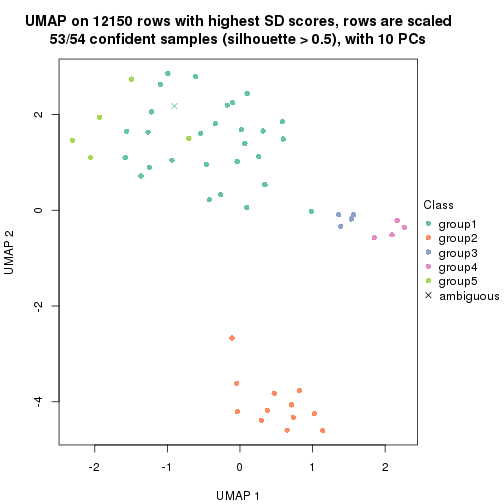</p>

</div>
<div id='tab-SD-pam-dimension-reduction-5'>
<pre><code class="r">dimension_reduction(res, k = 6, method = &quot;UMAP&quot;)
</code></pre>

<p></p>

</div>
</div>


Following heatmap shows how subgroups are split when increasing `k`:

```r
collect_classes(res)
```


Test correlation between subgroups and known annotations. If the known
annotation is numeric, one-way ANOVA test is applied, and if the known
annotation is discrete, chi-squared contingency table test is applied.

```r
test_to_known_factors(res)
```

```
#>         n tissue(p) k
#> SD:pam 54     0.398 2
#> SD:pam 53     0.373 3
#> SD:pam 51     0.483 4
#> SD:pam 53     0.452 5
#> SD:pam 48     0.398 6
```


If matrix rows can be associated to genes, consider to use `functional_enrichment(res,
...)` to perform function enrichment for the signature genes. See [this vignette](http://bioconductor.org/packages/devel/bioc/vignettes/cola/inst/doc/functional_enrichment.html) for more detailed explanations.


 

---------------------------------------------------


### SD:mclust**


The object with results only for a single top-value method and a single partition method 
can be extracted as:

```r
res = res_list["SD", "mclust"]
# you can also extract it by
# res = res_list["SD:mclust"]
```

A summary of `res` and all the functions that can be applied to it:

```r
res
```

```
#> A 'ConsensusPartition' object with k = 2, 3, 4, 5, 6.
#>   On a matrix with 12150 rows and 54 columns.
#>   Top rows (1000, 2000, 3000, 4000, 5000) are extracted by 'SD' method.
#>   Subgroups are detected by 'mclust' method.
#>   Performed in total 1250 partitions by row resampling.
#>   Best k for subgroups seems to be 3.
#> 
#> Following methods can be applied to this 'ConsensusPartition' object:
#>  [1] "cola_report"             "collect_classes"         "collect_plots"          
#>  [4] "collect_stats"           "colnames"                "compare_signatures"     
#>  [7] "consensus_heatmap"       "dimension_reduction"     "functional_enrichment"  
#> [10] "get_anno_col"            "get_anno"                "get_classes"            
#> [13] "get_consensus"           "get_matrix"              "get_membership"         
#> [16] "get_param"               "get_signatures"          "get_stats"              
#> [19] "is_best_k"               "is_stable_k"             "membership_heatmap"     
#> [22] "ncol"                    "nrow"                    "plot_ecdf"              
#> [25] "rownames"                "select_partition_number" "show"                   
#> [28] "suggest_best_k"          "test_to_known_factors"
```

`collect_plots()` function collects all the plots made from `res` for all `k` (number of partitions)
into one single page to provide an easy and fast comparison between different `k`.

```r
collect_plots(res)
```


The plots are:

- The first row: a plot of the ECDF (empirical cumulative distribution
  function) curves of the consensus matrix for each `k` and the heatmap of
  predicted classes for each `k`.
- The second row: heatmaps of the consensus matrix for each `k`.
- The third row: heatmaps of the membership matrix for each `k`.
- The fouth row: heatmaps of the signatures for each `k`.

All the plots in panels can be made by individual functions and they are
plotted later in this section.

`select_partition_number()` produces several plots showing different
statistics for choosing "optimized" `k`. There are following statistics:

- ECDF curves of the consensus matrix for each `k`;
- 1-PAC. [The PAC
  score](https://en.wikipedia.org/wiki/Consensus_clustering#Over-interpretation_potential_of_consensus_clustering)
  measures the proportion of the ambiguous subgrouping.
- Mean silhouette score.
- Concordance. The mean probability of fiting the consensus class ids in all
  partitions.
- Area increased. Denote $A_k$ as the area under the ECDF curve for current
  `k`, the area increased is defined as $A_k - A_{k-1}$.
- Rand index. The percent of pairs of samples that are both in a same cluster
  or both are not in a same cluster in the partition of k and k-1.
- Jaccard index. The ratio of pairs of samples are both in a same cluster in
  the partition of k and k-1 and the pairs of samples are both in a same
  cluster in the partition k or k-1.

The detailed explanations of these statistics can be found in [the _cola_
vignette](http://bioconductor.org/packages/devel/bioc/vignettes/cola/inst/doc/cola.html#toc_13).

Generally speaking, lower PAC score, higher mean silhouette score or higher
concordance corresponds to better partition. Rand index and Jaccard index
measure how similar the current partition is compared to partition with `k-1`.
If they are too similar, we won't accept `k` is better than `k-1`.

```r
select_partition_number(res)
```


The numeric values for all these statistics can be obtained by `get_stats()`.

```r
get_stats(res)
```

```
#>   k 1-PAC mean_silhouette concordance area_increased  Rand Jaccard
#> 2 2 0.688           0.921       0.952         0.4671 0.508   0.508
#> 3 3 1.000           0.993       0.997         0.2386 0.916   0.835
#> 4 4 0.820           0.892       0.936         0.2022 0.906   0.778
#> 5 5 0.800           0.817       0.897         0.1005 0.899   0.701
#> 6 6 0.827           0.853       0.892         0.0442 0.951   0.803
```

`suggest_best_k()` suggests the best $k$ based on these statistics. The rules are as follows:

- All $k$ with Jaccard index larger than 0.95 are removed because increasing
  $k$ does not provide enough extra information. If all $k$ are removed, it is
  marked as no subgroup is detected.
- For all $k$ with 1-PAC score larger than 0.9, the maximal $k$ is taken as
  the best $k$, and other $k$ are marked as optional $k$.
- If it does not fit the second rule. The $k$ with the maximal vote of the
  highest 1-PAC score, highest mean silhouette, and highest concordance is
  taken as the best $k$.

```r
suggest_best_k(res)
```

```
#> [1] 3
```


Following shows the table of the partitions (You need to click the **show/hide
code output** link to see it). The membership matrix (columns with name `p*`)
is inferred by
[`clue::cl_consensus()`](https://www.rdocumentation.org/link/cl_consensus?package=clue)
function with the `SE` method. Basically the value in the membership matrix
represents the probability to belong to a certain group. The finall class
label for an item is determined with the group with highest probability it
belongs to.

In `get_classes()` function, the entropy is calculated from the membership
matrix and the silhouette score is calculated from the consensus matrix.


<script>
$( function() {
	$( '#tabs-SD-mclust-get-classes' ).tabs();
} );
</script>
<div id='tabs-SD-mclust-get-classes'>
<ul>
<li><a href='#tab-SD-mclust-get-classes-1'>k = 2</a></li>
<li><a href='#tab-SD-mclust-get-classes-2'>k = 3</a></li>
<li><a href='#tab-SD-mclust-get-classes-3'>k = 4</a></li>
<li><a href='#tab-SD-mclust-get-classes-4'>k = 5</a></li>
<li><a href='#tab-SD-mclust-get-classes-5'>k = 6</a></li>
</ul>

<div id='tab-SD-mclust-get-classes-1'>
<p><a id='tab-SD-mclust-get-classes-1-a' style='color:#0366d6' href='#'>show/hide code output</a></p>
<pre><code class="r">cbind(get_classes(res, k = 2), get_membership(res, k = 2))
</code></pre>

<pre><code>#&gt;          class entropy silhouette    p1    p2
#&gt; GSM28815     1  0.0376      0.979 0.996 0.004
#&gt; GSM28816     1  0.2043      0.952 0.968 0.032
#&gt; GSM28817     1  0.0000      0.981 1.000 0.000
#&gt; GSM11327     2  0.7453      0.845 0.212 0.788
#&gt; GSM28825     2  0.0000      0.891 0.000 1.000
#&gt; GSM11322     2  0.0000      0.891 0.000 1.000
#&gt; GSM28828     2  0.0000      0.891 0.000 1.000
#&gt; GSM11346     2  0.0000      0.891 0.000 1.000
#&gt; GSM28808     2  0.0000      0.891 0.000 1.000
#&gt; GSM11332     2  0.0000      0.891 0.000 1.000
#&gt; GSM28811     2  0.0000      0.891 0.000 1.000
#&gt; GSM11334     2  0.0000      0.891 0.000 1.000
#&gt; GSM11340     2  0.0000      0.891 0.000 1.000
#&gt; GSM28812     2  0.0000      0.891 0.000 1.000
#&gt; GSM11345     1  0.0000      0.981 1.000 0.000
#&gt; GSM28819     1  0.0000      0.981 1.000 0.000
#&gt; GSM11321     2  0.7453      0.845 0.212 0.788
#&gt; GSM28820     1  0.0000      0.981 1.000 0.000
#&gt; GSM11339     1  0.0000      0.981 1.000 0.000
#&gt; GSM28804     1  0.1184      0.971 0.984 0.016
#&gt; GSM28823     1  0.0000      0.981 1.000 0.000
#&gt; GSM11336     1  0.0000      0.981 1.000 0.000
#&gt; GSM11342     1  0.0000      0.981 1.000 0.000
#&gt; GSM11333     1  0.0000      0.981 1.000 0.000
#&gt; GSM28802     1  0.0000      0.981 1.000 0.000
#&gt; GSM28803     2  0.7453      0.845 0.212 0.788
#&gt; GSM11343     2  0.7453      0.845 0.212 0.788
#&gt; GSM11347     2  0.7453      0.845 0.212 0.788
#&gt; GSM28824     1  0.0000      0.981 1.000 0.000
#&gt; GSM28813     1  0.0000      0.981 1.000 0.000
#&gt; GSM28827     1  0.0000      0.981 1.000 0.000
#&gt; GSM11337     1  0.0000      0.981 1.000 0.000
#&gt; GSM28814     2  0.7453      0.845 0.212 0.788
#&gt; GSM11331     1  0.0000      0.981 1.000 0.000
#&gt; GSM11344     2  0.7453      0.845 0.212 0.788
#&gt; GSM11330     2  0.7453      0.845 0.212 0.788
#&gt; GSM11325     2  0.7453      0.845 0.212 0.788
#&gt; GSM11338     1  0.0000      0.981 1.000 0.000
#&gt; GSM28806     1  0.0000      0.981 1.000 0.000
#&gt; GSM28826     1  0.0000      0.981 1.000 0.000
#&gt; GSM28818     1  0.1184      0.971 0.984 0.016
#&gt; GSM28821     2  0.0000      0.891 0.000 1.000
#&gt; GSM28807     1  0.1184      0.971 0.984 0.016
#&gt; GSM28822     1  0.1184      0.971 0.984 0.016
#&gt; GSM11328     2  0.0000      0.891 0.000 1.000
#&gt; GSM11323     1  0.0000      0.981 1.000 0.000
#&gt; GSM11324     1  0.0000      0.981 1.000 0.000
#&gt; GSM11341     1  0.9460      0.285 0.636 0.364
#&gt; GSM11326     2  0.7453      0.845 0.212 0.788
#&gt; GSM28810     1  0.1184      0.971 0.984 0.016
#&gt; GSM11335     1  0.1184      0.971 0.984 0.016
#&gt; GSM28809     1  0.0000      0.981 1.000 0.000
#&gt; GSM11329     1  0.0000      0.981 1.000 0.000
#&gt; GSM28805     1  0.0000      0.981 1.000 0.000
</code></pre>

<script>
$('#tab-SD-mclust-get-classes-1-a').parent().next().next().hide();
$('#tab-SD-mclust-get-classes-1-a').click(function(){
  $('#tab-SD-mclust-get-classes-1-a').parent().next().next().toggle();
  return(false);
});
</script>
</div>

<div id='tab-SD-mclust-get-classes-2'>
<p><a id='tab-SD-mclust-get-classes-2-a' style='color:#0366d6' href='#'>show/hide code output</a></p>
<pre><code class="r">cbind(get_classes(res, k = 3), get_membership(res, k = 3))
</code></pre>

<pre><code>#&gt;          class entropy silhouette    p1    p2    p3
#&gt; GSM28815     1   0.000      0.995 1.000 0.000 0.000
#&gt; GSM28816     1   0.000      0.995 1.000 0.000 0.000
#&gt; GSM28817     1   0.000      0.995 1.000 0.000 0.000
#&gt; GSM11327     3   0.000      1.000 0.000 0.000 1.000
#&gt; GSM28825     2   0.000      1.000 0.000 1.000 0.000
#&gt; GSM11322     2   0.000      1.000 0.000 1.000 0.000
#&gt; GSM28828     2   0.000      1.000 0.000 1.000 0.000
#&gt; GSM11346     2   0.000      1.000 0.000 1.000 0.000
#&gt; GSM28808     2   0.000      1.000 0.000 1.000 0.000
#&gt; GSM11332     2   0.000      1.000 0.000 1.000 0.000
#&gt; GSM28811     2   0.000      1.000 0.000 1.000 0.000
#&gt; GSM11334     2   0.000      1.000 0.000 1.000 0.000
#&gt; GSM11340     2   0.000      1.000 0.000 1.000 0.000
#&gt; GSM28812     2   0.000      1.000 0.000 1.000 0.000
#&gt; GSM11345     1   0.000      0.995 1.000 0.000 0.000
#&gt; GSM28819     1   0.000      0.995 1.000 0.000 0.000
#&gt; GSM11321     3   0.000      1.000 0.000 0.000 1.000
#&gt; GSM28820     1   0.000      0.995 1.000 0.000 0.000
#&gt; GSM11339     1   0.000      0.995 1.000 0.000 0.000
#&gt; GSM28804     1   0.000      0.995 1.000 0.000 0.000
#&gt; GSM28823     1   0.000      0.995 1.000 0.000 0.000
#&gt; GSM11336     1   0.000      0.995 1.000 0.000 0.000
#&gt; GSM11342     1   0.000      0.995 1.000 0.000 0.000
#&gt; GSM11333     1   0.000      0.995 1.000 0.000 0.000
#&gt; GSM28802     1   0.000      0.995 1.000 0.000 0.000
#&gt; GSM28803     3   0.000      1.000 0.000 0.000 1.000
#&gt; GSM11343     3   0.000      1.000 0.000 0.000 1.000
#&gt; GSM11347     3   0.000      1.000 0.000 0.000 1.000
#&gt; GSM28824     1   0.000      0.995 1.000 0.000 0.000
#&gt; GSM28813     1   0.000      0.995 1.000 0.000 0.000
#&gt; GSM28827     1   0.000      0.995 1.000 0.000 0.000
#&gt; GSM11337     1   0.000      0.995 1.000 0.000 0.000
#&gt; GSM28814     3   0.000      1.000 0.000 0.000 1.000
#&gt; GSM11331     1   0.000      0.995 1.000 0.000 0.000
#&gt; GSM11344     3   0.000      1.000 0.000 0.000 1.000
#&gt; GSM11330     3   0.000      1.000 0.000 0.000 1.000
#&gt; GSM11325     3   0.000      1.000 0.000 0.000 1.000
#&gt; GSM11338     1   0.000      0.995 1.000 0.000 0.000
#&gt; GSM28806     1   0.000      0.995 1.000 0.000 0.000
#&gt; GSM28826     1   0.000      0.995 1.000 0.000 0.000
#&gt; GSM28818     1   0.000      0.995 1.000 0.000 0.000
#&gt; GSM28821     2   0.000      1.000 0.000 1.000 0.000
#&gt; GSM28807     1   0.000      0.995 1.000 0.000 0.000
#&gt; GSM28822     1   0.000      0.995 1.000 0.000 0.000
#&gt; GSM11328     2   0.000      1.000 0.000 1.000 0.000
#&gt; GSM11323     1   0.000      0.995 1.000 0.000 0.000
#&gt; GSM11324     1   0.000      0.995 1.000 0.000 0.000
#&gt; GSM11341     1   0.487      0.802 0.828 0.144 0.028
#&gt; GSM11326     3   0.000      1.000 0.000 0.000 1.000
#&gt; GSM28810     1   0.000      0.995 1.000 0.000 0.000
#&gt; GSM11335     1   0.000      0.995 1.000 0.000 0.000
#&gt; GSM28809     1   0.000      0.995 1.000 0.000 0.000
#&gt; GSM11329     1   0.000      0.995 1.000 0.000 0.000
#&gt; GSM28805     1   0.000      0.995 1.000 0.000 0.000
</code></pre>

<script>
$('#tab-SD-mclust-get-classes-2-a').parent().next().next().hide();
$('#tab-SD-mclust-get-classes-2-a').click(function(){
  $('#tab-SD-mclust-get-classes-2-a').parent().next().next().toggle();
  return(false);
});
</script>
</div>

<div id='tab-SD-mclust-get-classes-3'>
<p><a id='tab-SD-mclust-get-classes-3-a' style='color:#0366d6' href='#'>show/hide code output</a></p>
<pre><code class="r">cbind(get_classes(res, k = 4), get_membership(res, k = 4))
</code></pre>

<pre><code>#&gt;          class entropy silhouette    p1    p2   p3    p4
#&gt; GSM28815     1  0.0000      0.874 1.000 0.000 0.00 0.000
#&gt; GSM28816     1  0.0000      0.874 1.000 0.000 0.00 0.000
#&gt; GSM28817     1  0.0000      0.874 1.000 0.000 0.00 0.000
#&gt; GSM11327     3  0.0000      0.997 0.000 0.000 1.00 0.000
#&gt; GSM28825     2  0.0000      1.000 0.000 1.000 0.00 0.000
#&gt; GSM11322     2  0.0000      1.000 0.000 1.000 0.00 0.000
#&gt; GSM28828     2  0.0000      1.000 0.000 1.000 0.00 0.000
#&gt; GSM11346     2  0.0000      1.000 0.000 1.000 0.00 0.000
#&gt; GSM28808     2  0.0000      1.000 0.000 1.000 0.00 0.000
#&gt; GSM11332     2  0.0000      1.000 0.000 1.000 0.00 0.000
#&gt; GSM28811     2  0.0000      1.000 0.000 1.000 0.00 0.000
#&gt; GSM11334     2  0.0000      1.000 0.000 1.000 0.00 0.000
#&gt; GSM11340     2  0.0000      1.000 0.000 1.000 0.00 0.000
#&gt; GSM28812     2  0.0000      1.000 0.000 1.000 0.00 0.000
#&gt; GSM11345     1  0.3444      0.830 0.816 0.000 0.00 0.184
#&gt; GSM28819     1  0.3311      0.839 0.828 0.000 0.00 0.172
#&gt; GSM11321     3  0.0000      0.997 0.000 0.000 1.00 0.000
#&gt; GSM28820     1  0.3024      0.848 0.852 0.000 0.00 0.148
#&gt; GSM11339     1  0.0188      0.874 0.996 0.000 0.00 0.004
#&gt; GSM28804     4  0.4331      0.639 0.288 0.000 0.00 0.712
#&gt; GSM28823     1  0.3569      0.822 0.804 0.000 0.00 0.196
#&gt; GSM11336     1  0.0188      0.874 0.996 0.000 0.00 0.004
#&gt; GSM11342     1  0.3569      0.822 0.804 0.000 0.00 0.196
#&gt; GSM11333     1  0.0188      0.874 0.996 0.000 0.00 0.004
#&gt; GSM28802     1  0.1118      0.873 0.964 0.000 0.00 0.036
#&gt; GSM28803     3  0.0000      0.997 0.000 0.000 1.00 0.000
#&gt; GSM11343     3  0.0000      0.997 0.000 0.000 1.00 0.000
#&gt; GSM11347     3  0.0000      0.997 0.000 0.000 1.00 0.000
#&gt; GSM28824     1  0.0336      0.874 0.992 0.000 0.00 0.008
#&gt; GSM28813     1  0.0336      0.874 0.992 0.000 0.00 0.008
#&gt; GSM28827     1  0.3172      0.842 0.840 0.000 0.00 0.160
#&gt; GSM11337     1  0.0188      0.874 0.996 0.000 0.00 0.004
#&gt; GSM28814     3  0.0000      0.997 0.000 0.000 1.00 0.000
#&gt; GSM11331     1  0.4454      0.720 0.692 0.000 0.00 0.308
#&gt; GSM11344     3  0.0000      0.997 0.000 0.000 1.00 0.000
#&gt; GSM11330     3  0.0000      0.997 0.000 0.000 1.00 0.000
#&gt; GSM11325     3  0.0000      0.997 0.000 0.000 1.00 0.000
#&gt; GSM11338     1  0.0188      0.874 0.996 0.000 0.00 0.004
#&gt; GSM28806     1  0.4406      0.730 0.700 0.000 0.00 0.300
#&gt; GSM28826     1  0.0188      0.874 0.996 0.000 0.00 0.004
#&gt; GSM28818     1  0.3528      0.694 0.808 0.000 0.00 0.192
#&gt; GSM28821     2  0.0000      1.000 0.000 1.000 0.00 0.000
#&gt; GSM28807     4  0.0469      0.856 0.012 0.000 0.00 0.988
#&gt; GSM28822     4  0.0336      0.858 0.008 0.000 0.00 0.992
#&gt; GSM11328     2  0.0000      1.000 0.000 1.000 0.00 0.000
#&gt; GSM11323     1  0.4454      0.720 0.692 0.000 0.00 0.308
#&gt; GSM11324     1  0.3311      0.836 0.828 0.000 0.00 0.172
#&gt; GSM11341     4  0.2973      0.739 0.000 0.144 0.00 0.856
#&gt; GSM11326     3  0.0707      0.977 0.000 0.000 0.98 0.020
#&gt; GSM28810     1  0.4972      0.459 0.544 0.000 0.00 0.456
#&gt; GSM11335     4  0.0000      0.855 0.000 0.000 0.00 1.000
#&gt; GSM28809     1  0.0336      0.875 0.992 0.000 0.00 0.008
#&gt; GSM11329     1  0.2814      0.852 0.868 0.000 0.00 0.132
#&gt; GSM28805     1  0.0000      0.874 1.000 0.000 0.00 0.000
</code></pre>

<script>
$('#tab-SD-mclust-get-classes-3-a').parent().next().next().hide();
$('#tab-SD-mclust-get-classes-3-a').click(function(){
  $('#tab-SD-mclust-get-classes-3-a').parent().next().next().toggle();
  return(false);
});
</script>
</div>

<div id='tab-SD-mclust-get-classes-4'>
<p><a id='tab-SD-mclust-get-classes-4-a' style='color:#0366d6' href='#'>show/hide code output</a></p>
<pre><code class="r">cbind(get_classes(res, k = 5), get_membership(res, k = 5))
</code></pre>

<pre><code>#&gt;          class entropy silhouette    p1    p2    p3    p4    p5
#&gt; GSM28815     1  0.1544      0.801 0.932 0.000 0.000 0.000 0.068
#&gt; GSM28816     1  0.1608      0.801 0.928 0.000 0.000 0.000 0.072
#&gt; GSM28817     1  0.0880      0.799 0.968 0.000 0.000 0.000 0.032
#&gt; GSM11327     3  0.0000      0.989 0.000 0.000 1.000 0.000 0.000
#&gt; GSM28825     2  0.0000      0.999 0.000 1.000 0.000 0.000 0.000
#&gt; GSM11322     2  0.0000      0.999 0.000 1.000 0.000 0.000 0.000
#&gt; GSM28828     2  0.0162      0.997 0.000 0.996 0.000 0.004 0.000
#&gt; GSM11346     2  0.0000      0.999 0.000 1.000 0.000 0.000 0.000
#&gt; GSM28808     2  0.0000      0.999 0.000 1.000 0.000 0.000 0.000
#&gt; GSM11332     2  0.0000      0.999 0.000 1.000 0.000 0.000 0.000
#&gt; GSM28811     2  0.0000      0.999 0.000 1.000 0.000 0.000 0.000
#&gt; GSM11334     2  0.0000      0.999 0.000 1.000 0.000 0.000 0.000
#&gt; GSM11340     2  0.0000      0.999 0.000 1.000 0.000 0.000 0.000
#&gt; GSM28812     2  0.0000      0.999 0.000 1.000 0.000 0.000 0.000
#&gt; GSM11345     1  0.2139      0.793 0.916 0.000 0.000 0.052 0.032
#&gt; GSM28819     1  0.4817      0.577 0.656 0.000 0.000 0.044 0.300
#&gt; GSM11321     3  0.0162      0.987 0.000 0.000 0.996 0.000 0.004
#&gt; GSM28820     1  0.4402      0.474 0.636 0.000 0.000 0.012 0.352
#&gt; GSM11339     1  0.1732      0.801 0.920 0.000 0.000 0.000 0.080
#&gt; GSM28804     4  0.1830      0.704 0.068 0.000 0.000 0.924 0.008
#&gt; GSM28823     1  0.1877      0.802 0.924 0.000 0.000 0.064 0.012
#&gt; GSM11336     5  0.3857      0.495 0.312 0.000 0.000 0.000 0.688
#&gt; GSM11342     1  0.1845      0.802 0.928 0.000 0.000 0.056 0.016
#&gt; GSM11333     1  0.1792      0.800 0.916 0.000 0.000 0.000 0.084
#&gt; GSM28802     1  0.4746      0.139 0.504 0.000 0.000 0.016 0.480
#&gt; GSM28803     3  0.0000      0.989 0.000 0.000 1.000 0.000 0.000
#&gt; GSM11343     3  0.0000      0.989 0.000 0.000 1.000 0.000 0.000
#&gt; GSM11347     3  0.0000      0.989 0.000 0.000 1.000 0.000 0.000
#&gt; GSM28824     5  0.1478      0.846 0.064 0.000 0.000 0.000 0.936
#&gt; GSM28813     5  0.1341      0.841 0.056 0.000 0.000 0.000 0.944
#&gt; GSM28827     1  0.1484      0.805 0.944 0.000 0.000 0.008 0.048
#&gt; GSM11337     1  0.4210      0.349 0.588 0.000 0.000 0.000 0.412
#&gt; GSM28814     3  0.0162      0.987 0.000 0.000 0.996 0.000 0.004
#&gt; GSM11331     1  0.5531      0.614 0.664 0.000 0.004 0.168 0.164
#&gt; GSM11344     3  0.0000      0.989 0.000 0.000 1.000 0.000 0.000
#&gt; GSM11330     3  0.0000      0.989 0.000 0.000 1.000 0.000 0.000
#&gt; GSM11325     3  0.0162      0.987 0.000 0.000 0.996 0.000 0.004
#&gt; GSM11338     5  0.1965      0.838 0.096 0.000 0.000 0.000 0.904
#&gt; GSM28806     1  0.3810      0.734 0.792 0.000 0.000 0.168 0.040
#&gt; GSM28826     1  0.3857      0.574 0.688 0.000 0.000 0.000 0.312
#&gt; GSM28818     4  0.5091      0.555 0.372 0.000 0.000 0.584 0.044
#&gt; GSM28821     2  0.0324      0.994 0.004 0.992 0.000 0.004 0.000
#&gt; GSM28807     4  0.2930      0.770 0.164 0.000 0.000 0.832 0.004
#&gt; GSM28822     4  0.3010      0.768 0.172 0.000 0.000 0.824 0.004
#&gt; GSM11328     2  0.0162      0.997 0.000 0.996 0.000 0.004 0.000
#&gt; GSM11323     1  0.4855      0.685 0.720 0.000 0.000 0.168 0.112
#&gt; GSM11324     1  0.1750      0.803 0.936 0.000 0.000 0.036 0.028
#&gt; GSM11341     4  0.1525      0.671 0.004 0.036 0.000 0.948 0.012
#&gt; GSM11326     3  0.2144      0.904 0.000 0.000 0.912 0.068 0.020
#&gt; GSM28810     4  0.4298      0.570 0.352 0.000 0.000 0.640 0.008
#&gt; GSM11335     4  0.2069      0.743 0.076 0.000 0.000 0.912 0.012
#&gt; GSM28809     1  0.0880      0.807 0.968 0.000 0.000 0.000 0.032
#&gt; GSM11329     1  0.1121      0.802 0.956 0.000 0.000 0.000 0.044
#&gt; GSM28805     1  0.1792      0.799 0.916 0.000 0.000 0.000 0.084
</code></pre>

<script>
$('#tab-SD-mclust-get-classes-4-a').parent().next().next().hide();
$('#tab-SD-mclust-get-classes-4-a').click(function(){
  $('#tab-SD-mclust-get-classes-4-a').parent().next().next().toggle();
  return(false);
});
</script>
</div>

<div id='tab-SD-mclust-get-classes-5'>
<p><a id='tab-SD-mclust-get-classes-5-a' style='color:#0366d6' href='#'>show/hide code output</a></p>
<pre><code class="r">cbind(get_classes(res, k = 6), get_membership(res, k = 6))
</code></pre>

<pre><code>#&gt;          class entropy silhouette    p1    p2    p3    p4    p5    p6
#&gt; GSM28815     1  0.2043      0.801 0.912 0.000 0.000 0.012 0.012 0.064
#&gt; GSM28816     1  0.2515      0.791 0.888 0.000 0.000 0.016 0.024 0.072
#&gt; GSM28817     1  0.1405      0.829 0.948 0.000 0.000 0.024 0.024 0.004
#&gt; GSM11327     3  0.0000      0.977 0.000 0.000 1.000 0.000 0.000 0.000
#&gt; GSM28825     2  0.0000      0.991 0.000 1.000 0.000 0.000 0.000 0.000
#&gt; GSM11322     2  0.0000      0.991 0.000 1.000 0.000 0.000 0.000 0.000
#&gt; GSM28828     2  0.0146      0.989 0.000 0.996 0.000 0.000 0.000 0.004
#&gt; GSM11346     2  0.0000      0.991 0.000 1.000 0.000 0.000 0.000 0.000
#&gt; GSM28808     2  0.0000      0.991 0.000 1.000 0.000 0.000 0.000 0.000
#&gt; GSM11332     2  0.0000      0.991 0.000 1.000 0.000 0.000 0.000 0.000
#&gt; GSM28811     2  0.0146      0.989 0.000 0.996 0.000 0.000 0.000 0.004
#&gt; GSM11334     2  0.0000      0.991 0.000 1.000 0.000 0.000 0.000 0.000
#&gt; GSM11340     2  0.0000      0.991 0.000 1.000 0.000 0.000 0.000 0.000
#&gt; GSM28812     2  0.0000      0.991 0.000 1.000 0.000 0.000 0.000 0.000
#&gt; GSM11345     1  0.2257      0.811 0.876 0.000 0.000 0.116 0.000 0.008
#&gt; GSM28819     1  0.4321      0.647 0.716 0.000 0.000 0.036 0.228 0.020
#&gt; GSM11321     3  0.0000      0.977 0.000 0.000 1.000 0.000 0.000 0.000
#&gt; GSM28820     1  0.4809      0.173 0.548 0.000 0.000 0.028 0.408 0.016
#&gt; GSM11339     1  0.1528      0.830 0.944 0.000 0.000 0.028 0.012 0.016
#&gt; GSM28804     4  0.0935      0.928 0.032 0.000 0.000 0.964 0.000 0.004
#&gt; GSM28823     1  0.3593      0.785 0.788 0.000 0.000 0.164 0.044 0.004
#&gt; GSM11336     5  0.1444      0.752 0.072 0.000 0.000 0.000 0.928 0.000
#&gt; GSM11342     1  0.3752      0.783 0.772 0.000 0.000 0.164 0.064 0.000
#&gt; GSM11333     1  0.2495      0.792 0.892 0.000 0.000 0.016 0.032 0.060
#&gt; GSM28802     5  0.5021      0.474 0.328 0.000 0.000 0.016 0.600 0.056
#&gt; GSM28803     3  0.0000      0.977 0.000 0.000 1.000 0.000 0.000 0.000
#&gt; GSM11343     6  0.3023      1.000 0.000 0.000 0.232 0.000 0.000 0.768
#&gt; GSM11347     6  0.3023      1.000 0.000 0.000 0.232 0.000 0.000 0.768
#&gt; GSM28824     5  0.0000      0.766 0.000 0.000 0.000 0.000 1.000 0.000
#&gt; GSM28813     5  0.0000      0.766 0.000 0.000 0.000 0.000 1.000 0.000
#&gt; GSM28827     1  0.1934      0.827 0.916 0.000 0.000 0.040 0.044 0.000
#&gt; GSM11337     5  0.4994      0.495 0.320 0.000 0.000 0.016 0.608 0.056
#&gt; GSM28814     3  0.0000      0.977 0.000 0.000 1.000 0.000 0.000 0.000
#&gt; GSM11331     1  0.4721      0.707 0.672 0.000 0.000 0.212 0.000 0.116
#&gt; GSM11344     6  0.3023      1.000 0.000 0.000 0.232 0.000 0.000 0.768
#&gt; GSM11330     6  0.3023      1.000 0.000 0.000 0.232 0.000 0.000 0.768
#&gt; GSM11325     3  0.0000      0.977 0.000 0.000 1.000 0.000 0.000 0.000
#&gt; GSM11338     5  0.0146      0.767 0.004 0.000 0.000 0.000 0.996 0.000
#&gt; GSM28806     1  0.4357      0.721 0.696 0.000 0.000 0.232 0.000 0.072
#&gt; GSM28826     1  0.4492      0.658 0.724 0.000 0.000 0.020 0.192 0.064
#&gt; GSM28818     4  0.2882      0.776 0.180 0.000 0.000 0.812 0.000 0.008
#&gt; GSM28821     2  0.1861      0.933 0.036 0.928 0.000 0.020 0.000 0.016
#&gt; GSM28807     4  0.0937      0.935 0.040 0.000 0.000 0.960 0.000 0.000
#&gt; GSM28822     4  0.0790      0.935 0.032 0.000 0.000 0.968 0.000 0.000
#&gt; GSM11328     2  0.0692      0.972 0.000 0.976 0.000 0.020 0.000 0.004
#&gt; GSM11323     1  0.4582      0.715 0.684 0.000 0.000 0.216 0.000 0.100
#&gt; GSM11324     1  0.1226      0.830 0.952 0.000 0.000 0.040 0.004 0.004
#&gt; GSM11341     4  0.3043      0.839 0.020 0.000 0.008 0.832 0.000 0.140
#&gt; GSM11326     3  0.1863      0.884 0.000 0.000 0.920 0.044 0.000 0.036
#&gt; GSM28810     4  0.0865      0.935 0.036 0.000 0.000 0.964 0.000 0.000
#&gt; GSM11335     4  0.1049      0.935 0.032 0.000 0.000 0.960 0.000 0.008
#&gt; GSM28809     1  0.0260      0.825 0.992 0.000 0.000 0.000 0.000 0.008
#&gt; GSM11329     1  0.1720      0.827 0.928 0.000 0.000 0.032 0.040 0.000
#&gt; GSM28805     1  0.1353      0.827 0.952 0.000 0.000 0.024 0.012 0.012
</code></pre>

<script>
$('#tab-SD-mclust-get-classes-5-a').parent().next().next().hide();
$('#tab-SD-mclust-get-classes-5-a').click(function(){
  $('#tab-SD-mclust-get-classes-5-a').parent().next().next().toggle();
  return(false);
});
</script>
</div>
</div>

Heatmaps for the consensus matrix. It visualizes the probability of two
samples to be in a same group.


<script>
$( function() {
	$( '#tabs-SD-mclust-consensus-heatmap' ).tabs();
} );
</script>
<div id='tabs-SD-mclust-consensus-heatmap'>
<ul>
<li><a href='#tab-SD-mclust-consensus-heatmap-1'>k = 2</a></li>
<li><a href='#tab-SD-mclust-consensus-heatmap-2'>k = 3</a></li>
<li><a href='#tab-SD-mclust-consensus-heatmap-3'>k = 4</a></li>
<li><a href='#tab-SD-mclust-consensus-heatmap-4'>k = 5</a></li>
<li><a href='#tab-SD-mclust-consensus-heatmap-5'>k = 6</a></li>
</ul>
<div id='tab-SD-mclust-consensus-heatmap-1'>
<pre><code class="r">consensus_heatmap(res, k = 2)
</code></pre>

<p></p>

</div>
<div id='tab-SD-mclust-consensus-heatmap-2'>
<pre><code class="r">consensus_heatmap(res, k = 3)
</code></pre>

<p></p>

</div>
<div id='tab-SD-mclust-consensus-heatmap-3'>
<pre><code class="r">consensus_heatmap(res, k = 4)
</code></pre>

<p></p>

</div>
<div id='tab-SD-mclust-consensus-heatmap-4'>
<pre><code class="r">consensus_heatmap(res, k = 5)
</code></pre>

<p></p>

</div>
<div id='tab-SD-mclust-consensus-heatmap-5'>
<pre><code class="r">consensus_heatmap(res, k = 6)
</code></pre>

<p></p>

</div>
</div>

Heatmaps for the membership of samples in all partitions to see how consistent they are:


<script>
$( function() {
	$( '#tabs-SD-mclust-membership-heatmap' ).tabs();
} );
</script>
<div id='tabs-SD-mclust-membership-heatmap'>
<ul>
<li><a href='#tab-SD-mclust-membership-heatmap-1'>k = 2</a></li>
<li><a href='#tab-SD-mclust-membership-heatmap-2'>k = 3</a></li>
<li><a href='#tab-SD-mclust-membership-heatmap-3'>k = 4</a></li>
<li><a href='#tab-SD-mclust-membership-heatmap-4'>k = 5</a></li>
<li><a href='#tab-SD-mclust-membership-heatmap-5'>k = 6</a></li>
</ul>
<div id='tab-SD-mclust-membership-heatmap-1'>
<pre><code class="r">membership_heatmap(res, k = 2)
</code></pre>

<p></p>

</div>
<div id='tab-SD-mclust-membership-heatmap-2'>
<pre><code class="r">membership_heatmap(res, k = 3)
</code></pre>

<p></p>

</div>
<div id='tab-SD-mclust-membership-heatmap-3'>
<pre><code class="r">membership_heatmap(res, k = 4)
</code></pre>

<p></p>

</div>
<div id='tab-SD-mclust-membership-heatmap-4'>
<pre><code class="r">membership_heatmap(res, k = 5)
</code></pre>

<p></p>

</div>
<div id='tab-SD-mclust-membership-heatmap-5'>
<pre><code class="r">membership_heatmap(res, k = 6)
</code></pre>

<p></p>

</div>
</div>

As soon as we have had the classes for columns, we can look for signatures
which are significantly different between classes which can be candidate marks
for certain classes. Following are the heatmaps for signatures.


Signature heatmaps where rows are scaled:


<script>
$( function() {
	$( '#tabs-SD-mclust-get-signatures' ).tabs();
} );
</script>
<div id='tabs-SD-mclust-get-signatures'>
<ul>
<li><a href='#tab-SD-mclust-get-signatures-1'>k = 2</a></li>
<li><a href='#tab-SD-mclust-get-signatures-2'>k = 3</a></li>
<li><a href='#tab-SD-mclust-get-signatures-3'>k = 4</a></li>
<li><a href='#tab-SD-mclust-get-signatures-4'>k = 5</a></li>
<li><a href='#tab-SD-mclust-get-signatures-5'>k = 6</a></li>
</ul>
<div id='tab-SD-mclust-get-signatures-1'>
<pre><code class="r">get_signatures(res, k = 2)
</code></pre>

<p></p>

</div>
<div id='tab-SD-mclust-get-signatures-2'>
<pre><code class="r">get_signatures(res, k = 3)
</code></pre>

<p></p>

</div>
<div id='tab-SD-mclust-get-signatures-3'>
<pre><code class="r">get_signatures(res, k = 4)
</code></pre>

<p></p>

</div>
<div id='tab-SD-mclust-get-signatures-4'>
<pre><code class="r">get_signatures(res, k = 5)
</code></pre>

<p></p>

</div>
<div id='tab-SD-mclust-get-signatures-5'>
<pre><code class="r">get_signatures(res, k = 6)
</code></pre>

<p>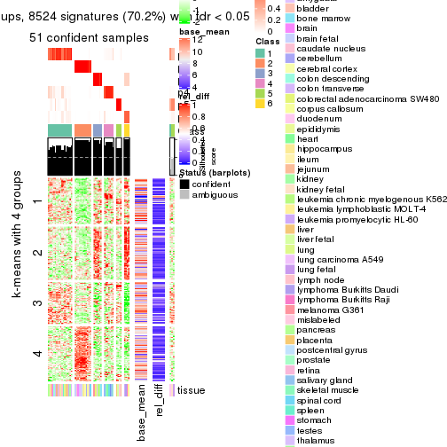</p>

</div>
</div>


Signature heatmaps where rows are not scaled:


<script>
$( function() {
	$( '#tabs-SD-mclust-get-signatures-no-scale' ).tabs();
} );
</script>
<div id='tabs-SD-mclust-get-signatures-no-scale'>
<ul>
<li><a href='#tab-SD-mclust-get-signatures-no-scale-1'>k = 2</a></li>
<li><a href='#tab-SD-mclust-get-signatures-no-scale-2'>k = 3</a></li>
<li><a href='#tab-SD-mclust-get-signatures-no-scale-3'>k = 4</a></li>
<li><a href='#tab-SD-mclust-get-signatures-no-scale-4'>k = 5</a></li>
<li><a href='#tab-SD-mclust-get-signatures-no-scale-5'>k = 6</a></li>
</ul>
<div id='tab-SD-mclust-get-signatures-no-scale-1'>
<pre><code class="r">get_signatures(res, k = 2, scale_rows = FALSE)
</code></pre>

<p></p>

</div>
<div id='tab-SD-mclust-get-signatures-no-scale-2'>
<pre><code class="r">get_signatures(res, k = 3, scale_rows = FALSE)
</code></pre>

<p></p>

</div>
<div id='tab-SD-mclust-get-signatures-no-scale-3'>
<pre><code class="r">get_signatures(res, k = 4, scale_rows = FALSE)
</code></pre>

<p></p>

</div>
<div id='tab-SD-mclust-get-signatures-no-scale-4'>
<pre><code class="r">get_signatures(res, k = 5, scale_rows = FALSE)
</code></pre>

<p></p>

</div>
<div id='tab-SD-mclust-get-signatures-no-scale-5'>
<pre><code class="r">get_signatures(res, k = 6, scale_rows = FALSE)
</code></pre>

<p></p>

</div>
</div>


Compare the overlap of signatures from different k:

```r
compare_signatures(res)
```


`get_signature()` returns a data frame invisibly. TO get the list of signatures, the function
call should be assigned to a variable explicitly. In following code, if `plot` argument is set
to `FALSE`, no heatmap is plotted while only the differential analysis is performed.

```r
# code only for demonstration
tb = get_signature(res, k = ..., plot = FALSE)
```

An example of the output of `tb` is:

```
#>   which_row         fdr    mean_1    mean_2 scaled_mean_1 scaled_mean_2 km
#> 1        38 0.042760348  8.373488  9.131774    -0.5533452     0.5164555  1
#> 2        40 0.018707592  7.106213  8.469186    -0.6173731     0.5762149  1
#> 3        55 0.019134737 10.221463 11.207825    -0.6159697     0.5749050  1
#> 4        59 0.006059896  5.921854  7.869574    -0.6899429     0.6439467  1
#> 5        60 0.018055526  8.928898 10.211722    -0.6204761     0.5791110  1
#> 6        98 0.009384629 15.714769 14.887706     0.6635654    -0.6193277  2
...
```

The columns in `tb` are:

1. `which_row`: row indices corresponding to the input matrix.
2. `fdr`: FDR for the differential test. 
3. `mean_x`: The mean value in group x.
4. `scaled_mean_x`: The mean value in group x after rows are scaled.
5. `km`: Row groups if k-means clustering is applied to rows.


UMAP plot which shows how samples are separated.


<script>
$( function() {
	$( '#tabs-SD-mclust-dimension-reduction' ).tabs();
} );
</script>
<div id='tabs-SD-mclust-dimension-reduction'>
<ul>
<li><a href='#tab-SD-mclust-dimension-reduction-1'>k = 2</a></li>
<li><a href='#tab-SD-mclust-dimension-reduction-2'>k = 3</a></li>
<li><a href='#tab-SD-mclust-dimension-reduction-3'>k = 4</a></li>
<li><a href='#tab-SD-mclust-dimension-reduction-4'>k = 5</a></li>
<li><a href='#tab-SD-mclust-dimension-reduction-5'>k = 6</a></li>
</ul>
<div id='tab-SD-mclust-dimension-reduction-1'>
<pre><code class="r">dimension_reduction(res, k = 2, method = &quot;UMAP&quot;)
</code></pre>

<p></p>

</div>
<div id='tab-SD-mclust-dimension-reduction-2'>
<pre><code class="r">dimension_reduction(res, k = 3, method = &quot;UMAP&quot;)
</code></pre>

<p></p>

</div>
<div id='tab-SD-mclust-dimension-reduction-3'>
<pre><code class="r">dimension_reduction(res, k = 4, method = &quot;UMAP&quot;)
</code></pre>

<p></p>

</div>
<div id='tab-SD-mclust-dimension-reduction-4'>
<pre><code class="r">dimension_reduction(res, k = 5, method = &quot;UMAP&quot;)
</code></pre>

<p></p>

</div>
<div id='tab-SD-mclust-dimension-reduction-5'>
<pre><code class="r">dimension_reduction(res, k = 6, method = &quot;UMAP&quot;)
</code></pre>

<p></p>

</div>
</div>


Following heatmap shows how subgroups are split when increasing `k`:

```r
collect_classes(res)
```


Test correlation between subgroups and known annotations. If the known
annotation is numeric, one-way ANOVA test is applied, and if the known
annotation is discrete, chi-squared contingency table test is applied.

```r
test_to_known_factors(res)
```

```
#>            n tissue(p) k
#> SD:mclust 53     0.397 2
#> SD:mclust 54     0.374 3
#> SD:mclust 53     0.353 4
#> SD:mclust 50     0.407 5
#> SD:mclust 51     0.448 6
```


If matrix rows can be associated to genes, consider to use `functional_enrichment(res,
...)` to perform function enrichment for the signature genes. See [this vignette](http://bioconductor.org/packages/devel/bioc/vignettes/cola/inst/doc/functional_enrichment.html) for more detailed explanations.


 

---------------------------------------------------


### SD:NMF**


The object with results only for a single top-value method and a single partition method 
can be extracted as:

```r
res = res_list["SD", "NMF"]
# you can also extract it by
# res = res_list["SD:NMF"]
```

A summary of `res` and all the functions that can be applied to it:

```r
res
```

```
#> A 'ConsensusPartition' object with k = 2, 3, 4, 5, 6.
#>   On a matrix with 12150 rows and 54 columns.
#>   Top rows (1000, 2000, 3000, 4000, 5000) are extracted by 'SD' method.
#>   Subgroups are detected by 'NMF' method.
#>   Performed in total 1250 partitions by row resampling.
#>   Best k for subgroups seems to be 3.
#> 
#> Following methods can be applied to this 'ConsensusPartition' object:
#>  [1] "cola_report"             "collect_classes"         "collect_plots"          
#>  [4] "collect_stats"           "colnames"                "compare_signatures"     
#>  [7] "consensus_heatmap"       "dimension_reduction"     "functional_enrichment"  
#> [10] "get_anno_col"            "get_anno"                "get_classes"            
#> [13] "get_consensus"           "get_matrix"              "get_membership"         
#> [16] "get_param"               "get_signatures"          "get_stats"              
#> [19] "is_best_k"               "is_stable_k"             "membership_heatmap"     
#> [22] "ncol"                    "nrow"                    "plot_ecdf"              
#> [25] "rownames"                "select_partition_number" "show"                   
#> [28] "suggest_best_k"          "test_to_known_factors"
```

`collect_plots()` function collects all the plots made from `res` for all `k` (number of partitions)
into one single page to provide an easy and fast comparison between different `k`.

```r
collect_plots(res)
```


The plots are:

- The first row: a plot of the ECDF (empirical cumulative distribution
  function) curves of the consensus matrix for each `k` and the heatmap of
  predicted classes for each `k`.
- The second row: heatmaps of the consensus matrix for each `k`.
- The third row: heatmaps of the membership matrix for each `k`.
- The fouth row: heatmaps of the signatures for each `k`.

All the plots in panels can be made by individual functions and they are
plotted later in this section.

`select_partition_number()` produces several plots showing different
statistics for choosing "optimized" `k`. There are following statistics:

- ECDF curves of the consensus matrix for each `k`;
- 1-PAC. [The PAC
  score](https://en.wikipedia.org/wiki/Consensus_clustering#Over-interpretation_potential_of_consensus_clustering)
  measures the proportion of the ambiguous subgrouping.
- Mean silhouette score.
- Concordance. The mean probability of fiting the consensus class ids in all
  partitions.
- Area increased. Denote $A_k$ as the area under the ECDF curve for current
  `k`, the area increased is defined as $A_k - A_{k-1}$.
- Rand index. The percent of pairs of samples that are both in a same cluster
  or both are not in a same cluster in the partition of k and k-1.
- Jaccard index. The ratio of pairs of samples are both in a same cluster in
  the partition of k and k-1 and the pairs of samples are both in a same
  cluster in the partition k or k-1.

The detailed explanations of these statistics can be found in [the _cola_
vignette](http://bioconductor.org/packages/devel/bioc/vignettes/cola/inst/doc/cola.html#toc_13).

Generally speaking, lower PAC score, higher mean silhouette score or higher
concordance corresponds to better partition. Rand index and Jaccard index
measure how similar the current partition is compared to partition with `k-1`.
If they are too similar, we won't accept `k` is better than `k-1`.

```r
select_partition_number(res)
```


The numeric values for all these statistics can be obtained by `get_stats()`.

```r
get_stats(res)
```

```
#>   k 1-PAC mean_silhouette concordance area_increased  Rand Jaccard
#> 2 2 1.000           0.989       0.995         0.3580 0.648   0.648
#> 3 3 1.000           0.996       0.998         0.6514 0.762   0.632
#> 4 4 0.769           0.793       0.872         0.2337 0.839   0.614
#> 5 5 0.822           0.816       0.897         0.0811 0.883   0.598
#> 6 6 0.853           0.762       0.878         0.0454 0.921   0.648
```

`suggest_best_k()` suggests the best $k$ based on these statistics. The rules are as follows:

- All $k$ with Jaccard index larger than 0.95 are removed because increasing
  $k$ does not provide enough extra information. If all $k$ are removed, it is
  marked as no subgroup is detected.
- For all $k$ with 1-PAC score larger than 0.9, the maximal $k$ is taken as
  the best $k$, and other $k$ are marked as optional $k$.
- If it does not fit the second rule. The $k$ with the maximal vote of the
  highest 1-PAC score, highest mean silhouette, and highest concordance is
  taken as the best $k$.

```r
suggest_best_k(res)
```

```
#> [1] 3
#> attr(,"optional")
#> [1] 2
```

There is also optional best $k$ = 2 that is worth to check.

Following shows the table of the partitions (You need to click the **show/hide
code output** link to see it). The membership matrix (columns with name `p*`)
is inferred by
[`clue::cl_consensus()`](https://www.rdocumentation.org/link/cl_consensus?package=clue)
function with the `SE` method. Basically the value in the membership matrix
represents the probability to belong to a certain group. The finall class
label for an item is determined with the group with highest probability it
belongs to.

In `get_classes()` function, the entropy is calculated from the membership
matrix and the silhouette score is calculated from the consensus matrix.


<script>
$( function() {
	$( '#tabs-SD-NMF-get-classes' ).tabs();
} );
</script>
<div id='tabs-SD-NMF-get-classes'>
<ul>
<li><a href='#tab-SD-NMF-get-classes-1'>k = 2</a></li>
<li><a href='#tab-SD-NMF-get-classes-2'>k = 3</a></li>
<li><a href='#tab-SD-NMF-get-classes-3'>k = 4</a></li>
<li><a href='#tab-SD-NMF-get-classes-4'>k = 5</a></li>
<li><a href='#tab-SD-NMF-get-classes-5'>k = 6</a></li>
</ul>

<div id='tab-SD-NMF-get-classes-1'>
<p><a id='tab-SD-NMF-get-classes-1-a' style='color:#0366d6' href='#'>show/hide code output</a></p>
<pre><code class="r">cbind(get_classes(res, k = 2), get_membership(res, k = 2))
</code></pre>

<pre><code>#&gt;          class entropy silhouette    p1    p2
#&gt; GSM28815     1   0.000      0.994 1.000 0.000
#&gt; GSM28816     1   0.821      0.656 0.744 0.256
#&gt; GSM28817     1   0.000      0.994 1.000 0.000
#&gt; GSM11327     1   0.000      0.994 1.000 0.000
#&gt; GSM28825     2   0.000      1.000 0.000 1.000
#&gt; GSM11322     2   0.000      1.000 0.000 1.000
#&gt; GSM28828     2   0.000      1.000 0.000 1.000
#&gt; GSM11346     2   0.000      1.000 0.000 1.000
#&gt; GSM28808     2   0.000      1.000 0.000 1.000
#&gt; GSM11332     2   0.000      1.000 0.000 1.000
#&gt; GSM28811     2   0.000      1.000 0.000 1.000
#&gt; GSM11334     2   0.000      1.000 0.000 1.000
#&gt; GSM11340     2   0.000      1.000 0.000 1.000
#&gt; GSM28812     2   0.000      1.000 0.000 1.000
#&gt; GSM11345     1   0.000      0.994 1.000 0.000
#&gt; GSM28819     1   0.000      0.994 1.000 0.000
#&gt; GSM11321     1   0.000      0.994 1.000 0.000
#&gt; GSM28820     1   0.000      0.994 1.000 0.000
#&gt; GSM11339     1   0.000      0.994 1.000 0.000
#&gt; GSM28804     1   0.000      0.994 1.000 0.000
#&gt; GSM28823     1   0.000      0.994 1.000 0.000
#&gt; GSM11336     1   0.000      0.994 1.000 0.000
#&gt; GSM11342     1   0.000      0.994 1.000 0.000
#&gt; GSM11333     1   0.000      0.994 1.000 0.000
#&gt; GSM28802     1   0.000      0.994 1.000 0.000
#&gt; GSM28803     1   0.000      0.994 1.000 0.000
#&gt; GSM11343     1   0.000      0.994 1.000 0.000
#&gt; GSM11347     1   0.000      0.994 1.000 0.000
#&gt; GSM28824     1   0.000      0.994 1.000 0.000
#&gt; GSM28813     1   0.000      0.994 1.000 0.000
#&gt; GSM28827     1   0.000      0.994 1.000 0.000
#&gt; GSM11337     1   0.000      0.994 1.000 0.000
#&gt; GSM28814     1   0.000      0.994 1.000 0.000
#&gt; GSM11331     1   0.000      0.994 1.000 0.000
#&gt; GSM11344     1   0.000      0.994 1.000 0.000
#&gt; GSM11330     1   0.000      0.994 1.000 0.000
#&gt; GSM11325     1   0.000      0.994 1.000 0.000
#&gt; GSM11338     1   0.000      0.994 1.000 0.000
#&gt; GSM28806     1   0.000      0.994 1.000 0.000
#&gt; GSM28826     1   0.000      0.994 1.000 0.000
#&gt; GSM28818     1   0.000      0.994 1.000 0.000
#&gt; GSM28821     2   0.000      1.000 0.000 1.000
#&gt; GSM28807     1   0.000      0.994 1.000 0.000
#&gt; GSM28822     1   0.000      0.994 1.000 0.000
#&gt; GSM11328     2   0.000      1.000 0.000 1.000
#&gt; GSM11323     1   0.000      0.994 1.000 0.000
#&gt; GSM11324     1   0.000      0.994 1.000 0.000
#&gt; GSM11341     1   0.000      0.994 1.000 0.000
#&gt; GSM11326     1   0.000      0.994 1.000 0.000
#&gt; GSM28810     1   0.000      0.994 1.000 0.000
#&gt; GSM11335     1   0.000      0.994 1.000 0.000
#&gt; GSM28809     1   0.000      0.994 1.000 0.000
#&gt; GSM11329     1   0.000      0.994 1.000 0.000
#&gt; GSM28805     1   0.000      0.994 1.000 0.000
</code></pre>

<script>
$('#tab-SD-NMF-get-classes-1-a').parent().next().next().hide();
$('#tab-SD-NMF-get-classes-1-a').click(function(){
  $('#tab-SD-NMF-get-classes-1-a').parent().next().next().toggle();
  return(false);
});
</script>
</div>

<div id='tab-SD-NMF-get-classes-2'>
<p><a id='tab-SD-NMF-get-classes-2-a' style='color:#0366d6' href='#'>show/hide code output</a></p>
<pre><code class="r">cbind(get_classes(res, k = 3), get_membership(res, k = 3))
</code></pre>

<pre><code>#&gt;          class entropy silhouette    p1 p2    p3
#&gt; GSM28815     1   0.000      0.998 1.000  0 0.000
#&gt; GSM28816     1   0.000      0.998 1.000  0 0.000
#&gt; GSM28817     1   0.000      0.998 1.000  0 0.000
#&gt; GSM11327     3   0.000      0.996 0.000  0 1.000
#&gt; GSM28825     2   0.000      1.000 0.000  1 0.000
#&gt; GSM11322     2   0.000      1.000 0.000  1 0.000
#&gt; GSM28828     2   0.000      1.000 0.000  1 0.000
#&gt; GSM11346     2   0.000      1.000 0.000  1 0.000
#&gt; GSM28808     2   0.000      1.000 0.000  1 0.000
#&gt; GSM11332     2   0.000      1.000 0.000  1 0.000
#&gt; GSM28811     2   0.000      1.000 0.000  1 0.000
#&gt; GSM11334     2   0.000      1.000 0.000  1 0.000
#&gt; GSM11340     2   0.000      1.000 0.000  1 0.000
#&gt; GSM28812     2   0.000      1.000 0.000  1 0.000
#&gt; GSM11345     1   0.000      0.998 1.000  0 0.000
#&gt; GSM28819     1   0.000      0.998 1.000  0 0.000
#&gt; GSM11321     3   0.000      0.996 0.000  0 1.000
#&gt; GSM28820     1   0.000      0.998 1.000  0 0.000
#&gt; GSM11339     1   0.000      0.998 1.000  0 0.000
#&gt; GSM28804     1   0.000      0.998 1.000  0 0.000
#&gt; GSM28823     1   0.000      0.998 1.000  0 0.000
#&gt; GSM11336     1   0.000      0.998 1.000  0 0.000
#&gt; GSM11342     1   0.000      0.998 1.000  0 0.000
#&gt; GSM11333     1   0.000      0.998 1.000  0 0.000
#&gt; GSM28802     1   0.000      0.998 1.000  0 0.000
#&gt; GSM28803     3   0.000      0.996 0.000  0 1.000
#&gt; GSM11343     3   0.000      0.996 0.000  0 1.000
#&gt; GSM11347     3   0.000      0.996 0.000  0 1.000
#&gt; GSM28824     1   0.000      0.998 1.000  0 0.000
#&gt; GSM28813     1   0.196      0.940 0.944  0 0.056
#&gt; GSM28827     1   0.000      0.998 1.000  0 0.000
#&gt; GSM11337     1   0.000      0.998 1.000  0 0.000
#&gt; GSM28814     3   0.000      0.996 0.000  0 1.000
#&gt; GSM11331     1   0.000      0.998 1.000  0 0.000
#&gt; GSM11344     3   0.000      0.996 0.000  0 1.000
#&gt; GSM11330     3   0.000      0.996 0.000  0 1.000
#&gt; GSM11325     3   0.000      0.996 0.000  0 1.000
#&gt; GSM11338     1   0.000      0.998 1.000  0 0.000
#&gt; GSM28806     1   0.000      0.998 1.000  0 0.000
#&gt; GSM28826     1   0.000      0.998 1.000  0 0.000
#&gt; GSM28818     1   0.000      0.998 1.000  0 0.000
#&gt; GSM28821     2   0.000      1.000 0.000  1 0.000
#&gt; GSM28807     1   0.000      0.998 1.000  0 0.000
#&gt; GSM28822     1   0.000      0.998 1.000  0 0.000
#&gt; GSM11328     2   0.000      1.000 0.000  1 0.000
#&gt; GSM11323     1   0.000      0.998 1.000  0 0.000
#&gt; GSM11324     1   0.000      0.998 1.000  0 0.000
#&gt; GSM11341     3   0.116      0.962 0.028  0 0.972
#&gt; GSM11326     3   0.000      0.996 0.000  0 1.000
#&gt; GSM28810     1   0.000      0.998 1.000  0 0.000
#&gt; GSM11335     1   0.000      0.998 1.000  0 0.000
#&gt; GSM28809     1   0.000      0.998 1.000  0 0.000
#&gt; GSM11329     1   0.000      0.998 1.000  0 0.000
#&gt; GSM28805     1   0.000      0.998 1.000  0 0.000
</code></pre>

<script>
$('#tab-SD-NMF-get-classes-2-a').parent().next().next().hide();
$('#tab-SD-NMF-get-classes-2-a').click(function(){
  $('#tab-SD-NMF-get-classes-2-a').parent().next().next().toggle();
  return(false);
});
</script>
</div>

<div id='tab-SD-NMF-get-classes-3'>
<p><a id='tab-SD-NMF-get-classes-3-a' style='color:#0366d6' href='#'>show/hide code output</a></p>
<pre><code class="r">cbind(get_classes(res, k = 4), get_membership(res, k = 4))
</code></pre>

<pre><code>#&gt;          class entropy silhouette    p1    p2    p3    p4
#&gt; GSM28815     1  0.3649     0.7525 0.796 0.000 0.000 0.204
#&gt; GSM28816     1  0.2197     0.6843 0.916 0.004 0.000 0.080
#&gt; GSM28817     1  0.4406     0.7356 0.700 0.000 0.000 0.300
#&gt; GSM11327     3  0.1022     0.9484 0.032 0.000 0.968 0.000
#&gt; GSM28825     2  0.0000     1.0000 0.000 1.000 0.000 0.000
#&gt; GSM11322     2  0.0000     1.0000 0.000 1.000 0.000 0.000
#&gt; GSM28828     2  0.0000     1.0000 0.000 1.000 0.000 0.000
#&gt; GSM11346     2  0.0000     1.0000 0.000 1.000 0.000 0.000
#&gt; GSM28808     2  0.0000     1.0000 0.000 1.000 0.000 0.000
#&gt; GSM11332     2  0.0000     1.0000 0.000 1.000 0.000 0.000
#&gt; GSM28811     2  0.0000     1.0000 0.000 1.000 0.000 0.000
#&gt; GSM11334     2  0.0000     1.0000 0.000 1.000 0.000 0.000
#&gt; GSM11340     2  0.0000     1.0000 0.000 1.000 0.000 0.000
#&gt; GSM28812     2  0.0000     1.0000 0.000 1.000 0.000 0.000
#&gt; GSM11345     1  0.4790     0.6148 0.620 0.000 0.000 0.380
#&gt; GSM28819     1  0.4193     0.7497 0.732 0.000 0.000 0.268
#&gt; GSM11321     3  0.1792     0.9350 0.068 0.000 0.932 0.000
#&gt; GSM28820     1  0.4164     0.7508 0.736 0.000 0.000 0.264
#&gt; GSM11339     4  0.4866     0.0487 0.404 0.000 0.000 0.596
#&gt; GSM28804     4  0.1022     0.7872 0.032 0.000 0.000 0.968
#&gt; GSM28823     1  0.4406     0.7368 0.700 0.000 0.000 0.300
#&gt; GSM11336     1  0.0592     0.7183 0.984 0.000 0.000 0.016
#&gt; GSM11342     1  0.4382     0.7390 0.704 0.000 0.000 0.296
#&gt; GSM11333     1  0.2921     0.6513 0.860 0.000 0.000 0.140
#&gt; GSM28802     1  0.1557     0.7383 0.944 0.000 0.000 0.056
#&gt; GSM28803     3  0.1302     0.9457 0.044 0.000 0.956 0.000
#&gt; GSM11343     3  0.0000     0.9510 0.000 0.000 1.000 0.000
#&gt; GSM11347     3  0.0000     0.9510 0.000 0.000 1.000 0.000
#&gt; GSM28824     1  0.0592     0.7183 0.984 0.000 0.000 0.016
#&gt; GSM28813     1  0.1510     0.6974 0.956 0.000 0.028 0.016
#&gt; GSM28827     1  0.4406     0.7353 0.700 0.000 0.000 0.300
#&gt; GSM11337     1  0.0336     0.7299 0.992 0.000 0.000 0.008
#&gt; GSM28814     3  0.2999     0.8904 0.132 0.000 0.864 0.004
#&gt; GSM11331     4  0.5407     0.4029 0.296 0.000 0.036 0.668
#&gt; GSM11344     3  0.0000     0.9510 0.000 0.000 1.000 0.000
#&gt; GSM11330     3  0.0000     0.9510 0.000 0.000 1.000 0.000
#&gt; GSM11325     3  0.3498     0.8626 0.160 0.000 0.832 0.008
#&gt; GSM11338     1  0.0000     0.7262 1.000 0.000 0.000 0.000
#&gt; GSM28806     4  0.2345     0.7413 0.100 0.000 0.000 0.900
#&gt; GSM28826     1  0.0000     0.7262 1.000 0.000 0.000 0.000
#&gt; GSM28818     4  0.1302     0.7907 0.044 0.000 0.000 0.956
#&gt; GSM28821     2  0.0000     1.0000 0.000 1.000 0.000 0.000
#&gt; GSM28807     4  0.0817     0.7860 0.024 0.000 0.000 0.976
#&gt; GSM28822     4  0.0592     0.7884 0.016 0.000 0.000 0.984
#&gt; GSM11328     2  0.0000     1.0000 0.000 1.000 0.000 0.000
#&gt; GSM11323     4  0.4193     0.4958 0.268 0.000 0.000 0.732
#&gt; GSM11324     1  0.4431     0.7315 0.696 0.000 0.000 0.304
#&gt; GSM11341     4  0.4560     0.3574 0.004 0.000 0.296 0.700
#&gt; GSM11326     3  0.0469     0.9458 0.000 0.000 0.988 0.012
#&gt; GSM28810     4  0.0921     0.7850 0.028 0.000 0.000 0.972
#&gt; GSM11335     4  0.0707     0.7898 0.020 0.000 0.000 0.980
#&gt; GSM28809     1  0.4989     0.2983 0.528 0.000 0.000 0.472
#&gt; GSM11329     1  0.4431     0.7315 0.696 0.000 0.000 0.304
#&gt; GSM28805     1  0.4331     0.7429 0.712 0.000 0.000 0.288
</code></pre>

<script>
$('#tab-SD-NMF-get-classes-3-a').parent().next().next().hide();
$('#tab-SD-NMF-get-classes-3-a').click(function(){
  $('#tab-SD-NMF-get-classes-3-a').parent().next().next().toggle();
  return(false);
});
</script>
</div>

<div id='tab-SD-NMF-get-classes-4'>
<p><a id='tab-SD-NMF-get-classes-4-a' style='color:#0366d6' href='#'>show/hide code output</a></p>
<pre><code class="r">cbind(get_classes(res, k = 5), get_membership(res, k = 5))
</code></pre>

<pre><code>#&gt;          class entropy silhouette    p1    p2    p3    p4    p5
#&gt; GSM28815     1  0.3519      0.618 0.776 0.000 0.000 0.008 0.216
#&gt; GSM28816     5  0.3405      0.764 0.108 0.024 0.000 0.020 0.848
#&gt; GSM28817     1  0.0324      0.898 0.992 0.000 0.000 0.004 0.004
#&gt; GSM11327     3  0.1704      0.798 0.000 0.000 0.928 0.004 0.068
#&gt; GSM28825     2  0.0000      1.000 0.000 1.000 0.000 0.000 0.000
#&gt; GSM11322     2  0.0000      1.000 0.000 1.000 0.000 0.000 0.000
#&gt; GSM28828     2  0.0000      1.000 0.000 1.000 0.000 0.000 0.000
#&gt; GSM11346     2  0.0000      1.000 0.000 1.000 0.000 0.000 0.000
#&gt; GSM28808     2  0.0000      1.000 0.000 1.000 0.000 0.000 0.000
#&gt; GSM11332     2  0.0000      1.000 0.000 1.000 0.000 0.000 0.000
#&gt; GSM28811     2  0.0000      1.000 0.000 1.000 0.000 0.000 0.000
#&gt; GSM11334     2  0.0000      1.000 0.000 1.000 0.000 0.000 0.000
#&gt; GSM11340     2  0.0000      1.000 0.000 1.000 0.000 0.000 0.000
#&gt; GSM28812     2  0.0000      1.000 0.000 1.000 0.000 0.000 0.000
#&gt; GSM11345     1  0.0162      0.899 0.996 0.000 0.000 0.004 0.000
#&gt; GSM28819     1  0.0451      0.894 0.988 0.000 0.000 0.008 0.004
#&gt; GSM11321     3  0.4775      0.671 0.004 0.000 0.660 0.032 0.304
#&gt; GSM28820     1  0.0162      0.897 0.996 0.000 0.000 0.004 0.000
#&gt; GSM11339     1  0.1704      0.862 0.928 0.000 0.000 0.068 0.004
#&gt; GSM28804     4  0.1357      0.884 0.048 0.000 0.000 0.948 0.004
#&gt; GSM28823     1  0.0324      0.897 0.992 0.000 0.000 0.004 0.004
#&gt; GSM11336     5  0.1478      0.760 0.064 0.000 0.000 0.000 0.936
#&gt; GSM11342     1  0.0162      0.898 0.996 0.000 0.000 0.000 0.004
#&gt; GSM11333     5  0.4227      0.676 0.292 0.000 0.000 0.016 0.692
#&gt; GSM28802     1  0.4557      0.481 0.700 0.000 0.004 0.032 0.264
#&gt; GSM28803     3  0.4181      0.709 0.000 0.000 0.712 0.020 0.268
#&gt; GSM11343     3  0.0404      0.813 0.000 0.000 0.988 0.000 0.012
#&gt; GSM11347     3  0.0290      0.813 0.000 0.000 0.992 0.008 0.000
#&gt; GSM28824     5  0.1270      0.751 0.052 0.000 0.000 0.000 0.948
#&gt; GSM28813     5  0.1282      0.741 0.044 0.000 0.004 0.000 0.952
#&gt; GSM28827     1  0.0324      0.898 0.992 0.000 0.000 0.004 0.004
#&gt; GSM11337     5  0.4283      0.338 0.456 0.000 0.000 0.000 0.544
#&gt; GSM28814     3  0.5052      0.541 0.000 0.000 0.552 0.036 0.412
#&gt; GSM11331     1  0.4123      0.751 0.800 0.000 0.128 0.060 0.012
#&gt; GSM11344     3  0.0000      0.813 0.000 0.000 1.000 0.000 0.000
#&gt; GSM11330     3  0.0566      0.811 0.000 0.000 0.984 0.012 0.004
#&gt; GSM11325     3  0.5341      0.501 0.008 0.000 0.524 0.036 0.432
#&gt; GSM11338     5  0.2329      0.772 0.124 0.000 0.000 0.000 0.876
#&gt; GSM28806     4  0.4497      0.365 0.424 0.000 0.000 0.568 0.008
#&gt; GSM28826     5  0.4582      0.433 0.416 0.000 0.000 0.012 0.572
#&gt; GSM28818     4  0.1571      0.883 0.060 0.000 0.000 0.936 0.004
#&gt; GSM28821     2  0.0000      1.000 0.000 1.000 0.000 0.000 0.000
#&gt; GSM28807     4  0.1197      0.885 0.048 0.000 0.000 0.952 0.000
#&gt; GSM28822     4  0.1197      0.885 0.048 0.000 0.000 0.952 0.000
#&gt; GSM11328     2  0.0000      1.000 0.000 1.000 0.000 0.000 0.000
#&gt; GSM11323     1  0.4704      0.691 0.748 0.000 0.084 0.160 0.008
#&gt; GSM11324     1  0.0162      0.899 0.996 0.000 0.000 0.004 0.000
#&gt; GSM11341     4  0.1197      0.838 0.000 0.000 0.048 0.952 0.000
#&gt; GSM11326     3  0.1243      0.803 0.004 0.000 0.960 0.028 0.008
#&gt; GSM28810     4  0.3353      0.780 0.196 0.000 0.008 0.796 0.000
#&gt; GSM11335     4  0.2079      0.873 0.064 0.000 0.020 0.916 0.000
#&gt; GSM28809     1  0.3134      0.797 0.848 0.000 0.000 0.120 0.032
#&gt; GSM11329     1  0.0290      0.898 0.992 0.000 0.000 0.008 0.000
#&gt; GSM28805     1  0.0162      0.898 0.996 0.000 0.000 0.000 0.004
</code></pre>

<script>
$('#tab-SD-NMF-get-classes-4-a').parent().next().next().hide();
$('#tab-SD-NMF-get-classes-4-a').click(function(){
  $('#tab-SD-NMF-get-classes-4-a').parent().next().next().toggle();
  return(false);
});
</script>
</div>

<div id='tab-SD-NMF-get-classes-5'>
<p><a id='tab-SD-NMF-get-classes-5-a' style='color:#0366d6' href='#'>show/hide code output</a></p>
<pre><code class="r">cbind(get_classes(res, k = 6), get_membership(res, k = 6))
</code></pre>

<pre><code>#&gt;          class entropy silhouette    p1    p2    p3    p4    p5    p6
#&gt; GSM28815     1  0.5124     0.3269 0.588 0.000 0.000 0.008 0.324 0.080
#&gt; GSM28816     5  0.3784     0.7914 0.060 0.008 0.000 0.016 0.812 0.104
#&gt; GSM28817     1  0.0748     0.8614 0.976 0.000 0.004 0.000 0.016 0.004
#&gt; GSM11327     3  0.3102     0.5934 0.000 0.000 0.816 0.000 0.156 0.028
#&gt; GSM28825     2  0.0000     1.0000 0.000 1.000 0.000 0.000 0.000 0.000
#&gt; GSM11322     2  0.0000     1.0000 0.000 1.000 0.000 0.000 0.000 0.000
#&gt; GSM28828     2  0.0000     1.0000 0.000 1.000 0.000 0.000 0.000 0.000
#&gt; GSM11346     2  0.0000     1.0000 0.000 1.000 0.000 0.000 0.000 0.000
#&gt; GSM28808     2  0.0000     1.0000 0.000 1.000 0.000 0.000 0.000 0.000
#&gt; GSM11332     2  0.0000     1.0000 0.000 1.000 0.000 0.000 0.000 0.000
#&gt; GSM28811     2  0.0000     1.0000 0.000 1.000 0.000 0.000 0.000 0.000
#&gt; GSM11334     2  0.0000     1.0000 0.000 1.000 0.000 0.000 0.000 0.000
#&gt; GSM11340     2  0.0000     1.0000 0.000 1.000 0.000 0.000 0.000 0.000
#&gt; GSM28812     2  0.0000     1.0000 0.000 1.000 0.000 0.000 0.000 0.000
#&gt; GSM11345     1  0.1152     0.8537 0.952 0.000 0.000 0.000 0.004 0.044
#&gt; GSM28819     1  0.2006     0.8064 0.892 0.000 0.000 0.000 0.004 0.104
#&gt; GSM11321     6  0.1686     0.6775 0.000 0.000 0.064 0.000 0.012 0.924
#&gt; GSM28820     1  0.0858     0.8593 0.968 0.000 0.000 0.000 0.004 0.028
#&gt; GSM11339     1  0.2414     0.8330 0.896 0.000 0.000 0.036 0.012 0.056
#&gt; GSM28804     4  0.0260     0.9284 0.000 0.000 0.000 0.992 0.000 0.008
#&gt; GSM28823     1  0.0692     0.8640 0.976 0.000 0.000 0.000 0.004 0.020
#&gt; GSM11336     5  0.0146     0.8555 0.000 0.000 0.004 0.000 0.996 0.000
#&gt; GSM11342     1  0.0603     0.8644 0.980 0.000 0.000 0.000 0.004 0.016
#&gt; GSM11333     5  0.5209     0.6444 0.180 0.000 0.000 0.044 0.680 0.096
#&gt; GSM28802     6  0.3911     0.3227 0.368 0.000 0.000 0.000 0.008 0.624
#&gt; GSM28803     6  0.3387     0.5874 0.000 0.000 0.164 0.000 0.040 0.796
#&gt; GSM11343     3  0.2996     0.6120 0.000 0.000 0.772 0.000 0.000 0.228
#&gt; GSM11347     3  0.2454     0.6679 0.000 0.000 0.840 0.000 0.000 0.160
#&gt; GSM28824     5  0.0291     0.8559 0.000 0.000 0.004 0.000 0.992 0.004
#&gt; GSM28813     5  0.0632     0.8530 0.000 0.000 0.000 0.000 0.976 0.024
#&gt; GSM28827     1  0.1116     0.8517 0.960 0.000 0.008 0.000 0.004 0.028
#&gt; GSM11337     5  0.3637     0.7194 0.164 0.000 0.000 0.000 0.780 0.056
#&gt; GSM28814     6  0.2308     0.6741 0.000 0.000 0.068 0.000 0.040 0.892
#&gt; GSM11331     3  0.5557     0.2315 0.372 0.000 0.536 0.004 0.032 0.056
#&gt; GSM11344     3  0.2562     0.6626 0.000 0.000 0.828 0.000 0.000 0.172
#&gt; GSM11330     3  0.2219     0.6721 0.000 0.000 0.864 0.000 0.000 0.136
#&gt; GSM11325     6  0.1768     0.6818 0.004 0.000 0.040 0.004 0.020 0.932
#&gt; GSM11338     5  0.0717     0.8573 0.008 0.000 0.000 0.000 0.976 0.016
#&gt; GSM28806     1  0.5517     0.0606 0.472 0.000 0.000 0.396 0.000 0.132
#&gt; GSM28826     6  0.6049    -0.0850 0.256 0.000 0.000 0.000 0.356 0.388
#&gt; GSM28818     4  0.0767     0.9254 0.012 0.000 0.004 0.976 0.000 0.008
#&gt; GSM28821     2  0.0000     1.0000 0.000 1.000 0.000 0.000 0.000 0.000
#&gt; GSM28807     4  0.0547     0.9264 0.000 0.000 0.020 0.980 0.000 0.000
#&gt; GSM28822     4  0.0000     0.9287 0.000 0.000 0.000 1.000 0.000 0.000
#&gt; GSM11328     2  0.0000     1.0000 0.000 1.000 0.000 0.000 0.000 0.000
#&gt; GSM11323     3  0.5515     0.0109 0.452 0.000 0.464 0.004 0.024 0.056
#&gt; GSM11324     1  0.0260     0.8628 0.992 0.000 0.000 0.000 0.000 0.008
#&gt; GSM11341     4  0.0146     0.9285 0.000 0.000 0.000 0.996 0.000 0.004
#&gt; GSM11326     3  0.0291     0.6432 0.004 0.000 0.992 0.000 0.004 0.000
#&gt; GSM28810     4  0.3909     0.6359 0.236 0.000 0.020 0.732 0.000 0.012
#&gt; GSM11335     4  0.1296     0.9126 0.004 0.000 0.044 0.948 0.000 0.004
#&gt; GSM28809     1  0.4889     0.6831 0.752 0.000 0.032 0.044 0.112 0.060
#&gt; GSM11329     1  0.0363     0.8648 0.988 0.000 0.000 0.000 0.000 0.012
#&gt; GSM28805     1  0.0692     0.8648 0.976 0.000 0.000 0.000 0.004 0.020
</code></pre>

<script>
$('#tab-SD-NMF-get-classes-5-a').parent().next().next().hide();
$('#tab-SD-NMF-get-classes-5-a').click(function(){
  $('#tab-SD-NMF-get-classes-5-a').parent().next().next().toggle();
  return(false);
});
</script>
</div>
</div>

Heatmaps for the consensus matrix. It visualizes the probability of two
samples to be in a same group.


<script>
$( function() {
	$( '#tabs-SD-NMF-consensus-heatmap' ).tabs();
} );
</script>
<div id='tabs-SD-NMF-consensus-heatmap'>
<ul>
<li><a href='#tab-SD-NMF-consensus-heatmap-1'>k = 2</a></li>
<li><a href='#tab-SD-NMF-consensus-heatmap-2'>k = 3</a></li>
<li><a href='#tab-SD-NMF-consensus-heatmap-3'>k = 4</a></li>
<li><a href='#tab-SD-NMF-consensus-heatmap-4'>k = 5</a></li>
<li><a href='#tab-SD-NMF-consensus-heatmap-5'>k = 6</a></li>
</ul>
<div id='tab-SD-NMF-consensus-heatmap-1'>
<pre><code class="r">consensus_heatmap(res, k = 2)
</code></pre>

<p></p>

</div>
<div id='tab-SD-NMF-consensus-heatmap-2'>
<pre><code class="r">consensus_heatmap(res, k = 3)
</code></pre>

<p></p>

</div>
<div id='tab-SD-NMF-consensus-heatmap-3'>
<pre><code class="r">consensus_heatmap(res, k = 4)
</code></pre>

<p></p>

</div>
<div id='tab-SD-NMF-consensus-heatmap-4'>
<pre><code class="r">consensus_heatmap(res, k = 5)
</code></pre>

<p></p>

</div>
<div id='tab-SD-NMF-consensus-heatmap-5'>
<pre><code class="r">consensus_heatmap(res, k = 6)
</code></pre>

<p></p>

</div>
</div>

Heatmaps for the membership of samples in all partitions to see how consistent they are:


<script>
$( function() {
	$( '#tabs-SD-NMF-membership-heatmap' ).tabs();
} );
</script>
<div id='tabs-SD-NMF-membership-heatmap'>
<ul>
<li><a href='#tab-SD-NMF-membership-heatmap-1'>k = 2</a></li>
<li><a href='#tab-SD-NMF-membership-heatmap-2'>k = 3</a></li>
<li><a href='#tab-SD-NMF-membership-heatmap-3'>k = 4</a></li>
<li><a href='#tab-SD-NMF-membership-heatmap-4'>k = 5</a></li>
<li><a href='#tab-SD-NMF-membership-heatmap-5'>k = 6</a></li>
</ul>
<div id='tab-SD-NMF-membership-heatmap-1'>
<pre><code class="r">membership_heatmap(res, k = 2)
</code></pre>

<p></p>

</div>
<div id='tab-SD-NMF-membership-heatmap-2'>
<pre><code class="r">membership_heatmap(res, k = 3)
</code></pre>

<p></p>

</div>
<div id='tab-SD-NMF-membership-heatmap-3'>
<pre><code class="r">membership_heatmap(res, k = 4)
</code></pre>

<p></p>

</div>
<div id='tab-SD-NMF-membership-heatmap-4'>
<pre><code class="r">membership_heatmap(res, k = 5)
</code></pre>

<p></p>

</div>
<div id='tab-SD-NMF-membership-heatmap-5'>
<pre><code class="r">membership_heatmap(res, k = 6)
</code></pre>

<p>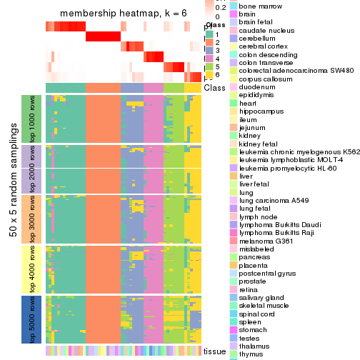</p>

</div>
</div>

As soon as we have had the classes for columns, we can look for signatures
which are significantly different between classes which can be candidate marks
for certain classes. Following are the heatmaps for signatures.


Signature heatmaps where rows are scaled:


<script>
$( function() {
	$( '#tabs-SD-NMF-get-signatures' ).tabs();
} );
</script>
<div id='tabs-SD-NMF-get-signatures'>
<ul>
<li><a href='#tab-SD-NMF-get-signatures-1'>k = 2</a></li>
<li><a href='#tab-SD-NMF-get-signatures-2'>k = 3</a></li>
<li><a href='#tab-SD-NMF-get-signatures-3'>k = 4</a></li>
<li><a href='#tab-SD-NMF-get-signatures-4'>k = 5</a></li>
<li><a href='#tab-SD-NMF-get-signatures-5'>k = 6</a></li>
</ul>
<div id='tab-SD-NMF-get-signatures-1'>
<pre><code class="r">get_signatures(res, k = 2)
</code></pre>

<p></p>

</div>
<div id='tab-SD-NMF-get-signatures-2'>
<pre><code class="r">get_signatures(res, k = 3)
</code></pre>

<p></p>

</div>
<div id='tab-SD-NMF-get-signatures-3'>
<pre><code class="r">get_signatures(res, k = 4)
</code></pre>

<p></p>

</div>
<div id='tab-SD-NMF-get-signatures-4'>
<pre><code class="r">get_signatures(res, k = 5)
</code></pre>

<p></p>

</div>
<div id='tab-SD-NMF-get-signatures-5'>
<pre><code class="r">get_signatures(res, k = 6)
</code></pre>

<p></p>

</div>
</div>


Signature heatmaps where rows are not scaled:


<script>
$( function() {
	$( '#tabs-SD-NMF-get-signatures-no-scale' ).tabs();
} );
</script>
<div id='tabs-SD-NMF-get-signatures-no-scale'>
<ul>
<li><a href='#tab-SD-NMF-get-signatures-no-scale-1'>k = 2</a></li>
<li><a href='#tab-SD-NMF-get-signatures-no-scale-2'>k = 3</a></li>
<li><a href='#tab-SD-NMF-get-signatures-no-scale-3'>k = 4</a></li>
<li><a href='#tab-SD-NMF-get-signatures-no-scale-4'>k = 5</a></li>
<li><a href='#tab-SD-NMF-get-signatures-no-scale-5'>k = 6</a></li>
</ul>
<div id='tab-SD-NMF-get-signatures-no-scale-1'>
<pre><code class="r">get_signatures(res, k = 2, scale_rows = FALSE)
</code></pre>

<p></p>

</div>
<div id='tab-SD-NMF-get-signatures-no-scale-2'>
<pre><code class="r">get_signatures(res, k = 3, scale_rows = FALSE)
</code></pre>

<p></p>

</div>
<div id='tab-SD-NMF-get-signatures-no-scale-3'>
<pre><code class="r">get_signatures(res, k = 4, scale_rows = FALSE)
</code></pre>

<p></p>

</div>
<div id='tab-SD-NMF-get-signatures-no-scale-4'>
<pre><code class="r">get_signatures(res, k = 5, scale_rows = FALSE)
</code></pre>

<p></p>

</div>
<div id='tab-SD-NMF-get-signatures-no-scale-5'>
<pre><code class="r">get_signatures(res, k = 6, scale_rows = FALSE)
</code></pre>

<p></p>

</div>
</div>


Compare the overlap of signatures from different k:

```r
compare_signatures(res)
```


`get_signature()` returns a data frame invisibly. TO get the list of signatures, the function
call should be assigned to a variable explicitly. In following code, if `plot` argument is set
to `FALSE`, no heatmap is plotted while only the differential analysis is performed.

```r
# code only for demonstration
tb = get_signature(res, k = ..., plot = FALSE)
```

An example of the output of `tb` is:

```
#>   which_row         fdr    mean_1    mean_2 scaled_mean_1 scaled_mean_2 km
#> 1        38 0.042760348  8.373488  9.131774    -0.5533452     0.5164555  1
#> 2        40 0.018707592  7.106213  8.469186    -0.6173731     0.5762149  1
#> 3        55 0.019134737 10.221463 11.207825    -0.6159697     0.5749050  1
#> 4        59 0.006059896  5.921854  7.869574    -0.6899429     0.6439467  1
#> 5        60 0.018055526  8.928898 10.211722    -0.6204761     0.5791110  1
#> 6        98 0.009384629 15.714769 14.887706     0.6635654    -0.6193277  2
...
```

The columns in `tb` are:

1. `which_row`: row indices corresponding to the input matrix.
2. `fdr`: FDR for the differential test. 
3. `mean_x`: The mean value in group x.
4. `scaled_mean_x`: The mean value in group x after rows are scaled.
5. `km`: Row groups if k-means clustering is applied to rows.


UMAP plot which shows how samples are separated.


<script>
$( function() {
	$( '#tabs-SD-NMF-dimension-reduction' ).tabs();
} );
</script>
<div id='tabs-SD-NMF-dimension-reduction'>
<ul>
<li><a href='#tab-SD-NMF-dimension-reduction-1'>k = 2</a></li>
<li><a href='#tab-SD-NMF-dimension-reduction-2'>k = 3</a></li>
<li><a href='#tab-SD-NMF-dimension-reduction-3'>k = 4</a></li>
<li><a href='#tab-SD-NMF-dimension-reduction-4'>k = 5</a></li>
<li><a href='#tab-SD-NMF-dimension-reduction-5'>k = 6</a></li>
</ul>
<div id='tab-SD-NMF-dimension-reduction-1'>
<pre><code class="r">dimension_reduction(res, k = 2, method = &quot;UMAP&quot;)
</code></pre>

<p></p>

</div>
<div id='tab-SD-NMF-dimension-reduction-2'>
<pre><code class="r">dimension_reduction(res, k = 3, method = &quot;UMAP&quot;)
</code></pre>

<p></p>

</div>
<div id='tab-SD-NMF-dimension-reduction-3'>
<pre><code class="r">dimension_reduction(res, k = 4, method = &quot;UMAP&quot;)
</code></pre>

<p></p>

</div>
<div id='tab-SD-NMF-dimension-reduction-4'>
<pre><code class="r">dimension_reduction(res, k = 5, method = &quot;UMAP&quot;)
</code></pre>

<p></p>

</div>
<div id='tab-SD-NMF-dimension-reduction-5'>
<pre><code class="r">dimension_reduction(res, k = 6, method = &quot;UMAP&quot;)
</code></pre>

<p></p>

</div>
</div>


Following heatmap shows how subgroups are split when increasing `k`:

```r
collect_classes(res)
```


Test correlation between subgroups and known annotations. If the known
annotation is numeric, one-way ANOVA test is applied, and if the known
annotation is discrete, chi-squared contingency table test is applied.

```r
test_to_known_factors(res)
```

```
#>         n tissue(p) k
#> SD:NMF 54     0.398 2
#> SD:NMF 54     0.374 3
#> SD:NMF 49     0.348 4
#> SD:NMF 50     0.443 5
#> SD:NMF 48     0.404 6
```


If matrix rows can be associated to genes, consider to use `functional_enrichment(res,
...)` to perform function enrichment for the signature genes. See [this vignette](http://bioconductor.org/packages/devel/bioc/vignettes/cola/inst/doc/functional_enrichment.html) for more detailed explanations.


 

---------------------------------------------------


### CV:hclust


The object with results only for a single top-value method and a single partition method 
can be extracted as:

```r
res = res_list["CV", "hclust"]
# you can also extract it by
# res = res_list["CV:hclust"]
```

A summary of `res` and all the functions that can be applied to it:

```r
res
```

```
#> A 'ConsensusPartition' object with k = 2, 3, 4, 5, 6.
#>   On a matrix with 12150 rows and 54 columns.
#>   Top rows (1000, 2000, 3000, 4000, 5000) are extracted by 'CV' method.
#>   Subgroups are detected by 'hclust' method.
#>   Performed in total 1250 partitions by row resampling.
#>   Best k for subgroups seems to be 5.
#> 
#> Following methods can be applied to this 'ConsensusPartition' object:
#>  [1] "cola_report"             "collect_classes"         "collect_plots"          
#>  [4] "collect_stats"           "colnames"                "compare_signatures"     
#>  [7] "consensus_heatmap"       "dimension_reduction"     "functional_enrichment"  
#> [10] "get_anno_col"            "get_anno"                "get_classes"            
#> [13] "get_consensus"           "get_matrix"              "get_membership"         
#> [16] "get_param"               "get_signatures"          "get_stats"              
#> [19] "is_best_k"               "is_stable_k"             "membership_heatmap"     
#> [22] "ncol"                    "nrow"                    "plot_ecdf"              
#> [25] "rownames"                "select_partition_number" "show"                   
#> [28] "suggest_best_k"          "test_to_known_factors"
```

`collect_plots()` function collects all the plots made from `res` for all `k` (number of partitions)
into one single page to provide an easy and fast comparison between different `k`.

```r
collect_plots(res)
```


The plots are:

- The first row: a plot of the ECDF (empirical cumulative distribution
  function) curves of the consensus matrix for each `k` and the heatmap of
  predicted classes for each `k`.
- The second row: heatmaps of the consensus matrix for each `k`.
- The third row: heatmaps of the membership matrix for each `k`.
- The fouth row: heatmaps of the signatures for each `k`.

All the plots in panels can be made by individual functions and they are
plotted later in this section.

`select_partition_number()` produces several plots showing different
statistics for choosing "optimized" `k`. There are following statistics:

- ECDF curves of the consensus matrix for each `k`;
- 1-PAC. [The PAC
  score](https://en.wikipedia.org/wiki/Consensus_clustering#Over-interpretation_potential_of_consensus_clustering)
  measures the proportion of the ambiguous subgrouping.
- Mean silhouette score.
- Concordance. The mean probability of fiting the consensus class ids in all
  partitions.
- Area increased. Denote $A_k$ as the area under the ECDF curve for current
  `k`, the area increased is defined as $A_k - A_{k-1}$.
- Rand index. The percent of pairs of samples that are both in a same cluster
  or both are not in a same cluster in the partition of k and k-1.
- Jaccard index. The ratio of pairs of samples are both in a same cluster in
  the partition of k and k-1 and the pairs of samples are both in a same
  cluster in the partition k or k-1.

The detailed explanations of these statistics can be found in [the _cola_
vignette](http://bioconductor.org/packages/devel/bioc/vignettes/cola/inst/doc/cola.html#toc_13).

Generally speaking, lower PAC score, higher mean silhouette score or higher
concordance corresponds to better partition. Rand index and Jaccard index
measure how similar the current partition is compared to partition with `k-1`.
If they are too similar, we won't accept `k` is better than `k-1`.

```r
select_partition_number(res)
```


The numeric values for all these statistics can be obtained by `get_stats()`.

```r
get_stats(res)
```

```
#>   k 1-PAC mean_silhouette concordance area_increased  Rand Jaccard
#> 2 2 0.517           0.817       0.884         0.3084 0.743   0.743
#> 3 3 0.435           0.797       0.826         0.6932 0.715   0.616
#> 4 4 0.686           0.771       0.857         0.2889 0.850   0.680
#> 5 5 0.805           0.827       0.896         0.0968 0.902   0.703
#> 6 6 0.817           0.782       0.902         0.0355 0.980   0.916
```

`suggest_best_k()` suggests the best $k$ based on these statistics. The rules are as follows:

- All $k$ with Jaccard index larger than 0.95 are removed because increasing
  $k$ does not provide enough extra information. If all $k$ are removed, it is
  marked as no subgroup is detected.
- For all $k$ with 1-PAC score larger than 0.9, the maximal $k$ is taken as
  the best $k$, and other $k$ are marked as optional $k$.
- If it does not fit the second rule. The $k$ with the maximal vote of the
  highest 1-PAC score, highest mean silhouette, and highest concordance is
  taken as the best $k$.

```r
suggest_best_k(res)
```

```
#> [1] 5
```


Following shows the table of the partitions (You need to click the **show/hide
code output** link to see it). The membership matrix (columns with name `p*`)
is inferred by
[`clue::cl_consensus()`](https://www.rdocumentation.org/link/cl_consensus?package=clue)
function with the `SE` method. Basically the value in the membership matrix
represents the probability to belong to a certain group. The finall class
label for an item is determined with the group with highest probability it
belongs to.

In `get_classes()` function, the entropy is calculated from the membership
matrix and the silhouette score is calculated from the consensus matrix.


<script>
$( function() {
	$( '#tabs-CV-hclust-get-classes' ).tabs();
} );
</script>
<div id='tabs-CV-hclust-get-classes'>
<ul>
<li><a href='#tab-CV-hclust-get-classes-1'>k = 2</a></li>
<li><a href='#tab-CV-hclust-get-classes-2'>k = 3</a></li>
<li><a href='#tab-CV-hclust-get-classes-3'>k = 4</a></li>
<li><a href='#tab-CV-hclust-get-classes-4'>k = 5</a></li>
<li><a href='#tab-CV-hclust-get-classes-5'>k = 6</a></li>
</ul>

<div id='tab-CV-hclust-get-classes-1'>
<p><a id='tab-CV-hclust-get-classes-1-a' style='color:#0366d6' href='#'>show/hide code output</a></p>
<pre><code class="r">cbind(get_classes(res, k = 2), get_membership(res, k = 2))
</code></pre>

<pre><code>#&gt;          class entropy silhouette    p1    p2
#&gt; GSM28815     1  0.2423      0.865 0.960 0.040
#&gt; GSM28816     1  0.2778      0.862 0.952 0.048
#&gt; GSM28817     1  0.0000      0.876 1.000 0.000
#&gt; GSM11327     1  0.9977     -0.417 0.528 0.472
#&gt; GSM28825     1  0.7950      0.751 0.760 0.240
#&gt; GSM11322     1  0.7950      0.751 0.760 0.240
#&gt; GSM28828     1  0.7950      0.751 0.760 0.240
#&gt; GSM11346     1  0.7950      0.751 0.760 0.240
#&gt; GSM28808     1  0.7950      0.751 0.760 0.240
#&gt; GSM11332     1  0.7950      0.751 0.760 0.240
#&gt; GSM28811     1  0.7950      0.751 0.760 0.240
#&gt; GSM11334     1  0.7950      0.751 0.760 0.240
#&gt; GSM11340     1  0.7950      0.751 0.760 0.240
#&gt; GSM28812     1  0.7950      0.751 0.760 0.240
#&gt; GSM11345     1  0.0000      0.876 1.000 0.000
#&gt; GSM28819     1  0.0000      0.876 1.000 0.000
#&gt; GSM11321     2  0.8207      1.000 0.256 0.744
#&gt; GSM28820     1  0.0000      0.876 1.000 0.000
#&gt; GSM11339     1  0.0000      0.876 1.000 0.000
#&gt; GSM28804     1  0.3733      0.854 0.928 0.072
#&gt; GSM28823     1  0.0000      0.876 1.000 0.000
#&gt; GSM11336     1  0.0000      0.876 1.000 0.000
#&gt; GSM11342     1  0.0000      0.876 1.000 0.000
#&gt; GSM11333     1  0.2778      0.862 0.952 0.048
#&gt; GSM28802     1  0.0000      0.876 1.000 0.000
#&gt; GSM28803     2  0.8207      1.000 0.256 0.744
#&gt; GSM11343     2  0.8207      1.000 0.256 0.744
#&gt; GSM11347     2  0.8207      1.000 0.256 0.744
#&gt; GSM28824     1  0.0000      0.876 1.000 0.000
#&gt; GSM28813     1  0.0000      0.876 1.000 0.000
#&gt; GSM28827     1  0.0000      0.876 1.000 0.000
#&gt; GSM11337     1  0.0000      0.876 1.000 0.000
#&gt; GSM28814     2  0.8207      1.000 0.256 0.744
#&gt; GSM11331     1  0.0000      0.876 1.000 0.000
#&gt; GSM11344     2  0.8207      1.000 0.256 0.744
#&gt; GSM11330     2  0.8207      1.000 0.256 0.744
#&gt; GSM11325     2  0.8207      1.000 0.256 0.744
#&gt; GSM11338     1  0.0000      0.876 1.000 0.000
#&gt; GSM28806     1  0.0000      0.876 1.000 0.000
#&gt; GSM28826     1  0.0000      0.876 1.000 0.000
#&gt; GSM28818     1  0.0938      0.874 0.988 0.012
#&gt; GSM28821     1  0.7950      0.751 0.760 0.240
#&gt; GSM28807     1  0.1633      0.869 0.976 0.024
#&gt; GSM28822     1  0.3114      0.862 0.944 0.056
#&gt; GSM11328     1  0.7950      0.751 0.760 0.240
#&gt; GSM11323     1  0.0000      0.876 1.000 0.000
#&gt; GSM11324     1  0.0000      0.876 1.000 0.000
#&gt; GSM11341     1  0.2043      0.865 0.968 0.032
#&gt; GSM11326     1  0.9977     -0.417 0.528 0.472
#&gt; GSM28810     1  0.0938      0.874 0.988 0.012
#&gt; GSM11335     1  0.1633      0.869 0.976 0.024
#&gt; GSM28809     1  0.0938      0.874 0.988 0.012
#&gt; GSM11329     1  0.0000      0.876 1.000 0.000
#&gt; GSM28805     1  0.0000      0.876 1.000 0.000
</code></pre>

<script>
$('#tab-CV-hclust-get-classes-1-a').parent().next().next().hide();
$('#tab-CV-hclust-get-classes-1-a').click(function(){
  $('#tab-CV-hclust-get-classes-1-a').parent().next().next().toggle();
  return(false);
});
</script>
</div>

<div id='tab-CV-hclust-get-classes-2'>
<p><a id='tab-CV-hclust-get-classes-2-a' style='color:#0366d6' href='#'>show/hide code output</a></p>
<pre><code class="r">cbind(get_classes(res, k = 3), get_membership(res, k = 3))
</code></pre>

<pre><code>#&gt;          class entropy silhouette    p1    p2    p3
#&gt; GSM28815     1  0.1878      0.787 0.952 0.044 0.004
#&gt; GSM28816     1  0.2280      0.776 0.940 0.052 0.008
#&gt; GSM28817     1  0.0000      0.829 1.000 0.000 0.000
#&gt; GSM11327     1  0.6295     -0.293 0.528 0.000 0.472
#&gt; GSM28825     2  0.5431      1.000 0.284 0.716 0.000
#&gt; GSM11322     2  0.5431      1.000 0.284 0.716 0.000
#&gt; GSM28828     2  0.5431      1.000 0.284 0.716 0.000
#&gt; GSM11346     2  0.5431      1.000 0.284 0.716 0.000
#&gt; GSM28808     2  0.5431      1.000 0.284 0.716 0.000
#&gt; GSM11332     2  0.5431      1.000 0.284 0.716 0.000
#&gt; GSM28811     2  0.5431      1.000 0.284 0.716 0.000
#&gt; GSM11334     2  0.5431      1.000 0.284 0.716 0.000
#&gt; GSM11340     2  0.5431      1.000 0.284 0.716 0.000
#&gt; GSM28812     2  0.5431      1.000 0.284 0.716 0.000
#&gt; GSM11345     1  0.0000      0.829 1.000 0.000 0.000
#&gt; GSM28819     1  0.0000      0.829 1.000 0.000 0.000
#&gt; GSM11321     3  0.4654      1.000 0.208 0.000 0.792
#&gt; GSM28820     1  0.0000      0.829 1.000 0.000 0.000
#&gt; GSM11339     1  0.0237      0.827 0.996 0.004 0.000
#&gt; GSM28804     1  0.9445      0.355 0.472 0.336 0.192
#&gt; GSM28823     1  0.0000      0.829 1.000 0.000 0.000
#&gt; GSM11336     1  0.0000      0.829 1.000 0.000 0.000
#&gt; GSM11342     1  0.0000      0.829 1.000 0.000 0.000
#&gt; GSM11333     1  0.2280      0.776 0.940 0.052 0.008
#&gt; GSM28802     1  0.0000      0.829 1.000 0.000 0.000
#&gt; GSM28803     3  0.4654      1.000 0.208 0.000 0.792
#&gt; GSM11343     3  0.4654      1.000 0.208 0.000 0.792
#&gt; GSM11347     3  0.4654      1.000 0.208 0.000 0.792
#&gt; GSM28824     1  0.0000      0.829 1.000 0.000 0.000
#&gt; GSM28813     1  0.0000      0.829 1.000 0.000 0.000
#&gt; GSM28827     1  0.0000      0.829 1.000 0.000 0.000
#&gt; GSM11337     1  0.0000      0.829 1.000 0.000 0.000
#&gt; GSM28814     3  0.4654      1.000 0.208 0.000 0.792
#&gt; GSM11331     1  0.0000      0.829 1.000 0.000 0.000
#&gt; GSM11344     3  0.4654      1.000 0.208 0.000 0.792
#&gt; GSM11330     3  0.4654      1.000 0.208 0.000 0.792
#&gt; GSM11325     3  0.4654      1.000 0.208 0.000 0.792
#&gt; GSM11338     1  0.0000      0.829 1.000 0.000 0.000
#&gt; GSM28806     1  0.0237      0.827 0.996 0.004 0.000
#&gt; GSM28826     1  0.0000      0.829 1.000 0.000 0.000
#&gt; GSM28818     1  0.4937      0.699 0.824 0.148 0.028
#&gt; GSM28821     2  0.5431      1.000 0.284 0.716 0.000
#&gt; GSM28807     1  0.9359      0.379 0.508 0.284 0.208
#&gt; GSM28822     1  0.9517      0.352 0.472 0.320 0.208
#&gt; GSM11328     2  0.5431      1.000 0.284 0.716 0.000
#&gt; GSM11323     1  0.0000      0.829 1.000 0.000 0.000
#&gt; GSM11324     1  0.0000      0.829 1.000 0.000 0.000
#&gt; GSM11341     1  0.9422      0.368 0.500 0.284 0.216
#&gt; GSM11326     1  0.6295     -0.293 0.528 0.000 0.472
#&gt; GSM28810     1  0.6476      0.627 0.748 0.184 0.068
#&gt; GSM11335     1  0.9359      0.379 0.508 0.284 0.208
#&gt; GSM28809     1  0.3983      0.715 0.852 0.144 0.004
#&gt; GSM11329     1  0.0000      0.829 1.000 0.000 0.000
#&gt; GSM28805     1  0.0000      0.829 1.000 0.000 0.000
</code></pre>

<script>
$('#tab-CV-hclust-get-classes-2-a').parent().next().next().hide();
$('#tab-CV-hclust-get-classes-2-a').click(function(){
  $('#tab-CV-hclust-get-classes-2-a').parent().next().next().toggle();
  return(false);
});
</script>
</div>

<div id='tab-CV-hclust-get-classes-3'>
<p><a id='tab-CV-hclust-get-classes-3-a' style='color:#0366d6' href='#'>show/hide code output</a></p>
<pre><code class="r">cbind(get_classes(res, k = 4), get_membership(res, k = 4))
</code></pre>

<pre><code>#&gt;          class entropy silhouette    p1 p2    p3    p4
#&gt; GSM28815     1  0.5386      0.504 0.632  0 0.024 0.344
#&gt; GSM28816     1  0.5649      0.492 0.620  0 0.036 0.344
#&gt; GSM28817     1  0.0000      0.771 1.000  0 0.000 0.000
#&gt; GSM11327     3  0.4933      0.422 0.432  0 0.568 0.000
#&gt; GSM28825     2  0.0000      1.000 0.000  1 0.000 0.000
#&gt; GSM11322     2  0.0000      1.000 0.000  1 0.000 0.000
#&gt; GSM28828     2  0.0000      1.000 0.000  1 0.000 0.000
#&gt; GSM11346     2  0.0000      1.000 0.000  1 0.000 0.000
#&gt; GSM28808     2  0.0000      1.000 0.000  1 0.000 0.000
#&gt; GSM11332     2  0.0000      1.000 0.000  1 0.000 0.000
#&gt; GSM28811     2  0.0000      1.000 0.000  1 0.000 0.000
#&gt; GSM11334     2  0.0000      1.000 0.000  1 0.000 0.000
#&gt; GSM11340     2  0.0000      1.000 0.000  1 0.000 0.000
#&gt; GSM28812     2  0.0000      1.000 0.000  1 0.000 0.000
#&gt; GSM11345     1  0.0000      0.771 1.000  0 0.000 0.000
#&gt; GSM28819     1  0.0000      0.771 1.000  0 0.000 0.000
#&gt; GSM11321     3  0.2345      0.890 0.100  0 0.900 0.000
#&gt; GSM28820     1  0.0000      0.771 1.000  0 0.000 0.000
#&gt; GSM11339     1  0.0469      0.768 0.988  0 0.000 0.012
#&gt; GSM28804     4  0.5291      0.910 0.324  0 0.024 0.652
#&gt; GSM28823     1  0.0188      0.770 0.996  0 0.000 0.004
#&gt; GSM11336     1  0.6951      0.429 0.544  0 0.132 0.324
#&gt; GSM11342     1  0.0188      0.770 0.996  0 0.000 0.004
#&gt; GSM11333     1  0.5630      0.482 0.608  0 0.032 0.360
#&gt; GSM28802     1  0.0188      0.771 0.996  0 0.000 0.004
#&gt; GSM28803     3  0.2345      0.890 0.100  0 0.900 0.000
#&gt; GSM11343     3  0.2345      0.890 0.100  0 0.900 0.000
#&gt; GSM11347     3  0.2345      0.890 0.100  0 0.900 0.000
#&gt; GSM28824     1  0.6951      0.429 0.544  0 0.132 0.324
#&gt; GSM28813     1  0.6951      0.429 0.544  0 0.132 0.324
#&gt; GSM28827     1  0.0188      0.771 0.996  0 0.000 0.004
#&gt; GSM11337     1  0.1109      0.754 0.968  0 0.028 0.004
#&gt; GSM28814     3  0.2345      0.890 0.100  0 0.900 0.000
#&gt; GSM11331     1  0.0336      0.767 0.992  0 0.000 0.008
#&gt; GSM11344     3  0.2345      0.890 0.100  0 0.900 0.000
#&gt; GSM11330     3  0.2345      0.890 0.100  0 0.900 0.000
#&gt; GSM11325     3  0.2345      0.890 0.100  0 0.900 0.000
#&gt; GSM11338     1  0.6951      0.429 0.544  0 0.132 0.324
#&gt; GSM28806     1  0.0336      0.767 0.992  0 0.000 0.008
#&gt; GSM28826     1  0.0376      0.770 0.992  0 0.004 0.004
#&gt; GSM28818     1  0.3907      0.319 0.768  0 0.000 0.232
#&gt; GSM28821     2  0.0000      1.000 0.000  1 0.000 0.000
#&gt; GSM28807     4  0.4713      0.926 0.360  0 0.000 0.640
#&gt; GSM28822     4  0.4543      0.917 0.324  0 0.000 0.676
#&gt; GSM11328     2  0.0000      1.000 0.000  1 0.000 0.000
#&gt; GSM11323     1  0.0336      0.767 0.992  0 0.000 0.008
#&gt; GSM11324     1  0.0000      0.771 1.000  0 0.000 0.000
#&gt; GSM11341     4  0.5007      0.926 0.356  0 0.008 0.636
#&gt; GSM11326     3  0.4933      0.422 0.432  0 0.568 0.000
#&gt; GSM28810     1  0.4193      0.188 0.732  0 0.000 0.268
#&gt; GSM11335     4  0.4955      0.807 0.444  0 0.000 0.556
#&gt; GSM28809     1  0.3649      0.399 0.796  0 0.000 0.204
#&gt; GSM11329     1  0.0000      0.771 1.000  0 0.000 0.000
#&gt; GSM28805     1  0.0188      0.771 0.996  0 0.004 0.000
</code></pre>

<script>
$('#tab-CV-hclust-get-classes-3-a').parent().next().next().hide();
$('#tab-CV-hclust-get-classes-3-a').click(function(){
  $('#tab-CV-hclust-get-classes-3-a').parent().next().next().toggle();
  return(false);
});
</script>
</div>

<div id='tab-CV-hclust-get-classes-4'>
<p><a id='tab-CV-hclust-get-classes-4-a' style='color:#0366d6' href='#'>show/hide code output</a></p>
<pre><code class="r">cbind(get_classes(res, k = 5), get_membership(res, k = 5))
</code></pre>

<pre><code>#&gt;          class entropy silhouette    p1 p2    p3    p4    p5
#&gt; GSM28815     5  0.4331      0.684 0.400  0 0.004 0.000 0.596
#&gt; GSM28816     5  0.4415      0.690 0.388  0 0.008 0.000 0.604
#&gt; GSM28817     1  0.0000      0.898 1.000  0 0.000 0.000 0.000
#&gt; GSM11327     3  0.5124      0.417 0.288  0 0.644 0.000 0.068
#&gt; GSM28825     2  0.0000      1.000 0.000  1 0.000 0.000 0.000
#&gt; GSM11322     2  0.0000      1.000 0.000  1 0.000 0.000 0.000
#&gt; GSM28828     2  0.0000      1.000 0.000  1 0.000 0.000 0.000
#&gt; GSM11346     2  0.0000      1.000 0.000  1 0.000 0.000 0.000
#&gt; GSM28808     2  0.0000      1.000 0.000  1 0.000 0.000 0.000
#&gt; GSM11332     2  0.0000      1.000 0.000  1 0.000 0.000 0.000
#&gt; GSM28811     2  0.0000      1.000 0.000  1 0.000 0.000 0.000
#&gt; GSM11334     2  0.0000      1.000 0.000  1 0.000 0.000 0.000
#&gt; GSM11340     2  0.0000      1.000 0.000  1 0.000 0.000 0.000
#&gt; GSM28812     2  0.0000      1.000 0.000  1 0.000 0.000 0.000
#&gt; GSM11345     1  0.0000      0.898 1.000  0 0.000 0.000 0.000
#&gt; GSM28819     1  0.0000      0.898 1.000  0 0.000 0.000 0.000
#&gt; GSM11321     3  0.0613      0.888 0.008  0 0.984 0.004 0.004
#&gt; GSM28820     1  0.0000      0.898 1.000  0 0.000 0.000 0.000
#&gt; GSM11339     1  0.0579      0.892 0.984  0 0.000 0.008 0.008
#&gt; GSM28804     4  0.3365      0.640 0.004  0 0.008 0.808 0.180
#&gt; GSM28823     1  0.0162      0.897 0.996  0 0.000 0.000 0.004
#&gt; GSM11336     5  0.3895      0.796 0.320  0 0.000 0.000 0.680
#&gt; GSM11342     1  0.0162      0.897 0.996  0 0.000 0.000 0.004
#&gt; GSM11333     5  0.4380      0.701 0.376  0 0.008 0.000 0.616
#&gt; GSM28802     1  0.0162      0.896 0.996  0 0.000 0.000 0.004
#&gt; GSM28803     3  0.0613      0.888 0.008  0 0.984 0.004 0.004
#&gt; GSM11343     3  0.0290      0.889 0.008  0 0.992 0.000 0.000
#&gt; GSM11347     3  0.0290      0.889 0.008  0 0.992 0.000 0.000
#&gt; GSM28824     5  0.3895      0.796 0.320  0 0.000 0.000 0.680
#&gt; GSM28813     5  0.3895      0.796 0.320  0 0.000 0.000 0.680
#&gt; GSM28827     1  0.0451      0.893 0.988  0 0.004 0.000 0.008
#&gt; GSM11337     1  0.1282      0.860 0.952  0 0.004 0.000 0.044
#&gt; GSM28814     3  0.0613      0.888 0.008  0 0.984 0.004 0.004
#&gt; GSM11331     1  0.1928      0.812 0.920  0 0.004 0.004 0.072
#&gt; GSM11344     3  0.0290      0.889 0.008  0 0.992 0.000 0.000
#&gt; GSM11330     3  0.0290      0.889 0.008  0 0.992 0.000 0.000
#&gt; GSM11325     3  0.0613      0.888 0.008  0 0.984 0.004 0.004
#&gt; GSM11338     5  0.3895      0.796 0.320  0 0.000 0.000 0.680
#&gt; GSM28806     1  0.0324      0.895 0.992  0 0.000 0.004 0.004
#&gt; GSM28826     1  0.0510      0.890 0.984  0 0.000 0.000 0.016
#&gt; GSM28818     1  0.4101      0.422 0.664  0 0.000 0.332 0.004
#&gt; GSM28821     2  0.0000      1.000 0.000  1 0.000 0.000 0.000
#&gt; GSM28807     4  0.3109      0.671 0.200  0 0.000 0.800 0.000
#&gt; GSM28822     4  0.2930      0.650 0.004  0 0.000 0.832 0.164
#&gt; GSM11328     2  0.0000      1.000 0.000  1 0.000 0.000 0.000
#&gt; GSM11323     1  0.1928      0.812 0.920  0 0.004 0.004 0.072
#&gt; GSM11324     1  0.0000      0.898 1.000  0 0.000 0.000 0.000
#&gt; GSM11341     4  0.2488      0.701 0.124  0 0.000 0.872 0.004
#&gt; GSM11326     3  0.5124      0.417 0.288  0 0.644 0.000 0.068
#&gt; GSM28810     1  0.3949      0.470 0.696  0 0.000 0.300 0.004
#&gt; GSM11335     4  0.4331      0.392 0.400  0 0.000 0.596 0.004
#&gt; GSM28809     1  0.4122      0.485 0.688  0 0.004 0.304 0.004
#&gt; GSM11329     1  0.0000      0.898 1.000  0 0.000 0.000 0.000
#&gt; GSM28805     1  0.0162      0.897 0.996  0 0.000 0.000 0.004
</code></pre>

<script>
$('#tab-CV-hclust-get-classes-4-a').parent().next().next().hide();
$('#tab-CV-hclust-get-classes-4-a').click(function(){
  $('#tab-CV-hclust-get-classes-4-a').parent().next().next().toggle();
  return(false);
});
</script>
</div>

<div id='tab-CV-hclust-get-classes-5'>
<p><a id='tab-CV-hclust-get-classes-5-a' style='color:#0366d6' href='#'>show/hide code output</a></p>
<pre><code class="r">cbind(get_classes(res, k = 6), get_membership(res, k = 6))
</code></pre>

<pre><code>#&gt;          class entropy silhouette    p1 p2    p3    p4    p5    p6
#&gt; GSM28815     5  0.2912      0.499 0.216  0 0.000 0.000 0.784 0.000
#&gt; GSM28816     5  0.2312      0.475 0.112  0 0.000 0.000 0.876 0.012
#&gt; GSM28817     1  0.0000      0.917 1.000  0 0.000 0.000 0.000 0.000
#&gt; GSM11327     3  0.4788      0.432 0.276  0 0.648 0.000 0.068 0.008
#&gt; GSM28825     2  0.0000      1.000 0.000  1 0.000 0.000 0.000 0.000
#&gt; GSM11322     2  0.0000      1.000 0.000  1 0.000 0.000 0.000 0.000
#&gt; GSM28828     2  0.0000      1.000 0.000  1 0.000 0.000 0.000 0.000
#&gt; GSM11346     2  0.0000      1.000 0.000  1 0.000 0.000 0.000 0.000
#&gt; GSM28808     2  0.0000      1.000 0.000  1 0.000 0.000 0.000 0.000
#&gt; GSM11332     2  0.0000      1.000 0.000  1 0.000 0.000 0.000 0.000
#&gt; GSM28811     2  0.0000      1.000 0.000  1 0.000 0.000 0.000 0.000
#&gt; GSM11334     2  0.0000      1.000 0.000  1 0.000 0.000 0.000 0.000
#&gt; GSM11340     2  0.0000      1.000 0.000  1 0.000 0.000 0.000 0.000
#&gt; GSM28812     2  0.0000      1.000 0.000  1 0.000 0.000 0.000 0.000
#&gt; GSM11345     1  0.0000      0.917 1.000  0 0.000 0.000 0.000 0.000
#&gt; GSM28819     1  0.0000      0.917 1.000  0 0.000 0.000 0.000 0.000
#&gt; GSM11321     3  0.0260      0.879 0.000  0 0.992 0.008 0.000 0.000
#&gt; GSM28820     1  0.0000      0.917 1.000  0 0.000 0.000 0.000 0.000
#&gt; GSM11339     1  0.0520      0.911 0.984  0 0.000 0.008 0.008 0.000
#&gt; GSM28804     6  0.2912      0.966 0.000  0 0.000 0.172 0.012 0.816
#&gt; GSM28823     1  0.0146      0.916 0.996  0 0.000 0.000 0.004 0.000
#&gt; GSM11336     5  0.5583      0.700 0.284  0 0.000 0.000 0.536 0.180
#&gt; GSM11342     1  0.0146      0.916 0.996  0 0.000 0.000 0.004 0.000
#&gt; GSM11333     5  0.2170      0.467 0.100  0 0.000 0.000 0.888 0.012
#&gt; GSM28802     1  0.0146      0.916 0.996  0 0.000 0.000 0.004 0.000
#&gt; GSM28803     3  0.0260      0.879 0.000  0 0.992 0.008 0.000 0.000
#&gt; GSM11343     3  0.0000      0.879 0.000  0 1.000 0.000 0.000 0.000
#&gt; GSM11347     3  0.0000      0.879 0.000  0 1.000 0.000 0.000 0.000
#&gt; GSM28824     5  0.5583      0.700 0.284  0 0.000 0.000 0.536 0.180
#&gt; GSM28813     5  0.5583      0.700 0.284  0 0.000 0.000 0.536 0.180
#&gt; GSM28827     1  0.0405      0.914 0.988  0 0.000 0.000 0.008 0.004
#&gt; GSM11337     1  0.1196      0.886 0.952  0 0.000 0.000 0.008 0.040
#&gt; GSM28814     3  0.0260      0.879 0.000  0 0.992 0.008 0.000 0.000
#&gt; GSM11331     1  0.1845      0.837 0.916  0 0.000 0.004 0.072 0.008
#&gt; GSM11344     3  0.0000      0.879 0.000  0 1.000 0.000 0.000 0.000
#&gt; GSM11330     3  0.0000      0.879 0.000  0 1.000 0.000 0.000 0.000
#&gt; GSM11325     3  0.0260      0.879 0.000  0 0.992 0.008 0.000 0.000
#&gt; GSM11338     5  0.5583      0.700 0.284  0 0.000 0.000 0.536 0.180
#&gt; GSM28806     1  0.0291      0.914 0.992  0 0.000 0.004 0.004 0.000
#&gt; GSM28826     1  0.0632      0.906 0.976  0 0.000 0.000 0.024 0.000
#&gt; GSM28818     4  0.3991      0.160 0.472  0 0.000 0.524 0.004 0.000
#&gt; GSM28821     2  0.0000      1.000 0.000  1 0.000 0.000 0.000 0.000
#&gt; GSM28807     4  0.1812      0.166 0.008  0 0.000 0.912 0.000 0.080
#&gt; GSM28822     6  0.2762      0.966 0.000  0 0.000 0.196 0.000 0.804
#&gt; GSM11328     2  0.0000      1.000 0.000  1 0.000 0.000 0.000 0.000
#&gt; GSM11323     1  0.1845      0.837 0.916  0 0.000 0.004 0.072 0.008
#&gt; GSM11324     1  0.0000      0.917 1.000  0 0.000 0.000 0.000 0.000
#&gt; GSM11341     4  0.1387      0.122 0.000  0 0.000 0.932 0.000 0.068
#&gt; GSM11326     3  0.4788      0.432 0.276  0 0.648 0.000 0.068 0.008
#&gt; GSM28810     1  0.3828      0.342 0.696  0 0.000 0.288 0.004 0.012
#&gt; GSM11335     4  0.4477      0.320 0.380  0 0.000 0.588 0.004 0.028
#&gt; GSM28809     1  0.4129     -0.328 0.496  0 0.000 0.496 0.004 0.004
#&gt; GSM11329     1  0.0000      0.917 1.000  0 0.000 0.000 0.000 0.000
#&gt; GSM28805     1  0.0363      0.913 0.988  0 0.000 0.000 0.012 0.000
</code></pre>

<script>
$('#tab-CV-hclust-get-classes-5-a').parent().next().next().hide();
$('#tab-CV-hclust-get-classes-5-a').click(function(){
  $('#tab-CV-hclust-get-classes-5-a').parent().next().next().toggle();
  return(false);
});
</script>
</div>
</div>

Heatmaps for the consensus matrix. It visualizes the probability of two
samples to be in a same group.


<script>
$( function() {
	$( '#tabs-CV-hclust-consensus-heatmap' ).tabs();
} );
</script>
<div id='tabs-CV-hclust-consensus-heatmap'>
<ul>
<li><a href='#tab-CV-hclust-consensus-heatmap-1'>k = 2</a></li>
<li><a href='#tab-CV-hclust-consensus-heatmap-2'>k = 3</a></li>
<li><a href='#tab-CV-hclust-consensus-heatmap-3'>k = 4</a></li>
<li><a href='#tab-CV-hclust-consensus-heatmap-4'>k = 5</a></li>
<li><a href='#tab-CV-hclust-consensus-heatmap-5'>k = 6</a></li>
</ul>
<div id='tab-CV-hclust-consensus-heatmap-1'>
<pre><code class="r">consensus_heatmap(res, k = 2)
</code></pre>

<p></p>

</div>
<div id='tab-CV-hclust-consensus-heatmap-2'>
<pre><code class="r">consensus_heatmap(res, k = 3)
</code></pre>

<p></p>

</div>
<div id='tab-CV-hclust-consensus-heatmap-3'>
<pre><code class="r">consensus_heatmap(res, k = 4)
</code></pre>

<p></p>

</div>
<div id='tab-CV-hclust-consensus-heatmap-4'>
<pre><code class="r">consensus_heatmap(res, k = 5)
</code></pre>

<p></p>

</div>
<div id='tab-CV-hclust-consensus-heatmap-5'>
<pre><code class="r">consensus_heatmap(res, k = 6)
</code></pre>

<p></p>

</div>
</div>

Heatmaps for the membership of samples in all partitions to see how consistent they are:


<script>
$( function() {
	$( '#tabs-CV-hclust-membership-heatmap' ).tabs();
} );
</script>
<div id='tabs-CV-hclust-membership-heatmap'>
<ul>
<li><a href='#tab-CV-hclust-membership-heatmap-1'>k = 2</a></li>
<li><a href='#tab-CV-hclust-membership-heatmap-2'>k = 3</a></li>
<li><a href='#tab-CV-hclust-membership-heatmap-3'>k = 4</a></li>
<li><a href='#tab-CV-hclust-membership-heatmap-4'>k = 5</a></li>
<li><a href='#tab-CV-hclust-membership-heatmap-5'>k = 6</a></li>
</ul>
<div id='tab-CV-hclust-membership-heatmap-1'>
<pre><code class="r">membership_heatmap(res, k = 2)
</code></pre>

<p></p>

</div>
<div id='tab-CV-hclust-membership-heatmap-2'>
<pre><code class="r">membership_heatmap(res, k = 3)
</code></pre>

<p></p>

</div>
<div id='tab-CV-hclust-membership-heatmap-3'>
<pre><code class="r">membership_heatmap(res, k = 4)
</code></pre>

<p></p>

</div>
<div id='tab-CV-hclust-membership-heatmap-4'>
<pre><code class="r">membership_heatmap(res, k = 5)
</code></pre>

<p></p>

</div>
<div id='tab-CV-hclust-membership-heatmap-5'>
<pre><code class="r">membership_heatmap(res, k = 6)
</code></pre>

<p></p>

</div>
</div>

As soon as we have had the classes for columns, we can look for signatures
which are significantly different between classes which can be candidate marks
for certain classes. Following are the heatmaps for signatures.


Signature heatmaps where rows are scaled:


<script>
$( function() {
	$( '#tabs-CV-hclust-get-signatures' ).tabs();
} );
</script>
<div id='tabs-CV-hclust-get-signatures'>
<ul>
<li><a href='#tab-CV-hclust-get-signatures-1'>k = 2</a></li>
<li><a href='#tab-CV-hclust-get-signatures-2'>k = 3</a></li>
<li><a href='#tab-CV-hclust-get-signatures-3'>k = 4</a></li>
<li><a href='#tab-CV-hclust-get-signatures-4'>k = 5</a></li>
<li><a href='#tab-CV-hclust-get-signatures-5'>k = 6</a></li>
</ul>
<div id='tab-CV-hclust-get-signatures-1'>
<pre><code class="r">get_signatures(res, k = 2)
</code></pre>

<p></p>

</div>
<div id='tab-CV-hclust-get-signatures-2'>
<pre><code class="r">get_signatures(res, k = 3)
</code></pre>

<p></p>

</div>
<div id='tab-CV-hclust-get-signatures-3'>
<pre><code class="r">get_signatures(res, k = 4)
</code></pre>

<p></p>

</div>
<div id='tab-CV-hclust-get-signatures-4'>
<pre><code class="r">get_signatures(res, k = 5)
</code></pre>

<p></p>

</div>
<div id='tab-CV-hclust-get-signatures-5'>
<pre><code class="r">get_signatures(res, k = 6)
</code></pre>

<p></p>

</div>
</div>


Signature heatmaps where rows are not scaled:


<script>
$( function() {
	$( '#tabs-CV-hclust-get-signatures-no-scale' ).tabs();
} );
</script>
<div id='tabs-CV-hclust-get-signatures-no-scale'>
<ul>
<li><a href='#tab-CV-hclust-get-signatures-no-scale-1'>k = 2</a></li>
<li><a href='#tab-CV-hclust-get-signatures-no-scale-2'>k = 3</a></li>
<li><a href='#tab-CV-hclust-get-signatures-no-scale-3'>k = 4</a></li>
<li><a href='#tab-CV-hclust-get-signatures-no-scale-4'>k = 5</a></li>
<li><a href='#tab-CV-hclust-get-signatures-no-scale-5'>k = 6</a></li>
</ul>
<div id='tab-CV-hclust-get-signatures-no-scale-1'>
<pre><code class="r">get_signatures(res, k = 2, scale_rows = FALSE)
</code></pre>

<p></p>

</div>
<div id='tab-CV-hclust-get-signatures-no-scale-2'>
<pre><code class="r">get_signatures(res, k = 3, scale_rows = FALSE)
</code></pre>

<p></p>

</div>
<div id='tab-CV-hclust-get-signatures-no-scale-3'>
<pre><code class="r">get_signatures(res, k = 4, scale_rows = FALSE)
</code></pre>

<p></p>

</div>
<div id='tab-CV-hclust-get-signatures-no-scale-4'>
<pre><code class="r">get_signatures(res, k = 5, scale_rows = FALSE)
</code></pre>

<p>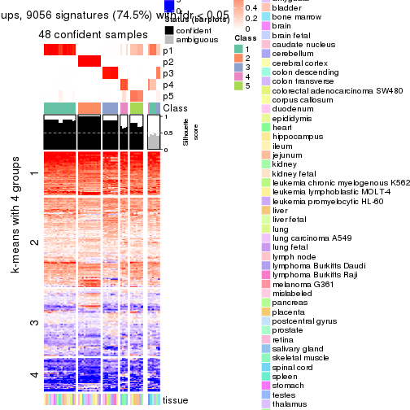</p>

</div>
<div id='tab-CV-hclust-get-signatures-no-scale-5'>
<pre><code class="r">get_signatures(res, k = 6, scale_rows = FALSE)
</code></pre>

<p></p>

</div>
</div>


Compare the overlap of signatures from different k:

```r
compare_signatures(res)
```


`get_signature()` returns a data frame invisibly. TO get the list of signatures, the function
call should be assigned to a variable explicitly. In following code, if `plot` argument is set
to `FALSE`, no heatmap is plotted while only the differential analysis is performed.

```r
# code only for demonstration
tb = get_signature(res, k = ..., plot = FALSE)
```

An example of the output of `tb` is:

```
#>   which_row         fdr    mean_1    mean_2 scaled_mean_1 scaled_mean_2 km
#> 1        38 0.042760348  8.373488  9.131774    -0.5533452     0.5164555  1
#> 2        40 0.018707592  7.106213  8.469186    -0.6173731     0.5762149  1
#> 3        55 0.019134737 10.221463 11.207825    -0.6159697     0.5749050  1
#> 4        59 0.006059896  5.921854  7.869574    -0.6899429     0.6439467  1
#> 5        60 0.018055526  8.928898 10.211722    -0.6204761     0.5791110  1
#> 6        98 0.009384629 15.714769 14.887706     0.6635654    -0.6193277  2
...
```

The columns in `tb` are:

1. `which_row`: row indices corresponding to the input matrix.
2. `fdr`: FDR for the differential test. 
3. `mean_x`: The mean value in group x.
4. `scaled_mean_x`: The mean value in group x after rows are scaled.
5. `km`: Row groups if k-means clustering is applied to rows.


UMAP plot which shows how samples are separated.


<script>
$( function() {
	$( '#tabs-CV-hclust-dimension-reduction' ).tabs();
} );
</script>
<div id='tabs-CV-hclust-dimension-reduction'>
<ul>
<li><a href='#tab-CV-hclust-dimension-reduction-1'>k = 2</a></li>
<li><a href='#tab-CV-hclust-dimension-reduction-2'>k = 3</a></li>
<li><a href='#tab-CV-hclust-dimension-reduction-3'>k = 4</a></li>
<li><a href='#tab-CV-hclust-dimension-reduction-4'>k = 5</a></li>
<li><a href='#tab-CV-hclust-dimension-reduction-5'>k = 6</a></li>
</ul>
<div id='tab-CV-hclust-dimension-reduction-1'>
<pre><code class="r">dimension_reduction(res, k = 2, method = &quot;UMAP&quot;)
</code></pre>

<p></p>

</div>
<div id='tab-CV-hclust-dimension-reduction-2'>
<pre><code class="r">dimension_reduction(res, k = 3, method = &quot;UMAP&quot;)
</code></pre>

<p></p>

</div>
<div id='tab-CV-hclust-dimension-reduction-3'>
<pre><code class="r">dimension_reduction(res, k = 4, method = &quot;UMAP&quot;)
</code></pre>

<p></p>

</div>
<div id='tab-CV-hclust-dimension-reduction-4'>
<pre><code class="r">dimension_reduction(res, k = 5, method = &quot;UMAP&quot;)
</code></pre>

<p></p>

</div>
<div id='tab-CV-hclust-dimension-reduction-5'>
<pre><code class="r">dimension_reduction(res, k = 6, method = &quot;UMAP&quot;)
</code></pre>

<p></p>

</div>
</div>


Following heatmap shows how subgroups are split when increasing `k`:

```r
collect_classes(res)
```


Test correlation between subgroups and known annotations. If the known
annotation is numeric, one-way ANOVA test is applied, and if the known
annotation is discrete, chi-squared contingency table test is applied.

```r
test_to_known_factors(res)
```

```
#>            n tissue(p) k
#> CV:hclust 52     0.396 2
#> CV:hclust 47     0.366 3
#> CV:hclust 43     0.409 4
#> CV:hclust 48     0.421 5
#> CV:hclust 43     0.456 6
```


If matrix rows can be associated to genes, consider to use `functional_enrichment(res,
...)` to perform function enrichment for the signature genes. See [this vignette](http://bioconductor.org/packages/devel/bioc/vignettes/cola/inst/doc/functional_enrichment.html) for more detailed explanations.


 

---------------------------------------------------


### CV:kmeans


The object with results only for a single top-value method and a single partition method 
can be extracted as:

```r
res = res_list["CV", "kmeans"]
# you can also extract it by
# res = res_list["CV:kmeans"]
```

A summary of `res` and all the functions that can be applied to it:

```r
res
```

```
#> A 'ConsensusPartition' object with k = 2, 3, 4, 5, 6.
#>   On a matrix with 12150 rows and 54 columns.
#>   Top rows (1000, 2000, 3000, 4000, 5000) are extracted by 'CV' method.
#>   Subgroups are detected by 'kmeans' method.
#>   Performed in total 1250 partitions by row resampling.
#>   Best k for subgroups seems to be 3.
#> 
#> Following methods can be applied to this 'ConsensusPartition' object:
#>  [1] "cola_report"             "collect_classes"         "collect_plots"          
#>  [4] "collect_stats"           "colnames"                "compare_signatures"     
#>  [7] "consensus_heatmap"       "dimension_reduction"     "functional_enrichment"  
#> [10] "get_anno_col"            "get_anno"                "get_classes"            
#> [13] "get_consensus"           "get_matrix"              "get_membership"         
#> [16] "get_param"               "get_signatures"          "get_stats"              
#> [19] "is_best_k"               "is_stable_k"             "membership_heatmap"     
#> [22] "ncol"                    "nrow"                    "plot_ecdf"              
#> [25] "rownames"                "select_partition_number" "show"                   
#> [28] "suggest_best_k"          "test_to_known_factors"
```

`collect_plots()` function collects all the plots made from `res` for all `k` (number of partitions)
into one single page to provide an easy and fast comparison between different `k`.

```r
collect_plots(res)
```


The plots are:

- The first row: a plot of the ECDF (empirical cumulative distribution
  function) curves of the consensus matrix for each `k` and the heatmap of
  predicted classes for each `k`.
- The second row: heatmaps of the consensus matrix for each `k`.
- The third row: heatmaps of the membership matrix for each `k`.
- The fouth row: heatmaps of the signatures for each `k`.

All the plots in panels can be made by individual functions and they are
plotted later in this section.

`select_partition_number()` produces several plots showing different
statistics for choosing "optimized" `k`. There are following statistics:

- ECDF curves of the consensus matrix for each `k`;
- 1-PAC. [The PAC
  score](https://en.wikipedia.org/wiki/Consensus_clustering#Over-interpretation_potential_of_consensus_clustering)
  measures the proportion of the ambiguous subgrouping.
- Mean silhouette score.
- Concordance. The mean probability of fiting the consensus class ids in all
  partitions.
- Area increased. Denote $A_k$ as the area under the ECDF curve for current
  `k`, the area increased is defined as $A_k - A_{k-1}$.
- Rand index. The percent of pairs of samples that are both in a same cluster
  or both are not in a same cluster in the partition of k and k-1.
- Jaccard index. The ratio of pairs of samples are both in a same cluster in
  the partition of k and k-1 and the pairs of samples are both in a same
  cluster in the partition k or k-1.

The detailed explanations of these statistics can be found in [the _cola_
vignette](http://bioconductor.org/packages/devel/bioc/vignettes/cola/inst/doc/cola.html#toc_13).

Generally speaking, lower PAC score, higher mean silhouette score or higher
concordance corresponds to better partition. Rand index and Jaccard index
measure how similar the current partition is compared to partition with `k-1`.
If they are too similar, we won't accept `k` is better than `k-1`.

```r
select_partition_number(res)
```


The numeric values for all these statistics can be obtained by `get_stats()`.

```r
get_stats(res)
```

```
#>   k 1-PAC mean_silhouette concordance area_increased  Rand Jaccard
#> 2 2 0.508           0.887       0.883         0.3439 0.648   0.648
#> 3 3 0.680           0.955       0.933         0.6520 0.776   0.655
#> 4 4 0.760           0.872       0.882         0.2033 0.878   0.712
#> 5 5 0.751           0.864       0.895         0.0929 0.922   0.755
#> 6 6 0.776           0.807       0.861         0.0544 1.000   1.000
```

`suggest_best_k()` suggests the best $k$ based on these statistics. The rules are as follows:

- All $k$ with Jaccard index larger than 0.95 are removed because increasing
  $k$ does not provide enough extra information. If all $k$ are removed, it is
  marked as no subgroup is detected.
- For all $k$ with 1-PAC score larger than 0.9, the maximal $k$ is taken as
  the best $k$, and other $k$ are marked as optional $k$.
- If it does not fit the second rule. The $k$ with the maximal vote of the
  highest 1-PAC score, highest mean silhouette, and highest concordance is
  taken as the best $k$.

```r
suggest_best_k(res)
```

```
#> [1] 3
```


Following shows the table of the partitions (You need to click the **show/hide
code output** link to see it). The membership matrix (columns with name `p*`)
is inferred by
[`clue::cl_consensus()`](https://www.rdocumentation.org/link/cl_consensus?package=clue)
function with the `SE` method. Basically the value in the membership matrix
represents the probability to belong to a certain group. The finall class
label for an item is determined with the group with highest probability it
belongs to.

In `get_classes()` function, the entropy is calculated from the membership
matrix and the silhouette score is calculated from the consensus matrix.


<script>
$( function() {
	$( '#tabs-CV-kmeans-get-classes' ).tabs();
} );
</script>
<div id='tabs-CV-kmeans-get-classes'>
<ul>
<li><a href='#tab-CV-kmeans-get-classes-1'>k = 2</a></li>
<li><a href='#tab-CV-kmeans-get-classes-2'>k = 3</a></li>
<li><a href='#tab-CV-kmeans-get-classes-3'>k = 4</a></li>
<li><a href='#tab-CV-kmeans-get-classes-4'>k = 5</a></li>
<li><a href='#tab-CV-kmeans-get-classes-5'>k = 6</a></li>
</ul>

<div id='tab-CV-kmeans-get-classes-1'>
<p><a id='tab-CV-kmeans-get-classes-1-a' style='color:#0366d6' href='#'>show/hide code output</a></p>
<pre><code class="r">cbind(get_classes(res, k = 2), get_membership(res, k = 2))
</code></pre>

<pre><code>#&gt;          class entropy silhouette    p1    p2
#&gt; GSM28815     1  0.0000      0.901 1.000 0.000
#&gt; GSM28816     1  0.0000      0.901 1.000 0.000
#&gt; GSM28817     1  0.0000      0.901 1.000 0.000
#&gt; GSM11327     1  0.8267      0.722 0.740 0.260
#&gt; GSM28825     2  0.8555      1.000 0.280 0.720
#&gt; GSM11322     2  0.8555      1.000 0.280 0.720
#&gt; GSM28828     2  0.8555      1.000 0.280 0.720
#&gt; GSM11346     2  0.8555      1.000 0.280 0.720
#&gt; GSM28808     2  0.8555      1.000 0.280 0.720
#&gt; GSM11332     2  0.8555      1.000 0.280 0.720
#&gt; GSM28811     2  0.8555      1.000 0.280 0.720
#&gt; GSM11334     2  0.8555      1.000 0.280 0.720
#&gt; GSM11340     2  0.8555      1.000 0.280 0.720
#&gt; GSM28812     2  0.8555      1.000 0.280 0.720
#&gt; GSM11345     1  0.0000      0.901 1.000 0.000
#&gt; GSM28819     1  0.0000      0.901 1.000 0.000
#&gt; GSM11321     1  0.8555      0.712 0.720 0.280
#&gt; GSM28820     1  0.0000      0.901 1.000 0.000
#&gt; GSM11339     1  0.0000      0.901 1.000 0.000
#&gt; GSM28804     1  0.1184      0.895 0.984 0.016
#&gt; GSM28823     1  0.0000      0.901 1.000 0.000
#&gt; GSM11336     1  0.1414      0.899 0.980 0.020
#&gt; GSM11342     1  0.0000      0.901 1.000 0.000
#&gt; GSM11333     1  0.0000      0.901 1.000 0.000
#&gt; GSM28802     1  0.0000      0.901 1.000 0.000
#&gt; GSM28803     1  0.8555      0.712 0.720 0.280
#&gt; GSM11343     1  0.8555      0.712 0.720 0.280
#&gt; GSM11347     1  0.8555      0.712 0.720 0.280
#&gt; GSM28824     1  0.1414      0.899 0.980 0.020
#&gt; GSM28813     1  0.1414      0.899 0.980 0.020
#&gt; GSM28827     1  0.0000      0.901 1.000 0.000
#&gt; GSM11337     1  0.0672      0.900 0.992 0.008
#&gt; GSM28814     1  0.8555      0.712 0.720 0.280
#&gt; GSM11331     1  0.1184      0.899 0.984 0.016
#&gt; GSM11344     1  0.8555      0.712 0.720 0.280
#&gt; GSM11330     1  0.8555      0.712 0.720 0.280
#&gt; GSM11325     1  0.8555      0.712 0.720 0.280
#&gt; GSM11338     1  0.1414      0.899 0.980 0.020
#&gt; GSM28806     1  0.0000      0.901 1.000 0.000
#&gt; GSM28826     1  0.0000      0.901 1.000 0.000
#&gt; GSM28818     1  0.1184      0.895 0.984 0.016
#&gt; GSM28821     2  0.8555      1.000 0.280 0.720
#&gt; GSM28807     1  0.2043      0.893 0.968 0.032
#&gt; GSM28822     1  0.1414      0.895 0.980 0.020
#&gt; GSM11328     2  0.8555      1.000 0.280 0.720
#&gt; GSM11323     1  0.1184      0.899 0.984 0.016
#&gt; GSM11324     1  0.0000      0.901 1.000 0.000
#&gt; GSM11341     1  0.2948      0.884 0.948 0.052
#&gt; GSM11326     1  0.8267      0.722 0.740 0.260
#&gt; GSM28810     1  0.1414      0.895 0.980 0.020
#&gt; GSM11335     1  0.2043      0.893 0.968 0.032
#&gt; GSM28809     1  0.0000      0.901 1.000 0.000
#&gt; GSM11329     1  0.0000      0.901 1.000 0.000
#&gt; GSM28805     1  0.0000      0.901 1.000 0.000
</code></pre>

<script>
$('#tab-CV-kmeans-get-classes-1-a').parent().next().next().hide();
$('#tab-CV-kmeans-get-classes-1-a').click(function(){
  $('#tab-CV-kmeans-get-classes-1-a').parent().next().next().toggle();
  return(false);
});
</script>
</div>

<div id='tab-CV-kmeans-get-classes-2'>
<p><a id='tab-CV-kmeans-get-classes-2-a' style='color:#0366d6' href='#'>show/hide code output</a></p>
<pre><code class="r">cbind(get_classes(res, k = 3), get_membership(res, k = 3))
</code></pre>

<pre><code>#&gt;          class entropy silhouette    p1    p2    p3
#&gt; GSM28815     1  0.0000      0.947 1.000 0.000 0.000
#&gt; GSM28816     1  0.0747      0.945 0.984 0.000 0.016
#&gt; GSM28817     1  0.0237      0.947 0.996 0.000 0.004
#&gt; GSM11327     3  0.3686      0.995 0.140 0.000 0.860
#&gt; GSM28825     2  0.1289      0.999 0.032 0.968 0.000
#&gt; GSM11322     2  0.1289      0.999 0.032 0.968 0.000
#&gt; GSM28828     2  0.1289      0.999 0.032 0.968 0.000
#&gt; GSM11346     2  0.1289      0.999 0.032 0.968 0.000
#&gt; GSM28808     2  0.1525      0.998 0.032 0.964 0.004
#&gt; GSM11332     2  0.1525      0.998 0.032 0.964 0.004
#&gt; GSM28811     2  0.1289      0.999 0.032 0.968 0.000
#&gt; GSM11334     2  0.1525      0.998 0.032 0.964 0.004
#&gt; GSM11340     2  0.1525      0.998 0.032 0.964 0.004
#&gt; GSM28812     2  0.1289      0.999 0.032 0.968 0.000
#&gt; GSM11345     1  0.0424      0.948 0.992 0.000 0.008
#&gt; GSM28819     1  0.0592      0.946 0.988 0.000 0.012
#&gt; GSM11321     3  0.4411      0.993 0.140 0.016 0.844
#&gt; GSM28820     1  0.0592      0.946 0.988 0.000 0.012
#&gt; GSM11339     1  0.1289      0.939 0.968 0.000 0.032
#&gt; GSM28804     1  0.3267      0.892 0.884 0.000 0.116
#&gt; GSM28823     1  0.0424      0.947 0.992 0.000 0.008
#&gt; GSM11336     1  0.3528      0.892 0.892 0.016 0.092
#&gt; GSM11342     1  0.0424      0.947 0.992 0.000 0.008
#&gt; GSM11333     1  0.1031      0.944 0.976 0.000 0.024
#&gt; GSM28802     1  0.0592      0.946 0.988 0.000 0.012
#&gt; GSM28803     3  0.4411      0.993 0.140 0.016 0.844
#&gt; GSM11343     3  0.3918      0.995 0.140 0.004 0.856
#&gt; GSM11347     3  0.3686      0.995 0.140 0.000 0.860
#&gt; GSM28824     1  0.3528      0.892 0.892 0.016 0.092
#&gt; GSM28813     1  0.3528      0.892 0.892 0.016 0.092
#&gt; GSM28827     1  0.0237      0.947 0.996 0.000 0.004
#&gt; GSM11337     1  0.2492      0.924 0.936 0.016 0.048
#&gt; GSM28814     3  0.4411      0.993 0.140 0.016 0.844
#&gt; GSM11331     1  0.1163      0.939 0.972 0.000 0.028
#&gt; GSM11344     3  0.3686      0.995 0.140 0.000 0.860
#&gt; GSM11330     3  0.3686      0.995 0.140 0.000 0.860
#&gt; GSM11325     3  0.4411      0.993 0.140 0.016 0.844
#&gt; GSM11338     1  0.3528      0.892 0.892 0.016 0.092
#&gt; GSM28806     1  0.1289      0.939 0.968 0.000 0.032
#&gt; GSM28826     1  0.0592      0.946 0.988 0.000 0.012
#&gt; GSM28818     1  0.3038      0.897 0.896 0.000 0.104
#&gt; GSM28821     2  0.1289      0.999 0.032 0.968 0.000
#&gt; GSM28807     1  0.3412      0.890 0.876 0.000 0.124
#&gt; GSM28822     1  0.3340      0.892 0.880 0.000 0.120
#&gt; GSM11328     2  0.1289      0.999 0.032 0.968 0.000
#&gt; GSM11323     1  0.1163      0.939 0.972 0.000 0.028
#&gt; GSM11324     1  0.0237      0.947 0.996 0.000 0.004
#&gt; GSM11341     1  0.3340      0.892 0.880 0.000 0.120
#&gt; GSM11326     3  0.3686      0.995 0.140 0.000 0.860
#&gt; GSM28810     1  0.3340      0.892 0.880 0.000 0.120
#&gt; GSM11335     1  0.3412      0.890 0.876 0.000 0.124
#&gt; GSM28809     1  0.0424      0.946 0.992 0.000 0.008
#&gt; GSM11329     1  0.0237      0.947 0.996 0.000 0.004
#&gt; GSM28805     1  0.0237      0.947 0.996 0.000 0.004
</code></pre>

<script>
$('#tab-CV-kmeans-get-classes-2-a').parent().next().next().hide();
$('#tab-CV-kmeans-get-classes-2-a').click(function(){
  $('#tab-CV-kmeans-get-classes-2-a').parent().next().next().toggle();
  return(false);
});
</script>
</div>

<div id='tab-CV-kmeans-get-classes-3'>
<p><a id='tab-CV-kmeans-get-classes-3-a' style='color:#0366d6' href='#'>show/hide code output</a></p>
<pre><code class="r">cbind(get_classes(res, k = 4), get_membership(res, k = 4))
</code></pre>

<pre><code>#&gt;          class entropy silhouette    p1    p2    p3    p4
#&gt; GSM28815     1  0.1118      0.833 0.964 0.000 0.000 0.036
#&gt; GSM28816     1  0.3757      0.753 0.828 0.000 0.020 0.152
#&gt; GSM28817     1  0.0188      0.837 0.996 0.000 0.000 0.004
#&gt; GSM11327     3  0.2111      0.957 0.044 0.000 0.932 0.024
#&gt; GSM28825     2  0.0188      0.995 0.004 0.996 0.000 0.000
#&gt; GSM11322     2  0.0188      0.995 0.004 0.996 0.000 0.000
#&gt; GSM28828     2  0.0188      0.995 0.004 0.996 0.000 0.000
#&gt; GSM11346     2  0.0188      0.995 0.004 0.996 0.000 0.000
#&gt; GSM28808     2  0.0188      0.995 0.004 0.996 0.000 0.000
#&gt; GSM11332     2  0.0188      0.995 0.004 0.996 0.000 0.000
#&gt; GSM28811     2  0.1124      0.985 0.004 0.972 0.012 0.012
#&gt; GSM11334     2  0.0188      0.995 0.004 0.996 0.000 0.000
#&gt; GSM11340     2  0.0188      0.995 0.004 0.996 0.000 0.000
#&gt; GSM28812     2  0.0188      0.995 0.004 0.996 0.000 0.000
#&gt; GSM11345     1  0.0336      0.836 0.992 0.000 0.000 0.008
#&gt; GSM28819     1  0.0336      0.837 0.992 0.000 0.000 0.008
#&gt; GSM11321     3  0.3538      0.950 0.044 0.004 0.868 0.084
#&gt; GSM28820     1  0.0336      0.837 0.992 0.000 0.000 0.008
#&gt; GSM11339     1  0.0921      0.821 0.972 0.000 0.000 0.028
#&gt; GSM28804     4  0.4855      0.963 0.400 0.000 0.000 0.600
#&gt; GSM28823     1  0.1022      0.828 0.968 0.000 0.000 0.032
#&gt; GSM11336     1  0.5453      0.585 0.660 0.000 0.036 0.304
#&gt; GSM11342     1  0.1022      0.828 0.968 0.000 0.000 0.032
#&gt; GSM11333     1  0.3808      0.743 0.812 0.000 0.012 0.176
#&gt; GSM28802     1  0.1716      0.819 0.936 0.000 0.000 0.064
#&gt; GSM28803     3  0.3538      0.950 0.044 0.004 0.868 0.084
#&gt; GSM11343     3  0.1888      0.960 0.044 0.000 0.940 0.016
#&gt; GSM11347     3  0.2111      0.959 0.044 0.000 0.932 0.024
#&gt; GSM28824     1  0.5453      0.585 0.660 0.000 0.036 0.304
#&gt; GSM28813     1  0.5453      0.585 0.660 0.000 0.036 0.304
#&gt; GSM28827     1  0.0000      0.836 1.000 0.000 0.000 0.000
#&gt; GSM11337     1  0.4540      0.688 0.772 0.000 0.032 0.196
#&gt; GSM28814     3  0.3538      0.950 0.044 0.004 0.868 0.084
#&gt; GSM11331     1  0.1489      0.812 0.952 0.000 0.004 0.044
#&gt; GSM11344     3  0.2111      0.959 0.044 0.000 0.932 0.024
#&gt; GSM11330     3  0.2111      0.959 0.044 0.000 0.932 0.024
#&gt; GSM11325     3  0.3538      0.950 0.044 0.004 0.868 0.084
#&gt; GSM11338     1  0.5282      0.602 0.688 0.000 0.036 0.276
#&gt; GSM28806     1  0.3726      0.402 0.788 0.000 0.000 0.212
#&gt; GSM28826     1  0.1940      0.811 0.924 0.000 0.000 0.076
#&gt; GSM28818     4  0.4888      0.954 0.412 0.000 0.000 0.588
#&gt; GSM28821     2  0.1124      0.985 0.004 0.972 0.012 0.012
#&gt; GSM28807     4  0.4843      0.961 0.396 0.000 0.000 0.604
#&gt; GSM28822     4  0.4855      0.963 0.400 0.000 0.000 0.600
#&gt; GSM11328     2  0.1124      0.985 0.004 0.972 0.012 0.012
#&gt; GSM11323     1  0.1489      0.812 0.952 0.000 0.004 0.044
#&gt; GSM11324     1  0.0000      0.836 1.000 0.000 0.000 0.000
#&gt; GSM11341     4  0.5386      0.923 0.368 0.000 0.020 0.612
#&gt; GSM11326     3  0.2313      0.953 0.044 0.000 0.924 0.032
#&gt; GSM28810     4  0.4985      0.864 0.468 0.000 0.000 0.532
#&gt; GSM11335     4  0.4866      0.959 0.404 0.000 0.000 0.596
#&gt; GSM28809     1  0.0921      0.822 0.972 0.000 0.000 0.028
#&gt; GSM11329     1  0.0000      0.836 1.000 0.000 0.000 0.000
#&gt; GSM28805     1  0.0000      0.836 1.000 0.000 0.000 0.000
</code></pre>

<script>
$('#tab-CV-kmeans-get-classes-3-a').parent().next().next().hide();
$('#tab-CV-kmeans-get-classes-3-a').click(function(){
  $('#tab-CV-kmeans-get-classes-3-a').parent().next().next().toggle();
  return(false);
});
</script>
</div>

<div id='tab-CV-kmeans-get-classes-4'>
<p><a id='tab-CV-kmeans-get-classes-4-a' style='color:#0366d6' href='#'>show/hide code output</a></p>
<pre><code class="r">cbind(get_classes(res, k = 5), get_membership(res, k = 5))
</code></pre>

<pre><code>#&gt;          class entropy silhouette    p1    p2    p3    p4    p5
#&gt; GSM28815     1  0.1211      0.850 0.960 0.000 0.000 0.024 0.016
#&gt; GSM28816     1  0.4508      0.440 0.708 0.000 0.004 0.032 0.256
#&gt; GSM28817     1  0.1124      0.848 0.960 0.000 0.000 0.004 0.036
#&gt; GSM11327     3  0.1525      0.919 0.012 0.000 0.948 0.004 0.036
#&gt; GSM28825     2  0.0000      0.972 0.000 1.000 0.000 0.000 0.000
#&gt; GSM11322     2  0.0000      0.972 0.000 1.000 0.000 0.000 0.000
#&gt; GSM28828     2  0.0000      0.972 0.000 1.000 0.000 0.000 0.000
#&gt; GSM11346     2  0.0000      0.972 0.000 1.000 0.000 0.000 0.000
#&gt; GSM28808     2  0.0451      0.970 0.000 0.988 0.004 0.000 0.008
#&gt; GSM11332     2  0.0451      0.970 0.000 0.988 0.004 0.000 0.008
#&gt; GSM28811     2  0.2361      0.923 0.000 0.892 0.000 0.012 0.096
#&gt; GSM11334     2  0.0451      0.970 0.000 0.988 0.004 0.000 0.008
#&gt; GSM11340     2  0.0451      0.970 0.000 0.988 0.004 0.000 0.008
#&gt; GSM28812     2  0.0000      0.972 0.000 1.000 0.000 0.000 0.000
#&gt; GSM11345     1  0.1124      0.849 0.960 0.000 0.000 0.004 0.036
#&gt; GSM28819     1  0.1043      0.846 0.960 0.000 0.000 0.000 0.040
#&gt; GSM11321     3  0.3325      0.918 0.008 0.000 0.856 0.056 0.080
#&gt; GSM28820     1  0.1043      0.846 0.960 0.000 0.000 0.000 0.040
#&gt; GSM11339     1  0.0955      0.849 0.968 0.000 0.000 0.028 0.004
#&gt; GSM28804     4  0.3372      0.935 0.120 0.000 0.004 0.840 0.036
#&gt; GSM28823     1  0.2659      0.807 0.888 0.000 0.000 0.052 0.060
#&gt; GSM11336     5  0.4088      0.990 0.276 0.000 0.004 0.008 0.712
#&gt; GSM11342     1  0.2659      0.807 0.888 0.000 0.000 0.052 0.060
#&gt; GSM11333     1  0.4628      0.377 0.688 0.000 0.004 0.032 0.276
#&gt; GSM28802     1  0.1106      0.846 0.964 0.000 0.000 0.012 0.024
#&gt; GSM28803     3  0.3325      0.918 0.008 0.000 0.856 0.056 0.080
#&gt; GSM11343     3  0.1280      0.931 0.008 0.000 0.960 0.008 0.024
#&gt; GSM11347     3  0.1200      0.929 0.008 0.000 0.964 0.012 0.016
#&gt; GSM28824     5  0.3992      0.993 0.280 0.000 0.004 0.004 0.712
#&gt; GSM28813     5  0.3992      0.993 0.280 0.000 0.004 0.004 0.712
#&gt; GSM28827     1  0.0898      0.853 0.972 0.000 0.000 0.008 0.020
#&gt; GSM11337     1  0.3074      0.633 0.804 0.000 0.000 0.000 0.196
#&gt; GSM28814     3  0.3325      0.918 0.008 0.000 0.856 0.056 0.080
#&gt; GSM11331     1  0.2791      0.810 0.892 0.000 0.016 0.056 0.036
#&gt; GSM11344     3  0.1200      0.929 0.008 0.000 0.964 0.012 0.016
#&gt; GSM11330     3  0.1200      0.929 0.008 0.000 0.964 0.012 0.016
#&gt; GSM11325     3  0.3325      0.918 0.008 0.000 0.856 0.056 0.080
#&gt; GSM11338     5  0.3838      0.987 0.280 0.000 0.004 0.000 0.716
#&gt; GSM28806     1  0.2707      0.760 0.860 0.000 0.000 0.132 0.008
#&gt; GSM28826     1  0.1408      0.834 0.948 0.000 0.000 0.008 0.044
#&gt; GSM28818     4  0.3086      0.925 0.180 0.000 0.000 0.816 0.004
#&gt; GSM28821     2  0.2361      0.923 0.000 0.892 0.000 0.012 0.096
#&gt; GSM28807     4  0.2753      0.959 0.136 0.000 0.000 0.856 0.008
#&gt; GSM28822     4  0.3061      0.958 0.136 0.000 0.000 0.844 0.020
#&gt; GSM11328     2  0.2361      0.923 0.000 0.892 0.000 0.012 0.096
#&gt; GSM11323     1  0.2791      0.810 0.892 0.000 0.016 0.056 0.036
#&gt; GSM11324     1  0.0451      0.853 0.988 0.000 0.000 0.008 0.004
#&gt; GSM11341     4  0.3361      0.954 0.128 0.000 0.012 0.840 0.020
#&gt; GSM11326     3  0.2305      0.901 0.012 0.000 0.916 0.028 0.044
#&gt; GSM28810     1  0.4821     -0.150 0.516 0.000 0.000 0.464 0.020
#&gt; GSM11335     4  0.2909      0.957 0.140 0.000 0.000 0.848 0.012
#&gt; GSM28809     1  0.1725      0.836 0.936 0.000 0.000 0.044 0.020
#&gt; GSM11329     1  0.0451      0.853 0.988 0.000 0.000 0.008 0.004
#&gt; GSM28805     1  0.0671      0.854 0.980 0.000 0.000 0.016 0.004
</code></pre>

<script>
$('#tab-CV-kmeans-get-classes-4-a').parent().next().next().hide();
$('#tab-CV-kmeans-get-classes-4-a').click(function(){
  $('#tab-CV-kmeans-get-classes-4-a').parent().next().next().toggle();
  return(false);
});
</script>
</div>

<div id='tab-CV-kmeans-get-classes-5'>
<p><a id='tab-CV-kmeans-get-classes-5-a' style='color:#0366d6' href='#'>show/hide code output</a></p>
<pre><code class="r">cbind(get_classes(res, k = 6), get_membership(res, k = 6))
</code></pre>

<pre><code>#&gt;          class entropy silhouette    p1    p2    p3    p4    p5 p6
#&gt; GSM28815     1  0.2402      0.790 0.896 0.000 0.000 0.012 0.032 NA
#&gt; GSM28816     1  0.5857      0.347 0.556 0.000 0.000 0.020 0.264 NA
#&gt; GSM28817     1  0.2361      0.785 0.884 0.000 0.000 0.000 0.028 NA
#&gt; GSM11327     3  0.5333      0.780 0.004 0.000 0.604 0.020 0.072 NA
#&gt; GSM28825     2  0.0000      0.953 0.000 1.000 0.000 0.000 0.000 NA
#&gt; GSM11322     2  0.0000      0.953 0.000 1.000 0.000 0.000 0.000 NA
#&gt; GSM28828     2  0.0000      0.953 0.000 1.000 0.000 0.000 0.000 NA
#&gt; GSM11346     2  0.0000      0.953 0.000 1.000 0.000 0.000 0.000 NA
#&gt; GSM28808     2  0.0260      0.952 0.000 0.992 0.000 0.000 0.000 NA
#&gt; GSM11332     2  0.0260      0.952 0.000 0.992 0.000 0.000 0.000 NA
#&gt; GSM28811     2  0.3122      0.857 0.000 0.816 0.000 0.004 0.020 NA
#&gt; GSM11334     2  0.0260      0.952 0.000 0.992 0.000 0.000 0.000 NA
#&gt; GSM11340     2  0.0260      0.952 0.000 0.992 0.000 0.000 0.000 NA
#&gt; GSM28812     2  0.0000      0.953 0.000 1.000 0.000 0.000 0.000 NA
#&gt; GSM11345     1  0.2436      0.784 0.880 0.000 0.000 0.000 0.032 NA
#&gt; GSM28819     1  0.2436      0.784 0.880 0.000 0.000 0.000 0.032 NA
#&gt; GSM11321     3  0.0436      0.787 0.004 0.000 0.988 0.004 0.000 NA
#&gt; GSM28820     1  0.2436      0.784 0.880 0.000 0.000 0.000 0.032 NA
#&gt; GSM11339     1  0.1148      0.807 0.960 0.000 0.000 0.016 0.004 NA
#&gt; GSM28804     4  0.3466      0.846 0.036 0.000 0.000 0.832 0.040 NA
#&gt; GSM28823     1  0.4623      0.678 0.716 0.000 0.000 0.024 0.068 NA
#&gt; GSM11336     5  0.2101      0.996 0.100 0.000 0.004 0.004 0.892 NA
#&gt; GSM11342     1  0.4623      0.678 0.716 0.000 0.000 0.024 0.068 NA
#&gt; GSM11333     1  0.5957      0.342 0.552 0.000 0.000 0.028 0.268 NA
#&gt; GSM28802     1  0.1624      0.802 0.936 0.000 0.000 0.012 0.008 NA
#&gt; GSM28803     3  0.0146      0.789 0.004 0.000 0.996 0.000 0.000 NA
#&gt; GSM11343     3  0.3586      0.823 0.004 0.000 0.712 0.004 0.000 NA
#&gt; GSM11347     3  0.3807      0.815 0.004 0.000 0.628 0.000 0.000 NA
#&gt; GSM28824     5  0.2101      0.996 0.100 0.000 0.004 0.004 0.892 NA
#&gt; GSM28813     5  0.1958      0.996 0.100 0.000 0.000 0.004 0.896 NA
#&gt; GSM28827     1  0.0713      0.807 0.972 0.000 0.000 0.000 0.000 NA
#&gt; GSM11337     1  0.3345      0.693 0.788 0.000 0.000 0.000 0.184 NA
#&gt; GSM28814     3  0.0436      0.787 0.004 0.000 0.988 0.004 0.000 NA
#&gt; GSM11331     1  0.4635      0.682 0.728 0.000 0.000 0.136 0.020 NA
#&gt; GSM11344     3  0.3807      0.815 0.004 0.000 0.628 0.000 0.000 NA
#&gt; GSM11330     3  0.3807      0.815 0.004 0.000 0.628 0.000 0.000 NA
#&gt; GSM11325     3  0.0436      0.787 0.004 0.000 0.988 0.004 0.000 NA
#&gt; GSM11338     5  0.1863      0.992 0.104 0.000 0.000 0.000 0.896 NA
#&gt; GSM28806     1  0.2887      0.769 0.844 0.000 0.000 0.120 0.000 NA
#&gt; GSM28826     1  0.2325      0.789 0.900 0.000 0.000 0.008 0.044 NA
#&gt; GSM28818     4  0.2871      0.734 0.192 0.000 0.000 0.804 0.000 NA
#&gt; GSM28821     2  0.3122      0.857 0.000 0.816 0.000 0.004 0.020 NA
#&gt; GSM28807     4  0.1793      0.879 0.032 0.000 0.000 0.928 0.004 NA
#&gt; GSM28822     4  0.2831      0.881 0.044 0.000 0.000 0.876 0.028 NA
#&gt; GSM11328     2  0.3122      0.857 0.000 0.816 0.000 0.004 0.020 NA
#&gt; GSM11323     1  0.4635      0.682 0.728 0.000 0.000 0.136 0.020 NA
#&gt; GSM11324     1  0.1204      0.803 0.944 0.000 0.000 0.000 0.000 NA
#&gt; GSM11341     4  0.2371      0.883 0.032 0.000 0.000 0.900 0.016 NA
#&gt; GSM11326     3  0.6044      0.736 0.004 0.000 0.552 0.080 0.060 NA
#&gt; GSM28810     1  0.4620      0.215 0.532 0.000 0.000 0.428 0.000 NA
#&gt; GSM11335     4  0.1793      0.879 0.032 0.000 0.000 0.928 0.004 NA
#&gt; GSM28809     1  0.2201      0.791 0.896 0.000 0.000 0.076 0.000 NA
#&gt; GSM11329     1  0.0405      0.806 0.988 0.000 0.000 0.000 0.004 NA
#&gt; GSM28805     1  0.1340      0.803 0.948 0.000 0.000 0.008 0.004 NA
</code></pre>

<script>
$('#tab-CV-kmeans-get-classes-5-a').parent().next().next().hide();
$('#tab-CV-kmeans-get-classes-5-a').click(function(){
  $('#tab-CV-kmeans-get-classes-5-a').parent().next().next().toggle();
  return(false);
});
</script>
</div>
</div>

Heatmaps for the consensus matrix. It visualizes the probability of two
samples to be in a same group.


<script>
$( function() {
	$( '#tabs-CV-kmeans-consensus-heatmap' ).tabs();
} );
</script>
<div id='tabs-CV-kmeans-consensus-heatmap'>
<ul>
<li><a href='#tab-CV-kmeans-consensus-heatmap-1'>k = 2</a></li>
<li><a href='#tab-CV-kmeans-consensus-heatmap-2'>k = 3</a></li>
<li><a href='#tab-CV-kmeans-consensus-heatmap-3'>k = 4</a></li>
<li><a href='#tab-CV-kmeans-consensus-heatmap-4'>k = 5</a></li>
<li><a href='#tab-CV-kmeans-consensus-heatmap-5'>k = 6</a></li>
</ul>
<div id='tab-CV-kmeans-consensus-heatmap-1'>
<pre><code class="r">consensus_heatmap(res, k = 2)
</code></pre>

<p></p>

</div>
<div id='tab-CV-kmeans-consensus-heatmap-2'>
<pre><code class="r">consensus_heatmap(res, k = 3)
</code></pre>

<p></p>

</div>
<div id='tab-CV-kmeans-consensus-heatmap-3'>
<pre><code class="r">consensus_heatmap(res, k = 4)
</code></pre>

<p></p>

</div>
<div id='tab-CV-kmeans-consensus-heatmap-4'>
<pre><code class="r">consensus_heatmap(res, k = 5)
</code></pre>

<p></p>

</div>
<div id='tab-CV-kmeans-consensus-heatmap-5'>
<pre><code class="r">consensus_heatmap(res, k = 6)
</code></pre>

<p></p>

</div>
</div>

Heatmaps for the membership of samples in all partitions to see how consistent they are:


<script>
$( function() {
	$( '#tabs-CV-kmeans-membership-heatmap' ).tabs();
} );
</script>
<div id='tabs-CV-kmeans-membership-heatmap'>
<ul>
<li><a href='#tab-CV-kmeans-membership-heatmap-1'>k = 2</a></li>
<li><a href='#tab-CV-kmeans-membership-heatmap-2'>k = 3</a></li>
<li><a href='#tab-CV-kmeans-membership-heatmap-3'>k = 4</a></li>
<li><a href='#tab-CV-kmeans-membership-heatmap-4'>k = 5</a></li>
<li><a href='#tab-CV-kmeans-membership-heatmap-5'>k = 6</a></li>
</ul>
<div id='tab-CV-kmeans-membership-heatmap-1'>
<pre><code class="r">membership_heatmap(res, k = 2)
</code></pre>

<p></p>

</div>
<div id='tab-CV-kmeans-membership-heatmap-2'>
<pre><code class="r">membership_heatmap(res, k = 3)
</code></pre>

<p></p>

</div>
<div id='tab-CV-kmeans-membership-heatmap-3'>
<pre><code class="r">membership_heatmap(res, k = 4)
</code></pre>

<p></p>

</div>
<div id='tab-CV-kmeans-membership-heatmap-4'>
<pre><code class="r">membership_heatmap(res, k = 5)
</code></pre>

<p></p>

</div>
<div id='tab-CV-kmeans-membership-heatmap-5'>
<pre><code class="r">membership_heatmap(res, k = 6)
</code></pre>

<p></p>

</div>
</div>

As soon as we have had the classes for columns, we can look for signatures
which are significantly different between classes which can be candidate marks
for certain classes. Following are the heatmaps for signatures.


Signature heatmaps where rows are scaled:


<script>
$( function() {
	$( '#tabs-CV-kmeans-get-signatures' ).tabs();
} );
</script>
<div id='tabs-CV-kmeans-get-signatures'>
<ul>
<li><a href='#tab-CV-kmeans-get-signatures-1'>k = 2</a></li>
<li><a href='#tab-CV-kmeans-get-signatures-2'>k = 3</a></li>
<li><a href='#tab-CV-kmeans-get-signatures-3'>k = 4</a></li>
<li><a href='#tab-CV-kmeans-get-signatures-4'>k = 5</a></li>
<li><a href='#tab-CV-kmeans-get-signatures-5'>k = 6</a></li>
</ul>
<div id='tab-CV-kmeans-get-signatures-1'>
<pre><code class="r">get_signatures(res, k = 2)
</code></pre>

<p></p>

</div>
<div id='tab-CV-kmeans-get-signatures-2'>
<pre><code class="r">get_signatures(res, k = 3)
</code></pre>

<p></p>

</div>
<div id='tab-CV-kmeans-get-signatures-3'>
<pre><code class="r">get_signatures(res, k = 4)
</code></pre>

<p></p>

</div>
<div id='tab-CV-kmeans-get-signatures-4'>
<pre><code class="r">get_signatures(res, k = 5)
</code></pre>

<p></p>

</div>
<div id='tab-CV-kmeans-get-signatures-5'>
<pre><code class="r">get_signatures(res, k = 6)
</code></pre>

<p></p>

</div>
</div>


Signature heatmaps where rows are not scaled:


<script>
$( function() {
	$( '#tabs-CV-kmeans-get-signatures-no-scale' ).tabs();
} );
</script>
<div id='tabs-CV-kmeans-get-signatures-no-scale'>
<ul>
<li><a href='#tab-CV-kmeans-get-signatures-no-scale-1'>k = 2</a></li>
<li><a href='#tab-CV-kmeans-get-signatures-no-scale-2'>k = 3</a></li>
<li><a href='#tab-CV-kmeans-get-signatures-no-scale-3'>k = 4</a></li>
<li><a href='#tab-CV-kmeans-get-signatures-no-scale-4'>k = 5</a></li>
<li><a href='#tab-CV-kmeans-get-signatures-no-scale-5'>k = 6</a></li>
</ul>
<div id='tab-CV-kmeans-get-signatures-no-scale-1'>
<pre><code class="r">get_signatures(res, k = 2, scale_rows = FALSE)
</code></pre>

<p></p>

</div>
<div id='tab-CV-kmeans-get-signatures-no-scale-2'>
<pre><code class="r">get_signatures(res, k = 3, scale_rows = FALSE)
</code></pre>

<p></p>

</div>
<div id='tab-CV-kmeans-get-signatures-no-scale-3'>
<pre><code class="r">get_signatures(res, k = 4, scale_rows = FALSE)
</code></pre>

<p></p>

</div>
<div id='tab-CV-kmeans-get-signatures-no-scale-4'>
<pre><code class="r">get_signatures(res, k = 5, scale_rows = FALSE)
</code></pre>

<p></p>

</div>
<div id='tab-CV-kmeans-get-signatures-no-scale-5'>
<pre><code class="r">get_signatures(res, k = 6, scale_rows = FALSE)
</code></pre>

<p></p>

</div>
</div>


Compare the overlap of signatures from different k:

```r
compare_signatures(res)
```


`get_signature()` returns a data frame invisibly. TO get the list of signatures, the function
call should be assigned to a variable explicitly. In following code, if `plot` argument is set
to `FALSE`, no heatmap is plotted while only the differential analysis is performed.

```r
# code only for demonstration
tb = get_signature(res, k = ..., plot = FALSE)
```

An example of the output of `tb` is:

```
#>   which_row         fdr    mean_1    mean_2 scaled_mean_1 scaled_mean_2 km
#> 1        38 0.042760348  8.373488  9.131774    -0.5533452     0.5164555  1
#> 2        40 0.018707592  7.106213  8.469186    -0.6173731     0.5762149  1
#> 3        55 0.019134737 10.221463 11.207825    -0.6159697     0.5749050  1
#> 4        59 0.006059896  5.921854  7.869574    -0.6899429     0.6439467  1
#> 5        60 0.018055526  8.928898 10.211722    -0.6204761     0.5791110  1
#> 6        98 0.009384629 15.714769 14.887706     0.6635654    -0.6193277  2
...
```

The columns in `tb` are:

1. `which_row`: row indices corresponding to the input matrix.
2. `fdr`: FDR for the differential test. 
3. `mean_x`: The mean value in group x.
4. `scaled_mean_x`: The mean value in group x after rows are scaled.
5. `km`: Row groups if k-means clustering is applied to rows.


UMAP plot which shows how samples are separated.


<script>
$( function() {
	$( '#tabs-CV-kmeans-dimension-reduction' ).tabs();
} );
</script>
<div id='tabs-CV-kmeans-dimension-reduction'>
<ul>
<li><a href='#tab-CV-kmeans-dimension-reduction-1'>k = 2</a></li>
<li><a href='#tab-CV-kmeans-dimension-reduction-2'>k = 3</a></li>
<li><a href='#tab-CV-kmeans-dimension-reduction-3'>k = 4</a></li>
<li><a href='#tab-CV-kmeans-dimension-reduction-4'>k = 5</a></li>
<li><a href='#tab-CV-kmeans-dimension-reduction-5'>k = 6</a></li>
</ul>
<div id='tab-CV-kmeans-dimension-reduction-1'>
<pre><code class="r">dimension_reduction(res, k = 2, method = &quot;UMAP&quot;)
</code></pre>

<p></p>

</div>
<div id='tab-CV-kmeans-dimension-reduction-2'>
<pre><code class="r">dimension_reduction(res, k = 3, method = &quot;UMAP&quot;)
</code></pre>

<p></p>

</div>
<div id='tab-CV-kmeans-dimension-reduction-3'>
<pre><code class="r">dimension_reduction(res, k = 4, method = &quot;UMAP&quot;)
</code></pre>

<p></p>

</div>
<div id='tab-CV-kmeans-dimension-reduction-4'>
<pre><code class="r">dimension_reduction(res, k = 5, method = &quot;UMAP&quot;)
</code></pre>

<p></p>

</div>
<div id='tab-CV-kmeans-dimension-reduction-5'>
<pre><code class="r">dimension_reduction(res, k = 6, method = &quot;UMAP&quot;)
</code></pre>

<p></p>

</div>
</div>


Following heatmap shows how subgroups are split when increasing `k`:

```r
collect_classes(res)
```


Test correlation between subgroups and known annotations. If the known
annotation is numeric, one-way ANOVA test is applied, and if the known
annotation is discrete, chi-squared contingency table test is applied.

```r
test_to_known_factors(res)
```

```
#>            n tissue(p) k
#> CV:kmeans 54     0.398 2
#> CV:kmeans 54     0.374 3
#> CV:kmeans 53     0.353 4
#> CV:kmeans 51     0.481 5
#> CV:kmeans 51     0.481 6
```


If matrix rows can be associated to genes, consider to use `functional_enrichment(res,
...)` to perform function enrichment for the signature genes. See [this vignette](http://bioconductor.org/packages/devel/bioc/vignettes/cola/inst/doc/functional_enrichment.html) for more detailed explanations.


 

---------------------------------------------------


### CV:skmeans


The object with results only for a single top-value method and a single partition method 
can be extracted as:

```r
res = res_list["CV", "skmeans"]
# you can also extract it by
# res = res_list["CV:skmeans"]
```

A summary of `res` and all the functions that can be applied to it:

```r
res
```

```
#> A 'ConsensusPartition' object with k = 2, 3, 4, 5, 6.
#>   On a matrix with 12150 rows and 54 columns.
#>   Top rows (1000, 2000, 3000, 4000, 5000) are extracted by 'CV' method.
#>   Subgroups are detected by 'skmeans' method.
#>   Performed in total 1250 partitions by row resampling.
#>   Best k for subgroups seems to be 3.
#> 
#> Following methods can be applied to this 'ConsensusPartition' object:
#>  [1] "cola_report"             "collect_classes"         "collect_plots"          
#>  [4] "collect_stats"           "colnames"                "compare_signatures"     
#>  [7] "consensus_heatmap"       "dimension_reduction"     "functional_enrichment"  
#> [10] "get_anno_col"            "get_anno"                "get_classes"            
#> [13] "get_consensus"           "get_matrix"              "get_membership"         
#> [16] "get_param"               "get_signatures"          "get_stats"              
#> [19] "is_best_k"               "is_stable_k"             "membership_heatmap"     
#> [22] "ncol"                    "nrow"                    "plot_ecdf"              
#> [25] "rownames"                "select_partition_number" "show"                   
#> [28] "suggest_best_k"          "test_to_known_factors"
```

`collect_plots()` function collects all the plots made from `res` for all `k` (number of partitions)
into one single page to provide an easy and fast comparison between different `k`.

```r
collect_plots(res)
```


The plots are:

- The first row: a plot of the ECDF (empirical cumulative distribution
  function) curves of the consensus matrix for each `k` and the heatmap of
  predicted classes for each `k`.
- The second row: heatmaps of the consensus matrix for each `k`.
- The third row: heatmaps of the membership matrix for each `k`.
- The fouth row: heatmaps of the signatures for each `k`.

All the plots in panels can be made by individual functions and they are
plotted later in this section.

`select_partition_number()` produces several plots showing different
statistics for choosing "optimized" `k`. There are following statistics:

- ECDF curves of the consensus matrix for each `k`;
- 1-PAC. [The PAC
  score](https://en.wikipedia.org/wiki/Consensus_clustering#Over-interpretation_potential_of_consensus_clustering)
  measures the proportion of the ambiguous subgrouping.
- Mean silhouette score.
- Concordance. The mean probability of fiting the consensus class ids in all
  partitions.
- Area increased. Denote $A_k$ as the area under the ECDF curve for current
  `k`, the area increased is defined as $A_k - A_{k-1}$.
- Rand index. The percent of pairs of samples that are both in a same cluster
  or both are not in a same cluster in the partition of k and k-1.
- Jaccard index. The ratio of pairs of samples are both in a same cluster in
  the partition of k and k-1 and the pairs of samples are both in a same
  cluster in the partition k or k-1.

The detailed explanations of these statistics can be found in [the _cola_
vignette](http://bioconductor.org/packages/devel/bioc/vignettes/cola/inst/doc/cola.html#toc_13).

Generally speaking, lower PAC score, higher mean silhouette score or higher
concordance corresponds to better partition. Rand index and Jaccard index
measure how similar the current partition is compared to partition with `k-1`.
If they are too similar, we won't accept `k` is better than `k-1`.

```r
select_partition_number(res)
```


The numeric values for all these statistics can be obtained by `get_stats()`.

```r
get_stats(res)
```

```
#>   k 1-PAC mean_silhouette concordance area_increased  Rand Jaccard
#> 2 2 0.708           0.883       0.935         0.4558 0.516   0.516
#> 3 3 0.776           0.903       0.950         0.3763 0.818   0.664
#> 4 4 0.785           0.817       0.892         0.1852 0.806   0.536
#> 5 5 0.885           0.842       0.920         0.0891 0.915   0.680
#> 6 6 0.861           0.732       0.860         0.0342 0.945   0.728
```

`suggest_best_k()` suggests the best $k$ based on these statistics. The rules are as follows:

- All $k$ with Jaccard index larger than 0.95 are removed because increasing
  $k$ does not provide enough extra information. If all $k$ are removed, it is
  marked as no subgroup is detected.
- For all $k$ with 1-PAC score larger than 0.9, the maximal $k$ is taken as
  the best $k$, and other $k$ are marked as optional $k$.
- If it does not fit the second rule. The $k$ with the maximal vote of the
  highest 1-PAC score, highest mean silhouette, and highest concordance is
  taken as the best $k$.

```r
suggest_best_k(res)
```

```
#> [1] 3
```


Following shows the table of the partitions (You need to click the **show/hide
code output** link to see it). The membership matrix (columns with name `p*`)
is inferred by
[`clue::cl_consensus()`](https://www.rdocumentation.org/link/cl_consensus?package=clue)
function with the `SE` method. Basically the value in the membership matrix
represents the probability to belong to a certain group. The finall class
label for an item is determined with the group with highest probability it
belongs to.

In `get_classes()` function, the entropy is calculated from the membership
matrix and the silhouette score is calculated from the consensus matrix.


<script>
$( function() {
	$( '#tabs-CV-skmeans-get-classes' ).tabs();
} );
</script>
<div id='tabs-CV-skmeans-get-classes'>
<ul>
<li><a href='#tab-CV-skmeans-get-classes-1'>k = 2</a></li>
<li><a href='#tab-CV-skmeans-get-classes-2'>k = 3</a></li>
<li><a href='#tab-CV-skmeans-get-classes-3'>k = 4</a></li>
<li><a href='#tab-CV-skmeans-get-classes-4'>k = 5</a></li>
<li><a href='#tab-CV-skmeans-get-classes-5'>k = 6</a></li>
</ul>

<div id='tab-CV-skmeans-get-classes-1'>
<p><a id='tab-CV-skmeans-get-classes-1-a' style='color:#0366d6' href='#'>show/hide code output</a></p>
<pre><code class="r">cbind(get_classes(res, k = 2), get_membership(res, k = 2))
</code></pre>

<pre><code>#&gt;          class entropy silhouette    p1    p2
#&gt; GSM28815     1  0.0000      0.975 1.000 0.000
#&gt; GSM28816     1  0.9129      0.491 0.672 0.328
#&gt; GSM28817     1  0.0000      0.975 1.000 0.000
#&gt; GSM11327     1  0.0000      0.975 1.000 0.000
#&gt; GSM28825     2  0.0000      0.840 0.000 1.000
#&gt; GSM11322     2  0.0000      0.840 0.000 1.000
#&gt; GSM28828     2  0.0000      0.840 0.000 1.000
#&gt; GSM11346     2  0.0000      0.840 0.000 1.000
#&gt; GSM28808     2  0.0000      0.840 0.000 1.000
#&gt; GSM11332     2  0.0000      0.840 0.000 1.000
#&gt; GSM28811     2  0.0000      0.840 0.000 1.000
#&gt; GSM11334     2  0.0000      0.840 0.000 1.000
#&gt; GSM11340     2  0.0000      0.840 0.000 1.000
#&gt; GSM28812     2  0.0000      0.840 0.000 1.000
#&gt; GSM11345     1  0.0000      0.975 1.000 0.000
#&gt; GSM28819     1  0.0000      0.975 1.000 0.000
#&gt; GSM11321     2  0.9087      0.707 0.324 0.676
#&gt; GSM28820     1  0.0000      0.975 1.000 0.000
#&gt; GSM11339     1  0.0000      0.975 1.000 0.000
#&gt; GSM28804     1  0.9087      0.498 0.676 0.324
#&gt; GSM28823     1  0.0000      0.975 1.000 0.000
#&gt; GSM11336     1  0.0000      0.975 1.000 0.000
#&gt; GSM11342     1  0.0000      0.975 1.000 0.000
#&gt; GSM11333     1  0.0376      0.971 0.996 0.004
#&gt; GSM28802     1  0.0000      0.975 1.000 0.000
#&gt; GSM28803     2  0.9087      0.707 0.324 0.676
#&gt; GSM11343     2  0.9087      0.707 0.324 0.676
#&gt; GSM11347     2  0.9087      0.707 0.324 0.676
#&gt; GSM28824     1  0.0000      0.975 1.000 0.000
#&gt; GSM28813     1  0.0000      0.975 1.000 0.000
#&gt; GSM28827     1  0.0000      0.975 1.000 0.000
#&gt; GSM11337     1  0.0000      0.975 1.000 0.000
#&gt; GSM28814     2  0.9087      0.707 0.324 0.676
#&gt; GSM11331     1  0.0000      0.975 1.000 0.000
#&gt; GSM11344     2  0.9087      0.707 0.324 0.676
#&gt; GSM11330     2  0.9087      0.707 0.324 0.676
#&gt; GSM11325     2  0.9087      0.707 0.324 0.676
#&gt; GSM11338     1  0.0000      0.975 1.000 0.000
#&gt; GSM28806     1  0.0000      0.975 1.000 0.000
#&gt; GSM28826     1  0.0000      0.975 1.000 0.000
#&gt; GSM28818     1  0.0000      0.975 1.000 0.000
#&gt; GSM28821     2  0.0000      0.840 0.000 1.000
#&gt; GSM28807     1  0.0000      0.975 1.000 0.000
#&gt; GSM28822     1  0.0000      0.975 1.000 0.000
#&gt; GSM11328     2  0.0000      0.840 0.000 1.000
#&gt; GSM11323     1  0.0000      0.975 1.000 0.000
#&gt; GSM11324     1  0.0000      0.975 1.000 0.000
#&gt; GSM11341     2  0.8499      0.736 0.276 0.724
#&gt; GSM11326     1  0.0000      0.975 1.000 0.000
#&gt; GSM28810     1  0.0000      0.975 1.000 0.000
#&gt; GSM11335     1  0.0000      0.975 1.000 0.000
#&gt; GSM28809     1  0.0000      0.975 1.000 0.000
#&gt; GSM11329     1  0.0000      0.975 1.000 0.000
#&gt; GSM28805     1  0.0672      0.966 0.992 0.008
</code></pre>

<script>
$('#tab-CV-skmeans-get-classes-1-a').parent().next().next().hide();
$('#tab-CV-skmeans-get-classes-1-a').click(function(){
  $('#tab-CV-skmeans-get-classes-1-a').parent().next().next().toggle();
  return(false);
});
</script>
</div>

<div id='tab-CV-skmeans-get-classes-2'>
<p><a id='tab-CV-skmeans-get-classes-2-a' style='color:#0366d6' href='#'>show/hide code output</a></p>
<pre><code class="r">cbind(get_classes(res, k = 3), get_membership(res, k = 3))
</code></pre>

<pre><code>#&gt;          class entropy silhouette    p1    p2    p3
#&gt; GSM28815     1  0.0000      0.920 1.000 0.000 0.000
#&gt; GSM28816     1  0.6168      0.386 0.588 0.412 0.000
#&gt; GSM28817     1  0.0000      0.920 1.000 0.000 0.000
#&gt; GSM11327     3  0.0000      0.939 0.000 0.000 1.000
#&gt; GSM28825     2  0.0000      1.000 0.000 1.000 0.000
#&gt; GSM11322     2  0.0000      1.000 0.000 1.000 0.000
#&gt; GSM28828     2  0.0000      1.000 0.000 1.000 0.000
#&gt; GSM11346     2  0.0000      1.000 0.000 1.000 0.000
#&gt; GSM28808     2  0.0000      1.000 0.000 1.000 0.000
#&gt; GSM11332     2  0.0000      1.000 0.000 1.000 0.000
#&gt; GSM28811     2  0.0000      1.000 0.000 1.000 0.000
#&gt; GSM11334     2  0.0000      1.000 0.000 1.000 0.000
#&gt; GSM11340     2  0.0000      1.000 0.000 1.000 0.000
#&gt; GSM28812     2  0.0000      1.000 0.000 1.000 0.000
#&gt; GSM11345     1  0.0000      0.920 1.000 0.000 0.000
#&gt; GSM28819     1  0.0237      0.919 0.996 0.000 0.004
#&gt; GSM11321     3  0.0000      0.939 0.000 0.000 1.000
#&gt; GSM28820     1  0.0237      0.919 0.996 0.000 0.004
#&gt; GSM11339     1  0.0000      0.920 1.000 0.000 0.000
#&gt; GSM28804     1  0.5938      0.688 0.732 0.248 0.020
#&gt; GSM28823     1  0.0000      0.920 1.000 0.000 0.000
#&gt; GSM11336     1  0.3816      0.818 0.852 0.000 0.148
#&gt; GSM11342     1  0.0000      0.920 1.000 0.000 0.000
#&gt; GSM11333     1  0.0000      0.920 1.000 0.000 0.000
#&gt; GSM28802     1  0.2165      0.891 0.936 0.000 0.064
#&gt; GSM28803     3  0.0000      0.939 0.000 0.000 1.000
#&gt; GSM11343     3  0.0000      0.939 0.000 0.000 1.000
#&gt; GSM11347     3  0.0000      0.939 0.000 0.000 1.000
#&gt; GSM28824     3  0.5621      0.602 0.308 0.000 0.692
#&gt; GSM28813     3  0.5327      0.664 0.272 0.000 0.728
#&gt; GSM28827     1  0.0000      0.920 1.000 0.000 0.000
#&gt; GSM11337     1  0.2537      0.881 0.920 0.000 0.080
#&gt; GSM28814     3  0.0000      0.939 0.000 0.000 1.000
#&gt; GSM11331     1  0.3816      0.843 0.852 0.000 0.148
#&gt; GSM11344     3  0.0000      0.939 0.000 0.000 1.000
#&gt; GSM11330     3  0.0000      0.939 0.000 0.000 1.000
#&gt; GSM11325     3  0.0000      0.939 0.000 0.000 1.000
#&gt; GSM11338     1  0.2959      0.866 0.900 0.000 0.100
#&gt; GSM28806     1  0.1643      0.907 0.956 0.000 0.044
#&gt; GSM28826     1  0.2448      0.884 0.924 0.000 0.076
#&gt; GSM28818     1  0.1529      0.909 0.960 0.000 0.040
#&gt; GSM28821     2  0.0000      1.000 0.000 1.000 0.000
#&gt; GSM28807     1  0.3816      0.842 0.852 0.000 0.148
#&gt; GSM28822     1  0.3686      0.849 0.860 0.000 0.140
#&gt; GSM11328     2  0.0000      1.000 0.000 1.000 0.000
#&gt; GSM11323     1  0.3752      0.846 0.856 0.000 0.144
#&gt; GSM11324     1  0.0000      0.920 1.000 0.000 0.000
#&gt; GSM11341     3  0.1753      0.894 0.048 0.000 0.952
#&gt; GSM11326     3  0.0000      0.939 0.000 0.000 1.000
#&gt; GSM28810     1  0.3267      0.867 0.884 0.000 0.116
#&gt; GSM11335     1  0.3816      0.842 0.852 0.000 0.148
#&gt; GSM28809     1  0.0000      0.920 1.000 0.000 0.000
#&gt; GSM11329     1  0.0000      0.920 1.000 0.000 0.000
#&gt; GSM28805     1  0.0000      0.920 1.000 0.000 0.000
</code></pre>

<script>
$('#tab-CV-skmeans-get-classes-2-a').parent().next().next().hide();
$('#tab-CV-skmeans-get-classes-2-a').click(function(){
  $('#tab-CV-skmeans-get-classes-2-a').parent().next().next().toggle();
  return(false);
});
</script>
</div>

<div id='tab-CV-skmeans-get-classes-3'>
<p><a id='tab-CV-skmeans-get-classes-3-a' style='color:#0366d6' href='#'>show/hide code output</a></p>
<pre><code class="r">cbind(get_classes(res, k = 4), get_membership(res, k = 4))
</code></pre>

<pre><code>#&gt;          class entropy silhouette    p1    p2    p3    p4
#&gt; GSM28815     1  0.2868      0.662 0.864 0.000 0.000 0.136
#&gt; GSM28816     1  0.6074      0.427 0.668 0.228 0.000 0.104
#&gt; GSM28817     1  0.4277      0.710 0.720 0.000 0.000 0.280
#&gt; GSM11327     3  0.0000      1.000 0.000 0.000 1.000 0.000
#&gt; GSM28825     2  0.0000      1.000 0.000 1.000 0.000 0.000
#&gt; GSM11322     2  0.0000      1.000 0.000 1.000 0.000 0.000
#&gt; GSM28828     2  0.0000      1.000 0.000 1.000 0.000 0.000
#&gt; GSM11346     2  0.0000      1.000 0.000 1.000 0.000 0.000
#&gt; GSM28808     2  0.0000      1.000 0.000 1.000 0.000 0.000
#&gt; GSM11332     2  0.0000      1.000 0.000 1.000 0.000 0.000
#&gt; GSM28811     2  0.0000      1.000 0.000 1.000 0.000 0.000
#&gt; GSM11334     2  0.0000      1.000 0.000 1.000 0.000 0.000
#&gt; GSM11340     2  0.0000      1.000 0.000 1.000 0.000 0.000
#&gt; GSM28812     2  0.0000      1.000 0.000 1.000 0.000 0.000
#&gt; GSM11345     1  0.4855      0.553 0.600 0.000 0.000 0.400
#&gt; GSM28819     1  0.4277      0.710 0.720 0.000 0.000 0.280
#&gt; GSM11321     3  0.0000      1.000 0.000 0.000 1.000 0.000
#&gt; GSM28820     1  0.4277      0.710 0.720 0.000 0.000 0.280
#&gt; GSM11339     4  0.3907      0.595 0.232 0.000 0.000 0.768
#&gt; GSM28804     4  0.1474      0.806 0.052 0.000 0.000 0.948
#&gt; GSM28823     1  0.4406      0.700 0.700 0.000 0.000 0.300
#&gt; GSM11336     1  0.1174      0.718 0.968 0.000 0.012 0.020
#&gt; GSM11342     1  0.4406      0.700 0.700 0.000 0.000 0.300
#&gt; GSM11333     1  0.4072      0.493 0.748 0.000 0.000 0.252
#&gt; GSM28802     1  0.0817      0.731 0.976 0.000 0.000 0.024
#&gt; GSM28803     3  0.0000      1.000 0.000 0.000 1.000 0.000
#&gt; GSM11343     3  0.0000      1.000 0.000 0.000 1.000 0.000
#&gt; GSM11347     3  0.0000      1.000 0.000 0.000 1.000 0.000
#&gt; GSM28824     1  0.1724      0.709 0.948 0.000 0.032 0.020
#&gt; GSM28813     1  0.1798      0.706 0.944 0.000 0.040 0.016
#&gt; GSM28827     1  0.4661      0.643 0.652 0.000 0.000 0.348
#&gt; GSM11337     1  0.0336      0.727 0.992 0.000 0.000 0.008
#&gt; GSM28814     3  0.0000      1.000 0.000 0.000 1.000 0.000
#&gt; GSM11331     4  0.4931      0.700 0.132 0.000 0.092 0.776
#&gt; GSM11344     3  0.0000      1.000 0.000 0.000 1.000 0.000
#&gt; GSM11330     3  0.0000      1.000 0.000 0.000 1.000 0.000
#&gt; GSM11325     3  0.0000      1.000 0.000 0.000 1.000 0.000
#&gt; GSM11338     1  0.0000      0.726 1.000 0.000 0.000 0.000
#&gt; GSM28806     4  0.0707      0.833 0.020 0.000 0.000 0.980
#&gt; GSM28826     1  0.0937      0.723 0.976 0.000 0.012 0.012
#&gt; GSM28818     4  0.0336      0.837 0.008 0.000 0.000 0.992
#&gt; GSM28821     2  0.0000      1.000 0.000 1.000 0.000 0.000
#&gt; GSM28807     4  0.0188      0.837 0.004 0.000 0.000 0.996
#&gt; GSM28822     4  0.0336      0.836 0.008 0.000 0.000 0.992
#&gt; GSM11328     2  0.0000      1.000 0.000 1.000 0.000 0.000
#&gt; GSM11323     4  0.4764      0.712 0.124 0.000 0.088 0.788
#&gt; GSM11324     1  0.4454      0.690 0.692 0.000 0.000 0.308
#&gt; GSM11341     4  0.4564      0.384 0.000 0.000 0.328 0.672
#&gt; GSM11326     3  0.0000      1.000 0.000 0.000 1.000 0.000
#&gt; GSM28810     4  0.0592      0.834 0.016 0.000 0.000 0.984
#&gt; GSM11335     4  0.0000      0.837 0.000 0.000 0.000 1.000
#&gt; GSM28809     4  0.4250      0.483 0.276 0.000 0.000 0.724
#&gt; GSM11329     1  0.4431      0.695 0.696 0.000 0.000 0.304
#&gt; GSM28805     1  0.4382      0.703 0.704 0.000 0.000 0.296
</code></pre>

<script>
$('#tab-CV-skmeans-get-classes-3-a').parent().next().next().hide();
$('#tab-CV-skmeans-get-classes-3-a').click(function(){
  $('#tab-CV-skmeans-get-classes-3-a').parent().next().next().toggle();
  return(false);
});
</script>
</div>

<div id='tab-CV-skmeans-get-classes-4'>
<p><a id='tab-CV-skmeans-get-classes-4-a' style='color:#0366d6' href='#'>show/hide code output</a></p>
<pre><code class="r">cbind(get_classes(res, k = 5), get_membership(res, k = 5))
</code></pre>

<pre><code>#&gt;          class entropy silhouette    p1    p2    p3    p4    p5
#&gt; GSM28815     5  0.3531    0.80476 0.148 0.000 0.000 0.036 0.816
#&gt; GSM28816     5  0.1701    0.86661 0.012 0.028 0.000 0.016 0.944
#&gt; GSM28817     1  0.1205    0.86611 0.956 0.000 0.000 0.004 0.040
#&gt; GSM11327     3  0.0290    0.99215 0.000 0.000 0.992 0.000 0.008
#&gt; GSM28825     2  0.0000    1.00000 0.000 1.000 0.000 0.000 0.000
#&gt; GSM11322     2  0.0000    1.00000 0.000 1.000 0.000 0.000 0.000
#&gt; GSM28828     2  0.0000    1.00000 0.000 1.000 0.000 0.000 0.000
#&gt; GSM11346     2  0.0000    1.00000 0.000 1.000 0.000 0.000 0.000
#&gt; GSM28808     2  0.0000    1.00000 0.000 1.000 0.000 0.000 0.000
#&gt; GSM11332     2  0.0000    1.00000 0.000 1.000 0.000 0.000 0.000
#&gt; GSM28811     2  0.0000    1.00000 0.000 1.000 0.000 0.000 0.000
#&gt; GSM11334     2  0.0000    1.00000 0.000 1.000 0.000 0.000 0.000
#&gt; GSM11340     2  0.0000    1.00000 0.000 1.000 0.000 0.000 0.000
#&gt; GSM28812     2  0.0000    1.00000 0.000 1.000 0.000 0.000 0.000
#&gt; GSM11345     1  0.1082    0.86436 0.964 0.000 0.000 0.028 0.008
#&gt; GSM28819     1  0.1251    0.86575 0.956 0.000 0.000 0.008 0.036
#&gt; GSM11321     3  0.0000    0.99821 0.000 0.000 1.000 0.000 0.000
#&gt; GSM28820     1  0.1082    0.86728 0.964 0.000 0.000 0.008 0.028
#&gt; GSM11339     1  0.5286    0.00901 0.504 0.000 0.000 0.448 0.048
#&gt; GSM28804     4  0.0807    0.80552 0.012 0.000 0.000 0.976 0.012
#&gt; GSM28823     1  0.1399    0.86453 0.952 0.000 0.000 0.020 0.028
#&gt; GSM11336     5  0.1282    0.88909 0.044 0.000 0.000 0.004 0.952
#&gt; GSM11342     1  0.1399    0.86453 0.952 0.000 0.000 0.020 0.028
#&gt; GSM11333     5  0.3289    0.81838 0.048 0.000 0.000 0.108 0.844
#&gt; GSM28802     1  0.4288    0.33257 0.612 0.000 0.000 0.004 0.384
#&gt; GSM28803     3  0.0000    0.99821 0.000 0.000 1.000 0.000 0.000
#&gt; GSM11343     3  0.0000    0.99821 0.000 0.000 1.000 0.000 0.000
#&gt; GSM11347     3  0.0000    0.99821 0.000 0.000 1.000 0.000 0.000
#&gt; GSM28824     5  0.1282    0.88909 0.044 0.000 0.000 0.004 0.952
#&gt; GSM28813     5  0.1282    0.88909 0.044 0.000 0.000 0.004 0.952
#&gt; GSM28827     1  0.3051    0.80157 0.864 0.000 0.000 0.060 0.076
#&gt; GSM11337     5  0.2462    0.85744 0.112 0.000 0.000 0.008 0.880
#&gt; GSM28814     3  0.0000    0.99821 0.000 0.000 1.000 0.000 0.000
#&gt; GSM11331     4  0.6631    0.31167 0.376 0.000 0.068 0.496 0.060
#&gt; GSM11344     3  0.0000    0.99821 0.000 0.000 1.000 0.000 0.000
#&gt; GSM11330     3  0.0000    0.99821 0.000 0.000 1.000 0.000 0.000
#&gt; GSM11325     3  0.0000    0.99821 0.000 0.000 1.000 0.000 0.000
#&gt; GSM11338     5  0.1792    0.87735 0.084 0.000 0.000 0.000 0.916
#&gt; GSM28806     4  0.2561    0.76225 0.096 0.000 0.000 0.884 0.020
#&gt; GSM28826     5  0.3809    0.68364 0.256 0.000 0.008 0.000 0.736
#&gt; GSM28818     4  0.0880    0.80646 0.032 0.000 0.000 0.968 0.000
#&gt; GSM28821     2  0.0000    1.00000 0.000 1.000 0.000 0.000 0.000
#&gt; GSM28807     4  0.0162    0.80751 0.004 0.000 0.000 0.996 0.000
#&gt; GSM28822     4  0.0579    0.80675 0.008 0.000 0.000 0.984 0.008
#&gt; GSM11328     2  0.0000    1.00000 0.000 1.000 0.000 0.000 0.000
#&gt; GSM11323     4  0.6657    0.33331 0.364 0.000 0.060 0.504 0.072
#&gt; GSM11324     1  0.0798    0.86371 0.976 0.000 0.000 0.016 0.008
#&gt; GSM11341     4  0.2011    0.76420 0.000 0.000 0.088 0.908 0.004
#&gt; GSM11326     3  0.0324    0.99247 0.000 0.000 0.992 0.004 0.004
#&gt; GSM28810     4  0.1282    0.80253 0.044 0.000 0.000 0.952 0.004
#&gt; GSM11335     4  0.0290    0.80861 0.008 0.000 0.000 0.992 0.000
#&gt; GSM28809     4  0.5604    0.03578 0.460 0.000 0.000 0.468 0.072
#&gt; GSM11329     1  0.1364    0.85372 0.952 0.000 0.000 0.012 0.036
#&gt; GSM28805     1  0.1942    0.84359 0.920 0.000 0.000 0.012 0.068
</code></pre>

<script>
$('#tab-CV-skmeans-get-classes-4-a').parent().next().next().hide();
$('#tab-CV-skmeans-get-classes-4-a').click(function(){
  $('#tab-CV-skmeans-get-classes-4-a').parent().next().next().toggle();
  return(false);
});
</script>
</div>

<div id='tab-CV-skmeans-get-classes-5'>
<p><a id='tab-CV-skmeans-get-classes-5-a' style='color:#0366d6' href='#'>show/hide code output</a></p>
<pre><code class="r">cbind(get_classes(res, k = 6), get_membership(res, k = 6))
</code></pre>

<pre><code>#&gt;          class entropy silhouette    p1   p2    p3    p4    p5    p6
#&gt; GSM28815     6  0.4693     0.0512 0.028 0.00 0.000 0.020 0.332 0.620
#&gt; GSM28816     5  0.5284     0.4162 0.004 0.04 0.000 0.028 0.552 0.376
#&gt; GSM28817     1  0.0820     0.7760 0.972 0.00 0.000 0.000 0.012 0.016
#&gt; GSM11327     3  0.1552     0.9417 0.000 0.00 0.940 0.004 0.020 0.036
#&gt; GSM28825     2  0.0000     1.0000 0.000 1.00 0.000 0.000 0.000 0.000
#&gt; GSM11322     2  0.0000     1.0000 0.000 1.00 0.000 0.000 0.000 0.000
#&gt; GSM28828     2  0.0000     1.0000 0.000 1.00 0.000 0.000 0.000 0.000
#&gt; GSM11346     2  0.0000     1.0000 0.000 1.00 0.000 0.000 0.000 0.000
#&gt; GSM28808     2  0.0000     1.0000 0.000 1.00 0.000 0.000 0.000 0.000
#&gt; GSM11332     2  0.0000     1.0000 0.000 1.00 0.000 0.000 0.000 0.000
#&gt; GSM28811     2  0.0000     1.0000 0.000 1.00 0.000 0.000 0.000 0.000
#&gt; GSM11334     2  0.0000     1.0000 0.000 1.00 0.000 0.000 0.000 0.000
#&gt; GSM11340     2  0.0000     1.0000 0.000 1.00 0.000 0.000 0.000 0.000
#&gt; GSM28812     2  0.0000     1.0000 0.000 1.00 0.000 0.000 0.000 0.000
#&gt; GSM11345     1  0.0458     0.7766 0.984 0.00 0.000 0.000 0.016 0.000
#&gt; GSM28819     1  0.0692     0.7765 0.976 0.00 0.000 0.000 0.020 0.004
#&gt; GSM11321     3  0.1082     0.9617 0.000 0.00 0.956 0.000 0.004 0.040
#&gt; GSM28820     1  0.0692     0.7765 0.976 0.00 0.000 0.000 0.020 0.004
#&gt; GSM11339     4  0.6597    -0.0495 0.320 0.00 0.000 0.392 0.028 0.260
#&gt; GSM28804     4  0.1606     0.7734 0.004 0.00 0.000 0.932 0.008 0.056
#&gt; GSM28823     1  0.2766     0.6980 0.844 0.00 0.000 0.008 0.008 0.140
#&gt; GSM11336     5  0.0603     0.7585 0.016 0.00 0.000 0.000 0.980 0.004
#&gt; GSM11342     1  0.2766     0.6980 0.844 0.00 0.000 0.008 0.008 0.140
#&gt; GSM11333     5  0.6124     0.4046 0.060 0.00 0.000 0.104 0.540 0.296
#&gt; GSM28802     1  0.5760     0.2321 0.508 0.00 0.000 0.000 0.224 0.268
#&gt; GSM28803     3  0.0858     0.9653 0.000 0.00 0.968 0.000 0.004 0.028
#&gt; GSM11343     3  0.0000     0.9693 0.000 0.00 1.000 0.000 0.000 0.000
#&gt; GSM11347     3  0.0260     0.9690 0.000 0.00 0.992 0.000 0.000 0.008
#&gt; GSM28824     5  0.0508     0.7592 0.012 0.00 0.000 0.000 0.984 0.004
#&gt; GSM28813     5  0.0363     0.7587 0.012 0.00 0.000 0.000 0.988 0.000
#&gt; GSM28827     6  0.4625     0.1851 0.356 0.00 0.000 0.020 0.020 0.604
#&gt; GSM11337     5  0.4418     0.5469 0.072 0.00 0.000 0.008 0.716 0.204
#&gt; GSM28814     3  0.1010     0.9630 0.000 0.00 0.960 0.000 0.004 0.036
#&gt; GSM11331     6  0.6306     0.4596 0.084 0.00 0.048 0.232 0.040 0.596
#&gt; GSM11344     3  0.0260     0.9690 0.000 0.00 0.992 0.000 0.000 0.008
#&gt; GSM11330     3  0.0260     0.9690 0.000 0.00 0.992 0.000 0.000 0.008
#&gt; GSM11325     3  0.1082     0.9617 0.000 0.00 0.956 0.000 0.004 0.040
#&gt; GSM11338     5  0.1501     0.7261 0.076 0.00 0.000 0.000 0.924 0.000
#&gt; GSM28806     4  0.4513     0.6141 0.152 0.00 0.000 0.724 0.008 0.116
#&gt; GSM28826     6  0.5451    -0.0669 0.092 0.00 0.004 0.004 0.400 0.500
#&gt; GSM28818     4  0.2106     0.7759 0.032 0.00 0.000 0.904 0.000 0.064
#&gt; GSM28821     2  0.0000     1.0000 0.000 1.00 0.000 0.000 0.000 0.000
#&gt; GSM28807     4  0.1141     0.7803 0.000 0.00 0.000 0.948 0.000 0.052
#&gt; GSM28822     4  0.1307     0.7819 0.008 0.00 0.000 0.952 0.008 0.032
#&gt; GSM11328     2  0.0000     1.0000 0.000 1.00 0.000 0.000 0.000 0.000
#&gt; GSM11323     6  0.6243     0.4303 0.092 0.00 0.032 0.264 0.036 0.576
#&gt; GSM11324     1  0.1949     0.7359 0.904 0.00 0.000 0.004 0.004 0.088
#&gt; GSM11341     4  0.1528     0.7686 0.000 0.00 0.048 0.936 0.000 0.016
#&gt; GSM11326     3  0.1367     0.9419 0.000 0.00 0.944 0.012 0.000 0.044
#&gt; GSM28810     4  0.3424     0.6568 0.024 0.00 0.000 0.772 0.000 0.204
#&gt; GSM11335     4  0.1753     0.7642 0.004 0.00 0.000 0.912 0.000 0.084
#&gt; GSM28809     6  0.6402     0.3182 0.244 0.00 0.000 0.276 0.024 0.456
#&gt; GSM11329     1  0.2964     0.6393 0.792 0.00 0.000 0.000 0.004 0.204
#&gt; GSM28805     1  0.4250     0.1729 0.528 0.00 0.000 0.000 0.016 0.456
</code></pre>

<script>
$('#tab-CV-skmeans-get-classes-5-a').parent().next().next().hide();
$('#tab-CV-skmeans-get-classes-5-a').click(function(){
  $('#tab-CV-skmeans-get-classes-5-a').parent().next().next().toggle();
  return(false);
});
</script>
</div>
</div>

Heatmaps for the consensus matrix. It visualizes the probability of two
samples to be in a same group.


<script>
$( function() {
	$( '#tabs-CV-skmeans-consensus-heatmap' ).tabs();
} );
</script>
<div id='tabs-CV-skmeans-consensus-heatmap'>
<ul>
<li><a href='#tab-CV-skmeans-consensus-heatmap-1'>k = 2</a></li>
<li><a href='#tab-CV-skmeans-consensus-heatmap-2'>k = 3</a></li>
<li><a href='#tab-CV-skmeans-consensus-heatmap-3'>k = 4</a></li>
<li><a href='#tab-CV-skmeans-consensus-heatmap-4'>k = 5</a></li>
<li><a href='#tab-CV-skmeans-consensus-heatmap-5'>k = 6</a></li>
</ul>
<div id='tab-CV-skmeans-consensus-heatmap-1'>
<pre><code class="r">consensus_heatmap(res, k = 2)
</code></pre>

<p></p>

</div>
<div id='tab-CV-skmeans-consensus-heatmap-2'>
<pre><code class="r">consensus_heatmap(res, k = 3)
</code></pre>

<p></p>

</div>
<div id='tab-CV-skmeans-consensus-heatmap-3'>
<pre><code class="r">consensus_heatmap(res, k = 4)
</code></pre>

<p></p>

</div>
<div id='tab-CV-skmeans-consensus-heatmap-4'>
<pre><code class="r">consensus_heatmap(res, k = 5)
</code></pre>

<p></p>

</div>
<div id='tab-CV-skmeans-consensus-heatmap-5'>
<pre><code class="r">consensus_heatmap(res, k = 6)
</code></pre>

<p></p>

</div>
</div>

Heatmaps for the membership of samples in all partitions to see how consistent they are:


<script>
$( function() {
	$( '#tabs-CV-skmeans-membership-heatmap' ).tabs();
} );
</script>
<div id='tabs-CV-skmeans-membership-heatmap'>
<ul>
<li><a href='#tab-CV-skmeans-membership-heatmap-1'>k = 2</a></li>
<li><a href='#tab-CV-skmeans-membership-heatmap-2'>k = 3</a></li>
<li><a href='#tab-CV-skmeans-membership-heatmap-3'>k = 4</a></li>
<li><a href='#tab-CV-skmeans-membership-heatmap-4'>k = 5</a></li>
<li><a href='#tab-CV-skmeans-membership-heatmap-5'>k = 6</a></li>
</ul>
<div id='tab-CV-skmeans-membership-heatmap-1'>
<pre><code class="r">membership_heatmap(res, k = 2)
</code></pre>

<p></p>

</div>
<div id='tab-CV-skmeans-membership-heatmap-2'>
<pre><code class="r">membership_heatmap(res, k = 3)
</code></pre>

<p></p>

</div>
<div id='tab-CV-skmeans-membership-heatmap-3'>
<pre><code class="r">membership_heatmap(res, k = 4)
</code></pre>

<p></p>

</div>
<div id='tab-CV-skmeans-membership-heatmap-4'>
<pre><code class="r">membership_heatmap(res, k = 5)
</code></pre>

<p></p>

</div>
<div id='tab-CV-skmeans-membership-heatmap-5'>
<pre><code class="r">membership_heatmap(res, k = 6)
</code></pre>

<p></p>

</div>
</div>

As soon as we have had the classes for columns, we can look for signatures
which are significantly different between classes which can be candidate marks
for certain classes. Following are the heatmaps for signatures.


Signature heatmaps where rows are scaled:


<script>
$( function() {
	$( '#tabs-CV-skmeans-get-signatures' ).tabs();
} );
</script>
<div id='tabs-CV-skmeans-get-signatures'>
<ul>
<li><a href='#tab-CV-skmeans-get-signatures-1'>k = 2</a></li>
<li><a href='#tab-CV-skmeans-get-signatures-2'>k = 3</a></li>
<li><a href='#tab-CV-skmeans-get-signatures-3'>k = 4</a></li>
<li><a href='#tab-CV-skmeans-get-signatures-4'>k = 5</a></li>
<li><a href='#tab-CV-skmeans-get-signatures-5'>k = 6</a></li>
</ul>
<div id='tab-CV-skmeans-get-signatures-1'>
<pre><code class="r">get_signatures(res, k = 2)
</code></pre>

<p></p>

</div>
<div id='tab-CV-skmeans-get-signatures-2'>
<pre><code class="r">get_signatures(res, k = 3)
</code></pre>

<p></p>

</div>
<div id='tab-CV-skmeans-get-signatures-3'>
<pre><code class="r">get_signatures(res, k = 4)
</code></pre>

<p></p>

</div>
<div id='tab-CV-skmeans-get-signatures-4'>
<pre><code class="r">get_signatures(res, k = 5)
</code></pre>

<p></p>

</div>
<div id='tab-CV-skmeans-get-signatures-5'>
<pre><code class="r">get_signatures(res, k = 6)
</code></pre>

<p></p>

</div>
</div>


Signature heatmaps where rows are not scaled:


<script>
$( function() {
	$( '#tabs-CV-skmeans-get-signatures-no-scale' ).tabs();
} );
</script>
<div id='tabs-CV-skmeans-get-signatures-no-scale'>
<ul>
<li><a href='#tab-CV-skmeans-get-signatures-no-scale-1'>k = 2</a></li>
<li><a href='#tab-CV-skmeans-get-signatures-no-scale-2'>k = 3</a></li>
<li><a href='#tab-CV-skmeans-get-signatures-no-scale-3'>k = 4</a></li>
<li><a href='#tab-CV-skmeans-get-signatures-no-scale-4'>k = 5</a></li>
<li><a href='#tab-CV-skmeans-get-signatures-no-scale-5'>k = 6</a></li>
</ul>
<div id='tab-CV-skmeans-get-signatures-no-scale-1'>
<pre><code class="r">get_signatures(res, k = 2, scale_rows = FALSE)
</code></pre>

<p></p>

</div>
<div id='tab-CV-skmeans-get-signatures-no-scale-2'>
<pre><code class="r">get_signatures(res, k = 3, scale_rows = FALSE)
</code></pre>

<p></p>

</div>
<div id='tab-CV-skmeans-get-signatures-no-scale-3'>
<pre><code class="r">get_signatures(res, k = 4, scale_rows = FALSE)
</code></pre>

<p></p>

</div>
<div id='tab-CV-skmeans-get-signatures-no-scale-4'>
<pre><code class="r">get_signatures(res, k = 5, scale_rows = FALSE)
</code></pre>

<p></p>

</div>
<div id='tab-CV-skmeans-get-signatures-no-scale-5'>
<pre><code class="r">get_signatures(res, k = 6, scale_rows = FALSE)
</code></pre>

<p></p>

</div>
</div>


Compare the overlap of signatures from different k:

```r
compare_signatures(res)
```


`get_signature()` returns a data frame invisibly. TO get the list of signatures, the function
call should be assigned to a variable explicitly. In following code, if `plot` argument is set
to `FALSE`, no heatmap is plotted while only the differential analysis is performed.

```r
# code only for demonstration
tb = get_signature(res, k = ..., plot = FALSE)
```

An example of the output of `tb` is:

```
#>   which_row         fdr    mean_1    mean_2 scaled_mean_1 scaled_mean_2 km
#> 1        38 0.042760348  8.373488  9.131774    -0.5533452     0.5164555  1
#> 2        40 0.018707592  7.106213  8.469186    -0.6173731     0.5762149  1
#> 3        55 0.019134737 10.221463 11.207825    -0.6159697     0.5749050  1
#> 4        59 0.006059896  5.921854  7.869574    -0.6899429     0.6439467  1
#> 5        60 0.018055526  8.928898 10.211722    -0.6204761     0.5791110  1
#> 6        98 0.009384629 15.714769 14.887706     0.6635654    -0.6193277  2
...
```

The columns in `tb` are:

1. `which_row`: row indices corresponding to the input matrix.
2. `fdr`: FDR for the differential test. 
3. `mean_x`: The mean value in group x.
4. `scaled_mean_x`: The mean value in group x after rows are scaled.
5. `km`: Row groups if k-means clustering is applied to rows.


UMAP plot which shows how samples are separated.


<script>
$( function() {
	$( '#tabs-CV-skmeans-dimension-reduction' ).tabs();
} );
</script>
<div id='tabs-CV-skmeans-dimension-reduction'>
<ul>
<li><a href='#tab-CV-skmeans-dimension-reduction-1'>k = 2</a></li>
<li><a href='#tab-CV-skmeans-dimension-reduction-2'>k = 3</a></li>
<li><a href='#tab-CV-skmeans-dimension-reduction-3'>k = 4</a></li>
<li><a href='#tab-CV-skmeans-dimension-reduction-4'>k = 5</a></li>
<li><a href='#tab-CV-skmeans-dimension-reduction-5'>k = 6</a></li>
</ul>
<div id='tab-CV-skmeans-dimension-reduction-1'>
<pre><code class="r">dimension_reduction(res, k = 2, method = &quot;UMAP&quot;)
</code></pre>

<p></p>

</div>
<div id='tab-CV-skmeans-dimension-reduction-2'>
<pre><code class="r">dimension_reduction(res, k = 3, method = &quot;UMAP&quot;)
</code></pre>

<p></p>

</div>
<div id='tab-CV-skmeans-dimension-reduction-3'>
<pre><code class="r">dimension_reduction(res, k = 4, method = &quot;UMAP&quot;)
</code></pre>

<p></p>

</div>
<div id='tab-CV-skmeans-dimension-reduction-4'>
<pre><code class="r">dimension_reduction(res, k = 5, method = &quot;UMAP&quot;)
</code></pre>

<p></p>

</div>
<div id='tab-CV-skmeans-dimension-reduction-5'>
<pre><code class="r">dimension_reduction(res, k = 6, method = &quot;UMAP&quot;)
</code></pre>

<p></p>

</div>
</div>


Following heatmap shows how subgroups are split when increasing `k`:

```r
collect_classes(res)
```


Test correlation between subgroups and known annotations. If the known
annotation is numeric, one-way ANOVA test is applied, and if the known
annotation is discrete, chi-squared contingency table test is applied.

```r
test_to_known_factors(res)
```

```
#>             n tissue(p) k
#> CV:skmeans 52     0.396 2
#> CV:skmeans 53     0.373 3
#> CV:skmeans 50     0.349 4
#> CV:skmeans 49     0.429 5
#> CV:skmeans 43     0.463 6
```


If matrix rows can be associated to genes, consider to use `functional_enrichment(res,
...)` to perform function enrichment for the signature genes. See [this vignette](http://bioconductor.org/packages/devel/bioc/vignettes/cola/inst/doc/functional_enrichment.html) for more detailed explanations.


 

---------------------------------------------------


### CV:pam*


The object with results only for a single top-value method and a single partition method 
can be extracted as:

```r
res = res_list["CV", "pam"]
# you can also extract it by
# res = res_list["CV:pam"]
```

A summary of `res` and all the functions that can be applied to it:

```r
res
```

```
#> A 'ConsensusPartition' object with k = 2, 3, 4, 5, 6.
#>   On a matrix with 12150 rows and 54 columns.
#>   Top rows (1000, 2000, 3000, 4000, 5000) are extracted by 'CV' method.
#>   Subgroups are detected by 'pam' method.
#>   Performed in total 1250 partitions by row resampling.
#>   Best k for subgroups seems to be 3.
#> 
#> Following methods can be applied to this 'ConsensusPartition' object:
#>  [1] "cola_report"             "collect_classes"         "collect_plots"          
#>  [4] "collect_stats"           "colnames"                "compare_signatures"     
#>  [7] "consensus_heatmap"       "dimension_reduction"     "functional_enrichment"  
#> [10] "get_anno_col"            "get_anno"                "get_classes"            
#> [13] "get_consensus"           "get_matrix"              "get_membership"         
#> [16] "get_param"               "get_signatures"          "get_stats"              
#> [19] "is_best_k"               "is_stable_k"             "membership_heatmap"     
#> [22] "ncol"                    "nrow"                    "plot_ecdf"              
#> [25] "rownames"                "select_partition_number" "show"                   
#> [28] "suggest_best_k"          "test_to_known_factors"
```

`collect_plots()` function collects all the plots made from `res` for all `k` (number of partitions)
into one single page to provide an easy and fast comparison between different `k`.

```r
collect_plots(res)
```


The plots are:

- The first row: a plot of the ECDF (empirical cumulative distribution
  function) curves of the consensus matrix for each `k` and the heatmap of
  predicted classes for each `k`.
- The second row: heatmaps of the consensus matrix for each `k`.
- The third row: heatmaps of the membership matrix for each `k`.
- The fouth row: heatmaps of the signatures for each `k`.

All the plots in panels can be made by individual functions and they are
plotted later in this section.

`select_partition_number()` produces several plots showing different
statistics for choosing "optimized" `k`. There are following statistics:

- ECDF curves of the consensus matrix for each `k`;
- 1-PAC. [The PAC
  score](https://en.wikipedia.org/wiki/Consensus_clustering#Over-interpretation_potential_of_consensus_clustering)
  measures the proportion of the ambiguous subgrouping.
- Mean silhouette score.
- Concordance. The mean probability of fiting the consensus class ids in all
  partitions.
- Area increased. Denote $A_k$ as the area under the ECDF curve for current
  `k`, the area increased is defined as $A_k - A_{k-1}$.
- Rand index. The percent of pairs of samples that are both in a same cluster
  or both are not in a same cluster in the partition of k and k-1.
- Jaccard index. The ratio of pairs of samples are both in a same cluster in
  the partition of k and k-1 and the pairs of samples are both in a same
  cluster in the partition k or k-1.

The detailed explanations of these statistics can be found in [the _cola_
vignette](http://bioconductor.org/packages/devel/bioc/vignettes/cola/inst/doc/cola.html#toc_13).

Generally speaking, lower PAC score, higher mean silhouette score or higher
concordance corresponds to better partition. Rand index and Jaccard index
measure how similar the current partition is compared to partition with `k-1`.
If they are too similar, we won't accept `k` is better than `k-1`.

```r
select_partition_number(res)
```


The numeric values for all these statistics can be obtained by `get_stats()`.

```r
get_stats(res)
```

```
#>   k 1-PAC mean_silhouette concordance area_increased  Rand Jaccard
#> 2 2 1.000           0.999       0.999         0.3534 0.648   0.648
#> 3 3 0.942           0.950       0.976         0.4903 0.849   0.767
#> 4 4 0.804           0.898       0.945         0.1917 0.892   0.782
#> 5 5 0.825           0.887       0.918         0.0967 0.951   0.875
#> 6 6 0.753           0.852       0.893         0.0603 0.962   0.891
```

`suggest_best_k()` suggests the best $k$ based on these statistics. The rules are as follows:

- All $k$ with Jaccard index larger than 0.95 are removed because increasing
  $k$ does not provide enough extra information. If all $k$ are removed, it is
  marked as no subgroup is detected.
- For all $k$ with 1-PAC score larger than 0.9, the maximal $k$ is taken as
  the best $k$, and other $k$ are marked as optional $k$.
- If it does not fit the second rule. The $k$ with the maximal vote of the
  highest 1-PAC score, highest mean silhouette, and highest concordance is
  taken as the best $k$.

```r
suggest_best_k(res)
```

```
#> [1] 3
#> attr(,"optional")
#> [1] 2
```

There is also optional best $k$ = 2 that is worth to check.

Following shows the table of the partitions (You need to click the **show/hide
code output** link to see it). The membership matrix (columns with name `p*`)
is inferred by
[`clue::cl_consensus()`](https://www.rdocumentation.org/link/cl_consensus?package=clue)
function with the `SE` method. Basically the value in the membership matrix
represents the probability to belong to a certain group. The finall class
label for an item is determined with the group with highest probability it
belongs to.

In `get_classes()` function, the entropy is calculated from the membership
matrix and the silhouette score is calculated from the consensus matrix.


<script>
$( function() {
	$( '#tabs-CV-pam-get-classes' ).tabs();
} );
</script>
<div id='tabs-CV-pam-get-classes'>
<ul>
<li><a href='#tab-CV-pam-get-classes-1'>k = 2</a></li>
<li><a href='#tab-CV-pam-get-classes-2'>k = 3</a></li>
<li><a href='#tab-CV-pam-get-classes-3'>k = 4</a></li>
<li><a href='#tab-CV-pam-get-classes-4'>k = 5</a></li>
<li><a href='#tab-CV-pam-get-classes-5'>k = 6</a></li>
</ul>

<div id='tab-CV-pam-get-classes-1'>
<p><a id='tab-CV-pam-get-classes-1-a' style='color:#0366d6' href='#'>show/hide code output</a></p>
<pre><code class="r">cbind(get_classes(res, k = 2), get_membership(res, k = 2))
</code></pre>

<pre><code>#&gt;          class entropy silhouette    p1    p2
#&gt; GSM28815     1   0.000      0.999 1.000 0.000
#&gt; GSM28816     1   0.184      0.971 0.972 0.028
#&gt; GSM28817     1   0.000      0.999 1.000 0.000
#&gt; GSM11327     1   0.000      0.999 1.000 0.000
#&gt; GSM28825     2   0.000      1.000 0.000 1.000
#&gt; GSM11322     2   0.000      1.000 0.000 1.000
#&gt; GSM28828     2   0.000      1.000 0.000 1.000
#&gt; GSM11346     2   0.000      1.000 0.000 1.000
#&gt; GSM28808     2   0.000      1.000 0.000 1.000
#&gt; GSM11332     2   0.000      1.000 0.000 1.000
#&gt; GSM28811     2   0.000      1.000 0.000 1.000
#&gt; GSM11334     2   0.000      1.000 0.000 1.000
#&gt; GSM11340     2   0.000      1.000 0.000 1.000
#&gt; GSM28812     2   0.000      1.000 0.000 1.000
#&gt; GSM11345     1   0.000      0.999 1.000 0.000
#&gt; GSM28819     1   0.000      0.999 1.000 0.000
#&gt; GSM11321     1   0.000      0.999 1.000 0.000
#&gt; GSM28820     1   0.000      0.999 1.000 0.000
#&gt; GSM11339     1   0.000      0.999 1.000 0.000
#&gt; GSM28804     1   0.000      0.999 1.000 0.000
#&gt; GSM28823     1   0.000      0.999 1.000 0.000
#&gt; GSM11336     1   0.000      0.999 1.000 0.000
#&gt; GSM11342     1   0.000      0.999 1.000 0.000
#&gt; GSM11333     1   0.000      0.999 1.000 0.000
#&gt; GSM28802     1   0.000      0.999 1.000 0.000
#&gt; GSM28803     1   0.000      0.999 1.000 0.000
#&gt; GSM11343     1   0.000      0.999 1.000 0.000
#&gt; GSM11347     1   0.000      0.999 1.000 0.000
#&gt; GSM28824     1   0.000      0.999 1.000 0.000
#&gt; GSM28813     1   0.000      0.999 1.000 0.000
#&gt; GSM28827     1   0.000      0.999 1.000 0.000
#&gt; GSM11337     1   0.000      0.999 1.000 0.000
#&gt; GSM28814     1   0.000      0.999 1.000 0.000
#&gt; GSM11331     1   0.000      0.999 1.000 0.000
#&gt; GSM11344     1   0.000      0.999 1.000 0.000
#&gt; GSM11330     1   0.000      0.999 1.000 0.000
#&gt; GSM11325     1   0.000      0.999 1.000 0.000
#&gt; GSM11338     1   0.000      0.999 1.000 0.000
#&gt; GSM28806     1   0.000      0.999 1.000 0.000
#&gt; GSM28826     1   0.000      0.999 1.000 0.000
#&gt; GSM28818     1   0.000      0.999 1.000 0.000
#&gt; GSM28821     2   0.000      1.000 0.000 1.000
#&gt; GSM28807     1   0.000      0.999 1.000 0.000
#&gt; GSM28822     1   0.000      0.999 1.000 0.000
#&gt; GSM11328     2   0.000      1.000 0.000 1.000
#&gt; GSM11323     1   0.000      0.999 1.000 0.000
#&gt; GSM11324     1   0.000      0.999 1.000 0.000
#&gt; GSM11341     1   0.000      0.999 1.000 0.000
#&gt; GSM11326     1   0.000      0.999 1.000 0.000
#&gt; GSM28810     1   0.000      0.999 1.000 0.000
#&gt; GSM11335     1   0.000      0.999 1.000 0.000
#&gt; GSM28809     1   0.000      0.999 1.000 0.000
#&gt; GSM11329     1   0.000      0.999 1.000 0.000
#&gt; GSM28805     1   0.000      0.999 1.000 0.000
</code></pre>

<script>
$('#tab-CV-pam-get-classes-1-a').parent().next().next().hide();
$('#tab-CV-pam-get-classes-1-a').click(function(){
  $('#tab-CV-pam-get-classes-1-a').parent().next().next().toggle();
  return(false);
});
</script>
</div>

<div id='tab-CV-pam-get-classes-2'>
<p><a id='tab-CV-pam-get-classes-2-a' style='color:#0366d6' href='#'>show/hide code output</a></p>
<pre><code class="r">cbind(get_classes(res, k = 3), get_membership(res, k = 3))
</code></pre>

<pre><code>#&gt;          class entropy silhouette    p1    p2    p3
#&gt; GSM28815     1   0.000      0.963 1.000 0.000 0.000
#&gt; GSM28816     1   0.141      0.934 0.964 0.036 0.000
#&gt; GSM28817     1   0.000      0.963 1.000 0.000 0.000
#&gt; GSM11327     1   0.510      0.709 0.752 0.000 0.248
#&gt; GSM28825     2   0.000      1.000 0.000 1.000 0.000
#&gt; GSM11322     2   0.000      1.000 0.000 1.000 0.000
#&gt; GSM28828     2   0.000      1.000 0.000 1.000 0.000
#&gt; GSM11346     2   0.000      1.000 0.000 1.000 0.000
#&gt; GSM28808     2   0.000      1.000 0.000 1.000 0.000
#&gt; GSM11332     2   0.000      1.000 0.000 1.000 0.000
#&gt; GSM28811     2   0.000      1.000 0.000 1.000 0.000
#&gt; GSM11334     2   0.000      1.000 0.000 1.000 0.000
#&gt; GSM11340     2   0.000      1.000 0.000 1.000 0.000
#&gt; GSM28812     2   0.000      1.000 0.000 1.000 0.000
#&gt; GSM11345     1   0.000      0.963 1.000 0.000 0.000
#&gt; GSM28819     1   0.000      0.963 1.000 0.000 0.000
#&gt; GSM11321     3   0.000      1.000 0.000 0.000 1.000
#&gt; GSM28820     1   0.000      0.963 1.000 0.000 0.000
#&gt; GSM11339     1   0.000      0.963 1.000 0.000 0.000
#&gt; GSM28804     1   0.000      0.963 1.000 0.000 0.000
#&gt; GSM28823     1   0.000      0.963 1.000 0.000 0.000
#&gt; GSM11336     1   0.000      0.963 1.000 0.000 0.000
#&gt; GSM11342     1   0.000      0.963 1.000 0.000 0.000
#&gt; GSM11333     1   0.000      0.963 1.000 0.000 0.000
#&gt; GSM28802     1   0.000      0.963 1.000 0.000 0.000
#&gt; GSM28803     3   0.000      1.000 0.000 0.000 1.000
#&gt; GSM11343     3   0.000      1.000 0.000 0.000 1.000
#&gt; GSM11347     3   0.000      1.000 0.000 0.000 1.000
#&gt; GSM28824     1   0.000      0.963 1.000 0.000 0.000
#&gt; GSM28813     1   0.000      0.963 1.000 0.000 0.000
#&gt; GSM28827     1   0.000      0.963 1.000 0.000 0.000
#&gt; GSM11337     1   0.000      0.963 1.000 0.000 0.000
#&gt; GSM28814     1   0.565      0.603 0.688 0.000 0.312
#&gt; GSM11331     1   0.000      0.963 1.000 0.000 0.000
#&gt; GSM11344     3   0.000      1.000 0.000 0.000 1.000
#&gt; GSM11330     3   0.000      1.000 0.000 0.000 1.000
#&gt; GSM11325     1   0.465      0.761 0.792 0.000 0.208
#&gt; GSM11338     1   0.000      0.963 1.000 0.000 0.000
#&gt; GSM28806     1   0.000      0.963 1.000 0.000 0.000
#&gt; GSM28826     1   0.000      0.963 1.000 0.000 0.000
#&gt; GSM28818     1   0.000      0.963 1.000 0.000 0.000
#&gt; GSM28821     2   0.000      1.000 0.000 1.000 0.000
#&gt; GSM28807     1   0.000      0.963 1.000 0.000 0.000
#&gt; GSM28822     1   0.000      0.963 1.000 0.000 0.000
#&gt; GSM11328     2   0.000      1.000 0.000 1.000 0.000
#&gt; GSM11323     1   0.141      0.936 0.964 0.000 0.036
#&gt; GSM11324     1   0.000      0.963 1.000 0.000 0.000
#&gt; GSM11341     1   0.382      0.831 0.852 0.000 0.148
#&gt; GSM11326     1   0.562      0.611 0.692 0.000 0.308
#&gt; GSM28810     1   0.000      0.963 1.000 0.000 0.000
#&gt; GSM11335     1   0.000      0.963 1.000 0.000 0.000
#&gt; GSM28809     1   0.000      0.963 1.000 0.000 0.000
#&gt; GSM11329     1   0.000      0.963 1.000 0.000 0.000
#&gt; GSM28805     1   0.000      0.963 1.000 0.000 0.000
</code></pre>

<script>
$('#tab-CV-pam-get-classes-2-a').parent().next().next().hide();
$('#tab-CV-pam-get-classes-2-a').click(function(){
  $('#tab-CV-pam-get-classes-2-a').parent().next().next().toggle();
  return(false);
});
</script>
</div>

<div id='tab-CV-pam-get-classes-3'>
<p><a id='tab-CV-pam-get-classes-3-a' style='color:#0366d6' href='#'>show/hide code output</a></p>
<pre><code class="r">cbind(get_classes(res, k = 4), get_membership(res, k = 4))
</code></pre>

<pre><code>#&gt;          class entropy silhouette    p1    p2    p3    p4
#&gt; GSM28815     1  0.0000      0.935 1.000 0.000 0.000 0.000
#&gt; GSM28816     1  0.1474      0.893 0.948 0.052 0.000 0.000
#&gt; GSM28817     1  0.0188      0.935 0.996 0.000 0.000 0.004
#&gt; GSM11327     4  0.5803      0.684 0.104 0.000 0.196 0.700
#&gt; GSM28825     2  0.0000      1.000 0.000 1.000 0.000 0.000
#&gt; GSM11322     2  0.0000      1.000 0.000 1.000 0.000 0.000
#&gt; GSM28828     2  0.0000      1.000 0.000 1.000 0.000 0.000
#&gt; GSM11346     2  0.0000      1.000 0.000 1.000 0.000 0.000
#&gt; GSM28808     2  0.0000      1.000 0.000 1.000 0.000 0.000
#&gt; GSM11332     2  0.0000      1.000 0.000 1.000 0.000 0.000
#&gt; GSM28811     2  0.0000      1.000 0.000 1.000 0.000 0.000
#&gt; GSM11334     2  0.0000      1.000 0.000 1.000 0.000 0.000
#&gt; GSM11340     2  0.0000      1.000 0.000 1.000 0.000 0.000
#&gt; GSM28812     2  0.0000      1.000 0.000 1.000 0.000 0.000
#&gt; GSM11345     1  0.0469      0.933 0.988 0.000 0.000 0.012
#&gt; GSM28819     1  0.0469      0.933 0.988 0.000 0.000 0.012
#&gt; GSM11321     3  0.2345      0.863 0.000 0.000 0.900 0.100
#&gt; GSM28820     1  0.0469      0.933 0.988 0.000 0.000 0.012
#&gt; GSM11339     1  0.0000      0.935 1.000 0.000 0.000 0.000
#&gt; GSM28804     1  0.0188      0.935 0.996 0.000 0.000 0.004
#&gt; GSM28823     1  0.0469      0.933 0.988 0.000 0.000 0.012
#&gt; GSM11336     4  0.2469      0.936 0.108 0.000 0.000 0.892
#&gt; GSM11342     1  0.0469      0.933 0.988 0.000 0.000 0.012
#&gt; GSM11333     1  0.0000      0.935 1.000 0.000 0.000 0.000
#&gt; GSM28802     1  0.0000      0.935 1.000 0.000 0.000 0.000
#&gt; GSM28803     3  0.4776      0.540 0.000 0.000 0.624 0.376
#&gt; GSM11343     3  0.0000      0.911 0.000 0.000 1.000 0.000
#&gt; GSM11347     3  0.0000      0.911 0.000 0.000 1.000 0.000
#&gt; GSM28824     4  0.2469      0.936 0.108 0.000 0.000 0.892
#&gt; GSM28813     4  0.2469      0.936 0.108 0.000 0.000 0.892
#&gt; GSM28827     1  0.0000      0.935 1.000 0.000 0.000 0.000
#&gt; GSM11337     1  0.4746      0.361 0.632 0.000 0.000 0.368
#&gt; GSM28814     1  0.6535      0.404 0.588 0.000 0.312 0.100
#&gt; GSM11331     1  0.0336      0.934 0.992 0.000 0.000 0.008
#&gt; GSM11344     3  0.0000      0.911 0.000 0.000 1.000 0.000
#&gt; GSM11330     3  0.0000      0.911 0.000 0.000 1.000 0.000
#&gt; GSM11325     1  0.5747      0.610 0.704 0.000 0.196 0.100
#&gt; GSM11338     4  0.2469      0.936 0.108 0.000 0.000 0.892
#&gt; GSM28806     1  0.0469      0.933 0.988 0.000 0.000 0.012
#&gt; GSM28826     1  0.0000      0.935 1.000 0.000 0.000 0.000
#&gt; GSM28818     1  0.0000      0.935 1.000 0.000 0.000 0.000
#&gt; GSM28821     2  0.0000      1.000 0.000 1.000 0.000 0.000
#&gt; GSM28807     1  0.0707      0.932 0.980 0.000 0.000 0.020
#&gt; GSM28822     1  0.0336      0.934 0.992 0.000 0.000 0.008
#&gt; GSM11328     2  0.0000      1.000 0.000 1.000 0.000 0.000
#&gt; GSM11323     1  0.0707      0.932 0.980 0.000 0.000 0.020
#&gt; GSM11324     1  0.0000      0.935 1.000 0.000 0.000 0.000
#&gt; GSM11341     1  0.3196      0.809 0.856 0.000 0.136 0.008
#&gt; GSM11326     1  0.4454      0.580 0.692 0.000 0.308 0.000
#&gt; GSM28810     1  0.0336      0.934 0.992 0.000 0.000 0.008
#&gt; GSM11335     1  0.0707      0.932 0.980 0.000 0.000 0.020
#&gt; GSM28809     1  0.0188      0.935 0.996 0.000 0.000 0.004
#&gt; GSM11329     1  0.0000      0.935 1.000 0.000 0.000 0.000
#&gt; GSM28805     1  0.0000      0.935 1.000 0.000 0.000 0.000
</code></pre>

<script>
$('#tab-CV-pam-get-classes-3-a').parent().next().next().hide();
$('#tab-CV-pam-get-classes-3-a').click(function(){
  $('#tab-CV-pam-get-classes-3-a').parent().next().next().toggle();
  return(false);
});
</script>
</div>

<div id='tab-CV-pam-get-classes-4'>
<p><a id='tab-CV-pam-get-classes-4-a' style='color:#0366d6' href='#'>show/hide code output</a></p>
<pre><code class="r">cbind(get_classes(res, k = 5), get_membership(res, k = 5))
</code></pre>

<pre><code>#&gt;          class entropy silhouette    p1    p2    p3    p4    p5
#&gt; GSM28815     1  0.0000      0.902 1.000 0.000 0.000 0.000 0.000
#&gt; GSM28816     1  0.1341      0.876 0.944 0.056 0.000 0.000 0.000
#&gt; GSM28817     1  0.0000      0.902 1.000 0.000 0.000 0.000 0.000
#&gt; GSM11327     5  0.3231      0.680 0.004 0.000 0.196 0.000 0.800
#&gt; GSM28825     2  0.0000      1.000 0.000 1.000 0.000 0.000 0.000
#&gt; GSM11322     2  0.0000      1.000 0.000 1.000 0.000 0.000 0.000
#&gt; GSM28828     2  0.0000      1.000 0.000 1.000 0.000 0.000 0.000
#&gt; GSM11346     2  0.0000      1.000 0.000 1.000 0.000 0.000 0.000
#&gt; GSM28808     2  0.0000      1.000 0.000 1.000 0.000 0.000 0.000
#&gt; GSM11332     2  0.0000      1.000 0.000 1.000 0.000 0.000 0.000
#&gt; GSM28811     2  0.0000      1.000 0.000 1.000 0.000 0.000 0.000
#&gt; GSM11334     2  0.0000      1.000 0.000 1.000 0.000 0.000 0.000
#&gt; GSM11340     2  0.0000      1.000 0.000 1.000 0.000 0.000 0.000
#&gt; GSM28812     2  0.0000      1.000 0.000 1.000 0.000 0.000 0.000
#&gt; GSM11345     1  0.0290      0.901 0.992 0.000 0.000 0.000 0.008
#&gt; GSM28819     1  0.0290      0.901 0.992 0.000 0.000 0.000 0.008
#&gt; GSM11321     3  0.0000      0.805 0.000 0.000 1.000 0.000 0.000
#&gt; GSM28820     1  0.0290      0.901 0.992 0.000 0.000 0.000 0.008
#&gt; GSM11339     1  0.0000      0.902 1.000 0.000 0.000 0.000 0.000
#&gt; GSM28804     1  0.3999      0.692 0.656 0.000 0.000 0.344 0.000
#&gt; GSM28823     1  0.0290      0.901 0.992 0.000 0.000 0.000 0.008
#&gt; GSM11336     5  0.0000      0.935 0.000 0.000 0.000 0.000 1.000
#&gt; GSM11342     1  0.0290      0.901 0.992 0.000 0.000 0.000 0.008
#&gt; GSM11333     1  0.0162      0.902 0.996 0.000 0.000 0.004 0.000
#&gt; GSM28802     1  0.0000      0.902 1.000 0.000 0.000 0.000 0.000
#&gt; GSM28803     3  0.0000      0.805 0.000 0.000 1.000 0.000 0.000
#&gt; GSM11343     4  0.3999      1.000 0.000 0.000 0.344 0.656 0.000
#&gt; GSM11347     4  0.3999      1.000 0.000 0.000 0.344 0.656 0.000
#&gt; GSM28824     5  0.0000      0.935 0.000 0.000 0.000 0.000 1.000
#&gt; GSM28813     5  0.0000      0.935 0.000 0.000 0.000 0.000 1.000
#&gt; GSM28827     1  0.0000      0.902 1.000 0.000 0.000 0.000 0.000
#&gt; GSM11337     1  0.4126      0.510 0.620 0.000 0.000 0.000 0.380
#&gt; GSM28814     3  0.1341      0.813 0.056 0.000 0.944 0.000 0.000
#&gt; GSM11331     1  0.2280      0.862 0.880 0.000 0.000 0.120 0.000
#&gt; GSM11344     4  0.3999      1.000 0.000 0.000 0.344 0.656 0.000
#&gt; GSM11330     4  0.3999      1.000 0.000 0.000 0.344 0.656 0.000
#&gt; GSM11325     3  0.2561      0.686 0.144 0.000 0.856 0.000 0.000
#&gt; GSM11338     5  0.0000      0.935 0.000 0.000 0.000 0.000 1.000
#&gt; GSM28806     1  0.0290      0.901 0.992 0.000 0.000 0.000 0.008
#&gt; GSM28826     1  0.0000      0.902 1.000 0.000 0.000 0.000 0.000
#&gt; GSM28818     1  0.2280      0.863 0.880 0.000 0.000 0.120 0.000
#&gt; GSM28821     2  0.0000      1.000 0.000 1.000 0.000 0.000 0.000
#&gt; GSM28807     1  0.3999      0.692 0.656 0.000 0.000 0.344 0.000
#&gt; GSM28822     1  0.3999      0.692 0.656 0.000 0.000 0.344 0.000
#&gt; GSM11328     2  0.0000      1.000 0.000 1.000 0.000 0.000 0.000
#&gt; GSM11323     1  0.2280      0.862 0.880 0.000 0.000 0.120 0.000
#&gt; GSM11324     1  0.0000      0.902 1.000 0.000 0.000 0.000 0.000
#&gt; GSM11341     1  0.3999      0.692 0.656 0.000 0.000 0.344 0.000
#&gt; GSM11326     1  0.3752      0.630 0.708 0.000 0.292 0.000 0.000
#&gt; GSM28810     1  0.2424      0.856 0.868 0.000 0.000 0.132 0.000
#&gt; GSM11335     1  0.3109      0.815 0.800 0.000 0.000 0.200 0.000
#&gt; GSM28809     1  0.0290      0.901 0.992 0.000 0.000 0.008 0.000
#&gt; GSM11329     1  0.0000      0.902 1.000 0.000 0.000 0.000 0.000
#&gt; GSM28805     1  0.0000      0.902 1.000 0.000 0.000 0.000 0.000
</code></pre>

<script>
$('#tab-CV-pam-get-classes-4-a').parent().next().next().hide();
$('#tab-CV-pam-get-classes-4-a').click(function(){
  $('#tab-CV-pam-get-classes-4-a').parent().next().next().toggle();
  return(false);
});
</script>
</div>

<div id='tab-CV-pam-get-classes-5'>
<p><a id='tab-CV-pam-get-classes-5-a' style='color:#0366d6' href='#'>show/hide code output</a></p>
<pre><code class="r">cbind(get_classes(res, k = 6), get_membership(res, k = 6))
</code></pre>

<pre><code>#&gt;          class entropy silhouette    p1 p2    p3    p4   p5    p6
#&gt; GSM28815     1  0.2946      0.799 0.812  0 0.012 0.176 0.00 0.000
#&gt; GSM28816     1  0.2980      0.798 0.808  0 0.012 0.180 0.00 0.000
#&gt; GSM28817     1  0.2923      0.793 0.848  0 0.000 0.052 0.00 0.100
#&gt; GSM11327     5  0.3046      0.691 0.000  0 0.188 0.000 0.80 0.012
#&gt; GSM28825     2  0.0000      1.000 0.000  1 0.000 0.000 0.00 0.000
#&gt; GSM11322     2  0.0000      1.000 0.000  1 0.000 0.000 0.00 0.000
#&gt; GSM28828     2  0.0000      1.000 0.000  1 0.000 0.000 0.00 0.000
#&gt; GSM11346     2  0.0000      1.000 0.000  1 0.000 0.000 0.00 0.000
#&gt; GSM28808     2  0.0000      1.000 0.000  1 0.000 0.000 0.00 0.000
#&gt; GSM11332     2  0.0000      1.000 0.000  1 0.000 0.000 0.00 0.000
#&gt; GSM28811     2  0.0000      1.000 0.000  1 0.000 0.000 0.00 0.000
#&gt; GSM11334     2  0.0000      1.000 0.000  1 0.000 0.000 0.00 0.000
#&gt; GSM11340     2  0.0000      1.000 0.000  1 0.000 0.000 0.00 0.000
#&gt; GSM28812     2  0.0000      1.000 0.000  1 0.000 0.000 0.00 0.000
#&gt; GSM11345     1  0.2593      0.772 0.844  0 0.000 0.008 0.00 0.148
#&gt; GSM28819     1  0.2593      0.772 0.844  0 0.000 0.008 0.00 0.148
#&gt; GSM11321     3  0.0363      0.876 0.000  0 0.988 0.000 0.00 0.012
#&gt; GSM28820     1  0.2593      0.772 0.844  0 0.000 0.008 0.00 0.148
#&gt; GSM11339     1  0.2593      0.806 0.844  0 0.008 0.148 0.00 0.000
#&gt; GSM28804     1  0.3766      0.599 0.748  0 0.000 0.212 0.00 0.040
#&gt; GSM28823     4  0.5167      1.000 0.240  0 0.000 0.612 0.00 0.148
#&gt; GSM11336     5  0.0000      0.935 0.000  0 0.000 0.000 1.00 0.000
#&gt; GSM11342     4  0.5167      1.000 0.240  0 0.000 0.612 0.00 0.148
#&gt; GSM11333     1  0.2980      0.798 0.808  0 0.012 0.180 0.00 0.000
#&gt; GSM28802     1  0.2946      0.799 0.812  0 0.012 0.176 0.00 0.000
#&gt; GSM28803     3  0.0363      0.876 0.000  0 0.988 0.000 0.00 0.012
#&gt; GSM11343     6  0.2697      1.000 0.000  0 0.188 0.000 0.00 0.812
#&gt; GSM11347     6  0.2697      1.000 0.000  0 0.188 0.000 0.00 0.812
#&gt; GSM28824     5  0.0000      0.935 0.000  0 0.000 0.000 1.00 0.000
#&gt; GSM28813     5  0.0000      0.935 0.000  0 0.000 0.000 1.00 0.000
#&gt; GSM28827     1  0.2513      0.806 0.852  0 0.008 0.140 0.00 0.000
#&gt; GSM11337     1  0.3945      0.444 0.612  0 0.000 0.008 0.38 0.000
#&gt; GSM28814     3  0.0000      0.876 0.000  0 1.000 0.000 0.00 0.000
#&gt; GSM11331     1  0.0291      0.803 0.992  0 0.000 0.004 0.00 0.004
#&gt; GSM11344     6  0.2697      1.000 0.000  0 0.188 0.000 0.00 0.812
#&gt; GSM11330     6  0.2697      1.000 0.000  0 0.188 0.000 0.00 0.812
#&gt; GSM11325     3  0.2778      0.686 0.008  0 0.824 0.168 0.00 0.000
#&gt; GSM11338     5  0.0000      0.935 0.000  0 0.000 0.000 1.00 0.000
#&gt; GSM28806     1  0.2006      0.792 0.892  0 0.000 0.004 0.00 0.104
#&gt; GSM28826     1  0.2946      0.799 0.812  0 0.012 0.176 0.00 0.000
#&gt; GSM28818     1  0.0260      0.803 0.992  0 0.000 0.008 0.00 0.000
#&gt; GSM28821     2  0.0000      1.000 0.000  1 0.000 0.000 0.00 0.000
#&gt; GSM28807     1  0.3766      0.599 0.748  0 0.000 0.212 0.00 0.040
#&gt; GSM28822     1  0.3766      0.599 0.748  0 0.000 0.212 0.00 0.040
#&gt; GSM11328     2  0.0000      1.000 0.000  1 0.000 0.000 0.00 0.000
#&gt; GSM11323     1  0.0405      0.802 0.988  0 0.000 0.004 0.00 0.008
#&gt; GSM11324     1  0.2923      0.793 0.848  0 0.000 0.052 0.00 0.100
#&gt; GSM11341     1  0.3766      0.599 0.748  0 0.000 0.212 0.00 0.040
#&gt; GSM11326     1  0.3377      0.695 0.784  0 0.188 0.000 0.00 0.028
#&gt; GSM28810     1  0.0291      0.803 0.992  0 0.000 0.004 0.00 0.004
#&gt; GSM11335     1  0.1297      0.790 0.948  0 0.000 0.012 0.00 0.040
#&gt; GSM28809     1  0.0000      0.805 1.000  0 0.000 0.000 0.00 0.000
#&gt; GSM11329     1  0.2513      0.806 0.852  0 0.008 0.140 0.00 0.000
#&gt; GSM28805     1  0.2946      0.799 0.812  0 0.012 0.176 0.00 0.000
</code></pre>

<script>
$('#tab-CV-pam-get-classes-5-a').parent().next().next().hide();
$('#tab-CV-pam-get-classes-5-a').click(function(){
  $('#tab-CV-pam-get-classes-5-a').parent().next().next().toggle();
  return(false);
});
</script>
</div>
</div>

Heatmaps for the consensus matrix. It visualizes the probability of two
samples to be in a same group.


<script>
$( function() {
	$( '#tabs-CV-pam-consensus-heatmap' ).tabs();
} );
</script>
<div id='tabs-CV-pam-consensus-heatmap'>
<ul>
<li><a href='#tab-CV-pam-consensus-heatmap-1'>k = 2</a></li>
<li><a href='#tab-CV-pam-consensus-heatmap-2'>k = 3</a></li>
<li><a href='#tab-CV-pam-consensus-heatmap-3'>k = 4</a></li>
<li><a href='#tab-CV-pam-consensus-heatmap-4'>k = 5</a></li>
<li><a href='#tab-CV-pam-consensus-heatmap-5'>k = 6</a></li>
</ul>
<div id='tab-CV-pam-consensus-heatmap-1'>
<pre><code class="r">consensus_heatmap(res, k = 2)
</code></pre>

<p></p>

</div>
<div id='tab-CV-pam-consensus-heatmap-2'>
<pre><code class="r">consensus_heatmap(res, k = 3)
</code></pre>

<p></p>

</div>
<div id='tab-CV-pam-consensus-heatmap-3'>
<pre><code class="r">consensus_heatmap(res, k = 4)
</code></pre>

<p></p>

</div>
<div id='tab-CV-pam-consensus-heatmap-4'>
<pre><code class="r">consensus_heatmap(res, k = 5)
</code></pre>

<p></p>

</div>
<div id='tab-CV-pam-consensus-heatmap-5'>
<pre><code class="r">consensus_heatmap(res, k = 6)
</code></pre>

<p></p>

</div>
</div>

Heatmaps for the membership of samples in all partitions to see how consistent they are:


<script>
$( function() {
	$( '#tabs-CV-pam-membership-heatmap' ).tabs();
} );
</script>
<div id='tabs-CV-pam-membership-heatmap'>
<ul>
<li><a href='#tab-CV-pam-membership-heatmap-1'>k = 2</a></li>
<li><a href='#tab-CV-pam-membership-heatmap-2'>k = 3</a></li>
<li><a href='#tab-CV-pam-membership-heatmap-3'>k = 4</a></li>
<li><a href='#tab-CV-pam-membership-heatmap-4'>k = 5</a></li>
<li><a href='#tab-CV-pam-membership-heatmap-5'>k = 6</a></li>
</ul>
<div id='tab-CV-pam-membership-heatmap-1'>
<pre><code class="r">membership_heatmap(res, k = 2)
</code></pre>

<p></p>

</div>
<div id='tab-CV-pam-membership-heatmap-2'>
<pre><code class="r">membership_heatmap(res, k = 3)
</code></pre>

<p></p>

</div>
<div id='tab-CV-pam-membership-heatmap-3'>
<pre><code class="r">membership_heatmap(res, k = 4)
</code></pre>

<p></p>

</div>
<div id='tab-CV-pam-membership-heatmap-4'>
<pre><code class="r">membership_heatmap(res, k = 5)
</code></pre>

<p></p>

</div>
<div id='tab-CV-pam-membership-heatmap-5'>
<pre><code class="r">membership_heatmap(res, k = 6)
</code></pre>

<p></p>

</div>
</div>

As soon as we have had the classes for columns, we can look for signatures
which are significantly different between classes which can be candidate marks
for certain classes. Following are the heatmaps for signatures.


Signature heatmaps where rows are scaled:


<script>
$( function() {
	$( '#tabs-CV-pam-get-signatures' ).tabs();
} );
</script>
<div id='tabs-CV-pam-get-signatures'>
<ul>
<li><a href='#tab-CV-pam-get-signatures-1'>k = 2</a></li>
<li><a href='#tab-CV-pam-get-signatures-2'>k = 3</a></li>
<li><a href='#tab-CV-pam-get-signatures-3'>k = 4</a></li>
<li><a href='#tab-CV-pam-get-signatures-4'>k = 5</a></li>
<li><a href='#tab-CV-pam-get-signatures-5'>k = 6</a></li>
</ul>
<div id='tab-CV-pam-get-signatures-1'>
<pre><code class="r">get_signatures(res, k = 2)
</code></pre>

<p></p>

</div>
<div id='tab-CV-pam-get-signatures-2'>
<pre><code class="r">get_signatures(res, k = 3)
</code></pre>

<p></p>

</div>
<div id='tab-CV-pam-get-signatures-3'>
<pre><code class="r">get_signatures(res, k = 4)
</code></pre>

<p></p>

</div>
<div id='tab-CV-pam-get-signatures-4'>
<pre><code class="r">get_signatures(res, k = 5)
</code></pre>

<p></p>

</div>
<div id='tab-CV-pam-get-signatures-5'>
<pre><code class="r">get_signatures(res, k = 6)
</code></pre>

<p></p>

</div>
</div>


Signature heatmaps where rows are not scaled:


<script>
$( function() {
	$( '#tabs-CV-pam-get-signatures-no-scale' ).tabs();
} );
</script>
<div id='tabs-CV-pam-get-signatures-no-scale'>
<ul>
<li><a href='#tab-CV-pam-get-signatures-no-scale-1'>k = 2</a></li>
<li><a href='#tab-CV-pam-get-signatures-no-scale-2'>k = 3</a></li>
<li><a href='#tab-CV-pam-get-signatures-no-scale-3'>k = 4</a></li>
<li><a href='#tab-CV-pam-get-signatures-no-scale-4'>k = 5</a></li>
<li><a href='#tab-CV-pam-get-signatures-no-scale-5'>k = 6</a></li>
</ul>
<div id='tab-CV-pam-get-signatures-no-scale-1'>
<pre><code class="r">get_signatures(res, k = 2, scale_rows = FALSE)
</code></pre>

<p></p>

</div>
<div id='tab-CV-pam-get-signatures-no-scale-2'>
<pre><code class="r">get_signatures(res, k = 3, scale_rows = FALSE)
</code></pre>

<p></p>

</div>
<div id='tab-CV-pam-get-signatures-no-scale-3'>
<pre><code class="r">get_signatures(res, k = 4, scale_rows = FALSE)
</code></pre>

<p></p>

</div>
<div id='tab-CV-pam-get-signatures-no-scale-4'>
<pre><code class="r">get_signatures(res, k = 5, scale_rows = FALSE)
</code></pre>

<p></p>

</div>
<div id='tab-CV-pam-get-signatures-no-scale-5'>
<pre><code class="r">get_signatures(res, k = 6, scale_rows = FALSE)
</code></pre>

<p></p>

</div>
</div>


Compare the overlap of signatures from different k:

```r
compare_signatures(res)
```


`get_signature()` returns a data frame invisibly. TO get the list of signatures, the function
call should be assigned to a variable explicitly. In following code, if `plot` argument is set
to `FALSE`, no heatmap is plotted while only the differential analysis is performed.

```r
# code only for demonstration
tb = get_signature(res, k = ..., plot = FALSE)
```

An example of the output of `tb` is:

```
#>   which_row         fdr    mean_1    mean_2 scaled_mean_1 scaled_mean_2 km
#> 1        38 0.042760348  8.373488  9.131774    -0.5533452     0.5164555  1
#> 2        40 0.018707592  7.106213  8.469186    -0.6173731     0.5762149  1
#> 3        55 0.019134737 10.221463 11.207825    -0.6159697     0.5749050  1
#> 4        59 0.006059896  5.921854  7.869574    -0.6899429     0.6439467  1
#> 5        60 0.018055526  8.928898 10.211722    -0.6204761     0.5791110  1
#> 6        98 0.009384629 15.714769 14.887706     0.6635654    -0.6193277  2
...
```

The columns in `tb` are:

1. `which_row`: row indices corresponding to the input matrix.
2. `fdr`: FDR for the differential test. 
3. `mean_x`: The mean value in group x.
4. `scaled_mean_x`: The mean value in group x after rows are scaled.
5. `km`: Row groups if k-means clustering is applied to rows.


UMAP plot which shows how samples are separated.


<script>
$( function() {
	$( '#tabs-CV-pam-dimension-reduction' ).tabs();
} );
</script>
<div id='tabs-CV-pam-dimension-reduction'>
<ul>
<li><a href='#tab-CV-pam-dimension-reduction-1'>k = 2</a></li>
<li><a href='#tab-CV-pam-dimension-reduction-2'>k = 3</a></li>
<li><a href='#tab-CV-pam-dimension-reduction-3'>k = 4</a></li>
<li><a href='#tab-CV-pam-dimension-reduction-4'>k = 5</a></li>
<li><a href='#tab-CV-pam-dimension-reduction-5'>k = 6</a></li>
</ul>
<div id='tab-CV-pam-dimension-reduction-1'>
<pre><code class="r">dimension_reduction(res, k = 2, method = &quot;UMAP&quot;)
</code></pre>

<p></p>

</div>
<div id='tab-CV-pam-dimension-reduction-2'>
<pre><code class="r">dimension_reduction(res, k = 3, method = &quot;UMAP&quot;)
</code></pre>

<p></p>

</div>
<div id='tab-CV-pam-dimension-reduction-3'>
<pre><code class="r">dimension_reduction(res, k = 4, method = &quot;UMAP&quot;)
</code></pre>

<p></p>

</div>
<div id='tab-CV-pam-dimension-reduction-4'>
<pre><code class="r">dimension_reduction(res, k = 5, method = &quot;UMAP&quot;)
</code></pre>

<p></p>

</div>
<div id='tab-CV-pam-dimension-reduction-5'>
<pre><code class="r">dimension_reduction(res, k = 6, method = &quot;UMAP&quot;)
</code></pre>

<p></p>

</div>
</div>


Following heatmap shows how subgroups are split when increasing `k`:

```r
collect_classes(res)
```


Test correlation between subgroups and known annotations. If the known
annotation is numeric, one-way ANOVA test is applied, and if the known
annotation is discrete, chi-squared contingency table test is applied.

```r
test_to_known_factors(res)
```

```
#>         n tissue(p) k
#> CV:pam 54     0.398 2
#> CV:pam 54     0.374 3
#> CV:pam 52     0.487 4
#> CV:pam 54     0.455 5
#> CV:pam 53     0.638 6
```


If matrix rows can be associated to genes, consider to use `functional_enrichment(res,
...)` to perform function enrichment for the signature genes. See [this vignette](http://bioconductor.org/packages/devel/bioc/vignettes/cola/inst/doc/functional_enrichment.html) for more detailed explanations.


 

---------------------------------------------------


### CV:mclust


The object with results only for a single top-value method and a single partition method 
can be extracted as:

```r
res = res_list["CV", "mclust"]
# you can also extract it by
# res = res_list["CV:mclust"]
```

A summary of `res` and all the functions that can be applied to it:

```r
res
```

```
#> A 'ConsensusPartition' object with k = 2, 3, 4, 5, 6.
#>   On a matrix with 12150 rows and 54 columns.
#>   Top rows (1000, 2000, 3000, 4000, 5000) are extracted by 'CV' method.
#>   Subgroups are detected by 'mclust' method.
#>   Performed in total 1250 partitions by row resampling.
#>   Best k for subgroups seems to be 3.
#> 
#> Following methods can be applied to this 'ConsensusPartition' object:
#>  [1] "cola_report"             "collect_classes"         "collect_plots"          
#>  [4] "collect_stats"           "colnames"                "compare_signatures"     
#>  [7] "consensus_heatmap"       "dimension_reduction"     "functional_enrichment"  
#> [10] "get_anno_col"            "get_anno"                "get_classes"            
#> [13] "get_consensus"           "get_matrix"              "get_membership"         
#> [16] "get_param"               "get_signatures"          "get_stats"              
#> [19] "is_best_k"               "is_stable_k"             "membership_heatmap"     
#> [22] "ncol"                    "nrow"                    "plot_ecdf"              
#> [25] "rownames"                "select_partition_number" "show"                   
#> [28] "suggest_best_k"          "test_to_known_factors"
```

`collect_plots()` function collects all the plots made from `res` for all `k` (number of partitions)
into one single page to provide an easy and fast comparison between different `k`.

```r
collect_plots(res)
```


The plots are:

- The first row: a plot of the ECDF (empirical cumulative distribution
  function) curves of the consensus matrix for each `k` and the heatmap of
  predicted classes for each `k`.
- The second row: heatmaps of the consensus matrix for each `k`.
- The third row: heatmaps of the membership matrix for each `k`.
- The fouth row: heatmaps of the signatures for each `k`.

All the plots in panels can be made by individual functions and they are
plotted later in this section.

`select_partition_number()` produces several plots showing different
statistics for choosing "optimized" `k`. There are following statistics:

- ECDF curves of the consensus matrix for each `k`;
- 1-PAC. [The PAC
  score](https://en.wikipedia.org/wiki/Consensus_clustering#Over-interpretation_potential_of_consensus_clustering)
  measures the proportion of the ambiguous subgrouping.
- Mean silhouette score.
- Concordance. The mean probability of fiting the consensus class ids in all
  partitions.
- Area increased. Denote $A_k$ as the area under the ECDF curve for current
  `k`, the area increased is defined as $A_k - A_{k-1}$.
- Rand index. The percent of pairs of samples that are both in a same cluster
  or both are not in a same cluster in the partition of k and k-1.
- Jaccard index. The ratio of pairs of samples are both in a same cluster in
  the partition of k and k-1 and the pairs of samples are both in a same
  cluster in the partition k or k-1.

The detailed explanations of these statistics can be found in [the _cola_
vignette](http://bioconductor.org/packages/devel/bioc/vignettes/cola/inst/doc/cola.html#toc_13).

Generally speaking, lower PAC score, higher mean silhouette score or higher
concordance corresponds to better partition. Rand index and Jaccard index
measure how similar the current partition is compared to partition with `k-1`.
If they are too similar, we won't accept `k` is better than `k-1`.

```r
select_partition_number(res)
```


The numeric values for all these statistics can be obtained by `get_stats()`.

```r
get_stats(res)
```

```
#>   k 1-PAC mean_silhouette concordance area_increased  Rand Jaccard
#> 2 2 0.688           0.925       0.950         0.4657 0.508   0.508
#> 3 3 0.866           0.948       0.970         0.2717 0.916   0.835
#> 4 4 0.835           0.875       0.931         0.1725 0.891   0.743
#> 5 5 0.826           0.799       0.909         0.0982 0.908   0.713
#> 6 6 0.838           0.856       0.893         0.0506 0.951   0.795
```

`suggest_best_k()` suggests the best $k$ based on these statistics. The rules are as follows:

- All $k$ with Jaccard index larger than 0.95 are removed because increasing
  $k$ does not provide enough extra information. If all $k$ are removed, it is
  marked as no subgroup is detected.
- For all $k$ with 1-PAC score larger than 0.9, the maximal $k$ is taken as
  the best $k$, and other $k$ are marked as optional $k$.
- If it does not fit the second rule. The $k$ with the maximal vote of the
  highest 1-PAC score, highest mean silhouette, and highest concordance is
  taken as the best $k$.

```r
suggest_best_k(res)
```

```
#> [1] 3
```


Following shows the table of the partitions (You need to click the **show/hide
code output** link to see it). The membership matrix (columns with name `p*`)
is inferred by
[`clue::cl_consensus()`](https://www.rdocumentation.org/link/cl_consensus?package=clue)
function with the `SE` method. Basically the value in the membership matrix
represents the probability to belong to a certain group. The finall class
label for an item is determined with the group with highest probability it
belongs to.

In `get_classes()` function, the entropy is calculated from the membership
matrix and the silhouette score is calculated from the consensus matrix.


<script>
$( function() {
	$( '#tabs-CV-mclust-get-classes' ).tabs();
} );
</script>
<div id='tabs-CV-mclust-get-classes'>
<ul>
<li><a href='#tab-CV-mclust-get-classes-1'>k = 2</a></li>
<li><a href='#tab-CV-mclust-get-classes-2'>k = 3</a></li>
<li><a href='#tab-CV-mclust-get-classes-3'>k = 4</a></li>
<li><a href='#tab-CV-mclust-get-classes-4'>k = 5</a></li>
<li><a href='#tab-CV-mclust-get-classes-5'>k = 6</a></li>
</ul>

<div id='tab-CV-mclust-get-classes-1'>
<p><a id='tab-CV-mclust-get-classes-1-a' style='color:#0366d6' href='#'>show/hide code output</a></p>
<pre><code class="r">cbind(get_classes(res, k = 2), get_membership(res, k = 2))
</code></pre>

<pre><code>#&gt;          class entropy silhouette    p1    p2
#&gt; GSM28815     1  0.0000      0.984 1.000 0.000
#&gt; GSM28816     1  0.4161      0.904 0.916 0.084
#&gt; GSM28817     1  0.0000      0.984 1.000 0.000
#&gt; GSM11327     2  0.7674      0.835 0.224 0.776
#&gt; GSM28825     2  0.0000      0.885 0.000 1.000
#&gt; GSM11322     2  0.0000      0.885 0.000 1.000
#&gt; GSM28828     2  0.0000      0.885 0.000 1.000
#&gt; GSM11346     2  0.0000      0.885 0.000 1.000
#&gt; GSM28808     2  0.0000      0.885 0.000 1.000
#&gt; GSM11332     2  0.0000      0.885 0.000 1.000
#&gt; GSM28811     2  0.0000      0.885 0.000 1.000
#&gt; GSM11334     2  0.0000      0.885 0.000 1.000
#&gt; GSM11340     2  0.0000      0.885 0.000 1.000
#&gt; GSM28812     2  0.0000      0.885 0.000 1.000
#&gt; GSM11345     1  0.0000      0.984 1.000 0.000
#&gt; GSM28819     1  0.0000      0.984 1.000 0.000
#&gt; GSM11321     2  0.7674      0.835 0.224 0.776
#&gt; GSM28820     1  0.0000      0.984 1.000 0.000
#&gt; GSM11339     1  0.0000      0.984 1.000 0.000
#&gt; GSM28804     1  0.1633      0.968 0.976 0.024
#&gt; GSM28823     1  0.0000      0.984 1.000 0.000
#&gt; GSM11336     1  0.0000      0.984 1.000 0.000
#&gt; GSM11342     1  0.0000      0.984 1.000 0.000
#&gt; GSM11333     1  0.0000      0.984 1.000 0.000
#&gt; GSM28802     1  0.0000      0.984 1.000 0.000
#&gt; GSM28803     2  0.7674      0.835 0.224 0.776
#&gt; GSM11343     2  0.7674      0.835 0.224 0.776
#&gt; GSM11347     2  0.7674      0.835 0.224 0.776
#&gt; GSM28824     1  0.0000      0.984 1.000 0.000
#&gt; GSM28813     1  0.0000      0.984 1.000 0.000
#&gt; GSM28827     1  0.0000      0.984 1.000 0.000
#&gt; GSM11337     1  0.0000      0.984 1.000 0.000
#&gt; GSM28814     2  0.7674      0.835 0.224 0.776
#&gt; GSM11331     1  0.0376      0.981 0.996 0.004
#&gt; GSM11344     2  0.7674      0.835 0.224 0.776
#&gt; GSM11330     2  0.7674      0.835 0.224 0.776
#&gt; GSM11325     2  0.7674      0.835 0.224 0.776
#&gt; GSM11338     1  0.0000      0.984 1.000 0.000
#&gt; GSM28806     1  0.0000      0.984 1.000 0.000
#&gt; GSM28826     1  0.0000      0.984 1.000 0.000
#&gt; GSM28818     1  0.1633      0.968 0.976 0.024
#&gt; GSM28821     2  0.0000      0.885 0.000 1.000
#&gt; GSM28807     1  0.1633      0.968 0.976 0.024
#&gt; GSM28822     1  0.1633      0.968 0.976 0.024
#&gt; GSM11328     2  0.0000      0.885 0.000 1.000
#&gt; GSM11323     1  0.0376      0.981 0.996 0.004
#&gt; GSM11324     1  0.0000      0.984 1.000 0.000
#&gt; GSM11341     1  0.7376      0.686 0.792 0.208
#&gt; GSM11326     2  0.7674      0.835 0.224 0.776
#&gt; GSM28810     1  0.1633      0.968 0.976 0.024
#&gt; GSM11335     1  0.1633      0.968 0.976 0.024
#&gt; GSM28809     1  0.0000      0.984 1.000 0.000
#&gt; GSM11329     1  0.0000      0.984 1.000 0.000
#&gt; GSM28805     1  0.0000      0.984 1.000 0.000
</code></pre>

<script>
$('#tab-CV-mclust-get-classes-1-a').parent().next().next().hide();
$('#tab-CV-mclust-get-classes-1-a').click(function(){
  $('#tab-CV-mclust-get-classes-1-a').parent().next().next().toggle();
  return(false);
});
</script>
</div>

<div id='tab-CV-mclust-get-classes-2'>
<p><a id='tab-CV-mclust-get-classes-2-a' style='color:#0366d6' href='#'>show/hide code output</a></p>
<pre><code class="r">cbind(get_classes(res, k = 3), get_membership(res, k = 3))
</code></pre>

<pre><code>#&gt;          class entropy silhouette    p1    p2    p3
#&gt; GSM28815     1  0.0000      0.947 1.000 0.000 0.000
#&gt; GSM28816     1  0.2625      0.892 0.916 0.084 0.000
#&gt; GSM28817     1  0.0000      0.947 1.000 0.000 0.000
#&gt; GSM11327     3  0.0000      1.000 0.000 0.000 1.000
#&gt; GSM28825     2  0.0000      1.000 0.000 1.000 0.000
#&gt; GSM11322     2  0.0000      1.000 0.000 1.000 0.000
#&gt; GSM28828     2  0.0000      1.000 0.000 1.000 0.000
#&gt; GSM11346     2  0.0000      1.000 0.000 1.000 0.000
#&gt; GSM28808     2  0.0000      1.000 0.000 1.000 0.000
#&gt; GSM11332     2  0.0000      1.000 0.000 1.000 0.000
#&gt; GSM28811     2  0.0000      1.000 0.000 1.000 0.000
#&gt; GSM11334     2  0.0000      1.000 0.000 1.000 0.000
#&gt; GSM11340     2  0.0000      1.000 0.000 1.000 0.000
#&gt; GSM28812     2  0.0000      1.000 0.000 1.000 0.000
#&gt; GSM11345     1  0.0424      0.944 0.992 0.000 0.008
#&gt; GSM28819     1  0.0000      0.947 1.000 0.000 0.000
#&gt; GSM11321     3  0.0000      1.000 0.000 0.000 1.000
#&gt; GSM28820     1  0.0000      0.947 1.000 0.000 0.000
#&gt; GSM11339     1  0.0000      0.947 1.000 0.000 0.000
#&gt; GSM28804     1  0.1289      0.933 0.968 0.000 0.032
#&gt; GSM28823     1  0.0000      0.947 1.000 0.000 0.000
#&gt; GSM11336     1  0.0000      0.947 1.000 0.000 0.000
#&gt; GSM11342     1  0.0000      0.947 1.000 0.000 0.000
#&gt; GSM11333     1  0.0000      0.947 1.000 0.000 0.000
#&gt; GSM28802     1  0.0000      0.947 1.000 0.000 0.000
#&gt; GSM28803     3  0.0000      1.000 0.000 0.000 1.000
#&gt; GSM11343     3  0.0000      1.000 0.000 0.000 1.000
#&gt; GSM11347     3  0.0000      1.000 0.000 0.000 1.000
#&gt; GSM28824     1  0.0000      0.947 1.000 0.000 0.000
#&gt; GSM28813     1  0.0000      0.947 1.000 0.000 0.000
#&gt; GSM28827     1  0.0000      0.947 1.000 0.000 0.000
#&gt; GSM11337     1  0.0000      0.947 1.000 0.000 0.000
#&gt; GSM28814     3  0.0000      1.000 0.000 0.000 1.000
#&gt; GSM11331     1  0.4605      0.802 0.796 0.000 0.204
#&gt; GSM11344     3  0.0000      1.000 0.000 0.000 1.000
#&gt; GSM11330     3  0.0000      1.000 0.000 0.000 1.000
#&gt; GSM11325     3  0.0000      1.000 0.000 0.000 1.000
#&gt; GSM11338     1  0.0000      0.947 1.000 0.000 0.000
#&gt; GSM28806     1  0.0892      0.939 0.980 0.000 0.020
#&gt; GSM28826     1  0.0000      0.947 1.000 0.000 0.000
#&gt; GSM28818     1  0.1031      0.937 0.976 0.000 0.024
#&gt; GSM28821     2  0.0000      1.000 0.000 1.000 0.000
#&gt; GSM28807     1  0.4555      0.806 0.800 0.000 0.200
#&gt; GSM28822     1  0.4555      0.806 0.800 0.000 0.200
#&gt; GSM11328     2  0.0000      1.000 0.000 1.000 0.000
#&gt; GSM11323     1  0.4555      0.806 0.800 0.000 0.200
#&gt; GSM11324     1  0.0000      0.947 1.000 0.000 0.000
#&gt; GSM11341     1  0.5660      0.781 0.772 0.028 0.200
#&gt; GSM11326     3  0.0000      1.000 0.000 0.000 1.000
#&gt; GSM28810     1  0.4555      0.806 0.800 0.000 0.200
#&gt; GSM11335     1  0.4555      0.806 0.800 0.000 0.200
#&gt; GSM28809     1  0.0000      0.947 1.000 0.000 0.000
#&gt; GSM11329     1  0.0000      0.947 1.000 0.000 0.000
#&gt; GSM28805     1  0.0000      0.947 1.000 0.000 0.000
</code></pre>

<script>
$('#tab-CV-mclust-get-classes-2-a').parent().next().next().hide();
$('#tab-CV-mclust-get-classes-2-a').click(function(){
  $('#tab-CV-mclust-get-classes-2-a').parent().next().next().toggle();
  return(false);
});
</script>
</div>

<div id='tab-CV-mclust-get-classes-3'>
<p><a id='tab-CV-mclust-get-classes-3-a' style='color:#0366d6' href='#'>show/hide code output</a></p>
<pre><code class="r">cbind(get_classes(res, k = 4), get_membership(res, k = 4))
</code></pre>

<pre><code>#&gt;          class entropy silhouette    p1    p2    p3    p4
#&gt; GSM28815     1  0.0188      0.881 0.996 0.000 0.000 0.004
#&gt; GSM28816     1  0.1004      0.866 0.972 0.024 0.000 0.004
#&gt; GSM28817     1  0.0188      0.881 0.996 0.000 0.000 0.004
#&gt; GSM11327     3  0.0000      1.000 0.000 0.000 1.000 0.000
#&gt; GSM28825     2  0.0000      1.000 0.000 1.000 0.000 0.000
#&gt; GSM11322     2  0.0000      1.000 0.000 1.000 0.000 0.000
#&gt; GSM28828     2  0.0000      1.000 0.000 1.000 0.000 0.000
#&gt; GSM11346     2  0.0000      1.000 0.000 1.000 0.000 0.000
#&gt; GSM28808     2  0.0000      1.000 0.000 1.000 0.000 0.000
#&gt; GSM11332     2  0.0000      1.000 0.000 1.000 0.000 0.000
#&gt; GSM28811     2  0.0000      1.000 0.000 1.000 0.000 0.000
#&gt; GSM11334     2  0.0000      1.000 0.000 1.000 0.000 0.000
#&gt; GSM11340     2  0.0000      1.000 0.000 1.000 0.000 0.000
#&gt; GSM28812     2  0.0000      1.000 0.000 1.000 0.000 0.000
#&gt; GSM11345     1  0.3400      0.840 0.820 0.000 0.000 0.180
#&gt; GSM28819     1  0.3266      0.850 0.832 0.000 0.000 0.168
#&gt; GSM11321     3  0.0000      1.000 0.000 0.000 1.000 0.000
#&gt; GSM28820     1  0.2921      0.862 0.860 0.000 0.000 0.140
#&gt; GSM11339     1  0.0000      0.880 1.000 0.000 0.000 0.000
#&gt; GSM28804     4  0.3873      0.635 0.228 0.000 0.000 0.772
#&gt; GSM28823     1  0.3444      0.837 0.816 0.000 0.000 0.184
#&gt; GSM11336     1  0.0188      0.881 0.996 0.000 0.000 0.004
#&gt; GSM11342     1  0.3444      0.837 0.816 0.000 0.000 0.184
#&gt; GSM11333     1  0.0000      0.880 1.000 0.000 0.000 0.000
#&gt; GSM28802     1  0.2408      0.871 0.896 0.000 0.000 0.104
#&gt; GSM28803     3  0.0000      1.000 0.000 0.000 1.000 0.000
#&gt; GSM11343     3  0.0000      1.000 0.000 0.000 1.000 0.000
#&gt; GSM11347     3  0.0000      1.000 0.000 0.000 1.000 0.000
#&gt; GSM28824     1  0.0188      0.881 0.996 0.000 0.000 0.004
#&gt; GSM28813     1  0.0188      0.881 0.996 0.000 0.000 0.004
#&gt; GSM28827     1  0.3024      0.858 0.852 0.000 0.000 0.148
#&gt; GSM11337     1  0.0188      0.881 0.996 0.000 0.000 0.004
#&gt; GSM28814     3  0.0000      1.000 0.000 0.000 1.000 0.000
#&gt; GSM11331     1  0.4088      0.790 0.764 0.000 0.004 0.232
#&gt; GSM11344     3  0.0000      1.000 0.000 0.000 1.000 0.000
#&gt; GSM11330     3  0.0000      1.000 0.000 0.000 1.000 0.000
#&gt; GSM11325     3  0.0000      1.000 0.000 0.000 1.000 0.000
#&gt; GSM11338     1  0.0188      0.881 0.996 0.000 0.000 0.004
#&gt; GSM28806     1  0.3486      0.837 0.812 0.000 0.000 0.188
#&gt; GSM28826     1  0.0188      0.881 0.996 0.000 0.000 0.004
#&gt; GSM28818     1  0.4277      0.438 0.720 0.000 0.000 0.280
#&gt; GSM28821     2  0.0000      1.000 0.000 1.000 0.000 0.000
#&gt; GSM28807     4  0.0707      0.764 0.020 0.000 0.000 0.980
#&gt; GSM28822     4  0.0592      0.764 0.016 0.000 0.000 0.984
#&gt; GSM11328     2  0.0000      1.000 0.000 1.000 0.000 0.000
#&gt; GSM11323     1  0.3907      0.793 0.768 0.000 0.000 0.232
#&gt; GSM11324     1  0.3311      0.845 0.828 0.000 0.000 0.172
#&gt; GSM11341     4  0.2814      0.641 0.000 0.132 0.000 0.868
#&gt; GSM11326     3  0.0000      1.000 0.000 0.000 1.000 0.000
#&gt; GSM28810     4  0.4999     -0.291 0.492 0.000 0.000 0.508
#&gt; GSM11335     4  0.0469      0.763 0.012 0.000 0.000 0.988
#&gt; GSM28809     1  0.0000      0.880 1.000 0.000 0.000 0.000
#&gt; GSM11329     1  0.2921      0.861 0.860 0.000 0.000 0.140
#&gt; GSM28805     1  0.0188      0.881 0.996 0.000 0.000 0.004
</code></pre>

<script>
$('#tab-CV-mclust-get-classes-3-a').parent().next().next().hide();
$('#tab-CV-mclust-get-classes-3-a').click(function(){
  $('#tab-CV-mclust-get-classes-3-a').parent().next().next().toggle();
  return(false);
});
</script>
</div>

<div id='tab-CV-mclust-get-classes-4'>
<p><a id='tab-CV-mclust-get-classes-4-a' style='color:#0366d6' href='#'>show/hide code output</a></p>
<pre><code class="r">cbind(get_classes(res, k = 5), get_membership(res, k = 5))
</code></pre>

<pre><code>#&gt;          class entropy silhouette    p1    p2    p3    p4    p5
#&gt; GSM28815     1  0.1043      0.840 0.960 0.000 0.000 0.000 0.040
#&gt; GSM28816     1  0.1121      0.840 0.956 0.000 0.000 0.000 0.044
#&gt; GSM28817     1  0.0290      0.843 0.992 0.000 0.000 0.000 0.008
#&gt; GSM11327     3  0.0000      0.998 0.000 0.000 1.000 0.000 0.000
#&gt; GSM28825     2  0.0000      0.998 0.000 1.000 0.000 0.000 0.000
#&gt; GSM11322     2  0.0000      0.998 0.000 1.000 0.000 0.000 0.000
#&gt; GSM28828     2  0.0000      0.998 0.000 1.000 0.000 0.000 0.000
#&gt; GSM11346     2  0.0000      0.998 0.000 1.000 0.000 0.000 0.000
#&gt; GSM28808     2  0.0000      0.998 0.000 1.000 0.000 0.000 0.000
#&gt; GSM11332     2  0.0000      0.998 0.000 1.000 0.000 0.000 0.000
#&gt; GSM28811     2  0.0000      0.998 0.000 1.000 0.000 0.000 0.000
#&gt; GSM11334     2  0.0000      0.998 0.000 1.000 0.000 0.000 0.000
#&gt; GSM11340     2  0.0000      0.998 0.000 1.000 0.000 0.000 0.000
#&gt; GSM28812     2  0.0000      0.998 0.000 1.000 0.000 0.000 0.000
#&gt; GSM11345     1  0.0609      0.843 0.980 0.000 0.000 0.020 0.000
#&gt; GSM28819     1  0.4420      0.532 0.692 0.000 0.000 0.028 0.280
#&gt; GSM11321     3  0.0000      0.998 0.000 0.000 1.000 0.000 0.000
#&gt; GSM28820     1  0.4300     -0.129 0.524 0.000 0.000 0.000 0.476
#&gt; GSM11339     1  0.0963      0.839 0.964 0.000 0.000 0.000 0.036
#&gt; GSM28804     4  0.1043      0.663 0.040 0.000 0.000 0.960 0.000
#&gt; GSM28823     1  0.1965      0.829 0.924 0.000 0.000 0.052 0.024
#&gt; GSM11336     5  0.4138      0.397 0.384 0.000 0.000 0.000 0.616
#&gt; GSM11342     1  0.1469      0.835 0.948 0.000 0.000 0.036 0.016
#&gt; GSM11333     1  0.1608      0.833 0.928 0.000 0.000 0.000 0.072
#&gt; GSM28802     5  0.4649      0.240 0.404 0.000 0.000 0.016 0.580
#&gt; GSM28803     3  0.0000      0.998 0.000 0.000 1.000 0.000 0.000
#&gt; GSM11343     3  0.0000      0.998 0.000 0.000 1.000 0.000 0.000
#&gt; GSM11347     3  0.0000      0.998 0.000 0.000 1.000 0.000 0.000
#&gt; GSM28824     5  0.0963      0.693 0.036 0.000 0.000 0.000 0.964
#&gt; GSM28813     5  0.0703      0.683 0.024 0.000 0.000 0.000 0.976
#&gt; GSM28827     1  0.0162      0.844 0.996 0.000 0.000 0.000 0.004
#&gt; GSM11337     1  0.4297     -0.112 0.528 0.000 0.000 0.000 0.472
#&gt; GSM28814     3  0.0000      0.998 0.000 0.000 1.000 0.000 0.000
#&gt; GSM11331     1  0.4599      0.664 0.744 0.000 0.004 0.072 0.180
#&gt; GSM11344     3  0.0000      0.998 0.000 0.000 1.000 0.000 0.000
#&gt; GSM11330     3  0.0000      0.998 0.000 0.000 1.000 0.000 0.000
#&gt; GSM11325     3  0.0000      0.998 0.000 0.000 1.000 0.000 0.000
#&gt; GSM11338     5  0.1792      0.687 0.084 0.000 0.000 0.000 0.916
#&gt; GSM28806     1  0.3780      0.747 0.812 0.000 0.000 0.072 0.116
#&gt; GSM28826     1  0.2561      0.770 0.856 0.000 0.000 0.000 0.144
#&gt; GSM28818     4  0.4440      0.421 0.468 0.000 0.000 0.528 0.004
#&gt; GSM28821     2  0.0609      0.980 0.000 0.980 0.000 0.000 0.020
#&gt; GSM28807     4  0.2773      0.740 0.164 0.000 0.000 0.836 0.000
#&gt; GSM28822     4  0.2848      0.740 0.156 0.000 0.000 0.840 0.004
#&gt; GSM11328     2  0.0000      0.998 0.000 1.000 0.000 0.000 0.000
#&gt; GSM11323     1  0.4096      0.718 0.784 0.000 0.000 0.072 0.144
#&gt; GSM11324     1  0.0566      0.844 0.984 0.000 0.000 0.004 0.012
#&gt; GSM11341     4  0.0880      0.639 0.000 0.032 0.000 0.968 0.000
#&gt; GSM11326     3  0.0609      0.978 0.000 0.000 0.980 0.020 0.000
#&gt; GSM28810     4  0.4582      0.465 0.416 0.000 0.000 0.572 0.012
#&gt; GSM11335     4  0.2233      0.732 0.104 0.000 0.000 0.892 0.004
#&gt; GSM28809     1  0.0000      0.844 1.000 0.000 0.000 0.000 0.000
#&gt; GSM11329     1  0.0000      0.844 1.000 0.000 0.000 0.000 0.000
#&gt; GSM28805     1  0.0963      0.839 0.964 0.000 0.000 0.000 0.036
</code></pre>

<script>
$('#tab-CV-mclust-get-classes-4-a').parent().next().next().hide();
$('#tab-CV-mclust-get-classes-4-a').click(function(){
  $('#tab-CV-mclust-get-classes-4-a').parent().next().next().toggle();
  return(false);
});
</script>
</div>

<div id='tab-CV-mclust-get-classes-5'>
<p><a id='tab-CV-mclust-get-classes-5-a' style='color:#0366d6' href='#'>show/hide code output</a></p>
<pre><code class="r">cbind(get_classes(res, k = 6), get_membership(res, k = 6))
</code></pre>

<pre><code>#&gt;          class entropy silhouette    p1    p2    p3    p4    p5    p6
#&gt; GSM28815     1  0.0458      0.839 0.984 0.000 0.000 0.000 0.000 0.016
#&gt; GSM28816     1  0.1168      0.832 0.956 0.000 0.000 0.000 0.028 0.016
#&gt; GSM28817     1  0.0146      0.842 0.996 0.000 0.000 0.000 0.000 0.004
#&gt; GSM11327     3  0.0000      0.991 0.000 0.000 1.000 0.000 0.000 0.000
#&gt; GSM28825     2  0.0000      0.983 0.000 1.000 0.000 0.000 0.000 0.000
#&gt; GSM11322     2  0.0000      0.983 0.000 1.000 0.000 0.000 0.000 0.000
#&gt; GSM28828     2  0.1141      0.965 0.000 0.948 0.000 0.000 0.000 0.052
#&gt; GSM11346     2  0.0000      0.983 0.000 1.000 0.000 0.000 0.000 0.000
#&gt; GSM28808     2  0.0000      0.983 0.000 1.000 0.000 0.000 0.000 0.000
#&gt; GSM11332     2  0.0000      0.983 0.000 1.000 0.000 0.000 0.000 0.000
#&gt; GSM28811     2  0.1141      0.965 0.000 0.948 0.000 0.000 0.000 0.052
#&gt; GSM11334     2  0.0000      0.983 0.000 1.000 0.000 0.000 0.000 0.000
#&gt; GSM11340     2  0.0000      0.983 0.000 1.000 0.000 0.000 0.000 0.000
#&gt; GSM28812     2  0.0000      0.983 0.000 1.000 0.000 0.000 0.000 0.000
#&gt; GSM11345     1  0.2473      0.814 0.856 0.000 0.000 0.136 0.000 0.008
#&gt; GSM28819     1  0.4678      0.345 0.640 0.000 0.000 0.044 0.304 0.012
#&gt; GSM11321     3  0.0000      0.991 0.000 0.000 1.000 0.000 0.000 0.000
#&gt; GSM28820     5  0.4192      0.508 0.412 0.000 0.000 0.016 0.572 0.000
#&gt; GSM11339     1  0.0291      0.844 0.992 0.000 0.000 0.004 0.000 0.004
#&gt; GSM28804     4  0.1700      0.899 0.048 0.000 0.000 0.928 0.000 0.024
#&gt; GSM28823     1  0.2948      0.786 0.804 0.000 0.000 0.188 0.000 0.008
#&gt; GSM11336     5  0.2631      0.655 0.180 0.000 0.000 0.000 0.820 0.000
#&gt; GSM11342     1  0.2948      0.786 0.804 0.000 0.000 0.188 0.000 0.008
#&gt; GSM11333     1  0.1588      0.812 0.924 0.000 0.000 0.000 0.072 0.004
#&gt; GSM28802     5  0.4089      0.628 0.352 0.000 0.000 0.004 0.632 0.012
#&gt; GSM28803     3  0.0363      0.979 0.000 0.000 0.988 0.000 0.000 0.012
#&gt; GSM11343     6  0.3464      1.000 0.000 0.000 0.312 0.000 0.000 0.688
#&gt; GSM11347     6  0.3464      1.000 0.000 0.000 0.312 0.000 0.000 0.688
#&gt; GSM28824     5  0.0260      0.700 0.008 0.000 0.000 0.000 0.992 0.000
#&gt; GSM28813     5  0.0000      0.695 0.000 0.000 0.000 0.000 1.000 0.000
#&gt; GSM28827     1  0.1584      0.843 0.928 0.000 0.000 0.064 0.000 0.008
#&gt; GSM11337     5  0.3699      0.643 0.336 0.000 0.000 0.000 0.660 0.004
#&gt; GSM28814     3  0.0000      0.991 0.000 0.000 1.000 0.000 0.000 0.000
#&gt; GSM11331     1  0.5371      0.621 0.616 0.000 0.008 0.164 0.000 0.212
#&gt; GSM11344     6  0.3464      1.000 0.000 0.000 0.312 0.000 0.000 0.688
#&gt; GSM11330     6  0.3464      1.000 0.000 0.000 0.312 0.000 0.000 0.688
#&gt; GSM11325     3  0.0000      0.991 0.000 0.000 1.000 0.000 0.000 0.000
#&gt; GSM11338     5  0.0000      0.695 0.000 0.000 0.000 0.000 1.000 0.000
#&gt; GSM28806     1  0.4206      0.736 0.724 0.000 0.004 0.212 0.000 0.060
#&gt; GSM28826     1  0.1332      0.835 0.952 0.000 0.000 0.008 0.028 0.012
#&gt; GSM28818     4  0.3276      0.699 0.228 0.000 0.004 0.764 0.000 0.004
#&gt; GSM28821     2  0.1471      0.956 0.004 0.932 0.000 0.000 0.000 0.064
#&gt; GSM28807     4  0.0937      0.917 0.040 0.000 0.000 0.960 0.000 0.000
#&gt; GSM28822     4  0.0547      0.921 0.020 0.000 0.000 0.980 0.000 0.000
#&gt; GSM11328     2  0.1141      0.965 0.000 0.948 0.000 0.000 0.000 0.052
#&gt; GSM11323     1  0.5537      0.598 0.592 0.000 0.008 0.188 0.000 0.212
#&gt; GSM11324     1  0.1701      0.841 0.920 0.000 0.000 0.072 0.000 0.008
#&gt; GSM11341     4  0.1908      0.874 0.004 0.000 0.000 0.900 0.000 0.096
#&gt; GSM11326     3  0.0458      0.971 0.000 0.000 0.984 0.016 0.000 0.000
#&gt; GSM28810     4  0.0692      0.920 0.020 0.000 0.004 0.976 0.000 0.000
#&gt; GSM11335     4  0.0458      0.920 0.016 0.000 0.000 0.984 0.000 0.000
#&gt; GSM28809     1  0.0363      0.843 0.988 0.000 0.000 0.000 0.000 0.012
#&gt; GSM11329     1  0.1049      0.846 0.960 0.000 0.000 0.032 0.000 0.008
#&gt; GSM28805     1  0.0291      0.844 0.992 0.000 0.000 0.004 0.000 0.004
</code></pre>

<script>
$('#tab-CV-mclust-get-classes-5-a').parent().next().next().hide();
$('#tab-CV-mclust-get-classes-5-a').click(function(){
  $('#tab-CV-mclust-get-classes-5-a').parent().next().next().toggle();
  return(false);
});
</script>
</div>
</div>

Heatmaps for the consensus matrix. It visualizes the probability of two
samples to be in a same group.


<script>
$( function() {
	$( '#tabs-CV-mclust-consensus-heatmap' ).tabs();
} );
</script>
<div id='tabs-CV-mclust-consensus-heatmap'>
<ul>
<li><a href='#tab-CV-mclust-consensus-heatmap-1'>k = 2</a></li>
<li><a href='#tab-CV-mclust-consensus-heatmap-2'>k = 3</a></li>
<li><a href='#tab-CV-mclust-consensus-heatmap-3'>k = 4</a></li>
<li><a href='#tab-CV-mclust-consensus-heatmap-4'>k = 5</a></li>
<li><a href='#tab-CV-mclust-consensus-heatmap-5'>k = 6</a></li>
</ul>
<div id='tab-CV-mclust-consensus-heatmap-1'>
<pre><code class="r">consensus_heatmap(res, k = 2)
</code></pre>

<p></p>

</div>
<div id='tab-CV-mclust-consensus-heatmap-2'>
<pre><code class="r">consensus_heatmap(res, k = 3)
</code></pre>

<p>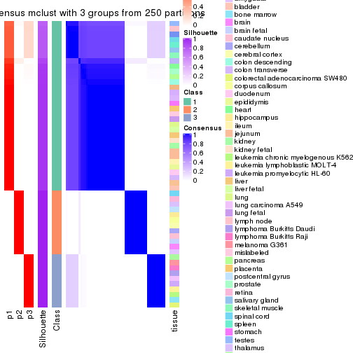</p>

</div>
<div id='tab-CV-mclust-consensus-heatmap-3'>
<pre><code class="r">consensus_heatmap(res, k = 4)
</code></pre>

<p></p>

</div>
<div id='tab-CV-mclust-consensus-heatmap-4'>
<pre><code class="r">consensus_heatmap(res, k = 5)
</code></pre>

<p></p>

</div>
<div id='tab-CV-mclust-consensus-heatmap-5'>
<pre><code class="r">consensus_heatmap(res, k = 6)
</code></pre>

<p></p>

</div>
</div>

Heatmaps for the membership of samples in all partitions to see how consistent they are:


<script>
$( function() {
	$( '#tabs-CV-mclust-membership-heatmap' ).tabs();
} );
</script>
<div id='tabs-CV-mclust-membership-heatmap'>
<ul>
<li><a href='#tab-CV-mclust-membership-heatmap-1'>k = 2</a></li>
<li><a href='#tab-CV-mclust-membership-heatmap-2'>k = 3</a></li>
<li><a href='#tab-CV-mclust-membership-heatmap-3'>k = 4</a></li>
<li><a href='#tab-CV-mclust-membership-heatmap-4'>k = 5</a></li>
<li><a href='#tab-CV-mclust-membership-heatmap-5'>k = 6</a></li>
</ul>
<div id='tab-CV-mclust-membership-heatmap-1'>
<pre><code class="r">membership_heatmap(res, k = 2)
</code></pre>

<p></p>

</div>
<div id='tab-CV-mclust-membership-heatmap-2'>
<pre><code class="r">membership_heatmap(res, k = 3)
</code></pre>

<p></p>

</div>
<div id='tab-CV-mclust-membership-heatmap-3'>
<pre><code class="r">membership_heatmap(res, k = 4)
</code></pre>

<p></p>

</div>
<div id='tab-CV-mclust-membership-heatmap-4'>
<pre><code class="r">membership_heatmap(res, k = 5)
</code></pre>

<p></p>

</div>
<div id='tab-CV-mclust-membership-heatmap-5'>
<pre><code class="r">membership_heatmap(res, k = 6)
</code></pre>

<p></p>

</div>
</div>

As soon as we have had the classes for columns, we can look for signatures
which are significantly different between classes which can be candidate marks
for certain classes. Following are the heatmaps for signatures.


Signature heatmaps where rows are scaled:


<script>
$( function() {
	$( '#tabs-CV-mclust-get-signatures' ).tabs();
} );
</script>
<div id='tabs-CV-mclust-get-signatures'>
<ul>
<li><a href='#tab-CV-mclust-get-signatures-1'>k = 2</a></li>
<li><a href='#tab-CV-mclust-get-signatures-2'>k = 3</a></li>
<li><a href='#tab-CV-mclust-get-signatures-3'>k = 4</a></li>
<li><a href='#tab-CV-mclust-get-signatures-4'>k = 5</a></li>
<li><a href='#tab-CV-mclust-get-signatures-5'>k = 6</a></li>
</ul>
<div id='tab-CV-mclust-get-signatures-1'>
<pre><code class="r">get_signatures(res, k = 2)
</code></pre>

<p></p>

</div>
<div id='tab-CV-mclust-get-signatures-2'>
<pre><code class="r">get_signatures(res, k = 3)
</code></pre>

<p></p>

</div>
<div id='tab-CV-mclust-get-signatures-3'>
<pre><code class="r">get_signatures(res, k = 4)
</code></pre>

<p></p>

</div>
<div id='tab-CV-mclust-get-signatures-4'>
<pre><code class="r">get_signatures(res, k = 5)
</code></pre>

<p></p>

</div>
<div id='tab-CV-mclust-get-signatures-5'>
<pre><code class="r">get_signatures(res, k = 6)
</code></pre>

<p></p>

</div>
</div>


Signature heatmaps where rows are not scaled:


<script>
$( function() {
	$( '#tabs-CV-mclust-get-signatures-no-scale' ).tabs();
} );
</script>
<div id='tabs-CV-mclust-get-signatures-no-scale'>
<ul>
<li><a href='#tab-CV-mclust-get-signatures-no-scale-1'>k = 2</a></li>
<li><a href='#tab-CV-mclust-get-signatures-no-scale-2'>k = 3</a></li>
<li><a href='#tab-CV-mclust-get-signatures-no-scale-3'>k = 4</a></li>
<li><a href='#tab-CV-mclust-get-signatures-no-scale-4'>k = 5</a></li>
<li><a href='#tab-CV-mclust-get-signatures-no-scale-5'>k = 6</a></li>
</ul>
<div id='tab-CV-mclust-get-signatures-no-scale-1'>
<pre><code class="r">get_signatures(res, k = 2, scale_rows = FALSE)
</code></pre>

<p></p>

</div>
<div id='tab-CV-mclust-get-signatures-no-scale-2'>
<pre><code class="r">get_signatures(res, k = 3, scale_rows = FALSE)
</code></pre>

<p></p>

</div>
<div id='tab-CV-mclust-get-signatures-no-scale-3'>
<pre><code class="r">get_signatures(res, k = 4, scale_rows = FALSE)
</code></pre>

<p></p>

</div>
<div id='tab-CV-mclust-get-signatures-no-scale-4'>
<pre><code class="r">get_signatures(res, k = 5, scale_rows = FALSE)
</code></pre>

<p></p>

</div>
<div id='tab-CV-mclust-get-signatures-no-scale-5'>
<pre><code class="r">get_signatures(res, k = 6, scale_rows = FALSE)
</code></pre>

<p></p>

</div>
</div>


Compare the overlap of signatures from different k:

```r
compare_signatures(res)
```


`get_signature()` returns a data frame invisibly. TO get the list of signatures, the function
call should be assigned to a variable explicitly. In following code, if `plot` argument is set
to `FALSE`, no heatmap is plotted while only the differential analysis is performed.

```r
# code only for demonstration
tb = get_signature(res, k = ..., plot = FALSE)
```

An example of the output of `tb` is:

```
#>   which_row         fdr    mean_1    mean_2 scaled_mean_1 scaled_mean_2 km
#> 1        38 0.042760348  8.373488  9.131774    -0.5533452     0.5164555  1
#> 2        40 0.018707592  7.106213  8.469186    -0.6173731     0.5762149  1
#> 3        55 0.019134737 10.221463 11.207825    -0.6159697     0.5749050  1
#> 4        59 0.006059896  5.921854  7.869574    -0.6899429     0.6439467  1
#> 5        60 0.018055526  8.928898 10.211722    -0.6204761     0.5791110  1
#> 6        98 0.009384629 15.714769 14.887706     0.6635654    -0.6193277  2
...
```

The columns in `tb` are:

1. `which_row`: row indices corresponding to the input matrix.
2. `fdr`: FDR for the differential test. 
3. `mean_x`: The mean value in group x.
4. `scaled_mean_x`: The mean value in group x after rows are scaled.
5. `km`: Row groups if k-means clustering is applied to rows.


UMAP plot which shows how samples are separated.


<script>
$( function() {
	$( '#tabs-CV-mclust-dimension-reduction' ).tabs();
} );
</script>
<div id='tabs-CV-mclust-dimension-reduction'>
<ul>
<li><a href='#tab-CV-mclust-dimension-reduction-1'>k = 2</a></li>
<li><a href='#tab-CV-mclust-dimension-reduction-2'>k = 3</a></li>
<li><a href='#tab-CV-mclust-dimension-reduction-3'>k = 4</a></li>
<li><a href='#tab-CV-mclust-dimension-reduction-4'>k = 5</a></li>
<li><a href='#tab-CV-mclust-dimension-reduction-5'>k = 6</a></li>
</ul>
<div id='tab-CV-mclust-dimension-reduction-1'>
<pre><code class="r">dimension_reduction(res, k = 2, method = &quot;UMAP&quot;)
</code></pre>

<p></p>

</div>
<div id='tab-CV-mclust-dimension-reduction-2'>
<pre><code class="r">dimension_reduction(res, k = 3, method = &quot;UMAP&quot;)
</code></pre>

<p></p>

</div>
<div id='tab-CV-mclust-dimension-reduction-3'>
<pre><code class="r">dimension_reduction(res, k = 4, method = &quot;UMAP&quot;)
</code></pre>

<p></p>

</div>
<div id='tab-CV-mclust-dimension-reduction-4'>
<pre><code class="r">dimension_reduction(res, k = 5, method = &quot;UMAP&quot;)
</code></pre>

<p></p>

</div>
<div id='tab-CV-mclust-dimension-reduction-5'>
<pre><code class="r">dimension_reduction(res, k = 6, method = &quot;UMAP&quot;)
</code></pre>

<p></p>

</div>
</div>


Following heatmap shows how subgroups are split when increasing `k`:

```r
collect_classes(res)
```


Test correlation between subgroups and known annotations. If the known
annotation is numeric, one-way ANOVA test is applied, and if the known
annotation is discrete, chi-squared contingency table test is applied.

```r
test_to_known_factors(res)
```

```
#>            n tissue(p) k
#> CV:mclust 54     0.398 2
#> CV:mclust 54     0.374 3
#> CV:mclust 52     0.352 4
#> CV:mclust 48     0.405 5
#> CV:mclust 53     0.407 6
```


If matrix rows can be associated to genes, consider to use `functional_enrichment(res,
...)` to perform function enrichment for the signature genes. See [this vignette](http://bioconductor.org/packages/devel/bioc/vignettes/cola/inst/doc/functional_enrichment.html) for more detailed explanations.


 

---------------------------------------------------


### CV:NMF**


The object with results only for a single top-value method and a single partition method 
can be extracted as:

```r
res = res_list["CV", "NMF"]
# you can also extract it by
# res = res_list["CV:NMF"]
```

A summary of `res` and all the functions that can be applied to it:

```r
res
```

```
#> A 'ConsensusPartition' object with k = 2, 3, 4, 5, 6.
#>   On a matrix with 12150 rows and 54 columns.
#>   Top rows (1000, 2000, 3000, 4000, 5000) are extracted by 'CV' method.
#>   Subgroups are detected by 'NMF' method.
#>   Performed in total 1250 partitions by row resampling.
#>   Best k for subgroups seems to be 3.
#> 
#> Following methods can be applied to this 'ConsensusPartition' object:
#>  [1] "cola_report"             "collect_classes"         "collect_plots"          
#>  [4] "collect_stats"           "colnames"                "compare_signatures"     
#>  [7] "consensus_heatmap"       "dimension_reduction"     "functional_enrichment"  
#> [10] "get_anno_col"            "get_anno"                "get_classes"            
#> [13] "get_consensus"           "get_matrix"              "get_membership"         
#> [16] "get_param"               "get_signatures"          "get_stats"              
#> [19] "is_best_k"               "is_stable_k"             "membership_heatmap"     
#> [22] "ncol"                    "nrow"                    "plot_ecdf"              
#> [25] "rownames"                "select_partition_number" "show"                   
#> [28] "suggest_best_k"          "test_to_known_factors"
```

`collect_plots()` function collects all the plots made from `res` for all `k` (number of partitions)
into one single page to provide an easy and fast comparison between different `k`.

```r
collect_plots(res)
```


The plots are:

- The first row: a plot of the ECDF (empirical cumulative distribution
  function) curves of the consensus matrix for each `k` and the heatmap of
  predicted classes for each `k`.
- The second row: heatmaps of the consensus matrix for each `k`.
- The third row: heatmaps of the membership matrix for each `k`.
- The fouth row: heatmaps of the signatures for each `k`.

All the plots in panels can be made by individual functions and they are
plotted later in this section.

`select_partition_number()` produces several plots showing different
statistics for choosing "optimized" `k`. There are following statistics:

- ECDF curves of the consensus matrix for each `k`;
- 1-PAC. [The PAC
  score](https://en.wikipedia.org/wiki/Consensus_clustering#Over-interpretation_potential_of_consensus_clustering)
  measures the proportion of the ambiguous subgrouping.
- Mean silhouette score.
- Concordance. The mean probability of fiting the consensus class ids in all
  partitions.
- Area increased. Denote $A_k$ as the area under the ECDF curve for current
  `k`, the area increased is defined as $A_k - A_{k-1}$.
- Rand index. The percent of pairs of samples that are both in a same cluster
  or both are not in a same cluster in the partition of k and k-1.
- Jaccard index. The ratio of pairs of samples are both in a same cluster in
  the partition of k and k-1 and the pairs of samples are both in a same
  cluster in the partition k or k-1.

The detailed explanations of these statistics can be found in [the _cola_
vignette](http://bioconductor.org/packages/devel/bioc/vignettes/cola/inst/doc/cola.html#toc_13).

Generally speaking, lower PAC score, higher mean silhouette score or higher
concordance corresponds to better partition. Rand index and Jaccard index
measure how similar the current partition is compared to partition with `k-1`.
If they are too similar, we won't accept `k` is better than `k-1`.

```r
select_partition_number(res)
```


The numeric values for all these statistics can be obtained by `get_stats()`.

```r
get_stats(res)
```

```
#>   k 1-PAC mean_silhouette concordance area_increased  Rand Jaccard
#> 2 2 1.000           0.980       0.992         0.3615 0.648   0.648
#> 3 3 0.964           0.965       0.979         0.6637 0.762   0.632
#> 4 4 0.778           0.809       0.873         0.2136 0.871   0.688
#> 5 5 0.848           0.850       0.915         0.0843 0.894   0.650
#> 6 6 0.837           0.682       0.847         0.0418 0.988   0.943
```

`suggest_best_k()` suggests the best $k$ based on these statistics. The rules are as follows:

- All $k$ with Jaccard index larger than 0.95 are removed because increasing
  $k$ does not provide enough extra information. If all $k$ are removed, it is
  marked as no subgroup is detected.
- For all $k$ with 1-PAC score larger than 0.9, the maximal $k$ is taken as
  the best $k$, and other $k$ are marked as optional $k$.
- If it does not fit the second rule. The $k$ with the maximal vote of the
  highest 1-PAC score, highest mean silhouette, and highest concordance is
  taken as the best $k$.

```r
suggest_best_k(res)
```

```
#> [1] 3
#> attr(,"optional")
#> [1] 2
```

There is also optional best $k$ = 2 that is worth to check.

Following shows the table of the partitions (You need to click the **show/hide
code output** link to see it). The membership matrix (columns with name `p*`)
is inferred by
[`clue::cl_consensus()`](https://www.rdocumentation.org/link/cl_consensus?package=clue)
function with the `SE` method. Basically the value in the membership matrix
represents the probability to belong to a certain group. The finall class
label for an item is determined with the group with highest probability it
belongs to.

In `get_classes()` function, the entropy is calculated from the membership
matrix and the silhouette score is calculated from the consensus matrix.


<script>
$( function() {
	$( '#tabs-CV-NMF-get-classes' ).tabs();
} );
</script>
<div id='tabs-CV-NMF-get-classes'>
<ul>
<li><a href='#tab-CV-NMF-get-classes-1'>k = 2</a></li>
<li><a href='#tab-CV-NMF-get-classes-2'>k = 3</a></li>
<li><a href='#tab-CV-NMF-get-classes-3'>k = 4</a></li>
<li><a href='#tab-CV-NMF-get-classes-4'>k = 5</a></li>
<li><a href='#tab-CV-NMF-get-classes-5'>k = 6</a></li>
</ul>

<div id='tab-CV-NMF-get-classes-1'>
<p><a id='tab-CV-NMF-get-classes-1-a' style='color:#0366d6' href='#'>show/hide code output</a></p>
<pre><code class="r">cbind(get_classes(res, k = 2), get_membership(res, k = 2))
</code></pre>

<pre><code>#&gt;          class entropy silhouette    p1    p2
#&gt; GSM28815     1   0.000      0.989 1.000 0.000
#&gt; GSM28816     1   0.958      0.391 0.620 0.380
#&gt; GSM28817     1   0.000      0.989 1.000 0.000
#&gt; GSM11327     1   0.000      0.989 1.000 0.000
#&gt; GSM28825     2   0.000      1.000 0.000 1.000
#&gt; GSM11322     2   0.000      1.000 0.000 1.000
#&gt; GSM28828     2   0.000      1.000 0.000 1.000
#&gt; GSM11346     2   0.000      1.000 0.000 1.000
#&gt; GSM28808     2   0.000      1.000 0.000 1.000
#&gt; GSM11332     2   0.000      1.000 0.000 1.000
#&gt; GSM28811     2   0.000      1.000 0.000 1.000
#&gt; GSM11334     2   0.000      1.000 0.000 1.000
#&gt; GSM11340     2   0.000      1.000 0.000 1.000
#&gt; GSM28812     2   0.000      1.000 0.000 1.000
#&gt; GSM11345     1   0.000      0.989 1.000 0.000
#&gt; GSM28819     1   0.000      0.989 1.000 0.000
#&gt; GSM11321     1   0.000      0.989 1.000 0.000
#&gt; GSM28820     1   0.000      0.989 1.000 0.000
#&gt; GSM11339     1   0.000      0.989 1.000 0.000
#&gt; GSM28804     1   0.295      0.938 0.948 0.052
#&gt; GSM28823     1   0.000      0.989 1.000 0.000
#&gt; GSM11336     1   0.000      0.989 1.000 0.000
#&gt; GSM11342     1   0.000      0.989 1.000 0.000
#&gt; GSM11333     1   0.000      0.989 1.000 0.000
#&gt; GSM28802     1   0.000      0.989 1.000 0.000
#&gt; GSM28803     1   0.000      0.989 1.000 0.000
#&gt; GSM11343     1   0.000      0.989 1.000 0.000
#&gt; GSM11347     1   0.000      0.989 1.000 0.000
#&gt; GSM28824     1   0.000      0.989 1.000 0.000
#&gt; GSM28813     1   0.000      0.989 1.000 0.000
#&gt; GSM28827     1   0.000      0.989 1.000 0.000
#&gt; GSM11337     1   0.000      0.989 1.000 0.000
#&gt; GSM28814     1   0.000      0.989 1.000 0.000
#&gt; GSM11331     1   0.000      0.989 1.000 0.000
#&gt; GSM11344     1   0.000      0.989 1.000 0.000
#&gt; GSM11330     1   0.000      0.989 1.000 0.000
#&gt; GSM11325     1   0.000      0.989 1.000 0.000
#&gt; GSM11338     1   0.000      0.989 1.000 0.000
#&gt; GSM28806     1   0.000      0.989 1.000 0.000
#&gt; GSM28826     1   0.000      0.989 1.000 0.000
#&gt; GSM28818     1   0.000      0.989 1.000 0.000
#&gt; GSM28821     2   0.000      1.000 0.000 1.000
#&gt; GSM28807     1   0.000      0.989 1.000 0.000
#&gt; GSM28822     1   0.000      0.989 1.000 0.000
#&gt; GSM11328     2   0.000      1.000 0.000 1.000
#&gt; GSM11323     1   0.000      0.989 1.000 0.000
#&gt; GSM11324     1   0.000      0.989 1.000 0.000
#&gt; GSM11341     1   0.000      0.989 1.000 0.000
#&gt; GSM11326     1   0.000      0.989 1.000 0.000
#&gt; GSM28810     1   0.000      0.989 1.000 0.000
#&gt; GSM11335     1   0.000      0.989 1.000 0.000
#&gt; GSM28809     1   0.000      0.989 1.000 0.000
#&gt; GSM11329     1   0.000      0.989 1.000 0.000
#&gt; GSM28805     1   0.000      0.989 1.000 0.000
</code></pre>

<script>
$('#tab-CV-NMF-get-classes-1-a').parent().next().next().hide();
$('#tab-CV-NMF-get-classes-1-a').click(function(){
  $('#tab-CV-NMF-get-classes-1-a').parent().next().next().toggle();
  return(false);
});
</script>
</div>

<div id='tab-CV-NMF-get-classes-2'>
<p><a id='tab-CV-NMF-get-classes-2-a' style='color:#0366d6' href='#'>show/hide code output</a></p>
<pre><code class="r">cbind(get_classes(res, k = 3), get_membership(res, k = 3))
</code></pre>

<pre><code>#&gt;          class entropy silhouette    p1    p2    p3
#&gt; GSM28815     1  0.0000      0.965 1.000 0.000 0.000
#&gt; GSM28816     1  0.4235      0.811 0.824 0.176 0.000
#&gt; GSM28817     1  0.0000      0.965 1.000 0.000 0.000
#&gt; GSM11327     3  0.0000      0.995 0.000 0.000 1.000
#&gt; GSM28825     2  0.0000      1.000 0.000 1.000 0.000
#&gt; GSM11322     2  0.0000      1.000 0.000 1.000 0.000
#&gt; GSM28828     2  0.0000      1.000 0.000 1.000 0.000
#&gt; GSM11346     2  0.0000      1.000 0.000 1.000 0.000
#&gt; GSM28808     2  0.0000      1.000 0.000 1.000 0.000
#&gt; GSM11332     2  0.0000      1.000 0.000 1.000 0.000
#&gt; GSM28811     2  0.0000      1.000 0.000 1.000 0.000
#&gt; GSM11334     2  0.0000      1.000 0.000 1.000 0.000
#&gt; GSM11340     2  0.0000      1.000 0.000 1.000 0.000
#&gt; GSM28812     2  0.0000      1.000 0.000 1.000 0.000
#&gt; GSM11345     1  0.0000      0.965 1.000 0.000 0.000
#&gt; GSM28819     1  0.0237      0.965 0.996 0.000 0.004
#&gt; GSM11321     3  0.0000      0.995 0.000 0.000 1.000
#&gt; GSM28820     1  0.0000      0.965 1.000 0.000 0.000
#&gt; GSM11339     1  0.0000      0.965 1.000 0.000 0.000
#&gt; GSM28804     1  0.0747      0.962 0.984 0.000 0.016
#&gt; GSM28823     1  0.0000      0.965 1.000 0.000 0.000
#&gt; GSM11336     1  0.1964      0.939 0.944 0.000 0.056
#&gt; GSM11342     1  0.0000      0.965 1.000 0.000 0.000
#&gt; GSM11333     1  0.0000      0.965 1.000 0.000 0.000
#&gt; GSM28802     1  0.1031      0.958 0.976 0.000 0.024
#&gt; GSM28803     3  0.0000      0.995 0.000 0.000 1.000
#&gt; GSM11343     3  0.0000      0.995 0.000 0.000 1.000
#&gt; GSM11347     3  0.0000      0.995 0.000 0.000 1.000
#&gt; GSM28824     1  0.1753      0.944 0.952 0.000 0.048
#&gt; GSM28813     1  0.4702      0.779 0.788 0.000 0.212
#&gt; GSM28827     1  0.0000      0.965 1.000 0.000 0.000
#&gt; GSM11337     1  0.1031      0.958 0.976 0.000 0.024
#&gt; GSM28814     3  0.0000      0.995 0.000 0.000 1.000
#&gt; GSM11331     1  0.3267      0.893 0.884 0.000 0.116
#&gt; GSM11344     3  0.0000      0.995 0.000 0.000 1.000
#&gt; GSM11330     3  0.0000      0.995 0.000 0.000 1.000
#&gt; GSM11325     3  0.0000      0.995 0.000 0.000 1.000
#&gt; GSM11338     1  0.3752      0.863 0.856 0.000 0.144
#&gt; GSM28806     1  0.0000      0.965 1.000 0.000 0.000
#&gt; GSM28826     1  0.2796      0.914 0.908 0.000 0.092
#&gt; GSM28818     1  0.0424      0.964 0.992 0.000 0.008
#&gt; GSM28821     2  0.0000      1.000 0.000 1.000 0.000
#&gt; GSM28807     1  0.0747      0.962 0.984 0.000 0.016
#&gt; GSM28822     1  0.0747      0.962 0.984 0.000 0.016
#&gt; GSM11328     2  0.0000      1.000 0.000 1.000 0.000
#&gt; GSM11323     1  0.2878      0.912 0.904 0.000 0.096
#&gt; GSM11324     1  0.0000      0.965 1.000 0.000 0.000
#&gt; GSM11341     3  0.1643      0.945 0.044 0.000 0.956
#&gt; GSM11326     3  0.0000      0.995 0.000 0.000 1.000
#&gt; GSM28810     1  0.0747      0.962 0.984 0.000 0.016
#&gt; GSM11335     1  0.0747      0.962 0.984 0.000 0.016
#&gt; GSM28809     1  0.0000      0.965 1.000 0.000 0.000
#&gt; GSM11329     1  0.0000      0.965 1.000 0.000 0.000
#&gt; GSM28805     1  0.0000      0.965 1.000 0.000 0.000
</code></pre>

<script>
$('#tab-CV-NMF-get-classes-2-a').parent().next().next().hide();
$('#tab-CV-NMF-get-classes-2-a').click(function(){
  $('#tab-CV-NMF-get-classes-2-a').parent().next().next().toggle();
  return(false);
});
</script>
</div>

<div id='tab-CV-NMF-get-classes-3'>
<p><a id='tab-CV-NMF-get-classes-3-a' style='color:#0366d6' href='#'>show/hide code output</a></p>
<pre><code class="r">cbind(get_classes(res, k = 4), get_membership(res, k = 4))
</code></pre>

<pre><code>#&gt;          class entropy silhouette    p1    p2    p3    p4
#&gt; GSM28815     1  0.2647     0.7624 0.880 0.000 0.000 0.120
#&gt; GSM28816     1  0.7714     0.3135 0.400 0.224 0.000 0.376
#&gt; GSM28817     1  0.0469     0.7730 0.988 0.000 0.000 0.012
#&gt; GSM11327     3  0.1022     0.9716 0.000 0.000 0.968 0.032
#&gt; GSM28825     2  0.0000     1.0000 0.000 1.000 0.000 0.000
#&gt; GSM11322     2  0.0000     1.0000 0.000 1.000 0.000 0.000
#&gt; GSM28828     2  0.0000     1.0000 0.000 1.000 0.000 0.000
#&gt; GSM11346     2  0.0000     1.0000 0.000 1.000 0.000 0.000
#&gt; GSM28808     2  0.0000     1.0000 0.000 1.000 0.000 0.000
#&gt; GSM11332     2  0.0000     1.0000 0.000 1.000 0.000 0.000
#&gt; GSM28811     2  0.0000     1.0000 0.000 1.000 0.000 0.000
#&gt; GSM11334     2  0.0000     1.0000 0.000 1.000 0.000 0.000
#&gt; GSM11340     2  0.0000     1.0000 0.000 1.000 0.000 0.000
#&gt; GSM28812     2  0.0000     1.0000 0.000 1.000 0.000 0.000
#&gt; GSM11345     1  0.1792     0.7249 0.932 0.000 0.000 0.068
#&gt; GSM28819     1  0.0000     0.7730 1.000 0.000 0.000 0.000
#&gt; GSM11321     3  0.1022     0.9727 0.000 0.000 0.968 0.032
#&gt; GSM28820     1  0.0188     0.7736 0.996 0.000 0.000 0.004
#&gt; GSM11339     1  0.4356     0.3756 0.708 0.000 0.000 0.292
#&gt; GSM28804     4  0.3649     0.8894 0.204 0.000 0.000 0.796
#&gt; GSM28823     1  0.0000     0.7730 1.000 0.000 0.000 0.000
#&gt; GSM11336     1  0.4222     0.7068 0.728 0.000 0.000 0.272
#&gt; GSM11342     1  0.0000     0.7730 1.000 0.000 0.000 0.000
#&gt; GSM11333     1  0.4992     0.4981 0.524 0.000 0.000 0.476
#&gt; GSM28802     1  0.2647     0.7563 0.880 0.000 0.000 0.120
#&gt; GSM28803     3  0.1118     0.9714 0.000 0.000 0.964 0.036
#&gt; GSM11343     3  0.0000     0.9746 0.000 0.000 1.000 0.000
#&gt; GSM11347     3  0.0188     0.9744 0.000 0.000 0.996 0.004
#&gt; GSM28824     1  0.4401     0.7049 0.724 0.000 0.004 0.272
#&gt; GSM28813     1  0.5256     0.6855 0.692 0.000 0.036 0.272
#&gt; GSM28827     1  0.0336     0.7697 0.992 0.000 0.000 0.008
#&gt; GSM11337     1  0.3975     0.7231 0.760 0.000 0.000 0.240
#&gt; GSM28814     3  0.1389     0.9646 0.000 0.000 0.952 0.048
#&gt; GSM11331     1  0.7036     0.1707 0.576 0.000 0.212 0.212
#&gt; GSM11344     3  0.0188     0.9744 0.000 0.000 0.996 0.004
#&gt; GSM11330     3  0.0188     0.9744 0.000 0.000 0.996 0.004
#&gt; GSM11325     3  0.1807     0.9565 0.008 0.000 0.940 0.052
#&gt; GSM11338     1  0.4072     0.7172 0.748 0.000 0.000 0.252
#&gt; GSM28806     4  0.4817     0.6996 0.388 0.000 0.000 0.612
#&gt; GSM28826     1  0.4453     0.7157 0.744 0.000 0.012 0.244
#&gt; GSM28818     4  0.3801     0.8906 0.220 0.000 0.000 0.780
#&gt; GSM28821     2  0.0000     1.0000 0.000 1.000 0.000 0.000
#&gt; GSM28807     4  0.3649     0.8894 0.204 0.000 0.000 0.796
#&gt; GSM28822     4  0.3764     0.8925 0.216 0.000 0.000 0.784
#&gt; GSM11328     2  0.0000     1.0000 0.000 1.000 0.000 0.000
#&gt; GSM11323     1  0.6454    -0.0266 0.572 0.000 0.084 0.344
#&gt; GSM11324     1  0.0000     0.7730 1.000 0.000 0.000 0.000
#&gt; GSM11341     4  0.4511     0.5331 0.008 0.000 0.268 0.724
#&gt; GSM11326     3  0.0592     0.9698 0.000 0.000 0.984 0.016
#&gt; GSM28810     4  0.4277     0.8523 0.280 0.000 0.000 0.720
#&gt; GSM11335     4  0.3837     0.8900 0.224 0.000 0.000 0.776
#&gt; GSM28809     1  0.3311     0.6641 0.828 0.000 0.000 0.172
#&gt; GSM11329     1  0.0188     0.7714 0.996 0.000 0.000 0.004
#&gt; GSM28805     1  0.0188     0.7722 0.996 0.000 0.000 0.004
</code></pre>

<script>
$('#tab-CV-NMF-get-classes-3-a').parent().next().next().hide();
$('#tab-CV-NMF-get-classes-3-a').click(function(){
  $('#tab-CV-NMF-get-classes-3-a').parent().next().next().toggle();
  return(false);
});
</script>
</div>

<div id='tab-CV-NMF-get-classes-4'>
<p><a id='tab-CV-NMF-get-classes-4-a' style='color:#0366d6' href='#'>show/hide code output</a></p>
<pre><code class="r">cbind(get_classes(res, k = 5), get_membership(res, k = 5))
</code></pre>

<pre><code>#&gt;          class entropy silhouette    p1 p2    p3    p4    p5
#&gt; GSM28815     1  0.4058      0.611 0.740  0 0.000 0.024 0.236
#&gt; GSM28816     5  0.1774      0.795 0.016  0 0.000 0.052 0.932
#&gt; GSM28817     1  0.1106      0.867 0.964  0 0.000 0.012 0.024
#&gt; GSM11327     3  0.1410      0.914 0.000  0 0.940 0.000 0.060
#&gt; GSM28825     2  0.0000      1.000 0.000  1 0.000 0.000 0.000
#&gt; GSM11322     2  0.0000      1.000 0.000  1 0.000 0.000 0.000
#&gt; GSM28828     2  0.0000      1.000 0.000  1 0.000 0.000 0.000
#&gt; GSM11346     2  0.0000      1.000 0.000  1 0.000 0.000 0.000
#&gt; GSM28808     2  0.0000      1.000 0.000  1 0.000 0.000 0.000
#&gt; GSM11332     2  0.0000      1.000 0.000  1 0.000 0.000 0.000
#&gt; GSM28811     2  0.0000      1.000 0.000  1 0.000 0.000 0.000
#&gt; GSM11334     2  0.0000      1.000 0.000  1 0.000 0.000 0.000
#&gt; GSM11340     2  0.0000      1.000 0.000  1 0.000 0.000 0.000
#&gt; GSM28812     2  0.0000      1.000 0.000  1 0.000 0.000 0.000
#&gt; GSM11345     1  0.0510      0.869 0.984  0 0.000 0.016 0.000
#&gt; GSM28819     1  0.0510      0.866 0.984  0 0.000 0.000 0.016
#&gt; GSM11321     3  0.2922      0.901 0.016  0 0.880 0.024 0.080
#&gt; GSM28820     1  0.0794      0.865 0.972  0 0.000 0.000 0.028
#&gt; GSM11339     1  0.2351      0.835 0.896  0 0.000 0.088 0.016
#&gt; GSM28804     4  0.1579      0.915 0.032  0 0.000 0.944 0.024
#&gt; GSM28823     1  0.0404      0.868 0.988  0 0.000 0.000 0.012
#&gt; GSM11336     5  0.1197      0.824 0.048  0 0.000 0.000 0.952
#&gt; GSM11342     1  0.0771      0.865 0.976  0 0.000 0.004 0.020
#&gt; GSM11333     5  0.1992      0.807 0.032  0 0.000 0.044 0.924
#&gt; GSM28802     1  0.3897      0.646 0.768  0 0.000 0.028 0.204
#&gt; GSM28803     3  0.2722      0.902 0.000  0 0.872 0.020 0.108
#&gt; GSM11343     3  0.0794      0.922 0.000  0 0.972 0.000 0.028
#&gt; GSM11347     3  0.0000      0.922 0.000  0 1.000 0.000 0.000
#&gt; GSM28824     5  0.1124      0.821 0.036  0 0.004 0.000 0.960
#&gt; GSM28813     5  0.1168      0.818 0.032  0 0.008 0.000 0.960
#&gt; GSM28827     1  0.0693      0.870 0.980  0 0.000 0.012 0.008
#&gt; GSM11337     5  0.4264      0.499 0.376  0 0.000 0.004 0.620
#&gt; GSM28814     3  0.3606      0.862 0.008  0 0.816 0.024 0.152
#&gt; GSM11331     1  0.4045      0.769 0.808  0 0.128 0.044 0.020
#&gt; GSM11344     3  0.0000      0.922 0.000  0 1.000 0.000 0.000
#&gt; GSM11330     3  0.0324      0.920 0.000  0 0.992 0.004 0.004
#&gt; GSM11325     3  0.4536      0.786 0.020  0 0.740 0.028 0.212
#&gt; GSM11338     5  0.3086      0.774 0.180  0 0.000 0.004 0.816
#&gt; GSM28806     1  0.4538      0.018 0.540  0 0.000 0.452 0.008
#&gt; GSM28826     5  0.5333      0.458 0.368  0 0.032 0.016 0.584
#&gt; GSM28818     4  0.1774      0.918 0.052  0 0.000 0.932 0.016
#&gt; GSM28821     2  0.0000      1.000 0.000  1 0.000 0.000 0.000
#&gt; GSM28807     4  0.1168      0.919 0.032  0 0.000 0.960 0.008
#&gt; GSM28822     4  0.1251      0.920 0.036  0 0.000 0.956 0.008
#&gt; GSM11328     2  0.0000      1.000 0.000  1 0.000 0.000 0.000
#&gt; GSM11323     1  0.4598      0.734 0.768  0 0.140 0.076 0.016
#&gt; GSM11324     1  0.0671      0.870 0.980  0 0.000 0.016 0.004
#&gt; GSM11341     4  0.1569      0.877 0.004  0 0.044 0.944 0.008
#&gt; GSM11326     3  0.1041      0.909 0.000  0 0.964 0.032 0.004
#&gt; GSM28810     4  0.3961      0.674 0.248  0 0.016 0.736 0.000
#&gt; GSM11335     4  0.2069      0.900 0.076  0 0.012 0.912 0.000
#&gt; GSM28809     1  0.4054      0.748 0.788  0 0.000 0.140 0.072
#&gt; GSM11329     1  0.0566      0.870 0.984  0 0.000 0.012 0.004
#&gt; GSM28805     1  0.0798      0.870 0.976  0 0.000 0.008 0.016
</code></pre>

<script>
$('#tab-CV-NMF-get-classes-4-a').parent().next().next().hide();
$('#tab-CV-NMF-get-classes-4-a').click(function(){
  $('#tab-CV-NMF-get-classes-4-a').parent().next().next().toggle();
  return(false);
});
</script>
</div>

<div id='tab-CV-NMF-get-classes-5'>
<p><a id='tab-CV-NMF-get-classes-5-a' style='color:#0366d6' href='#'>show/hide code output</a></p>
<pre><code class="r">cbind(get_classes(res, k = 6), get_membership(res, k = 6))
</code></pre>

<pre><code>#&gt;          class entropy silhouette    p1 p2    p3    p4    p5    p6
#&gt; GSM28815     1  0.5517     0.3522 0.608  0 0.000 0.016 0.228 0.148
#&gt; GSM28816     5  0.5087     0.3154 0.020  0 0.000 0.040 0.520 0.420
#&gt; GSM28817     1  0.0909     0.7453 0.968  0 0.000 0.000 0.020 0.012
#&gt; GSM11327     3  0.4176     0.5215 0.000  0 0.720 0.000 0.212 0.068
#&gt; GSM28825     2  0.0000     1.0000 0.000  1 0.000 0.000 0.000 0.000
#&gt; GSM11322     2  0.0000     1.0000 0.000  1 0.000 0.000 0.000 0.000
#&gt; GSM28828     2  0.0000     1.0000 0.000  1 0.000 0.000 0.000 0.000
#&gt; GSM11346     2  0.0000     1.0000 0.000  1 0.000 0.000 0.000 0.000
#&gt; GSM28808     2  0.0000     1.0000 0.000  1 0.000 0.000 0.000 0.000
#&gt; GSM11332     2  0.0000     1.0000 0.000  1 0.000 0.000 0.000 0.000
#&gt; GSM28811     2  0.0000     1.0000 0.000  1 0.000 0.000 0.000 0.000
#&gt; GSM11334     2  0.0000     1.0000 0.000  1 0.000 0.000 0.000 0.000
#&gt; GSM11340     2  0.0000     1.0000 0.000  1 0.000 0.000 0.000 0.000
#&gt; GSM28812     2  0.0000     1.0000 0.000  1 0.000 0.000 0.000 0.000
#&gt; GSM11345     1  0.0260     0.7470 0.992  0 0.000 0.000 0.000 0.008
#&gt; GSM28819     1  0.0603     0.7447 0.980  0 0.000 0.000 0.004 0.016
#&gt; GSM11321     3  0.4378     0.1960 0.016  0 0.528 0.000 0.004 0.452
#&gt; GSM28820     1  0.0692     0.7456 0.976  0 0.000 0.000 0.004 0.020
#&gt; GSM11339     1  0.3314     0.6817 0.828  0 0.000 0.076 0.004 0.092
#&gt; GSM28804     4  0.1910     0.8397 0.000  0 0.000 0.892 0.000 0.108
#&gt; GSM28823     1  0.0951     0.7435 0.968  0 0.008 0.000 0.004 0.020
#&gt; GSM11336     5  0.0291     0.7704 0.004  0 0.000 0.000 0.992 0.004
#&gt; GSM11342     1  0.0951     0.7435 0.968  0 0.008 0.000 0.004 0.020
#&gt; GSM11333     5  0.4991     0.3664 0.020  0 0.000 0.036 0.548 0.396
#&gt; GSM28802     1  0.4384    -0.0230 0.520  0 0.004 0.000 0.016 0.460
#&gt; GSM28803     3  0.3719     0.5654 0.000  0 0.728 0.000 0.024 0.248
#&gt; GSM11343     3  0.1285     0.7222 0.000  0 0.944 0.000 0.004 0.052
#&gt; GSM11347     3  0.0000     0.7313 0.000  0 1.000 0.000 0.000 0.000
#&gt; GSM28824     5  0.0146     0.7705 0.004  0 0.000 0.000 0.996 0.000
#&gt; GSM28813     5  0.0000     0.7698 0.000  0 0.000 0.000 1.000 0.000
#&gt; GSM28827     1  0.1606     0.7359 0.932  0 0.000 0.008 0.004 0.056
#&gt; GSM11337     5  0.2956     0.6475 0.088  0 0.000 0.000 0.848 0.064
#&gt; GSM28814     3  0.4223     0.4090 0.000  0 0.612 0.004 0.016 0.368
#&gt; GSM11331     1  0.6630     0.0990 0.380  0 0.320 0.020 0.004 0.276
#&gt; GSM11344     3  0.0260     0.7316 0.000  0 0.992 0.000 0.000 0.008
#&gt; GSM11330     3  0.0865     0.7214 0.000  0 0.964 0.000 0.000 0.036
#&gt; GSM11325     6  0.4357    -0.1005 0.016  0 0.304 0.000 0.020 0.660
#&gt; GSM11338     5  0.0865     0.7580 0.036  0 0.000 0.000 0.964 0.000
#&gt; GSM28806     1  0.5509     0.2236 0.524  0 0.000 0.328 0.000 0.148
#&gt; GSM28826     6  0.6190    -0.0250 0.280  0 0.004 0.000 0.316 0.400
#&gt; GSM28818     4  0.0914     0.9027 0.016  0 0.000 0.968 0.000 0.016
#&gt; GSM28821     2  0.0000     1.0000 0.000  1 0.000 0.000 0.000 0.000
#&gt; GSM28807     4  0.0260     0.9050 0.000  0 0.000 0.992 0.000 0.008
#&gt; GSM28822     4  0.0146     0.9038 0.000  0 0.000 0.996 0.000 0.004
#&gt; GSM11328     2  0.0000     1.0000 0.000  1 0.000 0.000 0.000 0.000
#&gt; GSM11323     1  0.7157     0.0894 0.368  0 0.296 0.056 0.008 0.272
#&gt; GSM11324     1  0.1010     0.7441 0.960  0 0.000 0.004 0.000 0.036
#&gt; GSM11341     4  0.0520     0.9045 0.000  0 0.008 0.984 0.000 0.008
#&gt; GSM11326     3  0.2994     0.6057 0.000  0 0.788 0.000 0.004 0.208
#&gt; GSM28810     4  0.3982     0.6421 0.200  0 0.000 0.740 0.000 0.060
#&gt; GSM11335     4  0.2001     0.8774 0.008  0 0.012 0.912 0.000 0.068
#&gt; GSM28809     1  0.5525     0.5242 0.660  0 0.000 0.144 0.056 0.140
#&gt; GSM11329     1  0.0692     0.7472 0.976  0 0.000 0.004 0.000 0.020
#&gt; GSM28805     1  0.1714     0.7256 0.908  0 0.000 0.000 0.000 0.092
</code></pre>

<script>
$('#tab-CV-NMF-get-classes-5-a').parent().next().next().hide();
$('#tab-CV-NMF-get-classes-5-a').click(function(){
  $('#tab-CV-NMF-get-classes-5-a').parent().next().next().toggle();
  return(false);
});
</script>
</div>
</div>

Heatmaps for the consensus matrix. It visualizes the probability of two
samples to be in a same group.


<script>
$( function() {
	$( '#tabs-CV-NMF-consensus-heatmap' ).tabs();
} );
</script>
<div id='tabs-CV-NMF-consensus-heatmap'>
<ul>
<li><a href='#tab-CV-NMF-consensus-heatmap-1'>k = 2</a></li>
<li><a href='#tab-CV-NMF-consensus-heatmap-2'>k = 3</a></li>
<li><a href='#tab-CV-NMF-consensus-heatmap-3'>k = 4</a></li>
<li><a href='#tab-CV-NMF-consensus-heatmap-4'>k = 5</a></li>
<li><a href='#tab-CV-NMF-consensus-heatmap-5'>k = 6</a></li>
</ul>
<div id='tab-CV-NMF-consensus-heatmap-1'>
<pre><code class="r">consensus_heatmap(res, k = 2)
</code></pre>

<p></p>

</div>
<div id='tab-CV-NMF-consensus-heatmap-2'>
<pre><code class="r">consensus_heatmap(res, k = 3)
</code></pre>

<p></p>

</div>
<div id='tab-CV-NMF-consensus-heatmap-3'>
<pre><code class="r">consensus_heatmap(res, k = 4)
</code></pre>

<p></p>

</div>
<div id='tab-CV-NMF-consensus-heatmap-4'>
<pre><code class="r">consensus_heatmap(res, k = 5)
</code></pre>

<p></p>

</div>
<div id='tab-CV-NMF-consensus-heatmap-5'>
<pre><code class="r">consensus_heatmap(res, k = 6)
</code></pre>

<p></p>

</div>
</div>

Heatmaps for the membership of samples in all partitions to see how consistent they are:


<script>
$( function() {
	$( '#tabs-CV-NMF-membership-heatmap' ).tabs();
} );
</script>
<div id='tabs-CV-NMF-membership-heatmap'>
<ul>
<li><a href='#tab-CV-NMF-membership-heatmap-1'>k = 2</a></li>
<li><a href='#tab-CV-NMF-membership-heatmap-2'>k = 3</a></li>
<li><a href='#tab-CV-NMF-membership-heatmap-3'>k = 4</a></li>
<li><a href='#tab-CV-NMF-membership-heatmap-4'>k = 5</a></li>
<li><a href='#tab-CV-NMF-membership-heatmap-5'>k = 6</a></li>
</ul>
<div id='tab-CV-NMF-membership-heatmap-1'>
<pre><code class="r">membership_heatmap(res, k = 2)
</code></pre>

<p></p>

</div>
<div id='tab-CV-NMF-membership-heatmap-2'>
<pre><code class="r">membership_heatmap(res, k = 3)
</code></pre>

<p></p>

</div>
<div id='tab-CV-NMF-membership-heatmap-3'>
<pre><code class="r">membership_heatmap(res, k = 4)
</code></pre>

<p></p>

</div>
<div id='tab-CV-NMF-membership-heatmap-4'>
<pre><code class="r">membership_heatmap(res, k = 5)
</code></pre>

<p></p>

</div>
<div id='tab-CV-NMF-membership-heatmap-5'>
<pre><code class="r">membership_heatmap(res, k = 6)
</code></pre>

<p></p>

</div>
</div>

As soon as we have had the classes for columns, we can look for signatures
which are significantly different between classes which can be candidate marks
for certain classes. Following are the heatmaps for signatures.


Signature heatmaps where rows are scaled:


<script>
$( function() {
	$( '#tabs-CV-NMF-get-signatures' ).tabs();
} );
</script>
<div id='tabs-CV-NMF-get-signatures'>
<ul>
<li><a href='#tab-CV-NMF-get-signatures-1'>k = 2</a></li>
<li><a href='#tab-CV-NMF-get-signatures-2'>k = 3</a></li>
<li><a href='#tab-CV-NMF-get-signatures-3'>k = 4</a></li>
<li><a href='#tab-CV-NMF-get-signatures-4'>k = 5</a></li>
<li><a href='#tab-CV-NMF-get-signatures-5'>k = 6</a></li>
</ul>
<div id='tab-CV-NMF-get-signatures-1'>
<pre><code class="r">get_signatures(res, k = 2)
</code></pre>

<p></p>

</div>
<div id='tab-CV-NMF-get-signatures-2'>
<pre><code class="r">get_signatures(res, k = 3)
</code></pre>

<p></p>

</div>
<div id='tab-CV-NMF-get-signatures-3'>
<pre><code class="r">get_signatures(res, k = 4)
</code></pre>

<p></p>

</div>
<div id='tab-CV-NMF-get-signatures-4'>
<pre><code class="r">get_signatures(res, k = 5)
</code></pre>

<p></p>

</div>
<div id='tab-CV-NMF-get-signatures-5'>
<pre><code class="r">get_signatures(res, k = 6)
</code></pre>

<p></p>

</div>
</div>


Signature heatmaps where rows are not scaled:


<script>
$( function() {
	$( '#tabs-CV-NMF-get-signatures-no-scale' ).tabs();
} );
</script>
<div id='tabs-CV-NMF-get-signatures-no-scale'>
<ul>
<li><a href='#tab-CV-NMF-get-signatures-no-scale-1'>k = 2</a></li>
<li><a href='#tab-CV-NMF-get-signatures-no-scale-2'>k = 3</a></li>
<li><a href='#tab-CV-NMF-get-signatures-no-scale-3'>k = 4</a></li>
<li><a href='#tab-CV-NMF-get-signatures-no-scale-4'>k = 5</a></li>
<li><a href='#tab-CV-NMF-get-signatures-no-scale-5'>k = 6</a></li>
</ul>
<div id='tab-CV-NMF-get-signatures-no-scale-1'>
<pre><code class="r">get_signatures(res, k = 2, scale_rows = FALSE)
</code></pre>

<p></p>

</div>
<div id='tab-CV-NMF-get-signatures-no-scale-2'>
<pre><code class="r">get_signatures(res, k = 3, scale_rows = FALSE)
</code></pre>

<p></p>

</div>
<div id='tab-CV-NMF-get-signatures-no-scale-3'>
<pre><code class="r">get_signatures(res, k = 4, scale_rows = FALSE)
</code></pre>

<p></p>

</div>
<div id='tab-CV-NMF-get-signatures-no-scale-4'>
<pre><code class="r">get_signatures(res, k = 5, scale_rows = FALSE)
</code></pre>

<p></p>

</div>
<div id='tab-CV-NMF-get-signatures-no-scale-5'>
<pre><code class="r">get_signatures(res, k = 6, scale_rows = FALSE)
</code></pre>

<p></p>

</div>
</div>


Compare the overlap of signatures from different k:

```r
compare_signatures(res)
```


`get_signature()` returns a data frame invisibly. TO get the list of signatures, the function
call should be assigned to a variable explicitly. In following code, if `plot` argument is set
to `FALSE`, no heatmap is plotted while only the differential analysis is performed.

```r
# code only for demonstration
tb = get_signature(res, k = ..., plot = FALSE)
```

An example of the output of `tb` is:

```
#>   which_row         fdr    mean_1    mean_2 scaled_mean_1 scaled_mean_2 km
#> 1        38 0.042760348  8.373488  9.131774    -0.5533452     0.5164555  1
#> 2        40 0.018707592  7.106213  8.469186    -0.6173731     0.5762149  1
#> 3        55 0.019134737 10.221463 11.207825    -0.6159697     0.5749050  1
#> 4        59 0.006059896  5.921854  7.869574    -0.6899429     0.6439467  1
#> 5        60 0.018055526  8.928898 10.211722    -0.6204761     0.5791110  1
#> 6        98 0.009384629 15.714769 14.887706     0.6635654    -0.6193277  2
...
```

The columns in `tb` are:

1. `which_row`: row indices corresponding to the input matrix.
2. `fdr`: FDR for the differential test. 
3. `mean_x`: The mean value in group x.
4. `scaled_mean_x`: The mean value in group x after rows are scaled.
5. `km`: Row groups if k-means clustering is applied to rows.


UMAP plot which shows how samples are separated.


<script>
$( function() {
	$( '#tabs-CV-NMF-dimension-reduction' ).tabs();
} );
</script>
<div id='tabs-CV-NMF-dimension-reduction'>
<ul>
<li><a href='#tab-CV-NMF-dimension-reduction-1'>k = 2</a></li>
<li><a href='#tab-CV-NMF-dimension-reduction-2'>k = 3</a></li>
<li><a href='#tab-CV-NMF-dimension-reduction-3'>k = 4</a></li>
<li><a href='#tab-CV-NMF-dimension-reduction-4'>k = 5</a></li>
<li><a href='#tab-CV-NMF-dimension-reduction-5'>k = 6</a></li>
</ul>
<div id='tab-CV-NMF-dimension-reduction-1'>
<pre><code class="r">dimension_reduction(res, k = 2, method = &quot;UMAP&quot;)
</code></pre>

<p></p>

</div>
<div id='tab-CV-NMF-dimension-reduction-2'>
<pre><code class="r">dimension_reduction(res, k = 3, method = &quot;UMAP&quot;)
</code></pre>

<p></p>

</div>
<div id='tab-CV-NMF-dimension-reduction-3'>
<pre><code class="r">dimension_reduction(res, k = 4, method = &quot;UMAP&quot;)
</code></pre>

<p>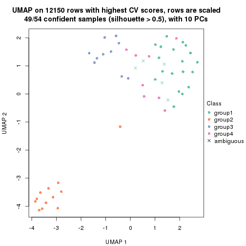</p>

</div>
<div id='tab-CV-NMF-dimension-reduction-4'>
<pre><code class="r">dimension_reduction(res, k = 5, method = &quot;UMAP&quot;)
</code></pre>

<p></p>

</div>
<div id='tab-CV-NMF-dimension-reduction-5'>
<pre><code class="r">dimension_reduction(res, k = 6, method = &quot;UMAP&quot;)
</code></pre>

<p></p>

</div>
</div>


Following heatmap shows how subgroups are split when increasing `k`:

```r
collect_classes(res)
```


Test correlation between subgroups and known annotations. If the known
annotation is numeric, one-way ANOVA test is applied, and if the known
annotation is discrete, chi-squared contingency table test is applied.

```r
test_to_known_factors(res)
```

```
#>         n tissue(p) k
#> CV:NMF 53     0.397 2
#> CV:NMF 54     0.374 3
#> CV:NMF 49     0.348 4
#> CV:NMF 51     0.443 5
#> CV:NMF 43     0.444 6
```


If matrix rows can be associated to genes, consider to use `functional_enrichment(res,
...)` to perform function enrichment for the signature genes. See [this vignette](http://bioconductor.org/packages/devel/bioc/vignettes/cola/inst/doc/functional_enrichment.html) for more detailed explanations.


 

---------------------------------------------------


### MAD:hclust*


The object with results only for a single top-value method and a single partition method 
can be extracted as:

```r
res = res_list["MAD", "hclust"]
# you can also extract it by
# res = res_list["MAD:hclust"]
```

A summary of `res` and all the functions that can be applied to it:

```r
res
```

```
#> A 'ConsensusPartition' object with k = 2, 3, 4, 5, 6.
#>   On a matrix with 12150 rows and 54 columns.
#>   Top rows (1000, 2000, 3000, 4000, 5000) are extracted by 'MAD' method.
#>   Subgroups are detected by 'hclust' method.
#>   Performed in total 1250 partitions by row resampling.
#>   Best k for subgroups seems to be 3.
#> 
#> Following methods can be applied to this 'ConsensusPartition' object:
#>  [1] "cola_report"             "collect_classes"         "collect_plots"          
#>  [4] "collect_stats"           "colnames"                "compare_signatures"     
#>  [7] "consensus_heatmap"       "dimension_reduction"     "functional_enrichment"  
#> [10] "get_anno_col"            "get_anno"                "get_classes"            
#> [13] "get_consensus"           "get_matrix"              "get_membership"         
#> [16] "get_param"               "get_signatures"          "get_stats"              
#> [19] "is_best_k"               "is_stable_k"             "membership_heatmap"     
#> [22] "ncol"                    "nrow"                    "plot_ecdf"              
#> [25] "rownames"                "select_partition_number" "show"                   
#> [28] "suggest_best_k"          "test_to_known_factors"
```

`collect_plots()` function collects all the plots made from `res` for all `k` (number of partitions)
into one single page to provide an easy and fast comparison between different `k`.

```r
collect_plots(res)
```


The plots are:

- The first row: a plot of the ECDF (empirical cumulative distribution
  function) curves of the consensus matrix for each `k` and the heatmap of
  predicted classes for each `k`.
- The second row: heatmaps of the consensus matrix for each `k`.
- The third row: heatmaps of the membership matrix for each `k`.
- The fouth row: heatmaps of the signatures for each `k`.

All the plots in panels can be made by individual functions and they are
plotted later in this section.

`select_partition_number()` produces several plots showing different
statistics for choosing "optimized" `k`. There are following statistics:

- ECDF curves of the consensus matrix for each `k`;
- 1-PAC. [The PAC
  score](https://en.wikipedia.org/wiki/Consensus_clustering#Over-interpretation_potential_of_consensus_clustering)
  measures the proportion of the ambiguous subgrouping.
- Mean silhouette score.
- Concordance. The mean probability of fiting the consensus class ids in all
  partitions.
- Area increased. Denote $A_k$ as the area under the ECDF curve for current
  `k`, the area increased is defined as $A_k - A_{k-1}$.
- Rand index. The percent of pairs of samples that are both in a same cluster
  or both are not in a same cluster in the partition of k and k-1.
- Jaccard index. The ratio of pairs of samples are both in a same cluster in
  the partition of k and k-1 and the pairs of samples are both in a same
  cluster in the partition k or k-1.

The detailed explanations of these statistics can be found in [the _cola_
vignette](http://bioconductor.org/packages/devel/bioc/vignettes/cola/inst/doc/cola.html#toc_13).

Generally speaking, lower PAC score, higher mean silhouette score or higher
concordance corresponds to better partition. Rand index and Jaccard index
measure how similar the current partition is compared to partition with `k-1`.
If they are too similar, we won't accept `k` is better than `k-1`.

```r
select_partition_number(res)
```


The numeric values for all these statistics can be obtained by `get_stats()`.

```r
get_stats(res)
```

```
#>   k 1-PAC mean_silhouette concordance area_increased  Rand Jaccard
#> 2 2 1.000           0.926       0.953         0.2914 0.743   0.743
#> 3 3 0.940           0.941       0.974         0.9326 0.715   0.616
#> 4 4 0.823           0.855       0.938         0.2122 0.868   0.711
#> 5 5 0.786           0.714       0.820         0.0723 0.870   0.607
#> 6 6 0.839           0.840       0.908         0.0559 0.958   0.817
```

`suggest_best_k()` suggests the best $k$ based on these statistics. The rules are as follows:

- All $k$ with Jaccard index larger than 0.95 are removed because increasing
  $k$ does not provide enough extra information. If all $k$ are removed, it is
  marked as no subgroup is detected.
- For all $k$ with 1-PAC score larger than 0.9, the maximal $k$ is taken as
  the best $k$, and other $k$ are marked as optional $k$.
- If it does not fit the second rule. The $k$ with the maximal vote of the
  highest 1-PAC score, highest mean silhouette, and highest concordance is
  taken as the best $k$.

```r
suggest_best_k(res)
```

```
#> [1] 3
#> attr(,"optional")
#> [1] 2
```

There is also optional best $k$ = 2 that is worth to check.

Following shows the table of the partitions (You need to click the **show/hide
code output** link to see it). The membership matrix (columns with name `p*`)
is inferred by
[`clue::cl_consensus()`](https://www.rdocumentation.org/link/cl_consensus?package=clue)
function with the `SE` method. Basically the value in the membership matrix
represents the probability to belong to a certain group. The finall class
label for an item is determined with the group with highest probability it
belongs to.

In `get_classes()` function, the entropy is calculated from the membership
matrix and the silhouette score is calculated from the consensus matrix.


<script>
$( function() {
	$( '#tabs-MAD-hclust-get-classes' ).tabs();
} );
</script>
<div id='tabs-MAD-hclust-get-classes'>
<ul>
<li><a href='#tab-MAD-hclust-get-classes-1'>k = 2</a></li>
<li><a href='#tab-MAD-hclust-get-classes-2'>k = 3</a></li>
<li><a href='#tab-MAD-hclust-get-classes-3'>k = 4</a></li>
<li><a href='#tab-MAD-hclust-get-classes-4'>k = 5</a></li>
<li><a href='#tab-MAD-hclust-get-classes-5'>k = 6</a></li>
</ul>

<div id='tab-MAD-hclust-get-classes-1'>
<p><a id='tab-MAD-hclust-get-classes-1-a' style='color:#0366d6' href='#'>show/hide code output</a></p>
<pre><code class="r">cbind(get_classes(res, k = 2), get_membership(res, k = 2))
</code></pre>

<pre><code>#&gt;          class entropy silhouette    p1    p2
#&gt; GSM28815     1   0.358      0.935 0.932 0.068
#&gt; GSM28816     1   0.358      0.935 0.932 0.068
#&gt; GSM28817     1   0.000      0.951 1.000 0.000
#&gt; GSM11327     1   0.980      0.207 0.584 0.416
#&gt; GSM28825     1   0.358      0.935 0.932 0.068
#&gt; GSM11322     1   0.358      0.935 0.932 0.068
#&gt; GSM28828     1   0.358      0.935 0.932 0.068
#&gt; GSM11346     1   0.358      0.935 0.932 0.068
#&gt; GSM28808     1   0.358      0.935 0.932 0.068
#&gt; GSM11332     1   0.358      0.935 0.932 0.068
#&gt; GSM28811     1   0.358      0.935 0.932 0.068
#&gt; GSM11334     1   0.358      0.935 0.932 0.068
#&gt; GSM11340     1   0.358      0.935 0.932 0.068
#&gt; GSM28812     1   0.358      0.935 0.932 0.068
#&gt; GSM11345     1   0.000      0.951 1.000 0.000
#&gt; GSM28819     1   0.000      0.951 1.000 0.000
#&gt; GSM11321     2   0.358      1.000 0.068 0.932
#&gt; GSM28820     1   0.000      0.951 1.000 0.000
#&gt; GSM11339     1   0.000      0.951 1.000 0.000
#&gt; GSM28804     1   0.358      0.935 0.932 0.068
#&gt; GSM28823     1   0.000      0.951 1.000 0.000
#&gt; GSM11336     1   0.000      0.951 1.000 0.000
#&gt; GSM11342     1   0.000      0.951 1.000 0.000
#&gt; GSM11333     1   0.358      0.935 0.932 0.068
#&gt; GSM28802     1   0.000      0.951 1.000 0.000
#&gt; GSM28803     2   0.358      1.000 0.068 0.932
#&gt; GSM11343     2   0.358      1.000 0.068 0.932
#&gt; GSM11347     2   0.358      1.000 0.068 0.932
#&gt; GSM28824     1   0.000      0.951 1.000 0.000
#&gt; GSM28813     1   0.000      0.951 1.000 0.000
#&gt; GSM28827     1   0.000      0.951 1.000 0.000
#&gt; GSM11337     1   0.000      0.951 1.000 0.000
#&gt; GSM28814     2   0.358      1.000 0.068 0.932
#&gt; GSM11331     1   0.000      0.951 1.000 0.000
#&gt; GSM11344     2   0.358      1.000 0.068 0.932
#&gt; GSM11330     2   0.358      1.000 0.068 0.932
#&gt; GSM11325     2   0.358      1.000 0.068 0.932
#&gt; GSM11338     1   0.000      0.951 1.000 0.000
#&gt; GSM28806     1   0.000      0.951 1.000 0.000
#&gt; GSM28826     1   0.000      0.951 1.000 0.000
#&gt; GSM28818     1   0.000      0.951 1.000 0.000
#&gt; GSM28821     1   0.358      0.935 0.932 0.068
#&gt; GSM28807     1   0.000      0.951 1.000 0.000
#&gt; GSM28822     1   0.358      0.935 0.932 0.068
#&gt; GSM11328     1   0.358      0.935 0.932 0.068
#&gt; GSM11323     1   0.000      0.951 1.000 0.000
#&gt; GSM11324     1   0.000      0.951 1.000 0.000
#&gt; GSM11341     1   0.118      0.941 0.984 0.016
#&gt; GSM11326     1   0.980      0.207 0.584 0.416
#&gt; GSM28810     1   0.000      0.951 1.000 0.000
#&gt; GSM11335     1   0.000      0.951 1.000 0.000
#&gt; GSM28809     1   0.000      0.951 1.000 0.000
#&gt; GSM11329     1   0.000      0.951 1.000 0.000
#&gt; GSM28805     1   0.000      0.951 1.000 0.000
</code></pre>

<script>
$('#tab-MAD-hclust-get-classes-1-a').parent().next().next().hide();
$('#tab-MAD-hclust-get-classes-1-a').click(function(){
  $('#tab-MAD-hclust-get-classes-1-a').parent().next().next().toggle();
  return(false);
});
</script>
</div>

<div id='tab-MAD-hclust-get-classes-2'>
<p><a id='tab-MAD-hclust-get-classes-2-a' style='color:#0366d6' href='#'>show/hide code output</a></p>
<pre><code class="r">cbind(get_classes(res, k = 3), get_membership(res, k = 3))
</code></pre>

<pre><code>#&gt;          class entropy silhouette    p1    p2    p3
#&gt; GSM28815     1  0.2261      0.909 0.932 0.068 0.000
#&gt; GSM28816     1  0.2261      0.909 0.932 0.068 0.000
#&gt; GSM28817     1  0.0000      0.957 1.000 0.000 0.000
#&gt; GSM11327     1  0.6180      0.319 0.584 0.000 0.416
#&gt; GSM28825     2  0.0000      1.000 0.000 1.000 0.000
#&gt; GSM11322     2  0.0000      1.000 0.000 1.000 0.000
#&gt; GSM28828     2  0.0000      1.000 0.000 1.000 0.000
#&gt; GSM11346     2  0.0000      1.000 0.000 1.000 0.000
#&gt; GSM28808     2  0.0000      1.000 0.000 1.000 0.000
#&gt; GSM11332     2  0.0000      1.000 0.000 1.000 0.000
#&gt; GSM28811     2  0.0000      1.000 0.000 1.000 0.000
#&gt; GSM11334     2  0.0000      1.000 0.000 1.000 0.000
#&gt; GSM11340     2  0.0000      1.000 0.000 1.000 0.000
#&gt; GSM28812     2  0.0000      1.000 0.000 1.000 0.000
#&gt; GSM11345     1  0.0000      0.957 1.000 0.000 0.000
#&gt; GSM28819     1  0.0000      0.957 1.000 0.000 0.000
#&gt; GSM11321     3  0.0000      1.000 0.000 0.000 1.000
#&gt; GSM28820     1  0.0000      0.957 1.000 0.000 0.000
#&gt; GSM11339     1  0.0000      0.957 1.000 0.000 0.000
#&gt; GSM28804     1  0.3551      0.852 0.868 0.132 0.000
#&gt; GSM28823     1  0.0000      0.957 1.000 0.000 0.000
#&gt; GSM11336     1  0.0000      0.957 1.000 0.000 0.000
#&gt; GSM11342     1  0.0000      0.957 1.000 0.000 0.000
#&gt; GSM11333     1  0.2261      0.909 0.932 0.068 0.000
#&gt; GSM28802     1  0.0000      0.957 1.000 0.000 0.000
#&gt; GSM28803     3  0.0000      1.000 0.000 0.000 1.000
#&gt; GSM11343     3  0.0000      1.000 0.000 0.000 1.000
#&gt; GSM11347     3  0.0000      1.000 0.000 0.000 1.000
#&gt; GSM28824     1  0.0000      0.957 1.000 0.000 0.000
#&gt; GSM28813     1  0.0000      0.957 1.000 0.000 0.000
#&gt; GSM28827     1  0.0000      0.957 1.000 0.000 0.000
#&gt; GSM11337     1  0.0000      0.957 1.000 0.000 0.000
#&gt; GSM28814     3  0.0000      1.000 0.000 0.000 1.000
#&gt; GSM11331     1  0.0000      0.957 1.000 0.000 0.000
#&gt; GSM11344     3  0.0000      1.000 0.000 0.000 1.000
#&gt; GSM11330     3  0.0000      1.000 0.000 0.000 1.000
#&gt; GSM11325     3  0.0000      1.000 0.000 0.000 1.000
#&gt; GSM11338     1  0.0000      0.957 1.000 0.000 0.000
#&gt; GSM28806     1  0.0000      0.957 1.000 0.000 0.000
#&gt; GSM28826     1  0.0000      0.957 1.000 0.000 0.000
#&gt; GSM28818     1  0.0000      0.957 1.000 0.000 0.000
#&gt; GSM28821     2  0.0000      1.000 0.000 1.000 0.000
#&gt; GSM28807     1  0.0237      0.954 0.996 0.004 0.000
#&gt; GSM28822     1  0.3551      0.852 0.868 0.132 0.000
#&gt; GSM11328     2  0.0000      1.000 0.000 1.000 0.000
#&gt; GSM11323     1  0.0000      0.957 1.000 0.000 0.000
#&gt; GSM11324     1  0.0000      0.957 1.000 0.000 0.000
#&gt; GSM11341     1  0.2902      0.900 0.920 0.064 0.016
#&gt; GSM11326     1  0.6180      0.319 0.584 0.000 0.416
#&gt; GSM28810     1  0.0000      0.957 1.000 0.000 0.000
#&gt; GSM11335     1  0.0000      0.957 1.000 0.000 0.000
#&gt; GSM28809     1  0.0000      0.957 1.000 0.000 0.000
#&gt; GSM11329     1  0.0000      0.957 1.000 0.000 0.000
#&gt; GSM28805     1  0.0000      0.957 1.000 0.000 0.000
</code></pre>

<script>
$('#tab-MAD-hclust-get-classes-2-a').parent().next().next().hide();
$('#tab-MAD-hclust-get-classes-2-a').click(function(){
  $('#tab-MAD-hclust-get-classes-2-a').parent().next().next().toggle();
  return(false);
});
</script>
</div>

<div id='tab-MAD-hclust-get-classes-3'>
<p><a id='tab-MAD-hclust-get-classes-3-a' style='color:#0366d6' href='#'>show/hide code output</a></p>
<pre><code class="r">cbind(get_classes(res, k = 4), get_membership(res, k = 4))
</code></pre>

<pre><code>#&gt;          class entropy silhouette    p1 p2    p3    p4
#&gt; GSM28815     1  0.2814      0.795 0.868  0 0.000 0.132
#&gt; GSM28816     1  0.2814      0.795 0.868  0 0.000 0.132
#&gt; GSM28817     1  0.0469      0.894 0.988  0 0.000 0.012
#&gt; GSM11327     1  0.4898      0.300 0.584  0 0.416 0.000
#&gt; GSM28825     2  0.0000      1.000 0.000  1 0.000 0.000
#&gt; GSM11322     2  0.0000      1.000 0.000  1 0.000 0.000
#&gt; GSM28828     2  0.0000      1.000 0.000  1 0.000 0.000
#&gt; GSM11346     2  0.0000      1.000 0.000  1 0.000 0.000
#&gt; GSM28808     2  0.0000      1.000 0.000  1 0.000 0.000
#&gt; GSM11332     2  0.0000      1.000 0.000  1 0.000 0.000
#&gt; GSM28811     2  0.0000      1.000 0.000  1 0.000 0.000
#&gt; GSM11334     2  0.0000      1.000 0.000  1 0.000 0.000
#&gt; GSM11340     2  0.0000      1.000 0.000  1 0.000 0.000
#&gt; GSM28812     2  0.0000      1.000 0.000  1 0.000 0.000
#&gt; GSM11345     1  0.0336      0.895 0.992  0 0.000 0.008
#&gt; GSM28819     1  0.0336      0.895 0.992  0 0.000 0.008
#&gt; GSM11321     3  0.0000      1.000 0.000  0 1.000 0.000
#&gt; GSM28820     1  0.0336      0.895 0.992  0 0.000 0.008
#&gt; GSM11339     1  0.2921      0.756 0.860  0 0.000 0.140
#&gt; GSM28804     4  0.0336      0.733 0.008  0 0.000 0.992
#&gt; GSM28823     1  0.0336      0.895 0.992  0 0.000 0.008
#&gt; GSM11336     1  0.0336      0.892 0.992  0 0.000 0.008
#&gt; GSM11342     1  0.0336      0.895 0.992  0 0.000 0.008
#&gt; GSM11333     1  0.2814      0.795 0.868  0 0.000 0.132
#&gt; GSM28802     1  0.0188      0.895 0.996  0 0.000 0.004
#&gt; GSM28803     3  0.0000      1.000 0.000  0 1.000 0.000
#&gt; GSM11343     3  0.0000      1.000 0.000  0 1.000 0.000
#&gt; GSM11347     3  0.0000      1.000 0.000  0 1.000 0.000
#&gt; GSM28824     1  0.0336      0.892 0.992  0 0.000 0.008
#&gt; GSM28813     1  0.0336      0.892 0.992  0 0.000 0.008
#&gt; GSM28827     1  0.0000      0.895 1.000  0 0.000 0.000
#&gt; GSM11337     1  0.0000      0.895 1.000  0 0.000 0.000
#&gt; GSM28814     3  0.0000      1.000 0.000  0 1.000 0.000
#&gt; GSM11331     1  0.0188      0.895 0.996  0 0.000 0.004
#&gt; GSM11344     3  0.0000      1.000 0.000  0 1.000 0.000
#&gt; GSM11330     3  0.0000      1.000 0.000  0 1.000 0.000
#&gt; GSM11325     3  0.0000      1.000 0.000  0 1.000 0.000
#&gt; GSM11338     1  0.0336      0.892 0.992  0 0.000 0.008
#&gt; GSM28806     1  0.3024      0.748 0.852  0 0.000 0.148
#&gt; GSM28826     1  0.0000      0.895 1.000  0 0.000 0.000
#&gt; GSM28818     4  0.4008      0.759 0.244  0 0.000 0.756
#&gt; GSM28821     2  0.0000      1.000 0.000  1 0.000 0.000
#&gt; GSM28807     4  0.2868      0.791 0.136  0 0.000 0.864
#&gt; GSM28822     4  0.0336      0.733 0.008  0 0.000 0.992
#&gt; GSM11328     2  0.0000      1.000 0.000  1 0.000 0.000
#&gt; GSM11323     1  0.0188      0.895 0.996  0 0.000 0.004
#&gt; GSM11324     1  0.0336      0.895 0.992  0 0.000 0.008
#&gt; GSM11341     4  0.2522      0.768 0.076  0 0.016 0.908
#&gt; GSM11326     1  0.4898      0.300 0.584  0 0.416 0.000
#&gt; GSM28810     1  0.5000     -0.295 0.500  0 0.000 0.500
#&gt; GSM11335     4  0.4643      0.623 0.344  0 0.000 0.656
#&gt; GSM28809     4  0.4804      0.560 0.384  0 0.000 0.616
#&gt; GSM11329     1  0.0336      0.895 0.992  0 0.000 0.008
#&gt; GSM28805     1  0.0469      0.894 0.988  0 0.000 0.012
</code></pre>

<script>
$('#tab-MAD-hclust-get-classes-3-a').parent().next().next().hide();
$('#tab-MAD-hclust-get-classes-3-a').click(function(){
  $('#tab-MAD-hclust-get-classes-3-a').parent().next().next().toggle();
  return(false);
});
</script>
</div>

<div id='tab-MAD-hclust-get-classes-4'>
<p><a id='tab-MAD-hclust-get-classes-4-a' style='color:#0366d6' href='#'>show/hide code output</a></p>
<pre><code class="r">cbind(get_classes(res, k = 5), get_membership(res, k = 5))
</code></pre>

<pre><code>#&gt;          class entropy silhouette    p1 p2    p3    p4    p5
#&gt; GSM28815     5   0.000     0.5179 0.000  0 0.000 0.000 1.000
#&gt; GSM28816     5   0.000     0.5179 0.000  0 0.000 0.000 1.000
#&gt; GSM28817     1   0.443     0.7479 0.540  0 0.000 0.004 0.456
#&gt; GSM11327     1   0.557     0.0368 0.512  0 0.416 0.000 0.072
#&gt; GSM28825     2   0.000     1.0000 0.000  1 0.000 0.000 0.000
#&gt; GSM11322     2   0.000     1.0000 0.000  1 0.000 0.000 0.000
#&gt; GSM28828     2   0.000     1.0000 0.000  1 0.000 0.000 0.000
#&gt; GSM11346     2   0.000     1.0000 0.000  1 0.000 0.000 0.000
#&gt; GSM28808     2   0.000     1.0000 0.000  1 0.000 0.000 0.000
#&gt; GSM11332     2   0.000     1.0000 0.000  1 0.000 0.000 0.000
#&gt; GSM28811     2   0.000     1.0000 0.000  1 0.000 0.000 0.000
#&gt; GSM11334     2   0.000     1.0000 0.000  1 0.000 0.000 0.000
#&gt; GSM11340     2   0.000     1.0000 0.000  1 0.000 0.000 0.000
#&gt; GSM28812     2   0.000     1.0000 0.000  1 0.000 0.000 0.000
#&gt; GSM11345     1   0.426     0.7756 0.560  0 0.000 0.000 0.440
#&gt; GSM28819     1   0.426     0.7756 0.560  0 0.000 0.000 0.440
#&gt; GSM11321     3   0.000     1.0000 0.000  0 1.000 0.000 0.000
#&gt; GSM28820     1   0.426     0.7756 0.560  0 0.000 0.000 0.440
#&gt; GSM11339     5   0.618    -0.3418 0.408  0 0.000 0.136 0.456
#&gt; GSM28804     4   0.601     0.5483 0.356  0 0.000 0.520 0.124
#&gt; GSM28823     1   0.426     0.7756 0.560  0 0.000 0.000 0.440
#&gt; GSM11336     5   0.377     0.4465 0.296  0 0.000 0.000 0.704
#&gt; GSM11342     1   0.426     0.7756 0.560  0 0.000 0.000 0.440
#&gt; GSM11333     5   0.000     0.5179 0.000  0 0.000 0.000 1.000
#&gt; GSM28802     1   0.430     0.7076 0.520  0 0.000 0.000 0.480
#&gt; GSM28803     3   0.000     1.0000 0.000  0 1.000 0.000 0.000
#&gt; GSM11343     3   0.000     1.0000 0.000  0 1.000 0.000 0.000
#&gt; GSM11347     3   0.000     1.0000 0.000  0 1.000 0.000 0.000
#&gt; GSM28824     5   0.377     0.4465 0.296  0 0.000 0.000 0.704
#&gt; GSM28813     5   0.377     0.4465 0.296  0 0.000 0.000 0.704
#&gt; GSM28827     1   0.426     0.7605 0.564  0 0.000 0.000 0.436
#&gt; GSM11337     1   0.426     0.7605 0.564  0 0.000 0.000 0.436
#&gt; GSM28814     3   0.000     1.0000 0.000  0 1.000 0.000 0.000
#&gt; GSM11331     1   0.418     0.7246 0.600  0 0.000 0.000 0.400
#&gt; GSM11344     3   0.000     1.0000 0.000  0 1.000 0.000 0.000
#&gt; GSM11330     3   0.000     1.0000 0.000  0 1.000 0.000 0.000
#&gt; GSM11325     3   0.000     1.0000 0.000  0 1.000 0.000 0.000
#&gt; GSM11338     5   0.377     0.4465 0.296  0 0.000 0.000 0.704
#&gt; GSM28806     5   0.621    -0.3326 0.404  0 0.000 0.140 0.456
#&gt; GSM28826     1   0.426     0.7605 0.564  0 0.000 0.000 0.436
#&gt; GSM28818     4   0.370     0.6811 0.100  0 0.000 0.820 0.080
#&gt; GSM28821     2   0.000     1.0000 0.000  1 0.000 0.000 0.000
#&gt; GSM28807     4   0.170     0.6932 0.068  0 0.000 0.928 0.004
#&gt; GSM28822     4   0.601     0.5483 0.356  0 0.000 0.520 0.124
#&gt; GSM11328     2   0.000     1.0000 0.000  1 0.000 0.000 0.000
#&gt; GSM11323     1   0.418     0.7246 0.600  0 0.000 0.000 0.400
#&gt; GSM11324     1   0.426     0.7756 0.560  0 0.000 0.000 0.440
#&gt; GSM11341     4   0.184     0.6510 0.056  0 0.016 0.928 0.000
#&gt; GSM11326     1   0.557     0.0368 0.512  0 0.416 0.000 0.072
#&gt; GSM28810     4   0.577     0.2276 0.108  0 0.000 0.564 0.328
#&gt; GSM11335     4   0.483     0.5851 0.104  0 0.000 0.720 0.176
#&gt; GSM28809     4   0.489     0.5437 0.256  0 0.000 0.680 0.064
#&gt; GSM11329     1   0.426     0.7756 0.560  0 0.000 0.000 0.440
#&gt; GSM28805     1   0.443     0.7479 0.540  0 0.000 0.004 0.456
</code></pre>

<script>
$('#tab-MAD-hclust-get-classes-4-a').parent().next().next().hide();
$('#tab-MAD-hclust-get-classes-4-a').click(function(){
  $('#tab-MAD-hclust-get-classes-4-a').parent().next().next().toggle();
  return(false);
});
</script>
</div>

<div id='tab-MAD-hclust-get-classes-5'>
<p><a id='tab-MAD-hclust-get-classes-5-a' style='color:#0366d6' href='#'>show/hide code output</a></p>
<pre><code class="r">cbind(get_classes(res, k = 6), get_membership(res, k = 6))
</code></pre>

<pre><code>#&gt;          class entropy silhouette    p1 p2    p3    p4    p5    p6
#&gt; GSM28815     5  0.2941      0.669 0.064  0 0.000 0.004 0.856 0.076
#&gt; GSM28816     5  0.2941      0.669 0.064  0 0.000 0.004 0.856 0.076
#&gt; GSM28817     1  0.0665      0.881 0.980  0 0.000 0.008 0.008 0.004
#&gt; GSM11327     1  0.4804      0.255 0.540  0 0.416 0.000 0.032 0.012
#&gt; GSM28825     2  0.0000      1.000 0.000  1 0.000 0.000 0.000 0.000
#&gt; GSM11322     2  0.0000      1.000 0.000  1 0.000 0.000 0.000 0.000
#&gt; GSM28828     2  0.0000      1.000 0.000  1 0.000 0.000 0.000 0.000
#&gt; GSM11346     2  0.0000      1.000 0.000  1 0.000 0.000 0.000 0.000
#&gt; GSM28808     2  0.0000      1.000 0.000  1 0.000 0.000 0.000 0.000
#&gt; GSM11332     2  0.0000      1.000 0.000  1 0.000 0.000 0.000 0.000
#&gt; GSM28811     2  0.0000      1.000 0.000  1 0.000 0.000 0.000 0.000
#&gt; GSM11334     2  0.0000      1.000 0.000  1 0.000 0.000 0.000 0.000
#&gt; GSM11340     2  0.0000      1.000 0.000  1 0.000 0.000 0.000 0.000
#&gt; GSM28812     2  0.0000      1.000 0.000  1 0.000 0.000 0.000 0.000
#&gt; GSM11345     1  0.0000      0.888 1.000  0 0.000 0.000 0.000 0.000
#&gt; GSM28819     1  0.0000      0.888 1.000  0 0.000 0.000 0.000 0.000
#&gt; GSM11321     3  0.0363      0.993 0.000  0 0.988 0.000 0.012 0.000
#&gt; GSM28820     1  0.0000      0.888 1.000  0 0.000 0.000 0.000 0.000
#&gt; GSM11339     1  0.3367      0.713 0.836  0 0.000 0.088 0.020 0.056
#&gt; GSM28804     6  0.1663      1.000 0.000  0 0.000 0.088 0.000 0.912
#&gt; GSM28823     1  0.0000      0.888 1.000  0 0.000 0.000 0.000 0.000
#&gt; GSM11336     5  0.3330      0.779 0.284  0 0.000 0.000 0.716 0.000
#&gt; GSM11342     1  0.0000      0.888 1.000  0 0.000 0.000 0.000 0.000
#&gt; GSM11333     5  0.2941      0.669 0.064  0 0.000 0.004 0.856 0.076
#&gt; GSM28802     1  0.1138      0.870 0.960  0 0.000 0.004 0.024 0.012
#&gt; GSM28803     3  0.0363      0.993 0.000  0 0.988 0.000 0.012 0.000
#&gt; GSM11343     3  0.0000      0.993 0.000  0 1.000 0.000 0.000 0.000
#&gt; GSM11347     3  0.0000      0.993 0.000  0 1.000 0.000 0.000 0.000
#&gt; GSM28824     5  0.3330      0.779 0.284  0 0.000 0.000 0.716 0.000
#&gt; GSM28813     5  0.3330      0.779 0.284  0 0.000 0.000 0.716 0.000
#&gt; GSM28827     1  0.0717      0.883 0.976  0 0.000 0.000 0.016 0.008
#&gt; GSM11337     1  0.0717      0.883 0.976  0 0.000 0.000 0.016 0.008
#&gt; GSM28814     3  0.0363      0.993 0.000  0 0.988 0.000 0.012 0.000
#&gt; GSM11331     1  0.1151      0.864 0.956  0 0.000 0.000 0.032 0.012
#&gt; GSM11344     3  0.0000      0.993 0.000  0 1.000 0.000 0.000 0.000
#&gt; GSM11330     3  0.0000      0.993 0.000  0 1.000 0.000 0.000 0.000
#&gt; GSM11325     3  0.0363      0.993 0.000  0 0.988 0.000 0.012 0.000
#&gt; GSM11338     5  0.3330      0.779 0.284  0 0.000 0.000 0.716 0.000
#&gt; GSM28806     1  0.3262      0.706 0.840  0 0.000 0.080 0.012 0.068
#&gt; GSM28826     1  0.0717      0.883 0.976  0 0.000 0.000 0.016 0.008
#&gt; GSM28818     4  0.4099      0.626 0.152  0 0.000 0.764 0.012 0.072
#&gt; GSM28821     2  0.0000      1.000 0.000  1 0.000 0.000 0.000 0.000
#&gt; GSM28807     4  0.3717      0.507 0.064  0 0.000 0.776 0.000 0.160
#&gt; GSM28822     6  0.1663      1.000 0.000  0 0.000 0.088 0.000 0.912
#&gt; GSM11328     2  0.0000      1.000 0.000  1 0.000 0.000 0.000 0.000
#&gt; GSM11323     1  0.1151      0.864 0.956  0 0.000 0.000 0.032 0.012
#&gt; GSM11324     1  0.0000      0.888 1.000  0 0.000 0.000 0.000 0.000
#&gt; GSM11341     4  0.1555      0.330 0.000  0 0.012 0.940 0.008 0.040
#&gt; GSM11326     1  0.4804      0.255 0.540  0 0.416 0.000 0.032 0.012
#&gt; GSM28810     4  0.5147      0.462 0.436  0 0.000 0.480 0.000 0.084
#&gt; GSM11335     4  0.4757      0.610 0.280  0 0.000 0.636 0.000 0.084
#&gt; GSM28809     4  0.3684      0.587 0.300  0 0.000 0.692 0.004 0.004
#&gt; GSM11329     1  0.0000      0.888 1.000  0 0.000 0.000 0.000 0.000
#&gt; GSM28805     1  0.0665      0.881 0.980  0 0.000 0.008 0.008 0.004
</code></pre>

<script>
$('#tab-MAD-hclust-get-classes-5-a').parent().next().next().hide();
$('#tab-MAD-hclust-get-classes-5-a').click(function(){
  $('#tab-MAD-hclust-get-classes-5-a').parent().next().next().toggle();
  return(false);
});
</script>
</div>
</div>

Heatmaps for the consensus matrix. It visualizes the probability of two
samples to be in a same group.


<script>
$( function() {
	$( '#tabs-MAD-hclust-consensus-heatmap' ).tabs();
} );
</script>
<div id='tabs-MAD-hclust-consensus-heatmap'>
<ul>
<li><a href='#tab-MAD-hclust-consensus-heatmap-1'>k = 2</a></li>
<li><a href='#tab-MAD-hclust-consensus-heatmap-2'>k = 3</a></li>
<li><a href='#tab-MAD-hclust-consensus-heatmap-3'>k = 4</a></li>
<li><a href='#tab-MAD-hclust-consensus-heatmap-4'>k = 5</a></li>
<li><a href='#tab-MAD-hclust-consensus-heatmap-5'>k = 6</a></li>
</ul>
<div id='tab-MAD-hclust-consensus-heatmap-1'>
<pre><code class="r">consensus_heatmap(res, k = 2)
</code></pre>

<p></p>

</div>
<div id='tab-MAD-hclust-consensus-heatmap-2'>
<pre><code class="r">consensus_heatmap(res, k = 3)
</code></pre>

<p></p>

</div>
<div id='tab-MAD-hclust-consensus-heatmap-3'>
<pre><code class="r">consensus_heatmap(res, k = 4)
</code></pre>

<p></p>

</div>
<div id='tab-MAD-hclust-consensus-heatmap-4'>
<pre><code class="r">consensus_heatmap(res, k = 5)
</code></pre>

<p></p>

</div>
<div id='tab-MAD-hclust-consensus-heatmap-5'>
<pre><code class="r">consensus_heatmap(res, k = 6)
</code></pre>

<p></p>

</div>
</div>

Heatmaps for the membership of samples in all partitions to see how consistent they are:


<script>
$( function() {
	$( '#tabs-MAD-hclust-membership-heatmap' ).tabs();
} );
</script>
<div id='tabs-MAD-hclust-membership-heatmap'>
<ul>
<li><a href='#tab-MAD-hclust-membership-heatmap-1'>k = 2</a></li>
<li><a href='#tab-MAD-hclust-membership-heatmap-2'>k = 3</a></li>
<li><a href='#tab-MAD-hclust-membership-heatmap-3'>k = 4</a></li>
<li><a href='#tab-MAD-hclust-membership-heatmap-4'>k = 5</a></li>
<li><a href='#tab-MAD-hclust-membership-heatmap-5'>k = 6</a></li>
</ul>
<div id='tab-MAD-hclust-membership-heatmap-1'>
<pre><code class="r">membership_heatmap(res, k = 2)
</code></pre>

<p></p>

</div>
<div id='tab-MAD-hclust-membership-heatmap-2'>
<pre><code class="r">membership_heatmap(res, k = 3)
</code></pre>

<p></p>

</div>
<div id='tab-MAD-hclust-membership-heatmap-3'>
<pre><code class="r">membership_heatmap(res, k = 4)
</code></pre>

<p></p>

</div>
<div id='tab-MAD-hclust-membership-heatmap-4'>
<pre><code class="r">membership_heatmap(res, k = 5)
</code></pre>

<p></p>

</div>
<div id='tab-MAD-hclust-membership-heatmap-5'>
<pre><code class="r">membership_heatmap(res, k = 6)
</code></pre>

<p></p>

</div>
</div>

As soon as we have had the classes for columns, we can look for signatures
which are significantly different between classes which can be candidate marks
for certain classes. Following are the heatmaps for signatures.


Signature heatmaps where rows are scaled:


<script>
$( function() {
	$( '#tabs-MAD-hclust-get-signatures' ).tabs();
} );
</script>
<div id='tabs-MAD-hclust-get-signatures'>
<ul>
<li><a href='#tab-MAD-hclust-get-signatures-1'>k = 2</a></li>
<li><a href='#tab-MAD-hclust-get-signatures-2'>k = 3</a></li>
<li><a href='#tab-MAD-hclust-get-signatures-3'>k = 4</a></li>
<li><a href='#tab-MAD-hclust-get-signatures-4'>k = 5</a></li>
<li><a href='#tab-MAD-hclust-get-signatures-5'>k = 6</a></li>
</ul>
<div id='tab-MAD-hclust-get-signatures-1'>
<pre><code class="r">get_signatures(res, k = 2)
</code></pre>

<p></p>

</div>
<div id='tab-MAD-hclust-get-signatures-2'>
<pre><code class="r">get_signatures(res, k = 3)
</code></pre>

<p></p>

</div>
<div id='tab-MAD-hclust-get-signatures-3'>
<pre><code class="r">get_signatures(res, k = 4)
</code></pre>

<p></p>

</div>
<div id='tab-MAD-hclust-get-signatures-4'>
<pre><code class="r">get_signatures(res, k = 5)
</code></pre>

<p></p>

</div>
<div id='tab-MAD-hclust-get-signatures-5'>
<pre><code class="r">get_signatures(res, k = 6)
</code></pre>

<p></p>

</div>
</div>


Signature heatmaps where rows are not scaled:


<script>
$( function() {
	$( '#tabs-MAD-hclust-get-signatures-no-scale' ).tabs();
} );
</script>
<div id='tabs-MAD-hclust-get-signatures-no-scale'>
<ul>
<li><a href='#tab-MAD-hclust-get-signatures-no-scale-1'>k = 2</a></li>
<li><a href='#tab-MAD-hclust-get-signatures-no-scale-2'>k = 3</a></li>
<li><a href='#tab-MAD-hclust-get-signatures-no-scale-3'>k = 4</a></li>
<li><a href='#tab-MAD-hclust-get-signatures-no-scale-4'>k = 5</a></li>
<li><a href='#tab-MAD-hclust-get-signatures-no-scale-5'>k = 6</a></li>
</ul>
<div id='tab-MAD-hclust-get-signatures-no-scale-1'>
<pre><code class="r">get_signatures(res, k = 2, scale_rows = FALSE)
</code></pre>

<p></p>

</div>
<div id='tab-MAD-hclust-get-signatures-no-scale-2'>
<pre><code class="r">get_signatures(res, k = 3, scale_rows = FALSE)
</code></pre>

<p></p>

</div>
<div id='tab-MAD-hclust-get-signatures-no-scale-3'>
<pre><code class="r">get_signatures(res, k = 4, scale_rows = FALSE)
</code></pre>

<p></p>

</div>
<div id='tab-MAD-hclust-get-signatures-no-scale-4'>
<pre><code class="r">get_signatures(res, k = 5, scale_rows = FALSE)
</code></pre>

<p></p>

</div>
<div id='tab-MAD-hclust-get-signatures-no-scale-5'>
<pre><code class="r">get_signatures(res, k = 6, scale_rows = FALSE)
</code></pre>

<p></p>

</div>
</div>


Compare the overlap of signatures from different k:

```r
compare_signatures(res)
```


`get_signature()` returns a data frame invisibly. TO get the list of signatures, the function
call should be assigned to a variable explicitly. In following code, if `plot` argument is set
to `FALSE`, no heatmap is plotted while only the differential analysis is performed.

```r
# code only for demonstration
tb = get_signature(res, k = ..., plot = FALSE)
```

An example of the output of `tb` is:

```
#>   which_row         fdr    mean_1    mean_2 scaled_mean_1 scaled_mean_2 km
#> 1        38 0.042760348  8.373488  9.131774    -0.5533452     0.5164555  1
#> 2        40 0.018707592  7.106213  8.469186    -0.6173731     0.5762149  1
#> 3        55 0.019134737 10.221463 11.207825    -0.6159697     0.5749050  1
#> 4        59 0.006059896  5.921854  7.869574    -0.6899429     0.6439467  1
#> 5        60 0.018055526  8.928898 10.211722    -0.6204761     0.5791110  1
#> 6        98 0.009384629 15.714769 14.887706     0.6635654    -0.6193277  2
...
```

The columns in `tb` are:

1. `which_row`: row indices corresponding to the input matrix.
2. `fdr`: FDR for the differential test. 
3. `mean_x`: The mean value in group x.
4. `scaled_mean_x`: The mean value in group x after rows are scaled.
5. `km`: Row groups if k-means clustering is applied to rows.


UMAP plot which shows how samples are separated.


<script>
$( function() {
	$( '#tabs-MAD-hclust-dimension-reduction' ).tabs();
} );
</script>
<div id='tabs-MAD-hclust-dimension-reduction'>
<ul>
<li><a href='#tab-MAD-hclust-dimension-reduction-1'>k = 2</a></li>
<li><a href='#tab-MAD-hclust-dimension-reduction-2'>k = 3</a></li>
<li><a href='#tab-MAD-hclust-dimension-reduction-3'>k = 4</a></li>
<li><a href='#tab-MAD-hclust-dimension-reduction-4'>k = 5</a></li>
<li><a href='#tab-MAD-hclust-dimension-reduction-5'>k = 6</a></li>
</ul>
<div id='tab-MAD-hclust-dimension-reduction-1'>
<pre><code class="r">dimension_reduction(res, k = 2, method = &quot;UMAP&quot;)
</code></pre>

<p></p>

</div>
<div id='tab-MAD-hclust-dimension-reduction-2'>
<pre><code class="r">dimension_reduction(res, k = 3, method = &quot;UMAP&quot;)
</code></pre>

<p></p>

</div>
<div id='tab-MAD-hclust-dimension-reduction-3'>
<pre><code class="r">dimension_reduction(res, k = 4, method = &quot;UMAP&quot;)
</code></pre>

<p></p>

</div>
<div id='tab-MAD-hclust-dimension-reduction-4'>
<pre><code class="r">dimension_reduction(res, k = 5, method = &quot;UMAP&quot;)
</code></pre>

<p></p>

</div>
<div id='tab-MAD-hclust-dimension-reduction-5'>
<pre><code class="r">dimension_reduction(res, k = 6, method = &quot;UMAP&quot;)
</code></pre>

<p></p>

</div>
</div>


Following heatmap shows how subgroups are split when increasing `k`:

```r
collect_classes(res)
```


Test correlation between subgroups and known annotations. If the known
annotation is numeric, one-way ANOVA test is applied, and if the known
annotation is discrete, chi-squared contingency table test is applied.

```r
test_to_known_factors(res)
```

```
#>             n tissue(p) k
#> MAD:hclust 52     0.396 2
#> MAD:hclust 52     0.372 3
#> MAD:hclust 51     0.350 4
#> MAD:hclust 45     0.402 5
#> MAD:hclust 50     0.399 6
```


If matrix rows can be associated to genes, consider to use `functional_enrichment(res,
...)` to perform function enrichment for the signature genes. See [this vignette](http://bioconductor.org/packages/devel/bioc/vignettes/cola/inst/doc/functional_enrichment.html) for more detailed explanations.


 

---------------------------------------------------


### MAD:kmeans**


The object with results only for a single top-value method and a single partition method 
can be extracted as:

```r
res = res_list["MAD", "kmeans"]
# you can also extract it by
# res = res_list["MAD:kmeans"]
```

A summary of `res` and all the functions that can be applied to it:

```r
res
```

```
#> A 'ConsensusPartition' object with k = 2, 3, 4, 5, 6.
#>   On a matrix with 12150 rows and 54 columns.
#>   Top rows (1000, 2000, 3000, 4000, 5000) are extracted by 'MAD' method.
#>   Subgroups are detected by 'kmeans' method.
#>   Performed in total 1250 partitions by row resampling.
#>   Best k for subgroups seems to be 3.
#> 
#> Following methods can be applied to this 'ConsensusPartition' object:
#>  [1] "cola_report"             "collect_classes"         "collect_plots"          
#>  [4] "collect_stats"           "colnames"                "compare_signatures"     
#>  [7] "consensus_heatmap"       "dimension_reduction"     "functional_enrichment"  
#> [10] "get_anno_col"            "get_anno"                "get_classes"            
#> [13] "get_consensus"           "get_matrix"              "get_membership"         
#> [16] "get_param"               "get_signatures"          "get_stats"              
#> [19] "is_best_k"               "is_stable_k"             "membership_heatmap"     
#> [22] "ncol"                    "nrow"                    "plot_ecdf"              
#> [25] "rownames"                "select_partition_number" "show"                   
#> [28] "suggest_best_k"          "test_to_known_factors"
```

`collect_plots()` function collects all the plots made from `res` for all `k` (number of partitions)
into one single page to provide an easy and fast comparison between different `k`.

```r
collect_plots(res)
```


The plots are:

- The first row: a plot of the ECDF (empirical cumulative distribution
  function) curves of the consensus matrix for each `k` and the heatmap of
  predicted classes for each `k`.
- The second row: heatmaps of the consensus matrix for each `k`.
- The third row: heatmaps of the membership matrix for each `k`.
- The fouth row: heatmaps of the signatures for each `k`.

All the plots in panels can be made by individual functions and they are
plotted later in this section.

`select_partition_number()` produces several plots showing different
statistics for choosing "optimized" `k`. There are following statistics:

- ECDF curves of the consensus matrix for each `k`;
- 1-PAC. [The PAC
  score](https://en.wikipedia.org/wiki/Consensus_clustering#Over-interpretation_potential_of_consensus_clustering)
  measures the proportion of the ambiguous subgrouping.
- Mean silhouette score.
- Concordance. The mean probability of fiting the consensus class ids in all
  partitions.
- Area increased. Denote $A_k$ as the area under the ECDF curve for current
  `k`, the area increased is defined as $A_k - A_{k-1}$.
- Rand index. The percent of pairs of samples that are both in a same cluster
  or both are not in a same cluster in the partition of k and k-1.
- Jaccard index. The ratio of pairs of samples are both in a same cluster in
  the partition of k and k-1 and the pairs of samples are both in a same
  cluster in the partition k or k-1.

The detailed explanations of these statistics can be found in [the _cola_
vignette](http://bioconductor.org/packages/devel/bioc/vignettes/cola/inst/doc/cola.html#toc_13).

Generally speaking, lower PAC score, higher mean silhouette score or higher
concordance corresponds to better partition. Rand index and Jaccard index
measure how similar the current partition is compared to partition with `k-1`.
If they are too similar, we won't accept `k` is better than `k-1`.

```r
select_partition_number(res)
```


The numeric values for all these statistics can be obtained by `get_stats()`.

```r
get_stats(res)
```

```
#>   k 1-PAC mean_silhouette concordance area_increased  Rand Jaccard
#> 2 2 0.508           0.847       0.858         0.3404 0.648   0.648
#> 3 3 1.000           0.971       0.965         0.6848 0.776   0.655
#> 4 4 0.756           0.850       0.881         0.2189 0.866   0.684
#> 5 5 0.718           0.772       0.851         0.0886 0.944   0.807
#> 6 6 0.741           0.728       0.815         0.0469 1.000   1.000
```

`suggest_best_k()` suggests the best $k$ based on these statistics. The rules are as follows:

- All $k$ with Jaccard index larger than 0.95 are removed because increasing
  $k$ does not provide enough extra information. If all $k$ are removed, it is
  marked as no subgroup is detected.
- For all $k$ with 1-PAC score larger than 0.9, the maximal $k$ is taken as
  the best $k$, and other $k$ are marked as optional $k$.
- If it does not fit the second rule. The $k$ with the maximal vote of the
  highest 1-PAC score, highest mean silhouette, and highest concordance is
  taken as the best $k$.

```r
suggest_best_k(res)
```

```
#> [1] 3
```


Following shows the table of the partitions (You need to click the **show/hide
code output** link to see it). The membership matrix (columns with name `p*`)
is inferred by
[`clue::cl_consensus()`](https://www.rdocumentation.org/link/cl_consensus?package=clue)
function with the `SE` method. Basically the value in the membership matrix
represents the probability to belong to a certain group. The finall class
label for an item is determined with the group with highest probability it
belongs to.

In `get_classes()` function, the entropy is calculated from the membership
matrix and the silhouette score is calculated from the consensus matrix.


<script>
$( function() {
	$( '#tabs-MAD-kmeans-get-classes' ).tabs();
} );
</script>
<div id='tabs-MAD-kmeans-get-classes'>
<ul>
<li><a href='#tab-MAD-kmeans-get-classes-1'>k = 2</a></li>
<li><a href='#tab-MAD-kmeans-get-classes-2'>k = 3</a></li>
<li><a href='#tab-MAD-kmeans-get-classes-3'>k = 4</a></li>
<li><a href='#tab-MAD-kmeans-get-classes-4'>k = 5</a></li>
<li><a href='#tab-MAD-kmeans-get-classes-5'>k = 6</a></li>
</ul>

<div id='tab-MAD-kmeans-get-classes-1'>
<p><a id='tab-MAD-kmeans-get-classes-1-a' style='color:#0366d6' href='#'>show/hide code output</a></p>
<pre><code class="r">cbind(get_classes(res, k = 2), get_membership(res, k = 2))
</code></pre>

<pre><code>#&gt;          class entropy silhouette   p1   p2
#&gt; GSM28815     1   0.925      0.870 0.66 0.34
#&gt; GSM28816     1   0.925      0.870 0.66 0.34
#&gt; GSM28817     1   0.925      0.870 0.66 0.34
#&gt; GSM11327     1   0.000      0.602 1.00 0.00
#&gt; GSM28825     2   0.000      1.000 0.00 1.00
#&gt; GSM11322     2   0.000      1.000 0.00 1.00
#&gt; GSM28828     2   0.000      1.000 0.00 1.00
#&gt; GSM11346     2   0.000      1.000 0.00 1.00
#&gt; GSM28808     2   0.000      1.000 0.00 1.00
#&gt; GSM11332     2   0.000      1.000 0.00 1.00
#&gt; GSM28811     2   0.000      1.000 0.00 1.00
#&gt; GSM11334     2   0.000      1.000 0.00 1.00
#&gt; GSM11340     2   0.000      1.000 0.00 1.00
#&gt; GSM28812     2   0.000      1.000 0.00 1.00
#&gt; GSM11345     1   0.925      0.870 0.66 0.34
#&gt; GSM28819     1   0.925      0.870 0.66 0.34
#&gt; GSM11321     1   0.141      0.590 0.98 0.02
#&gt; GSM28820     1   0.925      0.870 0.66 0.34
#&gt; GSM11339     1   0.925      0.870 0.66 0.34
#&gt; GSM28804     1   0.925      0.870 0.66 0.34
#&gt; GSM28823     1   0.925      0.870 0.66 0.34
#&gt; GSM11336     1   0.925      0.870 0.66 0.34
#&gt; GSM11342     1   0.925      0.870 0.66 0.34
#&gt; GSM11333     1   0.925      0.870 0.66 0.34
#&gt; GSM28802     1   0.925      0.870 0.66 0.34
#&gt; GSM28803     1   0.141      0.590 0.98 0.02
#&gt; GSM11343     1   0.141      0.590 0.98 0.02
#&gt; GSM11347     1   0.141      0.590 0.98 0.02
#&gt; GSM28824     1   0.925      0.870 0.66 0.34
#&gt; GSM28813     1   0.925      0.870 0.66 0.34
#&gt; GSM28827     1   0.925      0.870 0.66 0.34
#&gt; GSM11337     1   0.925      0.870 0.66 0.34
#&gt; GSM28814     1   0.141      0.590 0.98 0.02
#&gt; GSM11331     1   0.925      0.870 0.66 0.34
#&gt; GSM11344     1   0.141      0.590 0.98 0.02
#&gt; GSM11330     1   0.141      0.590 0.98 0.02
#&gt; GSM11325     1   0.141      0.590 0.98 0.02
#&gt; GSM11338     1   0.925      0.870 0.66 0.34
#&gt; GSM28806     1   0.925      0.870 0.66 0.34
#&gt; GSM28826     1   0.925      0.870 0.66 0.34
#&gt; GSM28818     1   0.925      0.870 0.66 0.34
#&gt; GSM28821     2   0.000      1.000 0.00 1.00
#&gt; GSM28807     1   0.925      0.870 0.66 0.34
#&gt; GSM28822     1   0.925      0.870 0.66 0.34
#&gt; GSM11328     2   0.000      1.000 0.00 1.00
#&gt; GSM11323     1   0.925      0.870 0.66 0.34
#&gt; GSM11324     1   0.925      0.870 0.66 0.34
#&gt; GSM11341     1   0.943      0.847 0.64 0.36
#&gt; GSM11326     1   0.000      0.602 1.00 0.00
#&gt; GSM28810     1   0.925      0.870 0.66 0.34
#&gt; GSM11335     1   0.925      0.870 0.66 0.34
#&gt; GSM28809     1   0.925      0.870 0.66 0.34
#&gt; GSM11329     1   0.925      0.870 0.66 0.34
#&gt; GSM28805     1   0.925      0.870 0.66 0.34
</code></pre>

<script>
$('#tab-MAD-kmeans-get-classes-1-a').parent().next().next().hide();
$('#tab-MAD-kmeans-get-classes-1-a').click(function(){
  $('#tab-MAD-kmeans-get-classes-1-a').parent().next().next().toggle();
  return(false);
});
</script>
</div>

<div id='tab-MAD-kmeans-get-classes-2'>
<p><a id='tab-MAD-kmeans-get-classes-2-a' style='color:#0366d6' href='#'>show/hide code output</a></p>
<pre><code class="r">cbind(get_classes(res, k = 3), get_membership(res, k = 3))
</code></pre>

<pre><code>#&gt;          class entropy silhouette    p1    p2    p3
#&gt; GSM28815     1  0.1643      0.972 0.956 0.000 0.044
#&gt; GSM28816     1  0.1643      0.972 0.956 0.000 0.044
#&gt; GSM28817     1  0.1529      0.972 0.960 0.000 0.040
#&gt; GSM11327     3  0.0424      0.992 0.008 0.000 0.992
#&gt; GSM28825     2  0.1411      1.000 0.036 0.964 0.000
#&gt; GSM11322     2  0.1411      1.000 0.036 0.964 0.000
#&gt; GSM28828     2  0.1411      1.000 0.036 0.964 0.000
#&gt; GSM11346     2  0.1411      1.000 0.036 0.964 0.000
#&gt; GSM28808     2  0.1411      1.000 0.036 0.964 0.000
#&gt; GSM11332     2  0.1411      1.000 0.036 0.964 0.000
#&gt; GSM28811     2  0.1411      1.000 0.036 0.964 0.000
#&gt; GSM11334     2  0.1411      1.000 0.036 0.964 0.000
#&gt; GSM11340     2  0.1411      1.000 0.036 0.964 0.000
#&gt; GSM28812     2  0.1411      1.000 0.036 0.964 0.000
#&gt; GSM11345     1  0.1529      0.972 0.960 0.000 0.040
#&gt; GSM28819     1  0.1529      0.972 0.960 0.000 0.040
#&gt; GSM11321     3  0.1315      0.990 0.008 0.020 0.972
#&gt; GSM28820     1  0.1529      0.972 0.960 0.000 0.040
#&gt; GSM11339     1  0.0000      0.960 1.000 0.000 0.000
#&gt; GSM28804     1  0.0237      0.959 0.996 0.000 0.004
#&gt; GSM28823     1  0.1529      0.972 0.960 0.000 0.040
#&gt; GSM11336     1  0.2280      0.966 0.940 0.008 0.052
#&gt; GSM11342     1  0.1529      0.972 0.960 0.000 0.040
#&gt; GSM11333     1  0.0237      0.959 0.996 0.000 0.004
#&gt; GSM28802     1  0.1529      0.972 0.960 0.000 0.040
#&gt; GSM28803     3  0.1315      0.990 0.008 0.020 0.972
#&gt; GSM11343     3  0.0661      0.991 0.008 0.004 0.988
#&gt; GSM11347     3  0.0848      0.991 0.008 0.008 0.984
#&gt; GSM28824     1  0.2280      0.966 0.940 0.008 0.052
#&gt; GSM28813     1  0.2280      0.966 0.940 0.008 0.052
#&gt; GSM28827     1  0.1529      0.972 0.960 0.000 0.040
#&gt; GSM11337     1  0.2173      0.968 0.944 0.008 0.048
#&gt; GSM28814     3  0.1315      0.990 0.008 0.020 0.972
#&gt; GSM11331     1  0.1529      0.972 0.960 0.000 0.040
#&gt; GSM11344     3  0.0848      0.991 0.008 0.008 0.984
#&gt; GSM11330     3  0.0848      0.991 0.008 0.008 0.984
#&gt; GSM11325     3  0.1315      0.990 0.008 0.020 0.972
#&gt; GSM11338     1  0.2280      0.966 0.940 0.008 0.052
#&gt; GSM28806     1  0.0000      0.960 1.000 0.000 0.000
#&gt; GSM28826     1  0.1989      0.969 0.948 0.004 0.048
#&gt; GSM28818     1  0.0000      0.960 1.000 0.000 0.000
#&gt; GSM28821     2  0.1411      1.000 0.036 0.964 0.000
#&gt; GSM28807     1  0.0000      0.960 1.000 0.000 0.000
#&gt; GSM28822     1  0.0000      0.960 1.000 0.000 0.000
#&gt; GSM11328     2  0.1411      1.000 0.036 0.964 0.000
#&gt; GSM11323     1  0.1529      0.972 0.960 0.000 0.040
#&gt; GSM11324     1  0.1529      0.972 0.960 0.000 0.040
#&gt; GSM11341     1  0.5690      0.553 0.708 0.004 0.288
#&gt; GSM11326     3  0.0424      0.992 0.008 0.000 0.992
#&gt; GSM28810     1  0.0000      0.960 1.000 0.000 0.000
#&gt; GSM11335     1  0.0000      0.960 1.000 0.000 0.000
#&gt; GSM28809     1  0.0000      0.960 1.000 0.000 0.000
#&gt; GSM11329     1  0.1529      0.972 0.960 0.000 0.040
#&gt; GSM28805     1  0.1529      0.972 0.960 0.000 0.040
</code></pre>

<script>
$('#tab-MAD-kmeans-get-classes-2-a').parent().next().next().hide();
$('#tab-MAD-kmeans-get-classes-2-a').click(function(){
  $('#tab-MAD-kmeans-get-classes-2-a').parent().next().next().toggle();
  return(false);
});
</script>
</div>

<div id='tab-MAD-kmeans-get-classes-3'>
<p><a id='tab-MAD-kmeans-get-classes-3-a' style='color:#0366d6' href='#'>show/hide code output</a></p>
<pre><code class="r">cbind(get_classes(res, k = 4), get_membership(res, k = 4))
</code></pre>

<pre><code>#&gt;          class entropy silhouette    p1    p2    p3    p4
#&gt; GSM28815     1  0.1474      0.746 0.948 0.000 0.000 0.052
#&gt; GSM28816     1  0.2011      0.728 0.920 0.000 0.000 0.080
#&gt; GSM28817     1  0.3219      0.794 0.836 0.000 0.000 0.164
#&gt; GSM11327     3  0.0937      0.959 0.012 0.000 0.976 0.012
#&gt; GSM28825     2  0.0000      0.999 0.000 1.000 0.000 0.000
#&gt; GSM11322     2  0.0000      0.999 0.000 1.000 0.000 0.000
#&gt; GSM28828     2  0.0000      0.999 0.000 1.000 0.000 0.000
#&gt; GSM11346     2  0.0000      0.999 0.000 1.000 0.000 0.000
#&gt; GSM28808     2  0.0000      0.999 0.000 1.000 0.000 0.000
#&gt; GSM11332     2  0.0000      0.999 0.000 1.000 0.000 0.000
#&gt; GSM28811     2  0.0188      0.998 0.000 0.996 0.000 0.004
#&gt; GSM11334     2  0.0000      0.999 0.000 1.000 0.000 0.000
#&gt; GSM11340     2  0.0000      0.999 0.000 1.000 0.000 0.000
#&gt; GSM28812     2  0.0000      0.999 0.000 1.000 0.000 0.000
#&gt; GSM11345     1  0.3219      0.794 0.836 0.000 0.000 0.164
#&gt; GSM28819     1  0.3219      0.794 0.836 0.000 0.000 0.164
#&gt; GSM11321     3  0.1940      0.958 0.000 0.000 0.924 0.076
#&gt; GSM28820     1  0.3219      0.794 0.836 0.000 0.000 0.164
#&gt; GSM11339     1  0.4500      0.524 0.684 0.000 0.000 0.316
#&gt; GSM28804     4  0.4072      0.888 0.252 0.000 0.000 0.748
#&gt; GSM28823     1  0.3311      0.792 0.828 0.000 0.000 0.172
#&gt; GSM11336     1  0.3528      0.624 0.808 0.000 0.000 0.192
#&gt; GSM11342     1  0.3311      0.792 0.828 0.000 0.000 0.172
#&gt; GSM11333     1  0.3219      0.652 0.836 0.000 0.000 0.164
#&gt; GSM28802     1  0.1211      0.775 0.960 0.000 0.000 0.040
#&gt; GSM28803     3  0.1940      0.958 0.000 0.000 0.924 0.076
#&gt; GSM11343     3  0.0188      0.965 0.000 0.000 0.996 0.004
#&gt; GSM11347     3  0.0707      0.963 0.000 0.000 0.980 0.020
#&gt; GSM28824     1  0.3528      0.624 0.808 0.000 0.000 0.192
#&gt; GSM28813     1  0.3444      0.626 0.816 0.000 0.000 0.184
#&gt; GSM28827     1  0.3024      0.797 0.852 0.000 0.000 0.148
#&gt; GSM11337     1  0.1792      0.719 0.932 0.000 0.000 0.068
#&gt; GSM28814     3  0.1940      0.958 0.000 0.000 0.924 0.076
#&gt; GSM11331     1  0.3266      0.784 0.832 0.000 0.000 0.168
#&gt; GSM11344     3  0.0707      0.963 0.000 0.000 0.980 0.020
#&gt; GSM11330     3  0.0707      0.963 0.000 0.000 0.980 0.020
#&gt; GSM11325     3  0.1940      0.958 0.000 0.000 0.924 0.076
#&gt; GSM11338     1  0.3024      0.645 0.852 0.000 0.000 0.148
#&gt; GSM28806     4  0.4790      0.715 0.380 0.000 0.000 0.620
#&gt; GSM28826     1  0.0188      0.760 0.996 0.000 0.000 0.004
#&gt; GSM28818     4  0.4454      0.858 0.308 0.000 0.000 0.692
#&gt; GSM28821     2  0.0188      0.998 0.000 0.996 0.000 0.004
#&gt; GSM28807     4  0.4072      0.888 0.252 0.000 0.000 0.748
#&gt; GSM28822     4  0.4072      0.888 0.252 0.000 0.000 0.748
#&gt; GSM11328     2  0.0188      0.998 0.000 0.996 0.000 0.004
#&gt; GSM11323     1  0.3266      0.784 0.832 0.000 0.000 0.168
#&gt; GSM11324     1  0.3266      0.793 0.832 0.000 0.000 0.168
#&gt; GSM11341     4  0.4599      0.697 0.112 0.000 0.088 0.800
#&gt; GSM11326     3  0.1059      0.958 0.012 0.000 0.972 0.016
#&gt; GSM28810     4  0.4564      0.844 0.328 0.000 0.000 0.672
#&gt; GSM11335     4  0.4250      0.880 0.276 0.000 0.000 0.724
#&gt; GSM28809     1  0.3907      0.716 0.768 0.000 0.000 0.232
#&gt; GSM11329     1  0.3219      0.793 0.836 0.000 0.000 0.164
#&gt; GSM28805     1  0.3074      0.796 0.848 0.000 0.000 0.152
</code></pre>

<script>
$('#tab-MAD-kmeans-get-classes-3-a').parent().next().next().hide();
$('#tab-MAD-kmeans-get-classes-3-a').click(function(){
  $('#tab-MAD-kmeans-get-classes-3-a').parent().next().next().toggle();
  return(false);
});
</script>
</div>

<div id='tab-MAD-kmeans-get-classes-4'>
<p><a id='tab-MAD-kmeans-get-classes-4-a' style='color:#0366d6' href='#'>show/hide code output</a></p>
<pre><code class="r">cbind(get_classes(res, k = 5), get_membership(res, k = 5))
</code></pre>

<pre><code>#&gt;          class entropy silhouette    p1    p2    p3    p4    p5
#&gt; GSM28815     1  0.4693     0.4757 0.700 0.000 0.000 0.056 0.244
#&gt; GSM28816     1  0.5273     0.0656 0.588 0.000 0.000 0.060 0.352
#&gt; GSM28817     1  0.1211     0.7400 0.960 0.000 0.000 0.016 0.024
#&gt; GSM11327     3  0.2625     0.8634 0.000 0.000 0.876 0.016 0.108
#&gt; GSM28825     2  0.0000     0.9756 0.000 1.000 0.000 0.000 0.000
#&gt; GSM11322     2  0.0000     0.9756 0.000 1.000 0.000 0.000 0.000
#&gt; GSM28828     2  0.0000     0.9756 0.000 1.000 0.000 0.000 0.000
#&gt; GSM11346     2  0.0000     0.9756 0.000 1.000 0.000 0.000 0.000
#&gt; GSM28808     2  0.0000     0.9756 0.000 1.000 0.000 0.000 0.000
#&gt; GSM11332     2  0.0000     0.9756 0.000 1.000 0.000 0.000 0.000
#&gt; GSM28811     2  0.2482     0.9247 0.000 0.892 0.000 0.024 0.084
#&gt; GSM11334     2  0.0000     0.9756 0.000 1.000 0.000 0.000 0.000
#&gt; GSM11340     2  0.0000     0.9756 0.000 1.000 0.000 0.000 0.000
#&gt; GSM28812     2  0.0000     0.9756 0.000 1.000 0.000 0.000 0.000
#&gt; GSM11345     1  0.1469     0.7352 0.948 0.000 0.000 0.016 0.036
#&gt; GSM28819     1  0.1549     0.7335 0.944 0.000 0.000 0.016 0.040
#&gt; GSM11321     3  0.3670     0.8877 0.000 0.000 0.820 0.068 0.112
#&gt; GSM28820     1  0.1549     0.7335 0.944 0.000 0.000 0.016 0.040
#&gt; GSM11339     1  0.4114     0.5367 0.732 0.000 0.000 0.244 0.024
#&gt; GSM28804     4  0.3558     0.7998 0.108 0.000 0.000 0.828 0.064
#&gt; GSM28823     1  0.2409     0.7103 0.900 0.000 0.000 0.032 0.068
#&gt; GSM11336     5  0.4602     0.9389 0.316 0.000 0.000 0.028 0.656
#&gt; GSM11342     1  0.2409     0.7103 0.900 0.000 0.000 0.032 0.068
#&gt; GSM11333     1  0.6046    -0.0208 0.524 0.000 0.000 0.132 0.344
#&gt; GSM28802     1  0.2929     0.6262 0.820 0.000 0.000 0.000 0.180
#&gt; GSM28803     3  0.3670     0.8877 0.000 0.000 0.820 0.068 0.112
#&gt; GSM11343     3  0.0451     0.8992 0.000 0.000 0.988 0.008 0.004
#&gt; GSM11347     3  0.1444     0.8927 0.000 0.000 0.948 0.012 0.040
#&gt; GSM28824     5  0.4602     0.9389 0.316 0.000 0.000 0.028 0.656
#&gt; GSM28813     5  0.4540     0.9371 0.320 0.000 0.000 0.024 0.656
#&gt; GSM28827     1  0.1845     0.7334 0.928 0.000 0.000 0.016 0.056
#&gt; GSM11337     1  0.3642     0.5194 0.760 0.000 0.000 0.008 0.232
#&gt; GSM28814     3  0.3670     0.8877 0.000 0.000 0.820 0.068 0.112
#&gt; GSM11331     1  0.3955     0.6570 0.800 0.000 0.000 0.084 0.116
#&gt; GSM11344     3  0.1444     0.8927 0.000 0.000 0.948 0.012 0.040
#&gt; GSM11330     3  0.1444     0.8927 0.000 0.000 0.948 0.012 0.040
#&gt; GSM11325     3  0.3670     0.8877 0.000 0.000 0.820 0.068 0.112
#&gt; GSM11338     5  0.4219     0.8198 0.416 0.000 0.000 0.000 0.584
#&gt; GSM28806     4  0.4961     0.3570 0.448 0.000 0.000 0.524 0.028
#&gt; GSM28826     1  0.3551     0.5449 0.772 0.000 0.000 0.008 0.220
#&gt; GSM28818     4  0.3942     0.7541 0.232 0.000 0.000 0.748 0.020
#&gt; GSM28821     2  0.2597     0.9194 0.000 0.884 0.000 0.024 0.092
#&gt; GSM28807     4  0.2900     0.8072 0.108 0.000 0.000 0.864 0.028
#&gt; GSM28822     4  0.3493     0.8013 0.108 0.000 0.000 0.832 0.060
#&gt; GSM11328     2  0.2482     0.9247 0.000 0.892 0.000 0.024 0.084
#&gt; GSM11323     1  0.3955     0.6570 0.800 0.000 0.000 0.084 0.116
#&gt; GSM11324     1  0.0671     0.7440 0.980 0.000 0.000 0.016 0.004
#&gt; GSM11341     4  0.2804     0.7422 0.044 0.000 0.016 0.892 0.048
#&gt; GSM11326     3  0.3063     0.8550 0.004 0.000 0.864 0.036 0.096
#&gt; GSM28810     4  0.4682     0.5981 0.356 0.000 0.000 0.620 0.024
#&gt; GSM11335     4  0.3002     0.8063 0.116 0.000 0.000 0.856 0.028
#&gt; GSM28809     1  0.3921     0.6258 0.784 0.000 0.000 0.172 0.044
#&gt; GSM11329     1  0.0671     0.7441 0.980 0.000 0.000 0.016 0.004
#&gt; GSM28805     1  0.1124     0.7409 0.960 0.000 0.000 0.004 0.036
</code></pre>

<script>
$('#tab-MAD-kmeans-get-classes-4-a').parent().next().next().hide();
$('#tab-MAD-kmeans-get-classes-4-a').click(function(){
  $('#tab-MAD-kmeans-get-classes-4-a').parent().next().next().toggle();
  return(false);
});
</script>
</div>

<div id='tab-MAD-kmeans-get-classes-5'>
<p><a id='tab-MAD-kmeans-get-classes-5-a' style='color:#0366d6' href='#'>show/hide code output</a></p>
<pre><code class="r">cbind(get_classes(res, k = 6), get_membership(res, k = 6))
</code></pre>

<pre><code>#&gt;          class entropy silhouette    p1    p2    p3    p4    p5    p6
#&gt; GSM28815     1   0.519      0.571 0.684 0.000 0.000 0.044 0.172 0.100
#&gt; GSM28816     1   0.601      0.348 0.552 0.000 0.000 0.044 0.284 0.120
#&gt; GSM28817     1   0.317      0.701 0.848 0.000 0.000 0.024 0.036 0.092
#&gt; GSM11327     3   0.514      0.674 0.004 0.000 0.708 0.052 0.140 0.096
#&gt; GSM28825     2   0.000      0.944 0.000 1.000 0.000 0.000 0.000 0.000
#&gt; GSM11322     2   0.000      0.944 0.000 1.000 0.000 0.000 0.000 0.000
#&gt; GSM28828     2   0.000      0.944 0.000 1.000 0.000 0.000 0.000 0.000
#&gt; GSM11346     2   0.000      0.944 0.000 1.000 0.000 0.000 0.000 0.000
#&gt; GSM28808     2   0.026      0.941 0.000 0.992 0.000 0.000 0.008 0.000
#&gt; GSM11332     2   0.000      0.944 0.000 1.000 0.000 0.000 0.000 0.000
#&gt; GSM28811     2   0.332      0.821 0.000 0.772 0.000 0.000 0.016 0.212
#&gt; GSM11334     2   0.000      0.944 0.000 1.000 0.000 0.000 0.000 0.000
#&gt; GSM11340     2   0.000      0.944 0.000 1.000 0.000 0.000 0.000 0.000
#&gt; GSM28812     2   0.000      0.944 0.000 1.000 0.000 0.000 0.000 0.000
#&gt; GSM11345     1   0.333      0.700 0.840 0.000 0.000 0.032 0.036 0.092
#&gt; GSM28819     1   0.332      0.699 0.840 0.000 0.000 0.028 0.040 0.092
#&gt; GSM11321     3   0.385      0.794 0.000 0.000 0.692 0.004 0.012 0.292
#&gt; GSM28820     1   0.327      0.701 0.844 0.000 0.000 0.028 0.040 0.088
#&gt; GSM11339     1   0.465      0.548 0.700 0.000 0.000 0.224 0.036 0.040
#&gt; GSM28804     4   0.452      0.649 0.044 0.000 0.000 0.740 0.052 0.164
#&gt; GSM28823     1   0.390      0.674 0.792 0.000 0.000 0.024 0.056 0.128
#&gt; GSM11336     5   0.222      0.962 0.136 0.000 0.000 0.000 0.864 0.000
#&gt; GSM11342     1   0.390      0.674 0.792 0.000 0.000 0.024 0.056 0.128
#&gt; GSM11333     1   0.651      0.291 0.508 0.000 0.000 0.092 0.288 0.112
#&gt; GSM28802     1   0.312      0.675 0.840 0.000 0.000 0.008 0.112 0.040
#&gt; GSM28803     3   0.385      0.794 0.000 0.000 0.692 0.004 0.012 0.292
#&gt; GSM11343     3   0.101      0.810 0.000 0.000 0.956 0.000 0.000 0.044
#&gt; GSM11347     3   0.105      0.799 0.000 0.000 0.960 0.000 0.008 0.032
#&gt; GSM28824     5   0.222      0.962 0.136 0.000 0.000 0.000 0.864 0.000
#&gt; GSM28813     5   0.247      0.960 0.136 0.000 0.000 0.000 0.856 0.008
#&gt; GSM28827     1   0.197      0.709 0.920 0.000 0.000 0.012 0.048 0.020
#&gt; GSM11337     1   0.369      0.617 0.768 0.000 0.000 0.008 0.196 0.028
#&gt; GSM28814     3   0.385      0.794 0.000 0.000 0.692 0.004 0.012 0.292
#&gt; GSM11331     1   0.623      0.471 0.588 0.000 0.000 0.188 0.104 0.120
#&gt; GSM11344     3   0.105      0.799 0.000 0.000 0.960 0.000 0.008 0.032
#&gt; GSM11330     3   0.105      0.799 0.000 0.000 0.960 0.000 0.008 0.032
#&gt; GSM11325     3   0.385      0.794 0.000 0.000 0.692 0.004 0.012 0.292
#&gt; GSM11338     5   0.334      0.891 0.204 0.000 0.000 0.000 0.776 0.020
#&gt; GSM28806     4   0.484      0.128 0.456 0.000 0.000 0.500 0.032 0.012
#&gt; GSM28826     1   0.376      0.641 0.788 0.000 0.000 0.012 0.152 0.048
#&gt; GSM28818     4   0.331      0.665 0.200 0.000 0.000 0.780 0.020 0.000
#&gt; GSM28821     2   0.349      0.814 0.004 0.764 0.000 0.000 0.016 0.216
#&gt; GSM28807     4   0.262      0.702 0.044 0.000 0.000 0.888 0.024 0.044
#&gt; GSM28822     4   0.395      0.671 0.036 0.000 0.000 0.788 0.040 0.136
#&gt; GSM11328     2   0.332      0.821 0.000 0.772 0.000 0.000 0.016 0.212
#&gt; GSM11323     1   0.623      0.471 0.588 0.000 0.000 0.188 0.104 0.120
#&gt; GSM11324     1   0.292      0.709 0.864 0.000 0.000 0.032 0.020 0.084
#&gt; GSM11341     4   0.297      0.659 0.000 0.000 0.004 0.840 0.028 0.128
#&gt; GSM11326     3   0.561      0.648 0.008 0.000 0.680 0.088 0.116 0.108
#&gt; GSM28810     4   0.393      0.487 0.332 0.000 0.000 0.656 0.008 0.004
#&gt; GSM11335     4   0.277      0.699 0.044 0.000 0.000 0.880 0.028 0.048
#&gt; GSM28809     1   0.424      0.579 0.716 0.000 0.000 0.232 0.040 0.012
#&gt; GSM11329     1   0.231      0.713 0.888 0.000 0.000 0.028 0.000 0.084
#&gt; GSM28805     1   0.186      0.707 0.920 0.000 0.000 0.000 0.044 0.036
</code></pre>

<script>
$('#tab-MAD-kmeans-get-classes-5-a').parent().next().next().hide();
$('#tab-MAD-kmeans-get-classes-5-a').click(function(){
  $('#tab-MAD-kmeans-get-classes-5-a').parent().next().next().toggle();
  return(false);
});
</script>
</div>
</div>

Heatmaps for the consensus matrix. It visualizes the probability of two
samples to be in a same group.


<script>
$( function() {
	$( '#tabs-MAD-kmeans-consensus-heatmap' ).tabs();
} );
</script>
<div id='tabs-MAD-kmeans-consensus-heatmap'>
<ul>
<li><a href='#tab-MAD-kmeans-consensus-heatmap-1'>k = 2</a></li>
<li><a href='#tab-MAD-kmeans-consensus-heatmap-2'>k = 3</a></li>
<li><a href='#tab-MAD-kmeans-consensus-heatmap-3'>k = 4</a></li>
<li><a href='#tab-MAD-kmeans-consensus-heatmap-4'>k = 5</a></li>
<li><a href='#tab-MAD-kmeans-consensus-heatmap-5'>k = 6</a></li>
</ul>
<div id='tab-MAD-kmeans-consensus-heatmap-1'>
<pre><code class="r">consensus_heatmap(res, k = 2)
</code></pre>

<p></p>

</div>
<div id='tab-MAD-kmeans-consensus-heatmap-2'>
<pre><code class="r">consensus_heatmap(res, k = 3)
</code></pre>

<p></p>

</div>
<div id='tab-MAD-kmeans-consensus-heatmap-3'>
<pre><code class="r">consensus_heatmap(res, k = 4)
</code></pre>

<p></p>

</div>
<div id='tab-MAD-kmeans-consensus-heatmap-4'>
<pre><code class="r">consensus_heatmap(res, k = 5)
</code></pre>

<p></p>

</div>
<div id='tab-MAD-kmeans-consensus-heatmap-5'>
<pre><code class="r">consensus_heatmap(res, k = 6)
</code></pre>

<p></p>

</div>
</div>

Heatmaps for the membership of samples in all partitions to see how consistent they are:


<script>
$( function() {
	$( '#tabs-MAD-kmeans-membership-heatmap' ).tabs();
} );
</script>
<div id='tabs-MAD-kmeans-membership-heatmap'>
<ul>
<li><a href='#tab-MAD-kmeans-membership-heatmap-1'>k = 2</a></li>
<li><a href='#tab-MAD-kmeans-membership-heatmap-2'>k = 3</a></li>
<li><a href='#tab-MAD-kmeans-membership-heatmap-3'>k = 4</a></li>
<li><a href='#tab-MAD-kmeans-membership-heatmap-4'>k = 5</a></li>
<li><a href='#tab-MAD-kmeans-membership-heatmap-5'>k = 6</a></li>
</ul>
<div id='tab-MAD-kmeans-membership-heatmap-1'>
<pre><code class="r">membership_heatmap(res, k = 2)
</code></pre>

<p></p>

</div>
<div id='tab-MAD-kmeans-membership-heatmap-2'>
<pre><code class="r">membership_heatmap(res, k = 3)
</code></pre>

<p></p>

</div>
<div id='tab-MAD-kmeans-membership-heatmap-3'>
<pre><code class="r">membership_heatmap(res, k = 4)
</code></pre>

<p></p>

</div>
<div id='tab-MAD-kmeans-membership-heatmap-4'>
<pre><code class="r">membership_heatmap(res, k = 5)
</code></pre>

<p></p>

</div>
<div id='tab-MAD-kmeans-membership-heatmap-5'>
<pre><code class="r">membership_heatmap(res, k = 6)
</code></pre>

<p></p>

</div>
</div>

As soon as we have had the classes for columns, we can look for signatures
which are significantly different between classes which can be candidate marks
for certain classes. Following are the heatmaps for signatures.


Signature heatmaps where rows are scaled:


<script>
$( function() {
	$( '#tabs-MAD-kmeans-get-signatures' ).tabs();
} );
</script>
<div id='tabs-MAD-kmeans-get-signatures'>
<ul>
<li><a href='#tab-MAD-kmeans-get-signatures-1'>k = 2</a></li>
<li><a href='#tab-MAD-kmeans-get-signatures-2'>k = 3</a></li>
<li><a href='#tab-MAD-kmeans-get-signatures-3'>k = 4</a></li>
<li><a href='#tab-MAD-kmeans-get-signatures-4'>k = 5</a></li>
<li><a href='#tab-MAD-kmeans-get-signatures-5'>k = 6</a></li>
</ul>
<div id='tab-MAD-kmeans-get-signatures-1'>
<pre><code class="r">get_signatures(res, k = 2)
</code></pre>

<p></p>

</div>
<div id='tab-MAD-kmeans-get-signatures-2'>
<pre><code class="r">get_signatures(res, k = 3)
</code></pre>

<p></p>

</div>
<div id='tab-MAD-kmeans-get-signatures-3'>
<pre><code class="r">get_signatures(res, k = 4)
</code></pre>

<p></p>

</div>
<div id='tab-MAD-kmeans-get-signatures-4'>
<pre><code class="r">get_signatures(res, k = 5)
</code></pre>

<p></p>

</div>
<div id='tab-MAD-kmeans-get-signatures-5'>
<pre><code class="r">get_signatures(res, k = 6)
</code></pre>

<p></p>

</div>
</div>


Signature heatmaps where rows are not scaled:


<script>
$( function() {
	$( '#tabs-MAD-kmeans-get-signatures-no-scale' ).tabs();
} );
</script>
<div id='tabs-MAD-kmeans-get-signatures-no-scale'>
<ul>
<li><a href='#tab-MAD-kmeans-get-signatures-no-scale-1'>k = 2</a></li>
<li><a href='#tab-MAD-kmeans-get-signatures-no-scale-2'>k = 3</a></li>
<li><a href='#tab-MAD-kmeans-get-signatures-no-scale-3'>k = 4</a></li>
<li><a href='#tab-MAD-kmeans-get-signatures-no-scale-4'>k = 5</a></li>
<li><a href='#tab-MAD-kmeans-get-signatures-no-scale-5'>k = 6</a></li>
</ul>
<div id='tab-MAD-kmeans-get-signatures-no-scale-1'>
<pre><code class="r">get_signatures(res, k = 2, scale_rows = FALSE)
</code></pre>

<p></p>

</div>
<div id='tab-MAD-kmeans-get-signatures-no-scale-2'>
<pre><code class="r">get_signatures(res, k = 3, scale_rows = FALSE)
</code></pre>

<p></p>

</div>
<div id='tab-MAD-kmeans-get-signatures-no-scale-3'>
<pre><code class="r">get_signatures(res, k = 4, scale_rows = FALSE)
</code></pre>

<p></p>

</div>
<div id='tab-MAD-kmeans-get-signatures-no-scale-4'>
<pre><code class="r">get_signatures(res, k = 5, scale_rows = FALSE)
</code></pre>

<p></p>

</div>
<div id='tab-MAD-kmeans-get-signatures-no-scale-5'>
<pre><code class="r">get_signatures(res, k = 6, scale_rows = FALSE)
</code></pre>

<p></p>

</div>
</div>


Compare the overlap of signatures from different k:

```r
compare_signatures(res)
```


`get_signature()` returns a data frame invisibly. TO get the list of signatures, the function
call should be assigned to a variable explicitly. In following code, if `plot` argument is set
to `FALSE`, no heatmap is plotted while only the differential analysis is performed.

```r
# code only for demonstration
tb = get_signature(res, k = ..., plot = FALSE)
```

An example of the output of `tb` is:

```
#>   which_row         fdr    mean_1    mean_2 scaled_mean_1 scaled_mean_2 km
#> 1        38 0.042760348  8.373488  9.131774    -0.5533452     0.5164555  1
#> 2        40 0.018707592  7.106213  8.469186    -0.6173731     0.5762149  1
#> 3        55 0.019134737 10.221463 11.207825    -0.6159697     0.5749050  1
#> 4        59 0.006059896  5.921854  7.869574    -0.6899429     0.6439467  1
#> 5        60 0.018055526  8.928898 10.211722    -0.6204761     0.5791110  1
#> 6        98 0.009384629 15.714769 14.887706     0.6635654    -0.6193277  2
...
```

The columns in `tb` are:

1. `which_row`: row indices corresponding to the input matrix.
2. `fdr`: FDR for the differential test. 
3. `mean_x`: The mean value in group x.
4. `scaled_mean_x`: The mean value in group x after rows are scaled.
5. `km`: Row groups if k-means clustering is applied to rows.


UMAP plot which shows how samples are separated.


<script>
$( function() {
	$( '#tabs-MAD-kmeans-dimension-reduction' ).tabs();
} );
</script>
<div id='tabs-MAD-kmeans-dimension-reduction'>
<ul>
<li><a href='#tab-MAD-kmeans-dimension-reduction-1'>k = 2</a></li>
<li><a href='#tab-MAD-kmeans-dimension-reduction-2'>k = 3</a></li>
<li><a href='#tab-MAD-kmeans-dimension-reduction-3'>k = 4</a></li>
<li><a href='#tab-MAD-kmeans-dimension-reduction-4'>k = 5</a></li>
<li><a href='#tab-MAD-kmeans-dimension-reduction-5'>k = 6</a></li>
</ul>
<div id='tab-MAD-kmeans-dimension-reduction-1'>
<pre><code class="r">dimension_reduction(res, k = 2, method = &quot;UMAP&quot;)
</code></pre>

<p></p>

</div>
<div id='tab-MAD-kmeans-dimension-reduction-2'>
<pre><code class="r">dimension_reduction(res, k = 3, method = &quot;UMAP&quot;)
</code></pre>

<p></p>

</div>
<div id='tab-MAD-kmeans-dimension-reduction-3'>
<pre><code class="r">dimension_reduction(res, k = 4, method = &quot;UMAP&quot;)
</code></pre>

<p></p>

</div>
<div id='tab-MAD-kmeans-dimension-reduction-4'>
<pre><code class="r">dimension_reduction(res, k = 5, method = &quot;UMAP&quot;)
</code></pre>

<p></p>

</div>
<div id='tab-MAD-kmeans-dimension-reduction-5'>
<pre><code class="r">dimension_reduction(res, k = 6, method = &quot;UMAP&quot;)
</code></pre>

<p></p>

</div>
</div>


Following heatmap shows how subgroups are split when increasing `k`:

```r
collect_classes(res)
```


Test correlation between subgroups and known annotations. If the known
annotation is numeric, one-way ANOVA test is applied, and if the known
annotation is discrete, chi-squared contingency table test is applied.

```r
test_to_known_factors(res)
```

```
#>             n tissue(p) k
#> MAD:kmeans 54     0.398 2
#> MAD:kmeans 54     0.374 3
#> MAD:kmeans 54     0.355 4
#> MAD:kmeans 50     0.481 5
#> MAD:kmeans 48     0.476 6
```


If matrix rows can be associated to genes, consider to use `functional_enrichment(res,
...)` to perform function enrichment for the signature genes. See [this vignette](http://bioconductor.org/packages/devel/bioc/vignettes/cola/inst/doc/functional_enrichment.html) for more detailed explanations.


 

---------------------------------------------------


### MAD:skmeans**


The object with results only for a single top-value method and a single partition method 
can be extracted as:

```r
res = res_list["MAD", "skmeans"]
# you can also extract it by
# res = res_list["MAD:skmeans"]
```

A summary of `res` and all the functions that can be applied to it:

```r
res
```

```
#> A 'ConsensusPartition' object with k = 2, 3, 4, 5, 6.
#>   On a matrix with 12150 rows and 54 columns.
#>   Top rows (1000, 2000, 3000, 4000, 5000) are extracted by 'MAD' method.
#>   Subgroups are detected by 'skmeans' method.
#>   Performed in total 1250 partitions by row resampling.
#>   Best k for subgroups seems to be 3.
#> 
#> Following methods can be applied to this 'ConsensusPartition' object:
#>  [1] "cola_report"             "collect_classes"         "collect_plots"          
#>  [4] "collect_stats"           "colnames"                "compare_signatures"     
#>  [7] "consensus_heatmap"       "dimension_reduction"     "functional_enrichment"  
#> [10] "get_anno_col"            "get_anno"                "get_classes"            
#> [13] "get_consensus"           "get_matrix"              "get_membership"         
#> [16] "get_param"               "get_signatures"          "get_stats"              
#> [19] "is_best_k"               "is_stable_k"             "membership_heatmap"     
#> [22] "ncol"                    "nrow"                    "plot_ecdf"              
#> [25] "rownames"                "select_partition_number" "show"                   
#> [28] "suggest_best_k"          "test_to_known_factors"
```

`collect_plots()` function collects all the plots made from `res` for all `k` (number of partitions)
into one single page to provide an easy and fast comparison between different `k`.

```r
collect_plots(res)
```


The plots are:

- The first row: a plot of the ECDF (empirical cumulative distribution
  function) curves of the consensus matrix for each `k` and the heatmap of
  predicted classes for each `k`.
- The second row: heatmaps of the consensus matrix for each `k`.
- The third row: heatmaps of the membership matrix for each `k`.
- The fouth row: heatmaps of the signatures for each `k`.

All the plots in panels can be made by individual functions and they are
plotted later in this section.

`select_partition_number()` produces several plots showing different
statistics for choosing "optimized" `k`. There are following statistics:

- ECDF curves of the consensus matrix for each `k`;
- 1-PAC. [The PAC
  score](https://en.wikipedia.org/wiki/Consensus_clustering#Over-interpretation_potential_of_consensus_clustering)
  measures the proportion of the ambiguous subgrouping.
- Mean silhouette score.
- Concordance. The mean probability of fiting the consensus class ids in all
  partitions.
- Area increased. Denote $A_k$ as the area under the ECDF curve for current
  `k`, the area increased is defined as $A_k - A_{k-1}$.
- Rand index. The percent of pairs of samples that are both in a same cluster
  or both are not in a same cluster in the partition of k and k-1.
- Jaccard index. The ratio of pairs of samples are both in a same cluster in
  the partition of k and k-1 and the pairs of samples are both in a same
  cluster in the partition k or k-1.

The detailed explanations of these statistics can be found in [the _cola_
vignette](http://bioconductor.org/packages/devel/bioc/vignettes/cola/inst/doc/cola.html#toc_13).

Generally speaking, lower PAC score, higher mean silhouette score or higher
concordance corresponds to better partition. Rand index and Jaccard index
measure how similar the current partition is compared to partition with `k-1`.
If they are too similar, we won't accept `k` is better than `k-1`.

```r
select_partition_number(res)
```


The numeric values for all these statistics can be obtained by `get_stats()`.

```r
get_stats(res)
```

```
#>   k 1-PAC mean_silhouette concordance area_increased  Rand Jaccard
#> 2 2 1.000           0.984       0.990         0.4812 0.516   0.516
#> 3 3 0.970           0.960       0.984         0.2771 0.818   0.664
#> 4 4 0.796           0.640       0.830         0.2073 0.818   0.555
#> 5 5 0.869           0.818       0.911         0.0910 0.884   0.582
#> 6 6 0.843           0.703       0.834         0.0329 0.965   0.819
```

`suggest_best_k()` suggests the best $k$ based on these statistics. The rules are as follows:

- All $k$ with Jaccard index larger than 0.95 are removed because increasing
  $k$ does not provide enough extra information. If all $k$ are removed, it is
  marked as no subgroup is detected.
- For all $k$ with 1-PAC score larger than 0.9, the maximal $k$ is taken as
  the best $k$, and other $k$ are marked as optional $k$.
- If it does not fit the second rule. The $k$ with the maximal vote of the
  highest 1-PAC score, highest mean silhouette, and highest concordance is
  taken as the best $k$.

```r
suggest_best_k(res)
```

```
#> [1] 3
#> attr(,"optional")
#> [1] 2
```

There is also optional best $k$ = 2 that is worth to check.

Following shows the table of the partitions (You need to click the **show/hide
code output** link to see it). The membership matrix (columns with name `p*`)
is inferred by
[`clue::cl_consensus()`](https://www.rdocumentation.org/link/cl_consensus?package=clue)
function with the `SE` method. Basically the value in the membership matrix
represents the probability to belong to a certain group. The finall class
label for an item is determined with the group with highest probability it
belongs to.

In `get_classes()` function, the entropy is calculated from the membership
matrix and the silhouette score is calculated from the consensus matrix.


<script>
$( function() {
	$( '#tabs-MAD-skmeans-get-classes' ).tabs();
} );
</script>
<div id='tabs-MAD-skmeans-get-classes'>
<ul>
<li><a href='#tab-MAD-skmeans-get-classes-1'>k = 2</a></li>
<li><a href='#tab-MAD-skmeans-get-classes-2'>k = 3</a></li>
<li><a href='#tab-MAD-skmeans-get-classes-3'>k = 4</a></li>
<li><a href='#tab-MAD-skmeans-get-classes-4'>k = 5</a></li>
<li><a href='#tab-MAD-skmeans-get-classes-5'>k = 6</a></li>
</ul>

<div id='tab-MAD-skmeans-get-classes-1'>
<p><a id='tab-MAD-skmeans-get-classes-1-a' style='color:#0366d6' href='#'>show/hide code output</a></p>
<pre><code class="r">cbind(get_classes(res, k = 2), get_membership(res, k = 2))
</code></pre>

<pre><code>#&gt;          class entropy silhouette    p1    p2
#&gt; GSM28815     1  0.0000      0.996 1.000 0.000
#&gt; GSM28816     1  0.2948      0.946 0.948 0.052
#&gt; GSM28817     1  0.0000      0.996 1.000 0.000
#&gt; GSM11327     1  0.0000      0.996 1.000 0.000
#&gt; GSM28825     2  0.0000      0.978 0.000 1.000
#&gt; GSM11322     2  0.0000      0.978 0.000 1.000
#&gt; GSM28828     2  0.0000      0.978 0.000 1.000
#&gt; GSM11346     2  0.0000      0.978 0.000 1.000
#&gt; GSM28808     2  0.0000      0.978 0.000 1.000
#&gt; GSM11332     2  0.0000      0.978 0.000 1.000
#&gt; GSM28811     2  0.0000      0.978 0.000 1.000
#&gt; GSM11334     2  0.0000      0.978 0.000 1.000
#&gt; GSM11340     2  0.0000      0.978 0.000 1.000
#&gt; GSM28812     2  0.0000      0.978 0.000 1.000
#&gt; GSM11345     1  0.0000      0.996 1.000 0.000
#&gt; GSM28819     1  0.0000      0.996 1.000 0.000
#&gt; GSM11321     2  0.3114      0.957 0.056 0.944
#&gt; GSM28820     1  0.0000      0.996 1.000 0.000
#&gt; GSM11339     1  0.0000      0.996 1.000 0.000
#&gt; GSM28804     1  0.3114      0.943 0.944 0.056
#&gt; GSM28823     1  0.0000      0.996 1.000 0.000
#&gt; GSM11336     1  0.0000      0.996 1.000 0.000
#&gt; GSM11342     1  0.0000      0.996 1.000 0.000
#&gt; GSM11333     1  0.0000      0.996 1.000 0.000
#&gt; GSM28802     1  0.0000      0.996 1.000 0.000
#&gt; GSM28803     2  0.4431      0.923 0.092 0.908
#&gt; GSM11343     2  0.0376      0.977 0.004 0.996
#&gt; GSM11347     2  0.3114      0.957 0.056 0.944
#&gt; GSM28824     1  0.0000      0.996 1.000 0.000
#&gt; GSM28813     1  0.0000      0.996 1.000 0.000
#&gt; GSM28827     1  0.0000      0.996 1.000 0.000
#&gt; GSM11337     1  0.0000      0.996 1.000 0.000
#&gt; GSM28814     2  0.3114      0.957 0.056 0.944
#&gt; GSM11331     1  0.0000      0.996 1.000 0.000
#&gt; GSM11344     2  0.3114      0.957 0.056 0.944
#&gt; GSM11330     2  0.3114      0.957 0.056 0.944
#&gt; GSM11325     2  0.3114      0.957 0.056 0.944
#&gt; GSM11338     1  0.0000      0.996 1.000 0.000
#&gt; GSM28806     1  0.0000      0.996 1.000 0.000
#&gt; GSM28826     1  0.0000      0.996 1.000 0.000
#&gt; GSM28818     1  0.0000      0.996 1.000 0.000
#&gt; GSM28821     2  0.0000      0.978 0.000 1.000
#&gt; GSM28807     1  0.0000      0.996 1.000 0.000
#&gt; GSM28822     1  0.0938      0.986 0.988 0.012
#&gt; GSM11328     2  0.0000      0.978 0.000 1.000
#&gt; GSM11323     1  0.0000      0.996 1.000 0.000
#&gt; GSM11324     1  0.0000      0.996 1.000 0.000
#&gt; GSM11341     2  0.0000      0.978 0.000 1.000
#&gt; GSM11326     1  0.0000      0.996 1.000 0.000
#&gt; GSM28810     1  0.0000      0.996 1.000 0.000
#&gt; GSM11335     1  0.0000      0.996 1.000 0.000
#&gt; GSM28809     1  0.0000      0.996 1.000 0.000
#&gt; GSM11329     1  0.0000      0.996 1.000 0.000
#&gt; GSM28805     1  0.0000      0.996 1.000 0.000
</code></pre>

<script>
$('#tab-MAD-skmeans-get-classes-1-a').parent().next().next().hide();
$('#tab-MAD-skmeans-get-classes-1-a').click(function(){
  $('#tab-MAD-skmeans-get-classes-1-a').parent().next().next().toggle();
  return(false);
});
</script>
</div>

<div id='tab-MAD-skmeans-get-classes-2'>
<p><a id='tab-MAD-skmeans-get-classes-2-a' style='color:#0366d6' href='#'>show/hide code output</a></p>
<pre><code class="r">cbind(get_classes(res, k = 3), get_membership(res, k = 3))
</code></pre>

<pre><code>#&gt;          class entropy silhouette    p1    p2    p3
#&gt; GSM28815     1   0.000      0.985 1.000 0.000 0.000
#&gt; GSM28816     1   0.450      0.762 0.804 0.196 0.000
#&gt; GSM28817     1   0.000      0.985 1.000 0.000 0.000
#&gt; GSM11327     3   0.000      0.948 0.000 0.000 1.000
#&gt; GSM28825     2   0.000      1.000 0.000 1.000 0.000
#&gt; GSM11322     2   0.000      1.000 0.000 1.000 0.000
#&gt; GSM28828     2   0.000      1.000 0.000 1.000 0.000
#&gt; GSM11346     2   0.000      1.000 0.000 1.000 0.000
#&gt; GSM28808     2   0.000      1.000 0.000 1.000 0.000
#&gt; GSM11332     2   0.000      1.000 0.000 1.000 0.000
#&gt; GSM28811     2   0.000      1.000 0.000 1.000 0.000
#&gt; GSM11334     2   0.000      1.000 0.000 1.000 0.000
#&gt; GSM11340     2   0.000      1.000 0.000 1.000 0.000
#&gt; GSM28812     2   0.000      1.000 0.000 1.000 0.000
#&gt; GSM11345     1   0.000      0.985 1.000 0.000 0.000
#&gt; GSM28819     1   0.000      0.985 1.000 0.000 0.000
#&gt; GSM11321     3   0.000      0.948 0.000 0.000 1.000
#&gt; GSM28820     1   0.000      0.985 1.000 0.000 0.000
#&gt; GSM11339     1   0.000      0.985 1.000 0.000 0.000
#&gt; GSM28804     1   0.445      0.767 0.808 0.192 0.000
#&gt; GSM28823     1   0.000      0.985 1.000 0.000 0.000
#&gt; GSM11336     1   0.000      0.985 1.000 0.000 0.000
#&gt; GSM11342     1   0.000      0.985 1.000 0.000 0.000
#&gt; GSM11333     1   0.000      0.985 1.000 0.000 0.000
#&gt; GSM28802     1   0.000      0.985 1.000 0.000 0.000
#&gt; GSM28803     3   0.000      0.948 0.000 0.000 1.000
#&gt; GSM11343     3   0.000      0.948 0.000 0.000 1.000
#&gt; GSM11347     3   0.000      0.948 0.000 0.000 1.000
#&gt; GSM28824     3   0.588      0.492 0.348 0.000 0.652
#&gt; GSM28813     3   0.362      0.809 0.136 0.000 0.864
#&gt; GSM28827     1   0.000      0.985 1.000 0.000 0.000
#&gt; GSM11337     1   0.000      0.985 1.000 0.000 0.000
#&gt; GSM28814     3   0.000      0.948 0.000 0.000 1.000
#&gt; GSM11331     1   0.000      0.985 1.000 0.000 0.000
#&gt; GSM11344     3   0.000      0.948 0.000 0.000 1.000
#&gt; GSM11330     3   0.000      0.948 0.000 0.000 1.000
#&gt; GSM11325     3   0.000      0.948 0.000 0.000 1.000
#&gt; GSM11338     1   0.000      0.985 1.000 0.000 0.000
#&gt; GSM28806     1   0.000      0.985 1.000 0.000 0.000
#&gt; GSM28826     1   0.000      0.985 1.000 0.000 0.000
#&gt; GSM28818     1   0.000      0.985 1.000 0.000 0.000
#&gt; GSM28821     2   0.000      1.000 0.000 1.000 0.000
#&gt; GSM28807     1   0.000      0.985 1.000 0.000 0.000
#&gt; GSM28822     1   0.000      0.985 1.000 0.000 0.000
#&gt; GSM11328     2   0.000      1.000 0.000 1.000 0.000
#&gt; GSM11323     1   0.000      0.985 1.000 0.000 0.000
#&gt; GSM11324     1   0.000      0.985 1.000 0.000 0.000
#&gt; GSM11341     3   0.000      0.948 0.000 0.000 1.000
#&gt; GSM11326     3   0.000      0.948 0.000 0.000 1.000
#&gt; GSM28810     1   0.000      0.985 1.000 0.000 0.000
#&gt; GSM11335     1   0.000      0.985 1.000 0.000 0.000
#&gt; GSM28809     1   0.000      0.985 1.000 0.000 0.000
#&gt; GSM11329     1   0.000      0.985 1.000 0.000 0.000
#&gt; GSM28805     1   0.000      0.985 1.000 0.000 0.000
</code></pre>

<script>
$('#tab-MAD-skmeans-get-classes-2-a').parent().next().next().hide();
$('#tab-MAD-skmeans-get-classes-2-a').click(function(){
  $('#tab-MAD-skmeans-get-classes-2-a').parent().next().next().toggle();
  return(false);
});
</script>
</div>

<div id='tab-MAD-skmeans-get-classes-3'>
<p><a id='tab-MAD-skmeans-get-classes-3-a' style='color:#0366d6' href='#'>show/hide code output</a></p>
<pre><code class="r">cbind(get_classes(res, k = 4), get_membership(res, k = 4))
</code></pre>

<pre><code>#&gt;          class entropy silhouette    p1    p2    p3    p4
#&gt; GSM28815     1  0.3726    0.37157 0.788 0.000 0.000 0.212
#&gt; GSM28816     1  0.5235    0.30647 0.716 0.048 0.000 0.236
#&gt; GSM28817     1  0.5000    0.19706 0.504 0.000 0.000 0.496
#&gt; GSM11327     3  0.0000    0.97653 0.000 0.000 1.000 0.000
#&gt; GSM28825     2  0.0000    1.00000 0.000 1.000 0.000 0.000
#&gt; GSM11322     2  0.0000    1.00000 0.000 1.000 0.000 0.000
#&gt; GSM28828     2  0.0000    1.00000 0.000 1.000 0.000 0.000
#&gt; GSM11346     2  0.0000    1.00000 0.000 1.000 0.000 0.000
#&gt; GSM28808     2  0.0000    1.00000 0.000 1.000 0.000 0.000
#&gt; GSM11332     2  0.0000    1.00000 0.000 1.000 0.000 0.000
#&gt; GSM28811     2  0.0000    1.00000 0.000 1.000 0.000 0.000
#&gt; GSM11334     2  0.0000    1.00000 0.000 1.000 0.000 0.000
#&gt; GSM11340     2  0.0000    1.00000 0.000 1.000 0.000 0.000
#&gt; GSM28812     2  0.0000    1.00000 0.000 1.000 0.000 0.000
#&gt; GSM11345     1  0.5000    0.19706 0.504 0.000 0.000 0.496
#&gt; GSM28819     1  0.5000    0.19706 0.504 0.000 0.000 0.496
#&gt; GSM11321     3  0.0000    0.97653 0.000 0.000 1.000 0.000
#&gt; GSM28820     1  0.5000    0.19706 0.504 0.000 0.000 0.496
#&gt; GSM11339     4  0.1474    0.72782 0.052 0.000 0.000 0.948
#&gt; GSM28804     4  0.2706    0.65419 0.080 0.020 0.000 0.900
#&gt; GSM28823     1  0.5000    0.19706 0.504 0.000 0.000 0.496
#&gt; GSM11336     1  0.1302    0.50292 0.956 0.000 0.000 0.044
#&gt; GSM11342     1  0.5000    0.19706 0.504 0.000 0.000 0.496
#&gt; GSM11333     1  0.4985    0.00623 0.532 0.000 0.000 0.468
#&gt; GSM28802     1  0.1557    0.51012 0.944 0.000 0.000 0.056
#&gt; GSM28803     3  0.0000    0.97653 0.000 0.000 1.000 0.000
#&gt; GSM11343     3  0.0000    0.97653 0.000 0.000 1.000 0.000
#&gt; GSM11347     3  0.0000    0.97653 0.000 0.000 1.000 0.000
#&gt; GSM28824     1  0.2111    0.49501 0.932 0.000 0.024 0.044
#&gt; GSM28813     1  0.2174    0.49062 0.928 0.000 0.052 0.020
#&gt; GSM28827     4  0.4999   -0.23321 0.492 0.000 0.000 0.508
#&gt; GSM11337     1  0.1389    0.51498 0.952 0.000 0.000 0.048
#&gt; GSM28814     3  0.0000    0.97653 0.000 0.000 1.000 0.000
#&gt; GSM11331     4  0.5088   -0.02953 0.424 0.000 0.004 0.572
#&gt; GSM11344     3  0.0000    0.97653 0.000 0.000 1.000 0.000
#&gt; GSM11330     3  0.0000    0.97653 0.000 0.000 1.000 0.000
#&gt; GSM11325     3  0.0000    0.97653 0.000 0.000 1.000 0.000
#&gt; GSM11338     1  0.0000    0.51328 1.000 0.000 0.000 0.000
#&gt; GSM28806     4  0.0921    0.73631 0.028 0.000 0.000 0.972
#&gt; GSM28826     1  0.1118    0.51569 0.964 0.000 0.000 0.036
#&gt; GSM28818     4  0.0469    0.73591 0.012 0.000 0.000 0.988
#&gt; GSM28821     2  0.0000    1.00000 0.000 1.000 0.000 0.000
#&gt; GSM28807     4  0.0707    0.73235 0.020 0.000 0.000 0.980
#&gt; GSM28822     4  0.1389    0.70910 0.048 0.000 0.000 0.952
#&gt; GSM11328     2  0.0000    1.00000 0.000 1.000 0.000 0.000
#&gt; GSM11323     4  0.5097   -0.03658 0.428 0.000 0.004 0.568
#&gt; GSM11324     1  0.5000    0.19706 0.504 0.000 0.000 0.496
#&gt; GSM11341     3  0.4188    0.71443 0.000 0.004 0.752 0.244
#&gt; GSM11326     3  0.0000    0.97653 0.000 0.000 1.000 0.000
#&gt; GSM28810     4  0.0592    0.73667 0.016 0.000 0.000 0.984
#&gt; GSM11335     4  0.0469    0.73778 0.012 0.000 0.000 0.988
#&gt; GSM28809     4  0.3123    0.61092 0.156 0.000 0.000 0.844
#&gt; GSM11329     1  0.5000    0.19706 0.504 0.000 0.000 0.496
#&gt; GSM28805     1  0.4994    0.19869 0.520 0.000 0.000 0.480
</code></pre>

<script>
$('#tab-MAD-skmeans-get-classes-3-a').parent().next().next().hide();
$('#tab-MAD-skmeans-get-classes-3-a').click(function(){
  $('#tab-MAD-skmeans-get-classes-3-a').parent().next().next().toggle();
  return(false);
});
</script>
</div>

<div id='tab-MAD-skmeans-get-classes-4'>
<p><a id='tab-MAD-skmeans-get-classes-4-a' style='color:#0366d6' href='#'>show/hide code output</a></p>
<pre><code class="r">cbind(get_classes(res, k = 5), get_membership(res, k = 5))
</code></pre>

<pre><code>#&gt;          class entropy silhouette    p1 p2    p3    p4    p5
#&gt; GSM28815     5  0.2514      0.792 0.044  0 0.000 0.060 0.896
#&gt; GSM28816     5  0.1697      0.796 0.008  0 0.000 0.060 0.932
#&gt; GSM28817     1  0.0162      0.814 0.996  0 0.000 0.004 0.000
#&gt; GSM11327     3  0.0404      0.989 0.000  0 0.988 0.000 0.012
#&gt; GSM28825     2  0.0000      1.000 0.000  1 0.000 0.000 0.000
#&gt; GSM11322     2  0.0000      1.000 0.000  1 0.000 0.000 0.000
#&gt; GSM28828     2  0.0000      1.000 0.000  1 0.000 0.000 0.000
#&gt; GSM11346     2  0.0000      1.000 0.000  1 0.000 0.000 0.000
#&gt; GSM28808     2  0.0000      1.000 0.000  1 0.000 0.000 0.000
#&gt; GSM11332     2  0.0000      1.000 0.000  1 0.000 0.000 0.000
#&gt; GSM28811     2  0.0000      1.000 0.000  1 0.000 0.000 0.000
#&gt; GSM11334     2  0.0000      1.000 0.000  1 0.000 0.000 0.000
#&gt; GSM11340     2  0.0000      1.000 0.000  1 0.000 0.000 0.000
#&gt; GSM28812     2  0.0000      1.000 0.000  1 0.000 0.000 0.000
#&gt; GSM11345     1  0.0510      0.813 0.984  0 0.000 0.016 0.000
#&gt; GSM28819     1  0.0671      0.812 0.980  0 0.000 0.016 0.004
#&gt; GSM11321     3  0.0000      0.998 0.000  0 1.000 0.000 0.000
#&gt; GSM28820     1  0.0671      0.812 0.980  0 0.000 0.016 0.004
#&gt; GSM11339     4  0.4042      0.701 0.212  0 0.000 0.756 0.032
#&gt; GSM28804     4  0.1907      0.828 0.028  0 0.000 0.928 0.044
#&gt; GSM28823     1  0.0000      0.813 1.000  0 0.000 0.000 0.000
#&gt; GSM11336     5  0.1205      0.810 0.040  0 0.000 0.004 0.956
#&gt; GSM11342     1  0.0000      0.813 1.000  0 0.000 0.000 0.000
#&gt; GSM11333     5  0.4183      0.445 0.008  0 0.000 0.324 0.668
#&gt; GSM28802     1  0.4622     -0.031 0.548  0 0.000 0.012 0.440
#&gt; GSM28803     3  0.0000      0.998 0.000  0 1.000 0.000 0.000
#&gt; GSM11343     3  0.0000      0.998 0.000  0 1.000 0.000 0.000
#&gt; GSM11347     3  0.0000      0.998 0.000  0 1.000 0.000 0.000
#&gt; GSM28824     5  0.1205      0.810 0.040  0 0.000 0.004 0.956
#&gt; GSM28813     5  0.1205      0.810 0.040  0 0.000 0.004 0.956
#&gt; GSM28827     1  0.4707      0.586 0.716  0 0.000 0.072 0.212
#&gt; GSM11337     5  0.3852      0.672 0.220  0 0.000 0.020 0.760
#&gt; GSM28814     3  0.0000      0.998 0.000  0 1.000 0.000 0.000
#&gt; GSM11331     1  0.6569      0.287 0.468  0 0.000 0.240 0.292
#&gt; GSM11344     3  0.0000      0.998 0.000  0 1.000 0.000 0.000
#&gt; GSM11330     3  0.0000      0.998 0.000  0 1.000 0.000 0.000
#&gt; GSM11325     3  0.0000      0.998 0.000  0 1.000 0.000 0.000
#&gt; GSM11338     5  0.4045      0.467 0.356  0 0.000 0.000 0.644
#&gt; GSM28806     4  0.2879      0.817 0.100  0 0.000 0.868 0.032
#&gt; GSM28826     5  0.3696      0.687 0.212  0 0.000 0.016 0.772
#&gt; GSM28818     4  0.0609      0.847 0.020  0 0.000 0.980 0.000
#&gt; GSM28821     2  0.0000      1.000 0.000  1 0.000 0.000 0.000
#&gt; GSM28807     4  0.0510      0.846 0.016  0 0.000 0.984 0.000
#&gt; GSM28822     4  0.1399      0.836 0.020  0 0.000 0.952 0.028
#&gt; GSM11328     2  0.0000      1.000 0.000  1 0.000 0.000 0.000
#&gt; GSM11323     1  0.6569      0.287 0.468  0 0.000 0.240 0.292
#&gt; GSM11324     1  0.0703      0.813 0.976  0 0.000 0.024 0.000
#&gt; GSM11341     4  0.4430      0.423 0.000  0 0.360 0.628 0.012
#&gt; GSM11326     3  0.0162      0.996 0.000  0 0.996 0.000 0.004
#&gt; GSM28810     4  0.1430      0.843 0.052  0 0.000 0.944 0.004
#&gt; GSM11335     4  0.0703      0.846 0.024  0 0.000 0.976 0.000
#&gt; GSM28809     4  0.5260      0.524 0.264  0 0.000 0.648 0.088
#&gt; GSM11329     1  0.1012      0.810 0.968  0 0.000 0.012 0.020
#&gt; GSM28805     1  0.1942      0.777 0.920  0 0.000 0.012 0.068
</code></pre>

<script>
$('#tab-MAD-skmeans-get-classes-4-a').parent().next().next().hide();
$('#tab-MAD-skmeans-get-classes-4-a').click(function(){
  $('#tab-MAD-skmeans-get-classes-4-a').parent().next().next().toggle();
  return(false);
});
</script>
</div>

<div id='tab-MAD-skmeans-get-classes-5'>
<p><a id='tab-MAD-skmeans-get-classes-5-a' style='color:#0366d6' href='#'>show/hide code output</a></p>
<pre><code class="r">cbind(get_classes(res, k = 6), get_membership(res, k = 6))
</code></pre>

<pre><code>#&gt;          class entropy silhouette    p1    p2    p3    p4    p5    p6
#&gt; GSM28815     6  0.5116   -0.24688 0.020 0.000 0.000 0.040 0.464 0.476
#&gt; GSM28816     5  0.4434    0.17362 0.000 0.000 0.000 0.028 0.544 0.428
#&gt; GSM28817     1  0.0632    0.84141 0.976 0.000 0.000 0.000 0.000 0.024
#&gt; GSM11327     3  0.2039    0.91303 0.000 0.000 0.904 0.000 0.020 0.076
#&gt; GSM28825     2  0.0000    1.00000 0.000 1.000 0.000 0.000 0.000 0.000
#&gt; GSM11322     2  0.0000    1.00000 0.000 1.000 0.000 0.000 0.000 0.000
#&gt; GSM28828     2  0.0000    1.00000 0.000 1.000 0.000 0.000 0.000 0.000
#&gt; GSM11346     2  0.0000    1.00000 0.000 1.000 0.000 0.000 0.000 0.000
#&gt; GSM28808     2  0.0000    1.00000 0.000 1.000 0.000 0.000 0.000 0.000
#&gt; GSM11332     2  0.0000    1.00000 0.000 1.000 0.000 0.000 0.000 0.000
#&gt; GSM28811     2  0.0000    1.00000 0.000 1.000 0.000 0.000 0.000 0.000
#&gt; GSM11334     2  0.0000    1.00000 0.000 1.000 0.000 0.000 0.000 0.000
#&gt; GSM11340     2  0.0000    1.00000 0.000 1.000 0.000 0.000 0.000 0.000
#&gt; GSM28812     2  0.0000    1.00000 0.000 1.000 0.000 0.000 0.000 0.000
#&gt; GSM11345     1  0.0146    0.84282 0.996 0.000 0.000 0.000 0.000 0.004
#&gt; GSM28819     1  0.0260    0.84283 0.992 0.000 0.000 0.000 0.008 0.000
#&gt; GSM11321     3  0.1204    0.94533 0.000 0.000 0.944 0.000 0.000 0.056
#&gt; GSM28820     1  0.0260    0.84283 0.992 0.000 0.000 0.000 0.008 0.000
#&gt; GSM11339     4  0.6079    0.41672 0.208 0.000 0.000 0.524 0.020 0.248
#&gt; GSM28804     4  0.2615    0.69503 0.004 0.000 0.000 0.852 0.008 0.136
#&gt; GSM28823     1  0.1364    0.83082 0.944 0.000 0.000 0.004 0.004 0.048
#&gt; GSM11336     5  0.0146    0.63133 0.004 0.000 0.000 0.000 0.996 0.000
#&gt; GSM11342     1  0.1364    0.83082 0.944 0.000 0.000 0.004 0.004 0.048
#&gt; GSM11333     5  0.5667    0.28966 0.000 0.000 0.000 0.192 0.520 0.288
#&gt; GSM28802     1  0.6096   -0.14903 0.380 0.000 0.000 0.000 0.332 0.288
#&gt; GSM28803     3  0.0865    0.95012 0.000 0.000 0.964 0.000 0.000 0.036
#&gt; GSM11343     3  0.0000    0.95411 0.000 0.000 1.000 0.000 0.000 0.000
#&gt; GSM11347     3  0.0547    0.95367 0.000 0.000 0.980 0.000 0.000 0.020
#&gt; GSM28824     5  0.0146    0.63133 0.004 0.000 0.000 0.000 0.996 0.000
#&gt; GSM28813     5  0.0291    0.62965 0.004 0.000 0.000 0.000 0.992 0.004
#&gt; GSM28827     6  0.5687    0.19798 0.412 0.000 0.000 0.036 0.068 0.484
#&gt; GSM11337     5  0.5508    0.00282 0.112 0.000 0.000 0.008 0.532 0.348
#&gt; GSM28814     3  0.1141    0.94659 0.000 0.000 0.948 0.000 0.000 0.052
#&gt; GSM11331     6  0.6700    0.48757 0.132 0.000 0.016 0.216 0.084 0.552
#&gt; GSM11344     3  0.0547    0.95367 0.000 0.000 0.980 0.000 0.000 0.020
#&gt; GSM11330     3  0.0547    0.95367 0.000 0.000 0.980 0.000 0.000 0.020
#&gt; GSM11325     3  0.1267    0.94356 0.000 0.000 0.940 0.000 0.000 0.060
#&gt; GSM11338     5  0.3050    0.44310 0.236 0.000 0.000 0.000 0.764 0.000
#&gt; GSM28806     4  0.4954    0.63671 0.096 0.000 0.000 0.700 0.032 0.172
#&gt; GSM28826     6  0.5493    0.04403 0.112 0.000 0.000 0.004 0.396 0.488
#&gt; GSM28818     4  0.2866    0.71591 0.024 0.000 0.000 0.864 0.020 0.092
#&gt; GSM28821     2  0.0000    1.00000 0.000 1.000 0.000 0.000 0.000 0.000
#&gt; GSM28807     4  0.1429    0.71698 0.004 0.000 0.000 0.940 0.004 0.052
#&gt; GSM28822     4  0.2333    0.69992 0.004 0.000 0.000 0.872 0.004 0.120
#&gt; GSM11328     2  0.0000    1.00000 0.000 1.000 0.000 0.000 0.000 0.000
#&gt; GSM11323     6  0.6721    0.48279 0.132 0.000 0.016 0.220 0.084 0.548
#&gt; GSM11324     1  0.0405    0.83934 0.988 0.000 0.000 0.008 0.000 0.004
#&gt; GSM11341     4  0.4854    0.49014 0.000 0.008 0.260 0.652 0.000 0.080
#&gt; GSM11326     3  0.2377    0.90255 0.000 0.000 0.892 0.024 0.008 0.076
#&gt; GSM28810     4  0.3242    0.67340 0.032 0.000 0.000 0.816 0.004 0.148
#&gt; GSM11335     4  0.2070    0.70275 0.008 0.000 0.000 0.892 0.000 0.100
#&gt; GSM28809     4  0.6779    0.16792 0.180 0.000 0.000 0.444 0.068 0.308
#&gt; GSM11329     1  0.0790    0.83105 0.968 0.000 0.000 0.000 0.000 0.032
#&gt; GSM28805     1  0.4076    0.28873 0.620 0.000 0.000 0.000 0.016 0.364
</code></pre>

<script>
$('#tab-MAD-skmeans-get-classes-5-a').parent().next().next().hide();
$('#tab-MAD-skmeans-get-classes-5-a').click(function(){
  $('#tab-MAD-skmeans-get-classes-5-a').parent().next().next().toggle();
  return(false);
});
</script>
</div>
</div>

Heatmaps for the consensus matrix. It visualizes the probability of two
samples to be in a same group.


<script>
$( function() {
	$( '#tabs-MAD-skmeans-consensus-heatmap' ).tabs();
} );
</script>
<div id='tabs-MAD-skmeans-consensus-heatmap'>
<ul>
<li><a href='#tab-MAD-skmeans-consensus-heatmap-1'>k = 2</a></li>
<li><a href='#tab-MAD-skmeans-consensus-heatmap-2'>k = 3</a></li>
<li><a href='#tab-MAD-skmeans-consensus-heatmap-3'>k = 4</a></li>
<li><a href='#tab-MAD-skmeans-consensus-heatmap-4'>k = 5</a></li>
<li><a href='#tab-MAD-skmeans-consensus-heatmap-5'>k = 6</a></li>
</ul>
<div id='tab-MAD-skmeans-consensus-heatmap-1'>
<pre><code class="r">consensus_heatmap(res, k = 2)
</code></pre>

<p>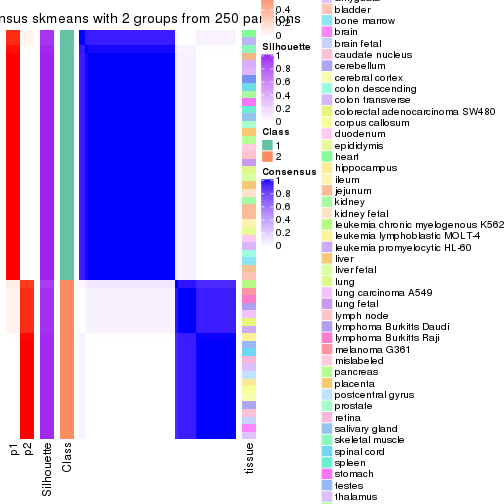</p>

</div>
<div id='tab-MAD-skmeans-consensus-heatmap-2'>
<pre><code class="r">consensus_heatmap(res, k = 3)
</code></pre>

<p></p>

</div>
<div id='tab-MAD-skmeans-consensus-heatmap-3'>
<pre><code class="r">consensus_heatmap(res, k = 4)
</code></pre>

<p></p>

</div>
<div id='tab-MAD-skmeans-consensus-heatmap-4'>
<pre><code class="r">consensus_heatmap(res, k = 5)
</code></pre>

<p></p>

</div>
<div id='tab-MAD-skmeans-consensus-heatmap-5'>
<pre><code class="r">consensus_heatmap(res, k = 6)
</code></pre>

<p></p>

</div>
</div>

Heatmaps for the membership of samples in all partitions to see how consistent they are:


<script>
$( function() {
	$( '#tabs-MAD-skmeans-membership-heatmap' ).tabs();
} );
</script>
<div id='tabs-MAD-skmeans-membership-heatmap'>
<ul>
<li><a href='#tab-MAD-skmeans-membership-heatmap-1'>k = 2</a></li>
<li><a href='#tab-MAD-skmeans-membership-heatmap-2'>k = 3</a></li>
<li><a href='#tab-MAD-skmeans-membership-heatmap-3'>k = 4</a></li>
<li><a href='#tab-MAD-skmeans-membership-heatmap-4'>k = 5</a></li>
<li><a href='#tab-MAD-skmeans-membership-heatmap-5'>k = 6</a></li>
</ul>
<div id='tab-MAD-skmeans-membership-heatmap-1'>
<pre><code class="r">membership_heatmap(res, k = 2)
</code></pre>

<p></p>

</div>
<div id='tab-MAD-skmeans-membership-heatmap-2'>
<pre><code class="r">membership_heatmap(res, k = 3)
</code></pre>

<p></p>

</div>
<div id='tab-MAD-skmeans-membership-heatmap-3'>
<pre><code class="r">membership_heatmap(res, k = 4)
</code></pre>

<p></p>

</div>
<div id='tab-MAD-skmeans-membership-heatmap-4'>
<pre><code class="r">membership_heatmap(res, k = 5)
</code></pre>

<p></p>

</div>
<div id='tab-MAD-skmeans-membership-heatmap-5'>
<pre><code class="r">membership_heatmap(res, k = 6)
</code></pre>

<p></p>

</div>
</div>

As soon as we have had the classes for columns, we can look for signatures
which are significantly different between classes which can be candidate marks
for certain classes. Following are the heatmaps for signatures.


Signature heatmaps where rows are scaled:


<script>
$( function() {
	$( '#tabs-MAD-skmeans-get-signatures' ).tabs();
} );
</script>
<div id='tabs-MAD-skmeans-get-signatures'>
<ul>
<li><a href='#tab-MAD-skmeans-get-signatures-1'>k = 2</a></li>
<li><a href='#tab-MAD-skmeans-get-signatures-2'>k = 3</a></li>
<li><a href='#tab-MAD-skmeans-get-signatures-3'>k = 4</a></li>
<li><a href='#tab-MAD-skmeans-get-signatures-4'>k = 5</a></li>
<li><a href='#tab-MAD-skmeans-get-signatures-5'>k = 6</a></li>
</ul>
<div id='tab-MAD-skmeans-get-signatures-1'>
<pre><code class="r">get_signatures(res, k = 2)
</code></pre>

<p></p>

</div>
<div id='tab-MAD-skmeans-get-signatures-2'>
<pre><code class="r">get_signatures(res, k = 3)
</code></pre>

<p></p>

</div>
<div id='tab-MAD-skmeans-get-signatures-3'>
<pre><code class="r">get_signatures(res, k = 4)
</code></pre>

<p></p>

</div>
<div id='tab-MAD-skmeans-get-signatures-4'>
<pre><code class="r">get_signatures(res, k = 5)
</code></pre>

<p></p>

</div>
<div id='tab-MAD-skmeans-get-signatures-5'>
<pre><code class="r">get_signatures(res, k = 6)
</code></pre>

<p></p>

</div>
</div>


Signature heatmaps where rows are not scaled:


<script>
$( function() {
	$( '#tabs-MAD-skmeans-get-signatures-no-scale' ).tabs();
} );
</script>
<div id='tabs-MAD-skmeans-get-signatures-no-scale'>
<ul>
<li><a href='#tab-MAD-skmeans-get-signatures-no-scale-1'>k = 2</a></li>
<li><a href='#tab-MAD-skmeans-get-signatures-no-scale-2'>k = 3</a></li>
<li><a href='#tab-MAD-skmeans-get-signatures-no-scale-3'>k = 4</a></li>
<li><a href='#tab-MAD-skmeans-get-signatures-no-scale-4'>k = 5</a></li>
<li><a href='#tab-MAD-skmeans-get-signatures-no-scale-5'>k = 6</a></li>
</ul>
<div id='tab-MAD-skmeans-get-signatures-no-scale-1'>
<pre><code class="r">get_signatures(res, k = 2, scale_rows = FALSE)
</code></pre>

<p></p>

</div>
<div id='tab-MAD-skmeans-get-signatures-no-scale-2'>
<pre><code class="r">get_signatures(res, k = 3, scale_rows = FALSE)
</code></pre>

<p></p>

</div>
<div id='tab-MAD-skmeans-get-signatures-no-scale-3'>
<pre><code class="r">get_signatures(res, k = 4, scale_rows = FALSE)
</code></pre>

<p></p>

</div>
<div id='tab-MAD-skmeans-get-signatures-no-scale-4'>
<pre><code class="r">get_signatures(res, k = 5, scale_rows = FALSE)
</code></pre>

<p>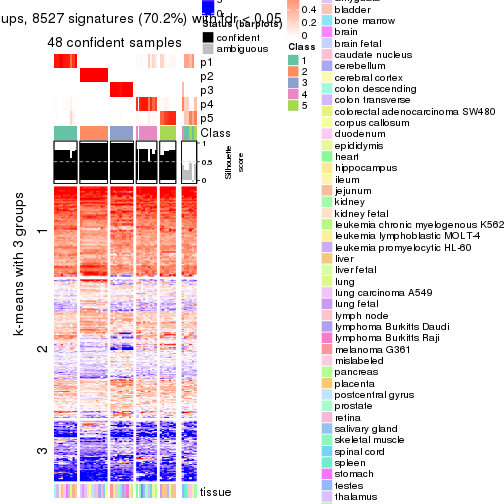</p>

</div>
<div id='tab-MAD-skmeans-get-signatures-no-scale-5'>
<pre><code class="r">get_signatures(res, k = 6, scale_rows = FALSE)
</code></pre>

<p>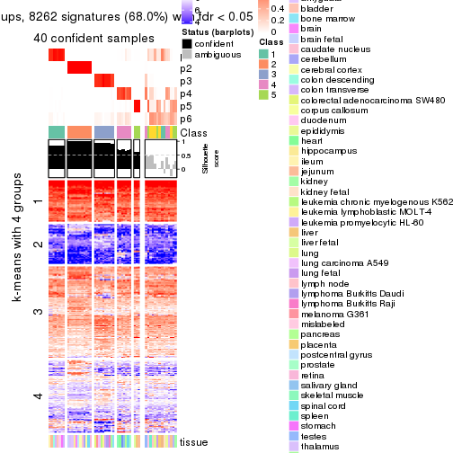</p>

</div>
</div>


Compare the overlap of signatures from different k:

```r
compare_signatures(res)
```


`get_signature()` returns a data frame invisibly. TO get the list of signatures, the function
call should be assigned to a variable explicitly. In following code, if `plot` argument is set
to `FALSE`, no heatmap is plotted while only the differential analysis is performed.

```r
# code only for demonstration
tb = get_signature(res, k = ..., plot = FALSE)
```

An example of the output of `tb` is:

```
#>   which_row         fdr    mean_1    mean_2 scaled_mean_1 scaled_mean_2 km
#> 1        38 0.042760348  8.373488  9.131774    -0.5533452     0.5164555  1
#> 2        40 0.018707592  7.106213  8.469186    -0.6173731     0.5762149  1
#> 3        55 0.019134737 10.221463 11.207825    -0.6159697     0.5749050  1
#> 4        59 0.006059896  5.921854  7.869574    -0.6899429     0.6439467  1
#> 5        60 0.018055526  8.928898 10.211722    -0.6204761     0.5791110  1
#> 6        98 0.009384629 15.714769 14.887706     0.6635654    -0.6193277  2
...
```

The columns in `tb` are:

1. `which_row`: row indices corresponding to the input matrix.
2. `fdr`: FDR for the differential test. 
3. `mean_x`: The mean value in group x.
4. `scaled_mean_x`: The mean value in group x after rows are scaled.
5. `km`: Row groups if k-means clustering is applied to rows.


UMAP plot which shows how samples are separated.


<script>
$( function() {
	$( '#tabs-MAD-skmeans-dimension-reduction' ).tabs();
} );
</script>
<div id='tabs-MAD-skmeans-dimension-reduction'>
<ul>
<li><a href='#tab-MAD-skmeans-dimension-reduction-1'>k = 2</a></li>
<li><a href='#tab-MAD-skmeans-dimension-reduction-2'>k = 3</a></li>
<li><a href='#tab-MAD-skmeans-dimension-reduction-3'>k = 4</a></li>
<li><a href='#tab-MAD-skmeans-dimension-reduction-4'>k = 5</a></li>
<li><a href='#tab-MAD-skmeans-dimension-reduction-5'>k = 6</a></li>
</ul>
<div id='tab-MAD-skmeans-dimension-reduction-1'>
<pre><code class="r">dimension_reduction(res, k = 2, method = &quot;UMAP&quot;)
</code></pre>

<p></p>

</div>
<div id='tab-MAD-skmeans-dimension-reduction-2'>
<pre><code class="r">dimension_reduction(res, k = 3, method = &quot;UMAP&quot;)
</code></pre>

<p></p>

</div>
<div id='tab-MAD-skmeans-dimension-reduction-3'>
<pre><code class="r">dimension_reduction(res, k = 4, method = &quot;UMAP&quot;)
</code></pre>

<p>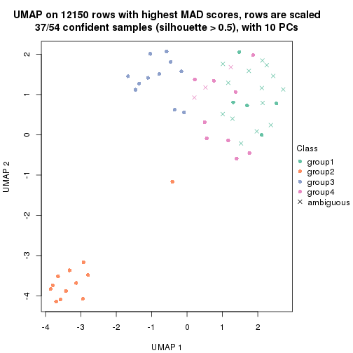</p>

</div>
<div id='tab-MAD-skmeans-dimension-reduction-4'>
<pre><code class="r">dimension_reduction(res, k = 5, method = &quot;UMAP&quot;)
</code></pre>

<p></p>

</div>
<div id='tab-MAD-skmeans-dimension-reduction-5'>
<pre><code class="r">dimension_reduction(res, k = 6, method = &quot;UMAP&quot;)
</code></pre>

<p></p>

</div>
</div>


Following heatmap shows how subgroups are split when increasing `k`:

```r
collect_classes(res)
```


Test correlation between subgroups and known annotations. If the known
annotation is numeric, one-way ANOVA test is applied, and if the known
annotation is discrete, chi-squared contingency table test is applied.

```r
test_to_known_factors(res)
```

```
#>              n tissue(p) k
#> MAD:skmeans 54     0.398 2
#> MAD:skmeans 53     0.373 3
#> MAD:skmeans 37     0.402 4
#> MAD:skmeans 48     0.441 5
#> MAD:skmeans 40     0.511 6
```


If matrix rows can be associated to genes, consider to use `functional_enrichment(res,
...)` to perform function enrichment for the signature genes. See [this vignette](http://bioconductor.org/packages/devel/bioc/vignettes/cola/inst/doc/functional_enrichment.html) for more detailed explanations.


 

---------------------------------------------------


### MAD:pam*


The object with results only for a single top-value method and a single partition method 
can be extracted as:

```r
res = res_list["MAD", "pam"]
# you can also extract it by
# res = res_list["MAD:pam"]
```

A summary of `res` and all the functions that can be applied to it:

```r
res
```

```
#> A 'ConsensusPartition' object with k = 2, 3, 4, 5, 6.
#>   On a matrix with 12150 rows and 54 columns.
#>   Top rows (1000, 2000, 3000, 4000, 5000) are extracted by 'MAD' method.
#>   Subgroups are detected by 'pam' method.
#>   Performed in total 1250 partitions by row resampling.
#>   Best k for subgroups seems to be 5.
#> 
#> Following methods can be applied to this 'ConsensusPartition' object:
#>  [1] "cola_report"             "collect_classes"         "collect_plots"          
#>  [4] "collect_stats"           "colnames"                "compare_signatures"     
#>  [7] "consensus_heatmap"       "dimension_reduction"     "functional_enrichment"  
#> [10] "get_anno_col"            "get_anno"                "get_classes"            
#> [13] "get_consensus"           "get_matrix"              "get_membership"         
#> [16] "get_param"               "get_signatures"          "get_stats"              
#> [19] "is_best_k"               "is_stable_k"             "membership_heatmap"     
#> [22] "ncol"                    "nrow"                    "plot_ecdf"              
#> [25] "rownames"                "select_partition_number" "show"                   
#> [28] "suggest_best_k"          "test_to_known_factors"
```

`collect_plots()` function collects all the plots made from `res` for all `k` (number of partitions)
into one single page to provide an easy and fast comparison between different `k`.

```r
collect_plots(res)
```


The plots are:

- The first row: a plot of the ECDF (empirical cumulative distribution
  function) curves of the consensus matrix for each `k` and the heatmap of
  predicted classes for each `k`.
- The second row: heatmaps of the consensus matrix for each `k`.
- The third row: heatmaps of the membership matrix for each `k`.
- The fouth row: heatmaps of the signatures for each `k`.

All the plots in panels can be made by individual functions and they are
plotted later in this section.

`select_partition_number()` produces several plots showing different
statistics for choosing "optimized" `k`. There are following statistics:

- ECDF curves of the consensus matrix for each `k`;
- 1-PAC. [The PAC
  score](https://en.wikipedia.org/wiki/Consensus_clustering#Over-interpretation_potential_of_consensus_clustering)
  measures the proportion of the ambiguous subgrouping.
- Mean silhouette score.
- Concordance. The mean probability of fiting the consensus class ids in all
  partitions.
- Area increased. Denote $A_k$ as the area under the ECDF curve for current
  `k`, the area increased is defined as $A_k - A_{k-1}$.
- Rand index. The percent of pairs of samples that are both in a same cluster
  or both are not in a same cluster in the partition of k and k-1.
- Jaccard index. The ratio of pairs of samples are both in a same cluster in
  the partition of k and k-1 and the pairs of samples are both in a same
  cluster in the partition k or k-1.

The detailed explanations of these statistics can be found in [the _cola_
vignette](http://bioconductor.org/packages/devel/bioc/vignettes/cola/inst/doc/cola.html#toc_13).

Generally speaking, lower PAC score, higher mean silhouette score or higher
concordance corresponds to better partition. Rand index and Jaccard index
measure how similar the current partition is compared to partition with `k-1`.
If they are too similar, we won't accept `k` is better than `k-1`.

```r
select_partition_number(res)
```


The numeric values for all these statistics can be obtained by `get_stats()`.

```r
get_stats(res)
```

```
#>   k 1-PAC mean_silhouette concordance area_increased  Rand Jaccard
#> 2 2 1.000           1.000       1.000         0.3530 0.648   0.648
#> 3 3 1.000           0.985       0.992         0.4490 0.849   0.767
#> 4 4 0.864           0.936       0.963         0.2079 0.892   0.782
#> 5 5 0.936           0.947       0.965         0.0838 0.951   0.875
#> 6 6 0.853           0.826       0.916         0.0702 0.962   0.891
```

`suggest_best_k()` suggests the best $k$ based on these statistics. The rules are as follows:

- All $k$ with Jaccard index larger than 0.95 are removed because increasing
  $k$ does not provide enough extra information. If all $k$ are removed, it is
  marked as no subgroup is detected.
- For all $k$ with 1-PAC score larger than 0.9, the maximal $k$ is taken as
  the best $k$, and other $k$ are marked as optional $k$.
- If it does not fit the second rule. The $k$ with the maximal vote of the
  highest 1-PAC score, highest mean silhouette, and highest concordance is
  taken as the best $k$.

```r
suggest_best_k(res)
```

```
#> [1] 5
#> attr(,"optional")
#> [1] 2 3
```

There is also optional best $k$ = 2 3 that is worth to check.

Following shows the table of the partitions (You need to click the **show/hide
code output** link to see it). The membership matrix (columns with name `p*`)
is inferred by
[`clue::cl_consensus()`](https://www.rdocumentation.org/link/cl_consensus?package=clue)
function with the `SE` method. Basically the value in the membership matrix
represents the probability to belong to a certain group. The finall class
label for an item is determined with the group with highest probability it
belongs to.

In `get_classes()` function, the entropy is calculated from the membership
matrix and the silhouette score is calculated from the consensus matrix.


<script>
$( function() {
	$( '#tabs-MAD-pam-get-classes' ).tabs();
} );
</script>
<div id='tabs-MAD-pam-get-classes'>
<ul>
<li><a href='#tab-MAD-pam-get-classes-1'>k = 2</a></li>
<li><a href='#tab-MAD-pam-get-classes-2'>k = 3</a></li>
<li><a href='#tab-MAD-pam-get-classes-3'>k = 4</a></li>
<li><a href='#tab-MAD-pam-get-classes-4'>k = 5</a></li>
<li><a href='#tab-MAD-pam-get-classes-5'>k = 6</a></li>
</ul>

<div id='tab-MAD-pam-get-classes-1'>
<p><a id='tab-MAD-pam-get-classes-1-a' style='color:#0366d6' href='#'>show/hide code output</a></p>
<pre><code class="r">cbind(get_classes(res, k = 2), get_membership(res, k = 2))
</code></pre>

<pre><code>#&gt;          class entropy silhouette    p1    p2
#&gt; GSM28815     1  0.0000      1.000 1.000 0.000
#&gt; GSM28816     1  0.0000      1.000 1.000 0.000
#&gt; GSM28817     1  0.0000      1.000 1.000 0.000
#&gt; GSM11327     1  0.0000      1.000 1.000 0.000
#&gt; GSM28825     2  0.0000      1.000 0.000 1.000
#&gt; GSM11322     2  0.0000      1.000 0.000 1.000
#&gt; GSM28828     2  0.0000      1.000 0.000 1.000
#&gt; GSM11346     2  0.0000      1.000 0.000 1.000
#&gt; GSM28808     2  0.0000      1.000 0.000 1.000
#&gt; GSM11332     2  0.0000      1.000 0.000 1.000
#&gt; GSM28811     2  0.0000      1.000 0.000 1.000
#&gt; GSM11334     2  0.0000      1.000 0.000 1.000
#&gt; GSM11340     2  0.0000      1.000 0.000 1.000
#&gt; GSM28812     2  0.0000      1.000 0.000 1.000
#&gt; GSM11345     1  0.0000      1.000 1.000 0.000
#&gt; GSM28819     1  0.0000      1.000 1.000 0.000
#&gt; GSM11321     1  0.0000      1.000 1.000 0.000
#&gt; GSM28820     1  0.0000      1.000 1.000 0.000
#&gt; GSM11339     1  0.0000      1.000 1.000 0.000
#&gt; GSM28804     1  0.0000      1.000 1.000 0.000
#&gt; GSM28823     1  0.0000      1.000 1.000 0.000
#&gt; GSM11336     1  0.0000      1.000 1.000 0.000
#&gt; GSM11342     1  0.0000      1.000 1.000 0.000
#&gt; GSM11333     1  0.0000      1.000 1.000 0.000
#&gt; GSM28802     1  0.0000      1.000 1.000 0.000
#&gt; GSM28803     1  0.0000      1.000 1.000 0.000
#&gt; GSM11343     1  0.0672      0.992 0.992 0.008
#&gt; GSM11347     1  0.0000      1.000 1.000 0.000
#&gt; GSM28824     1  0.0000      1.000 1.000 0.000
#&gt; GSM28813     1  0.0000      1.000 1.000 0.000
#&gt; GSM28827     1  0.0000      1.000 1.000 0.000
#&gt; GSM11337     1  0.0000      1.000 1.000 0.000
#&gt; GSM28814     1  0.0000      1.000 1.000 0.000
#&gt; GSM11331     1  0.0000      1.000 1.000 0.000
#&gt; GSM11344     1  0.0000      1.000 1.000 0.000
#&gt; GSM11330     1  0.0000      1.000 1.000 0.000
#&gt; GSM11325     1  0.0000      1.000 1.000 0.000
#&gt; GSM11338     1  0.0000      1.000 1.000 0.000
#&gt; GSM28806     1  0.0000      1.000 1.000 0.000
#&gt; GSM28826     1  0.0000      1.000 1.000 0.000
#&gt; GSM28818     1  0.0000      1.000 1.000 0.000
#&gt; GSM28821     2  0.0000      1.000 0.000 1.000
#&gt; GSM28807     1  0.0000      1.000 1.000 0.000
#&gt; GSM28822     1  0.0000      1.000 1.000 0.000
#&gt; GSM11328     2  0.0000      1.000 0.000 1.000
#&gt; GSM11323     1  0.0000      1.000 1.000 0.000
#&gt; GSM11324     1  0.0000      1.000 1.000 0.000
#&gt; GSM11341     1  0.0000      1.000 1.000 0.000
#&gt; GSM11326     1  0.0000      1.000 1.000 0.000
#&gt; GSM28810     1  0.0000      1.000 1.000 0.000
#&gt; GSM11335     1  0.0000      1.000 1.000 0.000
#&gt; GSM28809     1  0.0000      1.000 1.000 0.000
#&gt; GSM11329     1  0.0000      1.000 1.000 0.000
#&gt; GSM28805     1  0.0000      1.000 1.000 0.000
</code></pre>

<script>
$('#tab-MAD-pam-get-classes-1-a').parent().next().next().hide();
$('#tab-MAD-pam-get-classes-1-a').click(function(){
  $('#tab-MAD-pam-get-classes-1-a').parent().next().next().toggle();
  return(false);
});
</script>
</div>

<div id='tab-MAD-pam-get-classes-2'>
<p><a id='tab-MAD-pam-get-classes-2-a' style='color:#0366d6' href='#'>show/hide code output</a></p>
<pre><code class="r">cbind(get_classes(res, k = 3), get_membership(res, k = 3))
</code></pre>

<pre><code>#&gt;          class entropy silhouette    p1 p2    p3
#&gt; GSM28815     1   0.000      0.988 1.000  0 0.000
#&gt; GSM28816     1   0.000      0.988 1.000  0 0.000
#&gt; GSM28817     1   0.000      0.988 1.000  0 0.000
#&gt; GSM11327     1   0.334      0.875 0.880  0 0.120
#&gt; GSM28825     2   0.000      1.000 0.000  1 0.000
#&gt; GSM11322     2   0.000      1.000 0.000  1 0.000
#&gt; GSM28828     2   0.000      1.000 0.000  1 0.000
#&gt; GSM11346     2   0.000      1.000 0.000  1 0.000
#&gt; GSM28808     2   0.000      1.000 0.000  1 0.000
#&gt; GSM11332     2   0.000      1.000 0.000  1 0.000
#&gt; GSM28811     2   0.000      1.000 0.000  1 0.000
#&gt; GSM11334     2   0.000      1.000 0.000  1 0.000
#&gt; GSM11340     2   0.000      1.000 0.000  1 0.000
#&gt; GSM28812     2   0.000      1.000 0.000  1 0.000
#&gt; GSM11345     1   0.000      0.988 1.000  0 0.000
#&gt; GSM28819     1   0.000      0.988 1.000  0 0.000
#&gt; GSM11321     3   0.000      1.000 0.000  0 1.000
#&gt; GSM28820     1   0.000      0.988 1.000  0 0.000
#&gt; GSM11339     1   0.000      0.988 1.000  0 0.000
#&gt; GSM28804     1   0.000      0.988 1.000  0 0.000
#&gt; GSM28823     1   0.000      0.988 1.000  0 0.000
#&gt; GSM11336     1   0.000      0.988 1.000  0 0.000
#&gt; GSM11342     1   0.000      0.988 1.000  0 0.000
#&gt; GSM11333     1   0.000      0.988 1.000  0 0.000
#&gt; GSM28802     1   0.000      0.988 1.000  0 0.000
#&gt; GSM28803     3   0.000      1.000 0.000  0 1.000
#&gt; GSM11343     3   0.000      1.000 0.000  0 1.000
#&gt; GSM11347     3   0.000      1.000 0.000  0 1.000
#&gt; GSM28824     1   0.000      0.988 1.000  0 0.000
#&gt; GSM28813     1   0.000      0.988 1.000  0 0.000
#&gt; GSM28827     1   0.000      0.988 1.000  0 0.000
#&gt; GSM11337     1   0.000      0.988 1.000  0 0.000
#&gt; GSM28814     1   0.362      0.856 0.864  0 0.136
#&gt; GSM11331     1   0.000      0.988 1.000  0 0.000
#&gt; GSM11344     3   0.000      1.000 0.000  0 1.000
#&gt; GSM11330     3   0.000      1.000 0.000  0 1.000
#&gt; GSM11325     1   0.236      0.926 0.928  0 0.072
#&gt; GSM11338     1   0.000      0.988 1.000  0 0.000
#&gt; GSM28806     1   0.000      0.988 1.000  0 0.000
#&gt; GSM28826     1   0.000      0.988 1.000  0 0.000
#&gt; GSM28818     1   0.000      0.988 1.000  0 0.000
#&gt; GSM28821     2   0.000      1.000 0.000  1 0.000
#&gt; GSM28807     1   0.000      0.988 1.000  0 0.000
#&gt; GSM28822     1   0.000      0.988 1.000  0 0.000
#&gt; GSM11328     2   0.000      1.000 0.000  1 0.000
#&gt; GSM11323     1   0.000      0.988 1.000  0 0.000
#&gt; GSM11324     1   0.000      0.988 1.000  0 0.000
#&gt; GSM11341     1   0.000      0.988 1.000  0 0.000
#&gt; GSM11326     1   0.271      0.910 0.912  0 0.088
#&gt; GSM28810     1   0.000      0.988 1.000  0 0.000
#&gt; GSM11335     1   0.000      0.988 1.000  0 0.000
#&gt; GSM28809     1   0.000      0.988 1.000  0 0.000
#&gt; GSM11329     1   0.000      0.988 1.000  0 0.000
#&gt; GSM28805     1   0.000      0.988 1.000  0 0.000
</code></pre>

<script>
$('#tab-MAD-pam-get-classes-2-a').parent().next().next().hide();
$('#tab-MAD-pam-get-classes-2-a').click(function(){
  $('#tab-MAD-pam-get-classes-2-a').parent().next().next().toggle();
  return(false);
});
</script>
</div>

<div id='tab-MAD-pam-get-classes-3'>
<p><a id='tab-MAD-pam-get-classes-3-a' style='color:#0366d6' href='#'>show/hide code output</a></p>
<pre><code class="r">cbind(get_classes(res, k = 4), get_membership(res, k = 4))
</code></pre>

<pre><code>#&gt;          class entropy silhouette    p1 p2    p3    p4
#&gt; GSM28815     1   0.000     0.9642 1.000  0 0.000 0.000
#&gt; GSM28816     1   0.000     0.9642 1.000  0 0.000 0.000
#&gt; GSM28817     1   0.000     0.9642 1.000  0 0.000 0.000
#&gt; GSM11327     4   0.286     0.9909 0.112  0 0.008 0.880
#&gt; GSM28825     2   0.000     1.0000 0.000  1 0.000 0.000
#&gt; GSM11322     2   0.000     1.0000 0.000  1 0.000 0.000
#&gt; GSM28828     2   0.000     1.0000 0.000  1 0.000 0.000
#&gt; GSM11346     2   0.000     1.0000 0.000  1 0.000 0.000
#&gt; GSM28808     2   0.000     1.0000 0.000  1 0.000 0.000
#&gt; GSM11332     2   0.000     1.0000 0.000  1 0.000 0.000
#&gt; GSM28811     2   0.000     1.0000 0.000  1 0.000 0.000
#&gt; GSM11334     2   0.000     1.0000 0.000  1 0.000 0.000
#&gt; GSM11340     2   0.000     1.0000 0.000  1 0.000 0.000
#&gt; GSM28812     2   0.000     1.0000 0.000  1 0.000 0.000
#&gt; GSM11345     1   0.000     0.9642 1.000  0 0.000 0.000
#&gt; GSM28819     1   0.000     0.9642 1.000  0 0.000 0.000
#&gt; GSM11321     3   0.253     0.8737 0.000  0 0.888 0.112
#&gt; GSM28820     1   0.000     0.9642 1.000  0 0.000 0.000
#&gt; GSM11339     1   0.000     0.9642 1.000  0 0.000 0.000
#&gt; GSM28804     1   0.000     0.9642 1.000  0 0.000 0.000
#&gt; GSM28823     1   0.000     0.9642 1.000  0 0.000 0.000
#&gt; GSM11336     4   0.253     0.9977 0.112  0 0.000 0.888
#&gt; GSM11342     1   0.000     0.9642 1.000  0 0.000 0.000
#&gt; GSM11333     1   0.000     0.9642 1.000  0 0.000 0.000
#&gt; GSM28802     1   0.000     0.9642 1.000  0 0.000 0.000
#&gt; GSM28803     3   0.458     0.6592 0.000  0 0.668 0.332
#&gt; GSM11343     3   0.000     0.9245 0.000  0 1.000 0.000
#&gt; GSM11347     3   0.000     0.9245 0.000  0 1.000 0.000
#&gt; GSM28824     4   0.253     0.9977 0.112  0 0.000 0.888
#&gt; GSM28813     4   0.253     0.9977 0.112  0 0.000 0.888
#&gt; GSM28827     1   0.000     0.9642 1.000  0 0.000 0.000
#&gt; GSM11337     1   0.433     0.5340 0.712  0 0.000 0.288
#&gt; GSM28814     1   0.516     0.0542 0.516  0 0.004 0.480
#&gt; GSM11331     1   0.000     0.9642 1.000  0 0.000 0.000
#&gt; GSM11344     3   0.000     0.9245 0.000  0 1.000 0.000
#&gt; GSM11330     3   0.000     0.9245 0.000  0 1.000 0.000
#&gt; GSM11325     1   0.371     0.7967 0.848  0 0.040 0.112
#&gt; GSM11338     4   0.253     0.9977 0.112  0 0.000 0.888
#&gt; GSM28806     1   0.000     0.9642 1.000  0 0.000 0.000
#&gt; GSM28826     1   0.000     0.9642 1.000  0 0.000 0.000
#&gt; GSM28818     1   0.000     0.9642 1.000  0 0.000 0.000
#&gt; GSM28821     2   0.000     1.0000 0.000  1 0.000 0.000
#&gt; GSM28807     1   0.000     0.9642 1.000  0 0.000 0.000
#&gt; GSM28822     1   0.000     0.9642 1.000  0 0.000 0.000
#&gt; GSM11328     2   0.000     1.0000 0.000  1 0.000 0.000
#&gt; GSM11323     1   0.000     0.9642 1.000  0 0.000 0.000
#&gt; GSM11324     1   0.000     0.9642 1.000  0 0.000 0.000
#&gt; GSM11341     1   0.000     0.9642 1.000  0 0.000 0.000
#&gt; GSM11326     1   0.139     0.9181 0.952  0 0.048 0.000
#&gt; GSM28810     1   0.000     0.9642 1.000  0 0.000 0.000
#&gt; GSM11335     1   0.000     0.9642 1.000  0 0.000 0.000
#&gt; GSM28809     1   0.000     0.9642 1.000  0 0.000 0.000
#&gt; GSM11329     1   0.000     0.9642 1.000  0 0.000 0.000
#&gt; GSM28805     1   0.000     0.9642 1.000  0 0.000 0.000
</code></pre>

<script>
$('#tab-MAD-pam-get-classes-3-a').parent().next().next().hide();
$('#tab-MAD-pam-get-classes-3-a').click(function(){
  $('#tab-MAD-pam-get-classes-3-a').parent().next().next().toggle();
  return(false);
});
</script>
</div>

<div id='tab-MAD-pam-get-classes-4'>
<p><a id='tab-MAD-pam-get-classes-4-a' style='color:#0366d6' href='#'>show/hide code output</a></p>
<pre><code class="r">cbind(get_classes(res, k = 5), get_membership(res, k = 5))
</code></pre>

<pre><code>#&gt;          class entropy silhouette    p1 p2    p3    p4    p5
#&gt; GSM28815     1  0.1341      0.942 0.944  0 0.056 0.000 0.000
#&gt; GSM28816     1  0.1732      0.928 0.920  0 0.080 0.000 0.000
#&gt; GSM28817     1  0.0000      0.961 1.000  0 0.000 0.000 0.000
#&gt; GSM11327     5  0.0290      0.990 0.000  0 0.000 0.008 0.992
#&gt; GSM28825     2  0.0000      1.000 0.000  1 0.000 0.000 0.000
#&gt; GSM11322     2  0.0000      1.000 0.000  1 0.000 0.000 0.000
#&gt; GSM28828     2  0.0000      1.000 0.000  1 0.000 0.000 0.000
#&gt; GSM11346     2  0.0000      1.000 0.000  1 0.000 0.000 0.000
#&gt; GSM28808     2  0.0000      1.000 0.000  1 0.000 0.000 0.000
#&gt; GSM11332     2  0.0000      1.000 0.000  1 0.000 0.000 0.000
#&gt; GSM28811     2  0.0000      1.000 0.000  1 0.000 0.000 0.000
#&gt; GSM11334     2  0.0000      1.000 0.000  1 0.000 0.000 0.000
#&gt; GSM11340     2  0.0000      1.000 0.000  1 0.000 0.000 0.000
#&gt; GSM28812     2  0.0000      1.000 0.000  1 0.000 0.000 0.000
#&gt; GSM11345     1  0.0000      0.961 1.000  0 0.000 0.000 0.000
#&gt; GSM28819     1  0.0000      0.961 1.000  0 0.000 0.000 0.000
#&gt; GSM11321     3  0.2929      0.805 0.000  0 0.820 0.180 0.000
#&gt; GSM28820     1  0.0000      0.961 1.000  0 0.000 0.000 0.000
#&gt; GSM11339     1  0.0162      0.960 0.996  0 0.004 0.000 0.000
#&gt; GSM28804     1  0.2929      0.846 0.820  0 0.180 0.000 0.000
#&gt; GSM28823     1  0.0000      0.961 1.000  0 0.000 0.000 0.000
#&gt; GSM11336     5  0.0000      0.997 0.000  0 0.000 0.000 1.000
#&gt; GSM11342     1  0.0000      0.961 1.000  0 0.000 0.000 0.000
#&gt; GSM11333     1  0.1121      0.947 0.956  0 0.044 0.000 0.000
#&gt; GSM28802     1  0.0703      0.955 0.976  0 0.024 0.000 0.000
#&gt; GSM28803     3  0.2929      0.805 0.000  0 0.820 0.180 0.000
#&gt; GSM11343     4  0.0000      1.000 0.000  0 0.000 1.000 0.000
#&gt; GSM11347     4  0.0000      1.000 0.000  0 0.000 1.000 0.000
#&gt; GSM28824     5  0.0000      0.997 0.000  0 0.000 0.000 1.000
#&gt; GSM28813     5  0.0000      0.997 0.000  0 0.000 0.000 1.000
#&gt; GSM28827     1  0.0000      0.961 1.000  0 0.000 0.000 0.000
#&gt; GSM11337     1  0.3730      0.644 0.712  0 0.000 0.000 0.288
#&gt; GSM28814     3  0.3010      0.724 0.000  0 0.824 0.004 0.172
#&gt; GSM11331     1  0.0703      0.956 0.976  0 0.024 0.000 0.000
#&gt; GSM11344     4  0.0000      1.000 0.000  0 0.000 1.000 0.000
#&gt; GSM11330     4  0.0000      1.000 0.000  0 0.000 1.000 0.000
#&gt; GSM11325     3  0.3309      0.709 0.128  0 0.836 0.036 0.000
#&gt; GSM11338     5  0.0000      0.997 0.000  0 0.000 0.000 1.000
#&gt; GSM28806     1  0.0000      0.961 1.000  0 0.000 0.000 0.000
#&gt; GSM28826     1  0.1341      0.942 0.944  0 0.056 0.000 0.000
#&gt; GSM28818     1  0.0000      0.961 1.000  0 0.000 0.000 0.000
#&gt; GSM28821     2  0.0000      1.000 0.000  1 0.000 0.000 0.000
#&gt; GSM28807     1  0.0290      0.959 0.992  0 0.008 0.000 0.000
#&gt; GSM28822     1  0.2929      0.846 0.820  0 0.180 0.000 0.000
#&gt; GSM11328     2  0.0000      1.000 0.000  1 0.000 0.000 0.000
#&gt; GSM11323     1  0.0703      0.955 0.976  0 0.024 0.000 0.000
#&gt; GSM11324     1  0.0000      0.961 1.000  0 0.000 0.000 0.000
#&gt; GSM11341     1  0.2020      0.897 0.900  0 0.100 0.000 0.000
#&gt; GSM11326     1  0.1197      0.937 0.952  0 0.000 0.048 0.000
#&gt; GSM28810     1  0.0162      0.960 0.996  0 0.004 0.000 0.000
#&gt; GSM11335     1  0.0162      0.960 0.996  0 0.004 0.000 0.000
#&gt; GSM28809     1  0.0000      0.961 1.000  0 0.000 0.000 0.000
#&gt; GSM11329     1  0.0000      0.961 1.000  0 0.000 0.000 0.000
#&gt; GSM28805     1  0.1341      0.942 0.944  0 0.056 0.000 0.000
</code></pre>

<script>
$('#tab-MAD-pam-get-classes-4-a').parent().next().next().hide();
$('#tab-MAD-pam-get-classes-4-a').click(function(){
  $('#tab-MAD-pam-get-classes-4-a').parent().next().next().toggle();
  return(false);
});
</script>
</div>

<div id='tab-MAD-pam-get-classes-5'>
<p><a id='tab-MAD-pam-get-classes-5-a' style='color:#0366d6' href='#'>show/hide code output</a></p>
<pre><code class="r">cbind(get_classes(res, k = 6), get_membership(res, k = 6))
</code></pre>

<pre><code>#&gt;          class entropy silhouette    p1 p2    p3    p4    p5    p6
#&gt; GSM28815     1  0.2416     0.6829 0.844  0 0.000 0.156 0.000 0.000
#&gt; GSM28816     1  0.2948     0.6079 0.804  0 0.008 0.188 0.000 0.000
#&gt; GSM28817     1  0.1814     0.7427 0.900  0 0.000 0.100 0.000 0.000
#&gt; GSM11327     5  0.0146     0.9956 0.000  0 0.000 0.000 0.996 0.004
#&gt; GSM28825     2  0.0000     1.0000 0.000  1 0.000 0.000 0.000 0.000
#&gt; GSM11322     2  0.0000     1.0000 0.000  1 0.000 0.000 0.000 0.000
#&gt; GSM28828     2  0.0000     1.0000 0.000  1 0.000 0.000 0.000 0.000
#&gt; GSM11346     2  0.0000     1.0000 0.000  1 0.000 0.000 0.000 0.000
#&gt; GSM28808     2  0.0000     1.0000 0.000  1 0.000 0.000 0.000 0.000
#&gt; GSM11332     2  0.0000     1.0000 0.000  1 0.000 0.000 0.000 0.000
#&gt; GSM28811     2  0.0000     1.0000 0.000  1 0.000 0.000 0.000 0.000
#&gt; GSM11334     2  0.0000     1.0000 0.000  1 0.000 0.000 0.000 0.000
#&gt; GSM11340     2  0.0000     1.0000 0.000  1 0.000 0.000 0.000 0.000
#&gt; GSM28812     2  0.0000     1.0000 0.000  1 0.000 0.000 0.000 0.000
#&gt; GSM11345     1  0.0000     0.8006 1.000  0 0.000 0.000 0.000 0.000
#&gt; GSM28819     1  0.0000     0.8006 1.000  0 0.000 0.000 0.000 0.000
#&gt; GSM11321     3  0.0000     0.9934 0.000  0 1.000 0.000 0.000 0.000
#&gt; GSM28820     1  0.0000     0.8006 1.000  0 0.000 0.000 0.000 0.000
#&gt; GSM11339     1  0.1863     0.7391 0.896  0 0.000 0.104 0.000 0.000
#&gt; GSM28804     4  0.3765     0.9911 0.404  0 0.000 0.596 0.000 0.000
#&gt; GSM28823     1  0.3774     0.0408 0.592  0 0.000 0.408 0.000 0.000
#&gt; GSM11336     5  0.0000     0.9989 0.000  0 0.000 0.000 1.000 0.000
#&gt; GSM11342     1  0.3774     0.0408 0.592  0 0.000 0.408 0.000 0.000
#&gt; GSM11333     1  0.2553     0.6877 0.848  0 0.008 0.144 0.000 0.000
#&gt; GSM28802     1  0.2346     0.7112 0.868  0 0.008 0.124 0.000 0.000
#&gt; GSM28803     3  0.0260     0.9904 0.000  0 0.992 0.000 0.000 0.008
#&gt; GSM11343     6  0.0146     0.9960 0.000  0 0.004 0.000 0.000 0.996
#&gt; GSM11347     6  0.0000     0.9987 0.000  0 0.000 0.000 0.000 1.000
#&gt; GSM28824     5  0.0000     0.9989 0.000  0 0.000 0.000 1.000 0.000
#&gt; GSM28813     5  0.0000     0.9989 0.000  0 0.000 0.000 1.000 0.000
#&gt; GSM28827     1  0.1610     0.7559 0.916  0 0.000 0.084 0.000 0.000
#&gt; GSM11337     1  0.4771     0.0646 0.652  0 0.000 0.100 0.248 0.000
#&gt; GSM28814     3  0.0260     0.9899 0.000  0 0.992 0.000 0.008 0.000
#&gt; GSM11331     1  0.0632     0.7918 0.976  0 0.000 0.024 0.000 0.000
#&gt; GSM11344     6  0.0000     0.9987 0.000  0 0.000 0.000 0.000 1.000
#&gt; GSM11330     6  0.0000     0.9987 0.000  0 0.000 0.000 0.000 1.000
#&gt; GSM11325     3  0.0000     0.9934 0.000  0 1.000 0.000 0.000 0.000
#&gt; GSM11338     5  0.0000     0.9989 0.000  0 0.000 0.000 1.000 0.000
#&gt; GSM28806     1  0.0000     0.8006 1.000  0 0.000 0.000 0.000 0.000
#&gt; GSM28826     1  0.2669     0.6714 0.836  0 0.008 0.156 0.000 0.000
#&gt; GSM28818     1  0.0000     0.8006 1.000  0 0.000 0.000 0.000 0.000
#&gt; GSM28821     2  0.0000     1.0000 0.000  1 0.000 0.000 0.000 0.000
#&gt; GSM28807     1  0.0260     0.7971 0.992  0 0.000 0.008 0.000 0.000
#&gt; GSM28822     4  0.3774     0.9911 0.408  0 0.000 0.592 0.000 0.000
#&gt; GSM11328     2  0.0000     1.0000 0.000  1 0.000 0.000 0.000 0.000
#&gt; GSM11323     1  0.0632     0.7914 0.976  0 0.000 0.024 0.000 0.000
#&gt; GSM11324     1  0.0000     0.8006 1.000  0 0.000 0.000 0.000 0.000
#&gt; GSM11341     1  0.3198     0.0830 0.740  0 0.000 0.260 0.000 0.000
#&gt; GSM11326     1  0.0458     0.7921 0.984  0 0.000 0.000 0.000 0.016
#&gt; GSM28810     1  0.0146     0.7991 0.996  0 0.000 0.004 0.000 0.000
#&gt; GSM11335     1  0.0146     0.7991 0.996  0 0.000 0.004 0.000 0.000
#&gt; GSM28809     1  0.0000     0.8006 1.000  0 0.000 0.000 0.000 0.000
#&gt; GSM11329     1  0.0000     0.8006 1.000  0 0.000 0.000 0.000 0.000
#&gt; GSM28805     1  0.2416     0.6829 0.844  0 0.000 0.156 0.000 0.000
</code></pre>

<script>
$('#tab-MAD-pam-get-classes-5-a').parent().next().next().hide();
$('#tab-MAD-pam-get-classes-5-a').click(function(){
  $('#tab-MAD-pam-get-classes-5-a').parent().next().next().toggle();
  return(false);
});
</script>
</div>
</div>

Heatmaps for the consensus matrix. It visualizes the probability of two
samples to be in a same group.


<script>
$( function() {
	$( '#tabs-MAD-pam-consensus-heatmap' ).tabs();
} );
</script>
<div id='tabs-MAD-pam-consensus-heatmap'>
<ul>
<li><a href='#tab-MAD-pam-consensus-heatmap-1'>k = 2</a></li>
<li><a href='#tab-MAD-pam-consensus-heatmap-2'>k = 3</a></li>
<li><a href='#tab-MAD-pam-consensus-heatmap-3'>k = 4</a></li>
<li><a href='#tab-MAD-pam-consensus-heatmap-4'>k = 5</a></li>
<li><a href='#tab-MAD-pam-consensus-heatmap-5'>k = 6</a></li>
</ul>
<div id='tab-MAD-pam-consensus-heatmap-1'>
<pre><code class="r">consensus_heatmap(res, k = 2)
</code></pre>

<p></p>

</div>
<div id='tab-MAD-pam-consensus-heatmap-2'>
<pre><code class="r">consensus_heatmap(res, k = 3)
</code></pre>

<p></p>

</div>
<div id='tab-MAD-pam-consensus-heatmap-3'>
<pre><code class="r">consensus_heatmap(res, k = 4)
</code></pre>

<p></p>

</div>
<div id='tab-MAD-pam-consensus-heatmap-4'>
<pre><code class="r">consensus_heatmap(res, k = 5)
</code></pre>

<p>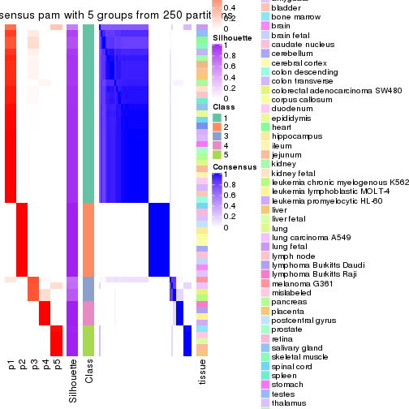</p>

</div>
<div id='tab-MAD-pam-consensus-heatmap-5'>
<pre><code class="r">consensus_heatmap(res, k = 6)
</code></pre>

<p></p>

</div>
</div>

Heatmaps for the membership of samples in all partitions to see how consistent they are:


<script>
$( function() {
	$( '#tabs-MAD-pam-membership-heatmap' ).tabs();
} );
</script>
<div id='tabs-MAD-pam-membership-heatmap'>
<ul>
<li><a href='#tab-MAD-pam-membership-heatmap-1'>k = 2</a></li>
<li><a href='#tab-MAD-pam-membership-heatmap-2'>k = 3</a></li>
<li><a href='#tab-MAD-pam-membership-heatmap-3'>k = 4</a></li>
<li><a href='#tab-MAD-pam-membership-heatmap-4'>k = 5</a></li>
<li><a href='#tab-MAD-pam-membership-heatmap-5'>k = 6</a></li>
</ul>
<div id='tab-MAD-pam-membership-heatmap-1'>
<pre><code class="r">membership_heatmap(res, k = 2)
</code></pre>

<p></p>

</div>
<div id='tab-MAD-pam-membership-heatmap-2'>
<pre><code class="r">membership_heatmap(res, k = 3)
</code></pre>

<p></p>

</div>
<div id='tab-MAD-pam-membership-heatmap-3'>
<pre><code class="r">membership_heatmap(res, k = 4)
</code></pre>

<p></p>

</div>
<div id='tab-MAD-pam-membership-heatmap-4'>
<pre><code class="r">membership_heatmap(res, k = 5)
</code></pre>

<p></p>

</div>
<div id='tab-MAD-pam-membership-heatmap-5'>
<pre><code class="r">membership_heatmap(res, k = 6)
</code></pre>

<p></p>

</div>
</div>

As soon as we have had the classes for columns, we can look for signatures
which are significantly different between classes which can be candidate marks
for certain classes. Following are the heatmaps for signatures.


Signature heatmaps where rows are scaled:


<script>
$( function() {
	$( '#tabs-MAD-pam-get-signatures' ).tabs();
} );
</script>
<div id='tabs-MAD-pam-get-signatures'>
<ul>
<li><a href='#tab-MAD-pam-get-signatures-1'>k = 2</a></li>
<li><a href='#tab-MAD-pam-get-signatures-2'>k = 3</a></li>
<li><a href='#tab-MAD-pam-get-signatures-3'>k = 4</a></li>
<li><a href='#tab-MAD-pam-get-signatures-4'>k = 5</a></li>
<li><a href='#tab-MAD-pam-get-signatures-5'>k = 6</a></li>
</ul>
<div id='tab-MAD-pam-get-signatures-1'>
<pre><code class="r">get_signatures(res, k = 2)
</code></pre>

<p></p>

</div>
<div id='tab-MAD-pam-get-signatures-2'>
<pre><code class="r">get_signatures(res, k = 3)
</code></pre>

<p></p>

</div>
<div id='tab-MAD-pam-get-signatures-3'>
<pre><code class="r">get_signatures(res, k = 4)
</code></pre>

<p></p>

</div>
<div id='tab-MAD-pam-get-signatures-4'>
<pre><code class="r">get_signatures(res, k = 5)
</code></pre>

<p></p>

</div>
<div id='tab-MAD-pam-get-signatures-5'>
<pre><code class="r">get_signatures(res, k = 6)
</code></pre>

<p></p>

</div>
</div>


Signature heatmaps where rows are not scaled:


<script>
$( function() {
	$( '#tabs-MAD-pam-get-signatures-no-scale' ).tabs();
} );
</script>
<div id='tabs-MAD-pam-get-signatures-no-scale'>
<ul>
<li><a href='#tab-MAD-pam-get-signatures-no-scale-1'>k = 2</a></li>
<li><a href='#tab-MAD-pam-get-signatures-no-scale-2'>k = 3</a></li>
<li><a href='#tab-MAD-pam-get-signatures-no-scale-3'>k = 4</a></li>
<li><a href='#tab-MAD-pam-get-signatures-no-scale-4'>k = 5</a></li>
<li><a href='#tab-MAD-pam-get-signatures-no-scale-5'>k = 6</a></li>
</ul>
<div id='tab-MAD-pam-get-signatures-no-scale-1'>
<pre><code class="r">get_signatures(res, k = 2, scale_rows = FALSE)
</code></pre>

<p></p>

</div>
<div id='tab-MAD-pam-get-signatures-no-scale-2'>
<pre><code class="r">get_signatures(res, k = 3, scale_rows = FALSE)
</code></pre>

<p></p>

</div>
<div id='tab-MAD-pam-get-signatures-no-scale-3'>
<pre><code class="r">get_signatures(res, k = 4, scale_rows = FALSE)
</code></pre>

<p></p>

</div>
<div id='tab-MAD-pam-get-signatures-no-scale-4'>
<pre><code class="r">get_signatures(res, k = 5, scale_rows = FALSE)
</code></pre>

<p></p>

</div>
<div id='tab-MAD-pam-get-signatures-no-scale-5'>
<pre><code class="r">get_signatures(res, k = 6, scale_rows = FALSE)
</code></pre>

<p></p>

</div>
</div>


Compare the overlap of signatures from different k:

```r
compare_signatures(res)
```


`get_signature()` returns a data frame invisibly. TO get the list of signatures, the function
call should be assigned to a variable explicitly. In following code, if `plot` argument is set
to `FALSE`, no heatmap is plotted while only the differential analysis is performed.

```r
# code only for demonstration
tb = get_signature(res, k = ..., plot = FALSE)
```

An example of the output of `tb` is:

```
#>   which_row         fdr    mean_1    mean_2 scaled_mean_1 scaled_mean_2 km
#> 1        38 0.042760348  8.373488  9.131774    -0.5533452     0.5164555  1
#> 2        40 0.018707592  7.106213  8.469186    -0.6173731     0.5762149  1
#> 3        55 0.019134737 10.221463 11.207825    -0.6159697     0.5749050  1
#> 4        59 0.006059896  5.921854  7.869574    -0.6899429     0.6439467  1
#> 5        60 0.018055526  8.928898 10.211722    -0.6204761     0.5791110  1
#> 6        98 0.009384629 15.714769 14.887706     0.6635654    -0.6193277  2
...
```

The columns in `tb` are:

1. `which_row`: row indices corresponding to the input matrix.
2. `fdr`: FDR for the differential test. 
3. `mean_x`: The mean value in group x.
4. `scaled_mean_x`: The mean value in group x after rows are scaled.
5. `km`: Row groups if k-means clustering is applied to rows.


UMAP plot which shows how samples are separated.


<script>
$( function() {
	$( '#tabs-MAD-pam-dimension-reduction' ).tabs();
} );
</script>
<div id='tabs-MAD-pam-dimension-reduction'>
<ul>
<li><a href='#tab-MAD-pam-dimension-reduction-1'>k = 2</a></li>
<li><a href='#tab-MAD-pam-dimension-reduction-2'>k = 3</a></li>
<li><a href='#tab-MAD-pam-dimension-reduction-3'>k = 4</a></li>
<li><a href='#tab-MAD-pam-dimension-reduction-4'>k = 5</a></li>
<li><a href='#tab-MAD-pam-dimension-reduction-5'>k = 6</a></li>
</ul>
<div id='tab-MAD-pam-dimension-reduction-1'>
<pre><code class="r">dimension_reduction(res, k = 2, method = &quot;UMAP&quot;)
</code></pre>

<p></p>

</div>
<div id='tab-MAD-pam-dimension-reduction-2'>
<pre><code class="r">dimension_reduction(res, k = 3, method = &quot;UMAP&quot;)
</code></pre>

<p></p>

</div>
<div id='tab-MAD-pam-dimension-reduction-3'>
<pre><code class="r">dimension_reduction(res, k = 4, method = &quot;UMAP&quot;)
</code></pre>

<p></p>

</div>
<div id='tab-MAD-pam-dimension-reduction-4'>
<pre><code class="r">dimension_reduction(res, k = 5, method = &quot;UMAP&quot;)
</code></pre>

<p></p>

</div>
<div id='tab-MAD-pam-dimension-reduction-5'>
<pre><code class="r">dimension_reduction(res, k = 6, method = &quot;UMAP&quot;)
</code></pre>

<p></p>

</div>
</div>


Following heatmap shows how subgroups are split when increasing `k`:

```r
collect_classes(res)
```


Test correlation between subgroups and known annotations. If the known
annotation is numeric, one-way ANOVA test is applied, and if the known
annotation is discrete, chi-squared contingency table test is applied.

```r
test_to_known_factors(res)
```

```
#>          n tissue(p) k
#> MAD:pam 54     0.398 2
#> MAD:pam 54     0.374 3
#> MAD:pam 53     0.489 4
#> MAD:pam 54     0.455 5
#> MAD:pam 50     0.400 6
```


If matrix rows can be associated to genes, consider to use `functional_enrichment(res,
...)` to perform function enrichment for the signature genes. See [this vignette](http://bioconductor.org/packages/devel/bioc/vignettes/cola/inst/doc/functional_enrichment.html) for more detailed explanations.


 

---------------------------------------------------


### MAD:mclust**


The object with results only for a single top-value method and a single partition method 
can be extracted as:

```r
res = res_list["MAD", "mclust"]
# you can also extract it by
# res = res_list["MAD:mclust"]
```

A summary of `res` and all the functions that can be applied to it:

```r
res
```

```
#> A 'ConsensusPartition' object with k = 2, 3, 4, 5, 6.
#>   On a matrix with 12150 rows and 54 columns.
#>   Top rows (1000, 2000, 3000, 4000, 5000) are extracted by 'MAD' method.
#>   Subgroups are detected by 'mclust' method.
#>   Performed in total 1250 partitions by row resampling.
#>   Best k for subgroups seems to be 3.
#> 
#> Following methods can be applied to this 'ConsensusPartition' object:
#>  [1] "cola_report"             "collect_classes"         "collect_plots"          
#>  [4] "collect_stats"           "colnames"                "compare_signatures"     
#>  [7] "consensus_heatmap"       "dimension_reduction"     "functional_enrichment"  
#> [10] "get_anno_col"            "get_anno"                "get_classes"            
#> [13] "get_consensus"           "get_matrix"              "get_membership"         
#> [16] "get_param"               "get_signatures"          "get_stats"              
#> [19] "is_best_k"               "is_stable_k"             "membership_heatmap"     
#> [22] "ncol"                    "nrow"                    "plot_ecdf"              
#> [25] "rownames"                "select_partition_number" "show"                   
#> [28] "suggest_best_k"          "test_to_known_factors"
```

`collect_plots()` function collects all the plots made from `res` for all `k` (number of partitions)
into one single page to provide an easy and fast comparison between different `k`.

```r
collect_plots(res)
```


The plots are:

- The first row: a plot of the ECDF (empirical cumulative distribution
  function) curves of the consensus matrix for each `k` and the heatmap of
  predicted classes for each `k`.
- The second row: heatmaps of the consensus matrix for each `k`.
- The third row: heatmaps of the membership matrix for each `k`.
- The fouth row: heatmaps of the signatures for each `k`.

All the plots in panels can be made by individual functions and they are
plotted later in this section.

`select_partition_number()` produces several plots showing different
statistics for choosing "optimized" `k`. There are following statistics:

- ECDF curves of the consensus matrix for each `k`;
- 1-PAC. [The PAC
  score](https://en.wikipedia.org/wiki/Consensus_clustering#Over-interpretation_potential_of_consensus_clustering)
  measures the proportion of the ambiguous subgrouping.
- Mean silhouette score.
- Concordance. The mean probability of fiting the consensus class ids in all
  partitions.
- Area increased. Denote $A_k$ as the area under the ECDF curve for current
  `k`, the area increased is defined as $A_k - A_{k-1}$.
- Rand index. The percent of pairs of samples that are both in a same cluster
  or both are not in a same cluster in the partition of k and k-1.
- Jaccard index. The ratio of pairs of samples are both in a same cluster in
  the partition of k and k-1 and the pairs of samples are both in a same
  cluster in the partition k or k-1.

The detailed explanations of these statistics can be found in [the _cola_
vignette](http://bioconductor.org/packages/devel/bioc/vignettes/cola/inst/doc/cola.html#toc_13).

Generally speaking, lower PAC score, higher mean silhouette score or higher
concordance corresponds to better partition. Rand index and Jaccard index
measure how similar the current partition is compared to partition with `k-1`.
If they are too similar, we won't accept `k` is better than `k-1`.

```r
select_partition_number(res)
```


The numeric values for all these statistics can be obtained by `get_stats()`.

```r
get_stats(res)
```

```
#>   k 1-PAC mean_silhouette concordance area_increased  Rand Jaccard
#> 2 2 0.688           0.883       0.931         0.4474 0.508   0.508
#> 3 3 1.000           0.974       0.990         0.3044 0.916   0.835
#> 4 4 0.840           0.877       0.932         0.1924 0.891   0.743
#> 5 5 0.805           0.825       0.906         0.1020 0.908   0.713
#> 6 6 0.855           0.886       0.919         0.0399 0.951   0.795
```

`suggest_best_k()` suggests the best $k$ based on these statistics. The rules are as follows:

- All $k$ with Jaccard index larger than 0.95 are removed because increasing
  $k$ does not provide enough extra information. If all $k$ are removed, it is
  marked as no subgroup is detected.
- For all $k$ with 1-PAC score larger than 0.9, the maximal $k$ is taken as
  the best $k$, and other $k$ are marked as optional $k$.
- If it does not fit the second rule. The $k$ with the maximal vote of the
  highest 1-PAC score, highest mean silhouette, and highest concordance is
  taken as the best $k$.

```r
suggest_best_k(res)
```

```
#> [1] 3
```


Following shows the table of the partitions (You need to click the **show/hide
code output** link to see it). The membership matrix (columns with name `p*`)
is inferred by
[`clue::cl_consensus()`](https://www.rdocumentation.org/link/cl_consensus?package=clue)
function with the `SE` method. Basically the value in the membership matrix
represents the probability to belong to a certain group. The finall class
label for an item is determined with the group with highest probability it
belongs to.

In `get_classes()` function, the entropy is calculated from the membership
matrix and the silhouette score is calculated from the consensus matrix.


<script>
$( function() {
	$( '#tabs-MAD-mclust-get-classes' ).tabs();
} );
</script>
<div id='tabs-MAD-mclust-get-classes'>
<ul>
<li><a href='#tab-MAD-mclust-get-classes-1'>k = 2</a></li>
<li><a href='#tab-MAD-mclust-get-classes-2'>k = 3</a></li>
<li><a href='#tab-MAD-mclust-get-classes-3'>k = 4</a></li>
<li><a href='#tab-MAD-mclust-get-classes-4'>k = 5</a></li>
<li><a href='#tab-MAD-mclust-get-classes-5'>k = 6</a></li>
</ul>

<div id='tab-MAD-mclust-get-classes-1'>
<p><a id='tab-MAD-mclust-get-classes-1-a' style='color:#0366d6' href='#'>show/hide code output</a></p>
<pre><code class="r">cbind(get_classes(res, k = 2), get_membership(res, k = 2))
</code></pre>

<pre><code>#&gt;          class entropy silhouette    p1    p2
#&gt; GSM28815     1  0.0000      0.985 1.000 0.000
#&gt; GSM28816     1  0.0376      0.980 0.996 0.004
#&gt; GSM28817     1  0.0000      0.985 1.000 0.000
#&gt; GSM11327     2  0.9170      0.713 0.332 0.668
#&gt; GSM28825     2  0.0000      0.821 0.000 1.000
#&gt; GSM11322     2  0.0000      0.821 0.000 1.000
#&gt; GSM28828     2  0.0938      0.822 0.012 0.988
#&gt; GSM11346     2  0.0000      0.821 0.000 1.000
#&gt; GSM28808     2  0.0000      0.821 0.000 1.000
#&gt; GSM11332     2  0.0000      0.821 0.000 1.000
#&gt; GSM28811     2  0.0938      0.822 0.012 0.988
#&gt; GSM11334     2  0.0000      0.821 0.000 1.000
#&gt; GSM11340     2  0.0000      0.821 0.000 1.000
#&gt; GSM28812     2  0.0000      0.821 0.000 1.000
#&gt; GSM11345     1  0.0000      0.985 1.000 0.000
#&gt; GSM28819     1  0.0000      0.985 1.000 0.000
#&gt; GSM11321     2  0.9170      0.713 0.332 0.668
#&gt; GSM28820     1  0.0000      0.985 1.000 0.000
#&gt; GSM11339     1  0.0000      0.985 1.000 0.000
#&gt; GSM28804     1  0.0000      0.985 1.000 0.000
#&gt; GSM28823     1  0.0000      0.985 1.000 0.000
#&gt; GSM11336     1  0.0000      0.985 1.000 0.000
#&gt; GSM11342     1  0.0000      0.985 1.000 0.000
#&gt; GSM11333     1  0.0000      0.985 1.000 0.000
#&gt; GSM28802     1  0.0000      0.985 1.000 0.000
#&gt; GSM28803     2  0.9170      0.713 0.332 0.668
#&gt; GSM11343     2  0.9170      0.713 0.332 0.668
#&gt; GSM11347     2  0.9170      0.713 0.332 0.668
#&gt; GSM28824     1  0.0000      0.985 1.000 0.000
#&gt; GSM28813     1  0.0000      0.985 1.000 0.000
#&gt; GSM28827     1  0.0000      0.985 1.000 0.000
#&gt; GSM11337     1  0.0000      0.985 1.000 0.000
#&gt; GSM28814     2  0.9170      0.713 0.332 0.668
#&gt; GSM11331     1  0.0000      0.985 1.000 0.000
#&gt; GSM11344     2  0.9170      0.713 0.332 0.668
#&gt; GSM11330     2  0.9170      0.713 0.332 0.668
#&gt; GSM11325     2  0.9170      0.713 0.332 0.668
#&gt; GSM11338     1  0.0000      0.985 1.000 0.000
#&gt; GSM28806     1  0.0000      0.985 1.000 0.000
#&gt; GSM28826     1  0.0000      0.985 1.000 0.000
#&gt; GSM28818     1  0.0000      0.985 1.000 0.000
#&gt; GSM28821     2  0.0938      0.822 0.012 0.988
#&gt; GSM28807     1  0.0000      0.985 1.000 0.000
#&gt; GSM28822     1  0.0000      0.985 1.000 0.000
#&gt; GSM11328     2  0.0938      0.822 0.012 0.988
#&gt; GSM11323     1  0.0000      0.985 1.000 0.000
#&gt; GSM11324     1  0.0000      0.985 1.000 0.000
#&gt; GSM11341     1  0.9522      0.157 0.628 0.372
#&gt; GSM11326     2  0.9170      0.713 0.332 0.668
#&gt; GSM28810     1  0.0000      0.985 1.000 0.000
#&gt; GSM11335     1  0.0000      0.985 1.000 0.000
#&gt; GSM28809     1  0.0000      0.985 1.000 0.000
#&gt; GSM11329     1  0.0000      0.985 1.000 0.000
#&gt; GSM28805     1  0.0000      0.985 1.000 0.000
</code></pre>

<script>
$('#tab-MAD-mclust-get-classes-1-a').parent().next().next().hide();
$('#tab-MAD-mclust-get-classes-1-a').click(function(){
  $('#tab-MAD-mclust-get-classes-1-a').parent().next().next().toggle();
  return(false);
});
</script>
</div>

<div id='tab-MAD-mclust-get-classes-2'>
<p><a id='tab-MAD-mclust-get-classes-2-a' style='color:#0366d6' href='#'>show/hide code output</a></p>
<pre><code class="r">cbind(get_classes(res, k = 3), get_membership(res, k = 3))
</code></pre>

<pre><code>#&gt;          class entropy silhouette    p1    p2    p3
#&gt; GSM28815     1   0.000     0.9840 1.000 0.000 0.000
#&gt; GSM28816     1   0.000     0.9840 1.000 0.000 0.000
#&gt; GSM28817     1   0.000     0.9840 1.000 0.000 0.000
#&gt; GSM11327     3   0.000     1.0000 0.000 0.000 1.000
#&gt; GSM28825     2   0.000     1.0000 0.000 1.000 0.000
#&gt; GSM11322     2   0.000     1.0000 0.000 1.000 0.000
#&gt; GSM28828     2   0.000     1.0000 0.000 1.000 0.000
#&gt; GSM11346     2   0.000     1.0000 0.000 1.000 0.000
#&gt; GSM28808     2   0.000     1.0000 0.000 1.000 0.000
#&gt; GSM11332     2   0.000     1.0000 0.000 1.000 0.000
#&gt; GSM28811     2   0.000     1.0000 0.000 1.000 0.000
#&gt; GSM11334     2   0.000     1.0000 0.000 1.000 0.000
#&gt; GSM11340     2   0.000     1.0000 0.000 1.000 0.000
#&gt; GSM28812     2   0.000     1.0000 0.000 1.000 0.000
#&gt; GSM11345     1   0.000     0.9840 1.000 0.000 0.000
#&gt; GSM28819     1   0.000     0.9840 1.000 0.000 0.000
#&gt; GSM11321     3   0.000     1.0000 0.000 0.000 1.000
#&gt; GSM28820     1   0.000     0.9840 1.000 0.000 0.000
#&gt; GSM11339     1   0.000     0.9840 1.000 0.000 0.000
#&gt; GSM28804     1   0.000     0.9840 1.000 0.000 0.000
#&gt; GSM28823     1   0.000     0.9840 1.000 0.000 0.000
#&gt; GSM11336     1   0.000     0.9840 1.000 0.000 0.000
#&gt; GSM11342     1   0.000     0.9840 1.000 0.000 0.000
#&gt; GSM11333     1   0.000     0.9840 1.000 0.000 0.000
#&gt; GSM28802     1   0.000     0.9840 1.000 0.000 0.000
#&gt; GSM28803     3   0.000     1.0000 0.000 0.000 1.000
#&gt; GSM11343     3   0.000     1.0000 0.000 0.000 1.000
#&gt; GSM11347     3   0.000     1.0000 0.000 0.000 1.000
#&gt; GSM28824     1   0.000     0.9840 1.000 0.000 0.000
#&gt; GSM28813     1   0.000     0.9840 1.000 0.000 0.000
#&gt; GSM28827     1   0.000     0.9840 1.000 0.000 0.000
#&gt; GSM11337     1   0.000     0.9840 1.000 0.000 0.000
#&gt; GSM28814     3   0.000     1.0000 0.000 0.000 1.000
#&gt; GSM11331     1   0.000     0.9840 1.000 0.000 0.000
#&gt; GSM11344     3   0.000     1.0000 0.000 0.000 1.000
#&gt; GSM11330     3   0.000     1.0000 0.000 0.000 1.000
#&gt; GSM11325     3   0.000     1.0000 0.000 0.000 1.000
#&gt; GSM11338     1   0.000     0.9840 1.000 0.000 0.000
#&gt; GSM28806     1   0.000     0.9840 1.000 0.000 0.000
#&gt; GSM28826     1   0.000     0.9840 1.000 0.000 0.000
#&gt; GSM28818     1   0.000     0.9840 1.000 0.000 0.000
#&gt; GSM28821     2   0.000     1.0000 0.000 1.000 0.000
#&gt; GSM28807     1   0.000     0.9840 1.000 0.000 0.000
#&gt; GSM28822     1   0.000     0.9840 1.000 0.000 0.000
#&gt; GSM11328     2   0.000     1.0000 0.000 1.000 0.000
#&gt; GSM11323     1   0.000     0.9840 1.000 0.000 0.000
#&gt; GSM11324     1   0.000     0.9840 1.000 0.000 0.000
#&gt; GSM11341     1   0.909     0.0743 0.484 0.144 0.372
#&gt; GSM11326     3   0.000     1.0000 0.000 0.000 1.000
#&gt; GSM28810     1   0.000     0.9840 1.000 0.000 0.000
#&gt; GSM11335     1   0.000     0.9840 1.000 0.000 0.000
#&gt; GSM28809     1   0.000     0.9840 1.000 0.000 0.000
#&gt; GSM11329     1   0.000     0.9840 1.000 0.000 0.000
#&gt; GSM28805     1   0.000     0.9840 1.000 0.000 0.000
</code></pre>

<script>
$('#tab-MAD-mclust-get-classes-2-a').parent().next().next().hide();
$('#tab-MAD-mclust-get-classes-2-a').click(function(){
  $('#tab-MAD-mclust-get-classes-2-a').parent().next().next().toggle();
  return(false);
});
</script>
</div>

<div id='tab-MAD-mclust-get-classes-3'>
<p><a id='tab-MAD-mclust-get-classes-3-a' style='color:#0366d6' href='#'>show/hide code output</a></p>
<pre><code class="r">cbind(get_classes(res, k = 4), get_membership(res, k = 4))
</code></pre>

<pre><code>#&gt;          class entropy silhouette    p1    p2    p3    p4
#&gt; GSM28815     1  0.0469     0.8835 0.988 0.000 0.000 0.012
#&gt; GSM28816     1  0.0469     0.8835 0.988 0.000 0.000 0.012
#&gt; GSM28817     1  0.0336     0.8876 0.992 0.000 0.000 0.008
#&gt; GSM11327     3  0.0000     0.9925 0.000 0.000 1.000 0.000
#&gt; GSM28825     2  0.0000     1.0000 0.000 1.000 0.000 0.000
#&gt; GSM11322     2  0.0000     1.0000 0.000 1.000 0.000 0.000
#&gt; GSM28828     2  0.0000     1.0000 0.000 1.000 0.000 0.000
#&gt; GSM11346     2  0.0000     1.0000 0.000 1.000 0.000 0.000
#&gt; GSM28808     2  0.0000     1.0000 0.000 1.000 0.000 0.000
#&gt; GSM11332     2  0.0000     1.0000 0.000 1.000 0.000 0.000
#&gt; GSM28811     2  0.0000     1.0000 0.000 1.000 0.000 0.000
#&gt; GSM11334     2  0.0000     1.0000 0.000 1.000 0.000 0.000
#&gt; GSM11340     2  0.0000     1.0000 0.000 1.000 0.000 0.000
#&gt; GSM28812     2  0.0000     1.0000 0.000 1.000 0.000 0.000
#&gt; GSM11345     1  0.3074     0.8569 0.848 0.000 0.000 0.152
#&gt; GSM28819     1  0.3024     0.8591 0.852 0.000 0.000 0.148
#&gt; GSM11321     3  0.0000     0.9925 0.000 0.000 1.000 0.000
#&gt; GSM28820     1  0.2814     0.8655 0.868 0.000 0.000 0.132
#&gt; GSM11339     1  0.0469     0.8835 0.988 0.000 0.000 0.012
#&gt; GSM28804     4  0.3569     0.6838 0.196 0.000 0.000 0.804
#&gt; GSM28823     1  0.3074     0.8569 0.848 0.000 0.000 0.152
#&gt; GSM11336     1  0.0000     0.8872 1.000 0.000 0.000 0.000
#&gt; GSM11342     1  0.3074     0.8569 0.848 0.000 0.000 0.152
#&gt; GSM11333     1  0.0469     0.8835 0.988 0.000 0.000 0.012
#&gt; GSM28802     1  0.1302     0.8858 0.956 0.000 0.000 0.044
#&gt; GSM28803     3  0.0000     0.9925 0.000 0.000 1.000 0.000
#&gt; GSM11343     3  0.0000     0.9925 0.000 0.000 1.000 0.000
#&gt; GSM11347     3  0.0000     0.9925 0.000 0.000 1.000 0.000
#&gt; GSM28824     1  0.0592     0.8805 0.984 0.000 0.000 0.016
#&gt; GSM28813     1  0.0592     0.8805 0.984 0.000 0.000 0.016
#&gt; GSM28827     1  0.2973     0.8624 0.856 0.000 0.000 0.144
#&gt; GSM11337     1  0.0000     0.8872 1.000 0.000 0.000 0.000
#&gt; GSM28814     3  0.0000     0.9925 0.000 0.000 1.000 0.000
#&gt; GSM11331     1  0.3486     0.8289 0.812 0.000 0.000 0.188
#&gt; GSM11344     3  0.0000     0.9925 0.000 0.000 1.000 0.000
#&gt; GSM11330     3  0.0000     0.9925 0.000 0.000 1.000 0.000
#&gt; GSM11325     3  0.0469     0.9839 0.000 0.000 0.988 0.012
#&gt; GSM11338     1  0.0000     0.8872 1.000 0.000 0.000 0.000
#&gt; GSM28806     1  0.3486     0.8306 0.812 0.000 0.000 0.188
#&gt; GSM28826     1  0.0000     0.8872 1.000 0.000 0.000 0.000
#&gt; GSM28818     1  0.4916    -0.0497 0.576 0.000 0.000 0.424
#&gt; GSM28821     2  0.0000     1.0000 0.000 1.000 0.000 0.000
#&gt; GSM28807     4  0.1211     0.7881 0.040 0.000 0.000 0.960
#&gt; GSM28822     4  0.1022     0.7880 0.032 0.000 0.000 0.968
#&gt; GSM11328     2  0.0000     1.0000 0.000 1.000 0.000 0.000
#&gt; GSM11323     1  0.3444     0.8305 0.816 0.000 0.000 0.184
#&gt; GSM11324     1  0.3024     0.8591 0.852 0.000 0.000 0.148
#&gt; GSM11341     4  0.3208     0.6442 0.000 0.148 0.004 0.848
#&gt; GSM11326     3  0.1474     0.9419 0.000 0.000 0.948 0.052
#&gt; GSM28810     4  0.4907     0.0762 0.420 0.000 0.000 0.580
#&gt; GSM11335     4  0.1118     0.7875 0.036 0.000 0.000 0.964
#&gt; GSM28809     1  0.0000     0.8872 1.000 0.000 0.000 0.000
#&gt; GSM11329     1  0.2921     0.8640 0.860 0.000 0.000 0.140
#&gt; GSM28805     1  0.0592     0.8823 0.984 0.000 0.000 0.016
</code></pre>

<script>
$('#tab-MAD-mclust-get-classes-3-a').parent().next().next().hide();
$('#tab-MAD-mclust-get-classes-3-a').click(function(){
  $('#tab-MAD-mclust-get-classes-3-a').parent().next().next().toggle();
  return(false);
});
</script>
</div>

<div id='tab-MAD-mclust-get-classes-4'>
<p><a id='tab-MAD-mclust-get-classes-4-a' style='color:#0366d6' href='#'>show/hide code output</a></p>
<pre><code class="r">cbind(get_classes(res, k = 5), get_membership(res, k = 5))
</code></pre>

<pre><code>#&gt;          class entropy silhouette    p1    p2    p3    p4    p5
#&gt; GSM28815     1  0.2130     0.8256 0.908 0.000 0.000 0.012 0.080
#&gt; GSM28816     1  0.2351     0.8215 0.896 0.000 0.000 0.016 0.088
#&gt; GSM28817     1  0.1908     0.8154 0.908 0.000 0.000 0.000 0.092
#&gt; GSM11327     3  0.0404     0.9836 0.000 0.000 0.988 0.000 0.012
#&gt; GSM28825     2  0.0000     0.9964 0.000 1.000 0.000 0.000 0.000
#&gt; GSM11322     2  0.0000     0.9964 0.000 1.000 0.000 0.000 0.000
#&gt; GSM28828     2  0.0162     0.9949 0.000 0.996 0.000 0.004 0.000
#&gt; GSM11346     2  0.0000     0.9964 0.000 1.000 0.000 0.000 0.000
#&gt; GSM28808     2  0.0000     0.9964 0.000 1.000 0.000 0.000 0.000
#&gt; GSM11332     2  0.0000     0.9964 0.000 1.000 0.000 0.000 0.000
#&gt; GSM28811     2  0.0290     0.9927 0.000 0.992 0.000 0.008 0.000
#&gt; GSM11334     2  0.0000     0.9964 0.000 1.000 0.000 0.000 0.000
#&gt; GSM11340     2  0.0000     0.9964 0.000 1.000 0.000 0.000 0.000
#&gt; GSM28812     2  0.0000     0.9964 0.000 1.000 0.000 0.000 0.000
#&gt; GSM11345     1  0.0566     0.8319 0.984 0.000 0.000 0.004 0.012
#&gt; GSM28819     1  0.3662     0.6348 0.744 0.000 0.000 0.004 0.252
#&gt; GSM11321     3  0.0000     0.9922 0.000 0.000 1.000 0.000 0.000
#&gt; GSM28820     1  0.3366     0.6578 0.768 0.000 0.000 0.000 0.232
#&gt; GSM11339     1  0.2280     0.8180 0.880 0.000 0.000 0.000 0.120
#&gt; GSM28804     4  0.1579     0.7755 0.032 0.000 0.000 0.944 0.024
#&gt; GSM28823     1  0.1750     0.8314 0.936 0.000 0.000 0.028 0.036
#&gt; GSM11336     5  0.3143     0.7122 0.204 0.000 0.000 0.000 0.796
#&gt; GSM11342     1  0.1943     0.8250 0.924 0.000 0.000 0.020 0.056
#&gt; GSM11333     1  0.2351     0.8215 0.896 0.000 0.000 0.016 0.088
#&gt; GSM28802     5  0.4306    -0.0488 0.492 0.000 0.000 0.000 0.508
#&gt; GSM28803     3  0.0000     0.9922 0.000 0.000 1.000 0.000 0.000
#&gt; GSM11343     3  0.0000     0.9922 0.000 0.000 1.000 0.000 0.000
#&gt; GSM11347     3  0.0000     0.9922 0.000 0.000 1.000 0.000 0.000
#&gt; GSM28824     5  0.1608     0.7757 0.072 0.000 0.000 0.000 0.928
#&gt; GSM28813     5  0.1608     0.7757 0.072 0.000 0.000 0.000 0.928
#&gt; GSM28827     1  0.1608     0.8161 0.928 0.000 0.000 0.000 0.072
#&gt; GSM11337     1  0.4740    -0.0484 0.516 0.000 0.000 0.016 0.468
#&gt; GSM28814     3  0.0000     0.9922 0.000 0.000 1.000 0.000 0.000
#&gt; GSM11331     1  0.3413     0.7500 0.832 0.000 0.000 0.044 0.124
#&gt; GSM11344     3  0.0000     0.9922 0.000 0.000 1.000 0.000 0.000
#&gt; GSM11330     3  0.0000     0.9922 0.000 0.000 1.000 0.000 0.000
#&gt; GSM11325     3  0.0000     0.9922 0.000 0.000 1.000 0.000 0.000
#&gt; GSM11338     5  0.2233     0.7754 0.080 0.000 0.000 0.016 0.904
#&gt; GSM28806     1  0.2067     0.8192 0.920 0.000 0.000 0.048 0.032
#&gt; GSM28826     1  0.4738     0.0640 0.520 0.000 0.000 0.016 0.464
#&gt; GSM28818     4  0.5091     0.6967 0.244 0.000 0.000 0.672 0.084
#&gt; GSM28821     2  0.0960     0.9734 0.016 0.972 0.000 0.004 0.008
#&gt; GSM28807     4  0.3171     0.8239 0.176 0.000 0.000 0.816 0.008
#&gt; GSM28822     4  0.2970     0.8268 0.168 0.000 0.000 0.828 0.004
#&gt; GSM11328     2  0.0162     0.9949 0.000 0.996 0.000 0.004 0.000
#&gt; GSM11323     1  0.2514     0.8077 0.896 0.000 0.000 0.044 0.060
#&gt; GSM11324     1  0.0955     0.8331 0.968 0.000 0.000 0.004 0.028
#&gt; GSM11341     4  0.1117     0.7395 0.000 0.016 0.020 0.964 0.000
#&gt; GSM11326     3  0.1731     0.9384 0.012 0.000 0.940 0.040 0.008
#&gt; GSM28810     4  0.4464     0.7004 0.288 0.000 0.000 0.684 0.028
#&gt; GSM11335     4  0.2338     0.8174 0.112 0.000 0.000 0.884 0.004
#&gt; GSM28809     1  0.0865     0.8371 0.972 0.000 0.000 0.004 0.024
#&gt; GSM11329     1  0.1544     0.8145 0.932 0.000 0.000 0.000 0.068
#&gt; GSM28805     1  0.2329     0.8156 0.876 0.000 0.000 0.000 0.124
</code></pre>

<script>
$('#tab-MAD-mclust-get-classes-4-a').parent().next().next().hide();
$('#tab-MAD-mclust-get-classes-4-a').click(function(){
  $('#tab-MAD-mclust-get-classes-4-a').parent().next().next().toggle();
  return(false);
});
</script>
</div>

<div id='tab-MAD-mclust-get-classes-5'>
<p><a id='tab-MAD-mclust-get-classes-5-a' style='color:#0366d6' href='#'>show/hide code output</a></p>
<pre><code class="r">cbind(get_classes(res, k = 6), get_membership(res, k = 6))
</code></pre>

<pre><code>#&gt;          class entropy silhouette    p1    p2    p3    p4    p5    p6
#&gt; GSM28815     1  0.1966      0.871 0.924 0.000 0.000 0.028 0.024 0.024
#&gt; GSM28816     1  0.3129      0.815 0.852 0.000 0.000 0.032 0.088 0.028
#&gt; GSM28817     1  0.0551      0.897 0.984 0.000 0.000 0.004 0.004 0.008
#&gt; GSM11327     3  0.0291      0.981 0.000 0.000 0.992 0.000 0.004 0.004
#&gt; GSM28825     2  0.0000      0.984 0.000 1.000 0.000 0.000 0.000 0.000
#&gt; GSM11322     2  0.0000      0.984 0.000 1.000 0.000 0.000 0.000 0.000
#&gt; GSM28828     2  0.1074      0.970 0.000 0.960 0.000 0.012 0.000 0.028
#&gt; GSM11346     2  0.0000      0.984 0.000 1.000 0.000 0.000 0.000 0.000
#&gt; GSM28808     2  0.0000      0.984 0.000 1.000 0.000 0.000 0.000 0.000
#&gt; GSM11332     2  0.0000      0.984 0.000 1.000 0.000 0.000 0.000 0.000
#&gt; GSM28811     2  0.1074      0.970 0.000 0.960 0.000 0.012 0.000 0.028
#&gt; GSM11334     2  0.0000      0.984 0.000 1.000 0.000 0.000 0.000 0.000
#&gt; GSM11340     2  0.0000      0.984 0.000 1.000 0.000 0.000 0.000 0.000
#&gt; GSM28812     2  0.0000      0.984 0.000 1.000 0.000 0.000 0.000 0.000
#&gt; GSM11345     1  0.1151      0.892 0.956 0.000 0.000 0.032 0.000 0.012
#&gt; GSM28819     1  0.3250      0.710 0.788 0.000 0.000 0.004 0.196 0.012
#&gt; GSM11321     3  0.0458      0.978 0.000 0.000 0.984 0.000 0.000 0.016
#&gt; GSM28820     1  0.3481      0.651 0.756 0.000 0.000 0.004 0.228 0.012
#&gt; GSM11339     1  0.1620      0.895 0.940 0.000 0.000 0.024 0.012 0.024
#&gt; GSM28804     4  0.1606      0.934 0.056 0.000 0.000 0.932 0.004 0.008
#&gt; GSM28823     1  0.2922      0.847 0.864 0.000 0.000 0.056 0.068 0.012
#&gt; GSM11336     5  0.0935      0.728 0.032 0.000 0.004 0.000 0.964 0.000
#&gt; GSM11342     1  0.2978      0.844 0.860 0.000 0.000 0.056 0.072 0.012
#&gt; GSM11333     1  0.3069      0.812 0.852 0.000 0.000 0.032 0.096 0.020
#&gt; GSM28802     5  0.4368      0.591 0.328 0.000 0.000 0.012 0.640 0.020
#&gt; GSM28803     3  0.0260      0.982 0.000 0.000 0.992 0.000 0.000 0.008
#&gt; GSM11343     6  0.2219      1.000 0.000 0.000 0.136 0.000 0.000 0.864
#&gt; GSM11347     6  0.2219      1.000 0.000 0.000 0.136 0.000 0.000 0.864
#&gt; GSM28824     5  0.0291      0.721 0.004 0.000 0.004 0.000 0.992 0.000
#&gt; GSM28813     5  0.0291      0.721 0.004 0.000 0.004 0.000 0.992 0.000
#&gt; GSM28827     1  0.0551      0.897 0.984 0.000 0.000 0.004 0.004 0.008
#&gt; GSM11337     5  0.4732      0.575 0.324 0.000 0.000 0.032 0.624 0.020
#&gt; GSM28814     3  0.0146      0.982 0.000 0.000 0.996 0.000 0.000 0.004
#&gt; GSM11331     1  0.1984      0.880 0.912 0.000 0.000 0.056 0.000 0.032
#&gt; GSM11344     6  0.2219      1.000 0.000 0.000 0.136 0.000 0.000 0.864
#&gt; GSM11330     6  0.2219      1.000 0.000 0.000 0.136 0.000 0.000 0.864
#&gt; GSM11325     3  0.0146      0.981 0.000 0.000 0.996 0.000 0.000 0.004
#&gt; GSM11338     5  0.1138      0.725 0.012 0.000 0.004 0.024 0.960 0.000
#&gt; GSM28806     1  0.2122      0.871 0.900 0.000 0.000 0.076 0.000 0.024
#&gt; GSM28826     5  0.4960      0.455 0.376 0.000 0.000 0.032 0.568 0.024
#&gt; GSM28818     4  0.3198      0.809 0.188 0.000 0.000 0.796 0.008 0.008
#&gt; GSM28821     2  0.1720      0.945 0.000 0.928 0.000 0.040 0.000 0.032
#&gt; GSM28807     4  0.1501      0.943 0.076 0.000 0.000 0.924 0.000 0.000
#&gt; GSM28822     4  0.1267      0.943 0.060 0.000 0.000 0.940 0.000 0.000
#&gt; GSM11328     2  0.1245      0.966 0.000 0.952 0.000 0.016 0.000 0.032
#&gt; GSM11323     1  0.2066      0.875 0.904 0.000 0.000 0.072 0.000 0.024
#&gt; GSM11324     1  0.0622      0.897 0.980 0.000 0.000 0.008 0.000 0.012
#&gt; GSM11341     4  0.2128      0.900 0.032 0.000 0.004 0.908 0.000 0.056
#&gt; GSM11326     3  0.1168      0.943 0.000 0.000 0.956 0.028 0.000 0.016
#&gt; GSM28810     4  0.1501      0.941 0.076 0.000 0.000 0.924 0.000 0.000
#&gt; GSM11335     4  0.1531      0.943 0.068 0.000 0.000 0.928 0.000 0.004
#&gt; GSM28809     1  0.0964      0.897 0.968 0.000 0.000 0.012 0.004 0.016
#&gt; GSM11329     1  0.0653      0.897 0.980 0.000 0.000 0.004 0.004 0.012
#&gt; GSM28805     1  0.1350      0.895 0.952 0.000 0.000 0.008 0.020 0.020
</code></pre>

<script>
$('#tab-MAD-mclust-get-classes-5-a').parent().next().next().hide();
$('#tab-MAD-mclust-get-classes-5-a').click(function(){
  $('#tab-MAD-mclust-get-classes-5-a').parent().next().next().toggle();
  return(false);
});
</script>
</div>
</div>

Heatmaps for the consensus matrix. It visualizes the probability of two
samples to be in a same group.


<script>
$( function() {
	$( '#tabs-MAD-mclust-consensus-heatmap' ).tabs();
} );
</script>
<div id='tabs-MAD-mclust-consensus-heatmap'>
<ul>
<li><a href='#tab-MAD-mclust-consensus-heatmap-1'>k = 2</a></li>
<li><a href='#tab-MAD-mclust-consensus-heatmap-2'>k = 3</a></li>
<li><a href='#tab-MAD-mclust-consensus-heatmap-3'>k = 4</a></li>
<li><a href='#tab-MAD-mclust-consensus-heatmap-4'>k = 5</a></li>
<li><a href='#tab-MAD-mclust-consensus-heatmap-5'>k = 6</a></li>
</ul>
<div id='tab-MAD-mclust-consensus-heatmap-1'>
<pre><code class="r">consensus_heatmap(res, k = 2)
</code></pre>

<p></p>

</div>
<div id='tab-MAD-mclust-consensus-heatmap-2'>
<pre><code class="r">consensus_heatmap(res, k = 3)
</code></pre>

<p></p>

</div>
<div id='tab-MAD-mclust-consensus-heatmap-3'>
<pre><code class="r">consensus_heatmap(res, k = 4)
</code></pre>

<p></p>

</div>
<div id='tab-MAD-mclust-consensus-heatmap-4'>
<pre><code class="r">consensus_heatmap(res, k = 5)
</code></pre>

<p>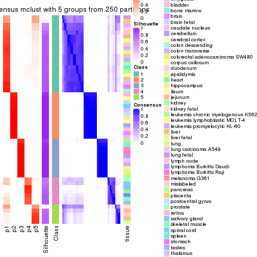</p>

</div>
<div id='tab-MAD-mclust-consensus-heatmap-5'>
<pre><code class="r">consensus_heatmap(res, k = 6)
</code></pre>

<p></p>

</div>
</div>

Heatmaps for the membership of samples in all partitions to see how consistent they are:


<script>
$( function() {
	$( '#tabs-MAD-mclust-membership-heatmap' ).tabs();
} );
</script>
<div id='tabs-MAD-mclust-membership-heatmap'>
<ul>
<li><a href='#tab-MAD-mclust-membership-heatmap-1'>k = 2</a></li>
<li><a href='#tab-MAD-mclust-membership-heatmap-2'>k = 3</a></li>
<li><a href='#tab-MAD-mclust-membership-heatmap-3'>k = 4</a></li>
<li><a href='#tab-MAD-mclust-membership-heatmap-4'>k = 5</a></li>
<li><a href='#tab-MAD-mclust-membership-heatmap-5'>k = 6</a></li>
</ul>
<div id='tab-MAD-mclust-membership-heatmap-1'>
<pre><code class="r">membership_heatmap(res, k = 2)
</code></pre>

<p></p>

</div>
<div id='tab-MAD-mclust-membership-heatmap-2'>
<pre><code class="r">membership_heatmap(res, k = 3)
</code></pre>

<p></p>

</div>
<div id='tab-MAD-mclust-membership-heatmap-3'>
<pre><code class="r">membership_heatmap(res, k = 4)
</code></pre>

<p></p>

</div>
<div id='tab-MAD-mclust-membership-heatmap-4'>
<pre><code class="r">membership_heatmap(res, k = 5)
</code></pre>

<p></p>

</div>
<div id='tab-MAD-mclust-membership-heatmap-5'>
<pre><code class="r">membership_heatmap(res, k = 6)
</code></pre>

<p></p>

</div>
</div>

As soon as we have had the classes for columns, we can look for signatures
which are significantly different between classes which can be candidate marks
for certain classes. Following are the heatmaps for signatures.


Signature heatmaps where rows are scaled:


<script>
$( function() {
	$( '#tabs-MAD-mclust-get-signatures' ).tabs();
} );
</script>
<div id='tabs-MAD-mclust-get-signatures'>
<ul>
<li><a href='#tab-MAD-mclust-get-signatures-1'>k = 2</a></li>
<li><a href='#tab-MAD-mclust-get-signatures-2'>k = 3</a></li>
<li><a href='#tab-MAD-mclust-get-signatures-3'>k = 4</a></li>
<li><a href='#tab-MAD-mclust-get-signatures-4'>k = 5</a></li>
<li><a href='#tab-MAD-mclust-get-signatures-5'>k = 6</a></li>
</ul>
<div id='tab-MAD-mclust-get-signatures-1'>
<pre><code class="r">get_signatures(res, k = 2)
</code></pre>

<p></p>

</div>
<div id='tab-MAD-mclust-get-signatures-2'>
<pre><code class="r">get_signatures(res, k = 3)
</code></pre>

<p></p>

</div>
<div id='tab-MAD-mclust-get-signatures-3'>
<pre><code class="r">get_signatures(res, k = 4)
</code></pre>

<p></p>

</div>
<div id='tab-MAD-mclust-get-signatures-4'>
<pre><code class="r">get_signatures(res, k = 5)
</code></pre>

<p>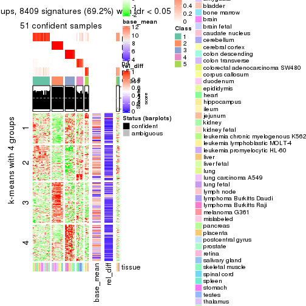</p>

</div>
<div id='tab-MAD-mclust-get-signatures-5'>
<pre><code class="r">get_signatures(res, k = 6)
</code></pre>

<p>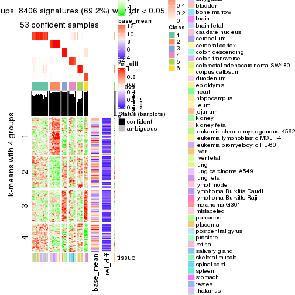</p>

</div>
</div>


Signature heatmaps where rows are not scaled:


<script>
$( function() {
	$( '#tabs-MAD-mclust-get-signatures-no-scale' ).tabs();
} );
</script>
<div id='tabs-MAD-mclust-get-signatures-no-scale'>
<ul>
<li><a href='#tab-MAD-mclust-get-signatures-no-scale-1'>k = 2</a></li>
<li><a href='#tab-MAD-mclust-get-signatures-no-scale-2'>k = 3</a></li>
<li><a href='#tab-MAD-mclust-get-signatures-no-scale-3'>k = 4</a></li>
<li><a href='#tab-MAD-mclust-get-signatures-no-scale-4'>k = 5</a></li>
<li><a href='#tab-MAD-mclust-get-signatures-no-scale-5'>k = 6</a></li>
</ul>
<div id='tab-MAD-mclust-get-signatures-no-scale-1'>
<pre><code class="r">get_signatures(res, k = 2, scale_rows = FALSE)
</code></pre>

<p></p>

</div>
<div id='tab-MAD-mclust-get-signatures-no-scale-2'>
<pre><code class="r">get_signatures(res, k = 3, scale_rows = FALSE)
</code></pre>

<p></p>

</div>
<div id='tab-MAD-mclust-get-signatures-no-scale-3'>
<pre><code class="r">get_signatures(res, k = 4, scale_rows = FALSE)
</code></pre>

<p></p>

</div>
<div id='tab-MAD-mclust-get-signatures-no-scale-4'>
<pre><code class="r">get_signatures(res, k = 5, scale_rows = FALSE)
</code></pre>

<p></p>

</div>
<div id='tab-MAD-mclust-get-signatures-no-scale-5'>
<pre><code class="r">get_signatures(res, k = 6, scale_rows = FALSE)
</code></pre>

<p></p>

</div>
</div>


Compare the overlap of signatures from different k:

```r
compare_signatures(res)
```


`get_signature()` returns a data frame invisibly. TO get the list of signatures, the function
call should be assigned to a variable explicitly. In following code, if `plot` argument is set
to `FALSE`, no heatmap is plotted while only the differential analysis is performed.

```r
# code only for demonstration
tb = get_signature(res, k = ..., plot = FALSE)
```

An example of the output of `tb` is:

```
#>   which_row         fdr    mean_1    mean_2 scaled_mean_1 scaled_mean_2 km
#> 1        38 0.042760348  8.373488  9.131774    -0.5533452     0.5164555  1
#> 2        40 0.018707592  7.106213  8.469186    -0.6173731     0.5762149  1
#> 3        55 0.019134737 10.221463 11.207825    -0.6159697     0.5749050  1
#> 4        59 0.006059896  5.921854  7.869574    -0.6899429     0.6439467  1
#> 5        60 0.018055526  8.928898 10.211722    -0.6204761     0.5791110  1
#> 6        98 0.009384629 15.714769 14.887706     0.6635654    -0.6193277  2
...
```

The columns in `tb` are:

1. `which_row`: row indices corresponding to the input matrix.
2. `fdr`: FDR for the differential test. 
3. `mean_x`: The mean value in group x.
4. `scaled_mean_x`: The mean value in group x after rows are scaled.
5. `km`: Row groups if k-means clustering is applied to rows.


UMAP plot which shows how samples are separated.


<script>
$( function() {
	$( '#tabs-MAD-mclust-dimension-reduction' ).tabs();
} );
</script>
<div id='tabs-MAD-mclust-dimension-reduction'>
<ul>
<li><a href='#tab-MAD-mclust-dimension-reduction-1'>k = 2</a></li>
<li><a href='#tab-MAD-mclust-dimension-reduction-2'>k = 3</a></li>
<li><a href='#tab-MAD-mclust-dimension-reduction-3'>k = 4</a></li>
<li><a href='#tab-MAD-mclust-dimension-reduction-4'>k = 5</a></li>
<li><a href='#tab-MAD-mclust-dimension-reduction-5'>k = 6</a></li>
</ul>
<div id='tab-MAD-mclust-dimension-reduction-1'>
<pre><code class="r">dimension_reduction(res, k = 2, method = &quot;UMAP&quot;)
</code></pre>

<p></p>

</div>
<div id='tab-MAD-mclust-dimension-reduction-2'>
<pre><code class="r">dimension_reduction(res, k = 3, method = &quot;UMAP&quot;)
</code></pre>

<p></p>

</div>
<div id='tab-MAD-mclust-dimension-reduction-3'>
<pre><code class="r">dimension_reduction(res, k = 4, method = &quot;UMAP&quot;)
</code></pre>

<p></p>

</div>
<div id='tab-MAD-mclust-dimension-reduction-4'>
<pre><code class="r">dimension_reduction(res, k = 5, method = &quot;UMAP&quot;)
</code></pre>

<p></p>

</div>
<div id='tab-MAD-mclust-dimension-reduction-5'>
<pre><code class="r">dimension_reduction(res, k = 6, method = &quot;UMAP&quot;)
</code></pre>

<p></p>

</div>
</div>


Following heatmap shows how subgroups are split when increasing `k`:

```r
collect_classes(res)
```


Test correlation between subgroups and known annotations. If the known
annotation is numeric, one-way ANOVA test is applied, and if the known
annotation is discrete, chi-squared contingency table test is applied.

```r
test_to_known_factors(res)
```

```
#>             n tissue(p) k
#> MAD:mclust 53     0.397 2
#> MAD:mclust 53     0.373 3
#> MAD:mclust 52     0.352 4
#> MAD:mclust 51     0.482 5
#> MAD:mclust 53     0.417 6
```


If matrix rows can be associated to genes, consider to use `functional_enrichment(res,
...)` to perform function enrichment for the signature genes. See [this vignette](http://bioconductor.org/packages/devel/bioc/vignettes/cola/inst/doc/functional_enrichment.html) for more detailed explanations.


 

---------------------------------------------------


### MAD:NMF**


The object with results only for a single top-value method and a single partition method 
can be extracted as:

```r
res = res_list["MAD", "NMF"]
# you can also extract it by
# res = res_list["MAD:NMF"]
```

A summary of `res` and all the functions that can be applied to it:

```r
res
```

```
#> A 'ConsensusPartition' object with k = 2, 3, 4, 5, 6.
#>   On a matrix with 12150 rows and 54 columns.
#>   Top rows (1000, 2000, 3000, 4000, 5000) are extracted by 'MAD' method.
#>   Subgroups are detected by 'NMF' method.
#>   Performed in total 1250 partitions by row resampling.
#>   Best k for subgroups seems to be 3.
#> 
#> Following methods can be applied to this 'ConsensusPartition' object:
#>  [1] "cola_report"             "collect_classes"         "collect_plots"          
#>  [4] "collect_stats"           "colnames"                "compare_signatures"     
#>  [7] "consensus_heatmap"       "dimension_reduction"     "functional_enrichment"  
#> [10] "get_anno_col"            "get_anno"                "get_classes"            
#> [13] "get_consensus"           "get_matrix"              "get_membership"         
#> [16] "get_param"               "get_signatures"          "get_stats"              
#> [19] "is_best_k"               "is_stable_k"             "membership_heatmap"     
#> [22] "ncol"                    "nrow"                    "plot_ecdf"              
#> [25] "rownames"                "select_partition_number" "show"                   
#> [28] "suggest_best_k"          "test_to_known_factors"
```

`collect_plots()` function collects all the plots made from `res` for all `k` (number of partitions)
into one single page to provide an easy and fast comparison between different `k`.

```r
collect_plots(res)
```


The plots are:

- The first row: a plot of the ECDF (empirical cumulative distribution
  function) curves of the consensus matrix for each `k` and the heatmap of
  predicted classes for each `k`.
- The second row: heatmaps of the consensus matrix for each `k`.
- The third row: heatmaps of the membership matrix for each `k`.
- The fouth row: heatmaps of the signatures for each `k`.

All the plots in panels can be made by individual functions and they are
plotted later in this section.

`select_partition_number()` produces several plots showing different
statistics for choosing "optimized" `k`. There are following statistics:

- ECDF curves of the consensus matrix for each `k`;
- 1-PAC. [The PAC
  score](https://en.wikipedia.org/wiki/Consensus_clustering#Over-interpretation_potential_of_consensus_clustering)
  measures the proportion of the ambiguous subgrouping.
- Mean silhouette score.
- Concordance. The mean probability of fiting the consensus class ids in all
  partitions.
- Area increased. Denote $A_k$ as the area under the ECDF curve for current
  `k`, the area increased is defined as $A_k - A_{k-1}$.
- Rand index. The percent of pairs of samples that are both in a same cluster
  or both are not in a same cluster in the partition of k and k-1.
- Jaccard index. The ratio of pairs of samples are both in a same cluster in
  the partition of k and k-1 and the pairs of samples are both in a same
  cluster in the partition k or k-1.

The detailed explanations of these statistics can be found in [the _cola_
vignette](http://bioconductor.org/packages/devel/bioc/vignettes/cola/inst/doc/cola.html#toc_13).

Generally speaking, lower PAC score, higher mean silhouette score or higher
concordance corresponds to better partition. Rand index and Jaccard index
measure how similar the current partition is compared to partition with `k-1`.
If they are too similar, we won't accept `k` is better than `k-1`.

```r
select_partition_number(res)
```


The numeric values for all these statistics can be obtained by `get_stats()`.

```r
get_stats(res)
```

```
#>   k 1-PAC mean_silhouette concordance area_increased  Rand Jaccard
#> 2 2 1.000           0.982       0.992         0.3614 0.648   0.648
#> 3 3 1.000           0.998       0.999         0.6367 0.762   0.632
#> 4 4 0.752           0.653       0.820         0.2255 0.859   0.660
#> 5 5 0.828           0.800       0.902         0.0897 0.909   0.688
#> 6 6 0.836           0.707       0.851         0.0461 0.939   0.731
```

`suggest_best_k()` suggests the best $k$ based on these statistics. The rules are as follows:

- All $k$ with Jaccard index larger than 0.95 are removed because increasing
  $k$ does not provide enough extra information. If all $k$ are removed, it is
  marked as no subgroup is detected.
- For all $k$ with 1-PAC score larger than 0.9, the maximal $k$ is taken as
  the best $k$, and other $k$ are marked as optional $k$.
- If it does not fit the second rule. The $k$ with the maximal vote of the
  highest 1-PAC score, highest mean silhouette, and highest concordance is
  taken as the best $k$.

```r
suggest_best_k(res)
```

```
#> [1] 3
#> attr(,"optional")
#> [1] 2
```

There is also optional best $k$ = 2 that is worth to check.

Following shows the table of the partitions (You need to click the **show/hide
code output** link to see it). The membership matrix (columns with name `p*`)
is inferred by
[`clue::cl_consensus()`](https://www.rdocumentation.org/link/cl_consensus?package=clue)
function with the `SE` method. Basically the value in the membership matrix
represents the probability to belong to a certain group. The finall class
label for an item is determined with the group with highest probability it
belongs to.

In `get_classes()` function, the entropy is calculated from the membership
matrix and the silhouette score is calculated from the consensus matrix.


<script>
$( function() {
	$( '#tabs-MAD-NMF-get-classes' ).tabs();
} );
</script>
<div id='tabs-MAD-NMF-get-classes'>
<ul>
<li><a href='#tab-MAD-NMF-get-classes-1'>k = 2</a></li>
<li><a href='#tab-MAD-NMF-get-classes-2'>k = 3</a></li>
<li><a href='#tab-MAD-NMF-get-classes-3'>k = 4</a></li>
<li><a href='#tab-MAD-NMF-get-classes-4'>k = 5</a></li>
<li><a href='#tab-MAD-NMF-get-classes-5'>k = 6</a></li>
</ul>

<div id='tab-MAD-NMF-get-classes-1'>
<p><a id='tab-MAD-NMF-get-classes-1-a' style='color:#0366d6' href='#'>show/hide code output</a></p>
<pre><code class="r">cbind(get_classes(res, k = 2), get_membership(res, k = 2))
</code></pre>

<pre><code>#&gt;          class entropy silhouette    p1    p2
#&gt; GSM28815     1  0.0000      0.989 1.000 0.000
#&gt; GSM28816     1  0.7376      0.743 0.792 0.208
#&gt; GSM28817     1  0.0000      0.989 1.000 0.000
#&gt; GSM11327     1  0.0000      0.989 1.000 0.000
#&gt; GSM28825     2  0.0000      1.000 0.000 1.000
#&gt; GSM11322     2  0.0000      1.000 0.000 1.000
#&gt; GSM28828     2  0.0000      1.000 0.000 1.000
#&gt; GSM11346     2  0.0000      1.000 0.000 1.000
#&gt; GSM28808     2  0.0000      1.000 0.000 1.000
#&gt; GSM11332     2  0.0000      1.000 0.000 1.000
#&gt; GSM28811     2  0.0000      1.000 0.000 1.000
#&gt; GSM11334     2  0.0000      1.000 0.000 1.000
#&gt; GSM11340     2  0.0000      1.000 0.000 1.000
#&gt; GSM28812     2  0.0000      1.000 0.000 1.000
#&gt; GSM11345     1  0.0000      0.989 1.000 0.000
#&gt; GSM28819     1  0.0000      0.989 1.000 0.000
#&gt; GSM11321     1  0.0000      0.989 1.000 0.000
#&gt; GSM28820     1  0.0000      0.989 1.000 0.000
#&gt; GSM11339     1  0.0000      0.989 1.000 0.000
#&gt; GSM28804     1  0.7674      0.719 0.776 0.224
#&gt; GSM28823     1  0.0000      0.989 1.000 0.000
#&gt; GSM11336     1  0.0000      0.989 1.000 0.000
#&gt; GSM11342     1  0.0000      0.989 1.000 0.000
#&gt; GSM11333     1  0.0000      0.989 1.000 0.000
#&gt; GSM28802     1  0.0000      0.989 1.000 0.000
#&gt; GSM28803     1  0.0000      0.989 1.000 0.000
#&gt; GSM11343     1  0.0000      0.989 1.000 0.000
#&gt; GSM11347     1  0.0000      0.989 1.000 0.000
#&gt; GSM28824     1  0.0000      0.989 1.000 0.000
#&gt; GSM28813     1  0.0000      0.989 1.000 0.000
#&gt; GSM28827     1  0.0000      0.989 1.000 0.000
#&gt; GSM11337     1  0.0000      0.989 1.000 0.000
#&gt; GSM28814     1  0.0000      0.989 1.000 0.000
#&gt; GSM11331     1  0.0000      0.989 1.000 0.000
#&gt; GSM11344     1  0.0000      0.989 1.000 0.000
#&gt; GSM11330     1  0.0000      0.989 1.000 0.000
#&gt; GSM11325     1  0.0000      0.989 1.000 0.000
#&gt; GSM11338     1  0.0000      0.989 1.000 0.000
#&gt; GSM28806     1  0.0000      0.989 1.000 0.000
#&gt; GSM28826     1  0.0000      0.989 1.000 0.000
#&gt; GSM28818     1  0.0000      0.989 1.000 0.000
#&gt; GSM28821     2  0.0000      1.000 0.000 1.000
#&gt; GSM28807     1  0.0000      0.989 1.000 0.000
#&gt; GSM28822     1  0.0000      0.989 1.000 0.000
#&gt; GSM11328     2  0.0000      1.000 0.000 1.000
#&gt; GSM11323     1  0.0000      0.989 1.000 0.000
#&gt; GSM11324     1  0.0000      0.989 1.000 0.000
#&gt; GSM11341     1  0.0672      0.982 0.992 0.008
#&gt; GSM11326     1  0.0000      0.989 1.000 0.000
#&gt; GSM28810     1  0.0000      0.989 1.000 0.000
#&gt; GSM11335     1  0.0000      0.989 1.000 0.000
#&gt; GSM28809     1  0.0000      0.989 1.000 0.000
#&gt; GSM11329     1  0.0000      0.989 1.000 0.000
#&gt; GSM28805     1  0.0000      0.989 1.000 0.000
</code></pre>

<script>
$('#tab-MAD-NMF-get-classes-1-a').parent().next().next().hide();
$('#tab-MAD-NMF-get-classes-1-a').click(function(){
  $('#tab-MAD-NMF-get-classes-1-a').parent().next().next().toggle();
  return(false);
});
</script>
</div>

<div id='tab-MAD-NMF-get-classes-2'>
<p><a id='tab-MAD-NMF-get-classes-2-a' style='color:#0366d6' href='#'>show/hide code output</a></p>
<pre><code class="r">cbind(get_classes(res, k = 3), get_membership(res, k = 3))
</code></pre>

<pre><code>#&gt;          class entropy silhouette    p1    p2    p3
#&gt; GSM28815     1  0.0000      0.998 1.000 0.000 0.000
#&gt; GSM28816     1  0.0592      0.987 0.988 0.012 0.000
#&gt; GSM28817     1  0.0000      0.998 1.000 0.000 0.000
#&gt; GSM11327     3  0.0000      0.999 0.000 0.000 1.000
#&gt; GSM28825     2  0.0000      1.000 0.000 1.000 0.000
#&gt; GSM11322     2  0.0000      1.000 0.000 1.000 0.000
#&gt; GSM28828     2  0.0000      1.000 0.000 1.000 0.000
#&gt; GSM11346     2  0.0000      1.000 0.000 1.000 0.000
#&gt; GSM28808     2  0.0000      1.000 0.000 1.000 0.000
#&gt; GSM11332     2  0.0000      1.000 0.000 1.000 0.000
#&gt; GSM28811     2  0.0000      1.000 0.000 1.000 0.000
#&gt; GSM11334     2  0.0000      1.000 0.000 1.000 0.000
#&gt; GSM11340     2  0.0000      1.000 0.000 1.000 0.000
#&gt; GSM28812     2  0.0000      1.000 0.000 1.000 0.000
#&gt; GSM11345     1  0.0000      0.998 1.000 0.000 0.000
#&gt; GSM28819     1  0.0000      0.998 1.000 0.000 0.000
#&gt; GSM11321     3  0.0000      0.999 0.000 0.000 1.000
#&gt; GSM28820     1  0.0000      0.998 1.000 0.000 0.000
#&gt; GSM11339     1  0.0000      0.998 1.000 0.000 0.000
#&gt; GSM28804     1  0.0000      0.998 1.000 0.000 0.000
#&gt; GSM28823     1  0.0000      0.998 1.000 0.000 0.000
#&gt; GSM11336     1  0.0000      0.998 1.000 0.000 0.000
#&gt; GSM11342     1  0.0000      0.998 1.000 0.000 0.000
#&gt; GSM11333     1  0.0000      0.998 1.000 0.000 0.000
#&gt; GSM28802     1  0.0000      0.998 1.000 0.000 0.000
#&gt; GSM28803     3  0.0000      0.999 0.000 0.000 1.000
#&gt; GSM11343     3  0.0000      0.999 0.000 0.000 1.000
#&gt; GSM11347     3  0.0000      0.999 0.000 0.000 1.000
#&gt; GSM28824     1  0.0000      0.998 1.000 0.000 0.000
#&gt; GSM28813     1  0.1411      0.963 0.964 0.000 0.036
#&gt; GSM28827     1  0.0000      0.998 1.000 0.000 0.000
#&gt; GSM11337     1  0.0000      0.998 1.000 0.000 0.000
#&gt; GSM28814     3  0.0000      0.999 0.000 0.000 1.000
#&gt; GSM11331     1  0.0237      0.995 0.996 0.000 0.004
#&gt; GSM11344     3  0.0000      0.999 0.000 0.000 1.000
#&gt; GSM11330     3  0.0000      0.999 0.000 0.000 1.000
#&gt; GSM11325     3  0.0000      0.999 0.000 0.000 1.000
#&gt; GSM11338     1  0.0000      0.998 1.000 0.000 0.000
#&gt; GSM28806     1  0.0000      0.998 1.000 0.000 0.000
#&gt; GSM28826     1  0.0000      0.998 1.000 0.000 0.000
#&gt; GSM28818     1  0.0000      0.998 1.000 0.000 0.000
#&gt; GSM28821     2  0.0000      1.000 0.000 1.000 0.000
#&gt; GSM28807     1  0.0000      0.998 1.000 0.000 0.000
#&gt; GSM28822     1  0.0000      0.998 1.000 0.000 0.000
#&gt; GSM11328     2  0.0000      1.000 0.000 1.000 0.000
#&gt; GSM11323     1  0.0000      0.998 1.000 0.000 0.000
#&gt; GSM11324     1  0.0000      0.998 1.000 0.000 0.000
#&gt; GSM11341     3  0.0592      0.988 0.000 0.012 0.988
#&gt; GSM11326     3  0.0000      0.999 0.000 0.000 1.000
#&gt; GSM28810     1  0.0000      0.998 1.000 0.000 0.000
#&gt; GSM11335     1  0.0000      0.998 1.000 0.000 0.000
#&gt; GSM28809     1  0.0000      0.998 1.000 0.000 0.000
#&gt; GSM11329     1  0.0000      0.998 1.000 0.000 0.000
#&gt; GSM28805     1  0.0000      0.998 1.000 0.000 0.000
</code></pre>

<script>
$('#tab-MAD-NMF-get-classes-2-a').parent().next().next().hide();
$('#tab-MAD-NMF-get-classes-2-a').click(function(){
  $('#tab-MAD-NMF-get-classes-2-a').parent().next().next().toggle();
  return(false);
});
</script>
</div>

<div id='tab-MAD-NMF-get-classes-3'>
<p><a id='tab-MAD-NMF-get-classes-3-a' style='color:#0366d6' href='#'>show/hide code output</a></p>
<pre><code class="r">cbind(get_classes(res, k = 4), get_membership(res, k = 4))
</code></pre>

<pre><code>#&gt;          class entropy silhouette    p1    p2    p3    p4
#&gt; GSM28815     1  0.3219     0.6083 0.836 0.000 0.000 0.164
#&gt; GSM28816     4  0.6081    -0.4058 0.472 0.044 0.000 0.484
#&gt; GSM28817     1  0.0817     0.6519 0.976 0.000 0.000 0.024
#&gt; GSM11327     3  0.1389     0.9216 0.000 0.000 0.952 0.048
#&gt; GSM28825     2  0.0000     1.0000 0.000 1.000 0.000 0.000
#&gt; GSM11322     2  0.0000     1.0000 0.000 1.000 0.000 0.000
#&gt; GSM28828     2  0.0000     1.0000 0.000 1.000 0.000 0.000
#&gt; GSM11346     2  0.0000     1.0000 0.000 1.000 0.000 0.000
#&gt; GSM28808     2  0.0000     1.0000 0.000 1.000 0.000 0.000
#&gt; GSM11332     2  0.0000     1.0000 0.000 1.000 0.000 0.000
#&gt; GSM28811     2  0.0000     1.0000 0.000 1.000 0.000 0.000
#&gt; GSM11334     2  0.0000     1.0000 0.000 1.000 0.000 0.000
#&gt; GSM11340     2  0.0000     1.0000 0.000 1.000 0.000 0.000
#&gt; GSM28812     2  0.0000     1.0000 0.000 1.000 0.000 0.000
#&gt; GSM11345     1  0.1118     0.6299 0.964 0.000 0.000 0.036
#&gt; GSM28819     1  0.0921     0.6570 0.972 0.000 0.000 0.028
#&gt; GSM11321     3  0.1716     0.9176 0.000 0.000 0.936 0.064
#&gt; GSM28820     1  0.1557     0.6523 0.944 0.000 0.000 0.056
#&gt; GSM11339     1  0.4222     0.1522 0.728 0.000 0.000 0.272
#&gt; GSM28804     4  0.4855     0.5968 0.400 0.000 0.000 0.600
#&gt; GSM28823     1  0.0921     0.6547 0.972 0.000 0.000 0.028
#&gt; GSM11336     1  0.4977     0.4058 0.540 0.000 0.000 0.460
#&gt; GSM11342     1  0.0921     0.6572 0.972 0.000 0.000 0.028
#&gt; GSM11333     4  0.4955    -0.3697 0.444 0.000 0.000 0.556
#&gt; GSM28802     1  0.4454     0.5028 0.692 0.000 0.000 0.308
#&gt; GSM28803     3  0.1557     0.9211 0.000 0.000 0.944 0.056
#&gt; GSM11343     3  0.0000     0.9287 0.000 0.000 1.000 0.000
#&gt; GSM11347     3  0.0000     0.9287 0.000 0.000 1.000 0.000
#&gt; GSM28824     1  0.4977     0.4058 0.540 0.000 0.000 0.460
#&gt; GSM28813     1  0.5850     0.3745 0.512 0.000 0.032 0.456
#&gt; GSM28827     1  0.0707     0.6475 0.980 0.000 0.000 0.020
#&gt; GSM11337     1  0.4817     0.4639 0.612 0.000 0.000 0.388
#&gt; GSM28814     3  0.3764     0.8052 0.000 0.000 0.784 0.216
#&gt; GSM11331     1  0.3047     0.5644 0.872 0.000 0.012 0.116
#&gt; GSM11344     3  0.0000     0.9287 0.000 0.000 1.000 0.000
#&gt; GSM11330     3  0.0188     0.9279 0.000 0.000 0.996 0.004
#&gt; GSM11325     3  0.4391     0.7612 0.008 0.000 0.740 0.252
#&gt; GSM11338     1  0.4907     0.4417 0.580 0.000 0.000 0.420
#&gt; GSM28806     1  0.4843    -0.3213 0.604 0.000 0.000 0.396
#&gt; GSM28826     1  0.4916     0.4388 0.576 0.000 0.000 0.424
#&gt; GSM28818     4  0.4925     0.5883 0.428 0.000 0.000 0.572
#&gt; GSM28821     2  0.0000     1.0000 0.000 1.000 0.000 0.000
#&gt; GSM28807     4  0.4866     0.5989 0.404 0.000 0.000 0.596
#&gt; GSM28822     4  0.4866     0.5998 0.404 0.000 0.000 0.596
#&gt; GSM11328     2  0.0000     1.0000 0.000 1.000 0.000 0.000
#&gt; GSM11323     1  0.3300     0.5159 0.848 0.000 0.008 0.144
#&gt; GSM11324     1  0.0921     0.6426 0.972 0.000 0.000 0.028
#&gt; GSM11341     4  0.5799    -0.0467 0.024 0.004 0.420 0.552
#&gt; GSM11326     3  0.0336     0.9274 0.000 0.000 0.992 0.008
#&gt; GSM28810     4  0.4985     0.5392 0.468 0.000 0.000 0.532
#&gt; GSM11335     4  0.5310     0.5897 0.412 0.000 0.012 0.576
#&gt; GSM28809     1  0.2814     0.5366 0.868 0.000 0.000 0.132
#&gt; GSM11329     1  0.0592     0.6446 0.984 0.000 0.000 0.016
#&gt; GSM28805     1  0.0592     0.6565 0.984 0.000 0.000 0.016
</code></pre>

<script>
$('#tab-MAD-NMF-get-classes-3-a').parent().next().next().hide();
$('#tab-MAD-NMF-get-classes-3-a').click(function(){
  $('#tab-MAD-NMF-get-classes-3-a').parent().next().next().toggle();
  return(false);
});
</script>
</div>

<div id='tab-MAD-NMF-get-classes-4'>
<p><a id='tab-MAD-NMF-get-classes-4-a' style='color:#0366d6' href='#'>show/hide code output</a></p>
<pre><code class="r">cbind(get_classes(res, k = 5), get_membership(res, k = 5))
</code></pre>

<pre><code>#&gt;          class entropy silhouette    p1    p2    p3    p4    p5
#&gt; GSM28815     1  0.4470     0.3921 0.616 0.000 0.000 0.012 0.372
#&gt; GSM28816     5  0.1960     0.8357 0.048 0.004 0.000 0.020 0.928
#&gt; GSM28817     1  0.0510     0.8493 0.984 0.000 0.000 0.000 0.016
#&gt; GSM11327     3  0.2136     0.8384 0.000 0.000 0.904 0.008 0.088
#&gt; GSM28825     2  0.0000     1.0000 0.000 1.000 0.000 0.000 0.000
#&gt; GSM11322     2  0.0000     1.0000 0.000 1.000 0.000 0.000 0.000
#&gt; GSM28828     2  0.0000     1.0000 0.000 1.000 0.000 0.000 0.000
#&gt; GSM11346     2  0.0000     1.0000 0.000 1.000 0.000 0.000 0.000
#&gt; GSM28808     2  0.0000     1.0000 0.000 1.000 0.000 0.000 0.000
#&gt; GSM11332     2  0.0000     1.0000 0.000 1.000 0.000 0.000 0.000
#&gt; GSM28811     2  0.0000     1.0000 0.000 1.000 0.000 0.000 0.000
#&gt; GSM11334     2  0.0000     1.0000 0.000 1.000 0.000 0.000 0.000
#&gt; GSM11340     2  0.0000     1.0000 0.000 1.000 0.000 0.000 0.000
#&gt; GSM28812     2  0.0000     1.0000 0.000 1.000 0.000 0.000 0.000
#&gt; GSM11345     1  0.0000     0.8491 1.000 0.000 0.000 0.000 0.000
#&gt; GSM28819     1  0.1124     0.8414 0.960 0.000 0.000 0.036 0.004
#&gt; GSM11321     3  0.3989     0.7857 0.008 0.000 0.800 0.048 0.144
#&gt; GSM28820     1  0.0898     0.8488 0.972 0.000 0.000 0.020 0.008
#&gt; GSM11339     1  0.2358     0.7884 0.888 0.000 0.000 0.104 0.008
#&gt; GSM28804     4  0.1768     0.9163 0.072 0.000 0.000 0.924 0.004
#&gt; GSM28823     1  0.0609     0.8472 0.980 0.000 0.000 0.020 0.000
#&gt; GSM11336     5  0.1121     0.8363 0.044 0.000 0.000 0.000 0.956
#&gt; GSM11342     1  0.0771     0.8473 0.976 0.000 0.000 0.020 0.004
#&gt; GSM11333     5  0.1965     0.8336 0.052 0.000 0.000 0.024 0.924
#&gt; GSM28802     1  0.5229     0.1877 0.548 0.000 0.000 0.048 0.404
#&gt; GSM28803     3  0.2997     0.8089 0.000 0.000 0.840 0.012 0.148
#&gt; GSM11343     3  0.0880     0.8684 0.000 0.000 0.968 0.000 0.032
#&gt; GSM11347     3  0.0000     0.8726 0.000 0.000 1.000 0.000 0.000
#&gt; GSM28824     5  0.0703     0.8287 0.024 0.000 0.000 0.000 0.976
#&gt; GSM28813     5  0.0566     0.8185 0.012 0.000 0.004 0.000 0.984
#&gt; GSM28827     1  0.0671     0.8486 0.980 0.000 0.000 0.004 0.016
#&gt; GSM11337     1  0.4449     0.0653 0.512 0.000 0.000 0.004 0.484
#&gt; GSM28814     3  0.5375     0.2040 0.004 0.000 0.500 0.044 0.452
#&gt; GSM11331     1  0.3354     0.7947 0.864 0.000 0.064 0.044 0.028
#&gt; GSM11344     3  0.0000     0.8726 0.000 0.000 1.000 0.000 0.000
#&gt; GSM11330     3  0.0000     0.8726 0.000 0.000 1.000 0.000 0.000
#&gt; GSM11325     5  0.5901    -0.1194 0.016 0.000 0.404 0.064 0.516
#&gt; GSM11338     5  0.2966     0.7464 0.184 0.000 0.000 0.000 0.816
#&gt; GSM28806     1  0.4430     0.3534 0.628 0.000 0.000 0.360 0.012
#&gt; GSM28826     5  0.3242     0.7035 0.216 0.000 0.000 0.000 0.784
#&gt; GSM28818     4  0.2329     0.8999 0.124 0.000 0.000 0.876 0.000
#&gt; GSM28821     2  0.0000     1.0000 0.000 1.000 0.000 0.000 0.000
#&gt; GSM28807     4  0.1608     0.9170 0.072 0.000 0.000 0.928 0.000
#&gt; GSM28822     4  0.1608     0.9170 0.072 0.000 0.000 0.928 0.000
#&gt; GSM11328     2  0.0000     1.0000 0.000 1.000 0.000 0.000 0.000
#&gt; GSM11323     1  0.3274     0.7999 0.868 0.000 0.048 0.060 0.024
#&gt; GSM11324     1  0.0404     0.8492 0.988 0.000 0.000 0.000 0.012
#&gt; GSM11341     4  0.1671     0.8358 0.000 0.000 0.076 0.924 0.000
#&gt; GSM11326     3  0.1116     0.8585 0.004 0.000 0.964 0.028 0.004
#&gt; GSM28810     4  0.3861     0.6894 0.284 0.000 0.004 0.712 0.000
#&gt; GSM11335     4  0.2416     0.9079 0.100 0.000 0.012 0.888 0.000
#&gt; GSM28809     1  0.2928     0.8005 0.872 0.000 0.000 0.064 0.064
#&gt; GSM11329     1  0.0162     0.8497 0.996 0.000 0.000 0.000 0.004
#&gt; GSM28805     1  0.0162     0.8497 0.996 0.000 0.000 0.000 0.004
</code></pre>

<script>
$('#tab-MAD-NMF-get-classes-4-a').parent().next().next().hide();
$('#tab-MAD-NMF-get-classes-4-a').click(function(){
  $('#tab-MAD-NMF-get-classes-4-a').parent().next().next().toggle();
  return(false);
});
</script>
</div>

<div id='tab-MAD-NMF-get-classes-5'>
<p><a id='tab-MAD-NMF-get-classes-5-a' style='color:#0366d6' href='#'>show/hide code output</a></p>
<pre><code class="r">cbind(get_classes(res, k = 6), get_membership(res, k = 6))
</code></pre>

<pre><code>#&gt;          class entropy silhouette    p1 p2    p3    p4    p5    p6
#&gt; GSM28815     5  0.5715    0.28783 0.364  0 0.000 0.004 0.484 0.148
#&gt; GSM28816     5  0.3430    0.68018 0.004  0 0.000 0.016 0.772 0.208
#&gt; GSM28817     1  0.0972    0.81146 0.964  0 0.000 0.000 0.008 0.028
#&gt; GSM11327     3  0.5135    0.41560 0.000  0 0.616 0.000 0.240 0.144
#&gt; GSM28825     2  0.0000    1.00000 0.000  1 0.000 0.000 0.000 0.000
#&gt; GSM11322     2  0.0000    1.00000 0.000  1 0.000 0.000 0.000 0.000
#&gt; GSM28828     2  0.0000    1.00000 0.000  1 0.000 0.000 0.000 0.000
#&gt; GSM11346     2  0.0000    1.00000 0.000  1 0.000 0.000 0.000 0.000
#&gt; GSM28808     2  0.0000    1.00000 0.000  1 0.000 0.000 0.000 0.000
#&gt; GSM11332     2  0.0000    1.00000 0.000  1 0.000 0.000 0.000 0.000
#&gt; GSM28811     2  0.0000    1.00000 0.000  1 0.000 0.000 0.000 0.000
#&gt; GSM11334     2  0.0000    1.00000 0.000  1 0.000 0.000 0.000 0.000
#&gt; GSM11340     2  0.0000    1.00000 0.000  1 0.000 0.000 0.000 0.000
#&gt; GSM28812     2  0.0000    1.00000 0.000  1 0.000 0.000 0.000 0.000
#&gt; GSM11345     1  0.0363    0.81381 0.988  0 0.000 0.000 0.000 0.012
#&gt; GSM28819     1  0.1141    0.80036 0.948  0 0.000 0.000 0.000 0.052
#&gt; GSM11321     6  0.4718    0.32611 0.036  0 0.384 0.000 0.008 0.572
#&gt; GSM28820     1  0.0777    0.81269 0.972  0 0.000 0.000 0.004 0.024
#&gt; GSM11339     1  0.2765    0.77827 0.876  0 0.000 0.064 0.016 0.044
#&gt; GSM28804     4  0.0790    0.85682 0.000  0 0.000 0.968 0.000 0.032
#&gt; GSM28823     1  0.0713    0.81019 0.972  0 0.000 0.000 0.000 0.028
#&gt; GSM11336     5  0.0146    0.76526 0.004  0 0.000 0.000 0.996 0.000
#&gt; GSM11342     1  0.0790    0.81112 0.968  0 0.000 0.000 0.000 0.032
#&gt; GSM11333     5  0.4675    0.63672 0.008  0 0.000 0.096 0.696 0.200
#&gt; GSM28802     1  0.4536    0.05544 0.496  0 0.004 0.000 0.024 0.476
#&gt; GSM28803     3  0.4384    0.07497 0.000  0 0.616 0.000 0.036 0.348
#&gt; GSM11343     3  0.1858    0.63892 0.000  0 0.904 0.000 0.004 0.092
#&gt; GSM11347     3  0.0000    0.71553 0.000  0 1.000 0.000 0.000 0.000
#&gt; GSM28824     5  0.0146    0.76349 0.000  0 0.000 0.000 0.996 0.004
#&gt; GSM28813     5  0.0547    0.76045 0.000  0 0.000 0.000 0.980 0.020
#&gt; GSM28827     1  0.2858    0.74569 0.844  0 0.000 0.000 0.032 0.124
#&gt; GSM11337     5  0.3876    0.65989 0.108  0 0.000 0.000 0.772 0.120
#&gt; GSM28814     6  0.5193    0.34401 0.000  0 0.344 0.000 0.104 0.552
#&gt; GSM11331     6  0.7358   -0.20554 0.340  0 0.224 0.016 0.068 0.352
#&gt; GSM11344     3  0.0000    0.71553 0.000  0 1.000 0.000 0.000 0.000
#&gt; GSM11330     3  0.0713    0.71071 0.000  0 0.972 0.000 0.000 0.028
#&gt; GSM11325     6  0.5514    0.42032 0.060  0 0.244 0.000 0.068 0.628
#&gt; GSM11338     5  0.1594    0.76062 0.052  0 0.000 0.000 0.932 0.016
#&gt; GSM28806     1  0.4500    0.57983 0.708  0 0.000 0.144 0.000 0.148
#&gt; GSM28826     5  0.4897    0.58450 0.092  0 0.000 0.000 0.616 0.292
#&gt; GSM28818     4  0.1594    0.85409 0.052  0 0.000 0.932 0.000 0.016
#&gt; GSM28821     2  0.0000    1.00000 0.000  1 0.000 0.000 0.000 0.000
#&gt; GSM28807     4  0.0458    0.87152 0.000  0 0.000 0.984 0.000 0.016
#&gt; GSM28822     4  0.0000    0.87251 0.000  0 0.000 1.000 0.000 0.000
#&gt; GSM11328     2  0.0000    1.00000 0.000  1 0.000 0.000 0.000 0.000
#&gt; GSM11323     1  0.7330   -0.00162 0.380  0 0.176 0.024 0.068 0.352
#&gt; GSM11324     1  0.1124    0.81033 0.956  0 0.000 0.000 0.008 0.036
#&gt; GSM11341     4  0.0000    0.87251 0.000  0 0.000 1.000 0.000 0.000
#&gt; GSM11326     3  0.3240    0.55377 0.000  0 0.752 0.000 0.004 0.244
#&gt; GSM28810     4  0.4135    0.52000 0.300  0 0.000 0.668 0.000 0.032
#&gt; GSM11335     4  0.4065    0.76343 0.044  0 0.064 0.792 0.000 0.100
#&gt; GSM28809     1  0.5880    0.50119 0.604  0 0.000 0.048 0.144 0.204
#&gt; GSM11329     1  0.0291    0.81437 0.992  0 0.000 0.000 0.004 0.004
#&gt; GSM28805     1  0.1333    0.80519 0.944  0 0.000 0.000 0.008 0.048
</code></pre>

<script>
$('#tab-MAD-NMF-get-classes-5-a').parent().next().next().hide();
$('#tab-MAD-NMF-get-classes-5-a').click(function(){
  $('#tab-MAD-NMF-get-classes-5-a').parent().next().next().toggle();
  return(false);
});
</script>
</div>
</div>

Heatmaps for the consensus matrix. It visualizes the probability of two
samples to be in a same group.


<script>
$( function() {
	$( '#tabs-MAD-NMF-consensus-heatmap' ).tabs();
} );
</script>
<div id='tabs-MAD-NMF-consensus-heatmap'>
<ul>
<li><a href='#tab-MAD-NMF-consensus-heatmap-1'>k = 2</a></li>
<li><a href='#tab-MAD-NMF-consensus-heatmap-2'>k = 3</a></li>
<li><a href='#tab-MAD-NMF-consensus-heatmap-3'>k = 4</a></li>
<li><a href='#tab-MAD-NMF-consensus-heatmap-4'>k = 5</a></li>
<li><a href='#tab-MAD-NMF-consensus-heatmap-5'>k = 6</a></li>
</ul>
<div id='tab-MAD-NMF-consensus-heatmap-1'>
<pre><code class="r">consensus_heatmap(res, k = 2)
</code></pre>

<p></p>

</div>
<div id='tab-MAD-NMF-consensus-heatmap-2'>
<pre><code class="r">consensus_heatmap(res, k = 3)
</code></pre>

<p></p>

</div>
<div id='tab-MAD-NMF-consensus-heatmap-3'>
<pre><code class="r">consensus_heatmap(res, k = 4)
</code></pre>

<p></p>

</div>
<div id='tab-MAD-NMF-consensus-heatmap-4'>
<pre><code class="r">consensus_heatmap(res, k = 5)
</code></pre>

<p>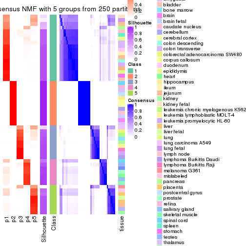</p>

</div>
<div id='tab-MAD-NMF-consensus-heatmap-5'>
<pre><code class="r">consensus_heatmap(res, k = 6)
</code></pre>

<p></p>

</div>
</div>

Heatmaps for the membership of samples in all partitions to see how consistent they are:


<script>
$( function() {
	$( '#tabs-MAD-NMF-membership-heatmap' ).tabs();
} );
</script>
<div id='tabs-MAD-NMF-membership-heatmap'>
<ul>
<li><a href='#tab-MAD-NMF-membership-heatmap-1'>k = 2</a></li>
<li><a href='#tab-MAD-NMF-membership-heatmap-2'>k = 3</a></li>
<li><a href='#tab-MAD-NMF-membership-heatmap-3'>k = 4</a></li>
<li><a href='#tab-MAD-NMF-membership-heatmap-4'>k = 5</a></li>
<li><a href='#tab-MAD-NMF-membership-heatmap-5'>k = 6</a></li>
</ul>
<div id='tab-MAD-NMF-membership-heatmap-1'>
<pre><code class="r">membership_heatmap(res, k = 2)
</code></pre>

<p></p>

</div>
<div id='tab-MAD-NMF-membership-heatmap-2'>
<pre><code class="r">membership_heatmap(res, k = 3)
</code></pre>

<p></p>

</div>
<div id='tab-MAD-NMF-membership-heatmap-3'>
<pre><code class="r">membership_heatmap(res, k = 4)
</code></pre>

<p></p>

</div>
<div id='tab-MAD-NMF-membership-heatmap-4'>
<pre><code class="r">membership_heatmap(res, k = 5)
</code></pre>

<p></p>

</div>
<div id='tab-MAD-NMF-membership-heatmap-5'>
<pre><code class="r">membership_heatmap(res, k = 6)
</code></pre>

<p></p>

</div>
</div>

As soon as we have had the classes for columns, we can look for signatures
which are significantly different between classes which can be candidate marks
for certain classes. Following are the heatmaps for signatures.


Signature heatmaps where rows are scaled:


<script>
$( function() {
	$( '#tabs-MAD-NMF-get-signatures' ).tabs();
} );
</script>
<div id='tabs-MAD-NMF-get-signatures'>
<ul>
<li><a href='#tab-MAD-NMF-get-signatures-1'>k = 2</a></li>
<li><a href='#tab-MAD-NMF-get-signatures-2'>k = 3</a></li>
<li><a href='#tab-MAD-NMF-get-signatures-3'>k = 4</a></li>
<li><a href='#tab-MAD-NMF-get-signatures-4'>k = 5</a></li>
<li><a href='#tab-MAD-NMF-get-signatures-5'>k = 6</a></li>
</ul>
<div id='tab-MAD-NMF-get-signatures-1'>
<pre><code class="r">get_signatures(res, k = 2)
</code></pre>

<p></p>

</div>
<div id='tab-MAD-NMF-get-signatures-2'>
<pre><code class="r">get_signatures(res, k = 3)
</code></pre>

<p></p>

</div>
<div id='tab-MAD-NMF-get-signatures-3'>
<pre><code class="r">get_signatures(res, k = 4)
</code></pre>

<p></p>

</div>
<div id='tab-MAD-NMF-get-signatures-4'>
<pre><code class="r">get_signatures(res, k = 5)
</code></pre>

<p></p>

</div>
<div id='tab-MAD-NMF-get-signatures-5'>
<pre><code class="r">get_signatures(res, k = 6)
</code></pre>

<p>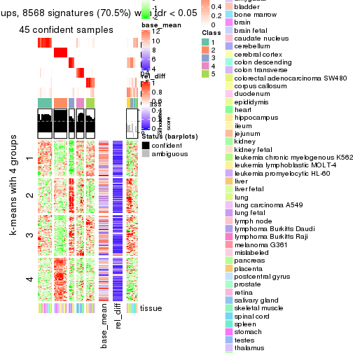</p>

</div>
</div>


Signature heatmaps where rows are not scaled:


<script>
$( function() {
	$( '#tabs-MAD-NMF-get-signatures-no-scale' ).tabs();
} );
</script>
<div id='tabs-MAD-NMF-get-signatures-no-scale'>
<ul>
<li><a href='#tab-MAD-NMF-get-signatures-no-scale-1'>k = 2</a></li>
<li><a href='#tab-MAD-NMF-get-signatures-no-scale-2'>k = 3</a></li>
<li><a href='#tab-MAD-NMF-get-signatures-no-scale-3'>k = 4</a></li>
<li><a href='#tab-MAD-NMF-get-signatures-no-scale-4'>k = 5</a></li>
<li><a href='#tab-MAD-NMF-get-signatures-no-scale-5'>k = 6</a></li>
</ul>
<div id='tab-MAD-NMF-get-signatures-no-scale-1'>
<pre><code class="r">get_signatures(res, k = 2, scale_rows = FALSE)
</code></pre>

<p></p>

</div>
<div id='tab-MAD-NMF-get-signatures-no-scale-2'>
<pre><code class="r">get_signatures(res, k = 3, scale_rows = FALSE)
</code></pre>

<p></p>

</div>
<div id='tab-MAD-NMF-get-signatures-no-scale-3'>
<pre><code class="r">get_signatures(res, k = 4, scale_rows = FALSE)
</code></pre>

<p></p>

</div>
<div id='tab-MAD-NMF-get-signatures-no-scale-4'>
<pre><code class="r">get_signatures(res, k = 5, scale_rows = FALSE)
</code></pre>

<p></p>

</div>
<div id='tab-MAD-NMF-get-signatures-no-scale-5'>
<pre><code class="r">get_signatures(res, k = 6, scale_rows = FALSE)
</code></pre>

<p></p>

</div>
</div>


Compare the overlap of signatures from different k:

```r
compare_signatures(res)
```


`get_signature()` returns a data frame invisibly. TO get the list of signatures, the function
call should be assigned to a variable explicitly. In following code, if `plot` argument is set
to `FALSE`, no heatmap is plotted while only the differential analysis is performed.

```r
# code only for demonstration
tb = get_signature(res, k = ..., plot = FALSE)
```

An example of the output of `tb` is:

```
#>   which_row         fdr    mean_1    mean_2 scaled_mean_1 scaled_mean_2 km
#> 1        38 0.042760348  8.373488  9.131774    -0.5533452     0.5164555  1
#> 2        40 0.018707592  7.106213  8.469186    -0.6173731     0.5762149  1
#> 3        55 0.019134737 10.221463 11.207825    -0.6159697     0.5749050  1
#> 4        59 0.006059896  5.921854  7.869574    -0.6899429     0.6439467  1
#> 5        60 0.018055526  8.928898 10.211722    -0.6204761     0.5791110  1
#> 6        98 0.009384629 15.714769 14.887706     0.6635654    -0.6193277  2
...
```

The columns in `tb` are:

1. `which_row`: row indices corresponding to the input matrix.
2. `fdr`: FDR for the differential test. 
3. `mean_x`: The mean value in group x.
4. `scaled_mean_x`: The mean value in group x after rows are scaled.
5. `km`: Row groups if k-means clustering is applied to rows.


UMAP plot which shows how samples are separated.


<script>
$( function() {
	$( '#tabs-MAD-NMF-dimension-reduction' ).tabs();
} );
</script>
<div id='tabs-MAD-NMF-dimension-reduction'>
<ul>
<li><a href='#tab-MAD-NMF-dimension-reduction-1'>k = 2</a></li>
<li><a href='#tab-MAD-NMF-dimension-reduction-2'>k = 3</a></li>
<li><a href='#tab-MAD-NMF-dimension-reduction-3'>k = 4</a></li>
<li><a href='#tab-MAD-NMF-dimension-reduction-4'>k = 5</a></li>
<li><a href='#tab-MAD-NMF-dimension-reduction-5'>k = 6</a></li>
</ul>
<div id='tab-MAD-NMF-dimension-reduction-1'>
<pre><code class="r">dimension_reduction(res, k = 2, method = &quot;UMAP&quot;)
</code></pre>

<p></p>

</div>
<div id='tab-MAD-NMF-dimension-reduction-2'>
<pre><code class="r">dimension_reduction(res, k = 3, method = &quot;UMAP&quot;)
</code></pre>

<p></p>

</div>
<div id='tab-MAD-NMF-dimension-reduction-3'>
<pre><code class="r">dimension_reduction(res, k = 4, method = &quot;UMAP&quot;)
</code></pre>

<p></p>

</div>
<div id='tab-MAD-NMF-dimension-reduction-4'>
<pre><code class="r">dimension_reduction(res, k = 5, method = &quot;UMAP&quot;)
</code></pre>

<p></p>

</div>
<div id='tab-MAD-NMF-dimension-reduction-5'>
<pre><code class="r">dimension_reduction(res, k = 6, method = &quot;UMAP&quot;)
</code></pre>

<p></p>

</div>
</div>


Following heatmap shows how subgroups are split when increasing `k`:

```r
collect_classes(res)
```


Test correlation between subgroups and known annotations. If the known
annotation is numeric, one-way ANOVA test is applied, and if the known
annotation is discrete, chi-squared contingency table test is applied.

```r
test_to_known_factors(res)
```

```
#>          n tissue(p) k
#> MAD:NMF 54     0.398 2
#> MAD:NMF 54     0.374 3
#> MAD:NMF 43     0.409 4
#> MAD:NMF 48     0.427 5
#> MAD:NMF 45     0.413 6
```


If matrix rows can be associated to genes, consider to use `functional_enrichment(res,
...)` to perform function enrichment for the signature genes. See [this vignette](http://bioconductor.org/packages/devel/bioc/vignettes/cola/inst/doc/functional_enrichment.html) for more detailed explanations.


 

---------------------------------------------------


### ATC:hclust**


The object with results only for a single top-value method and a single partition method 
can be extracted as:

```r
res = res_list["ATC", "hclust"]
# you can also extract it by
# res = res_list["ATC:hclust"]
```

A summary of `res` and all the functions that can be applied to it:

```r
res
```

```
#> A 'ConsensusPartition' object with k = 2, 3, 4, 5, 6.
#>   On a matrix with 12150 rows and 54 columns.
#>   Top rows (1000, 2000, 3000, 4000, 5000) are extracted by 'ATC' method.
#>   Subgroups are detected by 'hclust' method.
#>   Performed in total 1250 partitions by row resampling.
#>   Best k for subgroups seems to be 3.
#> 
#> Following methods can be applied to this 'ConsensusPartition' object:
#>  [1] "cola_report"             "collect_classes"         "collect_plots"          
#>  [4] "collect_stats"           "colnames"                "compare_signatures"     
#>  [7] "consensus_heatmap"       "dimension_reduction"     "functional_enrichment"  
#> [10] "get_anno_col"            "get_anno"                "get_classes"            
#> [13] "get_consensus"           "get_matrix"              "get_membership"         
#> [16] "get_param"               "get_signatures"          "get_stats"              
#> [19] "is_best_k"               "is_stable_k"             "membership_heatmap"     
#> [22] "ncol"                    "nrow"                    "plot_ecdf"              
#> [25] "rownames"                "select_partition_number" "show"                   
#> [28] "suggest_best_k"          "test_to_known_factors"
```

`collect_plots()` function collects all the plots made from `res` for all `k` (number of partitions)
into one single page to provide an easy and fast comparison between different `k`.

```r
collect_plots(res)
```


The plots are:

- The first row: a plot of the ECDF (empirical cumulative distribution
  function) curves of the consensus matrix for each `k` and the heatmap of
  predicted classes for each `k`.
- The second row: heatmaps of the consensus matrix for each `k`.
- The third row: heatmaps of the membership matrix for each `k`.
- The fouth row: heatmaps of the signatures for each `k`.

All the plots in panels can be made by individual functions and they are
plotted later in this section.

`select_partition_number()` produces several plots showing different
statistics for choosing "optimized" `k`. There are following statistics:

- ECDF curves of the consensus matrix for each `k`;
- 1-PAC. [The PAC
  score](https://en.wikipedia.org/wiki/Consensus_clustering#Over-interpretation_potential_of_consensus_clustering)
  measures the proportion of the ambiguous subgrouping.
- Mean silhouette score.
- Concordance. The mean probability of fiting the consensus class ids in all
  partitions.
- Area increased. Denote $A_k$ as the area under the ECDF curve for current
  `k`, the area increased is defined as $A_k - A_{k-1}$.
- Rand index. The percent of pairs of samples that are both in a same cluster
  or both are not in a same cluster in the partition of k and k-1.
- Jaccard index. The ratio of pairs of samples are both in a same cluster in
  the partition of k and k-1 and the pairs of samples are both in a same
  cluster in the partition k or k-1.

The detailed explanations of these statistics can be found in [the _cola_
vignette](http://bioconductor.org/packages/devel/bioc/vignettes/cola/inst/doc/cola.html#toc_13).

Generally speaking, lower PAC score, higher mean silhouette score or higher
concordance corresponds to better partition. Rand index and Jaccard index
measure how similar the current partition is compared to partition with `k-1`.
If they are too similar, we won't accept `k` is better than `k-1`.

```r
select_partition_number(res)
```


The numeric values for all these statistics can be obtained by `get_stats()`.

```r
get_stats(res)
```

```
#>   k 1-PAC mean_silhouette concordance area_increased  Rand Jaccard
#> 2 2 0.481           0.843       0.885         0.2931 0.743   0.743
#> 3 3 1.000           0.978       0.989         0.8826 0.715   0.616
#> 4 4 0.750           0.765       0.897         0.2042 0.883   0.744
#> 5 5 0.780           0.634       0.849         0.0284 0.869   0.697
#> 6 6 0.750           0.684       0.875         0.0660 0.890   0.732
```

`suggest_best_k()` suggests the best $k$ based on these statistics. The rules are as follows:

- All $k$ with Jaccard index larger than 0.95 are removed because increasing
  $k$ does not provide enough extra information. If all $k$ are removed, it is
  marked as no subgroup is detected.
- For all $k$ with 1-PAC score larger than 0.9, the maximal $k$ is taken as
  the best $k$, and other $k$ are marked as optional $k$.
- If it does not fit the second rule. The $k$ with the maximal vote of the
  highest 1-PAC score, highest mean silhouette, and highest concordance is
  taken as the best $k$.

```r
suggest_best_k(res)
```

```
#> [1] 3
```


Following shows the table of the partitions (You need to click the **show/hide
code output** link to see it). The membership matrix (columns with name `p*`)
is inferred by
[`clue::cl_consensus()`](https://www.rdocumentation.org/link/cl_consensus?package=clue)
function with the `SE` method. Basically the value in the membership matrix
represents the probability to belong to a certain group. The finall class
label for an item is determined with the group with highest probability it
belongs to.

In `get_classes()` function, the entropy is calculated from the membership
matrix and the silhouette score is calculated from the consensus matrix.


<script>
$( function() {
	$( '#tabs-ATC-hclust-get-classes' ).tabs();
} );
</script>
<div id='tabs-ATC-hclust-get-classes'>
<ul>
<li><a href='#tab-ATC-hclust-get-classes-1'>k = 2</a></li>
<li><a href='#tab-ATC-hclust-get-classes-2'>k = 3</a></li>
<li><a href='#tab-ATC-hclust-get-classes-3'>k = 4</a></li>
<li><a href='#tab-ATC-hclust-get-classes-4'>k = 5</a></li>
<li><a href='#tab-ATC-hclust-get-classes-5'>k = 6</a></li>
</ul>

<div id='tab-ATC-hclust-get-classes-1'>
<p><a id='tab-ATC-hclust-get-classes-1-a' style='color:#0366d6' href='#'>show/hide code output</a></p>
<pre><code class="r">cbind(get_classes(res, k = 2), get_membership(res, k = 2))
</code></pre>

<pre><code>#&gt;          class entropy silhouette    p1    p2
#&gt; GSM28815     1   0.000      0.877 1.000 0.000
#&gt; GSM28816     1   0.000      0.877 1.000 0.000
#&gt; GSM28817     1   0.000      0.877 1.000 0.000
#&gt; GSM11327     1   0.482      0.748 0.896 0.104
#&gt; GSM28825     1   0.876      0.673 0.704 0.296
#&gt; GSM11322     1   0.876      0.673 0.704 0.296
#&gt; GSM28828     1   0.876      0.673 0.704 0.296
#&gt; GSM11346     1   0.876      0.673 0.704 0.296
#&gt; GSM28808     1   0.876      0.673 0.704 0.296
#&gt; GSM11332     1   0.876      0.673 0.704 0.296
#&gt; GSM28811     1   0.876      0.673 0.704 0.296
#&gt; GSM11334     1   0.876      0.673 0.704 0.296
#&gt; GSM11340     1   0.876      0.673 0.704 0.296
#&gt; GSM28812     1   0.876      0.673 0.704 0.296
#&gt; GSM11345     1   0.000      0.877 1.000 0.000
#&gt; GSM28819     1   0.000      0.877 1.000 0.000
#&gt; GSM11321     2   0.876      1.000 0.296 0.704
#&gt; GSM28820     1   0.000      0.877 1.000 0.000
#&gt; GSM11339     1   0.000      0.877 1.000 0.000
#&gt; GSM28804     1   0.000      0.877 1.000 0.000
#&gt; GSM28823     1   0.000      0.877 1.000 0.000
#&gt; GSM11336     1   0.000      0.877 1.000 0.000
#&gt; GSM11342     1   0.000      0.877 1.000 0.000
#&gt; GSM11333     1   0.000      0.877 1.000 0.000
#&gt; GSM28802     1   0.000      0.877 1.000 0.000
#&gt; GSM28803     2   0.876      1.000 0.296 0.704
#&gt; GSM11343     2   0.876      1.000 0.296 0.704
#&gt; GSM11347     2   0.876      1.000 0.296 0.704
#&gt; GSM28824     1   0.000      0.877 1.000 0.000
#&gt; GSM28813     1   0.000      0.877 1.000 0.000
#&gt; GSM28827     1   0.000      0.877 1.000 0.000
#&gt; GSM11337     1   0.000      0.877 1.000 0.000
#&gt; GSM28814     2   0.876      1.000 0.296 0.704
#&gt; GSM11331     1   0.000      0.877 1.000 0.000
#&gt; GSM11344     2   0.876      1.000 0.296 0.704
#&gt; GSM11330     2   0.876      1.000 0.296 0.704
#&gt; GSM11325     2   0.876      1.000 0.296 0.704
#&gt; GSM11338     1   0.000      0.877 1.000 0.000
#&gt; GSM28806     1   0.000      0.877 1.000 0.000
#&gt; GSM28826     1   0.000      0.877 1.000 0.000
#&gt; GSM28818     1   0.000      0.877 1.000 0.000
#&gt; GSM28821     1   0.876      0.673 0.704 0.296
#&gt; GSM28807     1   0.000      0.877 1.000 0.000
#&gt; GSM28822     1   0.000      0.877 1.000 0.000
#&gt; GSM11328     1   0.876      0.673 0.704 0.296
#&gt; GSM11323     1   0.000      0.877 1.000 0.000
#&gt; GSM11324     1   0.000      0.877 1.000 0.000
#&gt; GSM11341     1   0.416      0.778 0.916 0.084
#&gt; GSM11326     1   0.482      0.748 0.896 0.104
#&gt; GSM28810     1   0.000      0.877 1.000 0.000
#&gt; GSM11335     1   0.000      0.877 1.000 0.000
#&gt; GSM28809     1   0.000      0.877 1.000 0.000
#&gt; GSM11329     1   0.000      0.877 1.000 0.000
#&gt; GSM28805     1   0.000      0.877 1.000 0.000
</code></pre>

<script>
$('#tab-ATC-hclust-get-classes-1-a').parent().next().next().hide();
$('#tab-ATC-hclust-get-classes-1-a').click(function(){
  $('#tab-ATC-hclust-get-classes-1-a').parent().next().next().toggle();
  return(false);
});
</script>
</div>

<div id='tab-ATC-hclust-get-classes-2'>
<p><a id='tab-ATC-hclust-get-classes-2-a' style='color:#0366d6' href='#'>show/hide code output</a></p>
<pre><code class="r">cbind(get_classes(res, k = 3), get_membership(res, k = 3))
</code></pre>

<pre><code>#&gt;          class entropy silhouette    p1    p2    p3
#&gt; GSM28815     1  0.0000      0.981 1.000 0.000 0.000
#&gt; GSM28816     1  0.0000      0.981 1.000 0.000 0.000
#&gt; GSM28817     1  0.0000      0.981 1.000 0.000 0.000
#&gt; GSM11327     1  0.3340      0.871 0.880 0.000 0.120
#&gt; GSM28825     2  0.0000      1.000 0.000 1.000 0.000
#&gt; GSM11322     2  0.0000      1.000 0.000 1.000 0.000
#&gt; GSM28828     2  0.0000      1.000 0.000 1.000 0.000
#&gt; GSM11346     2  0.0000      1.000 0.000 1.000 0.000
#&gt; GSM28808     2  0.0000      1.000 0.000 1.000 0.000
#&gt; GSM11332     2  0.0000      1.000 0.000 1.000 0.000
#&gt; GSM28811     2  0.0000      1.000 0.000 1.000 0.000
#&gt; GSM11334     2  0.0000      1.000 0.000 1.000 0.000
#&gt; GSM11340     2  0.0000      1.000 0.000 1.000 0.000
#&gt; GSM28812     2  0.0000      1.000 0.000 1.000 0.000
#&gt; GSM11345     1  0.0000      0.981 1.000 0.000 0.000
#&gt; GSM28819     1  0.0000      0.981 1.000 0.000 0.000
#&gt; GSM11321     3  0.0000      1.000 0.000 0.000 1.000
#&gt; GSM28820     1  0.0000      0.981 1.000 0.000 0.000
#&gt; GSM11339     1  0.0000      0.981 1.000 0.000 0.000
#&gt; GSM28804     1  0.2711      0.903 0.912 0.088 0.000
#&gt; GSM28823     1  0.0000      0.981 1.000 0.000 0.000
#&gt; GSM11336     1  0.0000      0.981 1.000 0.000 0.000
#&gt; GSM11342     1  0.0000      0.981 1.000 0.000 0.000
#&gt; GSM11333     1  0.0000      0.981 1.000 0.000 0.000
#&gt; GSM28802     1  0.0000      0.981 1.000 0.000 0.000
#&gt; GSM28803     3  0.0000      1.000 0.000 0.000 1.000
#&gt; GSM11343     3  0.0000      1.000 0.000 0.000 1.000
#&gt; GSM11347     3  0.0000      1.000 0.000 0.000 1.000
#&gt; GSM28824     1  0.0000      0.981 1.000 0.000 0.000
#&gt; GSM28813     1  0.0237      0.979 0.996 0.000 0.004
#&gt; GSM28827     1  0.0000      0.981 1.000 0.000 0.000
#&gt; GSM11337     1  0.0000      0.981 1.000 0.000 0.000
#&gt; GSM28814     3  0.0000      1.000 0.000 0.000 1.000
#&gt; GSM11331     1  0.0000      0.981 1.000 0.000 0.000
#&gt; GSM11344     3  0.0000      1.000 0.000 0.000 1.000
#&gt; GSM11330     3  0.0000      1.000 0.000 0.000 1.000
#&gt; GSM11325     3  0.0000      1.000 0.000 0.000 1.000
#&gt; GSM11338     1  0.0237      0.979 0.996 0.000 0.004
#&gt; GSM28806     1  0.0000      0.981 1.000 0.000 0.000
#&gt; GSM28826     1  0.0000      0.981 1.000 0.000 0.000
#&gt; GSM28818     1  0.0000      0.981 1.000 0.000 0.000
#&gt; GSM28821     2  0.0000      1.000 0.000 1.000 0.000
#&gt; GSM28807     1  0.0000      0.981 1.000 0.000 0.000
#&gt; GSM28822     1  0.2711      0.903 0.912 0.088 0.000
#&gt; GSM11328     2  0.0000      1.000 0.000 1.000 0.000
#&gt; GSM11323     1  0.0000      0.981 1.000 0.000 0.000
#&gt; GSM11324     1  0.0000      0.981 1.000 0.000 0.000
#&gt; GSM11341     1  0.5582      0.807 0.812 0.088 0.100
#&gt; GSM11326     1  0.3340      0.871 0.880 0.000 0.120
#&gt; GSM28810     1  0.0000      0.981 1.000 0.000 0.000
#&gt; GSM11335     1  0.0000      0.981 1.000 0.000 0.000
#&gt; GSM28809     1  0.0000      0.981 1.000 0.000 0.000
#&gt; GSM11329     1  0.0000      0.981 1.000 0.000 0.000
#&gt; GSM28805     1  0.0000      0.981 1.000 0.000 0.000
</code></pre>

<script>
$('#tab-ATC-hclust-get-classes-2-a').parent().next().next().hide();
$('#tab-ATC-hclust-get-classes-2-a').click(function(){
  $('#tab-ATC-hclust-get-classes-2-a').parent().next().next().toggle();
  return(false);
});
</script>
</div>

<div id='tab-ATC-hclust-get-classes-3'>
<p><a id='tab-ATC-hclust-get-classes-3-a' style='color:#0366d6' href='#'>show/hide code output</a></p>
<pre><code class="r">cbind(get_classes(res, k = 4), get_membership(res, k = 4))
</code></pre>

<pre><code>#&gt;          class entropy silhouette    p1 p2    p3    p4
#&gt; GSM28815     1  0.4193      0.429 0.732  0 0.000 0.268
#&gt; GSM28816     1  0.4193      0.429 0.732  0 0.000 0.268
#&gt; GSM28817     1  0.0707      0.791 0.980  0 0.000 0.020
#&gt; GSM11327     4  0.6400      0.675 0.252  0 0.116 0.632
#&gt; GSM28825     2  0.0000      1.000 0.000  1 0.000 0.000
#&gt; GSM11322     2  0.0000      1.000 0.000  1 0.000 0.000
#&gt; GSM28828     2  0.0000      1.000 0.000  1 0.000 0.000
#&gt; GSM11346     2  0.0000      1.000 0.000  1 0.000 0.000
#&gt; GSM28808     2  0.0000      1.000 0.000  1 0.000 0.000
#&gt; GSM11332     2  0.0000      1.000 0.000  1 0.000 0.000
#&gt; GSM28811     2  0.0000      1.000 0.000  1 0.000 0.000
#&gt; GSM11334     2  0.0000      1.000 0.000  1 0.000 0.000
#&gt; GSM11340     2  0.0000      1.000 0.000  1 0.000 0.000
#&gt; GSM28812     2  0.0000      1.000 0.000  1 0.000 0.000
#&gt; GSM11345     1  0.1389      0.774 0.952  0 0.000 0.048
#&gt; GSM28819     1  0.1389      0.774 0.952  0 0.000 0.048
#&gt; GSM11321     3  0.0000      1.000 0.000  0 1.000 0.000
#&gt; GSM28820     1  0.0707      0.791 0.980  0 0.000 0.020
#&gt; GSM11339     1  0.0707      0.791 0.980  0 0.000 0.020
#&gt; GSM28804     1  0.4222      0.401 0.728  0 0.000 0.272
#&gt; GSM28823     1  0.0817      0.786 0.976  0 0.000 0.024
#&gt; GSM11336     1  0.4564      0.271 0.672  0 0.000 0.328
#&gt; GSM11342     1  0.0817      0.786 0.976  0 0.000 0.024
#&gt; GSM11333     1  0.4193      0.429 0.732  0 0.000 0.268
#&gt; GSM28802     1  0.0592      0.790 0.984  0 0.000 0.016
#&gt; GSM28803     3  0.0000      1.000 0.000  0 1.000 0.000
#&gt; GSM11343     3  0.0000      1.000 0.000  0 1.000 0.000
#&gt; GSM11347     3  0.0000      1.000 0.000  0 1.000 0.000
#&gt; GSM28824     4  0.4996      0.420 0.484  0 0.000 0.516
#&gt; GSM28813     4  0.4790      0.645 0.380  0 0.000 0.620
#&gt; GSM28827     1  0.0000      0.793 1.000  0 0.000 0.000
#&gt; GSM11337     1  0.0000      0.793 1.000  0 0.000 0.000
#&gt; GSM28814     3  0.0000      1.000 0.000  0 1.000 0.000
#&gt; GSM11331     1  0.1022      0.785 0.968  0 0.000 0.032
#&gt; GSM11344     3  0.0000      1.000 0.000  0 1.000 0.000
#&gt; GSM11330     3  0.0000      1.000 0.000  0 1.000 0.000
#&gt; GSM11325     3  0.0000      1.000 0.000  0 1.000 0.000
#&gt; GSM11338     4  0.4790      0.645 0.380  0 0.000 0.620
#&gt; GSM28806     1  0.0817      0.786 0.976  0 0.000 0.024
#&gt; GSM28826     1  0.1637      0.763 0.940  0 0.000 0.060
#&gt; GSM28818     1  0.4564      0.271 0.672  0 0.000 0.328
#&gt; GSM28821     2  0.0000      1.000 0.000  1 0.000 0.000
#&gt; GSM28807     1  0.4564      0.271 0.672  0 0.000 0.328
#&gt; GSM28822     1  0.4477      0.335 0.688  0 0.000 0.312
#&gt; GSM11328     2  0.0000      1.000 0.000  1 0.000 0.000
#&gt; GSM11323     1  0.1022      0.785 0.968  0 0.000 0.032
#&gt; GSM11324     1  0.1302      0.784 0.956  0 0.000 0.044
#&gt; GSM11341     4  0.4564      0.242 0.328  0 0.000 0.672
#&gt; GSM11326     4  0.6400      0.675 0.252  0 0.116 0.632
#&gt; GSM28810     1  0.0592      0.790 0.984  0 0.000 0.016
#&gt; GSM11335     1  0.1118      0.783 0.964  0 0.000 0.036
#&gt; GSM28809     1  0.4564      0.271 0.672  0 0.000 0.328
#&gt; GSM11329     1  0.0707      0.791 0.980  0 0.000 0.020
#&gt; GSM28805     1  0.0707      0.791 0.980  0 0.000 0.020
</code></pre>

<script>
$('#tab-ATC-hclust-get-classes-3-a').parent().next().next().hide();
$('#tab-ATC-hclust-get-classes-3-a').click(function(){
  $('#tab-ATC-hclust-get-classes-3-a').parent().next().next().toggle();
  return(false);
});
</script>
</div>

<div id='tab-ATC-hclust-get-classes-4'>
<p><a id='tab-ATC-hclust-get-classes-4-a' style='color:#0366d6' href='#'>show/hide code output</a></p>
<pre><code class="r">cbind(get_classes(res, k = 5), get_membership(res, k = 5))
</code></pre>

<pre><code>#&gt;          class entropy silhouette    p1 p2    p3    p4    p5
#&gt; GSM28815     1   0.029     0.4290 0.992  0 0.000 0.008 0.000
#&gt; GSM28816     1   0.029     0.4290 0.992  0 0.000 0.008 0.000
#&gt; GSM28817     1   0.351     0.5030 0.748  0 0.000 0.252 0.000
#&gt; GSM11327     1   0.724    -0.0292 0.496  0 0.104 0.308 0.092
#&gt; GSM28825     2   0.000     1.0000 0.000  1 0.000 0.000 0.000
#&gt; GSM11322     2   0.000     1.0000 0.000  1 0.000 0.000 0.000
#&gt; GSM28828     2   0.000     1.0000 0.000  1 0.000 0.000 0.000
#&gt; GSM11346     2   0.000     1.0000 0.000  1 0.000 0.000 0.000
#&gt; GSM28808     2   0.000     1.0000 0.000  1 0.000 0.000 0.000
#&gt; GSM11332     2   0.000     1.0000 0.000  1 0.000 0.000 0.000
#&gt; GSM28811     2   0.000     1.0000 0.000  1 0.000 0.000 0.000
#&gt; GSM11334     2   0.000     1.0000 0.000  1 0.000 0.000 0.000
#&gt; GSM11340     2   0.000     1.0000 0.000  1 0.000 0.000 0.000
#&gt; GSM28812     2   0.000     1.0000 0.000  1 0.000 0.000 0.000
#&gt; GSM11345     1   0.415     0.4688 0.652  0 0.000 0.344 0.004
#&gt; GSM28819     1   0.415     0.4688 0.652  0 0.000 0.344 0.004
#&gt; GSM11321     3   0.000     1.0000 0.000  0 1.000 0.000 0.000
#&gt; GSM28820     1   0.351     0.5030 0.748  0 0.000 0.252 0.000
#&gt; GSM11339     1   0.351     0.5030 0.748  0 0.000 0.252 0.000
#&gt; GSM28804     4   0.417     0.8568 0.348  0 0.000 0.648 0.004
#&gt; GSM28823     1   0.393     0.4588 0.672  0 0.000 0.328 0.000
#&gt; GSM11336     1   0.185     0.3907 0.912  0 0.000 0.088 0.000
#&gt; GSM11342     1   0.393     0.4588 0.672  0 0.000 0.328 0.000
#&gt; GSM11333     1   0.029     0.4290 0.992  0 0.000 0.008 0.000
#&gt; GSM28802     1   0.389     0.4726 0.680  0 0.000 0.320 0.000
#&gt; GSM28803     3   0.000     1.0000 0.000  0 1.000 0.000 0.000
#&gt; GSM11343     3   0.000     1.0000 0.000  0 1.000 0.000 0.000
#&gt; GSM11347     3   0.000     1.0000 0.000  0 1.000 0.000 0.000
#&gt; GSM28824     1   0.447     0.2417 0.732  0 0.000 0.212 0.056
#&gt; GSM28813     1   0.532     0.1733 0.624  0 0.000 0.296 0.080
#&gt; GSM28827     1   0.382     0.4879 0.696  0 0.000 0.304 0.000
#&gt; GSM11337     1   0.382     0.4879 0.696  0 0.000 0.304 0.000
#&gt; GSM28814     3   0.000     1.0000 0.000  0 1.000 0.000 0.000
#&gt; GSM11331     1   0.408     0.4823 0.668  0 0.000 0.328 0.004
#&gt; GSM11344     3   0.000     1.0000 0.000  0 1.000 0.000 0.000
#&gt; GSM11330     3   0.000     1.0000 0.000  0 1.000 0.000 0.000
#&gt; GSM11325     3   0.000     1.0000 0.000  0 1.000 0.000 0.000
#&gt; GSM11338     1   0.532     0.1733 0.624  0 0.000 0.296 0.080
#&gt; GSM28806     1   0.393     0.4588 0.672  0 0.000 0.328 0.000
#&gt; GSM28826     1   0.420     0.4553 0.640  0 0.000 0.356 0.004
#&gt; GSM28818     1   0.185     0.3907 0.912  0 0.000 0.088 0.000
#&gt; GSM28821     2   0.000     1.0000 0.000  1 0.000 0.000 0.000
#&gt; GSM28807     1   0.185     0.3907 0.912  0 0.000 0.088 0.000
#&gt; GSM28822     4   0.487     0.8688 0.284  0 0.000 0.664 0.052
#&gt; GSM11328     2   0.000     1.0000 0.000  1 0.000 0.000 0.000
#&gt; GSM11323     1   0.408     0.4823 0.668  0 0.000 0.328 0.004
#&gt; GSM11324     1   0.395     0.4978 0.696  0 0.000 0.300 0.004
#&gt; GSM11341     5   0.029     0.0000 0.000  0 0.000 0.008 0.992
#&gt; GSM11326     1   0.724    -0.0292 0.496  0 0.104 0.308 0.092
#&gt; GSM28810     1   0.389     0.4726 0.680  0 0.000 0.320 0.000
#&gt; GSM11335     1   0.410     0.4796 0.664  0 0.000 0.332 0.004
#&gt; GSM28809     1   0.185     0.3907 0.912  0 0.000 0.088 0.000
#&gt; GSM11329     1   0.351     0.5030 0.748  0 0.000 0.252 0.000
#&gt; GSM28805     1   0.351     0.5030 0.748  0 0.000 0.252 0.000
</code></pre>

<script>
$('#tab-ATC-hclust-get-classes-4-a').parent().next().next().hide();
$('#tab-ATC-hclust-get-classes-4-a').click(function(){
  $('#tab-ATC-hclust-get-classes-4-a').parent().next().next().toggle();
  return(false);
});
</script>
</div>

<div id='tab-ATC-hclust-get-classes-5'>
<p><a id='tab-ATC-hclust-get-classes-5-a' style='color:#0366d6' href='#'>show/hide code output</a></p>
<pre><code class="r">cbind(get_classes(res, k = 6), get_membership(res, k = 6))
</code></pre>

<pre><code>#&gt;          class entropy silhouette    p1 p2 p3 p4    p5    p6
#&gt; GSM28815     1  0.5745     0.2821 0.508  0  0  0 0.212 0.280
#&gt; GSM28816     1  0.5745     0.2821 0.508  0  0  0 0.212 0.280
#&gt; GSM28817     1  0.1806     0.6771 0.908  0  0  0 0.004 0.088
#&gt; GSM11327     5  0.1501     0.6605 0.076  0  0  0 0.924 0.000
#&gt; GSM28825     2  0.0000     1.0000 0.000  1  0  0 0.000 0.000
#&gt; GSM11322     2  0.0000     1.0000 0.000  1  0  0 0.000 0.000
#&gt; GSM28828     2  0.0000     1.0000 0.000  1  0  0 0.000 0.000
#&gt; GSM11346     2  0.0000     1.0000 0.000  1  0  0 0.000 0.000
#&gt; GSM28808     2  0.0000     1.0000 0.000  1  0  0 0.000 0.000
#&gt; GSM11332     2  0.0000     1.0000 0.000  1  0  0 0.000 0.000
#&gt; GSM28811     2  0.0000     1.0000 0.000  1  0  0 0.000 0.000
#&gt; GSM11334     2  0.0000     1.0000 0.000  1  0  0 0.000 0.000
#&gt; GSM11340     2  0.0000     1.0000 0.000  1  0  0 0.000 0.000
#&gt; GSM28812     2  0.0000     1.0000 0.000  1  0  0 0.000 0.000
#&gt; GSM11345     1  0.1075     0.6673 0.952  0  0  0 0.048 0.000
#&gt; GSM28819     1  0.1075     0.6673 0.952  0  0  0 0.048 0.000
#&gt; GSM11321     3  0.0000     1.0000 0.000  0  1  0 0.000 0.000
#&gt; GSM28820     1  0.1806     0.6771 0.908  0  0  0 0.004 0.088
#&gt; GSM11339     1  0.1806     0.6771 0.908  0  0  0 0.004 0.088
#&gt; GSM28804     1  0.3869    -0.6166 0.500  0  0  0 0.000 0.500
#&gt; GSM28823     1  0.0692     0.6760 0.976  0  0  0 0.004 0.020
#&gt; GSM11336     1  0.6063     0.0651 0.388  0  0  0 0.264 0.348
#&gt; GSM11342     1  0.0692     0.6760 0.976  0  0  0 0.004 0.020
#&gt; GSM11333     1  0.5745     0.2821 0.508  0  0  0 0.212 0.280
#&gt; GSM28802     1  0.0508     0.6804 0.984  0  0  0 0.004 0.012
#&gt; GSM28803     3  0.0000     1.0000 0.000  0  1  0 0.000 0.000
#&gt; GSM11343     3  0.0000     1.0000 0.000  0  1  0 0.000 0.000
#&gt; GSM11347     3  0.0000     1.0000 0.000  0  1  0 0.000 0.000
#&gt; GSM28824     5  0.4420     0.6432 0.308  0  0  0 0.644 0.048
#&gt; GSM28813     5  0.3641     0.7785 0.224  0  0  0 0.748 0.028
#&gt; GSM28827     1  0.0000     0.6854 1.000  0  0  0 0.000 0.000
#&gt; GSM11337     1  0.0000     0.6854 1.000  0  0  0 0.000 0.000
#&gt; GSM28814     3  0.0000     1.0000 0.000  0  1  0 0.000 0.000
#&gt; GSM11331     1  0.0790     0.6781 0.968  0  0  0 0.032 0.000
#&gt; GSM11344     3  0.0000     1.0000 0.000  0  1  0 0.000 0.000
#&gt; GSM11330     3  0.0000     1.0000 0.000  0  1  0 0.000 0.000
#&gt; GSM11325     3  0.0000     1.0000 0.000  0  1  0 0.000 0.000
#&gt; GSM11338     5  0.3641     0.7785 0.224  0  0  0 0.748 0.028
#&gt; GSM28806     1  0.0692     0.6760 0.976  0  0  0 0.004 0.020
#&gt; GSM28826     1  0.1267     0.6557 0.940  0  0  0 0.060 0.000
#&gt; GSM28818     1  0.6034     0.0872 0.400  0  0  0 0.252 0.348
#&gt; GSM28821     2  0.0000     1.0000 0.000  1  0  0 0.000 0.000
#&gt; GSM28807     1  0.6034     0.0872 0.400  0  0  0 0.252 0.348
#&gt; GSM28822     6  0.3607     0.0000 0.348  0  0  0 0.000 0.652
#&gt; GSM11328     2  0.0000     1.0000 0.000  1  0  0 0.000 0.000
#&gt; GSM11323     1  0.0790     0.6781 0.968  0  0  0 0.032 0.000
#&gt; GSM11324     1  0.2119     0.6808 0.904  0  0  0 0.036 0.060
#&gt; GSM11341     4  0.0000     0.0000 0.000  0  0  1 0.000 0.000
#&gt; GSM11326     5  0.1501     0.6605 0.076  0  0  0 0.924 0.000
#&gt; GSM28810     1  0.0508     0.6804 0.984  0  0  0 0.004 0.012
#&gt; GSM11335     1  0.0865     0.6758 0.964  0  0  0 0.036 0.000
#&gt; GSM28809     1  0.6034     0.0872 0.400  0  0  0 0.252 0.348
#&gt; GSM11329     1  0.1806     0.6771 0.908  0  0  0 0.004 0.088
#&gt; GSM28805     1  0.1806     0.6771 0.908  0  0  0 0.004 0.088
</code></pre>

<script>
$('#tab-ATC-hclust-get-classes-5-a').parent().next().next().hide();
$('#tab-ATC-hclust-get-classes-5-a').click(function(){
  $('#tab-ATC-hclust-get-classes-5-a').parent().next().next().toggle();
  return(false);
});
</script>
</div>
</div>

Heatmaps for the consensus matrix. It visualizes the probability of two
samples to be in a same group.


<script>
$( function() {
	$( '#tabs-ATC-hclust-consensus-heatmap' ).tabs();
} );
</script>
<div id='tabs-ATC-hclust-consensus-heatmap'>
<ul>
<li><a href='#tab-ATC-hclust-consensus-heatmap-1'>k = 2</a></li>
<li><a href='#tab-ATC-hclust-consensus-heatmap-2'>k = 3</a></li>
<li><a href='#tab-ATC-hclust-consensus-heatmap-3'>k = 4</a></li>
<li><a href='#tab-ATC-hclust-consensus-heatmap-4'>k = 5</a></li>
<li><a href='#tab-ATC-hclust-consensus-heatmap-5'>k = 6</a></li>
</ul>
<div id='tab-ATC-hclust-consensus-heatmap-1'>
<pre><code class="r">consensus_heatmap(res, k = 2)
</code></pre>

<p></p>

</div>
<div id='tab-ATC-hclust-consensus-heatmap-2'>
<pre><code class="r">consensus_heatmap(res, k = 3)
</code></pre>

<p></p>

</div>
<div id='tab-ATC-hclust-consensus-heatmap-3'>
<pre><code class="r">consensus_heatmap(res, k = 4)
</code></pre>

<p></p>

</div>
<div id='tab-ATC-hclust-consensus-heatmap-4'>
<pre><code class="r">consensus_heatmap(res, k = 5)
</code></pre>

<p></p>

</div>
<div id='tab-ATC-hclust-consensus-heatmap-5'>
<pre><code class="r">consensus_heatmap(res, k = 6)
</code></pre>

<p></p>

</div>
</div>

Heatmaps for the membership of samples in all partitions to see how consistent they are:


<script>
$( function() {
	$( '#tabs-ATC-hclust-membership-heatmap' ).tabs();
} );
</script>
<div id='tabs-ATC-hclust-membership-heatmap'>
<ul>
<li><a href='#tab-ATC-hclust-membership-heatmap-1'>k = 2</a></li>
<li><a href='#tab-ATC-hclust-membership-heatmap-2'>k = 3</a></li>
<li><a href='#tab-ATC-hclust-membership-heatmap-3'>k = 4</a></li>
<li><a href='#tab-ATC-hclust-membership-heatmap-4'>k = 5</a></li>
<li><a href='#tab-ATC-hclust-membership-heatmap-5'>k = 6</a></li>
</ul>
<div id='tab-ATC-hclust-membership-heatmap-1'>
<pre><code class="r">membership_heatmap(res, k = 2)
</code></pre>

<p></p>

</div>
<div id='tab-ATC-hclust-membership-heatmap-2'>
<pre><code class="r">membership_heatmap(res, k = 3)
</code></pre>

<p></p>

</div>
<div id='tab-ATC-hclust-membership-heatmap-3'>
<pre><code class="r">membership_heatmap(res, k = 4)
</code></pre>

<p></p>

</div>
<div id='tab-ATC-hclust-membership-heatmap-4'>
<pre><code class="r">membership_heatmap(res, k = 5)
</code></pre>

<p></p>

</div>
<div id='tab-ATC-hclust-membership-heatmap-5'>
<pre><code class="r">membership_heatmap(res, k = 6)
</code></pre>

<p></p>

</div>
</div>

As soon as we have had the classes for columns, we can look for signatures
which are significantly different between classes which can be candidate marks
for certain classes. Following are the heatmaps for signatures.


Signature heatmaps where rows are scaled:


<script>
$( function() {
	$( '#tabs-ATC-hclust-get-signatures' ).tabs();
} );
</script>
<div id='tabs-ATC-hclust-get-signatures'>
<ul>
<li><a href='#tab-ATC-hclust-get-signatures-1'>k = 2</a></li>
<li><a href='#tab-ATC-hclust-get-signatures-2'>k = 3</a></li>
<li><a href='#tab-ATC-hclust-get-signatures-3'>k = 4</a></li>
<li><a href='#tab-ATC-hclust-get-signatures-4'>k = 5</a></li>
<li><a href='#tab-ATC-hclust-get-signatures-5'>k = 6</a></li>
</ul>
<div id='tab-ATC-hclust-get-signatures-1'>
<pre><code class="r">get_signatures(res, k = 2)
</code></pre>

<p></p>

</div>
<div id='tab-ATC-hclust-get-signatures-2'>
<pre><code class="r">get_signatures(res, k = 3)
</code></pre>

<p></p>

</div>
<div id='tab-ATC-hclust-get-signatures-3'>
<pre><code class="r">get_signatures(res, k = 4)
</code></pre>

<p></p>

</div>
<div id='tab-ATC-hclust-get-signatures-4'>
<pre><code class="r">get_signatures(res, k = 5)
</code></pre>

<p>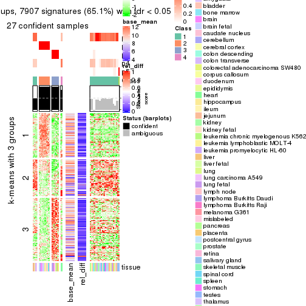</p>

</div>
<div id='tab-ATC-hclust-get-signatures-5'>
<pre><code class="r">get_signatures(res, k = 6)
</code></pre>

<p></p>

</div>
</div>


Signature heatmaps where rows are not scaled:


<script>
$( function() {
	$( '#tabs-ATC-hclust-get-signatures-no-scale' ).tabs();
} );
</script>
<div id='tabs-ATC-hclust-get-signatures-no-scale'>
<ul>
<li><a href='#tab-ATC-hclust-get-signatures-no-scale-1'>k = 2</a></li>
<li><a href='#tab-ATC-hclust-get-signatures-no-scale-2'>k = 3</a></li>
<li><a href='#tab-ATC-hclust-get-signatures-no-scale-3'>k = 4</a></li>
<li><a href='#tab-ATC-hclust-get-signatures-no-scale-4'>k = 5</a></li>
<li><a href='#tab-ATC-hclust-get-signatures-no-scale-5'>k = 6</a></li>
</ul>
<div id='tab-ATC-hclust-get-signatures-no-scale-1'>
<pre><code class="r">get_signatures(res, k = 2, scale_rows = FALSE)
</code></pre>

<p></p>

</div>
<div id='tab-ATC-hclust-get-signatures-no-scale-2'>
<pre><code class="r">get_signatures(res, k = 3, scale_rows = FALSE)
</code></pre>

<p></p>

</div>
<div id='tab-ATC-hclust-get-signatures-no-scale-3'>
<pre><code class="r">get_signatures(res, k = 4, scale_rows = FALSE)
</code></pre>

<p></p>

</div>
<div id='tab-ATC-hclust-get-signatures-no-scale-4'>
<pre><code class="r">get_signatures(res, k = 5, scale_rows = FALSE)
</code></pre>

<p></p>

</div>
<div id='tab-ATC-hclust-get-signatures-no-scale-5'>
<pre><code class="r">get_signatures(res, k = 6, scale_rows = FALSE)
</code></pre>

<p></p>

</div>
</div>


Compare the overlap of signatures from different k:

```r
compare_signatures(res)
```


`get_signature()` returns a data frame invisibly. TO get the list of signatures, the function
call should be assigned to a variable explicitly. In following code, if `plot` argument is set
to `FALSE`, no heatmap is plotted while only the differential analysis is performed.

```r
# code only for demonstration
tb = get_signature(res, k = ..., plot = FALSE)
```

An example of the output of `tb` is:

```
#>   which_row         fdr    mean_1    mean_2 scaled_mean_1 scaled_mean_2 km
#> 1        38 0.042760348  8.373488  9.131774    -0.5533452     0.5164555  1
#> 2        40 0.018707592  7.106213  8.469186    -0.6173731     0.5762149  1
#> 3        55 0.019134737 10.221463 11.207825    -0.6159697     0.5749050  1
#> 4        59 0.006059896  5.921854  7.869574    -0.6899429     0.6439467  1
#> 5        60 0.018055526  8.928898 10.211722    -0.6204761     0.5791110  1
#> 6        98 0.009384629 15.714769 14.887706     0.6635654    -0.6193277  2
...
```

The columns in `tb` are:

1. `which_row`: row indices corresponding to the input matrix.
2. `fdr`: FDR for the differential test. 
3. `mean_x`: The mean value in group x.
4. `scaled_mean_x`: The mean value in group x after rows are scaled.
5. `km`: Row groups if k-means clustering is applied to rows.


UMAP plot which shows how samples are separated.


<script>
$( function() {
	$( '#tabs-ATC-hclust-dimension-reduction' ).tabs();
} );
</script>
<div id='tabs-ATC-hclust-dimension-reduction'>
<ul>
<li><a href='#tab-ATC-hclust-dimension-reduction-1'>k = 2</a></li>
<li><a href='#tab-ATC-hclust-dimension-reduction-2'>k = 3</a></li>
<li><a href='#tab-ATC-hclust-dimension-reduction-3'>k = 4</a></li>
<li><a href='#tab-ATC-hclust-dimension-reduction-4'>k = 5</a></li>
<li><a href='#tab-ATC-hclust-dimension-reduction-5'>k = 6</a></li>
</ul>
<div id='tab-ATC-hclust-dimension-reduction-1'>
<pre><code class="r">dimension_reduction(res, k = 2, method = &quot;UMAP&quot;)
</code></pre>

<p></p>

</div>
<div id='tab-ATC-hclust-dimension-reduction-2'>
<pre><code class="r">dimension_reduction(res, k = 3, method = &quot;UMAP&quot;)
</code></pre>

<p></p>

</div>
<div id='tab-ATC-hclust-dimension-reduction-3'>
<pre><code class="r">dimension_reduction(res, k = 4, method = &quot;UMAP&quot;)
</code></pre>

<p></p>

</div>
<div id='tab-ATC-hclust-dimension-reduction-4'>
<pre><code class="r">dimension_reduction(res, k = 5, method = &quot;UMAP&quot;)
</code></pre>

<p></p>

</div>
<div id='tab-ATC-hclust-dimension-reduction-5'>
<pre><code class="r">dimension_reduction(res, k = 6, method = &quot;UMAP&quot;)
</code></pre>

<p></p>

</div>
</div>


Following heatmap shows how subgroups are split when increasing `k`:

```r
collect_classes(res)
```


Test correlation between subgroups and known annotations. If the known
annotation is numeric, one-way ANOVA test is applied, and if the known
annotation is discrete, chi-squared contingency table test is applied.

```r
test_to_known_factors(res)
```

```
#>             n tissue(p) k
#> ATC:hclust 54     0.398 2
#> ATC:hclust 54     0.374 3
#> ATC:hclust 43     0.409 4
#> ATC:hclust 27     0.386 5
#> ATC:hclust 44     0.410 6
```


If matrix rows can be associated to genes, consider to use `functional_enrichment(res,
...)` to perform function enrichment for the signature genes. See [this vignette](http://bioconductor.org/packages/devel/bioc/vignettes/cola/inst/doc/functional_enrichment.html) for more detailed explanations.


 

---------------------------------------------------


### ATC:kmeans**


The object with results only for a single top-value method and a single partition method 
can be extracted as:

```r
res = res_list["ATC", "kmeans"]
# you can also extract it by
# res = res_list["ATC:kmeans"]
```

A summary of `res` and all the functions that can be applied to it:

```r
res
```

```
#> A 'ConsensusPartition' object with k = 2, 3, 4, 5, 6.
#>   On a matrix with 12150 rows and 54 columns.
#>   Top rows (1000, 2000, 3000, 4000, 5000) are extracted by 'ATC' method.
#>   Subgroups are detected by 'kmeans' method.
#>   Performed in total 1250 partitions by row resampling.
#>   Best k for subgroups seems to be 3.
#> 
#> Following methods can be applied to this 'ConsensusPartition' object:
#>  [1] "cola_report"             "collect_classes"         "collect_plots"          
#>  [4] "collect_stats"           "colnames"                "compare_signatures"     
#>  [7] "consensus_heatmap"       "dimension_reduction"     "functional_enrichment"  
#> [10] "get_anno_col"            "get_anno"                "get_classes"            
#> [13] "get_consensus"           "get_matrix"              "get_membership"         
#> [16] "get_param"               "get_signatures"          "get_stats"              
#> [19] "is_best_k"               "is_stable_k"             "membership_heatmap"     
#> [22] "ncol"                    "nrow"                    "plot_ecdf"              
#> [25] "rownames"                "select_partition_number" "show"                   
#> [28] "suggest_best_k"          "test_to_known_factors"
```

`collect_plots()` function collects all the plots made from `res` for all `k` (number of partitions)
into one single page to provide an easy and fast comparison between different `k`.

```r
collect_plots(res)
```


The plots are:

- The first row: a plot of the ECDF (empirical cumulative distribution
  function) curves of the consensus matrix for each `k` and the heatmap of
  predicted classes for each `k`.
- The second row: heatmaps of the consensus matrix for each `k`.
- The third row: heatmaps of the membership matrix for each `k`.
- The fouth row: heatmaps of the signatures for each `k`.

All the plots in panels can be made by individual functions and they are
plotted later in this section.

`select_partition_number()` produces several plots showing different
statistics for choosing "optimized" `k`. There are following statistics:

- ECDF curves of the consensus matrix for each `k`;
- 1-PAC. [The PAC
  score](https://en.wikipedia.org/wiki/Consensus_clustering#Over-interpretation_potential_of_consensus_clustering)
  measures the proportion of the ambiguous subgrouping.
- Mean silhouette score.
- Concordance. The mean probability of fiting the consensus class ids in all
  partitions.
- Area increased. Denote $A_k$ as the area under the ECDF curve for current
  `k`, the area increased is defined as $A_k - A_{k-1}$.
- Rand index. The percent of pairs of samples that are both in a same cluster
  or both are not in a same cluster in the partition of k and k-1.
- Jaccard index. The ratio of pairs of samples are both in a same cluster in
  the partition of k and k-1 and the pairs of samples are both in a same
  cluster in the partition k or k-1.

The detailed explanations of these statistics can be found in [the _cola_
vignette](http://bioconductor.org/packages/devel/bioc/vignettes/cola/inst/doc/cola.html#toc_13).

Generally speaking, lower PAC score, higher mean silhouette score or higher
concordance corresponds to better partition. Rand index and Jaccard index
measure how similar the current partition is compared to partition with `k-1`.
If they are too similar, we won't accept `k` is better than `k-1`.

```r
select_partition_number(res)
```


The numeric values for all these statistics can be obtained by `get_stats()`.

```r
get_stats(res)
```

```
#>   k 1-PAC mean_silhouette concordance area_increased  Rand Jaccard
#> 2 2 0.405           0.808       0.844         0.3472 0.648   0.648
#> 3 3 1.000           0.953       0.965         0.5736 0.810   0.707
#> 4 4 0.667           0.583       0.809         0.2305 0.955   0.902
#> 5 5 0.612           0.593       0.755         0.1106 0.823   0.580
#> 6 6 0.627           0.560       0.746         0.0487 0.955   0.822
```

`suggest_best_k()` suggests the best $k$ based on these statistics. The rules are as follows:

- All $k$ with Jaccard index larger than 0.95 are removed because increasing
  $k$ does not provide enough extra information. If all $k$ are removed, it is
  marked as no subgroup is detected.
- For all $k$ with 1-PAC score larger than 0.9, the maximal $k$ is taken as
  the best $k$, and other $k$ are marked as optional $k$.
- If it does not fit the second rule. The $k$ with the maximal vote of the
  highest 1-PAC score, highest mean silhouette, and highest concordance is
  taken as the best $k$.

```r
suggest_best_k(res)
```

```
#> [1] 3
```


Following shows the table of the partitions (You need to click the **show/hide
code output** link to see it). The membership matrix (columns with name `p*`)
is inferred by
[`clue::cl_consensus()`](https://www.rdocumentation.org/link/cl_consensus?package=clue)
function with the `SE` method. Basically the value in the membership matrix
represents the probability to belong to a certain group. The finall class
label for an item is determined with the group with highest probability it
belongs to.

In `get_classes()` function, the entropy is calculated from the membership
matrix and the silhouette score is calculated from the consensus matrix.


<script>
$( function() {
	$( '#tabs-ATC-kmeans-get-classes' ).tabs();
} );
</script>
<div id='tabs-ATC-kmeans-get-classes'>
<ul>
<li><a href='#tab-ATC-kmeans-get-classes-1'>k = 2</a></li>
<li><a href='#tab-ATC-kmeans-get-classes-2'>k = 3</a></li>
<li><a href='#tab-ATC-kmeans-get-classes-3'>k = 4</a></li>
<li><a href='#tab-ATC-kmeans-get-classes-4'>k = 5</a></li>
<li><a href='#tab-ATC-kmeans-get-classes-5'>k = 6</a></li>
</ul>

<div id='tab-ATC-kmeans-get-classes-1'>
<p><a id='tab-ATC-kmeans-get-classes-1-a' style='color:#0366d6' href='#'>show/hide code output</a></p>
<pre><code class="r">cbind(get_classes(res, k = 2), get_membership(res, k = 2))
</code></pre>

<pre><code>#&gt;          class entropy silhouette    p1    p2
#&gt; GSM28815     1   0.925      0.849 0.660 0.340
#&gt; GSM28816     1   0.925      0.849 0.660 0.340
#&gt; GSM28817     1   0.925      0.849 0.660 0.340
#&gt; GSM11327     1   0.343      0.608 0.936 0.064
#&gt; GSM28825     2   0.000      0.985 0.000 1.000
#&gt; GSM11322     2   0.000      0.985 0.000 1.000
#&gt; GSM28828     2   0.000      0.985 0.000 1.000
#&gt; GSM11346     2   0.000      0.985 0.000 1.000
#&gt; GSM28808     2   0.000      0.985 0.000 1.000
#&gt; GSM11332     2   0.000      0.985 0.000 1.000
#&gt; GSM28811     2   0.000      0.985 0.000 1.000
#&gt; GSM11334     2   0.000      0.985 0.000 1.000
#&gt; GSM11340     2   0.000      0.985 0.000 1.000
#&gt; GSM28812     2   0.000      0.985 0.000 1.000
#&gt; GSM11345     1   0.921      0.849 0.664 0.336
#&gt; GSM28819     1   0.921      0.849 0.664 0.336
#&gt; GSM11321     1   0.482      0.463 0.896 0.104
#&gt; GSM28820     1   0.925      0.849 0.660 0.340
#&gt; GSM11339     1   0.925      0.849 0.660 0.340
#&gt; GSM28804     1   0.925      0.849 0.660 0.340
#&gt; GSM28823     1   0.921      0.849 0.664 0.336
#&gt; GSM11336     1   0.925      0.849 0.660 0.340
#&gt; GSM11342     1   0.921      0.849 0.664 0.336
#&gt; GSM11333     1   0.925      0.849 0.660 0.340
#&gt; GSM28802     1   0.921      0.849 0.664 0.336
#&gt; GSM28803     1   0.482      0.463 0.896 0.104
#&gt; GSM11343     1   0.482      0.463 0.896 0.104
#&gt; GSM11347     1   0.482      0.463 0.896 0.104
#&gt; GSM28824     1   0.925      0.849 0.660 0.340
#&gt; GSM28813     1   0.921      0.849 0.664 0.336
#&gt; GSM28827     1   0.925      0.849 0.660 0.340
#&gt; GSM11337     1   0.925      0.849 0.660 0.340
#&gt; GSM28814     1   0.482      0.463 0.896 0.104
#&gt; GSM11331     1   0.921      0.849 0.664 0.336
#&gt; GSM11344     1   0.482      0.463 0.896 0.104
#&gt; GSM11330     1   0.482      0.463 0.896 0.104
#&gt; GSM11325     1   0.482      0.463 0.896 0.104
#&gt; GSM11338     1   0.921      0.849 0.664 0.336
#&gt; GSM28806     1   0.921      0.849 0.664 0.336
#&gt; GSM28826     1   0.925      0.849 0.660 0.340
#&gt; GSM28818     1   0.925      0.849 0.660 0.340
#&gt; GSM28821     2   0.482      0.813 0.104 0.896
#&gt; GSM28807     1   0.925      0.849 0.660 0.340
#&gt; GSM28822     1   0.921      0.849 0.664 0.336
#&gt; GSM11328     2   0.000      0.985 0.000 1.000
#&gt; GSM11323     1   0.921      0.849 0.664 0.336
#&gt; GSM11324     1   0.925      0.849 0.660 0.340
#&gt; GSM11341     1   0.990      0.720 0.560 0.440
#&gt; GSM11326     1   0.443      0.633 0.908 0.092
#&gt; GSM28810     1   0.921      0.849 0.664 0.336
#&gt; GSM11335     1   0.921      0.849 0.664 0.336
#&gt; GSM28809     1   0.925      0.849 0.660 0.340
#&gt; GSM11329     1   0.925      0.849 0.660 0.340
#&gt; GSM28805     1   0.925      0.849 0.660 0.340
</code></pre>

<script>
$('#tab-ATC-kmeans-get-classes-1-a').parent().next().next().hide();
$('#tab-ATC-kmeans-get-classes-1-a').click(function(){
  $('#tab-ATC-kmeans-get-classes-1-a').parent().next().next().toggle();
  return(false);
});
</script>
</div>

<div id='tab-ATC-kmeans-get-classes-2'>
<p><a id='tab-ATC-kmeans-get-classes-2-a' style='color:#0366d6' href='#'>show/hide code output</a></p>
<pre><code class="r">cbind(get_classes(res, k = 3), get_membership(res, k = 3))
</code></pre>

<pre><code>#&gt;          class entropy silhouette    p1    p2    p3
#&gt; GSM28815     1  0.0237      0.969 0.996 0.000 0.004
#&gt; GSM28816     1  0.0237      0.969 0.996 0.000 0.004
#&gt; GSM28817     1  0.0424      0.968 0.992 0.000 0.008
#&gt; GSM11327     1  0.5835      0.481 0.660 0.000 0.340
#&gt; GSM28825     2  0.0892      0.988 0.020 0.980 0.000
#&gt; GSM11322     2  0.0892      0.988 0.020 0.980 0.000
#&gt; GSM28828     2  0.2176      0.978 0.020 0.948 0.032
#&gt; GSM11346     2  0.0892      0.988 0.020 0.980 0.000
#&gt; GSM28808     2  0.0892      0.988 0.020 0.980 0.000
#&gt; GSM11332     2  0.0892      0.988 0.020 0.980 0.000
#&gt; GSM28811     2  0.2527      0.973 0.020 0.936 0.044
#&gt; GSM11334     2  0.0892      0.988 0.020 0.980 0.000
#&gt; GSM11340     2  0.0892      0.988 0.020 0.980 0.000
#&gt; GSM28812     2  0.0892      0.988 0.020 0.980 0.000
#&gt; GSM11345     1  0.0237      0.969 0.996 0.000 0.004
#&gt; GSM28819     1  0.0237      0.969 0.996 0.000 0.004
#&gt; GSM11321     3  0.2063      0.991 0.044 0.008 0.948
#&gt; GSM28820     1  0.0000      0.969 1.000 0.000 0.000
#&gt; GSM11339     1  0.0424      0.968 0.992 0.000 0.008
#&gt; GSM28804     1  0.0892      0.959 0.980 0.000 0.020
#&gt; GSM28823     1  0.0237      0.969 0.996 0.000 0.004
#&gt; GSM11336     1  0.0237      0.969 0.996 0.000 0.004
#&gt; GSM11342     1  0.0237      0.969 0.996 0.000 0.004
#&gt; GSM11333     1  0.0237      0.969 0.996 0.000 0.004
#&gt; GSM28802     1  0.0237      0.969 0.996 0.000 0.004
#&gt; GSM28803     3  0.2063      0.991 0.044 0.008 0.948
#&gt; GSM11343     3  0.2793      0.991 0.044 0.028 0.928
#&gt; GSM11347     3  0.2793      0.991 0.044 0.028 0.928
#&gt; GSM28824     1  0.0237      0.969 0.996 0.000 0.004
#&gt; GSM28813     1  0.0000      0.969 1.000 0.000 0.000
#&gt; GSM28827     1  0.0237      0.969 0.996 0.000 0.004
#&gt; GSM11337     1  0.0237      0.969 0.996 0.000 0.004
#&gt; GSM28814     3  0.2063      0.991 0.044 0.008 0.948
#&gt; GSM11331     1  0.0000      0.969 1.000 0.000 0.000
#&gt; GSM11344     3  0.2793      0.991 0.044 0.028 0.928
#&gt; GSM11330     3  0.2793      0.991 0.044 0.028 0.928
#&gt; GSM11325     3  0.2063      0.991 0.044 0.008 0.948
#&gt; GSM11338     1  0.0000      0.969 1.000 0.000 0.000
#&gt; GSM28806     1  0.0237      0.969 0.996 0.000 0.004
#&gt; GSM28826     1  0.0000      0.969 1.000 0.000 0.000
#&gt; GSM28818     1  0.0237      0.969 0.996 0.000 0.004
#&gt; GSM28821     2  0.2743      0.969 0.020 0.928 0.052
#&gt; GSM28807     1  0.0237      0.969 0.996 0.000 0.004
#&gt; GSM28822     1  0.0747      0.960 0.984 0.000 0.016
#&gt; GSM11328     2  0.2636      0.971 0.020 0.932 0.048
#&gt; GSM11323     1  0.0000      0.969 1.000 0.000 0.000
#&gt; GSM11324     1  0.0000      0.969 1.000 0.000 0.000
#&gt; GSM11341     1  0.4589      0.781 0.820 0.008 0.172
#&gt; GSM11326     1  0.5835      0.481 0.660 0.000 0.340
#&gt; GSM28810     1  0.0237      0.969 0.996 0.000 0.004
#&gt; GSM11335     1  0.0000      0.969 1.000 0.000 0.000
#&gt; GSM28809     1  0.0237      0.969 0.996 0.000 0.004
#&gt; GSM11329     1  0.0237      0.969 0.996 0.000 0.004
#&gt; GSM28805     1  0.0237      0.969 0.996 0.000 0.004
</code></pre>

<script>
$('#tab-ATC-kmeans-get-classes-2-a').parent().next().next().hide();
$('#tab-ATC-kmeans-get-classes-2-a').click(function(){
  $('#tab-ATC-kmeans-get-classes-2-a').parent().next().next().toggle();
  return(false);
});
</script>
</div>

<div id='tab-ATC-kmeans-get-classes-3'>
<p><a id='tab-ATC-kmeans-get-classes-3-a' style='color:#0366d6' href='#'>show/hide code output</a></p>
<pre><code class="r">cbind(get_classes(res, k = 4), get_membership(res, k = 4))
</code></pre>

<pre><code>#&gt;          class entropy silhouette    p1    p2    p3    p4
#&gt; GSM28815     1   0.466     0.4755 0.652 0.000 0.000 0.348
#&gt; GSM28816     1   0.466     0.4755 0.652 0.000 0.000 0.348
#&gt; GSM28817     1   0.478     0.4569 0.624 0.000 0.000 0.376
#&gt; GSM11327     1   0.607    -0.0524 0.668 0.000 0.104 0.228
#&gt; GSM28825     2   0.000     0.9342 0.000 1.000 0.000 0.000
#&gt; GSM11322     2   0.000     0.9342 0.000 1.000 0.000 0.000
#&gt; GSM28828     2   0.265     0.8897 0.000 0.880 0.000 0.120
#&gt; GSM11346     2   0.000     0.9342 0.000 1.000 0.000 0.000
#&gt; GSM28808     2   0.000     0.9342 0.000 1.000 0.000 0.000
#&gt; GSM11332     2   0.000     0.9342 0.000 1.000 0.000 0.000
#&gt; GSM28811     2   0.336     0.8623 0.000 0.824 0.000 0.176
#&gt; GSM11334     2   0.000     0.9342 0.000 1.000 0.000 0.000
#&gt; GSM11340     2   0.000     0.9342 0.000 1.000 0.000 0.000
#&gt; GSM28812     2   0.000     0.9342 0.000 1.000 0.000 0.000
#&gt; GSM11345     1   0.247     0.4606 0.892 0.000 0.000 0.108
#&gt; GSM28819     1   0.253     0.4579 0.888 0.000 0.000 0.112
#&gt; GSM11321     3   0.222     0.9574 0.000 0.000 0.908 0.092
#&gt; GSM28820     1   0.317     0.5417 0.840 0.000 0.000 0.160
#&gt; GSM11339     1   0.478     0.4569 0.624 0.000 0.000 0.376
#&gt; GSM28804     4   0.488    -0.3813 0.408 0.000 0.000 0.592
#&gt; GSM28823     1   0.307     0.4056 0.848 0.000 0.000 0.152
#&gt; GSM11336     1   0.464     0.4775 0.656 0.000 0.000 0.344
#&gt; GSM11342     1   0.302     0.4095 0.852 0.000 0.000 0.148
#&gt; GSM11333     1   0.466     0.4755 0.652 0.000 0.000 0.348
#&gt; GSM28802     1   0.307     0.4056 0.848 0.000 0.000 0.152
#&gt; GSM28803     3   0.222     0.9574 0.000 0.000 0.908 0.092
#&gt; GSM11343     3   0.000     0.9580 0.000 0.000 1.000 0.000
#&gt; GSM11347     3   0.000     0.9580 0.000 0.000 1.000 0.000
#&gt; GSM28824     1   0.353     0.5334 0.808 0.000 0.000 0.192
#&gt; GSM28813     1   0.361     0.3383 0.800 0.000 0.000 0.200
#&gt; GSM28827     1   0.458     0.4359 0.668 0.000 0.000 0.332
#&gt; GSM11337     1   0.452     0.4908 0.680 0.000 0.000 0.320
#&gt; GSM28814     3   0.228     0.9561 0.000 0.000 0.904 0.096
#&gt; GSM11331     1   0.130     0.4940 0.956 0.000 0.000 0.044
#&gt; GSM11344     3   0.000     0.9580 0.000 0.000 1.000 0.000
#&gt; GSM11330     3   0.000     0.9580 0.000 0.000 1.000 0.000
#&gt; GSM11325     3   0.228     0.9561 0.000 0.000 0.904 0.096
#&gt; GSM11338     1   0.201     0.5072 0.920 0.000 0.000 0.080
#&gt; GSM28806     1   0.327     0.4319 0.832 0.000 0.000 0.168
#&gt; GSM28826     1   0.265     0.5384 0.880 0.000 0.000 0.120
#&gt; GSM28818     1   0.462     0.4784 0.660 0.000 0.000 0.340
#&gt; GSM28821     2   0.554     0.6005 0.028 0.612 0.000 0.360
#&gt; GSM28807     1   0.460     0.4797 0.664 0.000 0.000 0.336
#&gt; GSM28822     1   0.460     0.0191 0.664 0.000 0.000 0.336
#&gt; GSM11328     2   0.336     0.8623 0.000 0.824 0.000 0.176
#&gt; GSM11323     1   0.130     0.4940 0.956 0.000 0.000 0.044
#&gt; GSM11324     1   0.187     0.5425 0.928 0.000 0.000 0.072
#&gt; GSM11341     4   0.503     0.0523 0.400 0.000 0.004 0.596
#&gt; GSM11326     1   0.607    -0.0524 0.668 0.000 0.104 0.228
#&gt; GSM28810     1   0.327     0.4349 0.832 0.000 0.000 0.168
#&gt; GSM11335     1   0.179     0.4719 0.932 0.000 0.000 0.068
#&gt; GSM28809     1   0.460     0.4797 0.664 0.000 0.000 0.336
#&gt; GSM11329     1   0.473     0.4669 0.636 0.000 0.000 0.364
#&gt; GSM28805     1   0.484     0.4243 0.604 0.000 0.000 0.396
</code></pre>

<script>
$('#tab-ATC-kmeans-get-classes-3-a').parent().next().next().hide();
$('#tab-ATC-kmeans-get-classes-3-a').click(function(){
  $('#tab-ATC-kmeans-get-classes-3-a').parent().next().next().toggle();
  return(false);
});
</script>
</div>

<div id='tab-ATC-kmeans-get-classes-4'>
<p><a id='tab-ATC-kmeans-get-classes-4-a' style='color:#0366d6' href='#'>show/hide code output</a></p>
<pre><code class="r">cbind(get_classes(res, k = 5), get_membership(res, k = 5))
</code></pre>

<pre><code>#&gt;          class entropy silhouette    p1    p2    p3    p4    p5
#&gt; GSM28815     4   0.370     0.7766 0.240 0.000 0.000 0.752 0.008
#&gt; GSM28816     4   0.367     0.7774 0.236 0.000 0.000 0.756 0.008
#&gt; GSM28817     4   0.409     0.6906 0.368 0.000 0.000 0.632 0.000
#&gt; GSM11327     1   0.710    -0.0266 0.472 0.000 0.032 0.192 0.304
#&gt; GSM28825     2   0.000     0.8723 0.000 1.000 0.000 0.000 0.000
#&gt; GSM11322     2   0.000     0.8723 0.000 1.000 0.000 0.000 0.000
#&gt; GSM28828     2   0.340     0.7623 0.000 0.780 0.000 0.004 0.216
#&gt; GSM11346     2   0.000     0.8723 0.000 1.000 0.000 0.000 0.000
#&gt; GSM28808     2   0.000     0.8723 0.000 1.000 0.000 0.000 0.000
#&gt; GSM11332     2   0.000     0.8723 0.000 1.000 0.000 0.000 0.000
#&gt; GSM28811     2   0.425     0.6822 0.000 0.672 0.000 0.012 0.316
#&gt; GSM11334     2   0.000     0.8723 0.000 1.000 0.000 0.000 0.000
#&gt; GSM11340     2   0.000     0.8723 0.000 1.000 0.000 0.000 0.000
#&gt; GSM28812     2   0.000     0.8723 0.000 1.000 0.000 0.000 0.000
#&gt; GSM11345     1   0.164     0.5947 0.932 0.000 0.000 0.064 0.004
#&gt; GSM28819     1   0.164     0.5947 0.932 0.000 0.000 0.064 0.004
#&gt; GSM11321     3   0.321     0.9121 0.000 0.000 0.844 0.036 0.120
#&gt; GSM28820     1   0.391     0.2554 0.676 0.000 0.000 0.324 0.000
#&gt; GSM11339     4   0.410     0.7225 0.332 0.000 0.000 0.664 0.004
#&gt; GSM28804     4   0.606     0.4090 0.244 0.000 0.000 0.572 0.184
#&gt; GSM28823     1   0.195     0.5521 0.912 0.000 0.000 0.004 0.084
#&gt; GSM11336     4   0.405     0.7253 0.204 0.000 0.000 0.760 0.036
#&gt; GSM11342     1   0.195     0.5521 0.912 0.000 0.000 0.004 0.084
#&gt; GSM11333     4   0.397     0.7785 0.236 0.000 0.000 0.744 0.020
#&gt; GSM28802     1   0.185     0.5547 0.912 0.000 0.000 0.000 0.088
#&gt; GSM28803     3   0.300     0.9139 0.000 0.000 0.856 0.028 0.116
#&gt; GSM11343     3   0.000     0.9168 0.000 0.000 1.000 0.000 0.000
#&gt; GSM11347     3   0.000     0.9168 0.000 0.000 1.000 0.000 0.000
#&gt; GSM28824     4   0.549     0.2105 0.372 0.000 0.000 0.556 0.072
#&gt; GSM28813     1   0.654     0.1514 0.480 0.000 0.000 0.248 0.272
#&gt; GSM28827     1   0.402     0.0210 0.652 0.000 0.000 0.348 0.000
#&gt; GSM11337     4   0.417     0.5750 0.396 0.000 0.000 0.604 0.000
#&gt; GSM28814     3   0.321     0.9121 0.000 0.000 0.844 0.036 0.120
#&gt; GSM11331     1   0.475     0.5614 0.724 0.000 0.000 0.184 0.092
#&gt; GSM11344     3   0.000     0.9168 0.000 0.000 1.000 0.000 0.000
#&gt; GSM11330     3   0.000     0.9168 0.000 0.000 1.000 0.000 0.000
#&gt; GSM11325     3   0.321     0.9121 0.000 0.000 0.844 0.036 0.120
#&gt; GSM11338     1   0.454     0.5108 0.712 0.000 0.000 0.240 0.048
#&gt; GSM28806     1   0.324     0.5468 0.848 0.000 0.000 0.048 0.104
#&gt; GSM28826     1   0.451     0.4252 0.676 0.000 0.000 0.296 0.028
#&gt; GSM28818     4   0.385     0.7769 0.232 0.000 0.000 0.752 0.016
#&gt; GSM28821     2   0.701     0.2939 0.012 0.420 0.000 0.248 0.320
#&gt; GSM28807     4   0.402     0.7681 0.220 0.000 0.000 0.752 0.028
#&gt; GSM28822     1   0.650    -0.2687 0.464 0.000 0.000 0.204 0.332
#&gt; GSM11328     2   0.423     0.6856 0.000 0.676 0.000 0.012 0.312
#&gt; GSM11323     1   0.475     0.5614 0.724 0.000 0.000 0.184 0.092
#&gt; GSM11324     1   0.340     0.4501 0.764 0.000 0.000 0.236 0.000
#&gt; GSM11341     5   0.517     0.0000 0.240 0.000 0.000 0.092 0.668
#&gt; GSM11326     1   0.710    -0.0266 0.472 0.000 0.032 0.192 0.304
#&gt; GSM28810     1   0.359     0.5400 0.828 0.000 0.000 0.088 0.084
#&gt; GSM11335     1   0.460     0.5657 0.744 0.000 0.000 0.156 0.100
#&gt; GSM28809     4   0.385     0.7704 0.220 0.000 0.000 0.760 0.020
#&gt; GSM11329     4   0.430     0.4369 0.488 0.000 0.000 0.512 0.000
#&gt; GSM28805     1   0.448    -0.2471 0.576 0.000 0.000 0.416 0.008
</code></pre>

<script>
$('#tab-ATC-kmeans-get-classes-4-a').parent().next().next().hide();
$('#tab-ATC-kmeans-get-classes-4-a').click(function(){
  $('#tab-ATC-kmeans-get-classes-4-a').parent().next().next().toggle();
  return(false);
});
</script>
</div>

<div id='tab-ATC-kmeans-get-classes-5'>
<p><a id='tab-ATC-kmeans-get-classes-5-a' style='color:#0366d6' href='#'>show/hide code output</a></p>
<pre><code class="r">cbind(get_classes(res, k = 6), get_membership(res, k = 6))
</code></pre>

<pre><code>#&gt;          class entropy silhouette    p1    p2    p3    p4    p5    p6
#&gt; GSM28815     4   0.205     0.6780 0.028 0.000 0.000 0.912 0.004 0.056
#&gt; GSM28816     4   0.205     0.6780 0.028 0.000 0.000 0.912 0.004 0.056
#&gt; GSM28817     4   0.370     0.4124 0.272 0.000 0.000 0.712 0.000 0.016
#&gt; GSM11327     5   0.454     0.6942 0.200 0.000 0.008 0.084 0.708 0.000
#&gt; GSM28825     2   0.000     0.8324 0.000 1.000 0.000 0.000 0.000 0.000
#&gt; GSM11322     2   0.000     0.8324 0.000 1.000 0.000 0.000 0.000 0.000
#&gt; GSM28828     2   0.362     0.4669 0.016 0.756 0.000 0.000 0.008 0.220
#&gt; GSM11346     2   0.000     0.8324 0.000 1.000 0.000 0.000 0.000 0.000
#&gt; GSM28808     2   0.000     0.8324 0.000 1.000 0.000 0.000 0.000 0.000
#&gt; GSM11332     2   0.000     0.8324 0.000 1.000 0.000 0.000 0.000 0.000
#&gt; GSM28811     2   0.397    -0.0243 0.008 0.604 0.000 0.000 0.000 0.388
#&gt; GSM11334     2   0.000     0.8324 0.000 1.000 0.000 0.000 0.000 0.000
#&gt; GSM11340     2   0.000     0.8324 0.000 1.000 0.000 0.000 0.000 0.000
#&gt; GSM28812     2   0.000     0.8324 0.000 1.000 0.000 0.000 0.000 0.000
#&gt; GSM11345     1   0.423     0.6506 0.728 0.000 0.000 0.200 0.068 0.004
#&gt; GSM28819     1   0.423     0.6506 0.728 0.000 0.000 0.200 0.068 0.004
#&gt; GSM11321     3   0.441     0.8503 0.012 0.000 0.712 0.000 0.056 0.220
#&gt; GSM28820     1   0.463     0.4673 0.556 0.000 0.000 0.400 0.044 0.000
#&gt; GSM11339     4   0.337     0.5203 0.208 0.000 0.000 0.772 0.000 0.020
#&gt; GSM28804     4   0.653     0.2333 0.192 0.000 0.000 0.532 0.076 0.200
#&gt; GSM28823     1   0.334     0.6058 0.812 0.000 0.000 0.132 0.000 0.056
#&gt; GSM11336     4   0.338     0.6132 0.004 0.000 0.000 0.820 0.112 0.064
#&gt; GSM11342     1   0.334     0.6058 0.812 0.000 0.000 0.132 0.000 0.056
#&gt; GSM11333     4   0.180     0.6903 0.024 0.000 0.000 0.932 0.020 0.024
#&gt; GSM28802     1   0.285     0.6258 0.840 0.000 0.000 0.140 0.004 0.016
#&gt; GSM28803     3   0.436     0.8529 0.016 0.000 0.728 0.000 0.056 0.200
#&gt; GSM11343     3   0.000     0.8556 0.000 0.000 1.000 0.000 0.000 0.000
#&gt; GSM11347     3   0.000     0.8556 0.000 0.000 1.000 0.000 0.000 0.000
#&gt; GSM28824     4   0.557     0.3213 0.060 0.000 0.000 0.632 0.228 0.080
#&gt; GSM28813     5   0.526     0.6472 0.184 0.000 0.000 0.132 0.660 0.024
#&gt; GSM28827     1   0.418     0.4548 0.600 0.000 0.000 0.384 0.012 0.004
#&gt; GSM11337     4   0.423     0.0637 0.344 0.000 0.000 0.632 0.020 0.004
#&gt; GSM28814     3   0.447     0.8501 0.016 0.000 0.712 0.000 0.056 0.216
#&gt; GSM11331     1   0.576     0.4399 0.500 0.000 0.000 0.208 0.292 0.000
#&gt; GSM11344     3   0.000     0.8556 0.000 0.000 1.000 0.000 0.000 0.000
#&gt; GSM11330     3   0.000     0.8556 0.000 0.000 1.000 0.000 0.000 0.000
#&gt; GSM11325     3   0.441     0.8503 0.012 0.000 0.712 0.000 0.056 0.220
#&gt; GSM11338     1   0.628     0.4445 0.492 0.000 0.000 0.252 0.232 0.024
#&gt; GSM28806     1   0.423     0.5740 0.748 0.000 0.000 0.160 0.008 0.084
#&gt; GSM28826     1   0.610     0.4998 0.480 0.000 0.000 0.336 0.164 0.020
#&gt; GSM28818     4   0.171     0.6902 0.020 0.000 0.000 0.936 0.028 0.016
#&gt; GSM28821     6   0.584     0.0000 0.000 0.356 0.000 0.196 0.000 0.448
#&gt; GSM28807     4   0.186     0.6819 0.004 0.000 0.000 0.924 0.040 0.032
#&gt; GSM28822     1   0.705    -0.2600 0.368 0.000 0.000 0.096 0.172 0.364
#&gt; GSM11328     2   0.375    -0.0312 0.000 0.604 0.000 0.000 0.000 0.396
#&gt; GSM11323     1   0.576     0.4399 0.500 0.000 0.000 0.208 0.292 0.000
#&gt; GSM11324     1   0.450     0.5765 0.624 0.000 0.000 0.328 0.048 0.000
#&gt; GSM11341     5   0.543     0.1069 0.140 0.000 0.000 0.000 0.540 0.320
#&gt; GSM11326     5   0.454     0.6942 0.200 0.000 0.008 0.084 0.708 0.000
#&gt; GSM28810     1   0.365     0.6101 0.748 0.000 0.000 0.228 0.004 0.020
#&gt; GSM11335     1   0.586     0.4190 0.500 0.000 0.000 0.196 0.300 0.004
#&gt; GSM28809     4   0.179     0.6827 0.004 0.000 0.000 0.928 0.040 0.028
#&gt; GSM11329     4   0.431    -0.1376 0.436 0.000 0.000 0.544 0.000 0.020
#&gt; GSM28805     1   0.433     0.2904 0.520 0.000 0.000 0.460 0.000 0.020
</code></pre>

<script>
$('#tab-ATC-kmeans-get-classes-5-a').parent().next().next().hide();
$('#tab-ATC-kmeans-get-classes-5-a').click(function(){
  $('#tab-ATC-kmeans-get-classes-5-a').parent().next().next().toggle();
  return(false);
});
</script>
</div>
</div>

Heatmaps for the consensus matrix. It visualizes the probability of two
samples to be in a same group.


<script>
$( function() {
	$( '#tabs-ATC-kmeans-consensus-heatmap' ).tabs();
} );
</script>
<div id='tabs-ATC-kmeans-consensus-heatmap'>
<ul>
<li><a href='#tab-ATC-kmeans-consensus-heatmap-1'>k = 2</a></li>
<li><a href='#tab-ATC-kmeans-consensus-heatmap-2'>k = 3</a></li>
<li><a href='#tab-ATC-kmeans-consensus-heatmap-3'>k = 4</a></li>
<li><a href='#tab-ATC-kmeans-consensus-heatmap-4'>k = 5</a></li>
<li><a href='#tab-ATC-kmeans-consensus-heatmap-5'>k = 6</a></li>
</ul>
<div id='tab-ATC-kmeans-consensus-heatmap-1'>
<pre><code class="r">consensus_heatmap(res, k = 2)
</code></pre>

<p></p>

</div>
<div id='tab-ATC-kmeans-consensus-heatmap-2'>
<pre><code class="r">consensus_heatmap(res, k = 3)
</code></pre>

<p></p>

</div>
<div id='tab-ATC-kmeans-consensus-heatmap-3'>
<pre><code class="r">consensus_heatmap(res, k = 4)
</code></pre>

<p></p>

</div>
<div id='tab-ATC-kmeans-consensus-heatmap-4'>
<pre><code class="r">consensus_heatmap(res, k = 5)
</code></pre>

<p></p>

</div>
<div id='tab-ATC-kmeans-consensus-heatmap-5'>
<pre><code class="r">consensus_heatmap(res, k = 6)
</code></pre>

<p></p>

</div>
</div>

Heatmaps for the membership of samples in all partitions to see how consistent they are:


<script>
$( function() {
	$( '#tabs-ATC-kmeans-membership-heatmap' ).tabs();
} );
</script>
<div id='tabs-ATC-kmeans-membership-heatmap'>
<ul>
<li><a href='#tab-ATC-kmeans-membership-heatmap-1'>k = 2</a></li>
<li><a href='#tab-ATC-kmeans-membership-heatmap-2'>k = 3</a></li>
<li><a href='#tab-ATC-kmeans-membership-heatmap-3'>k = 4</a></li>
<li><a href='#tab-ATC-kmeans-membership-heatmap-4'>k = 5</a></li>
<li><a href='#tab-ATC-kmeans-membership-heatmap-5'>k = 6</a></li>
</ul>
<div id='tab-ATC-kmeans-membership-heatmap-1'>
<pre><code class="r">membership_heatmap(res, k = 2)
</code></pre>

<p></p>

</div>
<div id='tab-ATC-kmeans-membership-heatmap-2'>
<pre><code class="r">membership_heatmap(res, k = 3)
</code></pre>

<p></p>

</div>
<div id='tab-ATC-kmeans-membership-heatmap-3'>
<pre><code class="r">membership_heatmap(res, k = 4)
</code></pre>

<p></p>

</div>
<div id='tab-ATC-kmeans-membership-heatmap-4'>
<pre><code class="r">membership_heatmap(res, k = 5)
</code></pre>

<p></p>

</div>
<div id='tab-ATC-kmeans-membership-heatmap-5'>
<pre><code class="r">membership_heatmap(res, k = 6)
</code></pre>

<p></p>

</div>
</div>

As soon as we have had the classes for columns, we can look for signatures
which are significantly different between classes which can be candidate marks
for certain classes. Following are the heatmaps for signatures.


Signature heatmaps where rows are scaled:


<script>
$( function() {
	$( '#tabs-ATC-kmeans-get-signatures' ).tabs();
} );
</script>
<div id='tabs-ATC-kmeans-get-signatures'>
<ul>
<li><a href='#tab-ATC-kmeans-get-signatures-1'>k = 2</a></li>
<li><a href='#tab-ATC-kmeans-get-signatures-2'>k = 3</a></li>
<li><a href='#tab-ATC-kmeans-get-signatures-3'>k = 4</a></li>
<li><a href='#tab-ATC-kmeans-get-signatures-4'>k = 5</a></li>
<li><a href='#tab-ATC-kmeans-get-signatures-5'>k = 6</a></li>
</ul>
<div id='tab-ATC-kmeans-get-signatures-1'>
<pre><code class="r">get_signatures(res, k = 2)
</code></pre>

<p></p>

</div>
<div id='tab-ATC-kmeans-get-signatures-2'>
<pre><code class="r">get_signatures(res, k = 3)
</code></pre>

<p></p>

</div>
<div id='tab-ATC-kmeans-get-signatures-3'>
<pre><code class="r">get_signatures(res, k = 4)
</code></pre>

<p>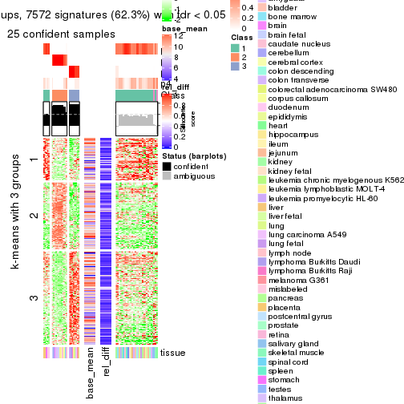</p>

</div>
<div id='tab-ATC-kmeans-get-signatures-4'>
<pre><code class="r">get_signatures(res, k = 5)
</code></pre>

<p></p>

</div>
<div id='tab-ATC-kmeans-get-signatures-5'>
<pre><code class="r">get_signatures(res, k = 6)
</code></pre>

<p></p>

</div>
</div>


Signature heatmaps where rows are not scaled:


<script>
$( function() {
	$( '#tabs-ATC-kmeans-get-signatures-no-scale' ).tabs();
} );
</script>
<div id='tabs-ATC-kmeans-get-signatures-no-scale'>
<ul>
<li><a href='#tab-ATC-kmeans-get-signatures-no-scale-1'>k = 2</a></li>
<li><a href='#tab-ATC-kmeans-get-signatures-no-scale-2'>k = 3</a></li>
<li><a href='#tab-ATC-kmeans-get-signatures-no-scale-3'>k = 4</a></li>
<li><a href='#tab-ATC-kmeans-get-signatures-no-scale-4'>k = 5</a></li>
<li><a href='#tab-ATC-kmeans-get-signatures-no-scale-5'>k = 6</a></li>
</ul>
<div id='tab-ATC-kmeans-get-signatures-no-scale-1'>
<pre><code class="r">get_signatures(res, k = 2, scale_rows = FALSE)
</code></pre>

<p></p>

</div>
<div id='tab-ATC-kmeans-get-signatures-no-scale-2'>
<pre><code class="r">get_signatures(res, k = 3, scale_rows = FALSE)
</code></pre>

<p></p>

</div>
<div id='tab-ATC-kmeans-get-signatures-no-scale-3'>
<pre><code class="r">get_signatures(res, k = 4, scale_rows = FALSE)
</code></pre>

<p></p>

</div>
<div id='tab-ATC-kmeans-get-signatures-no-scale-4'>
<pre><code class="r">get_signatures(res, k = 5, scale_rows = FALSE)
</code></pre>

<p></p>

</div>
<div id='tab-ATC-kmeans-get-signatures-no-scale-5'>
<pre><code class="r">get_signatures(res, k = 6, scale_rows = FALSE)
</code></pre>

<p></p>

</div>
</div>


Compare the overlap of signatures from different k:

```r
compare_signatures(res)
```


`get_signature()` returns a data frame invisibly. TO get the list of signatures, the function
call should be assigned to a variable explicitly. In following code, if `plot` argument is set
to `FALSE`, no heatmap is plotted while only the differential analysis is performed.

```r
# code only for demonstration
tb = get_signature(res, k = ..., plot = FALSE)
```

An example of the output of `tb` is:

```
#>   which_row         fdr    mean_1    mean_2 scaled_mean_1 scaled_mean_2 km
#> 1        38 0.042760348  8.373488  9.131774    -0.5533452     0.5164555  1
#> 2        40 0.018707592  7.106213  8.469186    -0.6173731     0.5762149  1
#> 3        55 0.019134737 10.221463 11.207825    -0.6159697     0.5749050  1
#> 4        59 0.006059896  5.921854  7.869574    -0.6899429     0.6439467  1
#> 5        60 0.018055526  8.928898 10.211722    -0.6204761     0.5791110  1
#> 6        98 0.009384629 15.714769 14.887706     0.6635654    -0.6193277  2
...
```

The columns in `tb` are:

1. `which_row`: row indices corresponding to the input matrix.
2. `fdr`: FDR for the differential test. 
3. `mean_x`: The mean value in group x.
4. `scaled_mean_x`: The mean value in group x after rows are scaled.
5. `km`: Row groups if k-means clustering is applied to rows.


UMAP plot which shows how samples are separated.


<script>
$( function() {
	$( '#tabs-ATC-kmeans-dimension-reduction' ).tabs();
} );
</script>
<div id='tabs-ATC-kmeans-dimension-reduction'>
<ul>
<li><a href='#tab-ATC-kmeans-dimension-reduction-1'>k = 2</a></li>
<li><a href='#tab-ATC-kmeans-dimension-reduction-2'>k = 3</a></li>
<li><a href='#tab-ATC-kmeans-dimension-reduction-3'>k = 4</a></li>
<li><a href='#tab-ATC-kmeans-dimension-reduction-4'>k = 5</a></li>
<li><a href='#tab-ATC-kmeans-dimension-reduction-5'>k = 6</a></li>
</ul>
<div id='tab-ATC-kmeans-dimension-reduction-1'>
<pre><code class="r">dimension_reduction(res, k = 2, method = &quot;UMAP&quot;)
</code></pre>

<p></p>

</div>
<div id='tab-ATC-kmeans-dimension-reduction-2'>
<pre><code class="r">dimension_reduction(res, k = 3, method = &quot;UMAP&quot;)
</code></pre>

<p></p>

</div>
<div id='tab-ATC-kmeans-dimension-reduction-3'>
<pre><code class="r">dimension_reduction(res, k = 4, method = &quot;UMAP&quot;)
</code></pre>

<p></p>

</div>
<div id='tab-ATC-kmeans-dimension-reduction-4'>
<pre><code class="r">dimension_reduction(res, k = 5, method = &quot;UMAP&quot;)
</code></pre>

<p></p>

</div>
<div id='tab-ATC-kmeans-dimension-reduction-5'>
<pre><code class="r">dimension_reduction(res, k = 6, method = &quot;UMAP&quot;)
</code></pre>

<p></p>

</div>
</div>


Following heatmap shows how subgroups are split when increasing `k`:

```r
collect_classes(res)
```

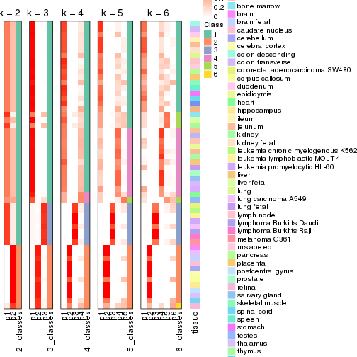


Test correlation between subgroups and known annotations. If the known
annotation is numeric, one-way ANOVA test is applied, and if the known
annotation is discrete, chi-squared contingency table test is applied.

```r
test_to_known_factors(res)
```

```
#>             n tissue(p) k
#> ATC:kmeans 46     0.389 2
#> ATC:kmeans 52     0.372 3
#> ATC:kmeans 25     0.394 4
#> ATC:kmeans 40     0.426 5
#> ATC:kmeans 35     0.397 6
```


If matrix rows can be associated to genes, consider to use `functional_enrichment(res,
...)` to perform function enrichment for the signature genes. See [this vignette](http://bioconductor.org/packages/devel/bioc/vignettes/cola/inst/doc/functional_enrichment.html) for more detailed explanations.


 

---------------------------------------------------


### ATC:skmeans*


The object with results only for a single top-value method and a single partition method 
can be extracted as:

```r
res = res_list["ATC", "skmeans"]
# you can also extract it by
# res = res_list["ATC:skmeans"]
```

A summary of `res` and all the functions that can be applied to it:

```r
res
```

```
#> A 'ConsensusPartition' object with k = 2, 3, 4, 5, 6.
#>   On a matrix with 12150 rows and 54 columns.
#>   Top rows (1000, 2000, 3000, 4000, 5000) are extracted by 'ATC' method.
#>   Subgroups are detected by 'skmeans' method.
#>   Performed in total 1250 partitions by row resampling.
#>   Best k for subgroups seems to be 3.
#> 
#> Following methods can be applied to this 'ConsensusPartition' object:
#>  [1] "cola_report"             "collect_classes"         "collect_plots"          
#>  [4] "collect_stats"           "colnames"                "compare_signatures"     
#>  [7] "consensus_heatmap"       "dimension_reduction"     "functional_enrichment"  
#> [10] "get_anno_col"            "get_anno"                "get_classes"            
#> [13] "get_consensus"           "get_matrix"              "get_membership"         
#> [16] "get_param"               "get_signatures"          "get_stats"              
#> [19] "is_best_k"               "is_stable_k"             "membership_heatmap"     
#> [22] "ncol"                    "nrow"                    "plot_ecdf"              
#> [25] "rownames"                "select_partition_number" "show"                   
#> [28] "suggest_best_k"          "test_to_known_factors"
```

`collect_plots()` function collects all the plots made from `res` for all `k` (number of partitions)
into one single page to provide an easy and fast comparison between different `k`.

```r
collect_plots(res)
```


The plots are:

- The first row: a plot of the ECDF (empirical cumulative distribution
  function) curves of the consensus matrix for each `k` and the heatmap of
  predicted classes for each `k`.
- The second row: heatmaps of the consensus matrix for each `k`.
- The third row: heatmaps of the membership matrix for each `k`.
- The fouth row: heatmaps of the signatures for each `k`.

All the plots in panels can be made by individual functions and they are
plotted later in this section.

`select_partition_number()` produces several plots showing different
statistics for choosing "optimized" `k`. There are following statistics:

- ECDF curves of the consensus matrix for each `k`;
- 1-PAC. [The PAC
  score](https://en.wikipedia.org/wiki/Consensus_clustering#Over-interpretation_potential_of_consensus_clustering)
  measures the proportion of the ambiguous subgrouping.
- Mean silhouette score.
- Concordance. The mean probability of fiting the consensus class ids in all
  partitions.
- Area increased. Denote $A_k$ as the area under the ECDF curve for current
  `k`, the area increased is defined as $A_k - A_{k-1}$.
- Rand index. The percent of pairs of samples that are both in a same cluster
  or both are not in a same cluster in the partition of k and k-1.
- Jaccard index. The ratio of pairs of samples are both in a same cluster in
  the partition of k and k-1 and the pairs of samples are both in a same
  cluster in the partition k or k-1.

The detailed explanations of these statistics can be found in [the _cola_
vignette](http://bioconductor.org/packages/devel/bioc/vignettes/cola/inst/doc/cola.html#toc_13).

Generally speaking, lower PAC score, higher mean silhouette score or higher
concordance corresponds to better partition. Rand index and Jaccard index
measure how similar the current partition is compared to partition with `k-1`.
If they are too similar, we won't accept `k` is better than `k-1`.

```r
select_partition_number(res)
```


The numeric values for all these statistics can be obtained by `get_stats()`.

```r
get_stats(res)
```

```
#>   k 1-PAC mean_silhouette concordance area_increased  Rand Jaccard
#> 2 2 0.704           0.824       0.914         0.4503 0.516   0.516
#> 3 3 0.916           0.920       0.969         0.3694 0.814   0.658
#> 4 4 0.816           0.795       0.906         0.2207 0.829   0.574
#> 5 5 0.784           0.760       0.868         0.0638 0.904   0.637
#> 6 6 0.802           0.655       0.799         0.0310 0.987   0.930
```

`suggest_best_k()` suggests the best $k$ based on these statistics. The rules are as follows:

- All $k$ with Jaccard index larger than 0.95 are removed because increasing
  $k$ does not provide enough extra information. If all $k$ are removed, it is
  marked as no subgroup is detected.
- For all $k$ with 1-PAC score larger than 0.9, the maximal $k$ is taken as
  the best $k$, and other $k$ are marked as optional $k$.
- If it does not fit the second rule. The $k$ with the maximal vote of the
  highest 1-PAC score, highest mean silhouette, and highest concordance is
  taken as the best $k$.

```r
suggest_best_k(res)
```

```
#> [1] 3
```


Following shows the table of the partitions (You need to click the **show/hide
code output** link to see it). The membership matrix (columns with name `p*`)
is inferred by
[`clue::cl_consensus()`](https://www.rdocumentation.org/link/cl_consensus?package=clue)
function with the `SE` method. Basically the value in the membership matrix
represents the probability to belong to a certain group. The finall class
label for an item is determined with the group with highest probability it
belongs to.

In `get_classes()` function, the entropy is calculated from the membership
matrix and the silhouette score is calculated from the consensus matrix.


<script>
$( function() {
	$( '#tabs-ATC-skmeans-get-classes' ).tabs();
} );
</script>
<div id='tabs-ATC-skmeans-get-classes'>
<ul>
<li><a href='#tab-ATC-skmeans-get-classes-1'>k = 2</a></li>
<li><a href='#tab-ATC-skmeans-get-classes-2'>k = 3</a></li>
<li><a href='#tab-ATC-skmeans-get-classes-3'>k = 4</a></li>
<li><a href='#tab-ATC-skmeans-get-classes-4'>k = 5</a></li>
<li><a href='#tab-ATC-skmeans-get-classes-5'>k = 6</a></li>
</ul>

<div id='tab-ATC-skmeans-get-classes-1'>
<p><a id='tab-ATC-skmeans-get-classes-1-a' style='color:#0366d6' href='#'>show/hide code output</a></p>
<pre><code class="r">cbind(get_classes(res, k = 2), get_membership(res, k = 2))
</code></pre>

<pre><code>#&gt;          class entropy silhouette    p1    p2
#&gt; GSM28815     1   0.000      0.956 1.000 0.000
#&gt; GSM28816     1   0.929      0.412 0.656 0.344
#&gt; GSM28817     1   0.000      0.956 1.000 0.000
#&gt; GSM11327     1   0.000      0.956 1.000 0.000
#&gt; GSM28825     2   0.000      0.797 0.000 1.000
#&gt; GSM11322     2   0.000      0.797 0.000 1.000
#&gt; GSM28828     2   0.000      0.797 0.000 1.000
#&gt; GSM11346     2   0.000      0.797 0.000 1.000
#&gt; GSM28808     2   0.000      0.797 0.000 1.000
#&gt; GSM11332     2   0.000      0.797 0.000 1.000
#&gt; GSM28811     2   0.000      0.797 0.000 1.000
#&gt; GSM11334     2   0.000      0.797 0.000 1.000
#&gt; GSM11340     2   0.000      0.797 0.000 1.000
#&gt; GSM28812     2   0.000      0.797 0.000 1.000
#&gt; GSM11345     1   0.000      0.956 1.000 0.000
#&gt; GSM28819     1   0.000      0.956 1.000 0.000
#&gt; GSM11321     2   0.973      0.575 0.404 0.596
#&gt; GSM28820     1   0.000      0.956 1.000 0.000
#&gt; GSM11339     1   0.000      0.956 1.000 0.000
#&gt; GSM28804     1   0.973      0.285 0.596 0.404
#&gt; GSM28823     1   0.000      0.956 1.000 0.000
#&gt; GSM11336     1   0.000      0.956 1.000 0.000
#&gt; GSM11342     1   0.000      0.956 1.000 0.000
#&gt; GSM11333     1   0.000      0.956 1.000 0.000
#&gt; GSM28802     1   0.000      0.956 1.000 0.000
#&gt; GSM28803     2   0.973      0.575 0.404 0.596
#&gt; GSM11343     2   0.973      0.575 0.404 0.596
#&gt; GSM11347     2   0.973      0.575 0.404 0.596
#&gt; GSM28824     1   0.000      0.956 1.000 0.000
#&gt; GSM28813     1   0.000      0.956 1.000 0.000
#&gt; GSM28827     1   0.000      0.956 1.000 0.000
#&gt; GSM11337     1   0.000      0.956 1.000 0.000
#&gt; GSM28814     2   0.973      0.575 0.404 0.596
#&gt; GSM11331     1   0.000      0.956 1.000 0.000
#&gt; GSM11344     2   0.973      0.575 0.404 0.596
#&gt; GSM11330     2   0.973      0.575 0.404 0.596
#&gt; GSM11325     2   0.973      0.575 0.404 0.596
#&gt; GSM11338     1   0.000      0.956 1.000 0.000
#&gt; GSM28806     1   0.000      0.956 1.000 0.000
#&gt; GSM28826     1   0.000      0.956 1.000 0.000
#&gt; GSM28818     1   0.000      0.956 1.000 0.000
#&gt; GSM28821     2   0.000      0.797 0.000 1.000
#&gt; GSM28807     1   0.000      0.956 1.000 0.000
#&gt; GSM28822     1   0.913      0.290 0.672 0.328
#&gt; GSM11328     2   0.000      0.797 0.000 1.000
#&gt; GSM11323     1   0.000      0.956 1.000 0.000
#&gt; GSM11324     1   0.000      0.956 1.000 0.000
#&gt; GSM11341     2   0.900      0.644 0.316 0.684
#&gt; GSM11326     1   0.000      0.956 1.000 0.000
#&gt; GSM28810     1   0.000      0.956 1.000 0.000
#&gt; GSM11335     1   0.000      0.956 1.000 0.000
#&gt; GSM28809     1   0.000      0.956 1.000 0.000
#&gt; GSM11329     1   0.000      0.956 1.000 0.000
#&gt; GSM28805     1   0.000      0.956 1.000 0.000
</code></pre>

<script>
$('#tab-ATC-skmeans-get-classes-1-a').parent().next().next().hide();
$('#tab-ATC-skmeans-get-classes-1-a').click(function(){
  $('#tab-ATC-skmeans-get-classes-1-a').parent().next().next().toggle();
  return(false);
});
</script>
</div>

<div id='tab-ATC-skmeans-get-classes-2'>
<p><a id='tab-ATC-skmeans-get-classes-2-a' style='color:#0366d6' href='#'>show/hide code output</a></p>
<pre><code class="r">cbind(get_classes(res, k = 3), get_membership(res, k = 3))
</code></pre>

<pre><code>#&gt;          class entropy silhouette    p1    p2    p3
#&gt; GSM28815     1   0.000     0.9663 1.000 0.000 0.000
#&gt; GSM28816     1   0.000     0.9663 1.000 0.000 0.000
#&gt; GSM28817     1   0.000     0.9663 1.000 0.000 0.000
#&gt; GSM11327     3   0.000     0.9653 0.000 0.000 1.000
#&gt; GSM28825     2   0.000     0.9487 0.000 1.000 0.000
#&gt; GSM11322     2   0.000     0.9487 0.000 1.000 0.000
#&gt; GSM28828     2   0.000     0.9487 0.000 1.000 0.000
#&gt; GSM11346     2   0.000     0.9487 0.000 1.000 0.000
#&gt; GSM28808     2   0.000     0.9487 0.000 1.000 0.000
#&gt; GSM11332     2   0.000     0.9487 0.000 1.000 0.000
#&gt; GSM28811     2   0.000     0.9487 0.000 1.000 0.000
#&gt; GSM11334     2   0.000     0.9487 0.000 1.000 0.000
#&gt; GSM11340     2   0.000     0.9487 0.000 1.000 0.000
#&gt; GSM28812     2   0.000     0.9487 0.000 1.000 0.000
#&gt; GSM11345     1   0.175     0.9278 0.952 0.000 0.048
#&gt; GSM28819     1   0.375     0.8334 0.856 0.000 0.144
#&gt; GSM11321     3   0.000     0.9653 0.000 0.000 1.000
#&gt; GSM28820     1   0.000     0.9663 1.000 0.000 0.000
#&gt; GSM11339     1   0.000     0.9663 1.000 0.000 0.000
#&gt; GSM28804     2   0.630     0.0999 0.476 0.524 0.000
#&gt; GSM28823     1   0.400     0.8152 0.840 0.000 0.160
#&gt; GSM11336     1   0.000     0.9663 1.000 0.000 0.000
#&gt; GSM11342     1   0.000     0.9663 1.000 0.000 0.000
#&gt; GSM11333     1   0.000     0.9663 1.000 0.000 0.000
#&gt; GSM28802     1   0.400     0.8152 0.840 0.000 0.160
#&gt; GSM28803     3   0.000     0.9653 0.000 0.000 1.000
#&gt; GSM11343     3   0.000     0.9653 0.000 0.000 1.000
#&gt; GSM11347     3   0.000     0.9653 0.000 0.000 1.000
#&gt; GSM28824     1   0.000     0.9663 1.000 0.000 0.000
#&gt; GSM28813     1   0.608     0.3992 0.612 0.000 0.388
#&gt; GSM28827     1   0.000     0.9663 1.000 0.000 0.000
#&gt; GSM11337     1   0.000     0.9663 1.000 0.000 0.000
#&gt; GSM28814     3   0.000     0.9653 0.000 0.000 1.000
#&gt; GSM11331     1   0.000     0.9663 1.000 0.000 0.000
#&gt; GSM11344     3   0.000     0.9653 0.000 0.000 1.000
#&gt; GSM11330     3   0.000     0.9653 0.000 0.000 1.000
#&gt; GSM11325     3   0.000     0.9653 0.000 0.000 1.000
#&gt; GSM11338     1   0.000     0.9663 1.000 0.000 0.000
#&gt; GSM28806     1   0.000     0.9663 1.000 0.000 0.000
#&gt; GSM28826     1   0.000     0.9663 1.000 0.000 0.000
#&gt; GSM28818     1   0.000     0.9663 1.000 0.000 0.000
#&gt; GSM28821     2   0.000     0.9487 0.000 1.000 0.000
#&gt; GSM28807     1   0.000     0.9663 1.000 0.000 0.000
#&gt; GSM28822     3   0.556     0.5687 0.300 0.000 0.700
#&gt; GSM11328     2   0.000     0.9487 0.000 1.000 0.000
#&gt; GSM11323     1   0.000     0.9663 1.000 0.000 0.000
#&gt; GSM11324     1   0.000     0.9663 1.000 0.000 0.000
#&gt; GSM11341     3   0.000     0.9653 0.000 0.000 1.000
#&gt; GSM11326     3   0.000     0.9653 0.000 0.000 1.000
#&gt; GSM28810     1   0.000     0.9663 1.000 0.000 0.000
#&gt; GSM11335     1   0.000     0.9663 1.000 0.000 0.000
#&gt; GSM28809     1   0.000     0.9663 1.000 0.000 0.000
#&gt; GSM11329     1   0.000     0.9663 1.000 0.000 0.000
#&gt; GSM28805     1   0.000     0.9663 1.000 0.000 0.000
</code></pre>

<script>
$('#tab-ATC-skmeans-get-classes-2-a').parent().next().next().hide();
$('#tab-ATC-skmeans-get-classes-2-a').click(function(){
  $('#tab-ATC-skmeans-get-classes-2-a').parent().next().next().toggle();
  return(false);
});
</script>
</div>

<div id='tab-ATC-skmeans-get-classes-3'>
<p><a id='tab-ATC-skmeans-get-classes-3-a' style='color:#0366d6' href='#'>show/hide code output</a></p>
<pre><code class="r">cbind(get_classes(res, k = 4), get_membership(res, k = 4))
</code></pre>

<pre><code>#&gt;          class entropy silhouette    p1    p2    p3    p4
#&gt; GSM28815     4  0.0188     0.8150 0.004 0.000 0.000 0.996
#&gt; GSM28816     4  0.0188     0.8150 0.004 0.000 0.000 0.996
#&gt; GSM28817     4  0.4877     0.0499 0.408 0.000 0.000 0.592
#&gt; GSM11327     3  0.0376     0.9926 0.004 0.000 0.992 0.004
#&gt; GSM28825     2  0.0000     1.0000 0.000 1.000 0.000 0.000
#&gt; GSM11322     2  0.0000     1.0000 0.000 1.000 0.000 0.000
#&gt; GSM28828     2  0.0000     1.0000 0.000 1.000 0.000 0.000
#&gt; GSM11346     2  0.0000     1.0000 0.000 1.000 0.000 0.000
#&gt; GSM28808     2  0.0000     1.0000 0.000 1.000 0.000 0.000
#&gt; GSM11332     2  0.0000     1.0000 0.000 1.000 0.000 0.000
#&gt; GSM28811     2  0.0000     1.0000 0.000 1.000 0.000 0.000
#&gt; GSM11334     2  0.0000     1.0000 0.000 1.000 0.000 0.000
#&gt; GSM11340     2  0.0000     1.0000 0.000 1.000 0.000 0.000
#&gt; GSM28812     2  0.0000     1.0000 0.000 1.000 0.000 0.000
#&gt; GSM11345     1  0.0000     0.7664 1.000 0.000 0.000 0.000
#&gt; GSM28819     1  0.0000     0.7664 1.000 0.000 0.000 0.000
#&gt; GSM11321     3  0.0000     0.9984 0.000 0.000 1.000 0.000
#&gt; GSM28820     1  0.4679     0.5753 0.648 0.000 0.000 0.352
#&gt; GSM11339     4  0.1637     0.7768 0.060 0.000 0.000 0.940
#&gt; GSM28804     4  0.4966     0.6215 0.156 0.076 0.000 0.768
#&gt; GSM28823     1  0.0188     0.7674 0.996 0.000 0.000 0.004
#&gt; GSM11336     4  0.0000     0.8142 0.000 0.000 0.000 1.000
#&gt; GSM11342     1  0.0188     0.7674 0.996 0.000 0.000 0.004
#&gt; GSM11333     4  0.0188     0.8150 0.004 0.000 0.000 0.996
#&gt; GSM28802     1  0.0188     0.7674 0.996 0.000 0.000 0.004
#&gt; GSM28803     3  0.0000     0.9984 0.000 0.000 1.000 0.000
#&gt; GSM11343     3  0.0000     0.9984 0.000 0.000 1.000 0.000
#&gt; GSM11347     3  0.0000     0.9984 0.000 0.000 1.000 0.000
#&gt; GSM28824     4  0.1118     0.7909 0.036 0.000 0.000 0.964
#&gt; GSM28813     4  0.7514    -0.1800 0.384 0.000 0.184 0.432
#&gt; GSM28827     1  0.1716     0.7633 0.936 0.000 0.000 0.064
#&gt; GSM11337     1  0.4994     0.3641 0.520 0.000 0.000 0.480
#&gt; GSM28814     3  0.0000     0.9984 0.000 0.000 1.000 0.000
#&gt; GSM11331     1  0.3266     0.7521 0.832 0.000 0.000 0.168
#&gt; GSM11344     3  0.0000     0.9984 0.000 0.000 1.000 0.000
#&gt; GSM11330     3  0.0000     0.9984 0.000 0.000 1.000 0.000
#&gt; GSM11325     3  0.0000     0.9984 0.000 0.000 1.000 0.000
#&gt; GSM11338     1  0.4877     0.4930 0.592 0.000 0.000 0.408
#&gt; GSM28806     1  0.4605     0.2781 0.664 0.000 0.000 0.336
#&gt; GSM28826     1  0.4888     0.4860 0.588 0.000 0.000 0.412
#&gt; GSM28818     4  0.0188     0.8150 0.004 0.000 0.000 0.996
#&gt; GSM28821     2  0.0000     1.0000 0.000 1.000 0.000 0.000
#&gt; GSM28807     4  0.0000     0.8142 0.000 0.000 0.000 1.000
#&gt; GSM28822     4  0.7629     0.3136 0.264 0.000 0.264 0.472
#&gt; GSM11328     2  0.0000     1.0000 0.000 1.000 0.000 0.000
#&gt; GSM11323     1  0.3266     0.7521 0.832 0.000 0.000 0.168
#&gt; GSM11324     1  0.3219     0.7538 0.836 0.000 0.000 0.164
#&gt; GSM11341     3  0.0000     0.9984 0.000 0.000 1.000 0.000
#&gt; GSM11326     3  0.0376     0.9926 0.004 0.000 0.992 0.004
#&gt; GSM28810     1  0.0188     0.7674 0.996 0.000 0.000 0.004
#&gt; GSM11335     1  0.3266     0.7521 0.832 0.000 0.000 0.168
#&gt; GSM28809     4  0.0000     0.8142 0.000 0.000 0.000 1.000
#&gt; GSM11329     1  0.4761     0.5354 0.628 0.000 0.000 0.372
#&gt; GSM28805     1  0.2011     0.7577 0.920 0.000 0.000 0.080
</code></pre>

<script>
$('#tab-ATC-skmeans-get-classes-3-a').parent().next().next().hide();
$('#tab-ATC-skmeans-get-classes-3-a').click(function(){
  $('#tab-ATC-skmeans-get-classes-3-a').parent().next().next().toggle();
  return(false);
});
</script>
</div>

<div id='tab-ATC-skmeans-get-classes-4'>
<p><a id='tab-ATC-skmeans-get-classes-4-a' style='color:#0366d6' href='#'>show/hide code output</a></p>
<pre><code class="r">cbind(get_classes(res, k = 5), get_membership(res, k = 5))
</code></pre>

<pre><code>#&gt;          class entropy silhouette    p1    p2    p3    p4    p5
#&gt; GSM28815     5  0.0865     0.8110 0.004 0.000 0.000 0.024 0.972
#&gt; GSM28816     5  0.0865     0.8110 0.004 0.000 0.000 0.024 0.972
#&gt; GSM28817     5  0.4437     0.6231 0.140 0.000 0.000 0.100 0.760
#&gt; GSM11327     3  0.3430     0.7787 0.220 0.000 0.776 0.004 0.000
#&gt; GSM28825     2  0.0000     1.0000 0.000 1.000 0.000 0.000 0.000
#&gt; GSM11322     2  0.0000     1.0000 0.000 1.000 0.000 0.000 0.000
#&gt; GSM28828     2  0.0000     1.0000 0.000 1.000 0.000 0.000 0.000
#&gt; GSM11346     2  0.0000     1.0000 0.000 1.000 0.000 0.000 0.000
#&gt; GSM28808     2  0.0000     1.0000 0.000 1.000 0.000 0.000 0.000
#&gt; GSM11332     2  0.0000     1.0000 0.000 1.000 0.000 0.000 0.000
#&gt; GSM28811     2  0.0000     1.0000 0.000 1.000 0.000 0.000 0.000
#&gt; GSM11334     2  0.0000     1.0000 0.000 1.000 0.000 0.000 0.000
#&gt; GSM11340     2  0.0000     1.0000 0.000 1.000 0.000 0.000 0.000
#&gt; GSM28812     2  0.0000     1.0000 0.000 1.000 0.000 0.000 0.000
#&gt; GSM11345     1  0.3928     0.4770 0.700 0.000 0.000 0.296 0.004
#&gt; GSM28819     1  0.3884     0.4867 0.708 0.000 0.000 0.288 0.004
#&gt; GSM11321     3  0.0000     0.9539 0.000 0.000 1.000 0.000 0.000
#&gt; GSM28820     1  0.5814     0.5726 0.584 0.000 0.000 0.128 0.288
#&gt; GSM11339     5  0.2661     0.7671 0.056 0.000 0.000 0.056 0.888
#&gt; GSM28804     5  0.4568     0.5284 0.020 0.008 0.000 0.288 0.684
#&gt; GSM28823     4  0.2732     0.7124 0.160 0.000 0.000 0.840 0.000
#&gt; GSM11336     5  0.1792     0.7869 0.084 0.000 0.000 0.000 0.916
#&gt; GSM11342     4  0.2732     0.7124 0.160 0.000 0.000 0.840 0.000
#&gt; GSM11333     5  0.0324     0.8135 0.004 0.000 0.000 0.004 0.992
#&gt; GSM28802     4  0.2605     0.7134 0.148 0.000 0.000 0.852 0.000
#&gt; GSM28803     3  0.0000     0.9539 0.000 0.000 1.000 0.000 0.000
#&gt; GSM11343     3  0.0000     0.9539 0.000 0.000 1.000 0.000 0.000
#&gt; GSM11347     3  0.0000     0.9539 0.000 0.000 1.000 0.000 0.000
#&gt; GSM28824     5  0.4503     0.4696 0.312 0.000 0.000 0.024 0.664
#&gt; GSM28813     1  0.3822     0.6301 0.808 0.000 0.020 0.020 0.152
#&gt; GSM28827     4  0.5807     0.1627 0.424 0.000 0.000 0.484 0.092
#&gt; GSM11337     1  0.4599     0.4941 0.600 0.000 0.000 0.016 0.384
#&gt; GSM28814     3  0.0000     0.9539 0.000 0.000 1.000 0.000 0.000
#&gt; GSM11331     1  0.2124     0.6992 0.916 0.000 0.000 0.056 0.028
#&gt; GSM11344     3  0.0000     0.9539 0.000 0.000 1.000 0.000 0.000
#&gt; GSM11330     3  0.0000     0.9539 0.000 0.000 1.000 0.000 0.000
#&gt; GSM11325     3  0.0000     0.9539 0.000 0.000 1.000 0.000 0.000
#&gt; GSM11338     1  0.3163     0.6961 0.824 0.000 0.000 0.012 0.164
#&gt; GSM28806     4  0.2659     0.6818 0.060 0.000 0.000 0.888 0.052
#&gt; GSM28826     1  0.3821     0.6898 0.764 0.000 0.000 0.020 0.216
#&gt; GSM28818     5  0.0703     0.8135 0.024 0.000 0.000 0.000 0.976
#&gt; GSM28821     2  0.0000     1.0000 0.000 1.000 0.000 0.000 0.000
#&gt; GSM28807     5  0.1205     0.8097 0.040 0.000 0.000 0.004 0.956
#&gt; GSM28822     4  0.5979     0.3869 0.044 0.000 0.124 0.668 0.164
#&gt; GSM11328     2  0.0000     1.0000 0.000 1.000 0.000 0.000 0.000
#&gt; GSM11323     1  0.2079     0.6930 0.916 0.000 0.000 0.064 0.020
#&gt; GSM11324     1  0.5032     0.6409 0.704 0.000 0.000 0.128 0.168
#&gt; GSM11341     3  0.0566     0.9440 0.004 0.000 0.984 0.012 0.000
#&gt; GSM11326     3  0.3430     0.7787 0.220 0.000 0.776 0.004 0.000
#&gt; GSM28810     4  0.2966     0.7000 0.136 0.000 0.000 0.848 0.016
#&gt; GSM11335     1  0.1648     0.6946 0.940 0.000 0.000 0.040 0.020
#&gt; GSM28809     5  0.0880     0.8120 0.032 0.000 0.000 0.000 0.968
#&gt; GSM11329     5  0.6606    -0.0896 0.228 0.000 0.000 0.328 0.444
#&gt; GSM28805     4  0.6759     0.1247 0.348 0.000 0.000 0.384 0.268
</code></pre>

<script>
$('#tab-ATC-skmeans-get-classes-4-a').parent().next().next().hide();
$('#tab-ATC-skmeans-get-classes-4-a').click(function(){
  $('#tab-ATC-skmeans-get-classes-4-a').parent().next().next().toggle();
  return(false);
});
</script>
</div>

<div id='tab-ATC-skmeans-get-classes-5'>
<p><a id='tab-ATC-skmeans-get-classes-5-a' style='color:#0366d6' href='#'>show/hide code output</a></p>
<pre><code class="r">cbind(get_classes(res, k = 6), get_membership(res, k = 6))
</code></pre>

<pre><code>#&gt;          class entropy silhouette    p1    p2    p3    p4    p5    p6
#&gt; GSM28815     5  0.3775     0.4972 0.016 0.000 0.000 0.228 0.744 0.012
#&gt; GSM28816     5  0.3568     0.5089 0.016 0.000 0.000 0.212 0.764 0.008
#&gt; GSM28817     5  0.6534     0.3572 0.124 0.000 0.000 0.148 0.556 0.172
#&gt; GSM11327     3  0.5044     0.5951 0.220 0.000 0.656 0.116 0.004 0.004
#&gt; GSM28825     2  0.0000     1.0000 0.000 1.000 0.000 0.000 0.000 0.000
#&gt; GSM11322     2  0.0000     1.0000 0.000 1.000 0.000 0.000 0.000 0.000
#&gt; GSM28828     2  0.0000     1.0000 0.000 1.000 0.000 0.000 0.000 0.000
#&gt; GSM11346     2  0.0000     1.0000 0.000 1.000 0.000 0.000 0.000 0.000
#&gt; GSM28808     2  0.0000     1.0000 0.000 1.000 0.000 0.000 0.000 0.000
#&gt; GSM11332     2  0.0000     1.0000 0.000 1.000 0.000 0.000 0.000 0.000
#&gt; GSM28811     2  0.0000     1.0000 0.000 1.000 0.000 0.000 0.000 0.000
#&gt; GSM11334     2  0.0000     1.0000 0.000 1.000 0.000 0.000 0.000 0.000
#&gt; GSM11340     2  0.0000     1.0000 0.000 1.000 0.000 0.000 0.000 0.000
#&gt; GSM28812     2  0.0000     1.0000 0.000 1.000 0.000 0.000 0.000 0.000
#&gt; GSM11345     1  0.4443     0.4330 0.656 0.000 0.000 0.036 0.008 0.300
#&gt; GSM28819     1  0.4506     0.4313 0.652 0.000 0.000 0.040 0.008 0.300
#&gt; GSM11321     3  0.0000     0.9200 0.000 0.000 1.000 0.000 0.000 0.000
#&gt; GSM28820     1  0.6953     0.3212 0.428 0.000 0.000 0.092 0.312 0.168
#&gt; GSM11339     5  0.5626     0.4482 0.064 0.000 0.000 0.176 0.648 0.112
#&gt; GSM28804     4  0.4780     0.2889 0.000 0.016 0.000 0.588 0.364 0.032
#&gt; GSM28823     6  0.0865     0.5968 0.036 0.000 0.000 0.000 0.000 0.964
#&gt; GSM11336     5  0.3159     0.5409 0.072 0.000 0.000 0.084 0.840 0.004
#&gt; GSM11342     6  0.0865     0.5968 0.036 0.000 0.000 0.000 0.000 0.964
#&gt; GSM11333     5  0.1806     0.5917 0.000 0.000 0.000 0.088 0.908 0.004
#&gt; GSM28802     6  0.1708     0.5917 0.024 0.000 0.000 0.040 0.004 0.932
#&gt; GSM28803     3  0.0000     0.9200 0.000 0.000 1.000 0.000 0.000 0.000
#&gt; GSM11343     3  0.0000     0.9200 0.000 0.000 1.000 0.000 0.000 0.000
#&gt; GSM11347     3  0.0000     0.9200 0.000 0.000 1.000 0.000 0.000 0.000
#&gt; GSM28824     5  0.5043     0.3393 0.196 0.000 0.000 0.136 0.660 0.008
#&gt; GSM28813     1  0.4937     0.5253 0.696 0.000 0.004 0.132 0.156 0.012
#&gt; GSM28827     6  0.7240     0.0393 0.328 0.000 0.000 0.164 0.132 0.376
#&gt; GSM11337     1  0.5770     0.3737 0.512 0.000 0.000 0.112 0.356 0.020
#&gt; GSM28814     3  0.0000     0.9200 0.000 0.000 1.000 0.000 0.000 0.000
#&gt; GSM11331     1  0.4152     0.5441 0.764 0.000 0.000 0.136 0.012 0.088
#&gt; GSM11344     3  0.0000     0.9200 0.000 0.000 1.000 0.000 0.000 0.000
#&gt; GSM11330     3  0.0000     0.9200 0.000 0.000 1.000 0.000 0.000 0.000
#&gt; GSM11325     3  0.0000     0.9200 0.000 0.000 1.000 0.000 0.000 0.000
#&gt; GSM11338     1  0.4573     0.5917 0.720 0.000 0.000 0.084 0.180 0.016
#&gt; GSM28806     6  0.3157     0.4587 0.016 0.000 0.000 0.088 0.048 0.848
#&gt; GSM28826     1  0.4385     0.5967 0.724 0.000 0.000 0.056 0.204 0.016
#&gt; GSM28818     5  0.0508     0.6269 0.012 0.000 0.000 0.004 0.984 0.000
#&gt; GSM28821     2  0.0000     1.0000 0.000 1.000 0.000 0.000 0.000 0.000
#&gt; GSM28807     5  0.1485     0.6176 0.028 0.000 0.000 0.024 0.944 0.004
#&gt; GSM28822     4  0.5468     0.3779 0.008 0.000 0.088 0.660 0.040 0.204
#&gt; GSM11328     2  0.0000     1.0000 0.000 1.000 0.000 0.000 0.000 0.000
#&gt; GSM11323     1  0.4064     0.5512 0.772 0.000 0.000 0.132 0.012 0.084
#&gt; GSM11324     1  0.6432     0.4592 0.564 0.000 0.000 0.100 0.164 0.172
#&gt; GSM11341     3  0.1075     0.8829 0.000 0.000 0.952 0.048 0.000 0.000
#&gt; GSM11326     3  0.4994     0.6047 0.212 0.000 0.664 0.116 0.004 0.004
#&gt; GSM28810     6  0.5836     0.3743 0.100 0.000 0.000 0.320 0.036 0.544
#&gt; GSM11335     1  0.2704     0.5716 0.876 0.000 0.000 0.076 0.012 0.036
#&gt; GSM28809     5  0.1088     0.6246 0.024 0.000 0.000 0.016 0.960 0.000
#&gt; GSM11329     5  0.7484    -0.1145 0.156 0.000 0.000 0.204 0.348 0.292
#&gt; GSM28805     6  0.7641     0.1487 0.216 0.000 0.000 0.248 0.208 0.328
</code></pre>

<script>
$('#tab-ATC-skmeans-get-classes-5-a').parent().next().next().hide();
$('#tab-ATC-skmeans-get-classes-5-a').click(function(){
  $('#tab-ATC-skmeans-get-classes-5-a').parent().next().next().toggle();
  return(false);
});
</script>
</div>
</div>

Heatmaps for the consensus matrix. It visualizes the probability of two
samples to be in a same group.


<script>
$( function() {
	$( '#tabs-ATC-skmeans-consensus-heatmap' ).tabs();
} );
</script>
<div id='tabs-ATC-skmeans-consensus-heatmap'>
<ul>
<li><a href='#tab-ATC-skmeans-consensus-heatmap-1'>k = 2</a></li>
<li><a href='#tab-ATC-skmeans-consensus-heatmap-2'>k = 3</a></li>
<li><a href='#tab-ATC-skmeans-consensus-heatmap-3'>k = 4</a></li>
<li><a href='#tab-ATC-skmeans-consensus-heatmap-4'>k = 5</a></li>
<li><a href='#tab-ATC-skmeans-consensus-heatmap-5'>k = 6</a></li>
</ul>
<div id='tab-ATC-skmeans-consensus-heatmap-1'>
<pre><code class="r">consensus_heatmap(res, k = 2)
</code></pre>

<p></p>

</div>
<div id='tab-ATC-skmeans-consensus-heatmap-2'>
<pre><code class="r">consensus_heatmap(res, k = 3)
</code></pre>

<p></p>

</div>
<div id='tab-ATC-skmeans-consensus-heatmap-3'>
<pre><code class="r">consensus_heatmap(res, k = 4)
</code></pre>

<p></p>

</div>
<div id='tab-ATC-skmeans-consensus-heatmap-4'>
<pre><code class="r">consensus_heatmap(res, k = 5)
</code></pre>

<p></p>

</div>
<div id='tab-ATC-skmeans-consensus-heatmap-5'>
<pre><code class="r">consensus_heatmap(res, k = 6)
</code></pre>

<p></p>

</div>
</div>

Heatmaps for the membership of samples in all partitions to see how consistent they are:


<script>
$( function() {
	$( '#tabs-ATC-skmeans-membership-heatmap' ).tabs();
} );
</script>
<div id='tabs-ATC-skmeans-membership-heatmap'>
<ul>
<li><a href='#tab-ATC-skmeans-membership-heatmap-1'>k = 2</a></li>
<li><a href='#tab-ATC-skmeans-membership-heatmap-2'>k = 3</a></li>
<li><a href='#tab-ATC-skmeans-membership-heatmap-3'>k = 4</a></li>
<li><a href='#tab-ATC-skmeans-membership-heatmap-4'>k = 5</a></li>
<li><a href='#tab-ATC-skmeans-membership-heatmap-5'>k = 6</a></li>
</ul>
<div id='tab-ATC-skmeans-membership-heatmap-1'>
<pre><code class="r">membership_heatmap(res, k = 2)
</code></pre>

<p></p>

</div>
<div id='tab-ATC-skmeans-membership-heatmap-2'>
<pre><code class="r">membership_heatmap(res, k = 3)
</code></pre>

<p></p>

</div>
<div id='tab-ATC-skmeans-membership-heatmap-3'>
<pre><code class="r">membership_heatmap(res, k = 4)
</code></pre>

<p></p>

</div>
<div id='tab-ATC-skmeans-membership-heatmap-4'>
<pre><code class="r">membership_heatmap(res, k = 5)
</code></pre>

<p></p>

</div>
<div id='tab-ATC-skmeans-membership-heatmap-5'>
<pre><code class="r">membership_heatmap(res, k = 6)
</code></pre>

<p></p>

</div>
</div>

As soon as we have had the classes for columns, we can look for signatures
which are significantly different between classes which can be candidate marks
for certain classes. Following are the heatmaps for signatures.


Signature heatmaps where rows are scaled:


<script>
$( function() {
	$( '#tabs-ATC-skmeans-get-signatures' ).tabs();
} );
</script>
<div id='tabs-ATC-skmeans-get-signatures'>
<ul>
<li><a href='#tab-ATC-skmeans-get-signatures-1'>k = 2</a></li>
<li><a href='#tab-ATC-skmeans-get-signatures-2'>k = 3</a></li>
<li><a href='#tab-ATC-skmeans-get-signatures-3'>k = 4</a></li>
<li><a href='#tab-ATC-skmeans-get-signatures-4'>k = 5</a></li>
<li><a href='#tab-ATC-skmeans-get-signatures-5'>k = 6</a></li>
</ul>
<div id='tab-ATC-skmeans-get-signatures-1'>
<pre><code class="r">get_signatures(res, k = 2)
</code></pre>

<p></p>

</div>
<div id='tab-ATC-skmeans-get-signatures-2'>
<pre><code class="r">get_signatures(res, k = 3)
</code></pre>

<p></p>

</div>
<div id='tab-ATC-skmeans-get-signatures-3'>
<pre><code class="r">get_signatures(res, k = 4)
</code></pre>

<p></p>

</div>
<div id='tab-ATC-skmeans-get-signatures-4'>
<pre><code class="r">get_signatures(res, k = 5)
</code></pre>

<p></p>

</div>
<div id='tab-ATC-skmeans-get-signatures-5'>
<pre><code class="r">get_signatures(res, k = 6)
</code></pre>

<p></p>

</div>
</div>


Signature heatmaps where rows are not scaled:


<script>
$( function() {
	$( '#tabs-ATC-skmeans-get-signatures-no-scale' ).tabs();
} );
</script>
<div id='tabs-ATC-skmeans-get-signatures-no-scale'>
<ul>
<li><a href='#tab-ATC-skmeans-get-signatures-no-scale-1'>k = 2</a></li>
<li><a href='#tab-ATC-skmeans-get-signatures-no-scale-2'>k = 3</a></li>
<li><a href='#tab-ATC-skmeans-get-signatures-no-scale-3'>k = 4</a></li>
<li><a href='#tab-ATC-skmeans-get-signatures-no-scale-4'>k = 5</a></li>
<li><a href='#tab-ATC-skmeans-get-signatures-no-scale-5'>k = 6</a></li>
</ul>
<div id='tab-ATC-skmeans-get-signatures-no-scale-1'>
<pre><code class="r">get_signatures(res, k = 2, scale_rows = FALSE)
</code></pre>

<p></p>

</div>
<div id='tab-ATC-skmeans-get-signatures-no-scale-2'>
<pre><code class="r">get_signatures(res, k = 3, scale_rows = FALSE)
</code></pre>

<p></p>

</div>
<div id='tab-ATC-skmeans-get-signatures-no-scale-3'>
<pre><code class="r">get_signatures(res, k = 4, scale_rows = FALSE)
</code></pre>

<p></p>

</div>
<div id='tab-ATC-skmeans-get-signatures-no-scale-4'>
<pre><code class="r">get_signatures(res, k = 5, scale_rows = FALSE)
</code></pre>

<p></p>

</div>
<div id='tab-ATC-skmeans-get-signatures-no-scale-5'>
<pre><code class="r">get_signatures(res, k = 6, scale_rows = FALSE)
</code></pre>

<p></p>

</div>
</div>


Compare the overlap of signatures from different k:

```r
compare_signatures(res)
```


`get_signature()` returns a data frame invisibly. TO get the list of signatures, the function
call should be assigned to a variable explicitly. In following code, if `plot` argument is set
to `FALSE`, no heatmap is plotted while only the differential analysis is performed.

```r
# code only for demonstration
tb = get_signature(res, k = ..., plot = FALSE)
```

An example of the output of `tb` is:

```
#>   which_row         fdr    mean_1    mean_2 scaled_mean_1 scaled_mean_2 km
#> 1        38 0.042760348  8.373488  9.131774    -0.5533452     0.5164555  1
#> 2        40 0.018707592  7.106213  8.469186    -0.6173731     0.5762149  1
#> 3        55 0.019134737 10.221463 11.207825    -0.6159697     0.5749050  1
#> 4        59 0.006059896  5.921854  7.869574    -0.6899429     0.6439467  1
#> 5        60 0.018055526  8.928898 10.211722    -0.6204761     0.5791110  1
#> 6        98 0.009384629 15.714769 14.887706     0.6635654    -0.6193277  2
...
```

The columns in `tb` are:

1. `which_row`: row indices corresponding to the input matrix.
2. `fdr`: FDR for the differential test. 
3. `mean_x`: The mean value in group x.
4. `scaled_mean_x`: The mean value in group x after rows are scaled.
5. `km`: Row groups if k-means clustering is applied to rows.


UMAP plot which shows how samples are separated.


<script>
$( function() {
	$( '#tabs-ATC-skmeans-dimension-reduction' ).tabs();
} );
</script>
<div id='tabs-ATC-skmeans-dimension-reduction'>
<ul>
<li><a href='#tab-ATC-skmeans-dimension-reduction-1'>k = 2</a></li>
<li><a href='#tab-ATC-skmeans-dimension-reduction-2'>k = 3</a></li>
<li><a href='#tab-ATC-skmeans-dimension-reduction-3'>k = 4</a></li>
<li><a href='#tab-ATC-skmeans-dimension-reduction-4'>k = 5</a></li>
<li><a href='#tab-ATC-skmeans-dimension-reduction-5'>k = 6</a></li>
</ul>
<div id='tab-ATC-skmeans-dimension-reduction-1'>
<pre><code class="r">dimension_reduction(res, k = 2, method = &quot;UMAP&quot;)
</code></pre>

<p></p>

</div>
<div id='tab-ATC-skmeans-dimension-reduction-2'>
<pre><code class="r">dimension_reduction(res, k = 3, method = &quot;UMAP&quot;)
</code></pre>

<p></p>

</div>
<div id='tab-ATC-skmeans-dimension-reduction-3'>
<pre><code class="r">dimension_reduction(res, k = 4, method = &quot;UMAP&quot;)
</code></pre>

<p></p>

</div>
<div id='tab-ATC-skmeans-dimension-reduction-4'>
<pre><code class="r">dimension_reduction(res, k = 5, method = &quot;UMAP&quot;)
</code></pre>

<p></p>

</div>
<div id='tab-ATC-skmeans-dimension-reduction-5'>
<pre><code class="r">dimension_reduction(res, k = 6, method = &quot;UMAP&quot;)
</code></pre>

<p></p>

</div>
</div>


Following heatmap shows how subgroups are split when increasing `k`:

```r
collect_classes(res)
```


Test correlation between subgroups and known annotations. If the known
annotation is numeric, one-way ANOVA test is applied, and if the known
annotation is discrete, chi-squared contingency table test is applied.

```r
test_to_known_factors(res)
```

```
#>              n tissue(p) k
#> ATC:skmeans 51     0.395 2
#> ATC:skmeans 52     0.372 3
#> ATC:skmeans 47     0.436 4
#> ATC:skmeans 46     0.463 5
#> ATC:skmeans 38     0.520 6
```


If matrix rows can be associated to genes, consider to use `functional_enrichment(res,
...)` to perform function enrichment for the signature genes. See [this vignette](http://bioconductor.org/packages/devel/bioc/vignettes/cola/inst/doc/functional_enrichment.html) for more detailed explanations.


 

---------------------------------------------------


### ATC:pam**


The object with results only for a single top-value method and a single partition method 
can be extracted as:

```r
res = res_list["ATC", "pam"]
# you can also extract it by
# res = res_list["ATC:pam"]
```

A summary of `res` and all the functions that can be applied to it:

```r
res
```

```
#> A 'ConsensusPartition' object with k = 2, 3, 4, 5, 6.
#>   On a matrix with 12150 rows and 54 columns.
#>   Top rows (1000, 2000, 3000, 4000, 5000) are extracted by 'ATC' method.
#>   Subgroups are detected by 'pam' method.
#>   Performed in total 1250 partitions by row resampling.
#>   Best k for subgroups seems to be 3.
#> 
#> Following methods can be applied to this 'ConsensusPartition' object:
#>  [1] "cola_report"             "collect_classes"         "collect_plots"          
#>  [4] "collect_stats"           "colnames"                "compare_signatures"     
#>  [7] "consensus_heatmap"       "dimension_reduction"     "functional_enrichment"  
#> [10] "get_anno_col"            "get_anno"                "get_classes"            
#> [13] "get_consensus"           "get_matrix"              "get_membership"         
#> [16] "get_param"               "get_signatures"          "get_stats"              
#> [19] "is_best_k"               "is_stable_k"             "membership_heatmap"     
#> [22] "ncol"                    "nrow"                    "plot_ecdf"              
#> [25] "rownames"                "select_partition_number" "show"                   
#> [28] "suggest_best_k"          "test_to_known_factors"
```

`collect_plots()` function collects all the plots made from `res` for all `k` (number of partitions)
into one single page to provide an easy and fast comparison between different `k`.

```r
collect_plots(res)
```

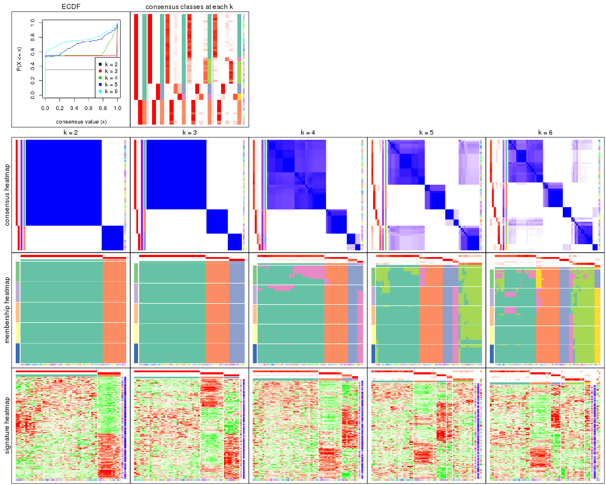

The plots are:

- The first row: a plot of the ECDF (empirical cumulative distribution
  function) curves of the consensus matrix for each `k` and the heatmap of
  predicted classes for each `k`.
- The second row: heatmaps of the consensus matrix for each `k`.
- The third row: heatmaps of the membership matrix for each `k`.
- The fouth row: heatmaps of the signatures for each `k`.

All the plots in panels can be made by individual functions and they are
plotted later in this section.

`select_partition_number()` produces several plots showing different
statistics for choosing "optimized" `k`. There are following statistics:

- ECDF curves of the consensus matrix for each `k`;
- 1-PAC. [The PAC
  score](https://en.wikipedia.org/wiki/Consensus_clustering#Over-interpretation_potential_of_consensus_clustering)
  measures the proportion of the ambiguous subgrouping.
- Mean silhouette score.
- Concordance. The mean probability of fiting the consensus class ids in all
  partitions.
- Area increased. Denote $A_k$ as the area under the ECDF curve for current
  `k`, the area increased is defined as $A_k - A_{k-1}$.
- Rand index. The percent of pairs of samples that are both in a same cluster
  or both are not in a same cluster in the partition of k and k-1.
- Jaccard index. The ratio of pairs of samples are both in a same cluster in
  the partition of k and k-1 and the pairs of samples are both in a same
  cluster in the partition k or k-1.

The detailed explanations of these statistics can be found in [the _cola_
vignette](http://bioconductor.org/packages/devel/bioc/vignettes/cola/inst/doc/cola.html#toc_13).

Generally speaking, lower PAC score, higher mean silhouette score or higher
concordance corresponds to better partition. Rand index and Jaccard index
measure how similar the current partition is compared to partition with `k-1`.
If they are too similar, we won't accept `k` is better than `k-1`.

```r
select_partition_number(res)
```


The numeric values for all these statistics can be obtained by `get_stats()`.

```r
get_stats(res)
```

```
#>   k 1-PAC mean_silhouette concordance area_increased  Rand Jaccard
#> 2 2 1.000           1.000       1.000         0.3528 0.648   0.648
#> 3 3 1.000           1.000       1.000         0.5382 0.810   0.707
#> 4 4 0.786           0.937       0.925         0.0862 0.990   0.977
#> 5 5 0.695           0.844       0.875         0.1972 0.816   0.588
#> 6 6 0.780           0.813       0.889         0.0918 0.977   0.912
```

`suggest_best_k()` suggests the best $k$ based on these statistics. The rules are as follows:

- All $k$ with Jaccard index larger than 0.95 are removed because increasing
  $k$ does not provide enough extra information. If all $k$ are removed, it is
  marked as no subgroup is detected.
- For all $k$ with 1-PAC score larger than 0.9, the maximal $k$ is taken as
  the best $k$, and other $k$ are marked as optional $k$.
- If it does not fit the second rule. The $k$ with the maximal vote of the
  highest 1-PAC score, highest mean silhouette, and highest concordance is
  taken as the best $k$.

```r
suggest_best_k(res)
```

```
#> [1] 3
#> attr(,"optional")
#> [1] 2
```

There is also optional best $k$ = 2 that is worth to check.

Following shows the table of the partitions (You need to click the **show/hide
code output** link to see it). The membership matrix (columns with name `p*`)
is inferred by
[`clue::cl_consensus()`](https://www.rdocumentation.org/link/cl_consensus?package=clue)
function with the `SE` method. Basically the value in the membership matrix
represents the probability to belong to a certain group. The finall class
label for an item is determined with the group with highest probability it
belongs to.

In `get_classes()` function, the entropy is calculated from the membership
matrix and the silhouette score is calculated from the consensus matrix.


<script>
$( function() {
	$( '#tabs-ATC-pam-get-classes' ).tabs();
} );
</script>
<div id='tabs-ATC-pam-get-classes'>
<ul>
<li><a href='#tab-ATC-pam-get-classes-1'>k = 2</a></li>
<li><a href='#tab-ATC-pam-get-classes-2'>k = 3</a></li>
<li><a href='#tab-ATC-pam-get-classes-3'>k = 4</a></li>
<li><a href='#tab-ATC-pam-get-classes-4'>k = 5</a></li>
<li><a href='#tab-ATC-pam-get-classes-5'>k = 6</a></li>
</ul>

<div id='tab-ATC-pam-get-classes-1'>
<p><a id='tab-ATC-pam-get-classes-1-a' style='color:#0366d6' href='#'>show/hide code output</a></p>
<pre><code class="r">cbind(get_classes(res, k = 2), get_membership(res, k = 2))
</code></pre>

<pre><code>#&gt;          class entropy silhouette p1 p2
#&gt; GSM28815     1       0          1  1  0
#&gt; GSM28816     1       0          1  1  0
#&gt; GSM28817     1       0          1  1  0
#&gt; GSM11327     1       0          1  1  0
#&gt; GSM28825     2       0          1  0  1
#&gt; GSM11322     2       0          1  0  1
#&gt; GSM28828     2       0          1  0  1
#&gt; GSM11346     2       0          1  0  1
#&gt; GSM28808     2       0          1  0  1
#&gt; GSM11332     2       0          1  0  1
#&gt; GSM28811     2       0          1  0  1
#&gt; GSM11334     2       0          1  0  1
#&gt; GSM11340     2       0          1  0  1
#&gt; GSM28812     2       0          1  0  1
#&gt; GSM11345     1       0          1  1  0
#&gt; GSM28819     1       0          1  1  0
#&gt; GSM11321     1       0          1  1  0
#&gt; GSM28820     1       0          1  1  0
#&gt; GSM11339     1       0          1  1  0
#&gt; GSM28804     1       0          1  1  0
#&gt; GSM28823     1       0          1  1  0
#&gt; GSM11336     1       0          1  1  0
#&gt; GSM11342     1       0          1  1  0
#&gt; GSM11333     1       0          1  1  0
#&gt; GSM28802     1       0          1  1  0
#&gt; GSM28803     1       0          1  1  0
#&gt; GSM11343     1       0          1  1  0
#&gt; GSM11347     1       0          1  1  0
#&gt; GSM28824     1       0          1  1  0
#&gt; GSM28813     1       0          1  1  0
#&gt; GSM28827     1       0          1  1  0
#&gt; GSM11337     1       0          1  1  0
#&gt; GSM28814     1       0          1  1  0
#&gt; GSM11331     1       0          1  1  0
#&gt; GSM11344     1       0          1  1  0
#&gt; GSM11330     1       0          1  1  0
#&gt; GSM11325     1       0          1  1  0
#&gt; GSM11338     1       0          1  1  0
#&gt; GSM28806     1       0          1  1  0
#&gt; GSM28826     1       0          1  1  0
#&gt; GSM28818     1       0          1  1  0
#&gt; GSM28821     2       0          1  0  1
#&gt; GSM28807     1       0          1  1  0
#&gt; GSM28822     1       0          1  1  0
#&gt; GSM11328     2       0          1  0  1
#&gt; GSM11323     1       0          1  1  0
#&gt; GSM11324     1       0          1  1  0
#&gt; GSM11341     1       0          1  1  0
#&gt; GSM11326     1       0          1  1  0
#&gt; GSM28810     1       0          1  1  0
#&gt; GSM11335     1       0          1  1  0
#&gt; GSM28809     1       0          1  1  0
#&gt; GSM11329     1       0          1  1  0
#&gt; GSM28805     1       0          1  1  0
</code></pre>

<script>
$('#tab-ATC-pam-get-classes-1-a').parent().next().next().hide();
$('#tab-ATC-pam-get-classes-1-a').click(function(){
  $('#tab-ATC-pam-get-classes-1-a').parent().next().next().toggle();
  return(false);
});
</script>
</div>

<div id='tab-ATC-pam-get-classes-2'>
<p><a id='tab-ATC-pam-get-classes-2-a' style='color:#0366d6' href='#'>show/hide code output</a></p>
<pre><code class="r">cbind(get_classes(res, k = 3), get_membership(res, k = 3))
</code></pre>

<pre><code>#&gt;          class entropy silhouette p1 p2 p3
#&gt; GSM28815     1       0          1  1  0  0
#&gt; GSM28816     1       0          1  1  0  0
#&gt; GSM28817     1       0          1  1  0  0
#&gt; GSM11327     1       0          1  1  0  0
#&gt; GSM28825     2       0          1  0  1  0
#&gt; GSM11322     2       0          1  0  1  0
#&gt; GSM28828     2       0          1  0  1  0
#&gt; GSM11346     2       0          1  0  1  0
#&gt; GSM28808     2       0          1  0  1  0
#&gt; GSM11332     2       0          1  0  1  0
#&gt; GSM28811     2       0          1  0  1  0
#&gt; GSM11334     2       0          1  0  1  0
#&gt; GSM11340     2       0          1  0  1  0
#&gt; GSM28812     2       0          1  0  1  0
#&gt; GSM11345     1       0          1  1  0  0
#&gt; GSM28819     1       0          1  1  0  0
#&gt; GSM11321     3       0          1  0  0  1
#&gt; GSM28820     1       0          1  1  0  0
#&gt; GSM11339     1       0          1  1  0  0
#&gt; GSM28804     1       0          1  1  0  0
#&gt; GSM28823     1       0          1  1  0  0
#&gt; GSM11336     1       0          1  1  0  0
#&gt; GSM11342     1       0          1  1  0  0
#&gt; GSM11333     1       0          1  1  0  0
#&gt; GSM28802     1       0          1  1  0  0
#&gt; GSM28803     3       0          1  0  0  1
#&gt; GSM11343     3       0          1  0  0  1
#&gt; GSM11347     3       0          1  0  0  1
#&gt; GSM28824     1       0          1  1  0  0
#&gt; GSM28813     1       0          1  1  0  0
#&gt; GSM28827     1       0          1  1  0  0
#&gt; GSM11337     1       0          1  1  0  0
#&gt; GSM28814     3       0          1  0  0  1
#&gt; GSM11331     1       0          1  1  0  0
#&gt; GSM11344     3       0          1  0  0  1
#&gt; GSM11330     3       0          1  0  0  1
#&gt; GSM11325     3       0          1  0  0  1
#&gt; GSM11338     1       0          1  1  0  0
#&gt; GSM28806     1       0          1  1  0  0
#&gt; GSM28826     1       0          1  1  0  0
#&gt; GSM28818     1       0          1  1  0  0
#&gt; GSM28821     2       0          1  0  1  0
#&gt; GSM28807     1       0          1  1  0  0
#&gt; GSM28822     1       0          1  1  0  0
#&gt; GSM11328     2       0          1  0  1  0
#&gt; GSM11323     1       0          1  1  0  0
#&gt; GSM11324     1       0          1  1  0  0
#&gt; GSM11341     1       0          1  1  0  0
#&gt; GSM11326     1       0          1  1  0  0
#&gt; GSM28810     1       0          1  1  0  0
#&gt; GSM11335     1       0          1  1  0  0
#&gt; GSM28809     1       0          1  1  0  0
#&gt; GSM11329     1       0          1  1  0  0
#&gt; GSM28805     1       0          1  1  0  0
</code></pre>

<script>
$('#tab-ATC-pam-get-classes-2-a').parent().next().next().hide();
$('#tab-ATC-pam-get-classes-2-a').click(function(){
  $('#tab-ATC-pam-get-classes-2-a').parent().next().next().toggle();
  return(false);
});
</script>
</div>

<div id='tab-ATC-pam-get-classes-3'>
<p><a id='tab-ATC-pam-get-classes-3-a' style='color:#0366d6' href='#'>show/hide code output</a></p>
<pre><code class="r">cbind(get_classes(res, k = 4), get_membership(res, k = 4))
</code></pre>

<pre><code>#&gt;          class entropy silhouette    p1    p2    p3    p4
#&gt; GSM28815     1  0.2589      0.912 0.884 0.000 0.116 0.000
#&gt; GSM28816     1  0.2589      0.912 0.884 0.000 0.116 0.000
#&gt; GSM28817     1  0.2216      0.920 0.908 0.000 0.092 0.000
#&gt; GSM11327     1  0.2149      0.908 0.912 0.000 0.088 0.000
#&gt; GSM28825     2  0.0000      0.973 0.000 1.000 0.000 0.000
#&gt; GSM11322     2  0.0000      0.973 0.000 1.000 0.000 0.000
#&gt; GSM28828     2  0.0188      0.972 0.000 0.996 0.004 0.000
#&gt; GSM11346     2  0.0000      0.973 0.000 1.000 0.000 0.000
#&gt; GSM28808     2  0.0000      0.973 0.000 1.000 0.000 0.000
#&gt; GSM11332     2  0.0000      0.973 0.000 1.000 0.000 0.000
#&gt; GSM28811     2  0.1637      0.941 0.000 0.940 0.060 0.000
#&gt; GSM11334     2  0.0000      0.973 0.000 1.000 0.000 0.000
#&gt; GSM11340     2  0.0000      0.973 0.000 1.000 0.000 0.000
#&gt; GSM28812     2  0.0000      0.973 0.000 1.000 0.000 0.000
#&gt; GSM11345     1  0.1474      0.920 0.948 0.000 0.052 0.000
#&gt; GSM28819     1  0.2149      0.908 0.912 0.000 0.088 0.000
#&gt; GSM11321     4  0.0000      1.000 0.000 0.000 0.000 1.000
#&gt; GSM28820     1  0.1211      0.922 0.960 0.000 0.040 0.000
#&gt; GSM11339     1  0.2589      0.912 0.884 0.000 0.116 0.000
#&gt; GSM28804     1  0.2589      0.912 0.884 0.000 0.116 0.000
#&gt; GSM28823     1  0.1118      0.923 0.964 0.000 0.036 0.000
#&gt; GSM11336     1  0.2921      0.913 0.860 0.000 0.140 0.000
#&gt; GSM11342     1  0.0188      0.927 0.996 0.000 0.004 0.000
#&gt; GSM11333     1  0.2589      0.912 0.884 0.000 0.116 0.000
#&gt; GSM28802     1  0.0817      0.926 0.976 0.000 0.024 0.000
#&gt; GSM28803     3  0.4164      1.000 0.000 0.000 0.736 0.264
#&gt; GSM11343     3  0.4164      1.000 0.000 0.000 0.736 0.264
#&gt; GSM11347     3  0.4164      1.000 0.000 0.000 0.736 0.264
#&gt; GSM28824     1  0.2281      0.924 0.904 0.000 0.096 0.000
#&gt; GSM28813     1  0.2149      0.908 0.912 0.000 0.088 0.000
#&gt; GSM28827     1  0.1716      0.925 0.936 0.000 0.064 0.000
#&gt; GSM11337     1  0.2149      0.908 0.912 0.000 0.088 0.000
#&gt; GSM28814     4  0.0000      1.000 0.000 0.000 0.000 1.000
#&gt; GSM11331     1  0.1716      0.925 0.936 0.000 0.064 0.000
#&gt; GSM11344     3  0.4164      1.000 0.000 0.000 0.736 0.264
#&gt; GSM11330     3  0.4164      1.000 0.000 0.000 0.736 0.264
#&gt; GSM11325     4  0.0000      1.000 0.000 0.000 0.000 1.000
#&gt; GSM11338     1  0.2149      0.908 0.912 0.000 0.088 0.000
#&gt; GSM28806     1  0.2281      0.919 0.904 0.000 0.096 0.000
#&gt; GSM28826     1  0.2149      0.908 0.912 0.000 0.088 0.000
#&gt; GSM28818     1  0.2589      0.912 0.884 0.000 0.116 0.000
#&gt; GSM28821     2  0.3539      0.802 0.004 0.820 0.176 0.000
#&gt; GSM28807     1  0.2973      0.921 0.856 0.000 0.144 0.000
#&gt; GSM28822     1  0.2589      0.912 0.884 0.000 0.116 0.000
#&gt; GSM11328     2  0.1637      0.941 0.000 0.940 0.060 0.000
#&gt; GSM11323     1  0.1118      0.928 0.964 0.000 0.036 0.000
#&gt; GSM11324     1  0.0336      0.927 0.992 0.000 0.008 0.000
#&gt; GSM11341     1  0.1940      0.913 0.924 0.000 0.076 0.000
#&gt; GSM11326     1  0.2149      0.908 0.912 0.000 0.088 0.000
#&gt; GSM28810     1  0.1716      0.925 0.936 0.000 0.064 0.000
#&gt; GSM11335     1  0.1474      0.920 0.948 0.000 0.052 0.000
#&gt; GSM28809     1  0.2281      0.919 0.904 0.000 0.096 0.000
#&gt; GSM11329     1  0.2345      0.918 0.900 0.000 0.100 0.000
#&gt; GSM28805     1  0.1792      0.924 0.932 0.000 0.068 0.000
</code></pre>

<script>
$('#tab-ATC-pam-get-classes-3-a').parent().next().next().hide();
$('#tab-ATC-pam-get-classes-3-a').click(function(){
  $('#tab-ATC-pam-get-classes-3-a').parent().next().next().toggle();
  return(false);
});
</script>
</div>

<div id='tab-ATC-pam-get-classes-4'>
<p><a id='tab-ATC-pam-get-classes-4-a' style='color:#0366d6' href='#'>show/hide code output</a></p>
<pre><code class="r">cbind(get_classes(res, k = 5), get_membership(res, k = 5))
</code></pre>

<pre><code>#&gt;          class entropy silhouette    p1    p2  p3   p4    p5
#&gt; GSM28815     1  0.0963     0.8625 0.964 0.000 0.0 0.00 0.036
#&gt; GSM28816     1  0.0963     0.8625 0.964 0.000 0.0 0.00 0.036
#&gt; GSM28817     1  0.0290     0.8721 0.992 0.000 0.0 0.00 0.008
#&gt; GSM11327     5  0.3508     0.8594 0.252 0.000 0.0 0.00 0.748
#&gt; GSM28825     2  0.0000     0.9485 0.000 1.000 0.0 0.00 0.000
#&gt; GSM11322     2  0.0000     0.9485 0.000 1.000 0.0 0.00 0.000
#&gt; GSM28828     2  0.0609     0.9406 0.000 0.980 0.0 0.02 0.000
#&gt; GSM11346     2  0.0000     0.9485 0.000 1.000 0.0 0.00 0.000
#&gt; GSM28808     2  0.0000     0.9485 0.000 1.000 0.0 0.00 0.000
#&gt; GSM11332     2  0.0000     0.9485 0.000 1.000 0.0 0.00 0.000
#&gt; GSM28811     2  0.3109     0.8397 0.000 0.800 0.0 0.20 0.000
#&gt; GSM11334     2  0.0000     0.9485 0.000 1.000 0.0 0.00 0.000
#&gt; GSM11340     2  0.0000     0.9485 0.000 1.000 0.0 0.00 0.000
#&gt; GSM28812     2  0.0000     0.9485 0.000 1.000 0.0 0.00 0.000
#&gt; GSM11345     1  0.3452     0.6068 0.756 0.000 0.0 0.00 0.244
#&gt; GSM28819     5  0.3508     0.8594 0.252 0.000 0.0 0.00 0.748
#&gt; GSM11321     4  0.3109     1.0000 0.000 0.000 0.2 0.80 0.000
#&gt; GSM28820     5  0.4150     0.7187 0.388 0.000 0.0 0.00 0.612
#&gt; GSM11339     1  0.0963     0.8625 0.964 0.000 0.0 0.00 0.036
#&gt; GSM28804     1  0.0963     0.8625 0.964 0.000 0.0 0.00 0.036
#&gt; GSM28823     5  0.4294    -0.0572 0.468 0.000 0.0 0.00 0.532
#&gt; GSM11336     5  0.3837     0.7644 0.308 0.000 0.0 0.00 0.692
#&gt; GSM11342     1  0.3895     0.5394 0.680 0.000 0.0 0.00 0.320
#&gt; GSM11333     1  0.0963     0.8625 0.964 0.000 0.0 0.00 0.036
#&gt; GSM28802     1  0.2561     0.7748 0.856 0.000 0.0 0.00 0.144
#&gt; GSM28803     3  0.0000     1.0000 0.000 0.000 1.0 0.00 0.000
#&gt; GSM11343     3  0.0000     1.0000 0.000 0.000 1.0 0.00 0.000
#&gt; GSM11347     3  0.0000     1.0000 0.000 0.000 1.0 0.00 0.000
#&gt; GSM28824     5  0.4278     0.6206 0.452 0.000 0.0 0.00 0.548
#&gt; GSM28813     5  0.3508     0.8594 0.252 0.000 0.0 0.00 0.748
#&gt; GSM28827     1  0.1121     0.8621 0.956 0.000 0.0 0.00 0.044
#&gt; GSM11337     5  0.3534     0.8575 0.256 0.000 0.0 0.00 0.744
#&gt; GSM28814     4  0.3109     1.0000 0.000 0.000 0.2 0.80 0.000
#&gt; GSM11331     1  0.1121     0.8621 0.956 0.000 0.0 0.00 0.044
#&gt; GSM11344     3  0.0000     1.0000 0.000 0.000 1.0 0.00 0.000
#&gt; GSM11330     3  0.0000     1.0000 0.000 0.000 1.0 0.00 0.000
#&gt; GSM11325     4  0.3109     1.0000 0.000 0.000 0.2 0.80 0.000
#&gt; GSM11338     5  0.3508     0.8594 0.252 0.000 0.0 0.00 0.748
#&gt; GSM28806     1  0.0290     0.8720 0.992 0.000 0.0 0.00 0.008
#&gt; GSM28826     5  0.3508     0.8594 0.252 0.000 0.0 0.00 0.748
#&gt; GSM28818     1  0.0880     0.8643 0.968 0.000 0.0 0.00 0.032
#&gt; GSM28821     2  0.3266     0.8365 0.004 0.796 0.0 0.20 0.000
#&gt; GSM28807     1  0.2516     0.7405 0.860 0.000 0.0 0.00 0.140
#&gt; GSM28822     1  0.1043     0.8622 0.960 0.000 0.0 0.00 0.040
#&gt; GSM11328     2  0.3109     0.8397 0.000 0.800 0.0 0.20 0.000
#&gt; GSM11323     1  0.2891     0.7328 0.824 0.000 0.0 0.00 0.176
#&gt; GSM11324     1  0.2377     0.7915 0.872 0.000 0.0 0.00 0.128
#&gt; GSM11341     5  0.4114     0.7252 0.376 0.000 0.0 0.00 0.624
#&gt; GSM11326     5  0.3508     0.8594 0.252 0.000 0.0 0.00 0.748
#&gt; GSM28810     1  0.1121     0.8621 0.956 0.000 0.0 0.00 0.044
#&gt; GSM11335     1  0.3452     0.6068 0.756 0.000 0.0 0.00 0.244
#&gt; GSM28809     1  0.0404     0.8719 0.988 0.000 0.0 0.00 0.012
#&gt; GSM11329     1  0.0000     0.8716 1.000 0.000 0.0 0.00 0.000
#&gt; GSM28805     1  0.0963     0.8655 0.964 0.000 0.0 0.00 0.036
</code></pre>

<script>
$('#tab-ATC-pam-get-classes-4-a').parent().next().next().hide();
$('#tab-ATC-pam-get-classes-4-a').click(function(){
  $('#tab-ATC-pam-get-classes-4-a').parent().next().next().toggle();
  return(false);
});
</script>
</div>

<div id='tab-ATC-pam-get-classes-5'>
<p><a id='tab-ATC-pam-get-classes-5-a' style='color:#0366d6' href='#'>show/hide code output</a></p>
<pre><code class="r">cbind(get_classes(res, k = 6), get_membership(res, k = 6))
</code></pre>

<pre><code>#&gt;          class entropy silhouette    p1    p2    p3    p4    p5    p6
#&gt; GSM28815     1  0.2597      0.765 0.824 0.000 0.000 0.176 0.000 0.000
#&gt; GSM28816     1  0.2597      0.765 0.824 0.000 0.000 0.176 0.000 0.000
#&gt; GSM28817     1  0.0291      0.833 0.992 0.000 0.000 0.004 0.004 0.000
#&gt; GSM11327     5  0.0000      0.855 0.000 0.000 0.000 0.000 1.000 0.000
#&gt; GSM28825     2  0.0000      0.899 0.000 1.000 0.000 0.000 0.000 0.000
#&gt; GSM11322     2  0.0000      0.899 0.000 1.000 0.000 0.000 0.000 0.000
#&gt; GSM28828     2  0.0547      0.890 0.000 0.980 0.000 0.000 0.000 0.020
#&gt; GSM11346     2  0.0000      0.899 0.000 1.000 0.000 0.000 0.000 0.000
#&gt; GSM28808     2  0.0000      0.899 0.000 1.000 0.000 0.000 0.000 0.000
#&gt; GSM11332     2  0.0000      0.899 0.000 1.000 0.000 0.000 0.000 0.000
#&gt; GSM28811     2  0.4887      0.676 0.000 0.660 0.000 0.156 0.000 0.184
#&gt; GSM11334     2  0.0000      0.899 0.000 1.000 0.000 0.000 0.000 0.000
#&gt; GSM11340     2  0.0000      0.899 0.000 1.000 0.000 0.000 0.000 0.000
#&gt; GSM28812     2  0.0000      0.899 0.000 1.000 0.000 0.000 0.000 0.000
#&gt; GSM11345     1  0.3683      0.680 0.768 0.000 0.000 0.048 0.184 0.000
#&gt; GSM28819     5  0.1434      0.841 0.012 0.000 0.000 0.048 0.940 0.000
#&gt; GSM11321     6  0.2664      1.000 0.000 0.000 0.184 0.000 0.000 0.816
#&gt; GSM28820     5  0.1387      0.819 0.068 0.000 0.000 0.000 0.932 0.000
#&gt; GSM11339     1  0.2491      0.768 0.836 0.000 0.000 0.164 0.000 0.000
#&gt; GSM28804     1  0.2597      0.765 0.824 0.000 0.000 0.176 0.000 0.000
#&gt; GSM28823     4  0.4746      0.549 0.116 0.000 0.000 0.668 0.216 0.000
#&gt; GSM11336     5  0.1434      0.832 0.048 0.000 0.000 0.012 0.940 0.000
#&gt; GSM11342     4  0.3758      0.586 0.324 0.000 0.000 0.668 0.008 0.000
#&gt; GSM11333     1  0.2848      0.763 0.816 0.000 0.000 0.176 0.008 0.000
#&gt; GSM28802     1  0.3241      0.748 0.824 0.000 0.000 0.064 0.112 0.000
#&gt; GSM28803     3  0.0000      1.000 0.000 0.000 1.000 0.000 0.000 0.000
#&gt; GSM11343     3  0.0000      1.000 0.000 0.000 1.000 0.000 0.000 0.000
#&gt; GSM11347     3  0.0000      1.000 0.000 0.000 1.000 0.000 0.000 0.000
#&gt; GSM28824     5  0.3215      0.548 0.240 0.000 0.000 0.004 0.756 0.000
#&gt; GSM28813     5  0.0000      0.855 0.000 0.000 0.000 0.000 1.000 0.000
#&gt; GSM28827     1  0.1219      0.827 0.948 0.000 0.000 0.048 0.004 0.000
#&gt; GSM11337     5  0.0865      0.852 0.036 0.000 0.000 0.000 0.964 0.000
#&gt; GSM28814     6  0.2664      1.000 0.000 0.000 0.184 0.000 0.000 0.816
#&gt; GSM11331     1  0.1219      0.827 0.948 0.000 0.000 0.048 0.004 0.000
#&gt; GSM11344     3  0.0000      1.000 0.000 0.000 1.000 0.000 0.000 0.000
#&gt; GSM11330     3  0.0000      1.000 0.000 0.000 1.000 0.000 0.000 0.000
#&gt; GSM11325     6  0.2664      1.000 0.000 0.000 0.184 0.000 0.000 0.816
#&gt; GSM11338     5  0.0363      0.857 0.012 0.000 0.000 0.000 0.988 0.000
#&gt; GSM28806     1  0.1588      0.810 0.924 0.000 0.000 0.072 0.004 0.000
#&gt; GSM28826     5  0.1434      0.841 0.012 0.000 0.000 0.048 0.940 0.000
#&gt; GSM28818     1  0.1007      0.825 0.956 0.000 0.000 0.044 0.000 0.000
#&gt; GSM28821     2  0.6166      0.478 0.024 0.504 0.000 0.288 0.000 0.184
#&gt; GSM28807     1  0.1802      0.813 0.916 0.000 0.000 0.012 0.072 0.000
#&gt; GSM28822     1  0.2597      0.765 0.824 0.000 0.000 0.176 0.000 0.000
#&gt; GSM11328     2  0.4887      0.676 0.000 0.660 0.000 0.156 0.000 0.184
#&gt; GSM11323     1  0.3044      0.756 0.836 0.000 0.000 0.048 0.116 0.000
#&gt; GSM11324     1  0.3130      0.744 0.828 0.000 0.000 0.048 0.124 0.000
#&gt; GSM11341     5  0.4497      0.247 0.328 0.000 0.000 0.048 0.624 0.000
#&gt; GSM11326     5  0.0000      0.855 0.000 0.000 0.000 0.000 1.000 0.000
#&gt; GSM28810     1  0.1219      0.827 0.948 0.000 0.000 0.048 0.004 0.000
#&gt; GSM11335     1  0.2996      0.662 0.772 0.000 0.000 0.000 0.228 0.000
#&gt; GSM28809     1  0.1074      0.832 0.960 0.000 0.000 0.012 0.028 0.000
#&gt; GSM11329     1  0.0291      0.832 0.992 0.000 0.000 0.004 0.004 0.000
#&gt; GSM28805     1  0.1219      0.830 0.948 0.000 0.000 0.048 0.004 0.000
</code></pre>

<script>
$('#tab-ATC-pam-get-classes-5-a').parent().next().next().hide();
$('#tab-ATC-pam-get-classes-5-a').click(function(){
  $('#tab-ATC-pam-get-classes-5-a').parent().next().next().toggle();
  return(false);
});
</script>
</div>
</div>

Heatmaps for the consensus matrix. It visualizes the probability of two
samples to be in a same group.


<script>
$( function() {
	$( '#tabs-ATC-pam-consensus-heatmap' ).tabs();
} );
</script>
<div id='tabs-ATC-pam-consensus-heatmap'>
<ul>
<li><a href='#tab-ATC-pam-consensus-heatmap-1'>k = 2</a></li>
<li><a href='#tab-ATC-pam-consensus-heatmap-2'>k = 3</a></li>
<li><a href='#tab-ATC-pam-consensus-heatmap-3'>k = 4</a></li>
<li><a href='#tab-ATC-pam-consensus-heatmap-4'>k = 5</a></li>
<li><a href='#tab-ATC-pam-consensus-heatmap-5'>k = 6</a></li>
</ul>
<div id='tab-ATC-pam-consensus-heatmap-1'>
<pre><code class="r">consensus_heatmap(res, k = 2)
</code></pre>

<p></p>

</div>
<div id='tab-ATC-pam-consensus-heatmap-2'>
<pre><code class="r">consensus_heatmap(res, k = 3)
</code></pre>

<p></p>

</div>
<div id='tab-ATC-pam-consensus-heatmap-3'>
<pre><code class="r">consensus_heatmap(res, k = 4)
</code></pre>

<p></p>

</div>
<div id='tab-ATC-pam-consensus-heatmap-4'>
<pre><code class="r">consensus_heatmap(res, k = 5)
</code></pre>

<p></p>

</div>
<div id='tab-ATC-pam-consensus-heatmap-5'>
<pre><code class="r">consensus_heatmap(res, k = 6)
</code></pre>

<p></p>

</div>
</div>

Heatmaps for the membership of samples in all partitions to see how consistent they are:


<script>
$( function() {
	$( '#tabs-ATC-pam-membership-heatmap' ).tabs();
} );
</script>
<div id='tabs-ATC-pam-membership-heatmap'>
<ul>
<li><a href='#tab-ATC-pam-membership-heatmap-1'>k = 2</a></li>
<li><a href='#tab-ATC-pam-membership-heatmap-2'>k = 3</a></li>
<li><a href='#tab-ATC-pam-membership-heatmap-3'>k = 4</a></li>
<li><a href='#tab-ATC-pam-membership-heatmap-4'>k = 5</a></li>
<li><a href='#tab-ATC-pam-membership-heatmap-5'>k = 6</a></li>
</ul>
<div id='tab-ATC-pam-membership-heatmap-1'>
<pre><code class="r">membership_heatmap(res, k = 2)
</code></pre>

<p></p>

</div>
<div id='tab-ATC-pam-membership-heatmap-2'>
<pre><code class="r">membership_heatmap(res, k = 3)
</code></pre>

<p></p>

</div>
<div id='tab-ATC-pam-membership-heatmap-3'>
<pre><code class="r">membership_heatmap(res, k = 4)
</code></pre>

<p>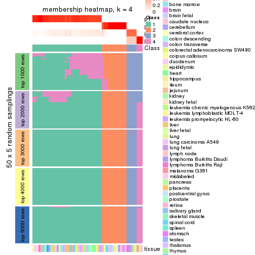</p>

</div>
<div id='tab-ATC-pam-membership-heatmap-4'>
<pre><code class="r">membership_heatmap(res, k = 5)
</code></pre>

<p></p>

</div>
<div id='tab-ATC-pam-membership-heatmap-5'>
<pre><code class="r">membership_heatmap(res, k = 6)
</code></pre>

<p></p>

</div>
</div>

As soon as we have had the classes for columns, we can look for signatures
which are significantly different between classes which can be candidate marks
for certain classes. Following are the heatmaps for signatures.


Signature heatmaps where rows are scaled:


<script>
$( function() {
	$( '#tabs-ATC-pam-get-signatures' ).tabs();
} );
</script>
<div id='tabs-ATC-pam-get-signatures'>
<ul>
<li><a href='#tab-ATC-pam-get-signatures-1'>k = 2</a></li>
<li><a href='#tab-ATC-pam-get-signatures-2'>k = 3</a></li>
<li><a href='#tab-ATC-pam-get-signatures-3'>k = 4</a></li>
<li><a href='#tab-ATC-pam-get-signatures-4'>k = 5</a></li>
<li><a href='#tab-ATC-pam-get-signatures-5'>k = 6</a></li>
</ul>
<div id='tab-ATC-pam-get-signatures-1'>
<pre><code class="r">get_signatures(res, k = 2)
</code></pre>

<p></p>

</div>
<div id='tab-ATC-pam-get-signatures-2'>
<pre><code class="r">get_signatures(res, k = 3)
</code></pre>

<p></p>

</div>
<div id='tab-ATC-pam-get-signatures-3'>
<pre><code class="r">get_signatures(res, k = 4)
</code></pre>

<p></p>

</div>
<div id='tab-ATC-pam-get-signatures-4'>
<pre><code class="r">get_signatures(res, k = 5)
</code></pre>

<p></p>

</div>
<div id='tab-ATC-pam-get-signatures-5'>
<pre><code class="r">get_signatures(res, k = 6)
</code></pre>

<p></p>

</div>
</div>


Signature heatmaps where rows are not scaled:


<script>
$( function() {
	$( '#tabs-ATC-pam-get-signatures-no-scale' ).tabs();
} );
</script>
<div id='tabs-ATC-pam-get-signatures-no-scale'>
<ul>
<li><a href='#tab-ATC-pam-get-signatures-no-scale-1'>k = 2</a></li>
<li><a href='#tab-ATC-pam-get-signatures-no-scale-2'>k = 3</a></li>
<li><a href='#tab-ATC-pam-get-signatures-no-scale-3'>k = 4</a></li>
<li><a href='#tab-ATC-pam-get-signatures-no-scale-4'>k = 5</a></li>
<li><a href='#tab-ATC-pam-get-signatures-no-scale-5'>k = 6</a></li>
</ul>
<div id='tab-ATC-pam-get-signatures-no-scale-1'>
<pre><code class="r">get_signatures(res, k = 2, scale_rows = FALSE)
</code></pre>

<p></p>

</div>
<div id='tab-ATC-pam-get-signatures-no-scale-2'>
<pre><code class="r">get_signatures(res, k = 3, scale_rows = FALSE)
</code></pre>

<p></p>

</div>
<div id='tab-ATC-pam-get-signatures-no-scale-3'>
<pre><code class="r">get_signatures(res, k = 4, scale_rows = FALSE)
</code></pre>

<p></p>

</div>
<div id='tab-ATC-pam-get-signatures-no-scale-4'>
<pre><code class="r">get_signatures(res, k = 5, scale_rows = FALSE)
</code></pre>

<p>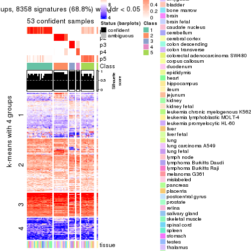</p>

</div>
<div id='tab-ATC-pam-get-signatures-no-scale-5'>
<pre><code class="r">get_signatures(res, k = 6, scale_rows = FALSE)
</code></pre>

<p></p>

</div>
</div>


Compare the overlap of signatures from different k:

```r
compare_signatures(res)
```


`get_signature()` returns a data frame invisibly. TO get the list of signatures, the function
call should be assigned to a variable explicitly. In following code, if `plot` argument is set
to `FALSE`, no heatmap is plotted while only the differential analysis is performed.

```r
# code only for demonstration
tb = get_signature(res, k = ..., plot = FALSE)
```

An example of the output of `tb` is:

```
#>   which_row         fdr    mean_1    mean_2 scaled_mean_1 scaled_mean_2 km
#> 1        38 0.042760348  8.373488  9.131774    -0.5533452     0.5164555  1
#> 2        40 0.018707592  7.106213  8.469186    -0.6173731     0.5762149  1
#> 3        55 0.019134737 10.221463 11.207825    -0.6159697     0.5749050  1
#> 4        59 0.006059896  5.921854  7.869574    -0.6899429     0.6439467  1
#> 5        60 0.018055526  8.928898 10.211722    -0.6204761     0.5791110  1
#> 6        98 0.009384629 15.714769 14.887706     0.6635654    -0.6193277  2
...
```

The columns in `tb` are:

1. `which_row`: row indices corresponding to the input matrix.
2. `fdr`: FDR for the differential test. 
3. `mean_x`: The mean value in group x.
4. `scaled_mean_x`: The mean value in group x after rows are scaled.
5. `km`: Row groups if k-means clustering is applied to rows.


UMAP plot which shows how samples are separated.


<script>
$( function() {
	$( '#tabs-ATC-pam-dimension-reduction' ).tabs();
} );
</script>
<div id='tabs-ATC-pam-dimension-reduction'>
<ul>
<li><a href='#tab-ATC-pam-dimension-reduction-1'>k = 2</a></li>
<li><a href='#tab-ATC-pam-dimension-reduction-2'>k = 3</a></li>
<li><a href='#tab-ATC-pam-dimension-reduction-3'>k = 4</a></li>
<li><a href='#tab-ATC-pam-dimension-reduction-4'>k = 5</a></li>
<li><a href='#tab-ATC-pam-dimension-reduction-5'>k = 6</a></li>
</ul>
<div id='tab-ATC-pam-dimension-reduction-1'>
<pre><code class="r">dimension_reduction(res, k = 2, method = &quot;UMAP&quot;)
</code></pre>

<p></p>

</div>
<div id='tab-ATC-pam-dimension-reduction-2'>
<pre><code class="r">dimension_reduction(res, k = 3, method = &quot;UMAP&quot;)
</code></pre>

<p></p>

</div>
<div id='tab-ATC-pam-dimension-reduction-3'>
<pre><code class="r">dimension_reduction(res, k = 4, method = &quot;UMAP&quot;)
</code></pre>

<p></p>

</div>
<div id='tab-ATC-pam-dimension-reduction-4'>
<pre><code class="r">dimension_reduction(res, k = 5, method = &quot;UMAP&quot;)
</code></pre>

<p></p>

</div>
<div id='tab-ATC-pam-dimension-reduction-5'>
<pre><code class="r">dimension_reduction(res, k = 6, method = &quot;UMAP&quot;)
</code></pre>

<p></p>

</div>
</div>


Following heatmap shows how subgroups are split when increasing `k`:

```r
collect_classes(res)
```

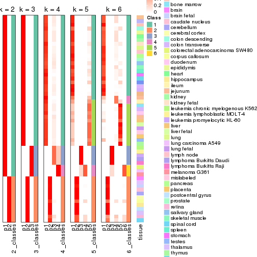


Test correlation between subgroups and known annotations. If the known
annotation is numeric, one-way ANOVA test is applied, and if the known
annotation is discrete, chi-squared contingency table test is applied.

```r
test_to_known_factors(res)
```

```
#>          n tissue(p) k
#> ATC:pam 54     0.398 2
#> ATC:pam 54     0.374 3
#> ATC:pam 54     0.355 4
#> ATC:pam 53     0.402 5
#> ATC:pam 52     0.588 6
```


If matrix rows can be associated to genes, consider to use `functional_enrichment(res,
...)` to perform function enrichment for the signature genes. See [this vignette](http://bioconductor.org/packages/devel/bioc/vignettes/cola/inst/doc/functional_enrichment.html) for more detailed explanations.


 

---------------------------------------------------


### ATC:mclust*


The object with results only for a single top-value method and a single partition method 
can be extracted as:

```r
res = res_list["ATC", "mclust"]
# you can also extract it by
# res = res_list["ATC:mclust"]
```

A summary of `res` and all the functions that can be applied to it:

```r
res
```

```
#> A 'ConsensusPartition' object with k = 2, 3, 4, 5, 6.
#>   On a matrix with 12150 rows and 54 columns.
#>   Top rows (1000, 2000, 3000, 4000, 5000) are extracted by 'ATC' method.
#>   Subgroups are detected by 'mclust' method.
#>   Performed in total 1250 partitions by row resampling.
#>   Best k for subgroups seems to be 3.
#> 
#> Following methods can be applied to this 'ConsensusPartition' object:
#>  [1] "cola_report"             "collect_classes"         "collect_plots"          
#>  [4] "collect_stats"           "colnames"                "compare_signatures"     
#>  [7] "consensus_heatmap"       "dimension_reduction"     "functional_enrichment"  
#> [10] "get_anno_col"            "get_anno"                "get_classes"            
#> [13] "get_consensus"           "get_matrix"              "get_membership"         
#> [16] "get_param"               "get_signatures"          "get_stats"              
#> [19] "is_best_k"               "is_stable_k"             "membership_heatmap"     
#> [22] "ncol"                    "nrow"                    "plot_ecdf"              
#> [25] "rownames"                "select_partition_number" "show"                   
#> [28] "suggest_best_k"          "test_to_known_factors"
```

`collect_plots()` function collects all the plots made from `res` for all `k` (number of partitions)
into one single page to provide an easy and fast comparison between different `k`.

```r
collect_plots(res)
```


The plots are:

- The first row: a plot of the ECDF (empirical cumulative distribution
  function) curves of the consensus matrix for each `k` and the heatmap of
  predicted classes for each `k`.
- The second row: heatmaps of the consensus matrix for each `k`.
- The third row: heatmaps of the membership matrix for each `k`.
- The fouth row: heatmaps of the signatures for each `k`.

All the plots in panels can be made by individual functions and they are
plotted later in this section.

`select_partition_number()` produces several plots showing different
statistics for choosing "optimized" `k`. There are following statistics:

- ECDF curves of the consensus matrix for each `k`;
- 1-PAC. [The PAC
  score](https://en.wikipedia.org/wiki/Consensus_clustering#Over-interpretation_potential_of_consensus_clustering)
  measures the proportion of the ambiguous subgrouping.
- Mean silhouette score.
- Concordance. The mean probability of fiting the consensus class ids in all
  partitions.
- Area increased. Denote $A_k$ as the area under the ECDF curve for current
  `k`, the area increased is defined as $A_k - A_{k-1}$.
- Rand index. The percent of pairs of samples that are both in a same cluster
  or both are not in a same cluster in the partition of k and k-1.
- Jaccard index. The ratio of pairs of samples are both in a same cluster in
  the partition of k and k-1 and the pairs of samples are both in a same
  cluster in the partition k or k-1.

The detailed explanations of these statistics can be found in [the _cola_
vignette](http://bioconductor.org/packages/devel/bioc/vignettes/cola/inst/doc/cola.html#toc_13).

Generally speaking, lower PAC score, higher mean silhouette score or higher
concordance corresponds to better partition. Rand index and Jaccard index
measure how similar the current partition is compared to partition with `k-1`.
If they are too similar, we won't accept `k` is better than `k-1`.

```r
select_partition_number(res)
```


The numeric values for all these statistics can be obtained by `get_stats()`.

```r
get_stats(res)
```

```
#>   k 1-PAC mean_silhouette concordance area_increased  Rand Jaccard
#> 2 2 0.816           0.924       0.967         0.4065 0.591   0.591
#> 3 3 0.912           0.910       0.964         0.4151 0.781   0.645
#> 4 4 0.675           0.643       0.841         0.2128 0.884   0.733
#> 5 5 0.646           0.578       0.736         0.0873 0.897   0.692
#> 6 6 0.658           0.514       0.741         0.0520 0.850   0.495
```

`suggest_best_k()` suggests the best $k$ based on these statistics. The rules are as follows:

- All $k$ with Jaccard index larger than 0.95 are removed because increasing
  $k$ does not provide enough extra information. If all $k$ are removed, it is
  marked as no subgroup is detected.
- For all $k$ with 1-PAC score larger than 0.9, the maximal $k$ is taken as
  the best $k$, and other $k$ are marked as optional $k$.
- If it does not fit the second rule. The $k$ with the maximal vote of the
  highest 1-PAC score, highest mean silhouette, and highest concordance is
  taken as the best $k$.

```r
suggest_best_k(res)
```

```
#> [1] 3
```


Following shows the table of the partitions (You need to click the **show/hide
code output** link to see it). The membership matrix (columns with name `p*`)
is inferred by
[`clue::cl_consensus()`](https://www.rdocumentation.org/link/cl_consensus?package=clue)
function with the `SE` method. Basically the value in the membership matrix
represents the probability to belong to a certain group. The finall class
label for an item is determined with the group with highest probability it
belongs to.

In `get_classes()` function, the entropy is calculated from the membership
matrix and the silhouette score is calculated from the consensus matrix.


<script>
$( function() {
	$( '#tabs-ATC-mclust-get-classes' ).tabs();
} );
</script>
<div id='tabs-ATC-mclust-get-classes'>
<ul>
<li><a href='#tab-ATC-mclust-get-classes-1'>k = 2</a></li>
<li><a href='#tab-ATC-mclust-get-classes-2'>k = 3</a></li>
<li><a href='#tab-ATC-mclust-get-classes-3'>k = 4</a></li>
<li><a href='#tab-ATC-mclust-get-classes-4'>k = 5</a></li>
<li><a href='#tab-ATC-mclust-get-classes-5'>k = 6</a></li>
</ul>

<div id='tab-ATC-mclust-get-classes-1'>
<p><a id='tab-ATC-mclust-get-classes-1-a' style='color:#0366d6' href='#'>show/hide code output</a></p>
<pre><code class="r">cbind(get_classes(res, k = 2), get_membership(res, k = 2))
</code></pre>

<pre><code>#&gt;          class entropy silhouette    p1    p2
#&gt; GSM28815     1  0.7139     0.7581 0.804 0.196
#&gt; GSM28816     1  0.7815     0.7024 0.768 0.232
#&gt; GSM28817     1  0.0000     0.9737 1.000 0.000
#&gt; GSM11327     1  0.0672     0.9708 0.992 0.008
#&gt; GSM28825     2  0.0000     0.9364 0.000 1.000
#&gt; GSM11322     2  0.0000     0.9364 0.000 1.000
#&gt; GSM28828     2  0.0000     0.9364 0.000 1.000
#&gt; GSM11346     2  0.0000     0.9364 0.000 1.000
#&gt; GSM28808     2  0.0000     0.9364 0.000 1.000
#&gt; GSM11332     2  0.0000     0.9364 0.000 1.000
#&gt; GSM28811     2  0.0000     0.9364 0.000 1.000
#&gt; GSM11334     2  0.0000     0.9364 0.000 1.000
#&gt; GSM11340     2  0.0000     0.9364 0.000 1.000
#&gt; GSM28812     2  0.0000     0.9364 0.000 1.000
#&gt; GSM11345     1  0.0000     0.9737 1.000 0.000
#&gt; GSM28819     1  0.0000     0.9737 1.000 0.000
#&gt; GSM11321     1  0.0672     0.9708 0.992 0.008
#&gt; GSM28820     1  0.0000     0.9737 1.000 0.000
#&gt; GSM11339     1  0.7056     0.7637 0.808 0.192
#&gt; GSM28804     2  0.6623     0.7825 0.172 0.828
#&gt; GSM28823     1  0.0376     0.9718 0.996 0.004
#&gt; GSM11336     1  0.0000     0.9737 1.000 0.000
#&gt; GSM11342     1  0.0000     0.9737 1.000 0.000
#&gt; GSM11333     1  0.5059     0.8671 0.888 0.112
#&gt; GSM28802     1  0.0000     0.9737 1.000 0.000
#&gt; GSM28803     1  0.0672     0.9708 0.992 0.008
#&gt; GSM11343     1  0.0672     0.9708 0.992 0.008
#&gt; GSM11347     1  0.0672     0.9708 0.992 0.008
#&gt; GSM28824     1  0.0000     0.9737 1.000 0.000
#&gt; GSM28813     1  0.0000     0.9737 1.000 0.000
#&gt; GSM28827     1  0.0000     0.9737 1.000 0.000
#&gt; GSM11337     1  0.0000     0.9737 1.000 0.000
#&gt; GSM28814     1  0.0672     0.9708 0.992 0.008
#&gt; GSM11331     1  0.0000     0.9737 1.000 0.000
#&gt; GSM11344     1  0.0672     0.9708 0.992 0.008
#&gt; GSM11330     1  0.0672     0.9708 0.992 0.008
#&gt; GSM11325     1  0.0672     0.9708 0.992 0.008
#&gt; GSM11338     1  0.0000     0.9737 1.000 0.000
#&gt; GSM28806     1  0.0000     0.9737 1.000 0.000
#&gt; GSM28826     1  0.0000     0.9737 1.000 0.000
#&gt; GSM28818     1  0.4690     0.8804 0.900 0.100
#&gt; GSM28821     2  0.0000     0.9364 0.000 1.000
#&gt; GSM28807     1  0.0000     0.9737 1.000 0.000
#&gt; GSM28822     2  0.9993     0.0643 0.484 0.516
#&gt; GSM11328     2  0.0000     0.9364 0.000 1.000
#&gt; GSM11323     1  0.0000     0.9737 1.000 0.000
#&gt; GSM11324     1  0.0000     0.9737 1.000 0.000
#&gt; GSM11341     2  0.7056     0.7541 0.192 0.808
#&gt; GSM11326     1  0.0672     0.9708 0.992 0.008
#&gt; GSM28810     1  0.0000     0.9737 1.000 0.000
#&gt; GSM11335     1  0.0000     0.9737 1.000 0.000
#&gt; GSM28809     1  0.0000     0.9737 1.000 0.000
#&gt; GSM11329     1  0.0000     0.9737 1.000 0.000
#&gt; GSM28805     1  0.0000     0.9737 1.000 0.000
</code></pre>

<script>
$('#tab-ATC-mclust-get-classes-1-a').parent().next().next().hide();
$('#tab-ATC-mclust-get-classes-1-a').click(function(){
  $('#tab-ATC-mclust-get-classes-1-a').parent().next().next().toggle();
  return(false);
});
</script>
</div>

<div id='tab-ATC-mclust-get-classes-2'>
<p><a id='tab-ATC-mclust-get-classes-2-a' style='color:#0366d6' href='#'>show/hide code output</a></p>
<pre><code class="r">cbind(get_classes(res, k = 3), get_membership(res, k = 3))
</code></pre>

<pre><code>#&gt;          class entropy silhouette    p1    p2    p3
#&gt; GSM28815     1  0.0747     0.9620 0.984 0.000 0.016
#&gt; GSM28816     1  0.1163     0.9530 0.972 0.000 0.028
#&gt; GSM28817     1  0.0000     0.9709 1.000 0.000 0.000
#&gt; GSM11327     1  0.5254     0.6657 0.736 0.000 0.264
#&gt; GSM28825     2  0.0000     0.9273 0.000 1.000 0.000
#&gt; GSM11322     2  0.0000     0.9273 0.000 1.000 0.000
#&gt; GSM28828     2  0.0000     0.9273 0.000 1.000 0.000
#&gt; GSM11346     2  0.0000     0.9273 0.000 1.000 0.000
#&gt; GSM28808     2  0.0000     0.9273 0.000 1.000 0.000
#&gt; GSM11332     2  0.0000     0.9273 0.000 1.000 0.000
#&gt; GSM28811     2  0.0000     0.9273 0.000 1.000 0.000
#&gt; GSM11334     2  0.0000     0.9273 0.000 1.000 0.000
#&gt; GSM11340     2  0.0000     0.9273 0.000 1.000 0.000
#&gt; GSM28812     2  0.0000     0.9273 0.000 1.000 0.000
#&gt; GSM11345     1  0.0237     0.9715 0.996 0.000 0.004
#&gt; GSM28819     1  0.0237     0.9715 0.996 0.000 0.004
#&gt; GSM11321     3  0.0000     0.9443 0.000 0.000 1.000
#&gt; GSM28820     1  0.0237     0.9715 0.996 0.000 0.004
#&gt; GSM11339     1  0.0000     0.9709 1.000 0.000 0.000
#&gt; GSM28804     2  0.7996     0.0534 0.464 0.476 0.060
#&gt; GSM28823     1  0.0000     0.9709 1.000 0.000 0.000
#&gt; GSM11336     1  0.0237     0.9715 0.996 0.000 0.004
#&gt; GSM11342     1  0.0000     0.9709 1.000 0.000 0.000
#&gt; GSM11333     1  0.0000     0.9709 1.000 0.000 0.000
#&gt; GSM28802     1  0.0237     0.9715 0.996 0.000 0.004
#&gt; GSM28803     3  0.0000     0.9443 0.000 0.000 1.000
#&gt; GSM11343     3  0.0000     0.9443 0.000 0.000 1.000
#&gt; GSM11347     3  0.0000     0.9443 0.000 0.000 1.000
#&gt; GSM28824     1  0.1163     0.9557 0.972 0.000 0.028
#&gt; GSM28813     1  0.1529     0.9462 0.960 0.000 0.040
#&gt; GSM28827     1  0.0237     0.9715 0.996 0.000 0.004
#&gt; GSM11337     1  0.0000     0.9709 1.000 0.000 0.000
#&gt; GSM28814     3  0.0000     0.9443 0.000 0.000 1.000
#&gt; GSM11331     1  0.0237     0.9715 0.996 0.000 0.004
#&gt; GSM11344     3  0.0000     0.9443 0.000 0.000 1.000
#&gt; GSM11330     3  0.0000     0.9443 0.000 0.000 1.000
#&gt; GSM11325     3  0.0000     0.9443 0.000 0.000 1.000
#&gt; GSM11338     1  0.0237     0.9715 0.996 0.000 0.004
#&gt; GSM28806     1  0.0237     0.9715 0.996 0.000 0.004
#&gt; GSM28826     1  0.0237     0.9715 0.996 0.000 0.004
#&gt; GSM28818     1  0.0000     0.9709 1.000 0.000 0.000
#&gt; GSM28821     2  0.2625     0.8235 0.084 0.916 0.000
#&gt; GSM28807     1  0.0000     0.9709 1.000 0.000 0.000
#&gt; GSM28822     1  0.5695     0.7738 0.804 0.120 0.076
#&gt; GSM11328     2  0.0237     0.9240 0.004 0.996 0.000
#&gt; GSM11323     1  0.0237     0.9715 0.996 0.000 0.004
#&gt; GSM11324     1  0.0237     0.9715 0.996 0.000 0.004
#&gt; GSM11341     3  0.8683     0.2999 0.120 0.340 0.540
#&gt; GSM11326     1  0.5254     0.6657 0.736 0.000 0.264
#&gt; GSM28810     1  0.0237     0.9715 0.996 0.000 0.004
#&gt; GSM11335     1  0.0237     0.9715 0.996 0.000 0.004
#&gt; GSM28809     1  0.0000     0.9709 1.000 0.000 0.000
#&gt; GSM11329     1  0.0000     0.9709 1.000 0.000 0.000
#&gt; GSM28805     1  0.0000     0.9709 1.000 0.000 0.000
</code></pre>

<script>
$('#tab-ATC-mclust-get-classes-2-a').parent().next().next().hide();
$('#tab-ATC-mclust-get-classes-2-a').click(function(){
  $('#tab-ATC-mclust-get-classes-2-a').parent().next().next().toggle();
  return(false);
});
</script>
</div>

<div id='tab-ATC-mclust-get-classes-3'>
<p><a id='tab-ATC-mclust-get-classes-3-a' style='color:#0366d6' href='#'>show/hide code output</a></p>
<pre><code class="r">cbind(get_classes(res, k = 4), get_membership(res, k = 4))
</code></pre>

<pre><code>#&gt;          class entropy silhouette    p1    p2    p3    p4
#&gt; GSM28815     4  0.4977     0.2954 0.460 0.000 0.000 0.540
#&gt; GSM28816     4  0.4661     0.4125 0.348 0.000 0.000 0.652
#&gt; GSM28817     1  0.4564     0.2329 0.672 0.000 0.000 0.328
#&gt; GSM11327     1  0.4456     0.4765 0.716 0.000 0.004 0.280
#&gt; GSM28825     2  0.0000     0.9615 0.000 1.000 0.000 0.000
#&gt; GSM11322     2  0.0000     0.9615 0.000 1.000 0.000 0.000
#&gt; GSM28828     2  0.3400     0.8323 0.000 0.820 0.000 0.180
#&gt; GSM11346     2  0.0000     0.9615 0.000 1.000 0.000 0.000
#&gt; GSM28808     2  0.0000     0.9615 0.000 1.000 0.000 0.000
#&gt; GSM11332     2  0.0000     0.9615 0.000 1.000 0.000 0.000
#&gt; GSM28811     2  0.3444     0.8290 0.000 0.816 0.000 0.184
#&gt; GSM11334     2  0.0000     0.9615 0.000 1.000 0.000 0.000
#&gt; GSM11340     2  0.0000     0.9615 0.000 1.000 0.000 0.000
#&gt; GSM28812     2  0.0000     0.9615 0.000 1.000 0.000 0.000
#&gt; GSM11345     1  0.0707     0.7003 0.980 0.000 0.000 0.020
#&gt; GSM28819     1  0.0336     0.7001 0.992 0.000 0.000 0.008
#&gt; GSM11321     3  0.0000     0.9873 0.000 0.000 1.000 0.000
#&gt; GSM28820     1  0.0188     0.7005 0.996 0.000 0.000 0.004
#&gt; GSM11339     1  0.4992    -0.2531 0.524 0.000 0.000 0.476
#&gt; GSM28804     4  0.6635     0.0992 0.088 0.388 0.000 0.524
#&gt; GSM28823     1  0.4855     0.1889 0.600 0.000 0.000 0.400
#&gt; GSM11336     1  0.4134     0.5491 0.740 0.000 0.000 0.260
#&gt; GSM11342     1  0.4855     0.1889 0.600 0.000 0.000 0.400
#&gt; GSM11333     4  0.4981     0.2615 0.464 0.000 0.000 0.536
#&gt; GSM28802     1  0.4500     0.3619 0.684 0.000 0.000 0.316
#&gt; GSM28803     3  0.0817     0.9811 0.000 0.000 0.976 0.024
#&gt; GSM11343     3  0.0000     0.9873 0.000 0.000 1.000 0.000
#&gt; GSM11347     3  0.0592     0.9853 0.000 0.000 0.984 0.016
#&gt; GSM28824     1  0.3649     0.5591 0.796 0.000 0.000 0.204
#&gt; GSM28813     1  0.4250     0.4849 0.724 0.000 0.000 0.276
#&gt; GSM28827     1  0.2149     0.6599 0.912 0.000 0.000 0.088
#&gt; GSM11337     1  0.1867     0.6771 0.928 0.000 0.000 0.072
#&gt; GSM28814     3  0.0000     0.9873 0.000 0.000 1.000 0.000
#&gt; GSM11331     1  0.1637     0.6764 0.940 0.000 0.000 0.060
#&gt; GSM11344     3  0.0592     0.9853 0.000 0.000 0.984 0.016
#&gt; GSM11330     3  0.0188     0.9869 0.000 0.000 0.996 0.004
#&gt; GSM11325     3  0.1302     0.9613 0.000 0.000 0.956 0.044
#&gt; GSM11338     1  0.0707     0.7003 0.980 0.000 0.000 0.020
#&gt; GSM28806     1  0.4713     0.2353 0.640 0.000 0.000 0.360
#&gt; GSM28826     1  0.1022     0.6976 0.968 0.000 0.000 0.032
#&gt; GSM28818     4  0.4941     0.3190 0.436 0.000 0.000 0.564
#&gt; GSM28821     2  0.1302     0.9410 0.000 0.956 0.000 0.044
#&gt; GSM28807     1  0.3311     0.6153 0.828 0.000 0.000 0.172
#&gt; GSM28822     4  0.3942     0.4275 0.236 0.000 0.000 0.764
#&gt; GSM11328     2  0.1211     0.9431 0.000 0.960 0.000 0.040
#&gt; GSM11323     1  0.0188     0.6984 0.996 0.000 0.000 0.004
#&gt; GSM11324     1  0.0188     0.7005 0.996 0.000 0.000 0.004
#&gt; GSM11341     4  0.5410     0.1924 0.000 0.080 0.192 0.728
#&gt; GSM11326     1  0.4456     0.4765 0.716 0.000 0.004 0.280
#&gt; GSM28810     1  0.4222     0.4454 0.728 0.000 0.000 0.272
#&gt; GSM11335     1  0.0336     0.6980 0.992 0.000 0.000 0.008
#&gt; GSM28809     1  0.3569     0.6040 0.804 0.000 0.000 0.196
#&gt; GSM11329     1  0.1716     0.6781 0.936 0.000 0.000 0.064
#&gt; GSM28805     1  0.4661     0.1847 0.652 0.000 0.000 0.348
</code></pre>

<script>
$('#tab-ATC-mclust-get-classes-3-a').parent().next().next().hide();
$('#tab-ATC-mclust-get-classes-3-a').click(function(){
  $('#tab-ATC-mclust-get-classes-3-a').parent().next().next().toggle();
  return(false);
});
</script>
</div>

<div id='tab-ATC-mclust-get-classes-4'>
<p><a id='tab-ATC-mclust-get-classes-4-a' style='color:#0366d6' href='#'>show/hide code output</a></p>
<pre><code class="r">cbind(get_classes(res, k = 5), get_membership(res, k = 5))
</code></pre>

<pre><code>#&gt;          class entropy silhouette    p1    p2    p3    p4    p5
#&gt; GSM28815     4  0.4893     0.1408 0.404 0.000 0.000 0.568 0.028
#&gt; GSM28816     4  0.5552     0.2375 0.328 0.000 0.000 0.584 0.088
#&gt; GSM28817     1  0.4434     0.4404 0.736 0.000 0.000 0.208 0.056
#&gt; GSM11327     5  0.3783     0.8545 0.252 0.000 0.008 0.000 0.740
#&gt; GSM28825     2  0.0162     0.9082 0.000 0.996 0.000 0.000 0.004
#&gt; GSM11322     2  0.0000     0.9092 0.000 1.000 0.000 0.000 0.000
#&gt; GSM28828     2  0.2006     0.8653 0.000 0.916 0.000 0.072 0.012
#&gt; GSM11346     2  0.0000     0.9092 0.000 1.000 0.000 0.000 0.000
#&gt; GSM28808     2  0.0324     0.9072 0.000 0.992 0.000 0.004 0.004
#&gt; GSM11332     2  0.0000     0.9092 0.000 1.000 0.000 0.000 0.000
#&gt; GSM28811     2  0.2006     0.8653 0.000 0.916 0.000 0.072 0.012
#&gt; GSM11334     2  0.0000     0.9092 0.000 1.000 0.000 0.000 0.000
#&gt; GSM11340     2  0.0000     0.9092 0.000 1.000 0.000 0.000 0.000
#&gt; GSM28812     2  0.0000     0.9092 0.000 1.000 0.000 0.000 0.000
#&gt; GSM11345     1  0.3565     0.5397 0.800 0.000 0.000 0.176 0.024
#&gt; GSM28819     1  0.4104     0.5151 0.748 0.000 0.000 0.220 0.032
#&gt; GSM11321     3  0.0162     0.9879 0.000 0.000 0.996 0.000 0.004
#&gt; GSM28820     1  0.1082     0.5932 0.964 0.000 0.000 0.028 0.008
#&gt; GSM11339     1  0.4867     0.1497 0.544 0.000 0.000 0.432 0.024
#&gt; GSM28804     4  0.7512     0.3092 0.236 0.144 0.000 0.508 0.112
#&gt; GSM28823     4  0.6366     0.1063 0.396 0.000 0.000 0.440 0.164
#&gt; GSM11336     1  0.6621    -0.0262 0.428 0.000 0.000 0.224 0.348
#&gt; GSM11342     4  0.6363     0.1109 0.392 0.000 0.000 0.444 0.164
#&gt; GSM11333     4  0.5962     0.0476 0.424 0.000 0.000 0.468 0.108
#&gt; GSM28802     1  0.4989     0.2567 0.552 0.000 0.000 0.416 0.032
#&gt; GSM28803     3  0.0703     0.9841 0.000 0.000 0.976 0.000 0.024
#&gt; GSM11343     3  0.0000     0.9888 0.000 0.000 1.000 0.000 0.000
#&gt; GSM11347     3  0.0703     0.9841 0.000 0.000 0.976 0.000 0.024
#&gt; GSM28824     5  0.4383     0.6979 0.424 0.000 0.000 0.004 0.572
#&gt; GSM28813     5  0.4047     0.8445 0.320 0.000 0.000 0.004 0.676
#&gt; GSM28827     1  0.3246     0.5081 0.808 0.000 0.000 0.184 0.008
#&gt; GSM11337     1  0.2966     0.5263 0.816 0.000 0.000 0.184 0.000
#&gt; GSM28814     3  0.0162     0.9889 0.000 0.000 0.996 0.000 0.004
#&gt; GSM11331     1  0.1628     0.5712 0.936 0.000 0.000 0.056 0.008
#&gt; GSM11344     3  0.0703     0.9841 0.000 0.000 0.976 0.000 0.024
#&gt; GSM11330     3  0.0000     0.9888 0.000 0.000 1.000 0.000 0.000
#&gt; GSM11325     3  0.0162     0.9879 0.000 0.000 0.996 0.000 0.004
#&gt; GSM11338     1  0.1774     0.5826 0.932 0.000 0.000 0.052 0.016
#&gt; GSM28806     1  0.5071     0.2267 0.540 0.000 0.000 0.424 0.036
#&gt; GSM28826     1  0.0898     0.6009 0.972 0.000 0.000 0.020 0.008
#&gt; GSM28818     4  0.6229     0.1875 0.320 0.000 0.000 0.516 0.164
#&gt; GSM28821     2  0.7582     0.3520 0.144 0.504 0.000 0.228 0.124
#&gt; GSM28807     1  0.6495     0.1103 0.480 0.000 0.000 0.216 0.304
#&gt; GSM28822     4  0.7261     0.3116 0.204 0.068 0.008 0.556 0.164
#&gt; GSM11328     2  0.6313     0.5734 0.036 0.612 0.000 0.228 0.124
#&gt; GSM11323     1  0.0290     0.5968 0.992 0.000 0.000 0.008 0.000
#&gt; GSM11324     1  0.0290     0.5984 0.992 0.000 0.000 0.008 0.000
#&gt; GSM11341     4  0.7121     0.0485 0.000 0.156 0.068 0.540 0.236
#&gt; GSM11326     5  0.3783     0.8545 0.252 0.000 0.008 0.000 0.740
#&gt; GSM28810     1  0.4980     0.3064 0.584 0.000 0.000 0.380 0.036
#&gt; GSM11335     1  0.0898     0.5913 0.972 0.000 0.000 0.020 0.008
#&gt; GSM28809     1  0.6615     0.0556 0.444 0.000 0.000 0.232 0.324
#&gt; GSM11329     1  0.3053     0.5248 0.828 0.000 0.000 0.164 0.008
#&gt; GSM28805     1  0.5335     0.3540 0.644 0.000 0.000 0.260 0.096
</code></pre>

<script>
$('#tab-ATC-mclust-get-classes-4-a').parent().next().next().hide();
$('#tab-ATC-mclust-get-classes-4-a').click(function(){
  $('#tab-ATC-mclust-get-classes-4-a').parent().next().next().toggle();
  return(false);
});
</script>
</div>

<div id='tab-ATC-mclust-get-classes-5'>
<p><a id='tab-ATC-mclust-get-classes-5-a' style='color:#0366d6' href='#'>show/hide code output</a></p>
<pre><code class="r">cbind(get_classes(res, k = 6), get_membership(res, k = 6))
</code></pre>

<pre><code>#&gt;          class entropy silhouette    p1    p2    p3    p4    p5    p6
#&gt; GSM28815     1  0.3861     0.3982 0.672 0.000 0.000 0.316 0.004 0.008
#&gt; GSM28816     1  0.5090     0.3743 0.592 0.000 0.000 0.336 0.048 0.024
#&gt; GSM28817     4  0.3695     0.1421 0.376 0.000 0.000 0.624 0.000 0.000
#&gt; GSM11327     5  0.0551     0.6861 0.004 0.000 0.008 0.000 0.984 0.004
#&gt; GSM28825     2  0.0146     0.9188 0.000 0.996 0.000 0.000 0.000 0.004
#&gt; GSM11322     2  0.0000     0.9194 0.000 1.000 0.000 0.000 0.000 0.000
#&gt; GSM28828     2  0.3266     0.6879 0.000 0.728 0.000 0.000 0.000 0.272
#&gt; GSM11346     2  0.1866     0.8662 0.000 0.908 0.000 0.008 0.000 0.084
#&gt; GSM28808     2  0.0260     0.9178 0.000 0.992 0.000 0.000 0.000 0.008
#&gt; GSM11332     2  0.0146     0.9180 0.000 0.996 0.000 0.000 0.000 0.004
#&gt; GSM28811     2  0.3490     0.6814 0.000 0.724 0.000 0.008 0.000 0.268
#&gt; GSM11334     2  0.0000     0.9194 0.000 1.000 0.000 0.000 0.000 0.000
#&gt; GSM11340     2  0.0000     0.9194 0.000 1.000 0.000 0.000 0.000 0.000
#&gt; GSM28812     2  0.0000     0.9194 0.000 1.000 0.000 0.000 0.000 0.000
#&gt; GSM11345     1  0.3583     0.0566 0.728 0.000 0.000 0.260 0.004 0.008
#&gt; GSM28819     1  0.3583     0.0562 0.728 0.000 0.000 0.260 0.004 0.008
#&gt; GSM11321     3  0.1814     0.9103 0.000 0.000 0.900 0.000 0.000 0.100
#&gt; GSM28820     1  0.3920     0.4505 0.768 0.000 0.000 0.120 0.112 0.000
#&gt; GSM11339     1  0.4116     0.2432 0.572 0.000 0.000 0.416 0.000 0.012
#&gt; GSM28804     4  0.6430     0.0303 0.364 0.036 0.000 0.448 0.004 0.148
#&gt; GSM28823     6  0.5618     0.2028 0.160 0.000 0.000 0.340 0.000 0.500
#&gt; GSM11336     1  0.5167     0.2376 0.564 0.000 0.000 0.060 0.360 0.016
#&gt; GSM11342     6  0.5618     0.2028 0.160 0.000 0.000 0.340 0.000 0.500
#&gt; GSM11333     1  0.4781     0.4159 0.644 0.000 0.000 0.276 0.076 0.004
#&gt; GSM28802     4  0.5325     0.2457 0.392 0.000 0.000 0.500 0.000 0.108
#&gt; GSM28803     3  0.0363     0.9500 0.000 0.000 0.988 0.000 0.012 0.000
#&gt; GSM11343     3  0.0000     0.9502 0.000 0.000 1.000 0.000 0.000 0.000
#&gt; GSM11347     3  0.0363     0.9500 0.000 0.000 0.988 0.000 0.012 0.000
#&gt; GSM28824     5  0.4441     0.1844 0.344 0.000 0.004 0.032 0.620 0.000
#&gt; GSM28813     5  0.2402     0.6816 0.140 0.000 0.004 0.000 0.856 0.000
#&gt; GSM28827     4  0.4713     0.3552 0.320 0.000 0.000 0.620 0.056 0.004
#&gt; GSM11337     1  0.2946     0.4583 0.808 0.000 0.000 0.184 0.004 0.004
#&gt; GSM28814     3  0.1584     0.9273 0.000 0.000 0.928 0.008 0.000 0.064
#&gt; GSM11331     1  0.3134     0.4171 0.820 0.000 0.000 0.036 0.144 0.000
#&gt; GSM11344     3  0.0363     0.9500 0.000 0.000 0.988 0.000 0.012 0.000
#&gt; GSM11330     3  0.0000     0.9502 0.000 0.000 1.000 0.000 0.000 0.000
#&gt; GSM11325     3  0.2219     0.8788 0.000 0.000 0.864 0.000 0.000 0.136
#&gt; GSM11338     1  0.2794     0.4278 0.840 0.000 0.000 0.012 0.144 0.004
#&gt; GSM28806     1  0.4226    -0.3638 0.504 0.000 0.000 0.484 0.004 0.008
#&gt; GSM28826     1  0.4059     0.4447 0.752 0.000 0.000 0.100 0.148 0.000
#&gt; GSM28818     1  0.5375     0.4023 0.596 0.000 0.000 0.268 0.128 0.008
#&gt; GSM28821     6  0.5369     0.4071 0.080 0.204 0.000 0.056 0.000 0.660
#&gt; GSM28807     1  0.5727     0.3801 0.576 0.000 0.000 0.168 0.240 0.016
#&gt; GSM28822     4  0.6769     0.1613 0.256 0.000 0.004 0.504 0.088 0.148
#&gt; GSM11328     6  0.5003     0.3342 0.044 0.252 0.000 0.044 0.000 0.660
#&gt; GSM11323     1  0.2869     0.4125 0.832 0.000 0.000 0.020 0.148 0.000
#&gt; GSM11324     1  0.3062     0.4568 0.836 0.000 0.000 0.112 0.052 0.000
#&gt; GSM11341     6  0.7382     0.3253 0.000 0.056 0.180 0.112 0.132 0.520
#&gt; GSM11326     5  0.0696     0.6871 0.004 0.000 0.008 0.004 0.980 0.004
#&gt; GSM28810     4  0.4165     0.3409 0.452 0.000 0.000 0.536 0.000 0.012
#&gt; GSM11335     1  0.2886     0.4248 0.836 0.000 0.000 0.016 0.144 0.004
#&gt; GSM28809     1  0.5104     0.2245 0.560 0.000 0.000 0.060 0.368 0.012
#&gt; GSM11329     4  0.4732     0.3034 0.360 0.000 0.000 0.588 0.048 0.004
#&gt; GSM28805     4  0.3956     0.4197 0.292 0.000 0.000 0.684 0.000 0.024
</code></pre>

<script>
$('#tab-ATC-mclust-get-classes-5-a').parent().next().next().hide();
$('#tab-ATC-mclust-get-classes-5-a').click(function(){
  $('#tab-ATC-mclust-get-classes-5-a').parent().next().next().toggle();
  return(false);
});
</script>
</div>
</div>

Heatmaps for the consensus matrix. It visualizes the probability of two
samples to be in a same group.


<script>
$( function() {
	$( '#tabs-ATC-mclust-consensus-heatmap' ).tabs();
} );
</script>
<div id='tabs-ATC-mclust-consensus-heatmap'>
<ul>
<li><a href='#tab-ATC-mclust-consensus-heatmap-1'>k = 2</a></li>
<li><a href='#tab-ATC-mclust-consensus-heatmap-2'>k = 3</a></li>
<li><a href='#tab-ATC-mclust-consensus-heatmap-3'>k = 4</a></li>
<li><a href='#tab-ATC-mclust-consensus-heatmap-4'>k = 5</a></li>
<li><a href='#tab-ATC-mclust-consensus-heatmap-5'>k = 6</a></li>
</ul>
<div id='tab-ATC-mclust-consensus-heatmap-1'>
<pre><code class="r">consensus_heatmap(res, k = 2)
</code></pre>

<p></p>

</div>
<div id='tab-ATC-mclust-consensus-heatmap-2'>
<pre><code class="r">consensus_heatmap(res, k = 3)
</code></pre>

<p></p>

</div>
<div id='tab-ATC-mclust-consensus-heatmap-3'>
<pre><code class="r">consensus_heatmap(res, k = 4)
</code></pre>

<p></p>

</div>
<div id='tab-ATC-mclust-consensus-heatmap-4'>
<pre><code class="r">consensus_heatmap(res, k = 5)
</code></pre>

<p>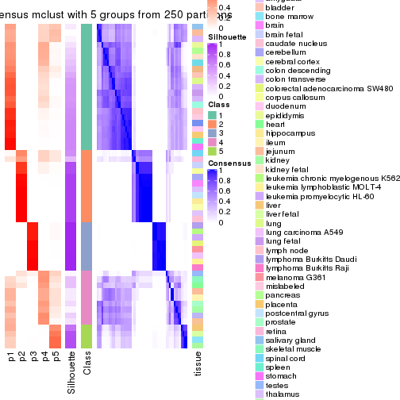</p>

</div>
<div id='tab-ATC-mclust-consensus-heatmap-5'>
<pre><code class="r">consensus_heatmap(res, k = 6)
</code></pre>

<p></p>

</div>
</div>

Heatmaps for the membership of samples in all partitions to see how consistent they are:


<script>
$( function() {
	$( '#tabs-ATC-mclust-membership-heatmap' ).tabs();
} );
</script>
<div id='tabs-ATC-mclust-membership-heatmap'>
<ul>
<li><a href='#tab-ATC-mclust-membership-heatmap-1'>k = 2</a></li>
<li><a href='#tab-ATC-mclust-membership-heatmap-2'>k = 3</a></li>
<li><a href='#tab-ATC-mclust-membership-heatmap-3'>k = 4</a></li>
<li><a href='#tab-ATC-mclust-membership-heatmap-4'>k = 5</a></li>
<li><a href='#tab-ATC-mclust-membership-heatmap-5'>k = 6</a></li>
</ul>
<div id='tab-ATC-mclust-membership-heatmap-1'>
<pre><code class="r">membership_heatmap(res, k = 2)
</code></pre>

<p></p>

</div>
<div id='tab-ATC-mclust-membership-heatmap-2'>
<pre><code class="r">membership_heatmap(res, k = 3)
</code></pre>

<p></p>

</div>
<div id='tab-ATC-mclust-membership-heatmap-3'>
<pre><code class="r">membership_heatmap(res, k = 4)
</code></pre>

<p></p>

</div>
<div id='tab-ATC-mclust-membership-heatmap-4'>
<pre><code class="r">membership_heatmap(res, k = 5)
</code></pre>

<p></p>

</div>
<div id='tab-ATC-mclust-membership-heatmap-5'>
<pre><code class="r">membership_heatmap(res, k = 6)
</code></pre>

<p></p>

</div>
</div>

As soon as we have had the classes for columns, we can look for signatures
which are significantly different between classes which can be candidate marks
for certain classes. Following are the heatmaps for signatures.


Signature heatmaps where rows are scaled:


<script>
$( function() {
	$( '#tabs-ATC-mclust-get-signatures' ).tabs();
} );
</script>
<div id='tabs-ATC-mclust-get-signatures'>
<ul>
<li><a href='#tab-ATC-mclust-get-signatures-1'>k = 2</a></li>
<li><a href='#tab-ATC-mclust-get-signatures-2'>k = 3</a></li>
<li><a href='#tab-ATC-mclust-get-signatures-3'>k = 4</a></li>
<li><a href='#tab-ATC-mclust-get-signatures-4'>k = 5</a></li>
<li><a href='#tab-ATC-mclust-get-signatures-5'>k = 6</a></li>
</ul>
<div id='tab-ATC-mclust-get-signatures-1'>
<pre><code class="r">get_signatures(res, k = 2)
</code></pre>

<p></p>

</div>
<div id='tab-ATC-mclust-get-signatures-2'>
<pre><code class="r">get_signatures(res, k = 3)
</code></pre>

<p></p>

</div>
<div id='tab-ATC-mclust-get-signatures-3'>
<pre><code class="r">get_signatures(res, k = 4)
</code></pre>

<p></p>

</div>
<div id='tab-ATC-mclust-get-signatures-4'>
<pre><code class="r">get_signatures(res, k = 5)
</code></pre>

<p></p>

</div>
<div id='tab-ATC-mclust-get-signatures-5'>
<pre><code class="r">get_signatures(res, k = 6)
</code></pre>

<p></p>

</div>
</div>


Signature heatmaps where rows are not scaled:


<script>
$( function() {
	$( '#tabs-ATC-mclust-get-signatures-no-scale' ).tabs();
} );
</script>
<div id='tabs-ATC-mclust-get-signatures-no-scale'>
<ul>
<li><a href='#tab-ATC-mclust-get-signatures-no-scale-1'>k = 2</a></li>
<li><a href='#tab-ATC-mclust-get-signatures-no-scale-2'>k = 3</a></li>
<li><a href='#tab-ATC-mclust-get-signatures-no-scale-3'>k = 4</a></li>
<li><a href='#tab-ATC-mclust-get-signatures-no-scale-4'>k = 5</a></li>
<li><a href='#tab-ATC-mclust-get-signatures-no-scale-5'>k = 6</a></li>
</ul>
<div id='tab-ATC-mclust-get-signatures-no-scale-1'>
<pre><code class="r">get_signatures(res, k = 2, scale_rows = FALSE)
</code></pre>

<p></p>

</div>
<div id='tab-ATC-mclust-get-signatures-no-scale-2'>
<pre><code class="r">get_signatures(res, k = 3, scale_rows = FALSE)
</code></pre>

<p></p>

</div>
<div id='tab-ATC-mclust-get-signatures-no-scale-3'>
<pre><code class="r">get_signatures(res, k = 4, scale_rows = FALSE)
</code></pre>

<p></p>

</div>
<div id='tab-ATC-mclust-get-signatures-no-scale-4'>
<pre><code class="r">get_signatures(res, k = 5, scale_rows = FALSE)
</code></pre>

<p></p>

</div>
<div id='tab-ATC-mclust-get-signatures-no-scale-5'>
<pre><code class="r">get_signatures(res, k = 6, scale_rows = FALSE)
</code></pre>

<p></p>

</div>
</div>


Compare the overlap of signatures from different k:

```r
compare_signatures(res)
```

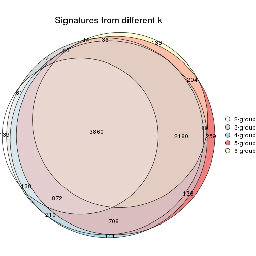

`get_signature()` returns a data frame invisibly. TO get the list of signatures, the function
call should be assigned to a variable explicitly. In following code, if `plot` argument is set
to `FALSE`, no heatmap is plotted while only the differential analysis is performed.

```r
# code only for demonstration
tb = get_signature(res, k = ..., plot = FALSE)
```

An example of the output of `tb` is:

```
#>   which_row         fdr    mean_1    mean_2 scaled_mean_1 scaled_mean_2 km
#> 1        38 0.042760348  8.373488  9.131774    -0.5533452     0.5164555  1
#> 2        40 0.018707592  7.106213  8.469186    -0.6173731     0.5762149  1
#> 3        55 0.019134737 10.221463 11.207825    -0.6159697     0.5749050  1
#> 4        59 0.006059896  5.921854  7.869574    -0.6899429     0.6439467  1
#> 5        60 0.018055526  8.928898 10.211722    -0.6204761     0.5791110  1
#> 6        98 0.009384629 15.714769 14.887706     0.6635654    -0.6193277  2
...
```

The columns in `tb` are:

1. `which_row`: row indices corresponding to the input matrix.
2. `fdr`: FDR for the differential test. 
3. `mean_x`: The mean value in group x.
4. `scaled_mean_x`: The mean value in group x after rows are scaled.
5. `km`: Row groups if k-means clustering is applied to rows.


UMAP plot which shows how samples are separated.


<script>
$( function() {
	$( '#tabs-ATC-mclust-dimension-reduction' ).tabs();
} );
</script>
<div id='tabs-ATC-mclust-dimension-reduction'>
<ul>
<li><a href='#tab-ATC-mclust-dimension-reduction-1'>k = 2</a></li>
<li><a href='#tab-ATC-mclust-dimension-reduction-2'>k = 3</a></li>
<li><a href='#tab-ATC-mclust-dimension-reduction-3'>k = 4</a></li>
<li><a href='#tab-ATC-mclust-dimension-reduction-4'>k = 5</a></li>
<li><a href='#tab-ATC-mclust-dimension-reduction-5'>k = 6</a></li>
</ul>
<div id='tab-ATC-mclust-dimension-reduction-1'>
<pre><code class="r">dimension_reduction(res, k = 2, method = &quot;UMAP&quot;)
</code></pre>

<p></p>

</div>
<div id='tab-ATC-mclust-dimension-reduction-2'>
<pre><code class="r">dimension_reduction(res, k = 3, method = &quot;UMAP&quot;)
</code></pre>

<p></p>

</div>
<div id='tab-ATC-mclust-dimension-reduction-3'>
<pre><code class="r">dimension_reduction(res, k = 4, method = &quot;UMAP&quot;)
</code></pre>

<p></p>

</div>
<div id='tab-ATC-mclust-dimension-reduction-4'>
<pre><code class="r">dimension_reduction(res, k = 5, method = &quot;UMAP&quot;)
</code></pre>

<p></p>

</div>
<div id='tab-ATC-mclust-dimension-reduction-5'>
<pre><code class="r">dimension_reduction(res, k = 6, method = &quot;UMAP&quot;)
</code></pre>

<p></p>

</div>
</div>


Following heatmap shows how subgroups are split when increasing `k`:

```r
collect_classes(res)
```


Test correlation between subgroups and known annotations. If the known
annotation is numeric, one-way ANOVA test is applied, and if the known
annotation is discrete, chi-squared contingency table test is applied.

```r
test_to_known_factors(res)
```

```
#>             n tissue(p) k
#> ATC:mclust 53     0.397 2
#> ATC:mclust 52     0.372 3
#> ATC:mclust 36     0.411 4
#> ATC:mclust 35     0.400 5
#> ATC:mclust 21     0.384 6
```


If matrix rows can be associated to genes, consider to use `functional_enrichment(res,
...)` to perform function enrichment for the signature genes. See [this vignette](http://bioconductor.org/packages/devel/bioc/vignettes/cola/inst/doc/functional_enrichment.html) for more detailed explanations.


 

---------------------------------------------------


### ATC:NMF**


The object with results only for a single top-value method and a single partition method 
can be extracted as:

```r
res = res_list["ATC", "NMF"]
# you can also extract it by
# res = res_list["ATC:NMF"]
```

A summary of `res` and all the functions that can be applied to it:

```r
res
```

```
#> A 'ConsensusPartition' object with k = 2, 3, 4, 5, 6.
#>   On a matrix with 12150 rows and 54 columns.
#>   Top rows (1000, 2000, 3000, 4000, 5000) are extracted by 'ATC' method.
#>   Subgroups are detected by 'NMF' method.
#>   Performed in total 1250 partitions by row resampling.
#>   Best k for subgroups seems to be 3.
#> 
#> Following methods can be applied to this 'ConsensusPartition' object:
#>  [1] "cola_report"             "collect_classes"         "collect_plots"          
#>  [4] "collect_stats"           "colnames"                "compare_signatures"     
#>  [7] "consensus_heatmap"       "dimension_reduction"     "functional_enrichment"  
#> [10] "get_anno_col"            "get_anno"                "get_classes"            
#> [13] "get_consensus"           "get_matrix"              "get_membership"         
#> [16] "get_param"               "get_signatures"          "get_stats"              
#> [19] "is_best_k"               "is_stable_k"             "membership_heatmap"     
#> [22] "ncol"                    "nrow"                    "plot_ecdf"              
#> [25] "rownames"                "select_partition_number" "show"                   
#> [28] "suggest_best_k"          "test_to_known_factors"
```

`collect_plots()` function collects all the plots made from `res` for all `k` (number of partitions)
into one single page to provide an easy and fast comparison between different `k`.

```r
collect_plots(res)
```


The plots are:

- The first row: a plot of the ECDF (empirical cumulative distribution
  function) curves of the consensus matrix for each `k` and the heatmap of
  predicted classes for each `k`.
- The second row: heatmaps of the consensus matrix for each `k`.
- The third row: heatmaps of the membership matrix for each `k`.
- The fouth row: heatmaps of the signatures for each `k`.

All the plots in panels can be made by individual functions and they are
plotted later in this section.

`select_partition_number()` produces several plots showing different
statistics for choosing "optimized" `k`. There are following statistics:

- ECDF curves of the consensus matrix for each `k`;
- 1-PAC. [The PAC
  score](https://en.wikipedia.org/wiki/Consensus_clustering#Over-interpretation_potential_of_consensus_clustering)
  measures the proportion of the ambiguous subgrouping.
- Mean silhouette score.
- Concordance. The mean probability of fiting the consensus class ids in all
  partitions.
- Area increased. Denote $A_k$ as the area under the ECDF curve for current
  `k`, the area increased is defined as $A_k - A_{k-1}$.
- Rand index. The percent of pairs of samples that are both in a same cluster
  or both are not in a same cluster in the partition of k and k-1.
- Jaccard index. The ratio of pairs of samples are both in a same cluster in
  the partition of k and k-1 and the pairs of samples are both in a same
  cluster in the partition k or k-1.

The detailed explanations of these statistics can be found in [the _cola_
vignette](http://bioconductor.org/packages/devel/bioc/vignettes/cola/inst/doc/cola.html#toc_13).

Generally speaking, lower PAC score, higher mean silhouette score or higher
concordance corresponds to better partition. Rand index and Jaccard index
measure how similar the current partition is compared to partition with `k-1`.
If they are too similar, we won't accept `k` is better than `k-1`.

```r
select_partition_number(res)
```


The numeric values for all these statistics can be obtained by `get_stats()`.

```r
get_stats(res)
```

```
#>   k 1-PAC mean_silhouette concordance area_increased  Rand Jaccard
#> 2 2 1.000           0.970       0.988         0.3822 0.628   0.628
#> 3 3 1.000           0.973       0.990         0.5715 0.728   0.580
#> 4 4 0.824           0.893       0.935         0.2377 0.829   0.578
#> 5 5 0.724           0.709       0.835         0.0471 0.983   0.931
#> 6 6 0.722           0.679       0.813         0.0417 0.880   0.552
```

`suggest_best_k()` suggests the best $k$ based on these statistics. The rules are as follows:

- All $k$ with Jaccard index larger than 0.95 are removed because increasing
  $k$ does not provide enough extra information. If all $k$ are removed, it is
  marked as no subgroup is detected.
- For all $k$ with 1-PAC score larger than 0.9, the maximal $k$ is taken as
  the best $k$, and other $k$ are marked as optional $k$.
- If it does not fit the second rule. The $k$ with the maximal vote of the
  highest 1-PAC score, highest mean silhouette, and highest concordance is
  taken as the best $k$.

```r
suggest_best_k(res)
```

```
#> [1] 3
#> attr(,"optional")
#> [1] 2
```

There is also optional best $k$ = 2 that is worth to check.

Following shows the table of the partitions (You need to click the **show/hide
code output** link to see it). The membership matrix (columns with name `p*`)
is inferred by
[`clue::cl_consensus()`](https://www.rdocumentation.org/link/cl_consensus?package=clue)
function with the `SE` method. Basically the value in the membership matrix
represents the probability to belong to a certain group. The finall class
label for an item is determined with the group with highest probability it
belongs to.

In `get_classes()` function, the entropy is calculated from the membership
matrix and the silhouette score is calculated from the consensus matrix.


<script>
$( function() {
	$( '#tabs-ATC-NMF-get-classes' ).tabs();
} );
</script>
<div id='tabs-ATC-NMF-get-classes'>
<ul>
<li><a href='#tab-ATC-NMF-get-classes-1'>k = 2</a></li>
<li><a href='#tab-ATC-NMF-get-classes-2'>k = 3</a></li>
<li><a href='#tab-ATC-NMF-get-classes-3'>k = 4</a></li>
<li><a href='#tab-ATC-NMF-get-classes-4'>k = 5</a></li>
<li><a href='#tab-ATC-NMF-get-classes-5'>k = 6</a></li>
</ul>

<div id='tab-ATC-NMF-get-classes-1'>
<p><a id='tab-ATC-NMF-get-classes-1-a' style='color:#0366d6' href='#'>show/hide code output</a></p>
<pre><code class="r">cbind(get_classes(res, k = 2), get_membership(res, k = 2))
</code></pre>

<pre><code>#&gt;          class entropy silhouette    p1    p2
#&gt; GSM28815     1  0.0376      0.982 0.996 0.004
#&gt; GSM28816     1  0.9686      0.350 0.604 0.396
#&gt; GSM28817     1  0.0376      0.982 0.996 0.004
#&gt; GSM11327     1  0.0000      0.985 1.000 0.000
#&gt; GSM28825     2  0.0000      0.993 0.000 1.000
#&gt; GSM11322     2  0.0000      0.993 0.000 1.000
#&gt; GSM28828     2  0.0000      0.993 0.000 1.000
#&gt; GSM11346     2  0.0000      0.993 0.000 1.000
#&gt; GSM28808     2  0.0000      0.993 0.000 1.000
#&gt; GSM11332     2  0.0000      0.993 0.000 1.000
#&gt; GSM28811     2  0.0000      0.993 0.000 1.000
#&gt; GSM11334     2  0.0000      0.993 0.000 1.000
#&gt; GSM11340     2  0.0000      0.993 0.000 1.000
#&gt; GSM28812     2  0.0000      0.993 0.000 1.000
#&gt; GSM11345     1  0.0000      0.985 1.000 0.000
#&gt; GSM28819     1  0.0000      0.985 1.000 0.000
#&gt; GSM11321     1  0.0000      0.985 1.000 0.000
#&gt; GSM28820     1  0.0000      0.985 1.000 0.000
#&gt; GSM11339     1  0.0376      0.982 0.996 0.004
#&gt; GSM28804     2  0.4022      0.910 0.080 0.920
#&gt; GSM28823     1  0.0000      0.985 1.000 0.000
#&gt; GSM11336     1  0.0000      0.985 1.000 0.000
#&gt; GSM11342     1  0.0000      0.985 1.000 0.000
#&gt; GSM11333     1  0.0376      0.982 0.996 0.004
#&gt; GSM28802     1  0.0000      0.985 1.000 0.000
#&gt; GSM28803     1  0.0000      0.985 1.000 0.000
#&gt; GSM11343     1  0.0000      0.985 1.000 0.000
#&gt; GSM11347     1  0.0000      0.985 1.000 0.000
#&gt; GSM28824     1  0.0000      0.985 1.000 0.000
#&gt; GSM28813     1  0.0000      0.985 1.000 0.000
#&gt; GSM28827     1  0.0000      0.985 1.000 0.000
#&gt; GSM11337     1  0.0000      0.985 1.000 0.000
#&gt; GSM28814     1  0.0000      0.985 1.000 0.000
#&gt; GSM11331     1  0.0000      0.985 1.000 0.000
#&gt; GSM11344     1  0.0000      0.985 1.000 0.000
#&gt; GSM11330     1  0.0000      0.985 1.000 0.000
#&gt; GSM11325     1  0.0000      0.985 1.000 0.000
#&gt; GSM11338     1  0.0000      0.985 1.000 0.000
#&gt; GSM28806     1  0.0000      0.985 1.000 0.000
#&gt; GSM28826     1  0.0000      0.985 1.000 0.000
#&gt; GSM28818     1  0.6801      0.777 0.820 0.180
#&gt; GSM28821     2  0.0000      0.993 0.000 1.000
#&gt; GSM28807     1  0.0000      0.985 1.000 0.000
#&gt; GSM28822     1  0.0000      0.985 1.000 0.000
#&gt; GSM11328     2  0.0000      0.993 0.000 1.000
#&gt; GSM11323     1  0.0000      0.985 1.000 0.000
#&gt; GSM11324     1  0.0000      0.985 1.000 0.000
#&gt; GSM11341     1  0.0000      0.985 1.000 0.000
#&gt; GSM11326     1  0.0000      0.985 1.000 0.000
#&gt; GSM28810     1  0.0000      0.985 1.000 0.000
#&gt; GSM11335     1  0.0000      0.985 1.000 0.000
#&gt; GSM28809     1  0.0000      0.985 1.000 0.000
#&gt; GSM11329     1  0.0000      0.985 1.000 0.000
#&gt; GSM28805     1  0.0000      0.985 1.000 0.000
</code></pre>

<script>
$('#tab-ATC-NMF-get-classes-1-a').parent().next().next().hide();
$('#tab-ATC-NMF-get-classes-1-a').click(function(){
  $('#tab-ATC-NMF-get-classes-1-a').parent().next().next().toggle();
  return(false);
});
</script>
</div>

<div id='tab-ATC-NMF-get-classes-2'>
<p><a id='tab-ATC-NMF-get-classes-2-a' style='color:#0366d6' href='#'>show/hide code output</a></p>
<pre><code class="r">cbind(get_classes(res, k = 3), get_membership(res, k = 3))
</code></pre>

<pre><code>#&gt;          class entropy silhouette    p1    p2    p3
#&gt; GSM28815     1  0.0000      0.995 1.000 0.000 0.000
#&gt; GSM28816     1  0.0000      0.995 1.000 0.000 0.000
#&gt; GSM28817     1  0.0000      0.995 1.000 0.000 0.000
#&gt; GSM11327     3  0.0000      0.953 0.000 0.000 1.000
#&gt; GSM28825     2  0.0000      1.000 0.000 1.000 0.000
#&gt; GSM11322     2  0.0000      1.000 0.000 1.000 0.000
#&gt; GSM28828     2  0.0000      1.000 0.000 1.000 0.000
#&gt; GSM11346     2  0.0000      1.000 0.000 1.000 0.000
#&gt; GSM28808     2  0.0000      1.000 0.000 1.000 0.000
#&gt; GSM11332     2  0.0000      1.000 0.000 1.000 0.000
#&gt; GSM28811     2  0.0000      1.000 0.000 1.000 0.000
#&gt; GSM11334     2  0.0000      1.000 0.000 1.000 0.000
#&gt; GSM11340     2  0.0000      1.000 0.000 1.000 0.000
#&gt; GSM28812     2  0.0000      1.000 0.000 1.000 0.000
#&gt; GSM11345     1  0.0000      0.995 1.000 0.000 0.000
#&gt; GSM28819     1  0.0000      0.995 1.000 0.000 0.000
#&gt; GSM11321     3  0.0000      0.953 0.000 0.000 1.000
#&gt; GSM28820     1  0.0000      0.995 1.000 0.000 0.000
#&gt; GSM11339     1  0.0000      0.995 1.000 0.000 0.000
#&gt; GSM28804     1  0.0747      0.980 0.984 0.016 0.000
#&gt; GSM28823     1  0.1163      0.970 0.972 0.000 0.028
#&gt; GSM11336     1  0.0000      0.995 1.000 0.000 0.000
#&gt; GSM11342     1  0.0000      0.995 1.000 0.000 0.000
#&gt; GSM11333     1  0.0000      0.995 1.000 0.000 0.000
#&gt; GSM28802     1  0.1163      0.970 0.972 0.000 0.028
#&gt; GSM28803     3  0.0000      0.953 0.000 0.000 1.000
#&gt; GSM11343     3  0.0000      0.953 0.000 0.000 1.000
#&gt; GSM11347     3  0.0000      0.953 0.000 0.000 1.000
#&gt; GSM28824     1  0.0000      0.995 1.000 0.000 0.000
#&gt; GSM28813     1  0.2537      0.913 0.920 0.000 0.080
#&gt; GSM28827     1  0.0000      0.995 1.000 0.000 0.000
#&gt; GSM11337     1  0.0000      0.995 1.000 0.000 0.000
#&gt; GSM28814     3  0.0000      0.953 0.000 0.000 1.000
#&gt; GSM11331     1  0.0000      0.995 1.000 0.000 0.000
#&gt; GSM11344     3  0.0000      0.953 0.000 0.000 1.000
#&gt; GSM11330     3  0.0000      0.953 0.000 0.000 1.000
#&gt; GSM11325     3  0.0000      0.953 0.000 0.000 1.000
#&gt; GSM11338     1  0.0000      0.995 1.000 0.000 0.000
#&gt; GSM28806     1  0.0000      0.995 1.000 0.000 0.000
#&gt; GSM28826     1  0.0000      0.995 1.000 0.000 0.000
#&gt; GSM28818     1  0.0000      0.995 1.000 0.000 0.000
#&gt; GSM28821     2  0.0000      1.000 0.000 1.000 0.000
#&gt; GSM28807     1  0.0000      0.995 1.000 0.000 0.000
#&gt; GSM28822     3  0.6079      0.355 0.388 0.000 0.612
#&gt; GSM11328     2  0.0000      1.000 0.000 1.000 0.000
#&gt; GSM11323     1  0.0000      0.995 1.000 0.000 0.000
#&gt; GSM11324     1  0.0000      0.995 1.000 0.000 0.000
#&gt; GSM11341     3  0.0000      0.953 0.000 0.000 1.000
#&gt; GSM11326     3  0.0000      0.953 0.000 0.000 1.000
#&gt; GSM28810     1  0.0000      0.995 1.000 0.000 0.000
#&gt; GSM11335     1  0.0000      0.995 1.000 0.000 0.000
#&gt; GSM28809     1  0.0000      0.995 1.000 0.000 0.000
#&gt; GSM11329     1  0.0000      0.995 1.000 0.000 0.000
#&gt; GSM28805     1  0.0000      0.995 1.000 0.000 0.000
</code></pre>

<script>
$('#tab-ATC-NMF-get-classes-2-a').parent().next().next().hide();
$('#tab-ATC-NMF-get-classes-2-a').click(function(){
  $('#tab-ATC-NMF-get-classes-2-a').parent().next().next().toggle();
  return(false);
});
</script>
</div>

<div id='tab-ATC-NMF-get-classes-3'>
<p><a id='tab-ATC-NMF-get-classes-3-a' style='color:#0366d6' href='#'>show/hide code output</a></p>
<pre><code class="r">cbind(get_classes(res, k = 4), get_membership(res, k = 4))
</code></pre>

<pre><code>#&gt;          class entropy silhouette    p1    p2    p3    p4
#&gt; GSM28815     1  0.3569      0.768 0.804 0.000 0.000 0.196
#&gt; GSM28816     1  0.1940      0.901 0.924 0.000 0.000 0.076
#&gt; GSM28817     4  0.4977      0.244 0.460 0.000 0.000 0.540
#&gt; GSM11327     3  0.3123      0.845 0.156 0.000 0.844 0.000
#&gt; GSM28825     2  0.0000      0.996 0.000 1.000 0.000 0.000
#&gt; GSM11322     2  0.0000      0.996 0.000 1.000 0.000 0.000
#&gt; GSM28828     2  0.0592      0.992 0.000 0.984 0.000 0.016
#&gt; GSM11346     2  0.0188      0.996 0.000 0.996 0.000 0.004
#&gt; GSM28808     2  0.0000      0.996 0.000 1.000 0.000 0.000
#&gt; GSM11332     2  0.0188      0.995 0.000 0.996 0.000 0.004
#&gt; GSM28811     2  0.0592      0.992 0.000 0.984 0.000 0.016
#&gt; GSM11334     2  0.0000      0.996 0.000 1.000 0.000 0.000
#&gt; GSM11340     2  0.0000      0.996 0.000 1.000 0.000 0.000
#&gt; GSM28812     2  0.0000      0.996 0.000 1.000 0.000 0.000
#&gt; GSM11345     4  0.3219      0.840 0.164 0.000 0.000 0.836
#&gt; GSM28819     4  0.3881      0.832 0.172 0.000 0.016 0.812
#&gt; GSM11321     3  0.0000      0.964 0.000 0.000 1.000 0.000
#&gt; GSM28820     1  0.2973      0.839 0.856 0.000 0.000 0.144
#&gt; GSM11339     4  0.4454      0.640 0.308 0.000 0.000 0.692
#&gt; GSM28804     4  0.2831      0.847 0.120 0.004 0.000 0.876
#&gt; GSM28823     4  0.1398      0.869 0.040 0.000 0.004 0.956
#&gt; GSM11336     1  0.0188      0.917 0.996 0.000 0.000 0.004
#&gt; GSM11342     4  0.1302      0.870 0.044 0.000 0.000 0.956
#&gt; GSM11333     1  0.2281      0.889 0.904 0.000 0.000 0.096
#&gt; GSM28802     4  0.1209      0.864 0.032 0.000 0.004 0.964
#&gt; GSM28803     3  0.0000      0.964 0.000 0.000 1.000 0.000
#&gt; GSM11343     3  0.0000      0.964 0.000 0.000 1.000 0.000
#&gt; GSM11347     3  0.0000      0.964 0.000 0.000 1.000 0.000
#&gt; GSM28824     1  0.0188      0.917 0.996 0.000 0.000 0.004
#&gt; GSM28813     1  0.1489      0.876 0.952 0.000 0.044 0.004
#&gt; GSM28827     4  0.2647      0.866 0.120 0.000 0.000 0.880
#&gt; GSM11337     1  0.0707      0.921 0.980 0.000 0.000 0.020
#&gt; GSM28814     3  0.0000      0.964 0.000 0.000 1.000 0.000
#&gt; GSM11331     1  0.1302      0.916 0.956 0.000 0.000 0.044
#&gt; GSM11344     3  0.0000      0.964 0.000 0.000 1.000 0.000
#&gt; GSM11330     3  0.0000      0.964 0.000 0.000 1.000 0.000
#&gt; GSM11325     3  0.0921      0.949 0.000 0.000 0.972 0.028
#&gt; GSM11338     1  0.0000      0.919 1.000 0.000 0.000 0.000
#&gt; GSM28806     4  0.1302      0.870 0.044 0.000 0.000 0.956
#&gt; GSM28826     1  0.0000      0.919 1.000 0.000 0.000 0.000
#&gt; GSM28818     1  0.1022      0.920 0.968 0.000 0.000 0.032
#&gt; GSM28821     2  0.0592      0.992 0.000 0.984 0.000 0.016
#&gt; GSM28807     1  0.0000      0.919 1.000 0.000 0.000 0.000
#&gt; GSM28822     4  0.3933      0.674 0.008 0.000 0.200 0.792
#&gt; GSM11328     2  0.0336      0.995 0.000 0.992 0.000 0.008
#&gt; GSM11323     1  0.2081      0.897 0.916 0.000 0.000 0.084
#&gt; GSM11324     1  0.4431      0.550 0.696 0.000 0.000 0.304
#&gt; GSM11341     3  0.0469      0.959 0.000 0.000 0.988 0.012
#&gt; GSM11326     3  0.3074      0.846 0.152 0.000 0.848 0.000
#&gt; GSM28810     4  0.1211      0.868 0.040 0.000 0.000 0.960
#&gt; GSM11335     1  0.1118      0.919 0.964 0.000 0.000 0.036
#&gt; GSM28809     1  0.0000      0.919 1.000 0.000 0.000 0.000
#&gt; GSM11329     4  0.2704      0.864 0.124 0.000 0.000 0.876
#&gt; GSM28805     4  0.2281      0.871 0.096 0.000 0.000 0.904
</code></pre>

<script>
$('#tab-ATC-NMF-get-classes-3-a').parent().next().next().hide();
$('#tab-ATC-NMF-get-classes-3-a').click(function(){
  $('#tab-ATC-NMF-get-classes-3-a').parent().next().next().toggle();
  return(false);
});
</script>
</div>

<div id='tab-ATC-NMF-get-classes-4'>
<p><a id='tab-ATC-NMF-get-classes-4-a' style='color:#0366d6' href='#'>show/hide code output</a></p>
<pre><code class="r">cbind(get_classes(res, k = 5), get_membership(res, k = 5))
</code></pre>

<pre><code>#&gt;          class entropy silhouette    p1    p2    p3    p4    p5
#&gt; GSM28815     5  0.6358      0.312 0.276 0.000 0.000 0.208 0.516
#&gt; GSM28816     5  0.3861      0.755 0.128 0.000 0.000 0.068 0.804
#&gt; GSM28817     1  0.4118      0.355 0.660 0.000 0.000 0.004 0.336
#&gt; GSM11327     3  0.3513      0.712 0.000 0.000 0.800 0.020 0.180
#&gt; GSM28825     2  0.0290      0.991 0.000 0.992 0.000 0.008 0.000
#&gt; GSM11322     2  0.0162      0.991 0.004 0.996 0.000 0.000 0.000
#&gt; GSM28828     2  0.1117      0.979 0.020 0.964 0.000 0.016 0.000
#&gt; GSM11346     2  0.0451      0.991 0.004 0.988 0.000 0.008 0.000
#&gt; GSM28808     2  0.0162      0.992 0.000 0.996 0.000 0.004 0.000
#&gt; GSM11332     2  0.0162      0.991 0.004 0.996 0.000 0.000 0.000
#&gt; GSM28811     2  0.0912      0.983 0.012 0.972 0.000 0.016 0.000
#&gt; GSM11334     2  0.0000      0.991 0.000 1.000 0.000 0.000 0.000
#&gt; GSM11340     2  0.0162      0.991 0.004 0.996 0.000 0.000 0.000
#&gt; GSM28812     2  0.0162      0.992 0.000 0.996 0.000 0.004 0.000
#&gt; GSM11345     1  0.3670      0.585 0.820 0.000 0.000 0.068 0.112
#&gt; GSM28819     1  0.4695      0.566 0.780 0.000 0.040 0.084 0.096
#&gt; GSM11321     3  0.1851      0.827 0.000 0.000 0.912 0.088 0.000
#&gt; GSM28820     5  0.3863      0.663 0.248 0.000 0.000 0.012 0.740
#&gt; GSM11339     1  0.5692      0.324 0.628 0.000 0.000 0.168 0.204
#&gt; GSM28804     4  0.5611      0.656 0.344 0.012 0.000 0.584 0.060
#&gt; GSM28823     1  0.4622      0.516 0.712 0.000 0.004 0.240 0.044
#&gt; GSM11336     5  0.0693      0.790 0.008 0.000 0.000 0.012 0.980
#&gt; GSM11342     1  0.4536      0.522 0.712 0.000 0.000 0.240 0.048
#&gt; GSM11333     5  0.4803      0.645 0.096 0.000 0.000 0.184 0.720
#&gt; GSM28802     1  0.3695      0.548 0.800 0.000 0.000 0.164 0.036
#&gt; GSM28803     3  0.1197      0.847 0.000 0.000 0.952 0.048 0.000
#&gt; GSM11343     3  0.0162      0.851 0.000 0.000 0.996 0.004 0.000
#&gt; GSM11347     3  0.0290      0.851 0.000 0.000 0.992 0.008 0.000
#&gt; GSM28824     5  0.0451      0.790 0.004 0.000 0.000 0.008 0.988
#&gt; GSM28813     5  0.2104      0.726 0.000 0.000 0.060 0.024 0.916
#&gt; GSM28827     1  0.2362      0.603 0.900 0.000 0.000 0.024 0.076
#&gt; GSM11337     5  0.3409      0.769 0.160 0.000 0.000 0.024 0.816
#&gt; GSM28814     3  0.1197      0.846 0.000 0.000 0.952 0.048 0.000
#&gt; GSM11331     5  0.3851      0.708 0.212 0.000 0.004 0.016 0.768
#&gt; GSM11344     3  0.0404      0.851 0.000 0.000 0.988 0.012 0.000
#&gt; GSM11330     3  0.1410      0.842 0.000 0.000 0.940 0.060 0.000
#&gt; GSM11325     3  0.4065      0.664 0.016 0.000 0.720 0.264 0.000
#&gt; GSM11338     5  0.0960      0.795 0.016 0.000 0.004 0.008 0.972
#&gt; GSM28806     1  0.5185      0.363 0.596 0.000 0.008 0.360 0.036
#&gt; GSM28826     5  0.0693      0.797 0.012 0.000 0.000 0.008 0.980
#&gt; GSM28818     5  0.2233      0.796 0.080 0.000 0.000 0.016 0.904
#&gt; GSM28821     2  0.0510      0.987 0.016 0.984 0.000 0.000 0.000
#&gt; GSM28807     5  0.0693      0.795 0.008 0.000 0.000 0.012 0.980
#&gt; GSM28822     4  0.4985      0.707 0.244 0.000 0.076 0.680 0.000
#&gt; GSM11328     2  0.0451      0.991 0.004 0.988 0.000 0.008 0.000
#&gt; GSM11323     5  0.4445      0.623 0.300 0.000 0.000 0.024 0.676
#&gt; GSM11324     5  0.4561      0.148 0.488 0.000 0.000 0.008 0.504
#&gt; GSM11341     3  0.4151      0.522 0.000 0.000 0.652 0.344 0.004
#&gt; GSM11326     3  0.4167      0.607 0.000 0.000 0.724 0.024 0.252
#&gt; GSM28810     1  0.4824     -0.462 0.512 0.000 0.000 0.468 0.020
#&gt; GSM11335     5  0.4618      0.733 0.192 0.000 0.024 0.036 0.748
#&gt; GSM28809     5  0.0671      0.797 0.016 0.000 0.000 0.004 0.980
#&gt; GSM11329     1  0.2795      0.613 0.872 0.000 0.000 0.028 0.100
#&gt; GSM28805     1  0.4252      0.469 0.764 0.000 0.000 0.172 0.064
</code></pre>

<script>
$('#tab-ATC-NMF-get-classes-4-a').parent().next().next().hide();
$('#tab-ATC-NMF-get-classes-4-a').click(function(){
  $('#tab-ATC-NMF-get-classes-4-a').parent().next().next().toggle();
  return(false);
});
</script>
</div>

<div id='tab-ATC-NMF-get-classes-5'>
<p><a id='tab-ATC-NMF-get-classes-5-a' style='color:#0366d6' href='#'>show/hide code output</a></p>
<pre><code class="r">cbind(get_classes(res, k = 6), get_membership(res, k = 6))
</code></pre>

<pre><code>#&gt;          class entropy silhouette    p1    p2    p3    p4    p5    p6
#&gt; GSM28815     1  0.6074     0.1182 0.452 0.000 0.000 0.336 0.204 0.008
#&gt; GSM28816     5  0.4524     0.4741 0.336 0.000 0.000 0.048 0.616 0.000
#&gt; GSM28817     1  0.3054     0.6258 0.848 0.000 0.000 0.004 0.076 0.072
#&gt; GSM11327     3  0.4486     0.6792 0.004 0.000 0.756 0.052 0.144 0.044
#&gt; GSM28825     2  0.0520     0.9870 0.000 0.984 0.000 0.000 0.008 0.008
#&gt; GSM11322     2  0.0000     0.9885 0.000 1.000 0.000 0.000 0.000 0.000
#&gt; GSM28828     2  0.1232     0.9731 0.004 0.956 0.000 0.000 0.016 0.024
#&gt; GSM11346     2  0.0520     0.9863 0.000 0.984 0.000 0.000 0.008 0.008
#&gt; GSM28808     2  0.0146     0.9884 0.000 0.996 0.000 0.000 0.004 0.000
#&gt; GSM11332     2  0.0146     0.9878 0.000 0.996 0.000 0.000 0.000 0.004
#&gt; GSM28811     2  0.1049     0.9720 0.000 0.960 0.000 0.000 0.008 0.032
#&gt; GSM11334     2  0.0146     0.9878 0.000 0.996 0.000 0.000 0.000 0.004
#&gt; GSM11340     2  0.0000     0.9885 0.000 1.000 0.000 0.000 0.000 0.000
#&gt; GSM28812     2  0.0000     0.9885 0.000 1.000 0.000 0.000 0.000 0.000
#&gt; GSM11345     1  0.3039     0.5950 0.868 0.000 0.008 0.040 0.020 0.064
#&gt; GSM28819     1  0.4571     0.5168 0.760 0.000 0.052 0.072 0.004 0.112
#&gt; GSM11321     3  0.4683     0.5037 0.000 0.000 0.616 0.064 0.000 0.320
#&gt; GSM28820     1  0.4934     0.1602 0.488 0.000 0.000 0.004 0.456 0.052
#&gt; GSM11339     1  0.3715     0.5987 0.800 0.000 0.000 0.132 0.052 0.016
#&gt; GSM28804     4  0.3798     0.7357 0.216 0.000 0.000 0.748 0.032 0.004
#&gt; GSM28823     6  0.4599     0.6463 0.328 0.000 0.000 0.028 0.016 0.628
#&gt; GSM11336     5  0.1176     0.7992 0.024 0.000 0.000 0.000 0.956 0.020
#&gt; GSM11342     6  0.4495     0.6384 0.340 0.000 0.000 0.020 0.016 0.624
#&gt; GSM11333     5  0.5032     0.5871 0.216 0.000 0.000 0.132 0.648 0.004
#&gt; GSM28802     6  0.4284     0.5003 0.392 0.000 0.000 0.016 0.004 0.588
#&gt; GSM28803     3  0.2527     0.7937 0.000 0.000 0.884 0.064 0.004 0.048
#&gt; GSM11343     3  0.0291     0.8023 0.000 0.000 0.992 0.004 0.000 0.004
#&gt; GSM11347     3  0.1794     0.7987 0.000 0.000 0.924 0.036 0.000 0.040
#&gt; GSM28824     5  0.1088     0.8005 0.024 0.000 0.000 0.000 0.960 0.016
#&gt; GSM28813     5  0.3347     0.6998 0.004 0.000 0.072 0.040 0.848 0.036
#&gt; GSM28827     1  0.2556     0.5476 0.864 0.000 0.000 0.008 0.008 0.120
#&gt; GSM11337     1  0.4170     0.4396 0.648 0.000 0.000 0.020 0.328 0.004
#&gt; GSM28814     3  0.1863     0.7970 0.000 0.000 0.920 0.044 0.000 0.036
#&gt; GSM11331     1  0.5119     0.3897 0.580 0.000 0.008 0.040 0.356 0.016
#&gt; GSM11344     3  0.1720     0.8003 0.000 0.000 0.928 0.032 0.000 0.040
#&gt; GSM11330     3  0.3424     0.7566 0.000 0.000 0.812 0.092 0.000 0.096
#&gt; GSM11325     6  0.5405     0.0567 0.004 0.000 0.292 0.132 0.000 0.572
#&gt; GSM11338     5  0.2643     0.7979 0.108 0.000 0.004 0.016 0.868 0.004
#&gt; GSM28806     6  0.3785     0.5790 0.136 0.000 0.012 0.020 0.028 0.804
#&gt; GSM28826     5  0.2851     0.7881 0.132 0.000 0.000 0.020 0.844 0.004
#&gt; GSM28818     5  0.3409     0.6000 0.300 0.000 0.000 0.000 0.700 0.000
#&gt; GSM28821     2  0.0696     0.9846 0.004 0.980 0.000 0.004 0.008 0.004
#&gt; GSM28807     5  0.1267     0.8109 0.060 0.000 0.000 0.000 0.940 0.000
#&gt; GSM28822     4  0.3072     0.7319 0.084 0.000 0.036 0.856 0.000 0.024
#&gt; GSM11328     2  0.0622     0.9860 0.000 0.980 0.000 0.000 0.012 0.008
#&gt; GSM11323     1  0.3940     0.6369 0.772 0.000 0.004 0.048 0.168 0.008
#&gt; GSM11324     1  0.2113     0.6585 0.896 0.000 0.000 0.008 0.092 0.004
#&gt; GSM11341     3  0.5125     0.4057 0.000 0.000 0.556 0.360 0.004 0.080
#&gt; GSM11326     3  0.4265     0.6962 0.012 0.000 0.776 0.060 0.132 0.020
#&gt; GSM28810     1  0.4091    -0.1890 0.520 0.000 0.000 0.472 0.000 0.008
#&gt; GSM11335     1  0.5677     0.5459 0.652 0.000 0.048 0.056 0.216 0.028
#&gt; GSM28809     5  0.1814     0.8093 0.100 0.000 0.000 0.000 0.900 0.000
#&gt; GSM11329     1  0.3229     0.4936 0.804 0.000 0.000 0.004 0.020 0.172
#&gt; GSM28805     1  0.2264     0.6210 0.888 0.000 0.000 0.096 0.012 0.004
</code></pre>

<script>
$('#tab-ATC-NMF-get-classes-5-a').parent().next().next().hide();
$('#tab-ATC-NMF-get-classes-5-a').click(function(){
  $('#tab-ATC-NMF-get-classes-5-a').parent().next().next().toggle();
  return(false);
});
</script>
</div>
</div>

Heatmaps for the consensus matrix. It visualizes the probability of two
samples to be in a same group.


<script>
$( function() {
	$( '#tabs-ATC-NMF-consensus-heatmap' ).tabs();
} );
</script>
<div id='tabs-ATC-NMF-consensus-heatmap'>
<ul>
<li><a href='#tab-ATC-NMF-consensus-heatmap-1'>k = 2</a></li>
<li><a href='#tab-ATC-NMF-consensus-heatmap-2'>k = 3</a></li>
<li><a href='#tab-ATC-NMF-consensus-heatmap-3'>k = 4</a></li>
<li><a href='#tab-ATC-NMF-consensus-heatmap-4'>k = 5</a></li>
<li><a href='#tab-ATC-NMF-consensus-heatmap-5'>k = 6</a></li>
</ul>
<div id='tab-ATC-NMF-consensus-heatmap-1'>
<pre><code class="r">consensus_heatmap(res, k = 2)
</code></pre>

<p></p>

</div>
<div id='tab-ATC-NMF-consensus-heatmap-2'>
<pre><code class="r">consensus_heatmap(res, k = 3)
</code></pre>

<p></p>

</div>
<div id='tab-ATC-NMF-consensus-heatmap-3'>
<pre><code class="r">consensus_heatmap(res, k = 4)
</code></pre>

<p></p>

</div>
<div id='tab-ATC-NMF-consensus-heatmap-4'>
<pre><code class="r">consensus_heatmap(res, k = 5)
</code></pre>

<p></p>

</div>
<div id='tab-ATC-NMF-consensus-heatmap-5'>
<pre><code class="r">consensus_heatmap(res, k = 6)
</code></pre>

<p></p>

</div>
</div>

Heatmaps for the membership of samples in all partitions to see how consistent they are:


<script>
$( function() {
	$( '#tabs-ATC-NMF-membership-heatmap' ).tabs();
} );
</script>
<div id='tabs-ATC-NMF-membership-heatmap'>
<ul>
<li><a href='#tab-ATC-NMF-membership-heatmap-1'>k = 2</a></li>
<li><a href='#tab-ATC-NMF-membership-heatmap-2'>k = 3</a></li>
<li><a href='#tab-ATC-NMF-membership-heatmap-3'>k = 4</a></li>
<li><a href='#tab-ATC-NMF-membership-heatmap-4'>k = 5</a></li>
<li><a href='#tab-ATC-NMF-membership-heatmap-5'>k = 6</a></li>
</ul>
<div id='tab-ATC-NMF-membership-heatmap-1'>
<pre><code class="r">membership_heatmap(res, k = 2)
</code></pre>

<p></p>

</div>
<div id='tab-ATC-NMF-membership-heatmap-2'>
<pre><code class="r">membership_heatmap(res, k = 3)
</code></pre>

<p></p>

</div>
<div id='tab-ATC-NMF-membership-heatmap-3'>
<pre><code class="r">membership_heatmap(res, k = 4)
</code></pre>

<p></p>

</div>
<div id='tab-ATC-NMF-membership-heatmap-4'>
<pre><code class="r">membership_heatmap(res, k = 5)
</code></pre>

<p></p>

</div>
<div id='tab-ATC-NMF-membership-heatmap-5'>
<pre><code class="r">membership_heatmap(res, k = 6)
</code></pre>

<p></p>

</div>
</div>

As soon as we have had the classes for columns, we can look for signatures
which are significantly different between classes which can be candidate marks
for certain classes. Following are the heatmaps for signatures.


Signature heatmaps where rows are scaled:


<script>
$( function() {
	$( '#tabs-ATC-NMF-get-signatures' ).tabs();
} );
</script>
<div id='tabs-ATC-NMF-get-signatures'>
<ul>
<li><a href='#tab-ATC-NMF-get-signatures-1'>k = 2</a></li>
<li><a href='#tab-ATC-NMF-get-signatures-2'>k = 3</a></li>
<li><a href='#tab-ATC-NMF-get-signatures-3'>k = 4</a></li>
<li><a href='#tab-ATC-NMF-get-signatures-4'>k = 5</a></li>
<li><a href='#tab-ATC-NMF-get-signatures-5'>k = 6</a></li>
</ul>
<div id='tab-ATC-NMF-get-signatures-1'>
<pre><code class="r">get_signatures(res, k = 2)
</code></pre>

<p></p>

</div>
<div id='tab-ATC-NMF-get-signatures-2'>
<pre><code class="r">get_signatures(res, k = 3)
</code></pre>

<p></p>

</div>
<div id='tab-ATC-NMF-get-signatures-3'>
<pre><code class="r">get_signatures(res, k = 4)
</code></pre>

<p></p>

</div>
<div id='tab-ATC-NMF-get-signatures-4'>
<pre><code class="r">get_signatures(res, k = 5)
</code></pre>

<p></p>

</div>
<div id='tab-ATC-NMF-get-signatures-5'>
<pre><code class="r">get_signatures(res, k = 6)
</code></pre>

<p></p>

</div>
</div>


Signature heatmaps where rows are not scaled:


<script>
$( function() {
	$( '#tabs-ATC-NMF-get-signatures-no-scale' ).tabs();
} );
</script>
<div id='tabs-ATC-NMF-get-signatures-no-scale'>
<ul>
<li><a href='#tab-ATC-NMF-get-signatures-no-scale-1'>k = 2</a></li>
<li><a href='#tab-ATC-NMF-get-signatures-no-scale-2'>k = 3</a></li>
<li><a href='#tab-ATC-NMF-get-signatures-no-scale-3'>k = 4</a></li>
<li><a href='#tab-ATC-NMF-get-signatures-no-scale-4'>k = 5</a></li>
<li><a href='#tab-ATC-NMF-get-signatures-no-scale-5'>k = 6</a></li>
</ul>
<div id='tab-ATC-NMF-get-signatures-no-scale-1'>
<pre><code class="r">get_signatures(res, k = 2, scale_rows = FALSE)
</code></pre>

<p>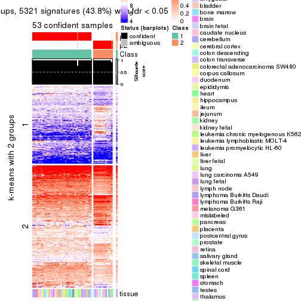</p>

</div>
<div id='tab-ATC-NMF-get-signatures-no-scale-2'>
<pre><code class="r">get_signatures(res, k = 3, scale_rows = FALSE)
</code></pre>

<p></p>

</div>
<div id='tab-ATC-NMF-get-signatures-no-scale-3'>
<pre><code class="r">get_signatures(res, k = 4, scale_rows = FALSE)
</code></pre>

<p></p>

</div>
<div id='tab-ATC-NMF-get-signatures-no-scale-4'>
<pre><code class="r">get_signatures(res, k = 5, scale_rows = FALSE)
</code></pre>

<p></p>

</div>
<div id='tab-ATC-NMF-get-signatures-no-scale-5'>
<pre><code class="r">get_signatures(res, k = 6, scale_rows = FALSE)
</code></pre>

<p></p>

</div>
</div>


Compare the overlap of signatures from different k:

```r
compare_signatures(res)
```


`get_signature()` returns a data frame invisibly. TO get the list of signatures, the function
call should be assigned to a variable explicitly. In following code, if `plot` argument is set
to `FALSE`, no heatmap is plotted while only the differential analysis is performed.

```r
# code only for demonstration
tb = get_signature(res, k = ..., plot = FALSE)
```

An example of the output of `tb` is:

```
#>   which_row         fdr    mean_1    mean_2 scaled_mean_1 scaled_mean_2 km
#> 1        38 0.042760348  8.373488  9.131774    -0.5533452     0.5164555  1
#> 2        40 0.018707592  7.106213  8.469186    -0.6173731     0.5762149  1
#> 3        55 0.019134737 10.221463 11.207825    -0.6159697     0.5749050  1
#> 4        59 0.006059896  5.921854  7.869574    -0.6899429     0.6439467  1
#> 5        60 0.018055526  8.928898 10.211722    -0.6204761     0.5791110  1
#> 6        98 0.009384629 15.714769 14.887706     0.6635654    -0.6193277  2
...
```

The columns in `tb` are:

1. `which_row`: row indices corresponding to the input matrix.
2. `fdr`: FDR for the differential test. 
3. `mean_x`: The mean value in group x.
4. `scaled_mean_x`: The mean value in group x after rows are scaled.
5. `km`: Row groups if k-means clustering is applied to rows.


UMAP plot which shows how samples are separated.


<script>
$( function() {
	$( '#tabs-ATC-NMF-dimension-reduction' ).tabs();
} );
</script>
<div id='tabs-ATC-NMF-dimension-reduction'>
<ul>
<li><a href='#tab-ATC-NMF-dimension-reduction-1'>k = 2</a></li>
<li><a href='#tab-ATC-NMF-dimension-reduction-2'>k = 3</a></li>
<li><a href='#tab-ATC-NMF-dimension-reduction-3'>k = 4</a></li>
<li><a href='#tab-ATC-NMF-dimension-reduction-4'>k = 5</a></li>
<li><a href='#tab-ATC-NMF-dimension-reduction-5'>k = 6</a></li>
</ul>
<div id='tab-ATC-NMF-dimension-reduction-1'>
<pre><code class="r">dimension_reduction(res, k = 2, method = &quot;UMAP&quot;)
</code></pre>

<p></p>

</div>
<div id='tab-ATC-NMF-dimension-reduction-2'>
<pre><code class="r">dimension_reduction(res, k = 3, method = &quot;UMAP&quot;)
</code></pre>

<p></p>

</div>
<div id='tab-ATC-NMF-dimension-reduction-3'>
<pre><code class="r">dimension_reduction(res, k = 4, method = &quot;UMAP&quot;)
</code></pre>

<p></p>

</div>
<div id='tab-ATC-NMF-dimension-reduction-4'>
<pre><code class="r">dimension_reduction(res, k = 5, method = &quot;UMAP&quot;)
</code></pre>

<p></p>

</div>
<div id='tab-ATC-NMF-dimension-reduction-5'>
<pre><code class="r">dimension_reduction(res, k = 6, method = &quot;UMAP&quot;)
</code></pre>

<p></p>

</div>
</div>


Following heatmap shows how subgroups are split when increasing `k`:

```r
collect_classes(res)
```


Test correlation between subgroups and known annotations. If the known
annotation is numeric, one-way ANOVA test is applied, and if the known
annotation is discrete, chi-squared contingency table test is applied.

```r
test_to_known_factors(res)
```

```
#>          n tissue(p) k
#> ATC:NMF 53     0.397 2
#> ATC:NMF 53     0.373 3
#> ATC:NMF 53     0.431 4
#> ATC:NMF 47     0.422 5
#> ATC:NMF 45     0.451 6
```


If matrix rows can be associated to genes, consider to use `functional_enrichment(res,
...)` to perform function enrichment for the signature genes. See [this vignette](http://bioconductor.org/packages/devel/bioc/vignettes/cola/inst/doc/functional_enrichment.html) for more detailed explanations.


 

## Session info


```r
sessionInfo()
```

```
#> R version 3.6.0 (2019-04-26)
#> Platform: x86_64-pc-linux-gnu (64-bit)
#> Running under: CentOS Linux 7 (Core)
#> 
#> Matrix products: default
#> BLAS:   /usr/lib64/libblas.so.3.4.2
#> LAPACK: /usr/lib64/liblapack.so.3.4.2
#> 
#> locale:
#>  [1] LC_CTYPE=en_GB.UTF-8       LC_NUMERIC=C               LC_TIME=en_GB.UTF-8       
#>  [4] LC_COLLATE=en_GB.UTF-8     LC_MONETARY=en_GB.UTF-8    LC_MESSAGES=en_GB.UTF-8   
#>  [7] LC_PAPER=en_GB.UTF-8       LC_NAME=C                  LC_ADDRESS=C              
#> [10] LC_TELEPHONE=C             LC_MEASUREMENT=en_GB.UTF-8 LC_IDENTIFICATION=C       
#> 
#> attached base packages:
#> [1] grid      stats     graphics  grDevices utils     datasets  methods   base     
#> 
#> other attached packages:
#> [1] genefilter_1.66.0    ComplexHeatmap_2.3.1 markdown_1.1         knitr_1.26          
#> [5] GetoptLong_0.1.7     cola_1.3.2          
#> 
#> loaded via a namespace (and not attached):
#>  [1] circlize_0.4.8       shape_1.4.4          xfun_0.11            slam_0.1-46         
#>  [5] lattice_0.20-38      splines_3.6.0        colorspace_1.4-1     vctrs_0.2.0         
#>  [9] stats4_3.6.0         blob_1.2.0           XML_3.98-1.20        survival_2.44-1.1   
#> [13] rlang_0.4.2          pillar_1.4.2         DBI_1.0.0            BiocGenerics_0.30.0 
#> [17] bit64_0.9-7          RColorBrewer_1.1-2   matrixStats_0.55.0   stringr_1.4.0       
#> [21] GlobalOptions_0.1.1  evaluate_0.14        memoise_1.1.0        Biobase_2.44.0      
#> [25] IRanges_2.18.3       parallel_3.6.0       AnnotationDbi_1.46.1 highr_0.8           
#> [29] Rcpp_1.0.3           xtable_1.8-4         backports_1.1.5      S4Vectors_0.22.1    
#> [33] annotate_1.62.0      skmeans_0.2-11       bit_1.1-14           microbenchmark_1.4-7
#> [37] brew_1.0-6           impute_1.58.0        rjson_0.2.20         png_0.1-7           
#> [41] digest_0.6.23        stringi_1.4.3        polyclip_1.10-0      clue_0.3-57         
#> [45] tools_3.6.0          bitops_1.0-6         magrittr_1.5         eulerr_6.0.0        
#> [49] RCurl_1.95-4.12      RSQLite_2.1.4        tibble_2.1.3         cluster_2.1.0       
#> [53] crayon_1.3.4         pkgconfig_2.0.3      zeallot_0.1.0        Matrix_1.2-17       
#> [57] xml2_1.2.2           httr_1.4.1           R6_2.4.1             mclust_5.4.5        
#> [61] compiler_3.6.0
```


